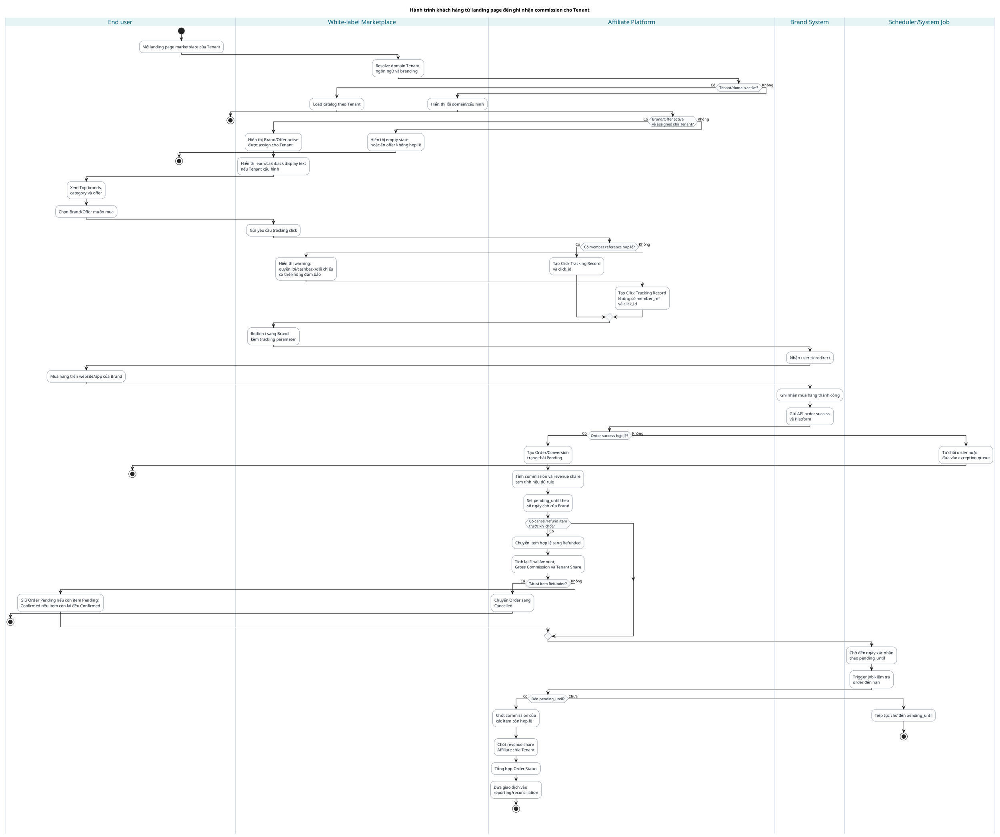

# Activity Diagram: Hành trình khách hàng từ landing page đến ghi nhận commission cho Tenant

## Document control

- Status: Draft
- Owner: TBD
- Related modeling: [docs/modeling/affiliate-marketplace-platform-modeling.md](./affiliate-marketplace-platform-modeling.md)
- Related use cases: [docs/usecases/affiliate-marketplace-platform-usecase-list.md](../usecases/affiliate-marketplace-platform-usecase-list.md)
- Related mockup: [docs/mockups/affiliate-marketplace-landing-page-desktop.html](../mockups/affiliate-marketplace-landing-page-desktop.html)
- Last updated: 2026-07-23

## Scope

Activity diagram này mô tả hành trình End user từ lúc vào landing page white-label của Tenant, chọn Brand/Offer, được redirect sang Brand để mua hàng, Brand báo order success, Platform chờ số ngày theo cấu hình Brand, sau đó chốt commission Brand trả Affiliate và revenue share Affiliate chia Tenant.

Theo CR-01, MVP1 không làm cashback B1, không tính/cộng điểm cho End user và không gọi Tenant Loyalty API. Các nội dung earn/cashback nếu hiển thị trên landing page chỉ là display text do Tenant cấu hình.

## Activity diagram with swimlanes - PlantUML

## Main success path

| Step | Lane | Mô tả | Trace |
|---|---|---|---|
| 1 | End user | Mở landing page marketplace của Tenant. | UC-010, FR-014 |
| 2 | Marketplace/Platform | Resolve Tenant, load catalog và chỉ hiển thị Brand/Offer được assigned active. | UC-010, UC-011, FR-015, BRULE-024 |
| 3 | Marketplace | Hiển thị earn/cashback display text nếu Tenant cấu hình, ví dụ `Nhận x điểm với mỗi 20,000đ chi tiêu`. | UC-010, FR-016 |
| 4 | End user/Marketplace/Platform | End user chọn Brand/Offer; Platform tạo click_id và redirect sang Brand. Banner và click Banner thuộc Deferred/Phase 2. | UC-012, FR-017, FR-018 |
| 5 | Brand System | Brand ghi nhận mua hàng thành công và gửi API order success. | UC-013, FR-019 |
| 6 | Platform | Validate order, click_id, visibility; tạo order `Pending` và tính commission/revenue share tạm tính. | UC-013, FR-020..FR-022 |
| 7 | Scheduler/Platform | Chờ đến `pending_until` theo số ngày cấu hình của Brand. | UC-016, FR-007, FR-025 |
| 8 | Platform | Nếu không có cancel/refund, chốt commission Brand trả Affiliate. | UC-016, FR-024, FR-025 |
| 9 | Platform | Chốt revenue share Affiliate chia Tenant và đưa vào reporting/reconciliation. | UC-016, UC-020, FR-030 |

## Alternate paths

| Case | Điều kiện | Kết quả |
|---|---|---|
| Tenant/domain không active | Không resolve được marketplace hoặc domain config lỗi. | Hiển thị lỗi domain/cấu hình, không load catalog. |
| Không có Brand/Offer phù hợp | Brand/Offer không active, hết hiệu lực hoặc chưa assign cho Tenant. | Ẩn offer hoặc hiển thị empty state. |
| Thiếu member reference | End User chưa định danh trước khi click. | Hiển thị warning quyền lợi/cashback/đối chiếu hội viên; vẫn tạo click tracking và redirect. |
| Order success invalid | Auth/schema/idempotency/click_id/visibility không hợp lệ. | Reject hoặc đưa vào exception queue, không tạo order pending. |
| Brand báo hoàn/hủy | Cancel/refund toàn bộ một hoặc nhiều item đến khi Order còn `Pending`. | Item chuyển `Refunded`; Platform tính lại số liệu và tổng hợp Order Status. Chỉ khi tất cả item Refunded thì Order chuyển `Cancelled`; Order đã Confirmed bị từ chối và ghi Exception. |
| Tenant Loyalty API lỗi | Deferred sau MVP1. | Không áp dụng trong MVP1. |

## Notes

- Diagram này phản ánh CR-01: không có B1, point conversion, Tenant Loyalty API hoặc trạng thái `Rewarded/Đã hoàn điểm` trong MVP1.
- Landing page mockup hiện tại không hiển thị số điểm dự kiến cụ thể; chỉ hiển thị earn/cashback display text.
- Cancel/refund contract được đặc tả tại Order Transaction SRS: xử lý theo item cho Order `Pending`; Order `Confirmed` bị từ chối và ghi Exception.

## Readiness

`READY_FOR_SRS`
