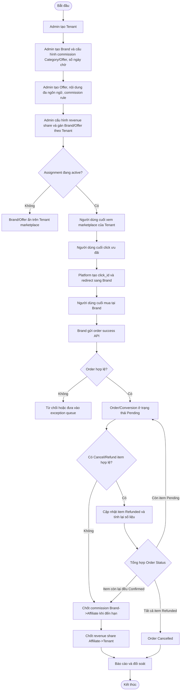
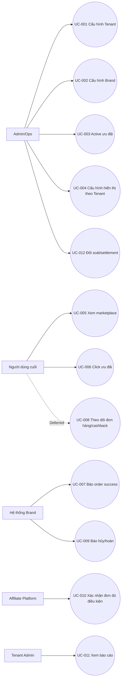
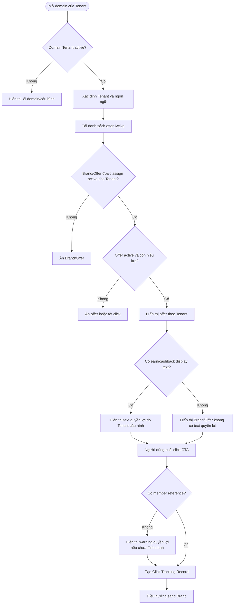
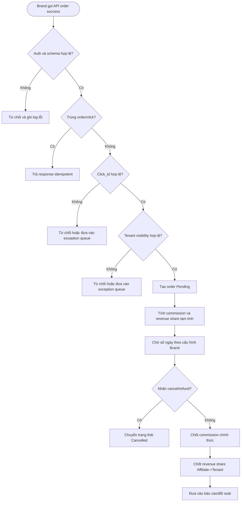
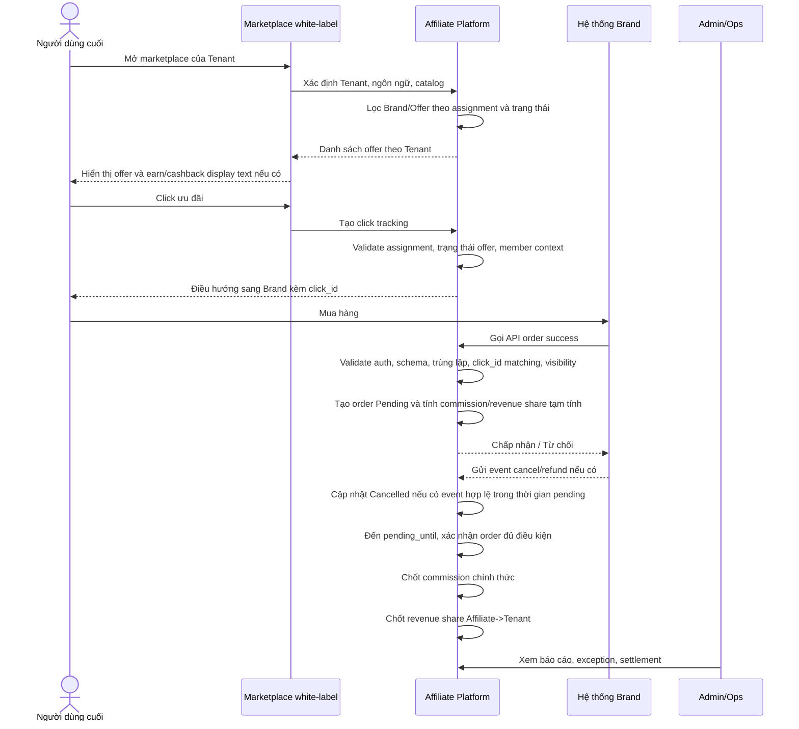
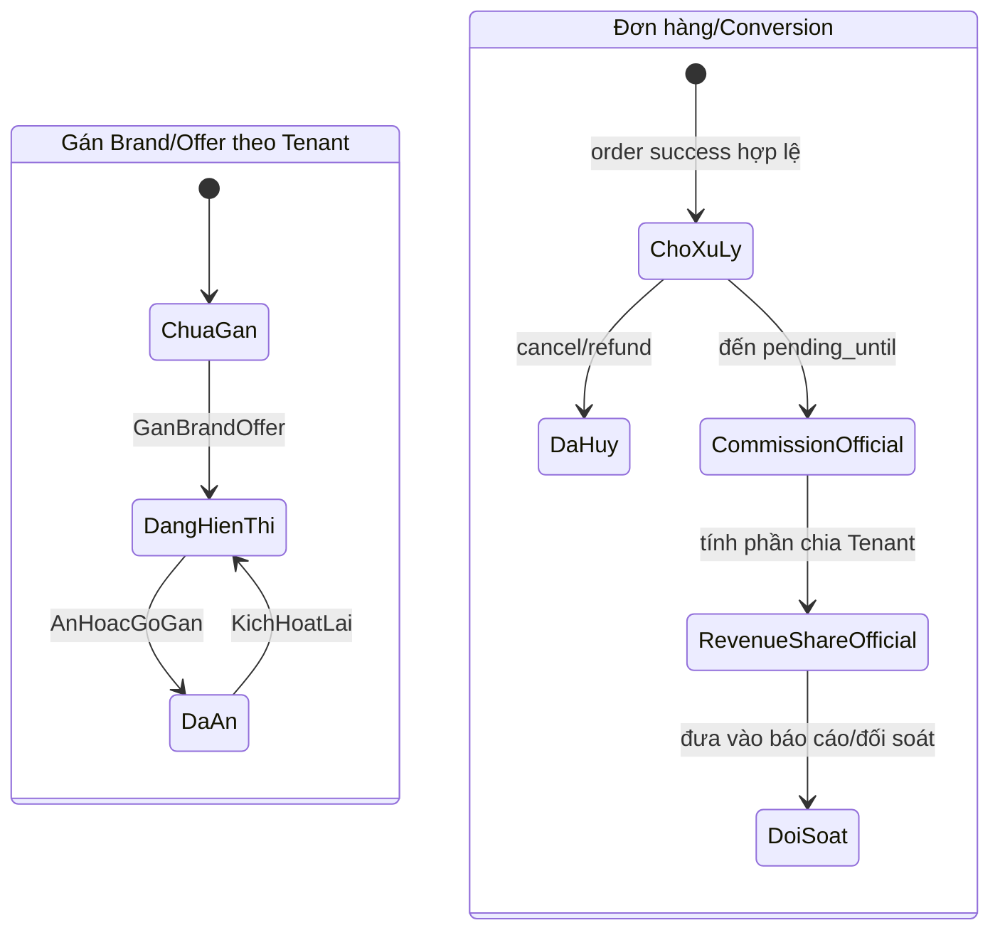
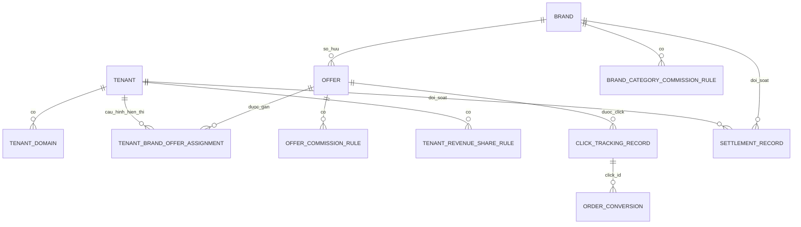
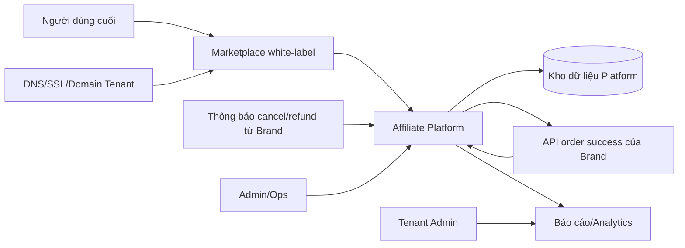

# Modeling Specification: White-label Affiliate Marketplace Platform

## Document control

- Status: Draft
- Owner: TBD
- Related discovery: Conversation discovery brief for Affiliate Marketplace Platform
- Related analysis: [docs/analysis/affiliate-marketplace-platform-analysis.md](../analysis/affiliate-marketplace-platform-analysis.md)
- Last updated: 2026-07-23

## Status

`READY_FOR_WIREFRAME`

## Summary

Affiliate Marketplace Platform là hệ thống trung gian multi-tenant giữa Brand/Merchant và Tenant có loyalty ecosystem. Platform cho phép Admin/Ops cấu hình Tenant, Brand, Offer, Brand/Offer visibility theo Tenant, commission Brand trả Affiliate, revenue share Affiliate chia Tenant, tracking click, nhận order success từ Brand, chờ thời gian xác nhận hoàn/hủy, sau đó chốt commission/revenue share chính thức.

Theo CR-01, MVP1 không làm cashback B1, không tính/cộng điểm cho End user và không gọi Tenant Loyalty API. Các nội dung earn/cashback trên landing page chỉ là display text do Tenant cấu hình.

Các model dưới đây tập trung vào hành vi nghiệp vụ, trạng thái, dữ liệu và tích hợp. Không model UI layout; phần đó dành cho bước wireframe.

## Input evidence

| Source | Relevant facts | Notes |
|---|---|---|
| Analysis document | Actors, modules, FR-001..FR-031, BRULE-001..BRULE-024, states, integrations | Primary source |
| CR-01/User update | Listing fee không đưa vào hệ thống; CPC chỉ tracking; MVP1 chỉ tính Brand commission và Affiliate->Tenant revenue share; không làm B1/point posting/Tenant Loyalty API | Incorporated in commission/data models |
| User update | Admin cấu hình Brand/Offer hiển thị theo Tenant | Incorporated as Tenant Brand/Offer Assignment |

## Selected models

| Model | Included | Reason |
|---|---:|---|
| Business process model | Yes | Nhiều cross-role handoff: Admin, End user, Brand, Platform, Tenant Admin |
| Use case model | Yes | Cần làm rõ mục tiêu của Admin/Ops, Tenant Admin, End user, Brand System |
| Activity model | Yes | Có nhiều decision/validation: visibility, click_id matching, refund/cancel, chốt commission/revenue share |
| Sequence model | Yes | Có tương tác theo thời gian giữa marketplace, Brand API và reporting/settlement |
| State model | Yes | Tenant, Offer, Assignment, Order/Conversion, Commission, Settlement đều có trạng thái |
| Data model | Yes | Data relationship và traceability quan trọng cho multi-tenant/reporting/settlement |
| Integration context model | Yes | Có domain/DNS, Brand API, cancel/refund notification và analytics/reporting |

## Actors and roles

| Actor | Goal | Responsibilities | Permissions | Related requirements |
|---|---|---|---|---|
| Admin/Ops | Vận hành platform và cấu hình nghiệp vụ | Onboard Tenant/Brand, cấu hình offer, visibility, commission, reconciliation | Toàn quyền cấu hình và override theo quy trình | FR-001..FR-013, FR-028..FR-030 |
| Tenant Admin | Theo dõi hiệu quả marketplace của Tenant | Xem dashboard, report, phần doanh thu được chia cho Tenant | Chỉ xem dữ liệu Tenant của mình | FR-028, BRULE-020 |
| End user | Xem offer và click mua hàng | Truy cập marketplace white-label, xem Brand/Offer, click CTA sang Brand | Truy cập theo Tenant/member context nếu có | FR-014..FR-018 |
| Brand/Merchant System | Bán hàng và gửi order events | Nhận traffic, gửi order success/cancel/refund | Gọi API theo credential được cấp | FR-019, FR-024 |
| Tenant Loyalty System | Deferred sau MVP1 | Không nhận API cộng điểm trong MVP1 | N/A | FR-005, FR-026 |
| Affiliate Platform | Điều phối tracking, validation, commission, revenue share, reporting | Resolve Tenant, filter catalog, track click, ingest order, chốt commission/revenue share, report | Internal system behavior | FR-014..FR-031 |

## Business process model

Mô hình này thể hiện quá trình từ setup thương mại/vận hành đến End user mua hàng và Platform ghi nhận commission/revenue share cho Tenant.

Trace: FR-001..FR-031, BRULE-007, BRULE-009, BRULE-018, BRULE-019, BRULE-023, BRULE-024.

## Use case model

| Use case ID | Actor | Goal | Trigger | Preconditions | Postconditions | Related requirement |
|---|---|---|---|---|---|---|
| UC-001 | Admin/Ops | Onboard Tenant | Tenant partnership approved | Admin authorized | Tenant created/configurable | FR-001..FR-005 |
| UC-002 | Admin/Ops | Onboard Brand and commercial rules | Brand partnership approved | Brand data available | Brand active with commission/pending rules | FR-006..FR-011 |
| UC-003 | Admin/Ops | Activate offer/content | Campaign ready | Brand active | Offer Active hoặc Draft | FR-012 |
| UC-004 | Admin/Ops | Configure Tenant Brand/Offer visibility | Tenant-Brand commercial/legal approval | Tenant, Brand/Offer exist | Assignment active/inactive | FR-013, BRULE-024 |
| UC-005 | End user | Browse white-label marketplace | Open Tenant domain | Tenant/domain active | Tenant-specific catalog displayed | FR-014..FR-016 |
| UC-006 | End user | Click offer and visit Brand | Click CTA | Offer active and assigned | Click record created, redirected | FR-017, FR-018 |
| UC-007 | Brand System | Report successful order | Purchase completed | Valid credential and click_id/order data | Order accepted or rejected | FR-019..FR-022 |
| UC-008 | End user | Track order/cashback status | Open order history | Deferred sau MVP1 | Không áp dụng MVP1 | FR-023 |
| UC-009 | Brand System/Admin | Report cancel/refund theo item | Cancel/refund event | Order Pending và item tồn tại | Item Refunded; số liệu được tính lại; Order Status được tổng hợp | FR-024 |
| UC-010 | Platform | Finalize eligible order | pending_until reached | Pending order còn ít nhất một item hợp lệ | Commission/revenue share của item hợp lệ được chốt; Order Confirmed, hoặc Cancelled nếu tất cả item Refunded | FR-025..FR-027 |
| UC-011 | Tenant Admin | View Tenant reporting | Open Tenant portal | Tenant Admin authorized | Tenant-scoped metrics displayed | FR-028 |
| UC-012 | Admin/Ops | Reconcile and settle | Settlement cycle | Transactions exist | Settlement status/report updated | FR-029, FR-030 |

## Activity model

### Marketplace catalog and click

Trace: FR-014..FR-018, BRULE-012, BRULE-013, BRULE-023, BRULE-024.

### Order, commission, and revenue share

Trace: FR-019..FR-027, BRULE-007, BRULE-014..BRULE-019, BRULE-023, BRULE-024.

## Sequence model

### Mua hàng và ghi nhận commission Tenant

Trace: FR-014..FR-031.

## State model

| Entity | Current state | Event | Next state | Rule | Related requirement |
|---|---|---|---|---|---|
| Tenant | Draft | Thông tin Tenant được cấu hình hợp lệ | Active | BRULE-001, BRULE-002 | FR-001, FR-002 |
| Tenant Domain | Pending Verification | DNS/SSL verified | Active | BRULE-002 | FR-002 |
| Brand | Draft | Admin activates Brand | Active | BRULE-006 | FR-006 |
| Offer | Draft | Admin activates offer | Active | BRULE-012, BRULE-021 | FR-012 |
| Offer | Active | Offer expired/paused | Inactive | BRULE-012 | FR-012 |
| Tenant Brand/Offer Assignment | Unassigned | Admin assigns Brand/Offer to Tenant | Active | BRULE-024 | FR-013 |
| Tenant Brand/Offer Assignment | Active | Admin hides/unassigns Brand/Offer from Tenant | Inactive | BRULE-024 | FR-013 |
| Click Tracking Record | Created | Redirect completed | Redirected | BRULE-013, BRULE-024 | FR-017, FR-018 |
| Order/Conversion | None | Brand sends valid order success | Pending | BRULE-016 | FR-019, FR-022 |
| Order Item | Pending | Brand reports valid full-item cancel/refund | Refunded | BRULE-018 | FR-024 |
| Order/Conversion | Pending | Cancel/refund applied, at least one item remains Pending | Pending | BRULE-018 | FR-024 |
| Order/Conversion | Pending | Cancel/refund applied, all remaining non-refunded items are Confirmed | Confirmed | BRULE-018 | FR-024 |
| Order/Conversion | Pending | Cancel/refund applied, all items are Refunded | Cancelled | BRULE-018 | FR-024 |
| Order/Conversion | Pending | pending_until reached and no cancel/refund | Confirmed | BRULE-007, BRULE-018 | FR-025 |
| Commission Calculation | Provisional | pending_until reached and no cancel/refund | Official | BRULE-007, BRULE-018 | FR-025 |
| Revenue Share Calculation | Provisional | Commission official | Official | BRULE-009 | FR-025, FR-030 |
| Settlement Record | Open | Ops closes cycle | Settled | BRULE-020 | FR-030 |

## Data model

| Entity | Description | Key attributes | Owner | Created by | Updated by | Related requirements |
|---|---|---|---|---|---|---|
| Tenant | White-label partner | tenant_id, code, status, contact | Platform | Admin/Ops | Admin/Ops | FR-001 |
| Tenant Domain | Tenant domain/subdomain config | domain_id, tenant_id, hostname, ssl_status, dns_status | Platform | Admin/Ops | Admin/Ops/System | FR-002, FR-014 |
| Tenant Branding Config | Theme and locale config | tenant_id, logo, theme, default_locale, supported_locales | Platform | Admin/Ops | Admin/Ops | FR-003, FR-014 |
| Tenant Loyalty Integration | Deferred sau MVP1 | tenant_id, endpoint, auth_type, status, retry_policy | Platform/Tenant | N/A trong MVP1 | N/A trong MVP1 | FR-005, FR-026 |
| Brand | Merchant profile | brand_id, code, name, status | Platform | Admin/Ops | Admin/Ops | FR-006 |
| Offer | Brand campaign/offer | offer_id, brand_id, status, start_at, end_at, destination_url | Platform | Admin/Ops | Admin/Ops | FR-012, FR-015 |
| Tenant Brand/Offer Assignment | Tenant-specific visibility | assignment_id, tenant_id, brand_id, offer_id optional, status, effective period | Platform | Admin/Ops | Admin/Ops | FR-013, FR-015, FR-021 |
| Brand Category Commission Rule | Commission Brand trả Affiliate theo category của từng Brand | rule_id, brand_id, affiliate_category_id, is_default, brand_category_id/code, commission_type, commission_value, effective period | Platform | Admin/Ops | Admin/Ops | FR-008 |
| Offer Commission Rule | Commission Brand trả Affiliate theo Offer, ưu tiên hơn Category | rule_id, brand_id, offer_id, commission_type, commission_value, effective period | Platform | Admin/Ops | Admin/Ops | FR-008 |
| Tenant Revenue Share Rule | Tỷ lệ Affiliate trả Tenant | rule_id, tenant_id, brand_id, category_id/offer_id optional, tenant_share_rate | Platform | Admin/Ops | Admin/Ops | FR-009 |
| Earn/Cashback Display Text | Nội dung quyền lợi hiển thị trên landing page, không dùng để tính điểm MVP1 | rule_id, tenant_id, brand_id, category_id/offer_id optional, locale, display_text | Tenant/Platform support | Tenant Admin | Tenant Admin | FR-016 |
| Localized Content | Offer/category translations | content_id, entity_type, entity_id, locale, title, description, terms | Platform | Admin/Ops | Admin/Ops | FR-012 |
| Click Tracking Record | Outbound click context | click_id, tenant_id, user_ref, brand_id, offer_id, clicked_at | Platform | Platform | No normal update | FR-017, FR-018 |
| Order/Conversion | Brand order/conversion | order_id, brand_order_id, click_id, amount, status, pending_until | Platform | Brand API/Platform | Platform/Ops | FR-019, FR-022, FR-024 |
| Settlement Record | Reconciliation and settlement | settlement_id, cycle, tenant_id, brand_id, totals, status | Platform | Admin/Ops/System | Admin/Ops | FR-030 |

| Relationship | Cardinality | Rule / note |
|---|---|---|
| Tenant -> Tenant Domain | 1:N | Tenant may have subdomain/custom domain; active domain required for marketplace |
| Tenant -> Tenant Branding Config | 1:1/N by version | Marketplace renders Tenant branding |
| Tenant -> Tenant Loyalty Integration | Deferred | Không áp dụng MVP1 |
| Brand -> Offer | 1:N | Offer belongs to one Brand |
| Tenant + Brand/Offer -> Tenant Brand/Offer Assignment | N:M via assignment | Default hidden unless assignment active |
| Brand + Category -> Brand Category Commission Rule | 1:N by effective period | Rule theo category của từng Brand; mỗi Brand có đúng 1 category active mặc định để fallback khi order không có offer_id và Brand không truyền category ID/code |
| Brand status eligibility -> Brand Category Commission Rule | Active requires exactly 1 default | Brand chỉ đủ điều kiện Active/assign/ready for order commission khi có đúng 1 category active được đánh dấu mặc định |
| Offer -> Offer Commission Rule | 0..N by effective period | Offer rule ưu tiên hơn Category rule |
| Tenant + Brand/Category/Offer -> Tenant Revenue Share Rule | N:M | Cấu hình `tenant_share_rate%` chia từ Affiliate cho Tenant |
| Tenant + Brand/Category/Offer -> Earn/Cashback Display Text | 0..N | Text hiển thị, không tính/cộng điểm MVP1 |
| Click Tracking Record -> Order/Conversion | 1:0..N | Conversion validates click_id and click context |
| Order/Conversion -> Settlement Record | N:1 | Aggregated by cycle/tenant/brand |

## Integration context model

| System | Role | Data exchanged | Direction | Failure behavior | Owner |
|---|---|---|---|---|---|
| Tenant domain/DNS/SSL | Resolve white-label Tenant marketplace | Domain mapping, verification status | Tenant/Admin -> Platform/DNS | Domain inactive; marketplace unavailable | Admin/Ops, Tenant |
| Brand order success API | Confirm successful orders | click_id, brand_order_id, amount, currency, order time, metadata | Brand -> Platform | Reject invalid request, log, idempotent response for duplicates | Brand, Platform |
| Brand cancel/refund notification | Cancel/refund item của Order Pending | request_id, brand_id/code, brand_order_id, event_type, event_at, items[].item_code, reason optional | Brand -> Platform | Match từng item; atomic/idempotent; Order Confirmed bị từ chối và ghi Exception | Brand, Platform |
| Tenant loyalty point posting API | Deferred sau MVP1 | Không trao đổi dữ liệu trong MVP1 | N/A | N/A | Tenant, Platform |
| Reporting/analytics | Operational and financial reporting | Click, conversion, commission, revenue share, settlement metrics | Platform internal | Report delay or partial data if pipeline fails | Platform |

## Decisions and business rules

| ID | Decision / rule | Condition | Outcome | Related model | Related requirement |
|---|---|---|---|---|---|
| BRULE-011 | Listing fee outside system | Listing fee discussed commercially | No billing/reporting feature for listing fee | Process/Data | FR-011 |
| BRULE-022 | CPC billing out of scope | Click occurs | Track click only, no CPC charge | Activity/Data | FR-017, FR-031 |
| BRULE-024 | Tenant Brand/Offer default hidden | No active assignment | Hide Brand/Offer and block direct click | Process/Activity/Data/State | FR-013, FR-015, FR-017, FR-021 |
| BRULE-009 | Tenant revenue share | Admin configures Affiliate->Tenant share | Rule active only when `tenant_share_rate` hợp lệ theo scope Brand/Category/Offer | Data/Activity | FR-009 |
| BRULE-023 | Cashback B1 deferred | Tenant requests automatic End user cashback/point posting | Không áp dụng trong MVP1; chỉ cấu hình display text | Activity/Data/State | FR-016, FR-022, FR-026 |
| BRULE-007 | Brand pending days | Order success received | Wait n days before commission/revenue share finalization | Activity/State | FR-007, FR-025 |
| BRULE-018 | Cancel/refund được xử lý theo item | Brand reports full-item cancel/refund khi Order Pending | Item chuyển Refunded; tính lại Final Amount/Gross Commission/Tenant Share; Order chỉ Cancelled khi tất cả item Refunded. Order Confirmed bị từ chối và ghi Exception | Activity/State | FR-024 |

## Intentionally omitted models

| Model | Reason |
|---|---|
| UI navigation map | Belongs to wireframe skill; this document models behavior, states, and data only |
| API schema detail | Cancel/refund contract đã được định nghĩa tại Order Transaction SRS |
| Financial ledger/accounting model | Current scope covers commission/settlement reporting, not full accounting ledger |

## Assumptions

- End user có thể định danh thành loyalty member của Tenant để map với tenant member reference. Nếu chưa định danh, vẫn được click/mua sau warning quyền lợi.
- Brand checkout happens outside Affiliate Platform.
- Admin/Ops configures Brand commission by Brand Category or Offer and configures Affiliate->Tenant revenue share.
- Tenant may configure earn/cashback display text for landing page, but this text is not used for automatic point/cashback calculation in MVP1.
- Cashback B1 configuration, point conversion, point posting and Tenant Loyalty API are deferred after MVP1.
- Brand/Offer is hidden by default for a Tenant unless assigned active.
- Cancel/refund API được chốt theo từng Order Item; chỉ hỗ trợ hoàn/hủy toàn bộ item của Order `Pending` trong MVP1.

## Open questions

| Question | Impact |
|---|---|
| Brand báo hoàn/hủy bằng API riêng, cùng postback event, hay webhook event type? | Blocks detailed integration/API SRS |
| Brand báo hoàn/hủy bằng API riêng, cùng postback event, hay webhook event type? | Blocks detailed integration/API SRS |

## Closed decisions

| Decision | Answer |
|---|---|
| Ngôn ngữ MVP1 | `vi-VN`, `en-US`; default `vi-VN`. |
| End user chưa định danh member reference | Vẫn được click/mua; UI warning về quyền lợi/cashback/đối chiếu hội viên. |
| Settlement cycle với Brand/Tenant | Tùy hợp đồng. |

## Traceability matrix

| Model element | Requirement / rule | Evidence | Notes |
|---|---|---|---|
| Tenant setup process | FR-001..FR-005 | Analysis modules FM-001 | Needed for Admin setup screens |
| Brand/Offer visibility process | FR-013, FR-015, BRULE-024 | User request and analysis update | Default hidden unless assigned |
| Marketplace catalog filtering | FR-014..FR-017, BRULE-012, BRULE-024 | Analysis flow steps 5..10 | Drives EU marketplace behavior |
| Click tracking | FR-017, FR-018, FR-031, BRULE-013, BRULE-022 | Analysis FR table | CPC is not billed |
| Order ingestion | FR-019..FR-022, BRULE-014..BRULE-016 | Analysis integration points | Includes idempotency and visibility validation |
| Commission/revenue share allocation | FR-008, FR-009, FR-022, BRULE-008, BRULE-009 | CR-01/User commission model | Brand commission và phần Affiliate chia Tenant |
| Earn/cashback display text | FR-016, BRULE-023 | CR-01/User updates | Display-only, không tính/cộng điểm MVP1 |
| Pending/cancel/finalization states | FR-024..FR-027, BRULE-007, BRULE-018, BRULE-019 | Analysis state table | Drives commission/revenue share and settlement |
| Tenant reporting | FR-028, BRULE-020 | Analysis reporting module | Tenant-scoped only |
| Admin reporting/settlement | FR-029, FR-030 | Analysis reporting and settlement | Needed for Ops workflows |
| Brand APIs | FR-019, FR-024 | Analysis integration points | Cancel/refund contract theo Order Transaction SRS |
| Tenant Loyalty API | FR-005, FR-026 | CR-01 | Deferred after MVP1 |

## Readiness check

- Actors and roles are identified.
- Primary and alternate flows are modeled.
- Key decisions and business rules are traceable.
- Data objects and relationships are modeled.
- State transitions for assignment, order, commission/revenue share, and settlement are modeled.
- Integrations are modeled with failure behavior.
- Remaining unknowns are listed as open questions.

`READY_FOR_WIREFRAME`
