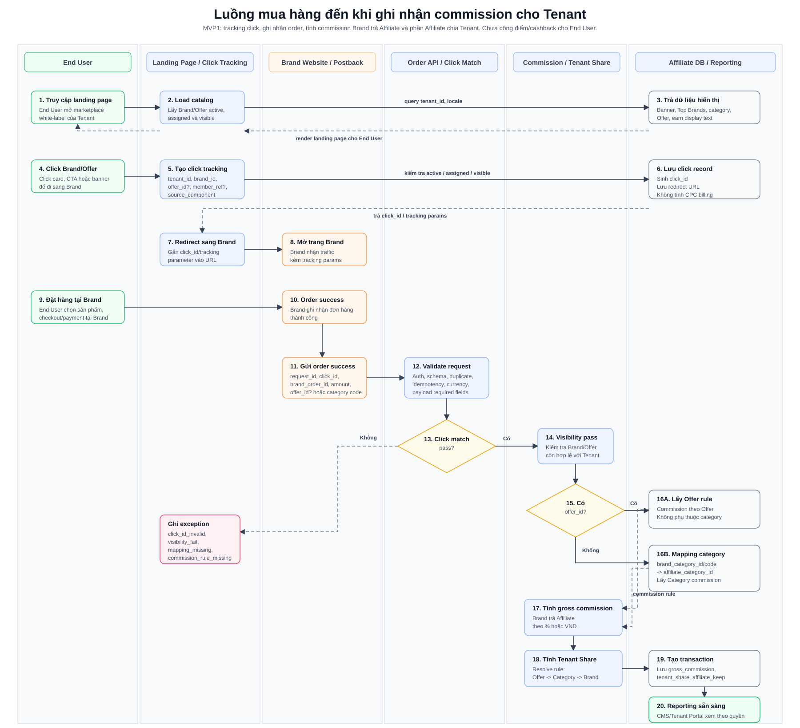

# Luồng mua hàng đến khi ghi nhận commission cho Tenant

## 1. Mục tiêu

Tài liệu này mô tả luồng tương tác giữa **End User**, **Landing Page của Tenant**, **Affiliate Platform** và **Brand** từ lúc khách hàng click từ marketplace sang Brand, mua hàng thành công, Brand gửi order success về Platform, đến khi hệ thống tính và ghi nhận **commission Brand trả Affiliate** và **phần Affiliate chia cho Tenant**.

Phạm vi theo MVP1:

- Có tracking click và match order theo `click_id`.
- Có ghi nhận order/transaction từ Brand.
- Có tính `gross_commission_amount` Brand trả Affiliate.
- Có tính `tenant_share_amount` và `affiliate_keep_amount`.
- Chưa tính/cộng cashback/điểm cho End User.
- Chưa gọi Tenant Loyalty API.

## 2. Đối tượng/hệ thống tham gia

| Đối tượng/Hệ thống | Vai trò trong luồng |
|---|---|
| End User | Khách hàng truy cập landing page, click Brand/Offer và mua hàng tại Brand. |
| Landing Page White-label | Hiển thị Brand/Offer theo Tenant và gọi Click Tracking trước khi redirect. |
| Click Tracking Service | Tạo `click_id`, lưu thông tin tenant/brand/offer/source/user_ref nếu có. |
| Brand Website/App | Nơi End User thực hiện checkout/payment. |
| Brand Order Postback/Webhook | Hệ thống Brand gửi order success realtime về Affiliate Platform. |
| Order API | Nhận order success, validate request và điều phối xử lý transaction. |
| Click Matching Service | Match `click_id` với click record và context Tenant/Brand/Offer. |
| Commission Service | Tính commission Brand trả Affiliate theo Offer hoặc Category rule. |
| Tenant Revenue Share Service | Tính phần Affiliate chia cho Tenant theo rule ưu tiên Offer -> Category -> Brand. |
| Affiliate DB | Lưu click, order/transaction, commission, tenant share và exception. |
| Reporting View CMS/Tenant Portal | Cho Admin/Tenant xem transaction và commission theo quyền. |

## 3. Sequence Diagram

Source chỉnh sửa nếu cần: [purchase-to-tenant-commission-sequence.puml](purchase-to-tenant-commission-sequence.puml)

## 4. Luồng chính

| Bước | Mô tả |
|---:|---|
| 1 | End User truy cập landing page của Tenant. |
| 2 | Landing Page lấy danh sách Brand/Offer active, assigned và visible theo `tenant_id`. |
| 3 | End User click Brand/Offer. Banner và click Banner thuộc Deferred/Phase 2. |
| 4 | Landing Page gọi Click Tracking Service để tạo `click_id`. |
| 5 | Click Tracking Service lưu click record và trả redirect URL kèm tracking parameter. |
| 6 | End User được redirect sang Brand Website/App. |
| 7 | End User hoàn tất mua hàng tại Brand. |
| 8 | Brand gửi order success realtime về Affiliate Platform. |
| 9 | Order API validate auth, schema, idempotency. |
| 10 | Click Matching Service match `click_id` với click record đã ghi nhận. |
| 11 | Commission Service tính commission Brand trả Affiliate theo Offer hoặc Category. |
| 12 | Tenant Revenue Share Service tính phần Affiliate chia cho Tenant. |
| 13 | Platform tạo transaction/order và lưu `gross_commission_amount`, `tenant_share_amount`, `affiliate_keep_amount`. |
| 14 | Admin CMS/Tenant Portal có thể xem transaction và commission theo quyền. |

## 5. Rule tính commission trong luồng

| Trường hợp | Rule |
|---|---|
| Order Item có `brand_offer_code` và mapping/rule Offer hợp lệ | Tính commission của item theo Offer-level commission. Offer được click/URL chỉ phục vụ attribution và không tự quyết định source. |
| Order Item không áp dụng Offer và Brand có gửi Category code | Dùng `brand_category_id/code` Brand gửi theo item để mapping sang Affiliate Category, sau đó tính commission theo Brand Category Commission. |
| Order Item không áp dụng Offer và Brand không gửi Category code | Dùng Category Default của Brand để tính commission theo Brand Category Commission. |
| Không tìm thấy mapping category | Brand có gửi `brand_category_id/code` nhưng không mapping được thì ghi exception `category_mapping_missing`, chưa tính commission. |
| Không có category mặc định | Brand không gửi category và chưa có default category active thì ghi exception `default_category_missing`, chưa tính commission. |
| Không tìm thấy commission rule hợp lệ | Ghi exception `commission_rule_missing`, chưa tính commission. |
| Tính Tenant share | Resolve Tenant Revenue Share Rule theo thứ tự ưu tiên `Offer -> Category -> Brand`. |
| MVP1 | Chỉ ghi nhận Tenant commission/share, chưa tính/cộng cashback/điểm cho End User. |

## 6. Nhánh exception chính

| Exception | Khi nào xảy ra | Kết quả |
|---|---|---|
| Target không hợp lệ | Brand/Offer inactive, hidden hoặc không assigned cho Tenant tại thời điểm click. | Không tạo click, không redirect hoặc hiển thị thông báo không khả dụng. |
| Auth/schema fail | Brand gọi API sai credential hoặc payload sai schema. | Reject request hoặc ghi exception theo policy. |
| Duplicate/idempotency | `request_id` hoặc `brand_order_id` đã được xử lý. | Không tạo transaction trùng; trả idempotent response nếu phù hợp. |
| Click_id invalid | `click_id` không tồn tại hoặc không match Tenant/Brand/Offer context. | Ghi exception, chưa tạo commission. |
| Visibility fail | Click/order không còn hợp lệ theo rule visibility. | Ghi exception, chưa tạo commission. |
| Category mapping missing | Order không có `offer_id`, Brand có gửi `brand_category_id/code` nhưng không mapping được. | Ghi exception, chưa tính gross commission. |
| Default category missing | Order không có `offer_id`, Brand không gửi category và Brand chưa có category mặc định active. | Ghi exception, chưa tính gross commission. |
| Commission rule missing | Không tìm thấy rule commission Offer/Category hợp lệ. | Ghi exception, chưa tính gross commission. |
