# SRS - Brand & Offer Management

## Changes Record

Note: A - Add/Create new, M - Modify, D - Delete

| Date of change | Reason (A, M, D) | Updated by | Old version | Description of change | New version |
|---|---|---|---|---|---|
| 2026-07-13 | A | Product/BA | -- | Create SRS Brand & Offer Management following `module-04-srstemplate.docx` structure. | 1.0.0 |

## Table of Contents

- I. Introduction
- II. Overall Description
- III. Overview
- IV. Description of Functions
- V. Data Requirements
- VI. Consolidated Business Rules Summary
- VII. Non-functional Requirements
- VIII. Consolidated Acceptance Criteria Summary
- IX. Open Questions

# I. Introduction

## 1. Purpose of Document

Tài liệu này mô tả yêu cầu phần mềm cho nhóm chức năng Brand & Offer Management thuộc White-label Affiliate Marketplace Platform. Tài liệu là cơ sở để Product/BA, UI/UX, Engineering, QA và vận hành hiểu thống nhất phạm vi, luồng xử lý, màn hình, trường dữ liệu, business rule và điều kiện nghiệm thu.

Phạm vi tài liệu chỉ bao gồm các chức năng CMS liên quan đến:

- Brand Management.
- Brand Category Mapping & Commission.
- Offer & Content Management.

## 2. Document Conventions

| Convention | Description |
|---|---|
| Required field | Trường bắt buộc được mô tả bằng `Required` hoặc ký hiệu `*` trong màn hình. |
| Optional field | Trường không bắt buộc, có thể để trống nếu không ảnh hưởng điều kiện Active. |
| Status | Offer chỉ có 3 trạng thái `Draft`, `Active`, `Inactive`. |
| Locale | Nội dung hiển thị ra landing page phải hỗ trợ đa ngôn ngữ; fallback mặc định là `vi-VN`. |
| Commission type | `Percentage` hiển thị đơn vị `%`; `Fixed amount` hiển thị đơn vị `VND`. |
| Hard delete | Không áp dụng cho dữ liệu đã phát sinh liên kết nghiệp vụ. |
| Priority | `Must` là bắt buộc trong MVP1; `Should` là nên có nếu không ảnh hưởng timeline; `Could` là tùy chọn. |

## 3. Project Scope

### 3.1 In Scope

| Module | Features |
|---|---|
| Brand Management | Xem danh sách Brand + lọc, thêm mới Brand, sửa Brand, xóa/ngưng hoạt động Brand. |
| Brand Category Mapping & Commission | Xem danh sách mapping, thêm nhiều category mapping & commission, sửa/inactive mapping, cấu hình commission Brand trả Affiliate theo category. |
| Offer & Content Management | Xem danh sách Offer theo Brand, thêm mới Offer, sửa Offer, activate/deactivate Offer, cấu hình Offer commission trả Affiliate. |

### 3.2 Out of Scope

| Item | Reason |
|---|---|
| Brand portal tự cấu hình | MVP1 chỉ Admin/Ops cấu hình trên CMS. |
| API credential/status trên form Brand | Brand Integration nằm ở màn/tài liệu riêng. |
| Tenant revenue share | Thuộc SRS Tenant Management. |
| Customer cashback/earn display | Thuộc Tenant Portal Earn Display; không nằm trong Brand/Offer CMS. |
| Tính/cộng điểm loyalty cho End user | Pending sau MVP1. |
| Listing fee và CPC billing | Không đưa vào hệ thống MVP1. |

## 4. Expected Results After Finishing This Document

- Xác định đầy đủ use case Brand & Offer trong MVP1.
- Làm rõ dữ liệu đầu vào/đầu ra, validation và business rule.
- Có screen flow và mô tả màn hình để UI/UX/Engineering triển khai.
- Có logic description để QA xây test case.
- Có checklist nghiệm thu cho Brand, Category Mapping & Commission và Offer.

## 5. References

| Document | Location |
|---|---|
| Function List / SOW | [affiliate-marketplace-platform-function-list.md](../function-list/affiliate-marketplace-platform-function-list.md) |
| Current Brand & Offer SRS | [brand-offer-management.md](brand-offer-management.md) |
| BRD | [affiliate-marketplace-platform.md](../brd/affiliate-marketplace-platform.md) |
| Brand list mockup | [cms-brand-list.html](../mockups/cms-brand-list.html) |
| Brand create mockup | [cms-brand-create.html](../mockups/cms-brand-create.html) |
| Brand category commission list mockup | [cms-brand-category-commission.html](../mockups/cms-brand-category-commission.html) |
| Brand category commission create mockup | [cms-brand-category-commission-create.html](../mockups/cms-brand-category-commission-create.html) |
| Offer list mockup | [cms-offer-list.html](../mockups/cms-offer-list.html) |
| Offer create mockup | [cms-offer-create.html](../mockups/cms-offer-create.html) |

# II. Overall Description

## 1. Definition

| Name | Description |
|---|---|
| Admin/Ops | Người dùng CMS, quản lý Brand, Offer, content, category mapping và commission. |
| Brand/Merchant | Đối tác bán hàng/sản phẩm online. |
| Offer | Ưu đãi hoặc link riêng thuộc Brand, dùng để tracking click/order và tùy chọn cấu hình Offer commission riêng. |
| Affiliate Platform | Hệ thống trung gian quản lý marketplace, tracking, commission và revenue share. |
| Affiliate category | Category chuẩn của Affiliate Platform. |
| Brand category ID/code | Mã Category Brand nên truyền theo từng order item khi item không có `brand_offer_code`, dùng để mapping sang Affiliate Category. Nếu không truyền, Platform fallback sang default Category Active theo policy. |
| Category Mapping | Mapping giữa Brand category ID/code và Affiliate category trong từng Brand. |
| Brand Category Commission | Commission Brand trả Affiliate theo từng category mapping. |
| Offer Commission | Commission Brand trả Affiliate cho order item khi `brand_offer_code` do Brand gửi được mapping hợp lệ với Offer và Offer commission rule trên Platform. URL/Offer đã click chỉ dùng cho attribution, không tự quyết định commission. |
| Locale | Ngôn ngữ nội dung hiển thị, ví dụ `vi-VN`, `en-US`. |
| Audit log | Lịch sử ghi nhận thao tác tạo/sửa/xóa/đổi trạng thái/cấu hình. |

## 2. Operation Environment

| Item | Description |
|---|---|
| Application type | CMS web application. |
| Primary users | Admin/Ops, Partnership/Ops, QA. |
| Supported browser | Chrome, Edge, Firefox bản hiện đại. |
| Device | Desktop/laptop là chính; tablet có thể xem/chỉnh cơ bản nếu UI hỗ trợ. |
| Integration dependency | Brand Order Integration gửi dữ liệu theo từng order item. Nếu item có `brand_offer_code`, Platform resolve Offer commission bằng `brand_id + brand_offer_code`. Nếu không có Offer code, Brand phải ưu tiên gửi `brand_category_id/code` để Platform resolve Category commission. Trường hợp Category code không được gửi, request item vẫn được tiếp nhận và Platform fallback sang default Category Active; nếu không có default hợp lệ, item vào exception `default_category_missing`. |
| Security | User phải đăng nhập CMS và có quyền theo action. |

# III. Overview

## 1. Model Overview

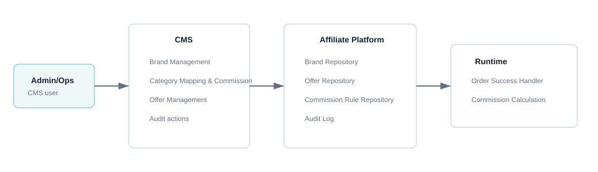

## 2. Function Diagram

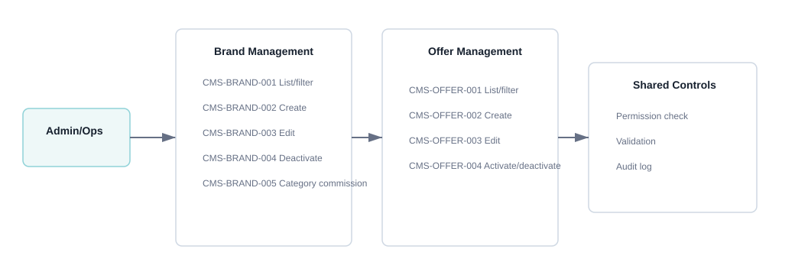

# IV. Description of Functions

## 1. CMS-BRAND-001 - Xem danh sách Brand + lọc

### a. Introduction

Chức năng cho phép Admin/Ops xem danh sách Brand đã onboard lên Platform, tìm kiếm/lọc Brand và truy cập các action như xem chi tiết, sửa hoặc ngưng hoạt động.

### b. Actors/Objects

| Actor/Object | Role |
|---|---|
| Admin/Ops | Người thao tác trên CMS. |
| CMS Interface | Hiển thị filter, bảng dữ liệu và action. |
| Brand Service | Truy vấn Brand theo điều kiện lọc. |
| Audit/Permission Service | Kiểm tra quyền truy cập. |

### c. Pre-conditions

- Admin/Ops đã đăng nhập CMS.
- Admin/Ops có quyền `brand.read`.
- Hệ thống có hoặc chưa có dữ liệu Brand đều phải xử lý được.

### d. Expected Result

- Admin/Ops xem được danh sách Brand.
- Admin/Ops lọc được Brand theo keyword/status/category/created date nếu có.
- Không có thay đổi dữ liệu khi chỉ xem/lọc.

### e. Logic Diagram

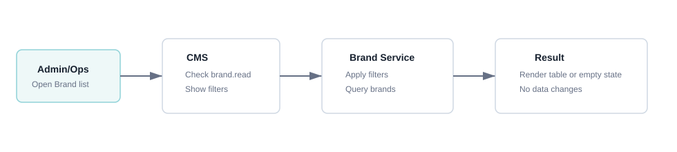

### f. Screen Flow

1. Brand Management menu.
2. Brand List screen.
3. Action sang Brand detail/Create/Edit nếu Admin/Ops chọn.

Mockup:

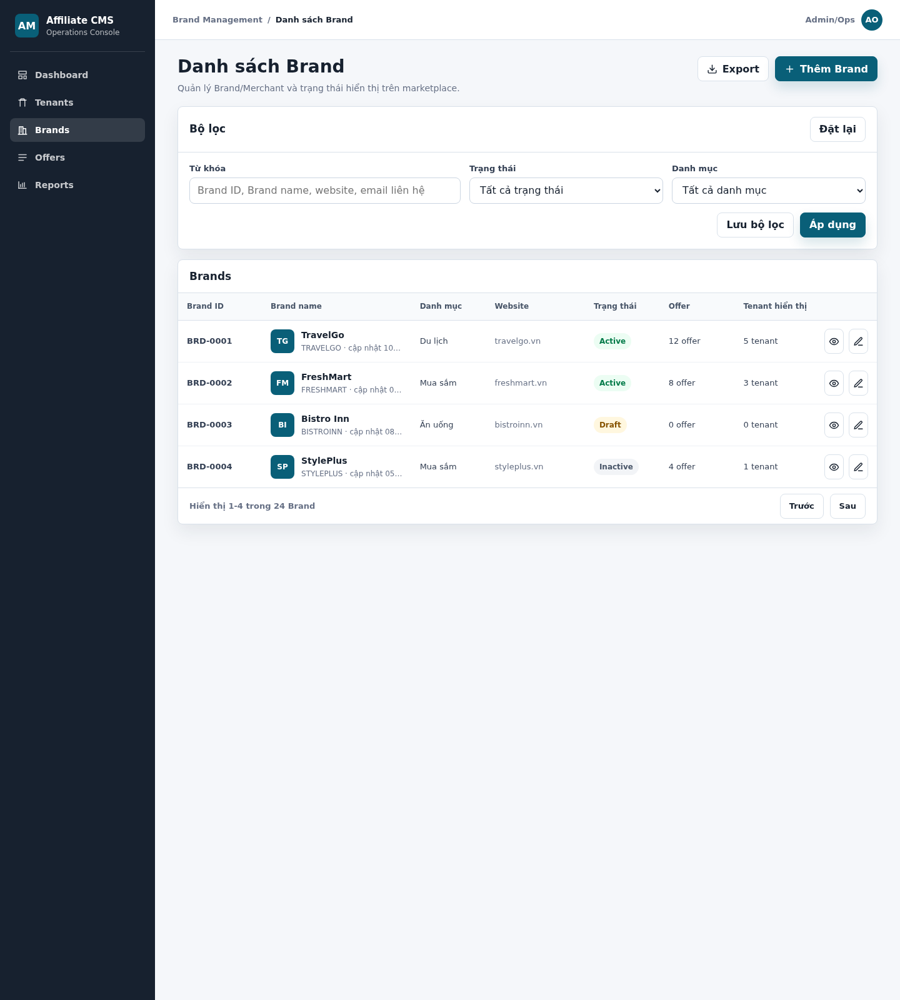

HTML mockup đầy đủ: [cms-brand-list.html](../mockups/cms-brand-list.html)

### g. Screen Description

Screen 1: Brand List

| # | Items | Control type | Data type | Description / Validation / Error handling |
|---:|---|---|---|---|
| 1 | Keyword | Textbox | Text | Tìm theo Brand code, Brand name, website, contact email. Cho phép nhập tối đa 100 ký tự; nếu vượt quá giới hạn thì trim hoặc hiển thị lỗi theo policy. |
| 2 | Status | Dropdown | Enum | Tất cả, Draft, Active, Inactive. Mặc định `Tất cả`. |
| 3 | Category | Dropdown | Ref | Lọc theo Affiliate category đã mapping với Brand. Chỉ hiển thị category active; nếu category bị inactive, dữ liệu lịch sử vẫn hiển thị theo policy nhưng không dùng để lọc mặc định. |
| 4 | Created date | Date range | Date | Lọc theo ngày tạo nếu UI hỗ trợ. Nếu From date > To date, hiển thị `Khoảng ngày không hợp lệ`. |
| 5 | Brand ID/code | Label | ReadOnly | Mã Brand hiển thị trong bảng, click hoặc action để vào chi tiết tùy thiết kế. |
| 6 | Brand name | Label | ReadOnly | Tên Brand theo default locale. Nếu thiếu bản dịch default locale, hiển thị placeholder `Chưa có tên hiển thị`. |
| 7 | Categories | Label | ReadOnly | Danh sách category đã mapping. Nếu chưa có mapping, hiển thị `-` hoặc badge `Chưa cấu hình`. |
| 8 | Status | Badge | Enum | Trạng thái Brand. Brand inactive không hiển thị/click trên marketplace nhưng vẫn có thể xem trong CMS. |
| 9 | Offer count | Label | Number | Số Offer thuộc Brand. Nếu bằng 0 hiển thị `0`. |
| 10 | Tenant assignment count | Label | Number | Số Tenant đang assign Brand. Dữ liệu phục vụ vận hành visibility. |
| 11 | Actions | Button/Menu | Click | Xem chi tiết, sửa, ngưng hoạt động. Action phụ thuộc quyền user; nếu không có quyền thì ẩn hoặc disabled theo policy. |

### h. Logic Description

| # | Step | Actor/Object | Logic |
|---:|---|---|---|
| 1 | Open list | Admin/Ops | Mở menu Brand Management. |
| 2 | Permission check | CMS Interface | Gửi request kiểm tra quyền `brand.read`. |
| 3 | Query data | Brand Service | Nhận filter, query Brand, sort mặc định theo `updated_at` giảm dần. |
| 4 | Render result | CMS Interface | Nếu có data thì render table; nếu không có thì render empty state. |
| 5 | Error handling | CMS Interface | Nếu không có quyền thì hiển thị access denied. |

### i. Business Rules

| BR ID | Rule |
|---|---|
| BR-BRAND-001-01 | Keyword áp dụng cho Brand code, Brand name, website và contact email. |
| BR-BRAND-001-02 | Brand inactive vẫn hiển thị trong CMS nhưng không hiển thị/click trên marketplace. |
| BR-BRAND-001-03 | Danh sách Brand mặc định sort theo `updated_at` giảm dần. |
| BR-BRAND-001-04 | User không có quyền `brand.read` không được xem dữ liệu Brand. |

### j. Acceptance Criteria

| AC ID | Criteria |
|---|---|
| AC-BRAND-001-01 | Admin/Ops xem được Brand list khi có quyền `brand.read`. |
| AC-BRAND-001-02 | Filter keyword trả về kết quả theo Brand code, Brand name, website hoặc contact email. |
| AC-BRAND-001-03 | Khi không có kết quả, hệ thống hiển thị empty state thay vì lỗi hệ thống. |
| AC-BRAND-001-04 | User không có quyền xem Brand nhận thông báo access denied. |

## 2. CMS-BRAND-002 - Thêm mới Brand

### a. Introduction

Chức năng cho phép Admin/Ops tạo Brand/Merchant mới với thông tin cơ bản, contact vận hành và content đa ngôn ngữ dùng để hiển thị trên landing page.

### b. Actors/Objects

| Actor/Object | Role |
|---|---|
| Admin/Ops | Nhập thông tin Brand. |
| CMS Interface | Hiển thị form tạo Brand và validate sơ bộ. |
| Brand Service | Validate và lưu Brand. |
| Asset Service | Lưu logo nếu có upload. |
| Audit Service | Ghi log tạo Brand. |

### c. Pre-conditions

- Admin/Ops có quyền `brand.create`.
- Brand code chưa tồn tại.
- Locale mặc định tối thiểu là `vi-VN`.

### d. Expected Result

- Brand mới được tạo thành công.
- Brand chưa có category mapping cho đến khi Admin/Ops cấu hình tại tab Category & Commission.
- Audit log được ghi nhận.

### e. Logic Diagram

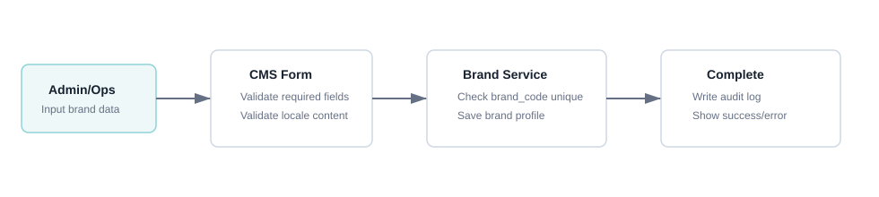

### f. Screen Flow

1. Brand List.
2. Create Brand.
3. Brand Detail hoặc Brand List sau khi tạo thành công.

Mockup:

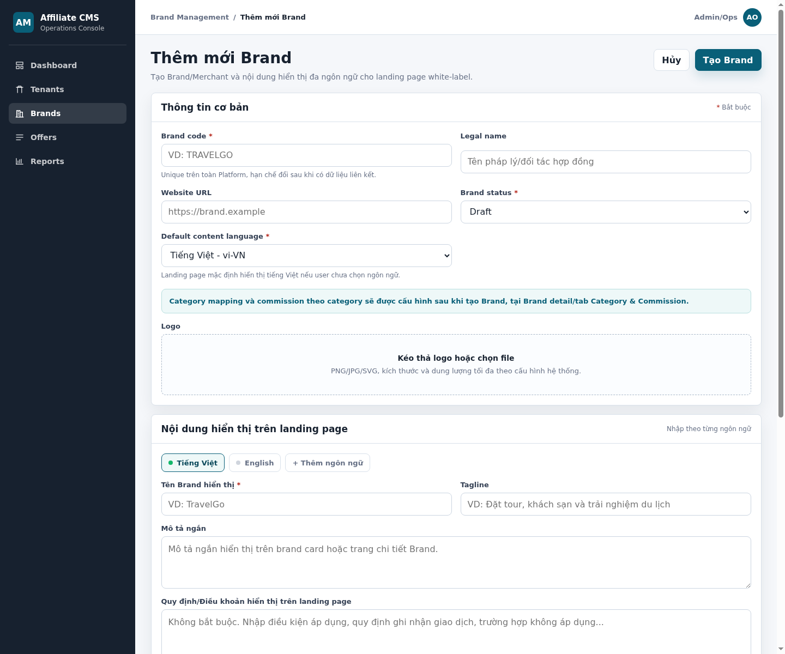

HTML mockup đầy đủ: [cms-brand-create.html](../mockups/cms-brand-create.html)

### g. Screen Description

Screen 1: Create Brand

| # | Items | R/O | Control type | Data type | Description / Validation / Error handling |
|---:|---|---|---|---|---|
| 1 | Brand code | R | Textbox | Text | Mã định danh Brand trên hệ thống. Chỉ cho nhập chữ cái không dấu, số, `_`, `-`; khuyến nghị uppercase; tối đa 50 ký tự. Không cho trùng với Brand code đã tồn tại. Nếu trống hiển thị lỗi `Vui lòng nhập Brand code`; nếu trùng hiển thị `Brand code đã tồn tại`; nếu sai định dạng hiển thị `Brand code chỉ gồm chữ, số, "_" hoặc "-"`. |
| 2 | Legal name | O | Textbox | Text | Tên pháp lý của Brand, dùng cho vận hành nội bộ/hợp đồng. Tối đa 255 ký tự. Nếu vượt quá giới hạn hiển thị lỗi `Legal name không được vượt quá 255 ký tự`. |
| 3 | Website URL | R | Textbox | URL | Website chính của Brand và bắt buộc nhập. Giá trị phải là URL hợp lệ có protocol `http://` hoặc `https://`. Nếu bỏ trống hiển thị `Vui lòng nhập Website URL`; nếu sai định dạng hiển thị `Website URL không hợp lệ`. |
| 4 | Logo | O | Upload | File | Logo Brand dùng cho CMS/landing page nếu được hiển thị. Chấp nhận PNG/JPG/SVG theo policy, dung lượng tối đa theo cấu hình hệ thống. Nếu sai định dạng hiển thị `Định dạng logo không được hỗ trợ`; nếu quá dung lượng hiển thị `Dung lượng logo vượt quá giới hạn`. |
| 5 | Status | R | Dropdown | Enum | Trạng thái Brand gồm `Draft`, `Active`, `Inactive`. Mặc định `Draft`. Nếu chọn `Active`, hệ thống phải kiểm tra tối thiểu Brand code và display name default locale hợp lệ. |
| 6 | Default content language | R | Dropdown/Tab | Locale | Ngôn ngữ mặc định để nhập content, default `vi-VN`. Locale được chọn phải nằm trong danh sách supported locales của hệ thống. |
| 7 | Display name | R | Textbox | Localized text | Tên hiển thị của Brand trên landing page theo từng locale. Bắt buộc với default locale. Tối đa 120 ký tự. Nếu thiếu default locale hiển thị `Vui lòng nhập tên hiển thị cho ngôn ngữ mặc định`. |
| 8 | Tagline | O | Textbox | Localized text | Dòng mô tả ngắn/khẩu hiệu của Brand theo locale. Tối đa 160 ký tự. Nếu vượt quá giới hạn hiển thị lỗi tương ứng. |
| 9 | Short description | O | Textarea | Localized text | Mô tả ngắn hiển thị trên landing page hoặc chi tiết Brand. Tối đa 500 ký tự theo mỗi locale. Nếu nhập HTML/script không được phép, hệ thống sanitize hoặc báo lỗi theo policy. |
| 10 | Terms | O | Textarea | Localized text | Quy định/điều khoản của Brand để hiển thị trên landing page nếu có. Cho phép xuống dòng; không bắt buộc. Nếu hỗ trợ rich text, phải sanitize nội dung trước khi lưu. |
| 11 | Pending days | R | Number input | Integer | Số ngày chờ xác nhận đơn trước khi đủ điều kiện commission/đối soát nếu áp dụng. Chỉ nhận số nguyên >= 0. Nếu nhập số âm/ký tự không hợp lệ hiển thị `Pending days phải là số nguyên không âm`. |
| 12 | Contact name | O | Textbox | Text | Người liên hệ phía Brand. Tối đa 120 ký tự. |
| 13 | Contact email | O | Textbox | Email | Email liên hệ phía Brand. Nếu nhập phải đúng định dạng email. Nếu sai hiển thị `Contact email không hợp lệ`. |
| 14 | Contact phone | O | Textbox | Text | Số điện thoại liên hệ. Cho phép số, khoảng trắng, `+`, `-`, `(`, `)`. Nếu sai định dạng hiển thị `Contact phone không hợp lệ`. |
| 15 | Notes | O | Textarea | Text | Ghi chú nội bộ, không hiển thị cho End user. Tối đa theo cấu hình hệ thống; nếu vượt giới hạn hiển thị lỗi. |
| 16 | Cancel | O | Button | Click | Hủy thao tác. Nếu form có thay đổi chưa lưu, hiển thị confirmation trước khi rời màn. |
| 17 | Create Brand | R | Button | Click | Submit tạo Brand. Khi click, hệ thống validate toàn bộ field; nếu có lỗi thì không lưu và focus vào field lỗi đầu tiên; nếu hợp lệ thì tạo Brand và ghi audit log. |

### h. Logic Description

| # | Step | Actor/Object | Logic |
|---:|---|---|---|
| 1 | Input data | Admin/Ops | Nhập thông tin Brand và content theo locale. |
| 2 | Validate UI | CMS Interface | Kiểm tra required fields, URL, email, file upload. |
| 3 | Validate server | Brand Service | Kiểm tra `brand_code` unique và dữ liệu hợp lệ. |
| 4 | Save | Brand Service | Tạo Brand ở trạng thái được chọn. |
| 5 | Audit | Audit Service | Ghi action `CREATE_BRAND`, actor, timestamp, payload theo policy. |

### i. Business Rules

| BR ID | Rule |
|---|---|
| BR-BRAND-002-01 | Brand code là bắt buộc và unique trên toàn Platform. |
| BR-BRAND-002-02 | Không chọn category tại màn thêm mới Brand; category mapping cấu hình tại Brand detail/tab Category & Commission. |
| BR-BRAND-002-03 | Không hiển thị hoặc nhập API credential/status trong form thêm Brand. |
| BR-BRAND-002-04 | Display name theo default locale là bắt buộc để Brand đủ điều kiện active. |
| BR-BRAND-002-05 | Mọi content nhập theo locale phải fallback về `vi-VN` nếu locale user chọn chưa có nội dung. |
| BR-BRAND-002-06 | Brand có thể được tạo ở Draft khi chưa có Category Mapping. Để chuyển sang Active/ready for order commission, Brand phải có đúng 1 Category Mapping Active được đánh dấu mặc định trong tab Category & Commission. |
| BR-BRAND-002-07 | Website URL là bắt buộc đối với mọi trạng thái Brand và phải là URL hợp lệ bắt đầu bằng `http://` hoặc `https://`. |

### j. Acceptance Criteria

| AC ID | Criteria |
|---|---|
| AC-BRAND-002-01 | Admin/Ops tạo được Brand mới khi nhập đầy đủ Brand code, Website URL, status, default locale, display name default locale và pending days hợp lệ. |
| AC-BRAND-002-02 | Hệ thống không cho lưu nếu Brand code trống, sai định dạng hoặc bị trùng. |
| AC-BRAND-002-03 | Hệ thống không yêu cầu chọn category khi tạo Brand. |
| AC-BRAND-002-04 | Hệ thống không hiển thị các trường API credential reference, Order success API status, Cancel/refund integration status trên form Brand. |
| AC-BRAND-002-05 | Sau khi tạo thành công, hệ thống ghi audit log và điều hướng về Brand detail hoặc Brand list theo thiết kế. |
| AC-BRAND-002-06 | Nếu Admin/Ops tạo/chuyển Brand sang Active khi chưa có đúng 1 default category active, hệ thống không cho lưu trạng thái Active và hiển thị `Vui lòng cấu hình đúng 1 category mặc định cho Brand trước khi Active`. |
| AC-BRAND-002-07 | Website URL bỏ trống hoặc không bắt đầu bằng `http://`/`https://` bị chặn và hiển thị lỗi tại field. |

## 3. CMS-BRAND-003 - Sửa Brand

### a. Introduction

Chức năng cho phép Admin/Ops cập nhật thông tin Brand, contact và content đa ngôn ngữ.

### b. Actors/Objects

| Actor/Object | Role |
|---|---|
| Admin/Ops | Chỉnh sửa thông tin Brand. |
| CMS Interface | Hiển thị dữ liệu hiện tại và form edit. |
| Brand Service | Validate và cập nhật Brand. |
| Audit Service | Ghi log old/new value theo policy. |

### c. Pre-conditions

- Brand tồn tại.
- Admin/Ops có quyền `brand.update`.

### d. Expected Result

- Brand được cập nhật thành công.
- Audit log ghi nhận thay đổi.
- Nếu Brand inactive, Offer thuộc Brand không hiển thị/click trên marketplace.

### e. Logic Diagram

### f. Screen Flow

1. Brand List.
2. Brand Detail/Edit Brand.
3. Back to Brand Detail/List.

### g. Screen Description

Screen 1: Edit Brand dùng cùng cấu trúc với Create Brand, có thêm dữ liệu hiện tại được prefill.

| # | Items | Control type | Data type | Description / Validation / Error handling |
|---:|---|---|---|---|
| 1 | Brand code | Textbox | Text | Hiển thị Brand code hiện tại. Nếu Brand đã có Offer/click/order/commission/assignment thì không cho sửa hoặc phải theo migration policy. Nếu user cố sửa khi không được phép, hiển thị `Brand code không thể thay đổi vì đã có dữ liệu liên kết`. |
| 2 | Brand profile fields | Inputs | Mixed | Các trường giống Create Brand, prefill dữ liệu hiện tại. Validate lại required fields, URL, email, phone, pending days như màn Create Brand. |
| 3 | Localized content | Tabs/Inputs | Localized text | Cho phép sửa content từng locale. Default locale vẫn bắt buộc có Display name nếu Brand Active. Nếu thiếu, hiển thị lỗi tại tab locale tương ứng. |
| 4 | Save | Button | Click | Lưu thay đổi. Nếu có conflict version/updated_at, hiển thị `Dữ liệu đã được cập nhật bởi người khác, vui lòng tải lại`. |
| 5 | Cancel | Button | Click | Hủy thay đổi. Nếu có dữ liệu chưa lưu, hiển thị confirmation trước khi rời màn. |

### h. Logic Description

| # | Step | Actor/Object | Logic |
|---:|---|---|---|
| 1 | Load data | Brand Service | Lấy Brand theo `brand_id`. |
| 2 | Edit | Admin/Ops | Cập nhật field cần sửa. |
| 3 | Validate | Brand Service | Validate format, required fields, brand code policy. |
| 4 | Save | Brand Service | Cập nhật Brand nếu hợp lệ. |
| 5 | Audit | Audit Service | Ghi old/new value. |

### i. Business Rules

| BR ID | Rule |
|---|---|
| BR-BRAND-003-01 | Brand code hạn chế sửa sau khi đã có Offer, click, order, commission, assignment hoặc settlement. |
| BR-BRAND-003-02 | Khi Brand inactive, Offer thuộc Brand không hiển thị/click trên marketplace. |
| BR-BRAND-003-03 | Sửa localized content phải giữ Display name của default locale nếu Brand Active. |
| BR-BRAND-003-04 | Mọi thay đổi Brand phải ghi audit log old/new value theo policy. |
| BR-BRAND-003-05 | Khi chuyển Brand từ Draft/Inactive sang Active, Brand Service phải validate có đúng 1 category active được đánh dấu mặc định; nếu không đạt thì chặn cập nhật trạng thái. |

### j. Acceptance Criteria

| AC ID | Criteria |
|---|---|
| AC-BRAND-003-01 | Admin/Ops cập nhật được thông tin Brand khi có quyền `brand.update` và dữ liệu hợp lệ. |
| AC-BRAND-003-02 | Hệ thống chặn sửa Brand code nếu Brand đã có dữ liệu liên kết và chưa có migration policy. |
| AC-BRAND-003-03 | Hệ thống không cho lưu Brand Active nếu thiếu Display name default locale. |
| AC-BRAND-003-04 | Sau khi sửa thành công, audit log ghi nhận field thay đổi, old value và new value theo policy. |

## 4. CMS-BRAND-004 - Xóa/ngưng hoạt động Brand

### a. Introduction

Chức năng cho phép Admin/Ops deactivate/soft delete Brand để dừng hiển thị/click trên marketplace.

### b. Actors/Objects

| Actor/Object | Role |
|---|---|
| Admin/Ops | Chọn action ngưng hoạt động. |
| CMS Interface | Hiển thị confirmation. |
| Brand Service | Kiểm tra liên kết và cập nhật status. |
| Offer Service | Đảm bảo Offer thuộc Brand không hiển thị/click. |
| Audit Service | Ghi log. |

### c. Pre-conditions

- Brand tồn tại.
- Admin/Ops có quyền `brand.delete` hoặc `brand.deactivate`.

### d. Expected Result

- Brand chuyển sang inactive/soft delete.
- Offer thuộc Brand không còn hiển thị/click.
- Không hard delete dữ liệu đã phát sinh liên kết.

### e. Logic Diagram

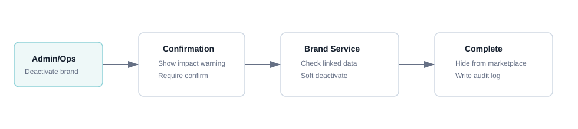

### f. Screen Flow

1. Brand List hoặc Brand Detail.
2. Confirmation dialog.
3. Brand List/Detail sau khi cập nhật status.

### g. Screen Description

Screen 1: Deactivate Confirmation

| # | Items | Control type | Data type | Description / Validation / Error handling |
|---:|---|---|---|---|
| 1 | Confirmation message | Label | Text | Thông báo rõ Brand sau khi inactive sẽ không hiển thị/click trên marketplace và Offer thuộc Brand cũng bị ảnh hưởng. |
| 2 | Cancel | Button | Click | Đóng popup, không thay đổi dữ liệu. |
| 3 | Confirm | Button | Click | Xác nhận deactivate/soft delete. Nếu không có quyền, hiển thị `Bạn không có quyền ngưng hoạt động Brand`. Nếu Brand đã có dữ liệu liên kết, hệ thống chỉ soft delete/deactivate, không hard delete. |

### h. Logic Description

| # | Step | Actor/Object | Logic |
|---:|---|---|---|
| 1 | Confirm action | Admin/Ops | Xác nhận muốn ngưng hoạt động Brand. |
| 2 | Dependency check | Brand Service | Kiểm tra Offer, Click, Order, Commission Rule, Assignment, Settlement. |
| 3 | Update status | Brand Service | Không hard delete nếu đã có dữ liệu liên kết. |
| 4 | Runtime effect | Platform | Brand/Offer inactive không hiển thị/click. |

### i. Business Rules

| BR ID | Rule |
|---|---|
| BR-BRAND-004-01 | Không hard delete Brand đã có Offer, Click, Order, Commission Rule, Assignment hoặc Settlement. |
| BR-BRAND-004-02 | Brand inactive làm Offer thuộc Brand không hiển thị/click trên marketplace. |
| BR-BRAND-004-03 | Direct link tới Brand/Offer inactive phải bị chặn hoặc trả trạng thái không hợp lệ theo policy. |
| BR-BRAND-004-04 | Mọi thao tác deactivate/soft delete phải ghi audit log. |

### j. Acceptance Criteria

| AC ID | Criteria |
|---|---|
| AC-BRAND-004-01 | Admin/Ops có quyền có thể deactivate Brand sau khi xác nhận. |
| AC-BRAND-004-02 | Brand đã có dữ liệu liên kết không bị hard delete. |
| AC-BRAND-004-03 | Sau khi Brand inactive, Offer thuộc Brand không hiển thị/click trên marketplace. |
| AC-BRAND-004-04 | Hệ thống ghi audit log cho thao tác deactivate/soft delete. |

## 5. CMS-BRAND-005 - Cấu hình Category Mapping & Commission

### a. Introduction

Chức năng cho phép Admin/Ops mapping category phía Brand với Affiliate category và cấu hình commission Brand trả Affiliate theo từng category. Rule này được xét theo từng order item khi item không có `brand_offer_code`. Theo integration contract, Brand phải ưu tiên gửi `brand_category_id/code`; nếu không gửi, Platform vẫn tiếp nhận item và fallback sang Category Mapping Active mặc định của Brand.

### b. Actors/Objects

| Actor/Object | Role |
|---|---|
| Admin/Ops | Nhập mapping và commission. |
| Partnership/Ops | Cung cấp thông tin Brand category ID/code và commission theo hợp đồng. |
| CMS Interface | Hiển thị danh sách mapping và form thêm nhiều dòng. |
| Commission Service | Validate/lưu mapping & commission. |
| Order/Commission Runtime | Resolve commission khi nhận order success. |

### c. Pre-conditions

- Brand đã tồn tại.
- Affiliate category đã được tạo.
- Admin/Ops có quyền `brand.commission.update`.

### d. Expected Result

- Mapping category và commission được lưu thành công.
- Order item không có `brand_offer_code` ưu tiên dùng `brand_category_id/code` Brand gửi để resolve sang Affiliate Category và tính commission.
- Nếu order item không có cả `brand_offer_code` và `brand_category_id/code`, hệ thống dùng Category Mapping Active được đánh dấu mặc định của Brand để tính commission.
- Nếu không có default Category Active hoặc default không có commission rule hợp lệ, item được đưa vào exception tương ứng và không tính commission tự động.

### e. Logic Diagram

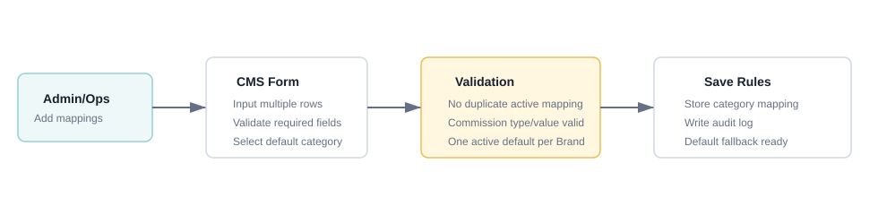

### f. Screen Flow

1. Brand Detail.
2. Category & Commission List.
3. Add Category & Commission.
4. Back to Category & Commission List.

Mockups:

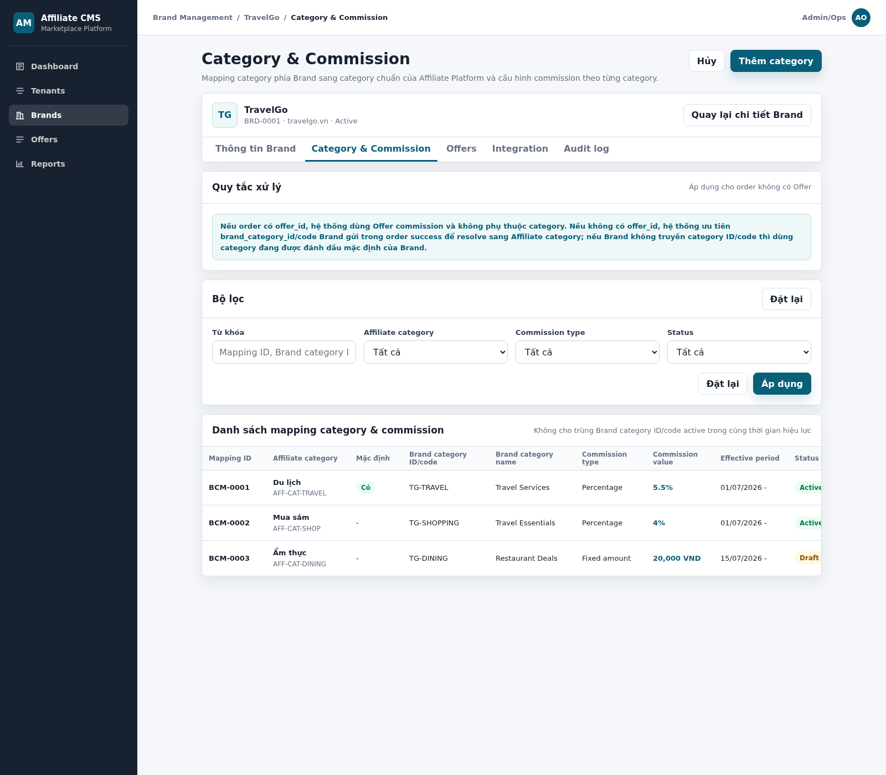

HTML mockup đầy đủ: [cms-brand-category-commission.html](../mockups/cms-brand-category-commission.html)

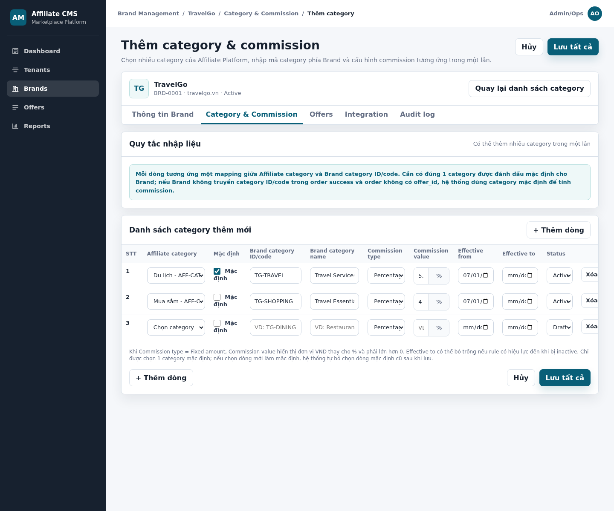

HTML mockup đầy đủ: [cms-brand-category-commission-create.html](../mockups/cms-brand-category-commission-create.html)

### g. Screen Description

Screen 1: Category & Commission List

| # | Items | Control type | Data type | Description / Validation / Error handling |
|---:|---|---|---|---|
| 1 | Keyword | Textbox | Text | Tìm theo mapping ID, Brand category ID/code, Brand category name. Không tìm theo commission value để tránh kết quả khó hiểu. |
| 2 | Affiliate category | Dropdown | Ref | Lọc theo category chuẩn của Platform. Chỉ hiển thị category active trong filter mặc định. |
| 3 | Commission type | Dropdown | Enum | Percentage, Fixed amount. Nếu không chọn thì hiển thị mọi type. |
| 4 | Status | Dropdown | Enum | Draft, Active, Inactive. Chỉ mapping Active được dùng để resolve commission runtime. |
| 5 | Mapping ID | Label | ReadOnly | ID mapping do hệ thống sinh. |
| 6 | Affiliate category | Label | Ref | Category chuẩn Affiliate đã được mapping. Nếu category bị inactive, hiển thị trạng thái để Admin/Ops biết cần xử lý. |
| 7 | Mặc định | Badge/Checkbox state | Boolean | Hiển thị Category Mapping mặc định của Brand. Brand Draft có thể chưa có default Category; Brand Active/ready for commission phải có đúng 1 mapping Active được đánh dấu mặc định. Default được dùng khi order item không có cả `brand_offer_code` và `Brand category ID/code` hoặc không có `brand_offer_code` và có `Brand category ID/code` nhưng mapping với rule chưa hợp lệ. |
| 8 | Brand category ID/code | Label | Text | Mã Category phía Brand phải ưu tiên truyền theo từng order item khi item không có `brand_offer_code`. Đây là khóa ưu tiên để resolve Category commission; nếu item không gửi code thì Platform fallback default Category Active. |
| 9 | Brand category name | Label | Text | Tên gợi nhớ category phía Brand; nếu trống hiển thị `-`. |
| 10 | Commission type/value | Label | Mixed | Hiển thị `%` nếu Percentage; hiển thị `VND` nếu Fixed amount. Nếu thiếu rule hợp lệ, hiển thị `Chưa cấu hình`. |
| 11 | Effective period | Label | Date range | Khoảng hiệu lực của mapping/commission. Khi thời điểm hiện tại nằm ngoài khoảng hiệu lực, UI hiển thị computed badge `Out of effective period`/`Expired`; đây không phải status lưu trong database và hệ thống không tự đổi status `Active` thành `Expired`. |
| 12 | Actions | Button/Menu | Click | Sửa hoặc inactive mapping. Action phụ thuộc quyền `brand.commission.update`. |

Screen 2: Add Category & Commission

| # | Items | R/O | Control type | Data type | Description / Validation / Error handling |
|---:|---|---|---|---|---|
| 1 | Affiliate category | R | Dropdown | Ref | Chọn category chuẩn của Affiliate Platform. Chỉ hiển thị category active. Nếu chưa chọn hiển thị lỗi tại dòng `Vui lòng chọn Affiliate category`. |
| 2 | Mặc định | Conditional | Checkbox | Boolean | Đánh dấu Category Mapping mặc định cho Brand. Chỉ được có 1 default mapping Active. Brand Draft được phép chưa có default; nếu Brand đang Active/ready for commission mà kết quả sau khi lưu không có đúng 1 default Active, hiển thị `Vui lòng chọn đúng 1 category mặc định cho Brand`. Khi chọn default mới, hệ thống bỏ đánh dấu default ở dòng cũ trong cùng transaction. |
| 3 | Brand category ID/code | R | Textbox | Text | Mã category phía Brand sẽ truyền trong order success. Cho phép chữ, số, `_`, `-`, `.`, tối đa 100 ký tự. Không được trùng active trong cùng Brand và cùng khoảng hiệu lực. Nếu trống hiển thị `Vui lòng nhập Brand category ID/code`; nếu trùng hiển thị `Brand category ID/code đã tồn tại trong khoảng hiệu lực`. |
| 4 | Brand category name | O | Textbox | Text | Tên gợi nhớ category phía Brand, phục vụ vận hành. Tối đa 255 ký tự. |
| 5 | Commission type | R | Dropdown | Enum | Chọn `Percentage` hoặc `Fixed amount`. Khi chọn `Percentage`, field Commission value hiển thị đơn vị `%`; khi chọn `Fixed amount`, hiển thị `VND`. |
| 6 | Commission value | R | Number input | Decimal | Giá trị commission Brand trả Affiliate cho category này. Nếu type = Percentage, chỉ nhận số > 0 và <= 100, cho phép tối đa 2 chữ số thập phân. Nếu type = Fixed amount, chỉ nhận số > 0 theo policy tiền tệ VND; không cho phép bằng 0. Nếu sai hiển thị `Commission value không hợp lệ`. |
| 7 | Effective from | R | Date picker | Date | Ngày bắt đầu hiệu lực của mapping/commission. Nếu trống hiển thị `Vui lòng chọn Effective from`. |
| 8 | Effective to | O | Date picker | Date | Ngày kết thúc hiệu lực. Nếu nhập phải >= Effective from. Nếu sai hiển thị `Effective to phải lớn hơn hoặc bằng Effective from`. |
| 9 | Status | R | Dropdown | Enum | Draft, Active, Inactive. Chỉ rule Active mới được dùng để resolve commission. Không cho inactive/delete category mặc định nếu không có category mặc định thay thế. |
| 10 | Add row | O | Button | Click | Thêm một dòng mapping mới trên form. Dòng mới mặc định status `Draft`; chưa lưu vào hệ thống cho đến khi click Save. |
| 11 | Save | R | Button | Click | Lưu nhiều mapping theo cơ chế all-or-nothing. Nếu bất kỳ dòng nào lỗi, không lưu toàn bộ danh sách, giữ dữ liệu form và highlight lỗi tại từng dòng. Chỉ khi tất cả các dòng hợp lệ, hệ thống mới lưu mapping, commission và cập nhật default Category trong cùng transaction. |

### h. Logic Description

| # | Step | Actor/Object | Logic |
|---:|---|---|---|
| 1 | Open mapping list | Admin/Ops | Mở tab Category & Commission trong Brand detail. |
| 2 | Add rows | Admin/Ops | Nhập một hoặc nhiều dòng mapping. |
| 3 | Validate duplicate | Commission Service | Không cho trùng `brand_category_id/code` active trong cùng Brand và cùng khoảng hiệu lực. |
| 4 | Validate commission | Commission Service | Nếu Percentage: value > 0 và theo `%`; nếu Fixed amount: value > 0 VND. |
| 5 | Validate default category | Commission Service | Nếu Brand đang Draft, cho phép chưa có default Category nhưng không cho có nhiều hơn 1 default Active. Nếu Brand đang Active/ready for commission, bắt buộc có đúng 1 Category Mapping Active được đánh dấu default. Khi chọn default mới, hệ thống cập nhật default cũ về false trong cùng transaction. |
| 6 | Save atomically | Commission Service | Chỉ lưu khi toàn bộ các dòng hợp lệ. Lưu mapping, commission và thay đổi default trong một transaction; lỗi bất kỳ rollback toàn bộ, giữ form và hiển thị lỗi theo dòng. |

### i. Business Rules

| BR ID | Rule |
|---|---|
| BR-BRAND-005-01 | Không cấu hình commission Brand-level trong MVP1 cho Brand commission. |
| BR-BRAND-005-02 | Category-level commission được cấu hình theo từng Brand + Affiliate category mapping. |
| BR-BRAND-005-03 | Khi order item không có `brand_offer_code`, integration contract yêu cầu Brand ưu tiên gửi `brand_category_id/code`; Platform dùng code này để mapping sang `affiliate_category_id`. Category code không phải field bắt buộc ở mức schema vì hệ thống hỗ trợ fallback default Category. |
| BR-BRAND-005-04 | Với từng order item: nếu có `brand_offer_code`, resolve Offer commission; nếu không có Offer code nhưng có `brand_category_id/code`, resolve Category commission theo code Brand gửi; nếu không có cả hai thì dùng Category Mapping Active mặc định của Brand. |
| BR-BRAND-005-05 | Nếu Brand có gửi `brand_category_id/code` nhưng không mapping được   thì sẽ fallback default Category. Nếu Brand không gửi Category code và không Active thì fallback Category Default.; nếu mapping tồn tại nhưng thiếu rule hợp lệ thì fallback Category Default. |
| BR-BRAND-005-06 | Không cho trùng active Brand category ID/code trong cùng Brand và cùng khoảng hiệu lực. |
| BR-BRAND-005-07 | Brand Draft có thể chưa có default Category; Brand Active/ready for commission phải có đúng 1 Category Mapping Active được đánh dấu default. Không cho xóa/inactive default Category của Brand Active nếu chưa chọn default thay thế. |
| BR-BRAND-005-08 | Không cho phép có nhiều hơn 1 default Category Active trong mọi trạng thái Brand. Với Brand Active, nếu thao tác làm phát sinh 0 hoặc nhiều hơn 1 default Active, hệ thống phải chặn lưu và hiển thị lỗi tại nhóm default Category. |
| BR-BRAND-005-09 | Lưu nhiều Category Mapping & Commission phải all-or-nothing; lỗi ở bất kỳ dòng nào rollback toàn bộ request. |
| BR-BRAND-005-10 | Hết Effective To chỉ làm mapping/rule không còn hiệu lực runtime; status lưu vẫn là `Active` và không tự đổi thành `Expired`. |

### j. Acceptance Criteria

| AC ID | Criteria |
|---|---|
| AC-BRAND-005-01 | Admin/Ops thêm được nhiều category mapping & commission trong một lần. |
| AC-BRAND-005-02 | Hệ thống bắt buộc nhập Affiliate category, Brand category ID/code, commission type, commission value, effective from và status cho từng dòng. Brand Draft có thể chưa có default; Brand Active phải có đúng 1 dòng default Active. |
| AC-BRAND-005-03 | Hệ thống chặn mapping trùng Brand category ID/code active cùng Brand và cùng khoảng hiệu lực. |
| AC-BRAND-005-04 | Commission type Percentage hiển thị `%`; Fixed amount hiển thị `VND`. |
| AC-BRAND-005-05 | Nếu Effective to nhỏ hơn Effective from, hệ thống không cho lưu và hiển thị lỗi tại dòng. |
| AC-BRAND-005-06 | Khi order item không có cả `brand_offer_code` và Brand category ID/code, hệ thống resolve được commission theo default Category Active nếu mapping/rule hợp lệ. |
| AC-BRAND-005-07 | Nếu một dòng trong request nhiều mapping không hợp lệ, không dòng nào được lưu; form giữ nguyên dữ liệu và highlight đúng các dòng lỗi. |
| AC-BRAND-005-08 | Category Mapping Active nằm ngoài Effective period không được dùng để resolve commission, hiển thị computed state `Out of effective period`/`Expired` và status vẫn giữ `Active`. |
| AC-BRAND-005-09 | Order item không có `brand_offer_code` nhưng có Brand Category code hợp lệ được resolve theo Category Mapping tương ứng, không dùng default Category. |
| AC-BRAND-005-10 | Order item không có cả Offer code và Category code vẫn được tiếp nhận và fallback default Category Active; nếu không có default hợp lệ thì vào exception `default_category_missing`. |
| AC-BRAND-005-11 | Order item có Category code nhưng code không mapping được phải fallback default Category. |

## 6. CMS-OFFER-001 - Xem danh sách Offer + lọc

### a. Introduction

Chức năng cho phép Admin/Ops xem danh sách Offer thuộc Brand hiện tại cùng thông tin Mapping & Commission tương ứng; lọc theo từ khóa, Offer status và trạng thái cấu hình commission; đồng thời truy cập các thao tác thêm mới, xem và chỉnh sửa Offer.

Mỗi dòng đại diện cho một Offer của Brand. Khi Offer đã được mapping, hệ thống hiển thị Mapping ID, Brand Offer ID/Code và Brand Offer Title. Offer chưa mapping vẫn được hiển thị nhưng các trường mapping có giá trị `-`.

Brand gửi `brand_offer_code` theo từng order item. Platform dùng cặp `brand_id + brand_offer_code` để xác định Offer commission. Nếu Brand gửi code nhưng hệ thống không tìm thấy mapping hợp lệ, order item được đưa vào exception.

### b. Actors/Objects

| Actor/Object | Role |
|---|---|
| Admin/Ops | Xem, lọc, thêm mới, mở chi tiết hoặc chỉnh sửa Offer theo quyền được cấp. |
| CMS Interface | Hiển thị Brand context, quy tắc mapping, bộ lọc, danh sách Offer Mapping & Commission và các action. |
| Offer Service | Truy vấn Offer theo Brand context, áp dụng điều kiện lọc và cung cấp Offer status. |
| Offer Mapping Service | Resolve Mapping ID, Brand Offer ID/Code và Brand Offer Title của Offer. |
| Commission Service | Cung cấp Commission type/value và trạng thái đã/chưa cấu hình commission. |
| Brand Service | Xác thực Brand tồn tại. |

### c. Pre-conditions

- Brand tồn tại.
- Admin/Ops đã đăng nhập CMS.
- Admin/Ops có quyền `offer.read`.

### d. Expected Result

- Chỉ Offer thuộc Brand hiện tại được hiển thị.
- Admin/Ops lọc được Offer theo từ khóa, Offer status và Commission rule status.
- Danh sách hiển thị đúng Mapping ID, thông tin Brand Offer và Commission rule của từng Offer.
- Offer chưa mapping hoặc chưa cấu hình commission vẫn xuất hiện với giá trị thay thế phù hợp.
- Admin/Ops mở được màn hình xem hoặc chỉnh sửa Offer nếu có quyền tương ứng.

### e. Logic Diagram

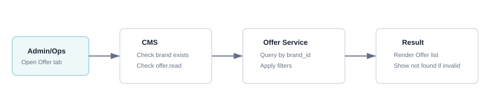

### f. Screen Flow

1. Admin/Ops mở Brand Detail của Brand cần quản lý.
2. Chọn tab `Offers` để mở màn hình Offer List.
3. Hệ thống tải danh sách Offer theo `brand_id`, kết hợp thông tin Mapping & Commission và hiển thị một Offer trên một dòng.
4. Admin/Ops có thể nhập/chọn điều kiện lọc rồi nhấn `Áp dụng`.
5. Nhấn icon `View` tại cột `Action` để mở `cms-offer-view.html`; tất cả trường ở chế độ read-only.
6. Từ màn View, nhấn `Chỉnh sửa` hoặc nhấn icon `Edit` trên list để mở `cms-offer-edit.html`.
7. Trên màn Edit, Brand, Brand ID và Offer ID là read-only; các trường được phép sửa gồm Offer status, thời gian hiệu lực, URL, localized content, Brand Offer ID/Code, Brand Offer Title và commission.
8. Nhấn `Thêm Offer` để mở `cms-offer-create.html`. Offer ID chưa hiển thị trên Create vì chỉ được sinh sau khi lưu.
9. Nhấn `Quay lại danh sách Brand` để trở về Brand List.

Mockup toàn màn hình:

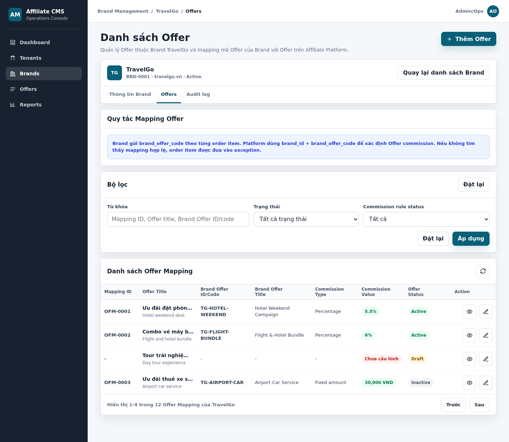

HTML mockup đầy đủ: [cms-offer-list.html](../mockups/cms-offer-list.html)

### g. Screen Description

Screen 1: Offer List

| # | Items | Control type | Data type | Description / Validation / Error handling |
|---:|---|---|---|---|
| 1 | Page title | Heading | Text | Hiển thị `Danh sách Offer`, xác định chức năng hiện tại. |
| 2 | Page description | Label | Text | Mô tả danh sách quản lý Offer của Brand hiện tại và mapping mã Offer của Brand với Offer trên Affiliate Platform. |
| 3 | Thêm Offer | Button | Action | Nhấn để mở màn hình `CMS-OFFER-002 - Thêm mới Offer` trong context của Brand hiện tại. Chỉ hiển thị/enable khi user có quyền `offer.create`. |
| 4 | Brand context | Information block | ReadOnly | Hiển thị Brand logo, Display name, Brand ID, Domain và Brand status. Dữ liệu được lấy từ Brand đang mở; Admin/Ops không thay đổi Brand context trực tiếp tại màn hình này. |
| 5 | Quay lại danh sách Brand | Button | Navigation | Nhấn để trở về màn hình Brand List. Không làm thay đổi dữ liệu Offer. |
| 7 | Quy tắc Mapping Offer | Information panel | Text | Giải thích Brand gửi `brand_offer_code` theo từng order item; Platform dùng `brand_id + brand_offer_code` để xác định Offer commission; code không mapping được làm order item vào exception. |
| 8 | Từ khóa | Textbox | Text | Cho phép tìm theo Mapping ID, Offer Title, Brand Offer ID/Code hoặc Brand Offer Title. Tự động trim khoảng trắng đầu/cuối; không phân biệt hoa/thường theo search policy. Bỏ trống nghĩa là không áp dụng keyword. |
| 9 | Trạng thái | Dropdown | Enum | Gồm `Tất cả trạng thái`, `Active`, `Draft`, `Inactive`; mặc định `Tất cả trạng thái`. Lọc theo Offer Status, không phải trạng thái mapping. |
| 10 | Commission rule status | Dropdown | Enum | Gồm `Tất cả`, `Đã cấu hình`, `Chưa cấu hình`. `Đã cấu hình` khi Commission type/value hợp lệ; `Chưa cấu hình` khi không có rule hoặc rule thiếu dữ liệu. |
| 11 | Đặt lại tại tiêu đề bộ lọc | Button | Action | Xóa keyword, đưa Offer Status về `Tất cả trạng thái` và Commission rule status về `Tất cả`, sau đó tải lại trang đầu. |
| 12 | Đặt lại tại cuối bộ lọc | Button | Action | Có cùng nghiệp vụ với nút `Đặt lại` tại tiêu đề bộ lọc. |
| 13 | Áp dụng | Button | Action | Áp dụng ba điều kiện lọc theo toán tử AND và quay về trang đầu. Không có dữ liệu thì hiển thị `Không tìm thấy Offer phù hợp`. |
| 14 | Refresh | Icon button | Action | Tải lại dữ liệu theo Brand context, giữ nguyên bộ lọc và trang hiện tại nếu trang còn hợp lệ. |
| 15 | Mapping ID | Label | String/ReadOnly | ID do Platform sinh cho mapping, ví dụ `OFM-0001`. Nếu Offer chưa mapping, hiển thị `-`. Không phải Offer ID. |
| 16 | Offer Title | Label | Localized text | Đây là Title Offer của Platform hiển thị Offer Title theo default locale; dòng phụ hiển thị badge/label phụ theo mockup. Nội dung dài được rút gọn bằng `...`. |
| 17 | Brand Offer ID/Code | Label | String | Là mã offer bên Brand cung cấp để mapping với Offer ID trên platform bên có thể tính được hoa hồng theo Offer ghi nhận. Nếu chưa mapping, hiển thị `-`. |
| 18 | Brand Offer Title | Label | Text | Tên Offer tham chiếu trong hệ thống Brand; chỉ phục vụ nhận biết/vận hành, không dùng làm khóa resolve commission. Nếu chưa mapping, hiển thị `-`. |
| 19 | Commission Type | Label | Enum | Hiển thị `Percentage` hoặc `Fixed amount`. Nếu chưa cấu hình commission, hiển thị `-`. |
| 20 | Commission Value | Badge/Label | Decimal + Unit | Với Percentage hiển thị `%`; với Fixed amount hiển thị `VND`. Nếu chưa có rule hợp lệ, hiển thị `Chưa cấu hình`. |
| 21 | Offer Status | Badge | Enum | Hiển thị `Draft`, `Active` hoặc `Inactive`. Đây là trạng thái cấu hình Offer, độc lập với việc Offer đã mapping hoặc có commission hay chưa. |
| 22 | View | Icon button | Action | Nhấn icon con mắt để mở `cms-offer-view.html`. Màn View hiển thị Brand, Brand ID, Offer ID, thông tin chung, localized content, Mapping & Commission ở chế độ read-only. |
| 23 | Edit | Icon button | Action | Nhấn icon bút chì để mở `cms-offer-edit.html`. Brand, Brand ID và Offer ID không cho sửa; các trường được phép sửa thực hiện theo UC `CMS-OFFER-003`. Chỉ enable khi user có quyền `offer.update`. |
| 24 | Pagination summary | Label | Integer | Hiển thị phạm vi bản ghi, tổng Offer Mapping và Brand context, ví dụ `Hiển thị 1-4 trong 12 Offer Mapping của TravelGo`. |
| 25 | Trước/Sau | Button | Action | Chuyển trang và giữ nguyên điều kiện lọc. `Trước` disable ở trang đầu; `Sau` disable ở trang cuối. |

### h. Logic Description

| # | Step | Actor/Object | Logic |
|---:|---|---|---|
| 1 | Open tab | Admin/Ops | Mở tab `Offers` từ Brand Detail. |
| 2 | Validate context | Brand Service | Kiểm tra `brand_id` tồn tại và user có quyền `offer.read`. Nếu Brand không tồn tại, trả về not found; nếu không có quyền, trả về forbidden. |
| 3 | Normalize filters | CMS Interface | Trim keyword; chuẩn hóa Offer status và Commission rule status về enum hợp lệ. |
| 4 | Query Offer | Offer Service | Truy vấn Offer theo `brand_id`, điều kiện lọc và phân trang. |
| 5 | Resolve mapping | Offer Mapping Service | Ghép mapping hiện tại của từng Offer để lấy Mapping ID, Brand Offer ID/Code và Brand Offer Title; không có mapping thì trả `null`. |
| 6 | Resolve commission | Commission Service | Lấy Commission type/value của Offer; không có rule hợp lệ thì đánh dấu `Chưa cấu hình`. |
| 7 | Apply filters | Offer Service | Áp dụng keyword, Offer status và Commission rule status theo toán tử AND. |
| 8 | Format result | CMS Interface | Chuyển giá trị mapping `null` thành `-`, format commission theo `%`/`VND`, rút gọn text dài và hiển thị action theo quyền. |
| 9 | Render result | CMS Interface | Hiển thị một Offer trên một dòng cùng phân trang; nếu không có kết quả thì hiển thị empty state. |

### i. Business Rules

| BR ID | Rule |
|---|---|
| BR-OFFER-001-01 | Offer list chỉ hiển thị Offer thuộc Brand hiện tại. |
| BR-OFFER-001-02 | Keyword áp dụng cho Mapping ID, Offer Title, Brand Offer ID/Code và Brand Offer Title. |
| BR-OFFER-001-03 | Keyword, Offer status và Commission rule status được kết hợp theo toán tử AND. |
| BR-OFFER-001-04 | Commission rule status gồm `Đã cấu hình` và `Chưa cấu hình`; không dùng để biểu diễn trạng thái tính hoa hồng của transaction. |
| BR-OFFER-001-05 | Mỗi Offer hiển thị một dòng. Offer chưa mapping vẫn hiển thị và các cột Mapping ID, Brand Offer ID/Code, Brand Offer Title có giá trị `-`. |
| BR-OFFER-001-06 | Mapping key dùng để resolve là `brand_id + brand_offer_code`; Brand Offer Title không phải khóa mapping. |
| BR-OFFER-001-07 | Khi order item có `brand_offer_code`, Platform phải resolve theo mapping hợp lệ của đúng Offer Brand. Không tìm thấy mapping thì fallback sang Category của item được brand gửi sang, nếu category mà brand gửi sang không hợp lệ thì fallback sang Category Default |
| BR-OFFER-001-08 | Commission Type chỉ gồm `Percentage` hoặc `Fixed amount`; Commission Value hiển thị đúng đơn vị `%` hoặc `VND`. |
| BR-OFFER-001-09 | Offer Status gồm `Draft`, `Active`, `Inactive` và độc lập với trạng thái mapping/commission. |
| BR-OFFER-001-10 | Offer không có category trong MVP1. |
| BR-OFFER-001-11 | Create/View/Edit hiển thị hoặc enable theo quyền `offer.create`, `offer.read`, `offer.update`. |
| BR-OFFER-001-12 | Offer ID không hiển thị trên Create form trước khi lưu; sau khi tạo thành công, Offer ID do Platform sinh được hiển thị trên View/Edit. |

### j. Acceptance Criteria

| AC ID | Criteria |
|---|---|
| AC-OFFER-001-01 | Admin/Ops chỉ nhìn thấy Offer thuộc Brand hiện tại. |
| AC-OFFER-001-02 | Keyword tìm được theo Mapping ID, Offer Title, Brand Offer ID/Code hoặc Brand Offer Title. |
| AC-OFFER-001-03 | Ba điều kiện Keyword, Offer Status và Commission rule status hiển thị trên cùng một hàng; không có bộ lọc Mapping. |
| AC-OFFER-001-04 | Bảng hiển thị đúng tám cột: Mapping ID, Offer Title, Brand Offer ID/Code, Brand Offer Title, Commission Type, Commission Value, Offer Status và Action. |
| AC-OFFER-001-05 | Offer chưa mapping vẫn xuất hiện; Mapping ID và thông tin Brand Offer hiển thị `-`. |
| AC-OFFER-001-06 | Percentage hiển thị `%`, Fixed amount hiển thị `VND`, chưa cấu hình hiển thị `Chưa cấu hình`. |
| AC-OFFER-001-07 | Cột Action hiển thị đầy đủ icon View và Edit trên desktop mà không cần cuộn ngang. |
| AC-OFFER-001-08 | View mở đúng bản ghi ở chế độ read-only; Edit mở đúng bản ghi và chỉ cho sửa các trường được phép. |
| AC-OFFER-001-09 | Nút Reset xóa toàn bộ điều kiện; Refresh và chuyển trang giữ nguyên điều kiện lọc. |
| AC-OFFER-001-10 | Thêm Offer mở Create form không có Offer ID; sau khi tạo thành công, Offer mới xuất hiện trên list. |
| AC-OFFER-001-11 | Khi không có Offer phù hợp, hệ thống hiển thị empty state; khi Brand không tồn tại, hệ thống hiển thị not found. |

## 7. CMS-OFFER-002 - Thêm mới Offer

### a. Introduction

Chức năng cho phép Admin/Ops tạo Offer mới trong Brand đang xem, cấu hình thời gian hiệu lực, URL điều hướng, nội dung hiển thị đa ngôn ngữ và tùy chọn Mapping & Commission giữa mã Offer của Brand với Offer trên Affiliate Platform.

Brand được lấy từ Brand context và hiển thị read-only; Admin/Ops không chọn lại Brand trên form. 

### b. Actors/Objects

| Actor/Object | Role |
|---|---|
| Admin/Ops | Nhập thông tin và gửi yêu cầu tạo Offer. |
| CMS Interface | Hiển thị Brand context, form thông tin chung, content đa ngôn ngữ và Mapping & Commission. |
| Brand Service | Kiểm tra Brand context tồn tại và đủ điều kiện tạo Offer. |
| Offer Service | Kiểm tra dữ liệu, sinh Offer ID và lưu Offer trong Brand context. |
| Offer Mapping Service | Kiểm tra Brand Offer ID/Code, chống trùng và sinh Mapping ID nếu Admin/Ops cấu hình mapping. |
| Commission Service | Kiểm tra và lưu Offer commission gắn với Offer/mapping nếu được cấu hình. |
| Audit Service | Ghi nhận lịch sử tạo Offer, mapping và commission rule đi kèm. |

### c. Pre-conditions

- Admin/Ops đã đăng nhập CMS.
- Brand context tồn tại và đủ điều kiện tạo Offer theo policy.
- Admin/Ops có quyền `offer.create`.

### d. Expected Result

- Offer mới được tạo đúng trong Brand context và được hệ thống sinh Offer ID duy nhất.
- Offer có thể được tạo với status `Draft`, `Active` hoặc `Inactive` theo dữ liệu hợp lệ tương ứng.
- Mapping & Commission là phần tùy chọn; thiếu phần này không chặn tạo hoặc Active Offer nếu các dữ liệu Offer bắt buộc đã hợp lệ.
- Nếu nhập Brand Offer ID/Code, Platform tạo Mapping ID và lưu mapping `brand_id + brand_offer_code → offer_id`.
- Nếu chọn Commission type, Commission value phải hợp lệ và được lưu cùng Offer.
- Offer vừa tạo xuất hiện trên Offer List. Nếu không nhập mapping, các cột Mapping ID, Brand Offer ID/Code và Brand Offer Title hiển thị `-`.
- Audit log ghi nhận thao tác tạo Offer.

### e. Logic Diagram

### f. Screen Flow

1. Admin/Ops mở Brand Detail và chọn tab `Offers`.
2. Tại Offer List, nhấn `Thêm Offer`.
3. Hệ thống mở màn hình `Thêm mới Offer` và gắn sẵn Brand context.
4. Admin/Ops nhập thông tin chung, content đa ngôn ngữ và tùy chọn Mapping & Commission.
5. Nhấn `Tạo Offer` tại cuối form để validate và lưu Offer, mapping và commission trong cùng transaction.
6. Tạo thành công: hệ thống hiển thị thông báo `Offer created successfully.` và chuyển về Offer List của Brand hiện tại.
7. Nhấn `Hủy` tại cuối form: nếu chưa thay đổi dữ liệu thì quay về `cms-offer-list.html`; nếu có dữ liệu chưa lưu thì hiển thị xác nhận rời màn hình.

Mockup toàn màn hình:

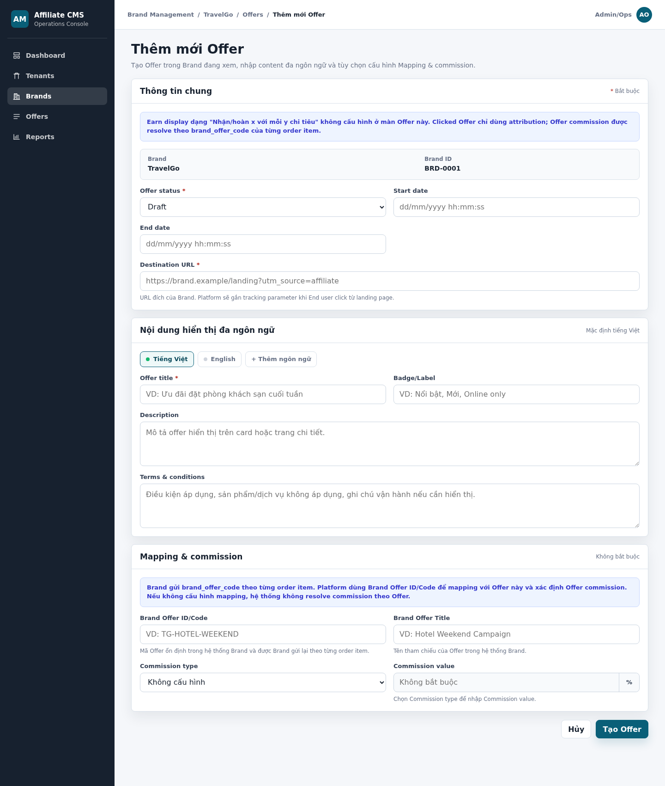

HTML mockup đầy đủ: [cms-offer-create.html](../mockups/cms-offer-create.html)

### g. Screen Description

Screen 1: Create Offer

| # | Items | R/O | Control type | Data type | Description / Validation / Error handling |
|---:|---|---|---|---|---|
| 1 | Page title | R | Heading | Text | Hiển thị `Thêm mới Offer`, xác định chức năng đang thực hiện. |
| 2 | Page description | R | Label | Text | Mô tả Offer được tạo trong Brand đang xem, hỗ trợ content đa ngôn ngữ và tùy chọn Mapping & Commission. |
| 3 | Required note | R | Label | Text | Ký hiệu `* Bắt buộc` giải thích các trường có dấu `*` phải nhập theo status tương ứng. |
| 4 | Earn display notice | R | Information box | Text | Thông báo Earn display dạng `Nhận/hoàn x với mỗi y chi tiêu` không được cấu hình tại màn Offer; clicked Offer chỉ dùng attribution; Offer commission được resolve theo `brand_offer_code` của từng order item. |
| 5 | Brand | R | Label | ReadOnly | Hiển thị Display name của Brand hiện tại, ví dụ `TravelGo`. Giá trị lấy từ Brand context và không cho thay đổi. |
| 6 | Brand ID | R | Label | String/ReadOnly | Hiển thị Brand ID, ví dụ `BRD-0001`. Offer được lưu trực tiếp dưới Brand này. Nếu Brand context không hợp lệ, không mở form và hiển thị `Brand is not available for Offer creation.` |
| 7 | Offer status | R | Dropdown | Enum | Gồm `Draft`, `Active`, `Inactive`; mặc định `Draft`. Khi lưu `Draft`, cho phép thiếu các field bắt buộc để Active nhưng mọi giá trị đã nhập vẫn phải đúng định dạng/ràng buộc. Khi chọn `Active`, hệ thống kiểm tra Brand và toàn bộ dữ liệu bắt buộc trước khi tạo. Draft không hiển thị/click trên Landing Page. |
| 8 | Start date | O | Datetime textbox/picker | Datetime | Thời điểm bắt đầu hiệu lực của Offer. Hiển thị và nhập theo định dạng `dd/mm/yyyy hh:mm:ss`. Nếu trống, Offer bắt đầu có hiệu lực ngay khi status là Active theo policy. Nếu sai định dạng hoặc giá trị ngày giờ không tồn tại, highlight trường và hiển thị `Start date is invalid.` |
| 9 | End date | O | Datetime textbox/picker | Datetime | Thời điểm kết thúc hiệu lực của Offer. Hiển thị và nhập theo định dạng `dd/mm/yyyy hh:mm:ss`. Nếu có Start date thì End date phải lớn hơn hoặc bằng Start date theo giá trị datetime đầy đủ. Nếu sai hiển thị `End date must be greater than or equal to Start date.` |
| 10 | Destination URL | Conditional | Textbox | URL | URL đích khi End user click Offer. Có thể để trống khi lưu `Draft`, nhưng bắt buộc khi status là `Active`. Nếu đã nhập ở bất kỳ status nào thì phải bắt đầu bằng `http://` hoặc `https://`. Active bỏ trống hiển thị `Destination URL is required.`; sai định dạng hiển thị `Destination URL is invalid.` |
| 11 | Locale tabs | R | Tab | Locale | Mặc định mở `Tiếng Việt`; hỗ trợ chuyển sang `English`. Mỗi tab quản lý một bộ content độc lập. Tab mặc định phải có đủ content bắt buộc khi Offer được Active. |
| 12 | Thêm ngôn ngữ | O | Button | Action | Nhấn để bổ sung locale được hệ thống hỗ trợ nhưng chưa có trên form. Không tạo trùng locale. |
| 13 | Offer title | Conditional | Textbox | Localized text | Tiêu đề Offer của locale đang chọn. Bắt buộc đối với default locale khi status là Active; tối đa 160 ký tự và tự động trim đầu/cuối. Nếu thiếu hiển thị `Offer title is required for the default language.` |
| 14 | Badge/Label | O | Textbox | Localized text | Nhãn ngắn của Offer theo locale, ví dụ `Nổi bật`, `Mới`, `Online only`; tối đa 60 ký tự.|
| 15 | Description | O | Textarea | Localized text | Mô tả Offer theo locale, tối đa 1.000 ký tự. Nội dung script/HTML không được phép phải bị loại bỏ hoặc từ chối theo security policy. |
| 16 | Terms & conditions | O | Textarea | Localized text | Điều kiện áp dụng theo locale; cho phép xuống dòng, tối đa theo giới hạn hệ thống và phải được sanitize trước khi lưu. |
| 17 | Mapping & Commission note | R | Information box | Text | Section dùng để cấu hình mapping giữa Offer khai báo trên hệ thống và mã Offer mà brand gửi sang. |
| 18 | Brand Offer ID/Code | O/Conditional | Textbox | String | Mã Offer trong hệ thống Brand. Không bắt buộc nếu bỏ trống toàn bộ Mapping & Commission. Nếu nhập bất kỳ dữ liệu commission nào thì trường này bắt buộc. Tự động trim, không cho trùng code thuộc cùng Brand; lỗi hiển thị `Brand Offer ID/Code already exists for this Brand.` |
| 19 | Brand Offer Title | O | Textbox | Text | Tên Offer tham chiếu trong hệ thống Brand,tối đa 350 ký tự. Không dùng làm khóa mapping; có thể bỏ trống. Tự động trim và kiểm tra giới hạn độ dài theo policy. |
| 20 | Commission type | O | Dropdown | Enum | <li>Gồm `Không cấu hình`, `Percentage`, `Fixed amount`; mặc định `Không cấu hình`.</li><li> Nếu giữ mặc định, Commission value không bắt buộc và không tạo Offer commission rule.</li><li>Nếu nhập `Brand Offer ID/Code` thì trường này bắt buộc nhập `Fixed` hoặc `Percentage`, nhập `Không cấu hình` hiển thị `Commission type is invalid`.</li> |
| 21 | Commission value | Conditional | Number input + affix | Decimal | Disabled và không bắt buộc khi Commission type là `Không cấu hình`. Khi chọn `Percentage` hoặc `Fixed amount`, field được enable, hiển thị dấu `*` và bắt buộc nhập. Percentage hiển thị `%`, nhận `> 0` và `<= 100`; Fixed amount hiển thị `VND`, nhận `> 0`. Bỏ trống hiển thị `Commission value is required.`; sai phạm vi hiển thị `Commission value is invalid.` Nếu có commission nhưng thiếu Brand Offer ID/Code, highlight cả nhóm Mapping & Commission. |
| 22 | Hủy | O | Button | Action |  Nhấn để quay lại Offer List. Nếu form có thay đổi chưa lưu, hiển thị popup xác nhận `Bạn có muốn lưu dữ liệu trước khi thoát khỏi màn hình?`; xác nhận rời màn hình thì bỏ dữ liệu, chọn ở lại thì giữ nguyên form. |
| 23 | Tạo Offer | R | Primary button | Action | Validate toàn bộ dữ liệu và chống double-click. Thành công hiển thị `Offer created successfully.` rồi trở về Offer List; lỗi giữ nguyên form, highlight đúng trường và không tạo dữ liệu một phần. |

### h. Logic Description

| # | Step | Actor/Object | Logic |
|---:|---|---|---|
| 1 | Open form | CMS Interface | Nhận `brand_id` từ Brand Detail/Offer List và yêu cầu dữ liệu Brand context. |
| 2 | Validate access/context | Brand Service | Kiểm tra Brand tồn tại, đủ điều kiện theo policy và user có quyền `offer.create`. Trả not found/forbidden nếu không hợp lệ. |
| 3 | Initialize form | CMS Interface | Hiển thị Brand/Brand ID read-only; không hiển thị Offer ID; status mặc định `Draft`, locale mặc định `vi-VN`, Commission type mặc định `Không cấu hình`. |
| 4 | Normalize input | CMS Interface | Trim các trường text/URL, chuẩn hóa locale và parse Start/End date theo `dd/mm/yyyy hh:mm:ss`. |
| 5 | Validate general information | Offer Service | Kiểm tra status, Destination URL, thứ tự Start/End date và content bắt buộc theo status. |
| 6 | Validate localized content | Offer Service | Kiểm tra Offer title default locale khi Active, độ dài content và security/sanitization. |
| 7 | Validate mapping | Offer Mapping Service | Nếu có Brand Offer ID/Code hoặc dữ liệu commission, kiểm tra code bắt buộc, đúng định dạng và không trùng trong cùng Brand. |
| 8 | Validate commission | Commission Service | Nếu Commission type khác `Không cấu hình`, bắt buộc Brand Offer ID/Code và Commission value. Thiếu value trả lỗi `Commission value is required.`; có value nhưng sai phạm vi trả lỗi `Commission value is invalid.` |
| 9 | Begin transaction | Offer Service | Bắt đầu transaction để không phát sinh Offer, mapping hoặc commission rule dở dang. |
| 10 | Create Offer | Offer Service | Sinh Offer ID và lưu Offer, thời gian hiệu lực, Destination URL, localized content trong Brand context. |
| 11 | Create mapping | Offer Mapping Service | Nếu có Brand Offer ID/Code, sinh Mapping ID và lưu `brand_id + brand_offer_code → offer_id` cùng Brand Offer Title. |
| 12 | Create commission | Commission Service | Nếu Commission type được cấu hình, lưu commission rule gắn với Offer/mapping vừa tạo. |
| 13 | Commit/Audit | Offer Service/Audit Service | Commit transaction và ghi action `CREATE_OFFER` cùng Offer ID, Mapping ID và commission data nếu có. |
| 14 | Return result | CMS Interface | Thành công hiển thị thông báo rồi về list; lỗi rollback toàn bộ, giữ dữ liệu form và hiển thị lỗi tại trường tương ứng. |

### i. Business Rules

| BR ID | Rule |
|---|---|
| BR-OFFER-002-01 | Offer được tạo từ Brand context, không chọn Brand trong form. |
| BR-OFFER-002-02 | Offer không chọn category trong MVP1. |
| BR-OFFER-002-03 | Không cấu hình earn display ở Offer; earn/customer reward display được Tenant cấu hình tại Tenant Portal. |
| BR-OFFER-002-04 | Offer commission chỉ được resolve khi order item có `brand_offer_code` mapping hợp lệ với Offer. Clicked Offer/URL chỉ dùng attribution, không tự động quyết định commission. |
| BR-OFFER-002-05 | Mapping & Commission là tùy chọn trên Create form; thiếu phần này không chặn Active Offer nếu các field/content bắt buộc khác hợp lệ. |
| BR-OFFER-002-06 | Offer commission không có effective from/effective to riêng; hiệu lực hiển thị/click của Offer lấy theo Start date/End date và status Offer. |
| BR-OFFER-002-07 | Start date và End date nhập/hiển thị trên Create form theo định dạng `dd/mm/yyyy hh:mm:ss`; End date không được nhỏ hơn Start date khi so sánh giá trị datetime đầy đủ. |
| BR-OFFER-002-08 | Status mặc định khi mở Create form là `Draft`. |
| BR-OFFER-002-09 | Default locale là `vi-VN`; Offer title default locale là bắt buộc khi tạo Offer với status Active. |
| BR-OFFER-002-10 | Commission type `Percentage` yêu cầu value `> 0` và `<= 100`; `Fixed amount` yêu cầu value `> 0`. |
| BR-OFFER-002-11 | Màn Create chỉ có một cụm Hủy/Tạo Offer ở cuối form; Tạo Offer phải ngăn gửi trùng yêu cầu. |
| BR-OFFER-002-12 | Offer ID và Mapping ID do Platform sinh sau khi lưu thành công, không hiển thị hoặc cho nhập trên Create form. |
| BR-OFFER-002-13 | Brand Offer ID/Code phải duy nhất trong cùng Brand và là khóa dùng cùng `brand_id` để resolve Offer commission. |
| BR-OFFER-002-14 | Brand Offer Title chỉ là thông tin tham chiếu, không dùng làm khóa mapping. |
| BR-OFFER-002-15 | Nếu Commission type khác `Không cấu hình`, Brand Offer ID/Code và Commission value đều bắt buộc. |
| BR-OFFER-002-16 | Tạo Offer, mapping và commission phải atomic; lỗi tại bất kỳ phần nào rollback toàn bộ và giữ dữ liệu form. |
| BR-OFFER-002-17 | Khi status là `Draft`, hệ thống cho phép lưu dù thiếu Destination URL, Offer Title default locale, Start/End date hoặc toàn bộ Mapping & Commission. Destination URL và mọi field khác nếu đã nhập vẫn phải đúng định dạng, đúng quan hệ dữ liệu và không vi phạm uniqueness. |
| BR-OFFER-002-18 | Offer Draft không được hiển thị hoặc cho End user click trên Landing Page. |
| BR-OFFER-002-19 | Commission value chỉ được enable và trở thành bắt buộc khi Commission type khác `Không cấu hình`; quy tắc này áp dụng cả khi lưu `Draft`. |

### j. Acceptance Criteria

| AC ID | Criteria |
|---|---|
| AC-OFFER-002-01 | Admin/Ops tạo Offer từ Brand detail/tab Offer và không phải chọn Brand trên form. |
| AC-OFFER-002-02 | Form thêm Offer không có field category. |
| AC-OFFER-002-03 | Offer có thể lưu Draft hoặc Active khi bỏ trống toàn bộ Mapping & Commission. |
| AC-OFFER-002-04 | Offer không thể Active nếu thiếu Destination URL hoặc Offer title default locale; không chặn Active chỉ vì thiếu Mapping & Commission. |
| AC-OFFER-002-05 | Commission type Percentage hiển thị `%`; Fixed amount hiển thị `VND`. |
| AC-OFFER-002-06 | Form thêm Offer không hiển thị Commission effective from/effective to. |
| AC-OFFER-002-07 | Start date và End date hiển thị placeholder `dd/mm/yyyy hh:mm:ss`; hệ thống chặn giá trị ngày giờ không hợp lệ và End date nhỏ hơn Start date. |
| AC-OFFER-002-08 | Khối Mapping & Commission hiển thị Brand Offer ID/Code, Brand Offer Title, Commission type và Commission value theo lưới 2×2 thẳng hàng. |
| AC-OFFER-002-09 | Chuyển locale hiển thị đúng bộ content của locale đó và không ghi đè dữ liệu locale khác. |
| AC-OFFER-002-10 | Màn Create chỉ hiển thị một cụm `Hủy`/`Tạo Offer` ở cuối form; Hủy quay lại Offer List. |
| AC-OFFER-002-11 | Nếu có Brand Offer ID/Code, tạo thành công sinh Mapping ID và hiển thị mapping tương ứng trên Offer List; nếu không có thì các cột mapping hiển thị `-`. |
| AC-OFFER-002-12 | Brand Offer ID/Code trùng trong cùng Brand bị chặn; Brand Offer Title không được dùng để kiểm tra trùng khóa. |
| AC-OFFER-002-13 | Commission được cấu hình nhưng thiếu Brand Offer ID/Code hoặc value không hợp lệ thì không cho lưu. |
| AC-OFFER-002-14 | Lỗi validation hoặc lưu dữ liệu phải giữ form, highlight đúng trường và không tạo Offer/mapping/commission không hoàn chỉnh. |
| AC-OFFER-002-15 | Chọn Percentage hoặc Fixed amount sẽ enable Commission value và hiển thị dấu bắt buộc; bỏ trống bị chặn với lỗi `Commission value is required.` |
| AC-OFFER-002-16 | Offer Draft lưu được khi thiếu các field bắt buộc để Active, nhưng bị chặn nếu field đã nhập sai URL/datetime, End date nhỏ hơn Start date, commission không hợp lệ hoặc Brand Offer ID/Code bị trùng. |
| AC-OFFER-002-17 | Offer Draft không xuất hiện và không click được trên Landing Page. |

## 8. CMS-OFFER-003 - Sửa Offer

### a. Introduction

Chức năng cho phép Admin/Ops xem dữ liệu hiện tại và cập nhật các trường được phép của Offer, bao gồm status, thời gian hiệu lực, Destination URL, content đa ngôn ngữ, Brand Offer ID/Code, Brand Offer Title và Offer commission.

Brand, Brand ID và Offer ID được hiển thị read-only để bảo đảm Offer không bị chuyển sang Brand khác hoặc thay đổi định danh nội bộ. Brand Offer ID/Code chỉ được phép chỉnh sửa khi chưa có transaction/order item tham chiếu mapping; nếu đã được sử dụng thì hệ thống khóa field và chặn cập nhật ở cả UI lẫn API.

### b. Actors/Objects

| Actor/Object | Role |
|---|---|
| Admin/Ops | Xem dữ liệu hiện tại, sửa các trường được phép và gửi yêu cầu lưu. |
| CMS Interface | Prefill dữ liệu, khóa các trường định danh và hiển thị lỗi/conflict. |
| Brand Service | Cung cấp Brand context read-only và xác thực Brand vẫn tồn tại. |
| Offer Service | Tải Offer, validate status/date/URL/content và lưu thay đổi theo version. |
| Offer Mapping Service | Validate và cập nhật Brand Offer ID/Code, Brand Offer Title. |
| Commission Service | Validate và cập nhật Commission type/value. |
| Audit Service | Ghi old/new value cho Offer, mapping và commission. |

### c. Pre-conditions

- Offer tồn tại.
- Admin/Ops đã đăng nhập CMS.
- Admin/Ops có quyền `offer.update`.
- Offer thuộc Brand context đang mở.

### d. Expected Result

- Offer được cập nhật thành công.
- Brand, Brand ID và Offer ID không bị thay đổi.
- Nếu Offer đang Active thì không được thiếu Destination URL và Offer Title của default locale.
- Nếu sửa Mapping & Commission, dữ liệu mới phải hợp lệ và được lưu atomically cùng Offer.
- Transaction lịch sử giữ nguyên mapping/commission snapshot, không bị tính lại sau khi sửa.
- Audit log ghi đầy đủ old/new value và người thực hiện.

### e. Logic Diagram

### f. Screen Flow

1. Admin/Ops mở Offer List của Brand.
2. Nhấn icon `Edit` tại dòng cần sửa, hoặc mở View rồi nhấn `Chỉnh sửa`.
3. Hệ thống mở `cms-offer-edit.html`, tải dữ liệu theo `offer_id` và prefill toàn bộ form.
4. Brand, Brand ID và Offer ID hiển thị read-only; các field được phép sửa vẫn active.
5. Admin/Ops chỉnh sửa dữ liệu và nhấn `Lưu thay đổi` tại cuối form.
6. Lưu thành công: hiển thị `Offer updated successfully.` và trở về Offer List.
7. Nhấn `Hủy`: nếu chưa thay đổi thì về Offer List; nếu có dữ liệu chưa lưu thì hiển thị xác nhận rời màn hình.
8. Nếu bản ghi đã được người khác cập nhật, hệ thống không ghi đè và yêu cầu tải lại dữ liệu mới.

Mockup toàn màn hình:

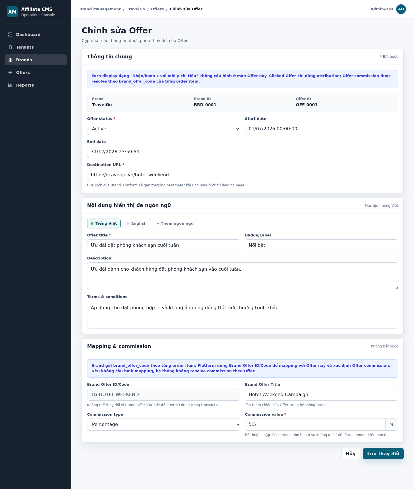

HTML mockup: [cms-offer-edit.html](../mockups/cms-offer-edit.html)

### g. Screen Description

Screen 1: Edit Offer

| # | Items | R/O | Control type | Data type | Description / Validation / Error handling |
|---:|---|---|---|---|---|
| 1 | Page title | R | Heading | Text | Hiển thị `Chỉnh sửa Offer`. |
| 2 | Page description | R | Label | Text | Thông báo user chỉ được cập nhật các thông tin cho phép của Offer. |
| 3 | Required note | R | Label | Text | Ký hiệu `* Bắt buộc` áp dụng cho dữ liệu bắt buộc theo status hiện tại. |
| 4 | Earn display/attribution notice | R | Information box | Text | Earn display không cấu hình tại màn Offer; clicked Offer chỉ dùng attribution; Offer commission được resolve theo `brand_offer_code` của từng order item. |
| 5 | Brand | R | Label | ReadOnly | Prefill Brand Display Name và không cho sửa. |
| 6 | Brand ID | R | Label | String/ReadOnly | Prefill Brand ID và không cho sửa/chuyển Brand. |
| 7 | Offer ID | R | Label | String/ReadOnly | Hiển thị Offer ID do Platform sinh, ví dụ `OFF-0001`; không cho sửa. |
| 8 | Offer status | W | Dropdown | Enum | Cho phép chọn `Draft`, `Active`, `Inactive`. Khi lưu `Draft`, cho phép thiếu field bắt buộc để Active nhưng field đã nhập vẫn phải hợp lệ. Khi lưu `Active`, hệ thống kiểm tra Brand, Destination URL và Offer Title default locale. Draft không hiển thị/click trên Landing Page. |
| 9 | Start date | W | Datetime textbox/picker | Datetime | Prefill và cho sửa theo `dd/mm/yyyy hh:mm:ss`. Trống nghĩa là có hiệu lực ngay khi Active theo policy. Sai định dạng hiển thị `Start date is invalid.` |
| 10 | End date | W | Datetime textbox/picker | Datetime | Prefill và cho sửa theo `dd/mm/yyyy hh:mm:ss`; phải lớn hơn hoặc bằng Start date. Sai hiển thị `End date must be greater than or equal to Start date.` |
| 11 | Destination URL | W | Textbox | URL | Prefill và cho sửa. Bắt buộc khi Active; phải có `http://` hoặc `https://`. Trống/sai định dạng hiển thị lỗi tại field. |
| 12 | Locale tabs | W | Tab | Locale | Chuyển giữa các locale hiện có; dữ liệu từng locale được prefill và lưu độc lập. |
| 13 | Thêm ngôn ngữ | W | Button | Action | Bổ sung locale chưa có; không tạo trùng locale. |
| 14 | Offer Title | W/Conditional | Textbox | Localized text | Cho sửa theo locale; default locale bắt buộc khi Active; trim và kiểm tra tối đa 160 ký tự. |
| 15 | Badge/Label | W | Textbox | Localized text | Cho sửa nhãn Offer theo locale, tối đa 60 ký tự. |
| 16 | Description | W | Textarea | Localized text | Cho sửa mô tả theo locale, tối đa 1.000 ký tự và phải sanitize. |
| 17 | Terms & conditions | W | Textarea | Localized text | Cho sửa điều kiện áp dụng theo locale; hỗ trợ xuống dòng và phải sanitize. |
| 18 | Mapping & Commission note | R | Information box | Text | Section để cấu hình mapping giữa Offer của Platform và Offer code bên Brand để xác định rule tính commission.|
| 19 | Brand Offer ID/Code | Conditional | Textbox | String | Prefill dữ liệu hiện tại, nếu nhập bất kỳ dữ liệu commission nào thì trường này bắt buộc.. Nếu mapping chưa được transaction/order item nào sử dụng, cho phép sửa và kiểm tra không trùng trong cùng Brand. Nếu đã được sử dụng, field read-only và hiển thị `Brand Offer ID/Code cannot be changed because it has been used in a transaction.` Server trả lỗi `brand_offer_code_in_use` nếu có yêu cầu thay đổi qua API. |
| 20 | Brand Offer Title | W | Textbox | Text | Prefill và cho sửa; chỉ là thông tin tham chiếu, không dùng làm khóa mapping. |
| 21 | Commission type | W | Dropdown | Enum | Cho chọn `Không cấu hình`, `Percentage`, `Fixed amount`. Nếu nhập Brand Offer ID/Code thì trường này bắt buộc nhập Fixed hoặc Percentage, nhập Không cấu hình hiển thị Commission type is invalid. |
| 22 | Commission value | W/Conditional | Number input + affix | Decimal | Disabled và không bắt buộc khi type là `Không cấu hình`. Khi type là Percentage/Fixed amount, field được enable, hiển thị dấu `*` và bắt buộc nhập. Percentage nhận `> 0`, `<= 100`; Fixed amount nhận `> 0`. Bỏ trống hiển thị `Commission value is required.`; sai phạm vi hiển thị `Commission value is invalid.` Nếu cấu hình commission thì Brand Offer ID/Code cũng bắt buộc. |
| 23 | Hủy | W | Button | Action | Nhấn để quay lại Offer List. Nếu form có thay đổi chưa lưu, hiển thị popup xác nhận `Bạn có muốn lưu dữ liệu trước khi thoát khỏi màn hình?`; xác nhận rời màn hình thì bỏ dữ liệu, chọn ở lại thì giữ nguyên form. |
| 24 | Lưu thay đổi | W | Primary button | Action | Validate và lưu atomically; chống double-click. Thành công hiển thị `Offer updated successfully.`; lỗi giữ form và highlight field. Conflict hiển thị `Offer has been updated by another user. Please reload and try again.` |

### h. Logic Description

| # | Step | Actor/Object | Logic |
|---:|---|---|---|
| 1 | Open form | CMS Interface | Nhận `brand_id`, `offer_id` và tải màn Edit. |
| 2 | Validate access/context | Brand/Offer Service | Kiểm tra quyền `offer.update`, Brand/Offer tồn tại và Offer thuộc đúng Brand. |
| 3 | Load aggregate and mapping usage | Offer/Mapping/Commission/Transaction Service | Tải Offer, localized content, mapping, Commission type/value và version/updated_at hiện tại. Đồng thời kiểm tra Mapping ID hoặc tổ hợp `brand_id + brand_offer_code` đã được transaction/order item nào tham chiếu hay chưa và trả về cờ `mapping_in_use`. |
| 4 | Initialize UI | CMS Interface | Prefill form; khóa Brand, Brand ID và Offer ID. Nếu `mapping_in_use = true`, đặt Brand Offer ID/Code ở trạng thái read-only và hiển thị `Brand Offer ID/Code cannot be changed because it has been used in a transaction.` Nếu `mapping_in_use = false`, cho phép sửa Brand Offer ID/Code. Với commission: type `Không cấu hình` thì disable Commission value; type Percentage/Fixed amount thì enable Commission value, hiển thị dấu `*` và đơn vị `%`/`VND`. |
| 5 | Normalize input | CMS Interface | Trim text/URL/code, chuẩn hóa locale và parse datetime. |
| 6 | Validate Offer | Offer Service | Validate status, Start/End date, URL và required content theo rule Create. |
| 7 | Recheck mapping usage and validate code | Offer Mapping/Transaction Service | Khi user nhấn `Lưu thay đổi`, server bắt buộc kiểm tra lại trạng thái sử dụng của mapping, không chỉ tin cờ từ UI. Nếu mapping đã được bất kỳ transaction/order item nào tham chiếu và Brand Offer ID/Code trong request khác giá trị hiện tại, dừng xử lý, không cập nhật dữ liệu và trả lỗi `brand_offer_code_in_use` với message `Brand Offer ID/Code cannot be changed because it has been used in a transaction.` Nếu mapping chưa được sử dụng, tiếp tục kiểm tra định dạng và uniqueness của code mới trong cùng Brand. |
| 8 | Validate commission | Commission Service | Nếu Commission type là `Không cấu hình`, Commission value không bắt buộc và không được dùng để tạo/cập nhật rule. Nếu type là `Percentage` hoặc `Fixed amount`, bắt buộc Brand Offer ID/Code và Commission value. Thiếu value trả lỗi `Commission value is required.`; Percentage không thuộc `(0, 100]` hoặc Fixed amount `<= 0` trả lỗi `Commission value is invalid.` |
| 9 | Check conflict | Offer Service | So sánh version/updated_at client gửi với bản ghi hiện tại; conflict thì dừng lưu. |
| 10 | Begin transaction | Offer Service | Bắt đầu transaction cập nhật Offer, mapping và commission. |
| 11 | Update Offer | Offer Service | Lưu status, thời gian, URL và localized content. |
| 12 | Update mapping | Offer Mapping Service | Chỉ cập nhật Brand Offer ID/Code khi `mapping_in_use = false` và code mới đã hợp lệ. Khi `mapping_in_use = true`, giữ nguyên Brand Offer ID/Code; các transaction/order item lịch sử tiếp tục tham chiếu mapping và commission snapshot cũ. Brand Offer Title vẫn được cập nhật nếu các validation khác hợp lệ. |
| 13 | Update commission | Commission Service | Với Percentage/Fixed amount, lưu Commission type/value hợp lệ. Nếu chuyển từ type đang cấu hình sang `Không cấu hình`, yêu cầu xác nhận rồi ngừng rule hiện tại; giá trị cũ không còn được dùng để resolve commission nhưng vẫn được giữ trong audit/history. |
| 14 | Commit/Audit | Offer/Audit Service | Commit và ghi old/new value, user, timestamp, Offer ID và Mapping ID. |
| 15 | Return result | CMS Interface | Thành công thông báo và về list; lỗi rollback toàn bộ, giữ form và hiển thị lỗi. |

### i. Business Rules

| BR ID | Rule |
|---|---|
| BR-OFFER-003-01 | Brand, Brand ID và Offer ID là read-only; không cho chuyển Offer sang Brand khác. |
| BR-OFFER-003-02 | Offer Active không được thiếu Destination URL và Offer Title default locale. Toàn bộ Mapping & Commission có thể để trống; nhưng khi chọn cấu hình commission, các field điều kiện phải đầy đủ và hợp lệ. |
| BR-OFFER-003-03 | Offer Status chỉ gồm `Draft`, `Active`, `Inactive`; hiệu lực runtime được suy ra từ status và Start/End date, không tự đổi status thành Draft/Expired. |
| BR-OFFER-003-04 | Brand Offer ID/Code chỉ được sửa khi chưa có transaction/order item tham chiếu mapping và code mới không trùng trong cùng Brand. |
| BR-OFFER-003-05 | Khi đã có transaction/order item tham chiếu, Brand Offer ID/Code phải read-only trên UI và API phải từ chối thay đổi với mã lỗi `brand_offer_code_in_use`. Transaction lịch sử giữ nguyên mapping/commission snapshot. |
| BR-OFFER-003-06 | Nếu Commission type là `Percentage` hoặc `Fixed amount`, Brand Offer ID/Code và Commission value đều bắt buộc; không cho lưu nếu thiếu một trong hai trường. |
| BR-OFFER-003-07 | Chuyển Commission type từ Percentage/Fixed amount về `Không cấu hình` phải yêu cầu xác nhận trước khi ngừng rule hiện tại. Sau khi xác nhận, Commission value bị disable, không bắt buộc và không được sử dụng để resolve commission. |
| BR-OFFER-003-08 | Clicked Offer chỉ dùng attribution; commission được resolve theo `brand_offer_code` thực tế của từng order item. |
| BR-OFFER-003-09 | Cập nhật Offer, mapping và commission phải atomic; lỗi một phần rollback toàn bộ. |
| BR-OFFER-003-10 | Mọi thay đổi phải ghi audit log với old/new value. |
| BR-OFFER-003-11 | Hệ thống dùng optimistic locking; không ghi đè im lặng khi version/updated_at đã thay đổi. |
| BR-OFFER-003-12 | Màn Edit chỉ có một cụm Hủy/Lưu thay đổi ở cuối form. |
| BR-OFFER-003-13 | Khi chuyển hoặc lưu Offer ở status `Draft`, cho phép thiếu field bắt buộc để Active; mọi field đã nhập vẫn phải qua validation định dạng, quan hệ và uniqueness. |
| BR-OFFER-003-14 | Offer Draft không được hiển thị hoặc cho End user click trên Landing Page. |
| BR-OFFER-003-15 | Khi Brand thay đổi mã Offer sau khi mapping cũ đã được sử dụng, Admin/Ops phải tạo mapping/Offer mới; mapping cũ được giữ để tra cứu lịch sử và xử lý order Pending sử dụng code cũ. |
| BR-OFFER-003-16 | Không được hard delete mapping cũ khi còn transaction lịch sử hoặc order Pending tham chiếu; chỉ được Inactive theo policy sau attribution/order-confirmation window. |
| BR-OFFER-003-17 | Commission value chỉ được enable và hiển thị dấu `*` khi Commission type là `Percentage` hoặc `Fixed amount`; type `Không cấu hình` phải disable field này. |
| BR-OFFER-003-18 | Percentage chỉ nhận Commission value `> 0` và `<= 100`; Fixed amount chỉ nhận value `> 0`. Quy tắc type/value áp dụng cả khi lưu Offer ở trạng thái `Draft`. |
| BR-OFFER-003-19 | Khi Commission type là `Không cấu hình`, giá trị Commission value còn sót trong request phải bị bỏ qua hoặc chuẩn hóa về `null`; không được tạo commission rule từ giá trị này. |

### j. Acceptance Criteria

| AC ID | Criteria |
|---|---|
| AC-OFFER-003-01 | Admin/Ops có quyền `offer.update` mở được đúng Offer với toàn bộ dữ liệu hiện tại được prefill. |
| AC-OFFER-003-02 | Brand, Brand ID và Offer ID hiển thị read-only; không thể thay đổi bằng UI. |
| AC-OFFER-003-03 | Admin/Ops sửa được Offer status, Start/End date, Destination URL, localized content, Brand Offer Title và commission; Brand Offer ID/Code chỉ sửa được khi chưa được transaction tham chiếu. |
| AC-OFFER-003-04 | Brand Offer ID/Code trùng trong cùng Brand hoặc đã được sử dụng trong transaction bị chặn và hiển thị đúng lỗi tại field. |
| AC-OFFER-003-05 | Offer Active thiếu URL hoặc Offer Title default locale bị chặn; thiếu toàn bộ Mapping & Commission không tự chặn Active. |
| AC-OFFER-003-06 | Chọn Percentage sẽ enable Commission value, hiển thị dấu `*` và đơn vị `%`; bỏ trống hiển thị `Commission value is required.`; value `<= 0` hoặc `> 100` hiển thị `Commission value is invalid.` |
| AC-OFFER-003-07 | Thay đổi mapping/commission không làm cập nhật hoặc tính lại transaction lịch sử. |
| AC-OFFER-003-08 | Chọn Fixed amount sẽ enable Commission value, hiển thị dấu `*` và đơn vị `VND`; bỏ trống hiển thị `Commission value is required.`; value `<= 0` hiển thị `Commission value is invalid.` |
| AC-OFFER-003-09 | Chỉ một cụm `Hủy`/`Lưu thay đổi` hiển thị ở cuối form; Hủy quay lại list sau confirmation nếu form dirty. |
| AC-OFFER-003-10 | Lưu thành công hiển thị thông báo, cập nhật list và ghi audit old/new value. |
| AC-OFFER-003-11 | Conflict version hiển thị yêu cầu reload và không ghi đè dữ liệu mới hơn. |
| AC-OFFER-003-12 | Lỗi bất kỳ trong Offer/mapping/commission rollback toàn bộ và giữ dữ liệu form để sửa. |
| AC-OFFER-003-13 | Offer lưu được ở Draft khi chưa đủ dữ liệu Active; field đã nhập sai định dạng/ràng buộc vẫn bị chặn. |
| AC-OFFER-003-14 | Offer Draft không xuất hiện và không click được trên Landing Page. |
| AC-OFFER-003-15 | API từ chối thay đổi code đã được sử dụng với lỗi `brand_offer_code_in_use`, kể cả khi client bỏ qua trạng thái read-only của UI. |
| AC-OFFER-003-16 | Mapping cũ vẫn tra cứu được cho transaction lịch sử/order Pending sau khi mapping mới được tạo. |
| AC-OFFER-003-17 | Chuyển từ Percentage/Fixed amount về `Không cấu hình` hiển thị xác nhận. Sau khi xác nhận, Commission value bị disable, không bắt buộc và commission rule hiện tại ngừng được sử dụng. |
| AC-OFFER-003-18 | Khi lưu với Commission type `Không cấu hình`, backend không tạo/cập nhật commission rule dù request có gửi Commission value cũ. |
| AC-OFFER-003-19 | Các validation Commission type/value vẫn được áp dụng khi Offer được lưu ở trạng thái `Draft`. |

## 9. CMS-OFFER-004 - Activate/Deactivate Offer

### a. Introduction

Chức năng cho phép Admin/Ops chuyển trạng thái Offer để quyết định Offer có được hiển thị/click trên marketplace hay không.

### b. Actors/Objects

| Actor/Object | Role |
|---|---|
| Admin/Ops | Đổi trạng thái Offer. |
| CMS Interface | Hiển thị status và lỗi validate. |
| Offer Service | Kiểm tra điều kiện activate/deactivate. |
| Marketplace Runtime | Chỉ hiển thị/click Offer hợp lệ. |
| Audit Service | Ghi log. |

### c. Pre-conditions

- Offer tồn tại.
- Brand đang active nếu muốn active Offer.
- Admin/Ops có quyền `offer.update_status`.

### d. Expected Result

- Offer status được cập nhật.
- Offer Active chỉ được hiển thị/click nếu đang trong thời gian hiệu lực và Tenant visibility cho phép.
- Offer Draft, Inactive hoặc Active nhưng nằm ngoài thời gian hiệu lực không hiển thị/click.

### e. Logic Diagram

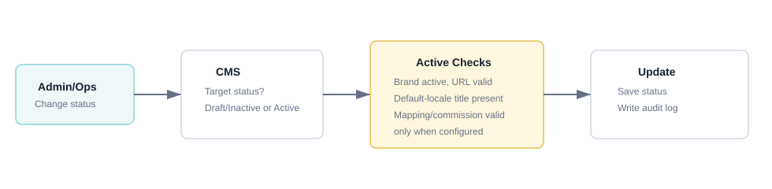

### f. Screen Flow

1. Offer List hoặc Edit Offer.
2. Change status.
3. Save.

### g. Screen Description

Screen 1: Offer Status Update

| # | Items | Control type | Data type | Description / Validation / Error handling |
|---:|---|---|---|---|
| 1 | Status | Dropdown | Enum | `Draft`, `Active`, `Inactive`. Draft cho phép lưu thiếu field bắt buộc để Active nhưng field đã nhập phải hợp lệ. Khi đổi sang Active, hệ thống kiểm tra Brand Active, Destination URL hợp lệ và Offer Title default locale. Mapping & Commission không bắt buộc. |
| 2 | Validation message | Message | Text | Hiển thị field còn thiếu khi active không hợp lệ. Ví dụ `Brand đang inactive`, `Destination URL không hợp lệ`, `Thiếu Offer title cho ngôn ngữ mặc định`. Nếu có nhập commission sai thì hiển thị `Commission value không hợp lệ`. |
| 3 | Save | Button | Click | Lưu trạng thái mới. Nếu validation fail thì không cập nhật status; nếu pass thì cập nhật status và ghi audit log. |

### h. Logic Description

| # | Step | Actor/Object | Logic |
|---:|---|---|---|
| 1 | Change status | Admin/Ops | Chọn status mới. |
| 2 | Status validation | Offer Service | Draft: cho phép thiếu field Active nhưng validate field đã nhập. Active: Brand Active, URL hợp lệ và Offer Title default locale có; nếu có Mapping & Commission thì dữ liệu phải hợp lệ. |
| 3 | Save | Offer Service | Cập nhật status nếu pass. |
| 4 | Runtime effect | Marketplace Runtime | Chỉ Offer Active và đang trong thời gian hiệu lực mới có thể hiển thị/click; Draft, Inactive hoặc Active ngoài thời gian hiệu lực đều không hiển thị/click. |

### i. Business Rules

| BR ID | Rule |
|---|---|
| BR-OFFER-004-01 | Active yêu cầu Brand active. |
| BR-OFFER-004-02 | Active yêu cầu Destination URL hợp lệ và title default locale. Offer commission là tùy chọn; nếu có nhập thì phải hợp lệ. |
| BR-OFFER-004-03 | Draft cho phép lưu thiếu dữ liệu bắt buộc để Active nhưng không bỏ qua validation đối với field đã nhập. |
| BR-OFFER-004-04 | Offer inactive không click được; direct link phải bị chặn hoặc trả trạng thái không hợp lệ theo policy. |
| BR-OFFER-004-05 | Mọi thay đổi status Offer phải ghi audit log. |
| BR-OFFER-004-06 | Offer Draft không hiển thị/click trên Landing Page. |
| BR-OFFER-004-07 | Offer Active nhưng chưa đến Start date hoặc đã qua End date không hiển thị/click; hệ thống không tự đổi Offer Status thành Draft hoặc Expired. |

### j. Acceptance Criteria

| AC ID | Criteria |
|---|---|
| AC-OFFER-004-01 | Admin/Ops có quyền `offer.update_status` có thể đổi status Offer khi dữ liệu hợp lệ. |
| AC-OFFER-004-02 | Hệ thống chặn Active nếu Brand inactive. |
| AC-OFFER-004-03 | Hệ thống chặn Active nếu thiếu Destination URL hoặc title default locale; không chặn Active chỉ vì thiếu Offer commission. |
| AC-OFFER-004-04 | Offer Draft và Inactive không hiển thị/click trên Landing Page. |
| AC-OFFER-004-05 | Hệ thống ghi audit log khi đổi status Offer. |
| AC-OFFER-004-06 | Draft lưu được khi thiếu dữ liệu Active nhưng bị chặn nếu field đã nhập sai định dạng/ràng buộc. |
| AC-OFFER-004-07 | Active nằm ngoài Start/End date không hiển thị/click và status vẫn giữ Active. |

# V. Data Requirements

## 1. Data conventions

| Convention | Requirement |
|---|---|
| Internal ID | `brand_id`, `offer_id`, `mapping_id` do Platform sinh, immutable và không tái sử dụng. |
| External code | Code do Brand cung cấp phải trim đầu/cuối, so sánh theo rule case-sensitivity thống nhất và unique trong scope quy định. |
| Datetime | Start/End date trên màn Offer nhập và hiển thị theo `dd/mm/yyyy hh:mm:ss`; backend lưu timezone-aware datetime theo chuẩn hệ thống. |
| Monetary value | Fixed amount lưu dưới dạng decimal theo currency của rule, không dùng floating point; UI màn hiện tại hiển thị `VND`. |
| Percentage | Lưu decimal, giá trị `> 0` và `<= 100`; UI hiển thị `%`. |
| Localized content | Lưu theo `locale`; `vi-VN` là default locale nếu không có cấu hình khác. Nội dung phải được trim và sanitize. |
| Soft delete/history | Dữ liệu đã được Offer, transaction, assignment hoặc settlement tham chiếu không được hard delete; dùng status và audit history. |
| Audit/concurrency | Bản ghi cấu hình có `created_at`, `created_by`, `updated_at`, `updated_by`, `version`; update dùng optimistic locking. |

## 2. Brand master data

| Field | Required | Data type | Source/Screen | Description | Validation/Rule |
|---|---:|---|---|---|---|
| brand_id | System | ID | Create/View/Edit/List | ID nội bộ của Brand. | Platform sinh sau khi tạo; read-only. |
| brand_code | Yes | String | Create/View/Edit/List | Mã Brand dùng trong CMS và tích hợp. | Unique toàn Platform; đúng code format; không cho sửa theo policy sau khi có dữ liệu liên kết. |
| legal_name | No | String | Create/View/Edit | Tên pháp lý của Brand. | Trim; giới hạn độ dài theo cấu hình. |
| website_url | Yes | URL | Create/View/Edit | Website chính thức của Brand. | Bắt buộc; phải bắt đầu bằng `http://` hoặc `https://`. |
| logo_asset_id | No | Ref/File | Create/View/Edit/List | Logo hiển thị trên CMS/Landing Page. | Chỉ nhận định dạng và dung lượng được phép; scan file upload. |
| status | Yes | Enum | Create/View/Edit/List | Trạng thái quản trị Brand. | Chỉ gồm `Draft`, `Active`, `Inactive`. |
| default_locale | Yes | Locale | Create/View/Edit | Ngôn ngữ mặc định. | Mặc định `vi-VN`; phải thuộc locale hệ thống hỗ trợ. |
| pending_days | Yes | Integer | Create/View/Edit | Số ngày chờ Brand xác nhận order. | Số nguyên `>= 0`. |
| contact_name | No | String | Create/View/Edit | Người liên hệ phía Brand. | Trim; giới hạn độ dài. |
| contact_email | No | Email | Create/View/Edit | Email liên hệ. | Đúng định dạng email. |
| contact_phone | No | String | Create/View/Edit | Số điện thoại liên hệ. | Đúng format/độ dài theo policy. |
| notes | No | Text | Create/View/Edit | Ghi chú nội bộ. | Không hiển thị cho End user; sanitize. |
| created_at/created_by | System | Datetime/UserRef | View/Audit | Thông tin tạo bản ghi. | Immutable. |
| updated_at/updated_by | System | Datetime/UserRef | View/Audit | Lần cập nhật gần nhất. | Cập nhật sau mỗi lần lưu thành công. |
| version | System | Integer | Edit API | Phiên bản phục vụ optimistic locking. | Tăng sau mỗi lần update. |

## 3. Brand localized content

| Field | Required | Data type | Description | Validation/Rule |
|---|---:|---|---|---|
| brand_id | Yes | Ref | Brand sở hữu bộ content. | Brand phải tồn tại. |
| locale | Yes | Locale | Locale của content. | Unique theo `brand_id + locale`. |
| display_name | Conditional | String | Tên Brand hiển thị. | Bắt buộc tại default locale khi Brand Active. |
| tagline | No | String | Tagline của Brand. | Trim; giới hạn độ dài. |
| short_description | No | Text | Mô tả ngắn. | Sanitize; giới hạn độ dài. |
| terms | No | Text | Điều khoản/quy định hiển thị. | Sanitize; hỗ trợ xuống dòng. |

## 4. Category Mapping & Commission

| Field | Required | Data type | Source/Screen | Description | Validation/Rule |
|---|---:|---|---|---|---|
| mapping_id | System | ID | Category Mapping list | ID mapping category. | Platform sinh; immutable. |
| brand_id | Yes | Ref | Brand Detail | Brand áp dụng mapping. | Brand phải tồn tại; lấy từ Brand context. |
| affiliate_category_id | Yes | Ref | Create/Edit mapping | Affiliate Category chuẩn của Platform. | Category phải tồn tại và Active tại thời điểm kích hoạt mapping. |
| brand_category_code | Yes | String | Create/Edit Category Mapping | Category ID/Code trong hệ thống Brand được cấu hình làm khóa mapping. | Bắt buộc trên bản ghi Category Mapping; trim; unique trong cùng Brand đối với khoảng hiệu lực chồng lấn. Trên payload order item, field này là conditional và được mô tả tại `brand_category_code_received`. |
| brand_category_name | No | String | Create/Edit mapping | Tên category tham chiếu phía Brand. | Không dùng làm khóa resolve. |
| is_default | Yes | Boolean | Create/Edit mapping | Category fallback mặc định của Brand. | Tối đa/đúng một mapping Active mặc định theo policy của Brand. |
| commission_type | Yes | Enum | Create/Edit mapping | Loại commission Brand trả Platform. | `Percentage` hoặc `Fixed amount`. |
| commission_value | Yes | Decimal | Create/Edit mapping | Giá trị commission của category. | Percentage `(0,100]`; Fixed amount `> 0`. |
| effective_from | Yes | Datetime | Create/Edit mapping | Thời điểm rule bắt đầu hiệu lực. | Giá trị datetime hợp lệ. |
| effective_to | No | Datetime | Create/Edit mapping | Thời điểm rule kết thúc hiệu lực. | Trống hoặc `>= effective_from`. |
| status | Yes | Enum | Create/Edit/List | Trạng thái mapping/rule. | `Draft`, `Active`, `Inactive`; không tự sinh `Expired`. |
| created/updated metadata | System | Audit fields | Audit | Người và thời điểm tạo/cập nhật. | Tự động ghi nhận. |

## 5. Offer master data

| Field | Required | Data type | Source/Screen | Description | Validation/Rule |
|---|---:|---|---|---|---|
| offer_id | System | ID | View/Edit/List | ID nội bộ của Offer. | Sinh sau khi Create thành công; không hiển thị trên Create; read-only trên View/Edit. |
| brand_id | Yes | Ref | Brand context | Brand sở hữu Offer. | Lấy từ Brand context; không cho chuyển Brand khi Edit. |
| status | Yes | Enum | Create/View/Edit/List | Trạng thái quản trị Offer. | `Draft`, `Active`, `Inactive`; mặc định `Draft`; không tự đổi thành `Expired`. |
| start_date | No | Datetime | Create/View/Edit | Thời điểm bắt đầu hiệu lực runtime. | Format UI `dd/mm/yyyy hh:mm:ss`; trống nghĩa là hiệu lực ngay khi đủ điều kiện Active. |
| end_date | No | Datetime | Create/View/Edit | Thời điểm kết thúc hiệu lực runtime. | Trống hoặc `>= start_date`. |
| destination_url | Conditional | URL | Create/View/Edit | URL đích khi End user click Offer. | Bắt buộc khi Active; phải dùng `http://` hoặc `https://`. |
| created_at/created_by | System | Datetime/UserRef | View/Audit | Thông tin tạo Offer. | Immutable. |
| updated_at/updated_by | System | Datetime/UserRef | View/Audit | Lần cập nhật gần nhất. | Tự động cập nhật. |
| version | System | Integer | Edit API | Phiên bản chống ghi đè đồng thời. | Request update phải gửi đúng version hiện tại. |

## 6. Offer localized content

| Field | Required | Data type | Description | Validation/Rule |
|---|---:|---|---|---|
| offer_id | Yes | Ref | Offer sở hữu content. | Offer phải tồn tại. |
| locale | Yes | Locale | Locale nội dung. | Unique theo `offer_id + locale`. |
| offer_title | Conditional | String | Tiêu đề Offer. | Bắt buộc tại default locale khi Offer Active; trim; tối đa 160 ký tự. |
| badge_label | No | String | Badge/label ngắn. | Tối đa 60 ký tự. |
| description | No | Text | Mô tả Offer. | Tối đa 1.000 ký tự; sanitize. |
| terms_conditions | No | Text | Điều kiện áp dụng. | Sanitize; hỗ trợ xuống dòng. |

## 7. Offer Mapping & Commission

| Field | Required | Data type | Source/Screen | Description | Validation/Rule |
|---|---:|---|---|---|---|
| mapping_id | System | ID | Offer List/View/Edit | ID mapping Offer. | Sinh khi lưu Brand Offer ID/Code; immutable. |
| offer_id | Yes | Ref | Offer context | Offer nội bộ được mapping. | Offer phải tồn tại. |
| brand_id | Yes | Ref | Offer context | Brand sở hữu code ngoài. | Phải trùng Brand của Offer. |
| brand_offer_code | Conditional | String | Create/View/Edit/List/API order item | Brand Offer ID/Code do Brand gửi trên từng order item. | Trim; unique theo `brand_id + brand_offer_code`; bắt buộc khi Commission type được cấu hình. |
| brand_offer_title | No | String | Create/View/Edit/List | Tên Offer tham chiếu trong hệ thống Brand. | Tối đa 350 ký tự; không dùng làm khóa mapping. |
| commission_type | Yes | Enum | Create/View/Edit/List | Trạng thái/loại cấu hình commission. | `Không cấu hình`, `Percentage`, `Fixed amount`; mặc định `Không cấu hình`. |
| commission_value | Conditional | Decimal | Create/View/Edit/List | Giá trị Offer commission Brand trả Platform. | Disabled/null khi `Không cấu hình`; bắt buộc khi Percentage/Fixed amount. Percentage `(0,100]`; Fixed amount `> 0`. |
| mapping_in_use | System | Boolean | Edit/API | Cho biết mapping đã được transaction/order item tham chiếu. | Tính từ dữ liệu transaction; không cho client tự cập nhật. |
| first_used_at | System/No | Datetime | Audit/Operation | Thời điểm mapping được transaction tham chiếu lần đầu. | Dùng hỗ trợ kiểm soát chỉnh sửa/xóa mapping. |
| status/history | System | State/Audit | Runtime/Audit | Trạng thái và lịch sử rule/mapping. | Mapping đã được tham chiếu không được hard delete. |

## 8. Mapping usage and transaction snapshot

| Field | Required | Data type | Description | Validation/Rule |
|---|---:|---|---|---|
| transaction_id | Yes | Ref | Transaction chứa order item sử dụng mapping. | Transaction phải tồn tại. |
| order_item_id | Yes | Ref/String | Item cụ thể trong order. | Unique trong transaction/order theo integration contract. |
| mapping_id | Conditional | Ref | Mapping Offer hoặc Category đã resolve. | Lưu mapping thực tế dùng khi tính commission. |
| brand_offer_code_received | No | String | Code Brand gửi tại thời điểm nhận item. | Giữ nguyên để audit/exception. |
| brand_category_code_received | Conditional | String | Category code Brand ưu tiên gửi khi item không có Offer code. | Không bắt buộc ở mức schema để hỗ trợ fallback. Nếu có thì giữ nguyên để audit/resolve Category; nếu không có thì thử default Category Active. |
| commission_type_snapshot | Conditional | Enum | Type được dùng tại thời điểm tính. | Không tự thay đổi khi cấu hình bị sửa sau đó. |
| commission_value_snapshot | Conditional | Decimal | Value được dùng tại thời điểm tính. | Không tính lại chỉ vì Admin sửa mapping/rule. |
| mapping_result | Yes | Enum | Kết quả resolve mapping. | Ví dụ `Matched`, `Unmapped`, `Invalid`, `Exception`. |

## 9. Search, pagination and response data

| Data | Requirement |
|---|---|
| Brand List filters | Search text/code, status và các điều kiện đã mô tả tại màn Brand List. |
| Offer List filters | Keyword tìm theo Mapping ID, Offer Title, Brand Offer ID/Code hoặc Brand Offer Title; Offer Status; Commission rule status (`Đã cấu hình`/`Chưa cấu hình`). Các điều kiện được kết hợp bằng AND; điều kiện trống/`Tất cả` không tham gia lọc. |
| Offer List row | Mapping ID, Offer Title, Brand Offer ID/Code, Brand Offer Title, Commission Type, Commission Value, Offer Status và Actions. |
| Sorting | Server-side sorting chỉ nhận whitelist field; mặc định theo dữ liệu cập nhật mới nhất hoặc rule màn hình. |
| Pagination | Request gồm page/page_size; response gồm total_items, total_pages và danh sách bản ghi. |
| Empty value | Field chưa cấu hình hiển thị `-` hoặc `Chưa cấu hình` nhất quán, không hiển thị giá trị giả. |

# VI. Consolidated Business Rules Summary

| BR ID | Rule |
|---|---|
| BR-001 | Brand code unique trên toàn Platform. |
| BR-002 | Brand, Offer và Mapping ID do Platform sinh; không cho user sửa hoặc tái sử dụng. |
| BR-003 | Không chọn Category tại màn Create Brand; Category mapping và category commission được cấu hình tại Brand Detail/Category & Commission. |
| BR-004 | Không cấu hình Brand-level commission trong MVP1; commission Brand trả Platform được resolve theo Offer hoặc Category của từng order item. |
| BR-005 | Brand Active phải có dữ liệu bắt buộc theo default locale và đáp ứng điều kiện cấu hình được quy định tại UC Brand. |
| BR-006 | Brand Inactive làm toàn bộ Offer thuộc Brand không hiển thị/click, dù Offer đang Active và còn thời gian hiệu lực. |
| BR-007 | Không hard delete Brand đã có Offer, Click, Order, Commission Rule, Assignment hoặc Settlement; chỉ chuyển Inactive. |
| BR-008 | `brand_category_code` phải mapping duy nhất trong cùng Brand đối với khoảng thời gian hiệu lực chồng lấn. |
| BR-009 | Brand Draft có thể chưa có default Category nhưng không được có nhiều hơn 1 default Active; Brand Active/ready for commission phải có đúng 1 Category Mapping Active mặc định. Default chỉ dùng khi order item không có cả `brand_offer_code` và `brand_category_code` hoặc không có `brand_offer_code` và có `Brand category ID/code` nhưng mapping với rule chưa hợp lệ. |
| BR-010 | Category commission Percentage nhận `(0,100]`; Fixed amount nhận `> 0`; effective_to không nhỏ hơn effective_from. |
| BR-011 | Offer được tạo từ Brand context, không chọn lại Brand và không chọn Category tại form Offer. |
| BR-012 | Offer status chỉ gồm `Draft`, `Active`, `Inactive`; runtime visibility dựa trên Brand status, Offer status và Start/End date, không tự đổi thành `Expired`. |
| BR-013 | Offer Draft được lưu thiếu dữ liệu bắt buộc để Active, nhưng mọi field đã nhập vẫn phải đúng format, quan hệ và uniqueness; Draft không hiển thị/click trên Landing Page. |
| BR-014 | Offer Active bắt buộc có Destination URL hợp lệ và Offer Title của default locale. |
| BR-015 | Offer Active chỉ hiển thị/click khi Brand Active và thời điểm hiện tại nằm trong Start/End date; ngoài thời gian hiệu lực status vẫn giữ Active. |
| BR-016 | `brand_offer_code` là khóa ngoài do Brand gửi theo từng order item và phải unique theo `brand_id + brand_offer_code`; Brand Offer Title chỉ dùng tham chiếu. |
| BR-017 | Clicked Offer chỉ dùng attribution; commission không được quyết định chỉ từ Offer user đã click. |
| BR-018 | Nếu order item có `brand_offer_code`, Platform resolve theo `brand_id + brand_offer_code`; không mapping được hoặc mapping/rule không hợp lệ thì tự fallback Category mà Brand gửi sang cùng Item. |
| BR-019 | Nếu order item không có `brand_offer_code`, Brand phải ưu tiên gửi `brand_category_code`. Có code thì resolve đúng code đó; không có code/code không mapping được thì Platform fallback default Category Active, thiếu default hợp lệ thì vào exception `default_category_missing`. |
| BR-020 | Mapping & Commission có thể bỏ trống toàn bộ. Khi Commission type là `Không cấu hình`, Commission value phải disabled/null và không tạo commission rule. |
| BR-021 | Khi Commission type là `Percentage` hoặc `Fixed amount`, Brand Offer ID/Code và Commission value đều bắt buộc. Percentage nhận `(0,100]`; Fixed amount nhận `> 0`; áp dụng cả khi Offer Draft. |
| BR-022 | Khi đổi từ Percentage/Fixed amount về `Không cấu hình`, phải xác nhận trước khi ngừng rule; value cũ chỉ giữ trong audit/history. |
| BR-023 | Nếu Offer mapping chưa được transaction/order item tham chiếu, Admin/Ops được sửa Brand Offer ID/Code với điều kiện code mới unique trong Brand. |
| BR-024 | Nếu Offer mapping đã được transaction/order item tham chiếu, Brand Offer ID/Code phải read-only và API phải chặn thay đổi bằng `brand_offer_code_in_use`. |
| BR-025 | Khi Brand đổi code ngoài sau khi mapping cũ đã được sử dụng, phải tạo mapping/Offer mới; mapping cũ được giữ cho transaction lịch sử và order Pending. |
| BR-026 | Không hard delete mapping đã được transaction/order item tham chiếu; chỉ Inactive sau attribution/order-confirmation window theo policy. |
| BR-027 | Cập nhật Offer, mapping và commission trong cùng thao tác phải atomic; lỗi bất kỳ rollback toàn bộ. |
| BR-028 | Transaction/order item lưu snapshot mapping và commission đã áp dụng; sửa cấu hình không tự động tính lại lịch sử. |
| BR-029 | Localized content fallback về `vi-VN` khi locale user chọn không có nội dung hợp lệ. |
| BR-030 | Earn/cashback display không cấu hình tại CMS Offer; Tenant cấu hình nội dung trình bày tại Tenant Portal và nội dung này không phải commission rule. |
| BR-031 | Mọi create/update/status/mapping/commission action phải ghi audit old/new value, actor, timestamp và object ID. |
| BR-032 | Edit dùng optimistic locking; request có version cũ bị từ chối, không ghi đè dữ liệu mới hơn. |
| BR-033 | Lưu nhiều Category Mapping & Commission phải all-or-nothing; một dòng lỗi làm rollback toàn bộ request. Mapping Active ngoài Effective period không được dùng runtime nhưng status không tự đổi thành `Expired`. |

# VII. Non-functional Requirements

## 1. Security and authorization

| NFR ID | Requirement |
|---|---|
| NFR-SEC-001 | CMS enforce RBAC phía server theo action tối thiểu: `brand.read/create/update/delete/update_status`, `offer.read/create/update/update_status`, `mapping.read/update`, `commission.read/update`. Ẩn/disable UI không thay thế kiểm tra quyền API. |
| NFR-SEC-002 | Mọi input text, localized content và URL phải được validate/sanitize ở server; ngăn XSS, injection và URL scheme không an toàn. |
| NFR-SEC-003 | Upload logo phải giới hạn MIME type, extension, dung lượng, kích thước ảnh và được scan trước khi public. |
| NFR-SEC-004 | Không ghi credential, token, secret hoặc dữ liệu nhạy cảm vào UI, URL, client log hay audit payload. |
| NFR-SEC-005 | API thay đổi `brand_offer_code` phải kiểm tra `mapping_in_use` tại server và trả `brand_offer_code_in_use` nếu mapping đã được dùng. |

## 2. Data integrity, transaction and audit

| NFR ID | Requirement |
|---|---|
| NFR-DATA-001 | Ràng buộc uniqueness cho Brand code, Brand Category code và Brand Offer code phải được enforce tại database/service, không chỉ ở UI. |
| NFR-DATA-002 | Update Offer + mapping + commission phải chạy trong một transaction atomic; lỗi một phần rollback toàn bộ. |
| NFR-DATA-003 | Edit Brand/Offer/Mapping dùng `version` hoặc `updated_at` để optimistic locking; conflict trả lỗi xác định và không ghi đè. |
| NFR-DATA-004 | Transaction/order item phải giữ snapshot mapping/commission đã áp dụng để cấu hình mới không làm thay đổi lịch sử. |
| NFR-DATA-005 | Audit log là append-only, ghi actor, action, object ID, old/new value, timestamp, request/correlation ID và kết quả. |
| NFR-DATA-006 | Datetime được lưu kèm timezone/UTC nhất quán và chuyển đổi đúng khi hiển thị theo timezone hệ thống. |
| NFR-DATA-007 | Giá trị tiền dùng decimal với precision/scale cấu hình; không dùng binary floating point để tính commission. |

## 3. Performance and scalability

| NFR ID | Requirement |
|---|---|
| NFR-PERF-001 | Brand/Offer List dùng server-side pagination, filtering và sorting; không tải toàn bộ dữ liệu về client. |
| NFR-PERF-002 | Với tải thông thường, thao tác search/filter/list đạt p95 không quá 2 giây; View/Create/Edit/Status đạt p95 không quá 3 giây, không tính thời gian upload file lớn hoặc phụ thuộc ngoài. |
| NFR-PERF-003 | Truy vấn kiểm tra `mapping_in_use` và resolve `brand_id + brand_offer_code` phải có index phù hợp và không full-scan transaction history. |
| NFR-PERF-004 | Hệ thống hỗ trợ page size theo cấu hình và đặt giới hạn tối đa để tránh truy vấn quá lớn. |

## 4. Reliability and recoverability

| NFR ID | Requirement |
|---|---|
| NFR-REL-001 | Create/Update API chống double-submit bằng idempotency key hoặc cơ chế tương đương đối với request có nguy cơ gửi lặp. |
| NFR-REL-002 | Lỗi validation không tạo bản ghi Offer/Mapping/Commission dở dang và phải giữ dữ liệu form để user sửa. |
| NFR-REL-003 | Lỗi hệ thống trả correlation ID để tra cứu log; không lộ stack trace hoặc thông tin nội bộ cho user. |
| NFR-REL-004 | Backup/restore và retention cho master data, transaction snapshot và audit log tuân theo policy vận hành của Platform. |

## 5. Usability and accessibility

| NFR ID | Requirement |
|---|---|
| NFR-UX-001 | Error hiển thị sát field hoặc dòng dữ liệu, dùng message thống nhất; field lỗi phải được highlight và focus tới lỗi đầu tiên khi submit. |
| NFR-UX-002 | Required field hiển thị dấu `*` theo trạng thái động; Commission value chỉ enable/required khi type là Percentage/Fixed amount. |
| NFR-UX-003 | Nút disabled phải có trạng thái thị giác rõ và lý do qua helper text/tooltip khi cần, ví dụ code đã được transaction sử dụng. |
| NFR-UX-004 | Form Create/Edit chỉ có một cụm action chính ở cuối; hành động Cancel/Hủy phải cảnh báo khi có thay đổi chưa lưu. |
| NFR-UX-005 | Các control cơ bản sử dụng được bằng bàn phím, có label, focus state và độ tương phản đáp ứng chuẩn accessibility áp dụng của dự án. |
| NFR-UX-006 | Ngày giờ, đơn vị `%`/`VND`, trạng thái Draft/Active/Inactive và empty value phải hiển thị nhất quán giữa List, View và Edit. |

## 6. Observability and integration

| NFR ID | Requirement |
|---|---|
| NFR-OBS-001 | Log có correlation ID xuyên suốt CMS, Offer Mapping Service, Commission Service và Transaction Service. |
| NFR-OBS-002 | Theo dõi metric tối thiểu: create/update failure rate, mapping-not-found, `brand_offer_code_in_use`, optimistic-lock conflict và latency resolve mapping. |
| NFR-OBS-003 | Tích hợp order item phải version hóa contract và validate schema; code không mapping được phải vào exception queue/report, không bị bỏ qua im lặng. |
| NFR-OBS-004 | Integration schema không reject order item chỉ vì thiếu `brand_category_code` khi item cũng không có `brand_offer_code`; runtime phải thực hiện default Category fallback và ghi metric/log cho trường hợp fallback. |

# VIII. Consolidated Acceptance Criteria Summary

| AC ID | Criteria |
|---|---|
| AC-BRAND-001 | User có quyền xem được Brand List đúng cột, lọc, sort và pagination; user không có quyền bị từ chối ở API. |
| AC-BRAND-002 | Admin/Ops tạo Brand từ form mà không cần chọn Category; Brand ID chỉ sinh sau khi lưu thành công. |
| AC-BRAND-003 | Brand code trùng hoặc sai format bị chặn tại field và không tạo dữ liệu một phần. |
| AC-BRAND-004 | Brand Active thiếu content bắt buộc/default locale hoặc điều kiện Active theo UC bị chặn. |
| AC-BRAND-005 | Edit hiển thị đúng dữ liệu hiện tại, khóa field định danh theo policy và chặn optimistic-lock conflict. |
| AC-BRAND-006 | Brand Inactive làm Offer thuộc Brand không hiển thị/click; thay đổi status được audit. |
| AC-BRAND-007 | Brand đã có dữ liệu liên kết không bị hard delete và hiển thị đúng thông báo/ràng buộc. |
| AC-CATEGORY-001 | Admin/Ops thêm/sửa được nhiều Category Mapping & Commission theo Brand context. |
| AC-CATEGORY-002 | `brand_category_code` trùng trong cùng Brand với khoảng hiệu lực chồng lấn bị chặn. |
| AC-CATEGORY-003 | Brand Draft được phép chưa có default Category; Brand Active phải có đúng 1 default Category Active; mọi trạng thái đều bị chặn nếu có nhiều hơn 1 default Active. |
| AC-CATEGORY-004 | Percentage hiển thị `%` và chỉ nhận `(0,100]`; Fixed amount hiển thị `VND` và chỉ nhận `> 0`. |
| AC-CATEGORY-005 | Effective To nhỏ hơn Effective From hoặc datetime không hợp lệ bị chặn. |
| AC-CATEGORY-006 | Request lưu nhiều mapping có một dòng lỗi phải rollback toàn bộ và hiển thị lỗi tại từng dòng tương ứng. |
| AC-CATEGORY-007 | Mapping Active ngoài Effective period không được dùng runtime, có thể hiển thị computed badge `Out of effective period`/`Expired` nhưng status vẫn là `Active`. |
| AC-OFFER-001 | Offer List hiển thị đúng Mapping ID, Offer Title, Brand Offer ID/Code, Brand Offer Title, Commission Type, Commission Value, Offer Status và Actions. |
| AC-OFFER-002 | Điều kiện lọc Offer kết hợp đúng, Reset trả về mặc định và empty state không hiển thị dữ liệu giả. |
| AC-OFFER-003 | Nhấn Add Offer mở Create trong đúng Brand context; Brand/Brand ID read-only và Create không hiển thị Offer ID. |
| AC-OFFER-004 | Offer mặc định Draft; Draft lưu được khi thiếu field bắt buộc để Active nhưng field đã nhập sai vẫn bị chặn. |
| AC-OFFER-005 | Active thiếu Destination URL hợp lệ hoặc Offer Title default locale bị chặn; Draft/Inactive không hiển thị/click. |
| AC-OFFER-006 | Offer Active ngoài Start/End date không hiển thị/click nhưng status vẫn giữ Active, không tự đổi thành Expired/Draft. |
| AC-OFFER-007 | Bỏ trống toàn bộ Mapping & Commission vẫn tạo/lưu Offer được nếu các điều kiện khác hợp lệ. |
| AC-OFFER-008 | Commission type `Không cấu hình` làm Commission value disabled, không bắt buộc và backend không tạo/cập nhật commission rule từ value còn sót. |
| AC-OFFER-009 | Chọn Percentage enable Commission value, hiển thị `*` và `%`; bỏ trống báo `Commission value is required.`, ngoài `(0,100]` báo `Commission value is invalid.` |
| AC-OFFER-010 | Chọn Fixed amount enable Commission value, hiển thị `*` và `VND`; bỏ trống báo `Commission value is required.`, value `<= 0` báo `Commission value is invalid.` |
| AC-OFFER-011 | Khi cấu hình Percentage/Fixed amount nhưng thiếu Brand Offer ID/Code, hệ thống chặn lưu và highlight đúng nhóm Mapping & Commission. |
| AC-OFFER-012 | Brand Offer ID/Code trùng trong cùng Brand bị chặn; Brand Offer Title trùng không được dùng làm điều kiện chặn uniqueness. |
| AC-OFFER-013 | View hiển thị toàn bộ dữ liệu read-only và điều hướng được sang Edit/List đúng Offer. |
| AC-OFFER-014 | Edit khóa Brand, Brand ID, Offer ID; chỉ cho sửa Brand Offer ID/Code khi mapping chưa được transaction/order item tham chiếu. |
| AC-OFFER-015 | Khi mapping đã được sử dụng, UI hiển thị Brand Offer ID/Code read-only và message `Brand Offer ID/Code cannot be changed because it has been used in a transaction.` |
| AC-OFFER-016 | Nếu client cố thay code đã dùng qua API, server trả `brand_offer_code_in_use`, không cập nhật Offer/mapping/commission và giữ nguyên code cũ. |
| AC-OFFER-017 | Khi Brand đổi code ngoài sau khi mapping cũ đã dùng, Admin/Ops tạo mapping/Offer mới; mapping cũ vẫn tra cứu được cho lịch sử và order Pending. |
| AC-OFFER-018 | Chuyển commission về `Không cấu hình` yêu cầu xác nhận; sau xác nhận rule ngừng được dùng nhưng lịch sử/audit vẫn còn. |
| AC-OFFER-019 | Update Offer, mapping và commission thành công hoặc rollback toàn bộ; không tồn tại trạng thái cập nhật một phần. |
| AC-OFFER-020 | Conflict version bị chặn, hiển thị yêu cầu reload và không ghi đè thay đổi của user khác. |
| AC-OFFER-021 | Sửa Mapping & Commission không tự tính lại commission snapshot của transaction/order item lịch sử. |
| AC-OFFER-022 | Order item có `brand_offer_code` mapping hợp lệ được resolve đúng Offer commission; code không hợp lệ/không mapping được thì tự fallback sang Category mà Brand gửi sang cùng Item. |
| AC-OFFER-023 | Order item không có `brand_offer_code`: nếu có Category code thì resolve đúng mapping của code đó; nếu không có Category code thì fallback default Category Active. |
| AC-AUDIT-001 | Mọi create/update/status/mapping/commission action ghi đủ actor, object, old/new value, timestamp và correlation ID. |
| AC-UX-001 | Validation lỗi giữ nguyên dữ liệu form, highlight đúng field và focus lỗi đầu tiên; form không xuất hiện trùng cụm action. |

# IX. Open Questions

| ID | Question | Status |
|---|---|---|
| OQ-001 | Policy sửa Brand code sau khi đã có dữ liệu liên kết có cho phép migration không? | Open |
| OQ-002 | Có cần bulk import category mapping từ file cho Brand có nhiều category không? | Open |
| OQ-003 | Có cần tách màn sửa Offer commission riêng khỏi form Offer không? | Open |
| OQ-004 | Khi order item không có `brand_offer_code`, Brand Category ID/code có bắt buộc không? Quyết định: Brand phải ưu tiên gửi Category code nhưng field không bắt buộc ở mức schema; thiếu code thì fallback default Category Active, thiếu default hợp lệ thì vào exception `default_category_missing`. | Decided |
