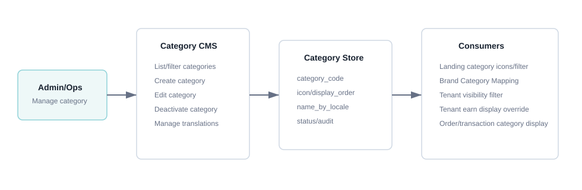
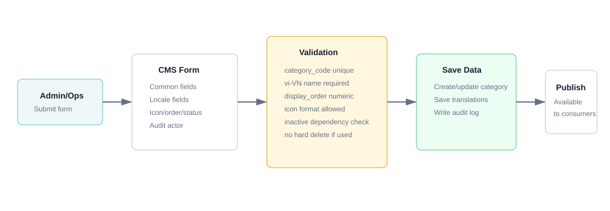
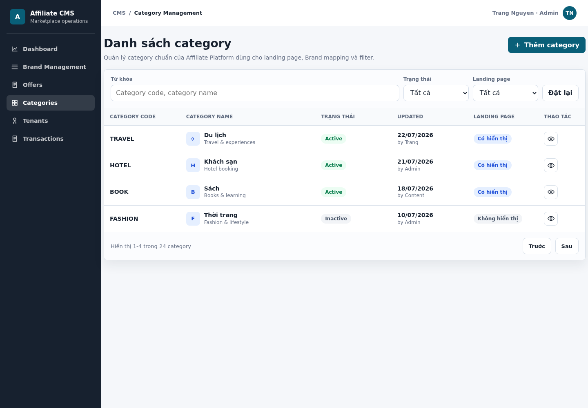
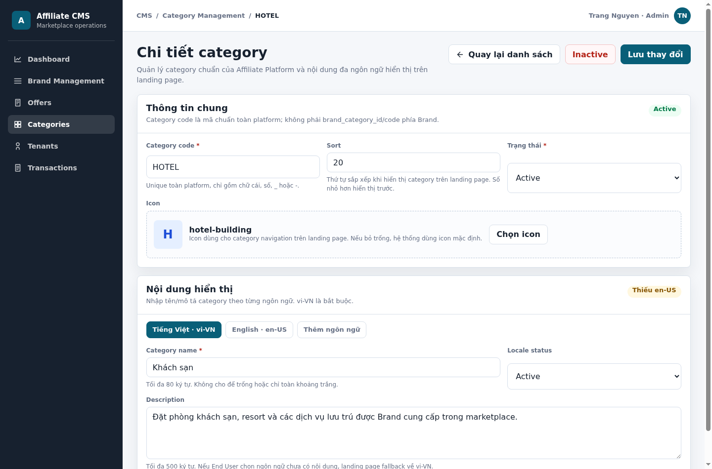

# SRS - Category Management

## Changes Record

Note: A - Add/Create new, M - Modify, D - Delete

| Date of change | Reason (A, M, D) | Updated by | Old version | Description of change | New version |
|---|---|---|---|---|---|
| 2026-07-23 | A | Product/BA | -- | Create SRS Category Management following module-04 template structure. | 1.0.0 |

## Table of Contents

- I. Introduction
- II. Overall Description
- III. Overview
- IV. Description of Functions
- V. Data Requirements
- VI. Consolidated Business Rules Summary
- VII. Non-functional Requirements
- VIII. Consolidated Acceptance Criteria Summary
- IX. Open Questions

# I. Introduction

## 1. Purpose of Document

Tài liệu này mô tả yêu cầu phần mềm cho module **Category Management** trên Admin CMS của White-label Affiliate Marketplace Platform. Category là master data chuẩn của Affiliate Platform, dùng để hiển thị/lọc trên landing page, mapping category phía Brand, cấu hình commission theo category, tenant visibility và earn/cashback display override.

## 2. Document Conventions

| Convention | Description |
|---|---|
| Required field | Trường bắt buộc được mô tả bằng `R` hoặc ký hiệu `*` trên giao diện. |
| Optional field | Trường không bắt buộc, có thể để trống nếu không ảnh hưởng publish/active. |
| Locale | Nội dung hiển thị ra landing page phải hỗ trợ đa ngôn ngữ; fallback mặc định là `vi-VN`. |
| Status | Trạng thái category gồm `Active`, `Inactive`, `Draft` nếu cần lưu chưa publish. |
| Hard delete | Không áp dụng nếu category đã được dùng ở Brand mapping, Tenant config, Offer/Brand filter hoặc transaction. |
| Priority | `Must` là bắt buộc trong MVP1; `Should` là nên có nếu không ảnh hưởng timeline. |

## 3. Project Scope

### 3.1 In Scope

| Module | Features |
|---|---|
| Category Management | Xem danh sách category + lọc, thêm mới category, sửa category, ngưng hoạt động/xóa mềm category. |
| Category Localization | Nhập tên/mô tả category theo nhiều ngôn ngữ bằng locale/tab ngôn ngữ. |
| Category Display Config | Cấu hình icon, sort, status để phục vụ landing page category icons/filter. |
| Category Dependency Control | Kiểm tra category đang được dùng trước khi cho inactive/delete. |

### 3.2 Out of Scope

| Item | Reason |
|---|---|
| Brand category mapping | Thuộc Brand & Offer Management, module Brand Category Mapping & Commission. |
| Commission theo category của Brand | Cấu hình trong Brand detail/tab Category & Commission, không nằm trong category master. |
| Tenant earn/cashback display theo category | Thuộc Tenant Portal Earn Display override. |
| Tự động gợi ý category bằng AI | Không thuộc MVP1. |
| Import/export category hàng loạt | Có thể bổ sung sau MVP1 nếu cần vận hành nhiều category. |

## 4. Expected Results After Finishing This Document

- Xác định đầy đủ use case Category Management trong MVP1.
- Làm rõ trường dữ liệu, validation, exception và business rule.
- Có logic diagram dạng hình ảnh.
- Có screen description đủ chi tiết để UI/UX, Engineering và QA triển khai.
- Có acceptance criteria cho từng nhóm chức năng chính.

## 5. References

| Document | Location |
|---|---|
| Function List / SOW | [affiliate-marketplace-platform-function-list.md](../function-list/affiliate-marketplace-platform-function-list.md) |
| Brand & Offer SRS | [brand-offer-management-module-04-template.md](brand-offer-management-module-04-template.md) |
| Landing Page SRS | [landing-page-module-04-template.md](landing-page-module-04-template.md) |
| Tenant Portal SRS | [tenant-portal-module-04-template.md](tenant-portal-module-04-template.md) |

# II. Overall Description

## 1. Definition

| Name | Description |
|---|---|
| Category | Danh mục chuẩn của Affiliate Platform, ví dụ Du lịch, Khách sạn, Sách, Điện tử. |
| Category code | Mã category duy nhất trong hệ thống Affiliate Platform, dùng cho tích hợp nội bộ và tra cứu. |
| Category locale content | Tên/mô tả category theo từng ngôn ngữ. |
| Category icon | Icon hiển thị trên landing page category navigation. |
| Sort | Thứ tự hiển thị category trên landing page; số nhỏ hơn hiển thị trước. |
| Brand category ID/code | Mã category của Brand, được mapping sang Affiliate category ở module Brand Category Mapping. |
| Audit log | Lịch sử thao tác tạo/sửa/inactive category. |

## 2. Operation Environment

| Item | Description |
|---|---|
| Application type | Admin CMS web application. |
| Primary users | Admin/Ops, Content/Ops, Partnership/Ops. |
| Supported browser | Chrome, Edge, Firefox bản hiện đại. |
| Device | Desktop/laptop là chính. |
| Integration dependency | Landing page, Brand Category Mapping, Tenant visibility/filter, Earn Display override, Order/Transaction category display. |
| Security | User phải đăng nhập CMS và có quyền quản lý category. |

## 3. User Characteristics

| Actor | Role/Need |
|---|---|
| Admin/Ops | Quản lý master category, status, icon, thứ tự hiển thị. |
| Content/Ops | Nhập tên/mô tả category theo nhiều ngôn ngữ. |
| Partnership/Ops | Dùng category để phân nhóm Brand và hỗ trợ mapping với Brand category. |
| QA | Kiểm tra validation, dependency rule, locale fallback và hiển thị landing page. |

## 4. Constraints

| Constraint | Description |
|---|---|
| Tenant isolation | Category là master data toàn platform, nhưng dữ liệu hiển thị trên Tenant landing page còn phụ thuộc Brand/Offer visibility của từng Tenant. |
| Locale fallback | Category phải có nội dung `vi-VN`; locale khác nếu thiếu sẽ fallback về `vi-VN`. |
| Dependency safety | Không hard delete category đã có liên kết nghiệp vụ. |
| Active visibility | Chỉ category `Active` mới được đưa ra landing page/filter. |

# III. Overview

## 1. Model Overview

| Component | Interaction |
|---|---|
| Admin CMS | Cho phép Admin/Ops list, create, edit, inactive category. |
| Category Service | Validate category code, locale content, icon, status và lưu category master. |
| Category Store | Lưu common fields và content theo locale. |
| Audit Service | Ghi nhận thao tác thay đổi category. |
| Landing Page Runtime | Lấy category active để render category icon/filter theo tenant catalog. |
| Brand Category Mapping | Sử dụng category master để mapping category phía Brand và cấu hình commission theo category. |

## 2. Function Diagram

## 3. Use Case List

| Use case ID | Use case name | Actor | Priority |
|---|---|---|---|
| CMS-CAT-001 | Xem danh sách category + lọc | Admin/Ops, Content/Ops | Must |
| CMS-CAT-002 | Thêm mới category | Admin/Ops, Content/Ops | Must |
| CMS-CAT-003 | Sửa category | Admin/Ops, Content/Ops | Must |
| CMS-CAT-004 | Ngưng hoạt động/xóa mềm category | Admin/Ops | Must |
| CMS-CAT-005 | Quản lý nội dung đa ngôn ngữ category | Admin/Ops, Content/Ops | Must |

# IV. Description of Functions

## 1. CMS-CAT-001 - Xem danh sách category + lọc

### a. Introduction

Admin/Ops xem danh sách category chuẩn của Affiliate Platform để kiểm tra trạng thái, nội dung hiển thị, icon và thứ tự hiển thị.

### b. Expected Result

- Hiển thị danh sách category có phân trang.
- Cho phép lọc/tìm kiếm theo keyword, status và trạng thái hiển thị landing page.
- Không hiển thị category đã hard delete vật lý vì MVP1 không áp dụng hard delete cho category đã dùng.

### c. Logic Diagram

### d. Screen Description

Screen: Category List

Mockup:

HTML mockup đầy đủ: [cms-category-list.html](../mockups/cms-category-list.html)

| # | Items | Control type | Data type | R/O | Description / Validation / Error handling |
|---:|---|---|---|---|---|
| 1 | Keyword | Textbox | Text | O | Tìm theo Category code hoặc Category name theo default locale. Trim khoảng trắng đầu/cuối. Không tìm theo mô tả dài để tránh kết quả nhiễu. |
| 2 | Status | Dropdown | Enum | O | Giá trị: Tất cả, Active, Inactive, Draft nếu có. |
| 3 | Landing page | Dropdown | Enum | O | Lọc category có/không hiển thị trên landing page. Category chỉ hiển thị khi Active và có dữ liệu catalog phù hợp. |
| 4 | Category code | Label | String | ReadOnly | Mã category duy nhất. Ví dụ `TRAVEL`, `HOTEL`, `BOOK`. |
| 5 | Category name | Label/Icon | Text/Asset | ReadOnly | Tên category theo default locale CMS kèm icon category. Nếu thiếu icon, hiển thị icon mặc định. |
| 6 | Status badge | Badge | Enum | ReadOnly | Active/Inactive/Draft. |
| 7 | Updated info | Label | User/Datetime | ReadOnly | Người cập nhật gần nhất và thời điểm cập nhật. |
| 8 | Landing page status | Badge | Enum | ReadOnly | Hiển thị category có/không xuất hiện trên landing page theo dữ liệu hiện tại. |
| 9 | Actions | Button/Menu | Action | O | Xem/Sửa/Inactive. Chỉ hiển thị action theo quyền. |

### e. Business Rules

| BR ID | Rule |
|---|---|
| BR-CAT-001-01 | Danh sách category chỉ hiển thị dữ liệu user có quyền xem theo RBAC Admin CMS. |
| BR-CAT-001-02 | Keyword search áp dụng cho `category_code` và `category_name` theo locale mặc định/locale đang chọn. |
| BR-CAT-001-03 | Category inactive không được dùng để tạo mapping mới hoặc hiển thị mới trên landing page. |
| BR-CAT-001-04 | Landing page chỉ hiển thị category active và có ít nhất một Brand/Offer visible trong tenant catalog. |

### f. Acceptance Criteria

| AC ID | Criteria |
|---|---|
| AC-CAT-001-01 | Admin/Ops xem được danh sách category với code, name, icon, status, updated info, landing page status và action. |
| AC-CAT-001-02 | Filter keyword/status hoạt động đúng. |
| AC-CAT-001-03 | User không có quyền không nhìn thấy action sửa/inactive. |
| AC-CAT-001-04 | Category thiếu bản dịch vẫn fallback được về `vi-VN`. |

## 2. CMS-CAT-002 - Thêm mới category

### a. Introduction

Admin/Ops tạo category chuẩn mới để sử dụng trong landing page, Brand category mapping và các cấu hình liên quan.

### b. Expected Result

- Tạo được category mới khi dữ liệu hợp lệ.
- Bắt buộc có category code, tên `vi-VN`, status.
- Cho phép nhập nội dung nhiều ngôn ngữ.
- Ghi audit log sau khi tạo thành công.

### c. Logic Diagram

### d. Screen Description

Screen: Create Category

| # | Items | Control type | Data type | R/O | Description / Validation / Error handling |
|---:|---|---|---|---|---|
| 1 | Category code | Textbox | String | R | Mã duy nhất toàn platform. Khuyến nghị uppercase snake/kebab không dấu, ví dụ `TRAVEL`, `HOTEL`, `FOOD_BEVERAGE`. Chỉ cho chữ cái, số, `_`, `-`; độ dài 2-50 ký tự. Nếu trùng, báo lỗi: `Category code đã tồn tại`. |
| 2 | Locale selector/tab | Tabs/Dropdown | Locale | R | Cho phép chọn ngôn ngữ để nhập content. `vi-VN` là bắt buộc. |
| 3 | Category name | Textbox | Text | R for `vi-VN`, O for other locale | Tên hiển thị category. Độ dài 1-80 ký tự. Không cho chỉ toàn khoảng trắng. Nếu thiếu `vi-VN`, báo lỗi: `Tên category tiếng Việt là bắt buộc`. |
| 4 | Description | Textarea | Text | O | Mô tả nội bộ/hiển thị nếu cần. Tối đa 500 ký tự. Nếu vượt giới hạn, báo lỗi tại field. |
| 5 | Icon | Upload/Icon picker | Asset/String | O | Cho phép chọn icon từ thư viện hoặc upload theo format được hỗ trợ. Nếu upload sai định dạng/kích thước, báo lỗi: `Icon không đúng định dạng hoặc vượt dung lượng cho phép`. |
| 6 | Sort | Number input | Integer | O | Số nguyên từ 0-9999 dùng để sắp xếp thứ tự hiển thị category trên landing page; số nhỏ hơn hiển thị trước. Nếu trống, hệ thống có thể mặc định cuối danh sách. Nếu nhập âm hoặc không phải số, báo lỗi tại field. |
| 7 | Status | Dropdown/Radio | Enum | R | Giá trị: Active, Inactive, Draft. Default nên là Active hoặc Draft theo policy vận hành. |
| 8 | Save | Button | Action | R | Validate toàn bộ form. Nếu hợp lệ, lưu category và quay về danh sách/hiển thị thông báo thành công. |
| 9 | Cancel | Button | Action | O | Quay lại danh sách. Nếu form đã thay đổi, hiển thị confirm rời trang. |

### e. Main Flow

| Step | Actor/System | Description |
|---:|---|---|
| 1 | Admin/Ops | Mở màn thêm mới category. |
| 2 | Admin/Ops | Nhập common fields và nội dung theo locale. |
| 3 | System | Validate required fields, format, uniqueness. |
| 4 | System | Lưu category master và locale content. |
| 5 | System | Ghi audit log action `CREATE_CATEGORY`. |
| 6 | System | Hiển thị thông báo tạo thành công. |

### f. Exception

| Case | Handling |
|---|---|
| Category code trùng | Không cho lưu, focus field Category code và hiển thị lỗi. |
| Thiếu tên `vi-VN` | Không cho lưu, chuyển về tab `vi-VN` và hiển thị lỗi. |
| Icon sai định dạng | Không upload/lưu file, hiển thị lỗi tại field Icon. |
| Mất kết nối/API lỗi | Không clear form; hiển thị thông báo lỗi chung và cho user thử lại. |

### g. Business Rules

| BR ID | Rule |
|---|---|
| BR-CAT-002-01 | `category_code` là duy nhất toàn platform, không phân biệt hoa/thường khi kiểm tra trùng. |
| BR-CAT-002-02 | Category bắt buộc có tên `vi-VN`. |
| BR-CAT-002-03 | Locale khác `vi-VN` là optional trong MVP1 nhưng nếu nhập thì phải validate độ dài/format. |
| BR-CAT-002-04 | Category `Active` mới được sử dụng cho landing page và mapping mới. |

### h. Acceptance Criteria

| AC ID | Criteria |
|---|---|
| AC-CAT-002-01 | Admin/Ops tạo được category với dữ liệu hợp lệ. |
| AC-CAT-002-02 | Hệ thống chặn category code trùng. |
| AC-CAT-002-03 | Hệ thống chặn lưu nếu thiếu tên `vi-VN`. |
| AC-CAT-002-04 | Sau khi tạo thành công, category xuất hiện trong danh sách và audit log được ghi nhận. |

## 3. CMS-CAT-003 - Sửa category

### a. Introduction

Admin/Ops sửa thông tin category đã tồn tại, bao gồm tên/mô tả đa ngôn ngữ, icon, sort và status.

### b. Expected Result

- Cập nhật được category khi dữ liệu hợp lệ.
- Không phá vỡ các liên kết đang sử dụng category.
- Ghi audit log old/new value theo policy.

### c. Screen Description

Screen: Edit Category

Mockup:

HTML mockup đầy đủ: [cms-category-detail.html](../mockups/cms-category-detail.html)

| # | Items | Control type | Data type | R/O | Description / Validation / Error handling |
|---:|---|---|---|---|---|
| 1 | Category code | Textbox/Label | String | R | Có thể cho sửa nếu category chưa phát sinh liên kết; nếu đã được dùng, nên lock hoặc chỉ cho sửa bởi role đặc biệt. Nếu sửa, validate uniqueness như màn Create. |
| 2 | Locale selector/tab | Tabs/Dropdown | Locale | R | Cho phép chỉnh content từng locale. |
| 3 | Category name | Textbox | Text | R for `vi-VN`, O for other locale | Validate như màn Create. |
| 4 | Description | Textarea | Text | O | Validate tối đa 500 ký tự. |
| 5 | Icon | Upload/Icon picker | Asset/String | O | Cho đổi icon. Nếu xóa icon, landing page dùng icon mặc định. |
| 6 | Sort | Number input | Integer | O | Validate 0-9999. Dùng để sắp xếp thứ tự category trên landing page; số nhỏ hơn hiển thị trước. |
| 7 | Status | Dropdown/Radio | Enum | R | Active/Inactive/Draft. Nếu đổi sang Inactive, hệ thống kiểm tra dependency. |
| 8 | Save changes | Button | Action | R | Validate và lưu thay đổi. |

### d. Business Rules

| BR ID | Rule |
|---|---|
| BR-CAT-003-01 | Không cho sửa `category_code` nếu category đã được dùng trong Brand mapping, Tenant earn display override hoặc transaction, trừ khi có migration/role đặc biệt. |
| BR-CAT-003-02 | Khi đổi status từ Active sang Inactive, hệ thống phải cảnh báo tác động đến landing page/filter và mapping mới. |
| BR-CAT-003-03 | Các mapping/transaction lịch sử vẫn giữ `category_id`; inactive chỉ ngăn hiển thị/tạo mới theo rule từng module. |
| BR-CAT-003-04 | Mọi thay đổi phải ghi audit log. |

### e. Acceptance Criteria

| AC ID | Criteria |
|---|---|
| AC-CAT-003-01 | Admin/Ops sửa được name/icon/sort/status khi hợp lệ. |
| AC-CAT-003-02 | Hệ thống chặn sửa code nếu category đã có dependency theo rule. |
| AC-CAT-003-03 | Hệ thống cảnh báo khi inactive category đang được sử dụng. |
| AC-CAT-003-04 | Audit log ghi nhận nội dung thay đổi. |

## 4. CMS-CAT-004 - Ngưng hoạt động/xóa mềm category

### a. Introduction

Admin/Ops ngưng hoạt động category không còn dùng để category không tiếp tục hiển thị hoặc được chọn trong cấu hình mới.

### b. Expected Result

- Cho phép inactive category khi user xác nhận.
- Không hard delete nếu category đã có dependency.
- Category inactive không xuất hiện trong landing page category icon/filter và không được chọn khi tạo mapping mới.

### c. Screen Description

Screen: Category Inactive/Delete Confirmation

| # | Items | Control type | Data type | R/O | Description / Validation / Error handling |
|---:|---|---|---|---|---|
| 1 | Category summary | Label | Object | ReadOnly | Hiển thị category code, name, status hiện tại. |
| 2 | Dependency summary | Label/List | Number/List | ReadOnly | Hiển thị số lượng Brand mapping, Tenant config, transaction hoặc nội dung liên quan nếu có API dependency. |
| 3 | Warning message | Text | Text | ReadOnly | Cảnh báo category inactive sẽ không hiển thị trên landing page và không dùng cho mapping mới. |
| 4 | Confirm inactive | Button | Action | R | User xác nhận inactive. Nếu không có quyền, ẩn/disable button. |
| 5 | Cancel | Button | Action | O | Đóng modal, không thay đổi dữ liệu. |

### d. Business Rules

| BR ID | Rule |
|---|---|
| BR-CAT-004-01 | Không hard delete category đã có liên kết nghiệp vụ. |
| BR-CAT-004-02 | Inactive category không được hiển thị trên landing page category navigation. |
| BR-CAT-004-03 | Inactive category không được chọn để tạo Brand Category Mapping mới hoặc Tenant Earn Display override mới. |
| BR-CAT-004-04 | Transaction lịch sử vẫn có thể hiển thị category inactive nếu transaction đã ghi nhận category đó. |

### e. Acceptance Criteria

| AC ID | Criteria |
|---|---|
| AC-CAT-004-01 | Admin/Ops inactive được category sau khi xác nhận. |
| AC-CAT-004-02 | Hệ thống không cho hard delete category đã có dependency. |
| AC-CAT-004-03 | Category inactive không còn hiển thị trên landing page category navigation. |
| AC-CAT-004-04 | Lịch sử transaction/mapping cũ không bị mất dữ liệu category. |

## 5. CMS-CAT-005 - Quản lý nội dung đa ngôn ngữ category

### a. Introduction

Admin/Ops nhập tên/mô tả category theo các locale được hỗ trợ để landing page hiển thị đúng ngôn ngữ End User lựa chọn.

### b. Expected Result

- Category có thể có nhiều bản dịch.
- `vi-VN` là locale bắt buộc.
- Locale thiếu nội dung sẽ fallback về `vi-VN`.

### c. Business Rules

| BR ID | Rule |
|---|---|
| BR-CAT-005-01 | Mỗi category bắt buộc có `name` cho locale `vi-VN`. |
| BR-CAT-005-02 | Mỗi locale chỉ có một bản content active cho cùng category. |
| BR-CAT-005-03 | Landing page resolve category name theo `selected_locale`; nếu thiếu thì fallback `vi-VN`. |
| BR-CAT-005-04 | Không cho nhập content rỗng/toàn khoảng trắng cho locale đã bật. |

### d. Acceptance Criteria

| AC ID | Criteria |
|---|---|
| AC-CAT-005-01 | Admin/Ops nhập/sửa được category name theo nhiều locale. |
| AC-CAT-005-02 | Hệ thống bắt buộc có `vi-VN`. |
| AC-CAT-005-03 | Landing page fallback đúng về `vi-VN` khi locale user chọn thiếu bản dịch. |

# V. Data Requirements

## 1. Category

| Field | Required | Type | Description / Validation |
|---|---|---|---|
| category_id | Yes | UUID/String | ID duy nhất do hệ thống sinh. |
| category_code | Yes | String | Unique toàn platform, 2-50 ký tự, chỉ gồm chữ cái, số, `_`, `-`; kiểm tra trùng không phân biệt hoa/thường. |
| icon | No | Asset/Icon ref | Icon hiển thị trên landing page. Nếu thiếu dùng icon mặc định. |
| display_order | No | Integer | 0-9999; số nhỏ hơn hiển thị trước. |
| status | Yes | Enum | Active, Inactive, Draft. |
| created_by/created_at | Yes | User/Datetime | Audit metadata khi tạo. |
| updated_by/updated_at | Yes | User/Datetime | Audit metadata khi cập nhật. |

## 2. Category Locale Content

| Field | Required | Type | Description / Validation |
|---|---|---|---|
| category_id | Yes | UUID/String | Tham chiếu category master. |
| locale | Yes | String | Ví dụ `vi-VN`, `en-US`. |
| name | Conditional | Text | Required với `vi-VN`; optional với locale khác nhưng nếu nhập thì không được rỗng, tối đa 80 ký tự. |
| description | No | Text | Tối đa 500 ký tự. |
| locale_status | No | Enum | Active/Inactive nếu cần quản lý từng locale; MVP1 có thể dùng theo status category master. |

## 3. Category Dependency Summary

| Field | Required | Type | Description / Validation |
|---|---|---|---|
| category_id | Yes | UUID/String | Category cần kiểm tra dependency. |
| brand_mapping_count | No | Number | Số Brand Category Mapping đang tham chiếu. |
| tenant_config_count | No | Number | Số Tenant visibility/earn display config đang tham chiếu. |
| transaction_count | No | Number | Số transaction lịch sử đã ghi nhận category. |
| can_hard_delete | Yes | Boolean | `false` nếu có bất kỳ dependency nghiệp vụ nào. |
| can_inactive | Yes | Boolean | `true` nếu user có quyền và rule cho phép inactive. |

# VI. Consolidated Business Rules Summary

| BR ID | Rule |
|---|---|
| BR-CAT-GEN-001 | Category là master data chuẩn của Affiliate Platform, không phải category riêng của từng Brand. |
| BR-CAT-GEN-002 | Brand category ID/code phải được mapping sang category master ở module Brand Category Mapping. |
| BR-CAT-GEN-003 | Category code unique toàn platform. |
| BR-CAT-GEN-004 | Category bắt buộc có tên `vi-VN`. |
| BR-CAT-GEN-005 | Category inactive không hiển thị trên landing page category navigation và không được chọn cho cấu hình mới. |
| BR-CAT-GEN-006 | Không hard delete category đã có dependency nghiệp vụ. |
| BR-CAT-GEN-007 | Mọi thay đổi category phải ghi audit log. |

# VII. Non-functional Requirements

| NFR ID | Requirement |
|---|---|
| NFR-CAT-001 | Danh sách category phản hồi trong thời gian chấp nhận được với dữ liệu MVP1; hỗ trợ pagination. |
| NFR-CAT-002 | API phải enforce RBAC cho từng action list/create/edit/inactive. |
| NFR-CAT-003 | Dữ liệu category thay đổi phải đồng bộ/cache invalidation tới landing page runtime theo thiết kế kỹ thuật. |
| NFR-CAT-004 | Input text phải được sanitize để tránh XSS trên CMS và landing page. |
| NFR-CAT-005 | Audit log phải đủ actor, action, entity_id, timestamp và old/new value theo policy. |

# VIII. Consolidated Acceptance Criteria Summary

| AC ID | Criteria |
|---|---|
| AC-CAT-GEN-001 | Admin/Ops quản lý được danh sách category chuẩn trong CMS. |
| AC-CAT-GEN-002 | Category tạo mới bắt buộc có code unique và name `vi-VN`. |
| AC-CAT-GEN-003 | Category hỗ trợ nhập nội dung đa ngôn ngữ và fallback `vi-VN`. |
| AC-CAT-GEN-004 | Category active có thể được dùng cho landing page/filter và mapping mới. |
| AC-CAT-GEN-005 | Category inactive không còn xuất hiện trong landing page category navigation. |
| AC-CAT-GEN-006 | Hệ thống không hard delete category đã có dependency. |
| AC-CAT-GEN-007 | Thao tác tạo/sửa/inactive category được ghi audit log. |

# IX. Open Questions

| # | Question | Current assumption |
|---:|---|---|
| 1 | Category code có cho phép sửa sau khi đã dùng không? | Mặc định không cho sửa nếu đã có dependency. |
| 2 | Icon dùng thư viện icon cố định hay upload asset? | MVP1 có thể dùng icon picker/thư viện icon; upload asset tùy khả năng CMS. |
| 3 | Có cần import/export category hàng loạt không? | Không thuộc MVP1, có thể bổ sung sau nếu số lượng category lớn. |

## Closed Decisions

| # | Decision | Answer |
|---:|---|---|
| 1 | Supported locale MVP1 | Hỗ trợ `vi-VN` và `en-US`; default/fallback `vi-VN`. |
