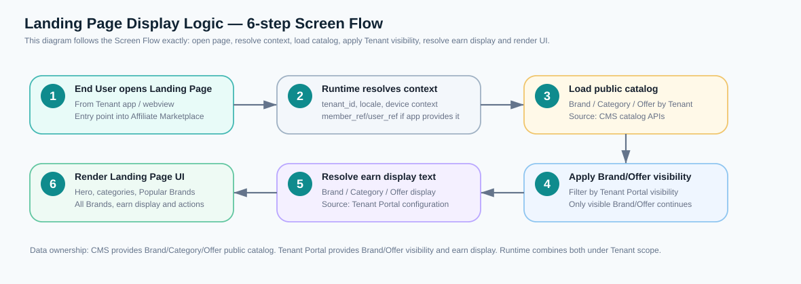
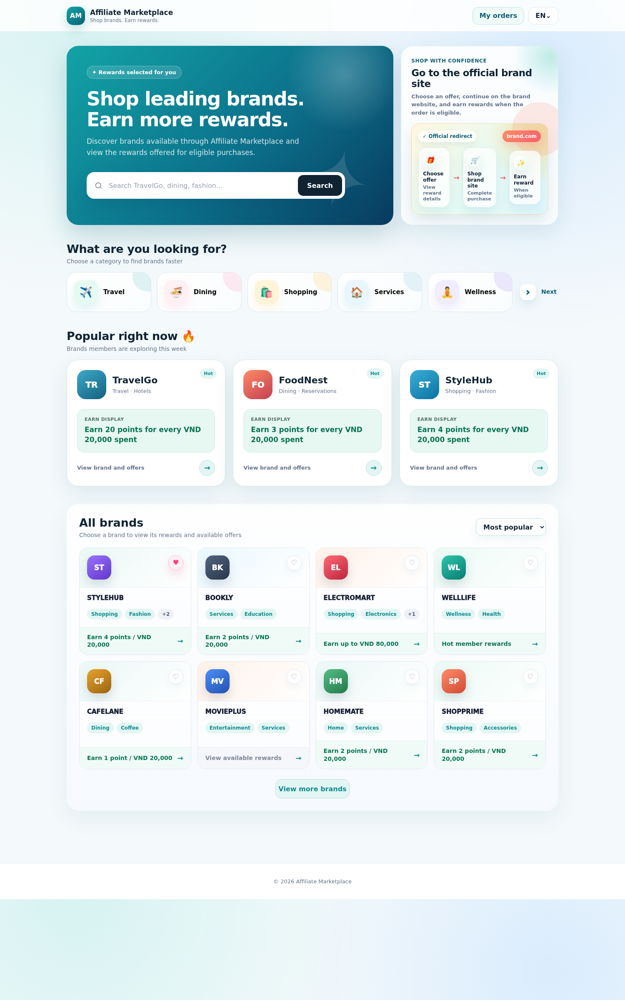
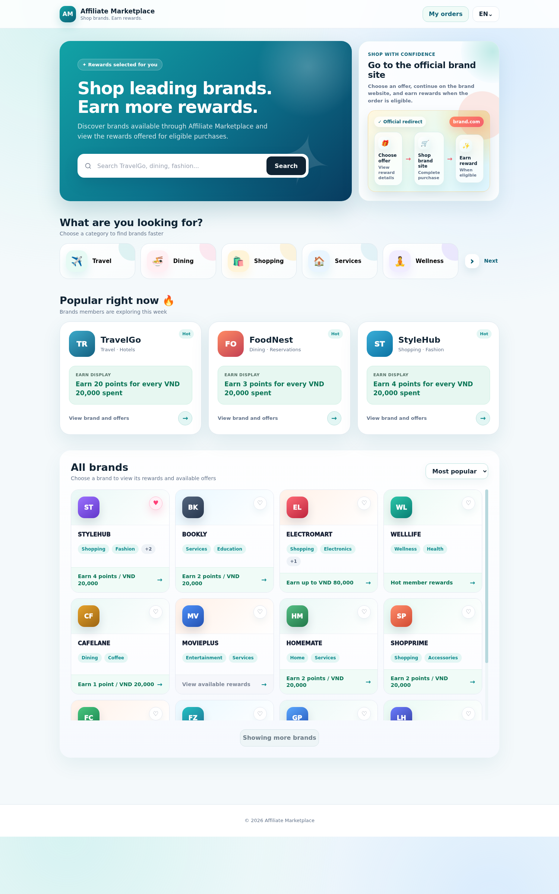
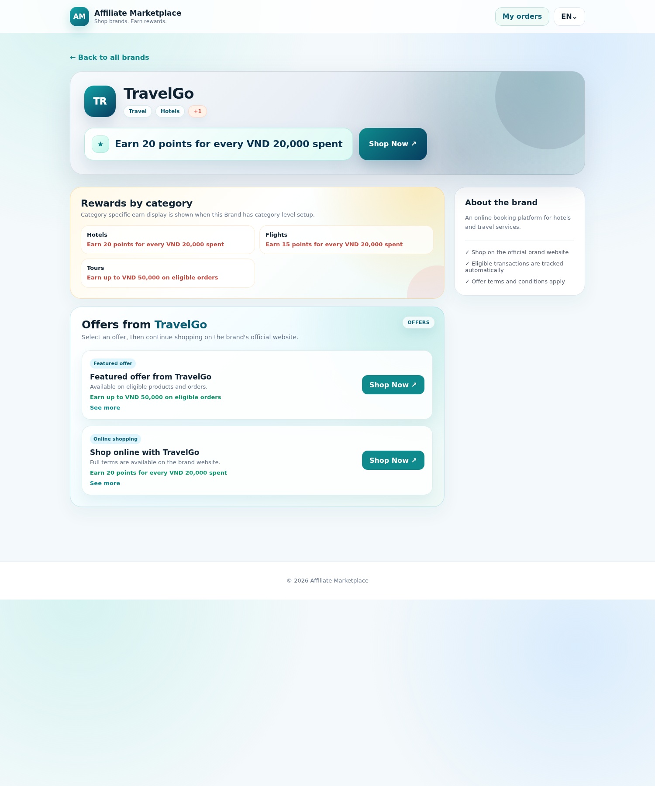
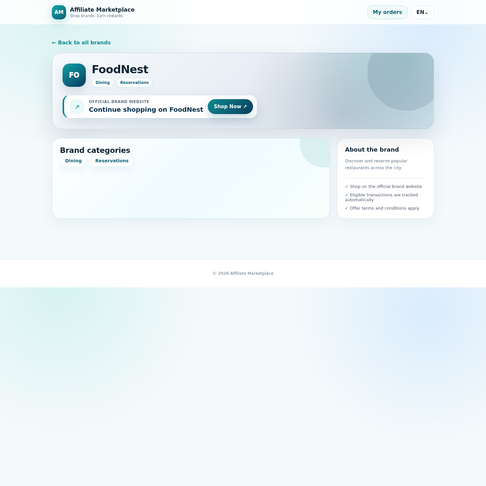
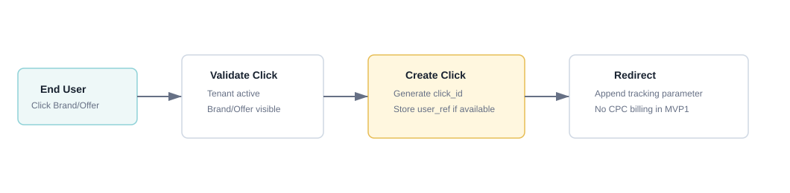
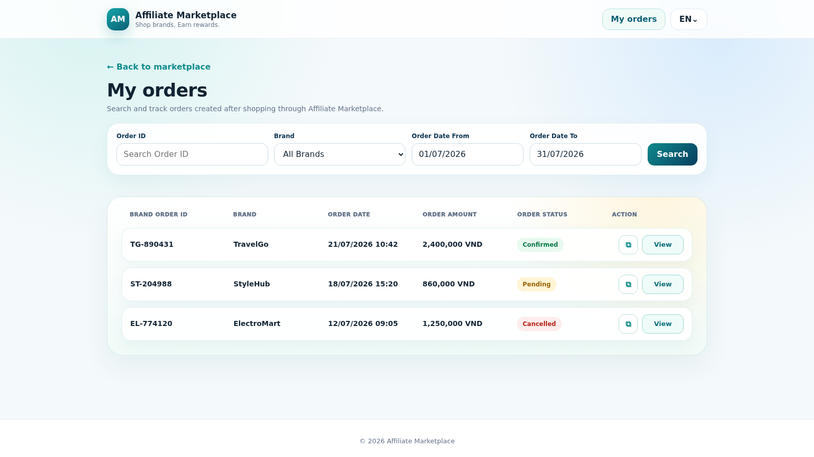
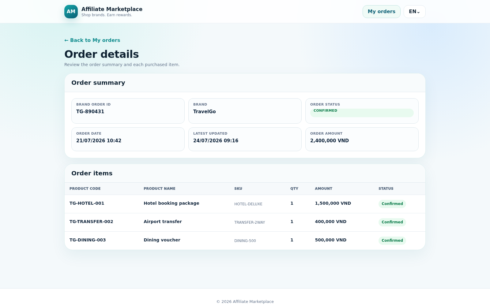

# SRS - Affiliate Marketplace Landing Page

## Changes Record

Note: A - Add/Create new, M - Modify, D - Delete

| Date of change | Reason (A, M, D) | Updated by | Old version | Description of change | New version |
|---|---|---|---|---|---|
| 2026-07-23 | M | Product/BA | 1.0.0 | Rewrite Landing Page SRS based on the latest `affiliate-marketplace-landing-page-desktop.html` mockup and clarified business flow.| 1.1.0 |

## Table of Contents

- I. Introduction
- II. Overall Description
- III. Overview
- IV. Description of Functions

# I. Introduction

## 1. Purpose of Document

Tài liệu này mô tả yêu cầu cho Landing Page / White-label Marketplace dành cho End User của từng Tenant trong Affiliate Marketplace Platform.

Landing Page là giao diện End User truy cập để xem danh sách Brand/Offer đã được Platform assign cho Tenant và đã được Tenant cho phép hiển thị. End User có thể tìm kiếm/lọc Brand/Offer, xem thông tin earn/cashback display, xem chi tiết Brand và click điều hướng sang website/app chính thức của Brand. 

Hệ thống ghi nhận click tracking để phục vụ attribution, order tracking, commission và báo cáo.

Tài liệu là cơ sở để Product/BA, UI/UX, Engineering, QA và vận hành thống nhất phạm vi, màn hình, trường dữ liệu, business rule, exception và acceptance criteria cho MVP1.

## 2. Document Conventions

| Convention | Description |
|---|---|
| CMS | Admin CMS/Platform CMS quản lý master data Brand, Offer, Category, Brand-Category mapping, Offer content, destination URL, status và effective period. |
| Tenant Portal | Portal để Tenant xem Brand được assign, bật/tắt hiển thị Brand/Offer và cấu hình earn/cashback display theo Brand/Category/Offer. |
| Platform Runtime | Landing Page runtime/API chịu trách nhiệm resolve dữ liệu public theo Tenant, locale, visibility, search/filter, click tracking và redirect. |
| End User | Người dùng cuối truy cập landing page từ app của Tenant để chọn Brand/Offer và mua hàng ở website Brand. |
| Brand card | Card trong danh sách `All brands`, đại diện cho một Brand visible với Tenant. |
| Brand detail | Màn chi tiết Brand sau khi End User click Brand card hoặc Popular Brand. |
| My orders | Màn tra cứu đơn hàng của End User trên Landing Page; hiển thị Order Status, hỗ trợ copy Brand Order ID và mở Order Detail. |
| Brand Order ID | Mã đơn hàng do Brand phát sinh/trả về; dùng để End User tra cứu/đối chiếu với website chính thức của Brand. |
| Earn display | Text hiển thị reward/earn/cashback cho End User; đây là nội dung display do Tenant cấu hình, không phải công thức cộng điểm tự động trong MVP1. |
| Visible Brand | Brand `Active` trên CMS, được assign cho Tenant và Tenant bật Display Status/Visibility. |
| Visible Offer | Offer `Active/Published` trên CMS, thuộc visible Brand và có Tenant Offer Display/Visibility = `Active` trên Tenant Portal. Nếu Tenant đặt Offer Display/Visibility = `Inactive` thì Offer không hiển thị trên Landing Page. |
| Locale | Mockup hiện hiển thị tiếng Anh. Runtime vẫn cần hỗ trợ locale nếu CMS/Tenant Portal có content đa ngôn ngữ. |
| Static UI copy | Text cố định thuộc frontend/content config, không lấy từ CMS/Tenant Portal trừ khi có yêu cầu CMS hóa sau này. |

## 3. Project Scope

### 3.1 In Scope

| Module | Features |
|---|---|
| Landing Page runtime | Render Affiliate Marketplace landing page theo Tenant context. |
| Brand discovery | Search theo Brand/category keyword, filter theo category, sort/filter Brand list. |
| Category navigation | Hiển thị nhóm category; nếu có nhiều hơn số category đang hiển thị thì dùng `Next` để chuyển nhóm category tiếp theo. |
| Popular Brands | Hiển thị các Brand nổi bật/hot để End User vào Brand detail nhanh. |
| All Brands | Hiển thị Brand card gồm logo, Brand name, category chips và earn display. |
| View more brands | Mở rộng danh sách Brand; nếu dữ liệu dài thì danh sách có vùng scroll nội bộ. |
| Brand Detail | Hiển thị Brand header, Brand categories, Brand-level earn display, Rewards by category, Offers và About the brand. |
| Offer display | Hiển thị Offer badge/label, Offer title, Offer description, Offer terms/reward text và CTA `Shop Now`. |
| Redirect & click tracking | Click `Shop Now` hoặc offer phải tạo click tracking record trước khi redirect sang website chính thức của Brand. |
| My orders | End User tra cứu các đơn hàng đã được ghi nhận theo Brand Order ID, Brand và Order Date; xem Order Status, sao chép Brand Order ID và mở chi tiết gồm nhiều Order Item. |

### 3.2 Out of Scope

| Item | Reason |
|---|---|
| End-user Account/Login inside Landing Page | Deferred/Phase 2. MVP1 không có account entry, đăng nhập, đăng xuất, đăng ký hoặc quên mật khẩu End User; Landing Page nhận `member_ref/user_ref` hoặc session context từ app/hệ thống Tenant nếu có. |
| Checkout/payment trên Affiliate Platform | End User mua hàng trên website/app chính thức của Brand. |
| Tính/cộng điểm loyalty cho End User | MVP1 chỉ hiển thị earn/cashback display text và ghi nhận tracking; cộng điểm phụ thuộc hệ thống loyalty/settlement ngoài phạm vi mockup này. |
| Hiển thị commission/revenue share cho End User | Đây là dữ liệu nội bộ CMS/Tenant Portal, không hiển thị trên Landing Page. |
| Cập nhật/đối soát trạng thái đơn hàng trên Landing Page | Landing Page chỉ hiển thị Order Status do Platform tổng hợp; End User không được cập nhật trạng thái hoặc thực hiện đối soát. |
| Timeline trạng thái và thông tin commission/reward nội bộ | Màn chi tiết chỉ hiển thị thông tin Order và Order Item phù hợp với End User; không hiển thị timeline, commission source, Gross Commission, Tenant Share hoặc rule nội bộ. |
| Banner Management và banner marketing campaign | Deferred/Phase 2. MVP1 không có màn quản lý Banner, banner slider/campaign block hoặc thao tác click Banner. |
| Brand Favourite | Deferred/Phase 2. MVP1 không có icon yêu thích, thao tác thêm/xóa Brand yêu thích hoặc bộ lọc/sắp xếp theo Brand yêu thích. |

## 4. Expected Results After Finishing This Document

- Thống nhất nghiệp vụ Landing Page theo mockup mới nhất.
- Làm rõ dữ liệu từng trường lấy từ CMS, Tenant Portal, Platform Runtime hay static UI.
- Có ảnh màn hình minh họa cho Landing Page, View more brands, Brand Detail, My Orders và Order Detail.
- Có rule rõ cho search/filter/category/brand detail/offer redirect.
- Làm cơ sở để UI/UX, FE, BE, QA và BA viết task/test case.

## 5. References

| Reference | Location | Usage |
|---|---|---|
| Landing Page desktop mockup | [affiliate-marketplace-landing-page-desktop.html](../mockups/affiliate-marketplace-landing-page-desktop.html) | Mockup chính của Landing Page và Brand Detail. |
| Tenant Portal SRS | [tenant-portal-module-04-template.md](tenant-portal-module-04-template.md) | Nguồn nghiệp vụ Tenant Brand visibility, Earn display, Transaction/Dashboard sử dụng click tracking. |
| Brand & Offer SRS | [brand-offer-management-module-04-template.md](brand-offer-management-module-04-template.md) | Nguồn Brand, Offer, Category, Badge/Label, Title, Description, Terms & conditions, Destination URL, status/effective period. |
| Order & Transaction SRS | [order-transaction-management-module-04-template.md](order-transaction-management-module-04-template.md) | Nguồn nghiệp vụ attribution, order matching, commission status và transaction lifecycle. |
| Landing screenshot | [landing-page-desktop.png](assets/landing-page-desktop.png) | Ảnh màn Landing Page desktop. |
| View more brands screenshot | [landing-page-expanded-brands.png](assets/landing-page-expanded-brands.png) | Ảnh trạng thái danh sách Brand mở rộng/scroll. |
| Brand detail screenshot | [landing-page-brand-detail.png](assets/landing-page-brand-detail.png) | Ảnh màn Brand Detail. |
| Brand detail - no earn/no offer screenshot | [landing-page-brand-detail-foodnest.png](assets/landing-page-brand-detail-foodnest.png) | Ảnh màn Brand Detail khi Brand không có Brand-level earn display, không có category reward display và không có Offer hiển thị. |
| My Orders screenshot | [landing-page-my-orders.png](assets/landing-page-my-orders.png) | Ảnh màn End User tra cứu đơn hàng Phase 1. |
| Order Detail screenshot | [landing-page-order-detail.png](assets/landing-page-order-detail.png) | Ảnh màn End User xem thông tin chung và danh sách item của đơn hàng. |

# II. Overall Description

## 1. Definition

| Name | Description |
|---|---|
| Affiliate Marketplace | Marketplace trung gian hiển thị danh sách Brand/Offer cho End User của Tenant. |
| Tenant | Đối tác tích hợp landing page vào app/kênh của mình. |
| Brand | Merchant/shop/provider được Platform quản lý trên CMS và được assign cho Tenant. |
| Offer | Chiến dịch cụ thể thuộc Brand, có Badge/Label, Title, Description, Terms & conditions và destination URL. |
| Affiliate Category | Danh mục chuẩn của Affiliate Platform do CMS/Platform quản lý, ví dụ Travel, Dining, Shopping, Services, Wellness, Electronics. |
| Brand Category Mapping | Quan hệ Brand thuộc một hoặc nhiều Affiliate Category, do CMS quản lý. |
| Popular Brand right now| top 3 Popular Brands dựa vào cột Hot do Tenant thiết lập tại Portal Tenant `Assigned Brand`  |
| Earn display by Brand | Text earn/cashback mặc định theo Tenant + Brand, cấu hình tại Tenant Portal. |
| Earn display by Category | Text earn/cashback override theo Tenant + Brand + Category, cấu hình tại Tenant Portal. |
| Earn display by Offer | Text earn/cashback override theo Tenant + Brand + Offer, cấu hình tại Tenant Portal. |
| click_id | ID tracking sinh khi End User click `Shop Now`/Offer trước khi redirect. |
| member_ref/user_ref | Mã tham chiếu End User do app Tenant truyền vào nếu có; dùng nội bộ cho attribution/reconciliation. |

## 2. Operation Environment

| Item | Description |
|---|---|
| Application type | Web landing page tích hợp trong app/webview hoặc mở bằng browser từ app Tenant. |
| Primary users | End User của Tenant. |
| Supported device | Desktop mockup; runtime cần responsive cho webview/mobile nếu triển khai production. |
| Supported browser | Chrome, Safari, Edge, Firefox bản hiện đại; webview trong app đối tác nếu được tích hợp. |
| Runtime dependency | Tenant active; Brand/Offer active; Brand được assign cho Tenant; Tenant bật visibility/display. |
| Tracking dependency | Click tracking service khả dụng để tạo click record trước redirect. |
| Data isolation | Mọi dữ liệu phải scope theo Tenant context; không lộ dữ liệu Tenant khác. |

# III. Overview

## 1. Model Overview

| Component | Responsibility |
|---|---|
| Partner App/Tenant App | Mở Landing Page và có thể truyền Tenant context/member reference nếu có. |
| Landing Page Runtime | Render UI, gọi catalog API, search/filter/sort, mở Brand Detail và gọi tracking API khi redirect. |
| CMS Catalog | Cung cấp Brand, Category, Brand-Category mapping, Offer content, Offer destination URL, status/effective period. |
| Tenant Portal Configuration | Cung cấp Brand/Offer visibility và earn display text theo Brand/Category/Offer. |
| Tracking/Attribution Service | Tạo click_id, lưu click tracking record và phục vụ order attribution sau này. |
| Brand Website | Website chính thức nhận redirect để End User mua hàng. |

## 2. Site Map

| Page/State | Child state/action |
|---|---|
| Affiliate Marketplace Landing | Search; Category filter; Category Next; Popular Brand click; All Brands list; Sort; View more brands. Brand Favourite thuộc Deferred/Phase 2. |
| All Brands result | Filtered by keyword/category; expanded list with internal scroll when many Brands. |
| Brand Detail | Back to all brands; Brand header; Rewards by category; Offers; About the brand; Shop Now redirect. |
| Redirect state | Create click tracking record; redirect to official Brand URL; show redirect feedback/toast if needed. |
| My Orders | Open from topbar; search by Brand Order ID, Brand, Order Date From/To; copy Brand Order ID; view Order Status; open Order Detail. |
| Order Detail | Back to My Orders; view Order summary and the list of Order Items. |
| Empty/Error state | No result; no visible Brands; tracking failed; destination unavailable. |

## 3. Use Case List

| # | Use case ID | Use case name | Actor | Priority |
|---:|---|---|---|---|
| 1 | LP-MKT-001 | Xem Affiliate Marketplace Landing Page theo Tenant | End User | Must |
| 2 | LP-MKT-002 | Xem danh sách Brand | End User | Must |
| 3 | LP-MKT-003 | Xem Brand Detail | End User | Must |
| 4 | LP-MKT-004 | Redirect sang website chính thức của Brand | End User, Platform | Must |
| 5 | LP-MKT-005 | Tra cứu Đơn hàng của tôi | End User | Must |

# IV. Description of Functions

## 1. LP-MKT-001 - Xem Affiliate Marketplace Landing Page theo Tenant

### a. Introduction

End User mở Affiliate Marketplace từ app/kênh của Tenant. Landing Page phải hiển thị đúng Tenant context, không yêu cầu login trong landing page và không hiển thị dữ liệu nội bộ.

### b. Actors/Objects

| Actor/Object | Role |
|---|---|
| End User | Xem landing page, chọn Brand/Offer. |
| Partner App | Mở landing page; có thể truyền Tenant context/member reference. |
| Landing Page Runtime | Render UI và gọi API public catalog. |
| CMS Catalog | Nguồn Brand, Category, Offer public content. |
| Tenant Portal Config | Nguồn visibility và earn display. |

### c. Pre-conditions

- Tenant đang `Active`.
- Landing Page URL/app context xác định được `tenant_id`.
- Có ít nhất một Brand visible với Tenant để hiển thị dữ liệu; nếu không có thì hiển thị empty state.

### d. Expected Result

- End User thấy Landing Page với header `Affiliate Marketplace`, hero, category navigation, Popular Brands và All Brands.
- Chỉ dữ liệu public được hiển thị.
- Không có đăng nhập/member account trong Landing Page.

### e. Logic Diagram

### f. Screen Flow

1. End User mở Landing Page từ app Tenant.
2. Runtime xác định `tenant_id`, locale và device context.
3. Runtime load Brand/Category/Offer public catalog theo Tenant.
4. Runtime apply Brand/Offer visibility từ Tenant Portal.
5. Runtime resolve earn display text từ Tenant Portal.
6. UI render Landing Page.

### g. Screen Description — Affiliate Marketplace Landing

| # | Item | Control type | Data type | Source | Description / Business note |
|---:|---|---|---|---|---|
| 1 | `AM` logo mark | Logo/Text | Display | Static UI config | Mockup dùng `AM` cho Affiliate Marketplace. |
| 2 | `Affiliate Marketplace` | Text | Display | Static UI copy | Tên landing page cố định theo yêu cầu |
| 4 | Language selector `EN` | Dropdown | Locale | Platform runtime / locale config | Hiển thị mặc định theo ngôn ngữ Việt Nam. Ngoài ra có lựa chọn là ngôn ngữ Anh. Khi chuyển ngôn ngữ, landing page sẽ tự động chuyển các thông tin sang tiếng anh |
| 4.1 | `My orders` | Button | Action | Static UI copy + runtime route | Nút trên topbar để End User mở màn tra cứu đơn hàng đã phát sinh qua Affiliate Marketplace. |
| 5 | Hero headline `Shop leading brands. Earn more rewards.` | Text | Display | Static UI copy | Nội dung giới thiệu marketplace;được fix cố định|
| 6 | Hero description | Text | Display | Static UI copy | <li>Mô tả tổng quan: user khám phá Brand và xem reward cho eligible purchases.</li><li>Thông tin này được fix cố định</li> |
| 7 | Search box | Input | String | User input | Tìm theo Brand name hoặc Category keyword; tối đa khuyến nghị 100 ký tự; trim khoảng trắng. |
| 8 | Search button | Button | Action | User action | Khi click/Enter, filter kết quả và tự scroll xuống section `All brands`. |
| 9 | `Shop with confidence` card | Info card | Display | Static UI copy | <li>Giải thích flow end-user: chọn offer, shop tại official Brand site, nhận reward nếu đơn hợp lệ. </li><li>Thông tin này được fix cố định</li>|
| 10 | Category cards | Button list | Category | CMS Affiliate Platform | Hiển thị các category của Platform được mapping với các brand đang được visibility của Ternant này. Icon cho các category được frontend tự xử lý. Khi nhấn vào category này sẽ filter kết quả tất cả các brand được hiển thị trên landing page mà có mapping với category đã chọn và tự scroll hiển thị xuống section `All brands`. Mặc định hiển thị 5 category, muốn xem thêm thì click Next|
| 11 | `Next` category control | Button | Action | Runtime derived | Hiển thị nếu tổng số category nhiều hơn số slot hiện tại. Click chuyển sang nhóm category tiếp theo, không filter trực tiếp. |
| 12 | `Popular right now` | Section | Display | Portal Tenant| Hiển thị Brand nổi bật/hot trong tuần. |
| 13 | Popular Brand card | Card | Display/Action | CMS Affiliate Platform | Hiển thị top 3 Popular Brand card phổ biến dựa vào thông tin được set ở cột Hot trong màn hình Brand Assignment tại Portal Tenant.  Click mở Brand Detail. |
| 14 | Popular Brand logo/name/category | Logo/Text | Display | CMS Affiliate Platform | Logo/name/category được lấy theo Brand đuọc setup bên CMS. Mặc định hiển thị 2 category, nếu nhiều hơn 2 sẽ hiển thị dưới dạng +N. |
| 15 | Popular Brand earn display | Text | Display | Tenant Portal Earn Display | Ưu tiên hiển thị earn display level Brand được cấu hình bên Portal Tenant, nếu không có earn display level Brand thì hiển thị hiển thị thông tin `View available reward` thay thế. |
| 16 | `View brand and offers` | Link/Button | Action | Static UI copy + Brand id runtime | Click mở Brand Detail, không redirect trực tiếp sang Brand website. |
| 18 | Sort dropdown | Dropdown | Enum | Runtime UI state | MVP1 gồm `Most popular` và `Name A-Z`. `Most popular` hiển thị mặc định top 8 Brand được phép hiển thị trên landing page, sắp xếp theo doanh thu đơn hàng giảm dần và chỉ tính Order có trạng thái khác `Cancelled`. `Name A-Z` sắp xếp Brand theo tên tăng dần. `Favorites` thuộc Deferred/Phase 2. |
| 19 | Brand card logo/name | Card content | Display | CMS Brand | Card chỉ hiển thị logo và Brand name ở danh sách `All brands`; không hiển thị short description trong card list theo mockup hiện tại. |
| 21 | Brand category chips | Chips | Display | CMS Brand-Category Mapping | Hiển thị tối đa 2 category; nếu nhiều hơn 2 thì hiển thị `+N` với tooltip danh sách còn lại. |
| 23 | Brand card earn display | Text | Display | Tenant Portal Earn Display | Ưu tiên hiển thị earn display level Brand được cấu hình bên Portal Tenant, nếu không có earn display level Brand thì hiển thị thông tin `View available reward` thay thế, được bôi xám như mockup |
| 24 | `View more brands` | Button | Action | Runtime pagination/list state | Mở thêm Brand. Khi nhiều dữ liệu, `All brands` chuyển thành vùng scroll nội bộ. |
| 25 | Footer copyright | Text | Display | Static UI copy | Chỉ hiển thị `© 2026 Affiliate Marketplace`; không còn Terms/Privacy/Support links trong mockup. |

### h. Business Rules

| BR ID | Rule |
|---|---|
| BR-LP-MKT-001-01 | Landing Page phải xác định `tenant_id` trước khi load catalog. Nếu không xác định được Tenant, hiển thị error state hoặc fallback route theo integration policy. |
| BR-LP-MKT-001-02 | Không hiển thị Brand nếu Brand không `Active` trên CMS, chưa được Platform assign cho Tenant, hoặc Tenant đã tắt Display Status/Visibility. |
| BR-LP-MKT-001-03 | Landing Page không hiển thị commission rate, revenue share, order/transaction nội bộ, tracking ID hoặc CMS/Tenant Portal status nội bộ. |
| BR-LP-MKT-001-04 | Header không hiển thị menu `Discover / Popular brands / Categories` theo mockup hiện tại. |
| BR-LP-MKT-001-05 | Landing Page không có entry đăng nhập/member account trong mockup hiện tại. |

### i. Acceptance Criteria

| AC ID | Criteria |
|---|---|
| AC-LP-MKT-001-01 | Khi mở landing page của Tenant active, UI hiển thị đúng Affiliate Marketplace landing theo mockup. |
| AC-LP-MKT-001-02 | Brand không visible với Tenant không xuất hiện ở Popular Brands hoặc All Brands. |
| AC-LP-MKT-001-03 | UI không hiển thị Terms/Privacy/Support footer links. |
| AC-LP-MKT-001-04 | UI không yêu cầu End User login trong landing page. |

## 2. LP-MKT-002 - Xem danh sách Brand

### a. Introduction

End User có thể tìm kiếm Brand/category, chọn category để lọc Brand, chuyển nhóm category bằng `Next`, sort danh sách và mở rộng thêm Brand bằng `View more brands`.

### b. Actors/Objects

| Actor/Object | Role |
|---|---|
| End User | Nhập keyword, chọn Category, sắp xếp và xem thêm Brand; không có thao tác Favourite trong MVP1. |
| Landing Runtime | Filter/sort/paginate list và scroll đúng section. |
| CMS Catalog | Nguồn Brand/category/searchable text. |
| Tenant Portal Config | Nguồn Brand visibility và earn display. |

### c. Pre-conditions

- Landing Page đã load thành công.
- Brand list đã được scope theo Tenant và visibility.

### d. Expected Result

- Search theo Brand hoặc category trả kết quả đúng và tự chuyển xuống `All brands`.
- Click category filter đúng Brand thuộc category đó và tự chuyển xuống `All brands`.
- `View more brands` mở thêm Brand; nếu danh sách dài thì có scroll trong section Brand list.

### e. Screen Flow

1. End User nhập keyword hoặc chọn category.
2. Runtime apply filter theo Brand name, category name và searchable text nội bộ.
3. UI scroll tới section `All brands`.
4. Nếu `View more brands` được click hoặc kết quả nằm trong phần mở rộng, list mở rộng.
5. Nếu số card vượt chiều cao list, người dùng scroll trong vùng `All brands`.

### f. Screen Description — All Brands Expanded / Scroll State

| # | Item | Control type | Data type | Source | Description / Business note |
|---:|---|---|---|---|---|
| 1 | `All brands` | Section title | Display | Static UI copy | Section nhận kết quả sau search/category/sort. |
| 2 | Subtitle | Text | Display | Static UI copy | `Choose a brand to view its rewards and available offers`. |
| 3 | Sort dropdown | Dropdown | Enum | Runtime UI state | MVP1 gồm `Most popular` và `Name A-Z`. `Most popular` sắp xếp các Brand được phép hiển thị theo doanh thu đơn hàng giảm dần. `Name A-Z` sắp xếp Brand theo tên tăng dần. `Favorites` thuộc Deferred/Phase 2. |
| 4 | Brand cards | Grid/list | Display | CMS Brand + Tenant Portal visibility + Tenant earn display | Tất cả card đã lọc theo Tenant, visibility và keyword/category; không lọc theo Favourite trong MVP1. |
| 5 | Scrollable brand list | Scroll container | UI behavior | Runtime UI state | Khi mở nhiều Brand, list có scroll nội bộ để tránh page quá dài. |
| 6 | `Showing more brands` | Disabled button | State | Runtime UI state | Sau khi click `View more brands`, button đổi state để báo đang xem danh sách mở rộng. |

### g. Business Rules

| BR ID | Rule |
|---|---|
| BR-LP-MKT-002-01 | Search phải tìm theo Brand name, category keyword. |
| BR-LP-MKT-002-02 | Sau khi search hoặc click category, UI phải tự scroll tới section `All brands`. |
| BR-LP-MKT-002-03 | Category filter dùng CMS Brand-Category Mapping; một Brand có nhiều category thì match nếu keyword/category nằm trong bất kỳ category nào của Brand. |
| BR-LP-MKT-002-04 | Category row chỉ hiển thị một nhóm category tại một thời điểm. Nếu còn category khác, hiển thị control `Next` dạng icon/text. |
| BR-LP-MKT-002-05 | `View more brands` không tạo dữ liệu mới; chỉ fetch/render thêm Brand từ page tiếp theo hoặc mở phần dữ liệu đã được lazy-loaded. |
| BR-LP-MKT-002-06 | Khi danh sách Brand dài, section `All brands` phải hỗ trợ scroll nội bộ hoặc pagination/infinite scroll theo thiết kế responsive. |
| BR-LP-MKT-002-07 | Nếu filter không có kết quả, hiển thị empty state kèm gợi ý clear filter/search. |

### h. Acceptance Criteria

| AC ID | Criteria |
|---|---|
| AC-LP-MKT-002-01 | Nhập `TravelGo` và bấm Search thì UI scroll tới `All brands` và chỉ hiển thị Brand phù hợp. |
| AC-LP-MKT-002-02 | Nhập category keyword như `electronics` thì kết quả gồm Brand thuộc category Electronics. |
| AC-LP-MKT-002-03 | Click category `Dining` thì UI scroll tới `All brands` và hiển thị Brand thuộc Dining/Coffee nếu Brand mapping phù hợp. |
| AC-LP-MKT-002-04 | Click `Next` ở category row chuyển sang nhóm category tiếp theo, không scroll và không filter ngay. |
| AC-LP-MKT-002-05 | Click `View more brands` hiển thị thêm Brand và vùng list có thể scroll khi dữ liệu vượt chiều cao. |

## 3. LP-MKT-003 - Xem Brand Detail

### a. Introduction

End User click một Brand từ Popular Brands hoặc All Brands để mở Brand Detail. Brand Detail giúp End User hiểu Brand này thuộc category nào, Brand-level earn display là gì, category nào có reward riêng và Offer nào có thể click `Shop Now`. Với Offer có mô tả/điều kiện dài, màn hình chỉ hiển thị nội dung tóm tắt trên card và cho phép End User click `See more` để xem đầy đủ Offer Description và Terms & conditions / Reward condition ngay tại card.

### b. Actors/Objects

| Actor/Object | Role |
|---|---|
| End User | Xem Brand Detail và chọn Offer/Shop Now. |
| Landing Runtime | Load Brand detail view và render data. |
| CMS Brand | Nguồn Brand logo/name/category/description. |
| CMS Offer | Nguồn Offer badge/title/description/terms/destination URL. |
| Tenant Portal Earn Display | Nguồn Brand-level, Category-level và Offer-level display text. |

### c. Pre-conditions

- Brand đang visible với Tenant.
- Brand data public có thể load từ CMS/Catalog API.
- Earn display config được resolve theo Tenant.

### d. Expected Result

- Brand Detail hiển thị các section tương ứng theo dữ liệu effective: Brand-level earn display hoặc Official Brand Website card, Rewards by category nếu có category earn display, Offers nếu có Offer visible, About the brand..
- CTA trong Offer là `Shop Now`.
- Offer card có `See more` để mở rộng nội dung dài gồm Offer Description và Terms & conditions / Reward condition.
- Không có nút `View Offer` trong Brand Detail.

### e. Screen Flow

1. End User click Brand card hoặc Popular Brand.
2. Runtime kiểm tra Brand vẫn visible với Tenant.
3. Runtime load Brand public profile, Brand categories, category rewards và Offer list.
4. Runtime render Brand Detail.
5. End User click `See more` trên Offer card nếu muốn xem đầy đủ Offer Description và Terms & conditions / Reward condition.
6. End User click `Back to all brands` để quay lại landing list hoặc click `Shop Now` để redirect.

### f. Screen Description — Brand Detail

Đây là màn hình chi tiết 1 brand có đầy đủ thông tin về earn display ở các level Brand - Category - Offer

Đây là màn hình minh họa cách thiết kế khi không có earn display level Brand được cấu hình bên Tenant Portal
- Nếu như không có earn display level Brand thì sẽ thay thế như ảnh 2
- Nếu như không có earn display level Category thì ẩn cả khối đó đi
- Nếu như không có earn display level Offer nhưng vẫn tồn tại  Offer được bật hiển thị thì vẫn hiển thị section Offer nhưng bỏ thông tin earn display trong mỗi Offer đi
- Nếu như không có  Offer được bật hiển thị, cũng không có earn display level Brand, Category thì sẽ hiển thị như toàn bộ ảnh 2

| # | Item | Control type | Data type | Source | Description / Business note |
|---:|---|---|---|---|---|
| 1 | `Back to all brands` | Link/Button | Action | Static UI copy | Quay lại landing page/list. Không reset toàn bộ dữ liệu nếu còn state hợp lệ. |
| 2 | Brand logo | Logo | Image/Text | CMS | Lấy Logo/Name tương ứng của Brand bên CMS. |
| 3 | Brand name | Text | Display | CMS Brand name | Ví dụ `TravelGo`. |
| 4 | Brand category chips | Chips | Display | CMS Brand-Category Mapping | Hiển thị tối đa 2 category. Nếu nhiều hơn 2, hiển thị `+N`; tooltip/expanded state có thể liệt kê category còn lại. |
| 5 | Brand-level earn display text | Text/Card | Display | Tenant Portal Earn Display - Brand display | Nếu có earn display ở level Brand active/effective thì hiển thị trong header như ảnh 1, ví dụ `Earn 20 points for every VND 20,000 spent`, kèm nút `Shop Now` riêng bên cạnh. Nếu Brand không có Brand-level earn display thì hiển thị theo mục số `6. Official Brand Website card`. như ảnh 2 |
| 6 | Official Brand Website card | Card/Button | Display/Action | CMS Brand official URL + Static UI copy | Hiển thị khi Brand không có earn display của level Brand  active để tránh khoảng trống trong Brand header. Card sẽ thay thế bằng label `Official Brand Website`, text `Continue shopping on [Brand]` và nút `Shop Now`. Click redirect sang official Brand URL. |
| 7 | `Rewards by category` card | Section | Display | Tenant Portal Earn Display - Category display | Section tách biệt với Offer. Chỉ hiển thị khi Brand có earn display level category được active/effective bên Portal Tenant. Nếu Brand không có earn display level category được bên Portal Tenant nhưng vẫn có earn display level Brand hoặc Offer thì ẩn không hiển thị khối này. |
| 8 | Brand categories card | Section | Display | CMS Brand-Category Mapping | Chỉ hiển thị khối này khi nếu như không có Offer được bật hiển thị, cũng không có earn display level Brand, Category (tham khảo ảnh 2). Card chỉ hiển thị category chip, không hiển thị reward text. Ví dụ FoodNest hiển thị `Dining`, `Reservations`. |
| 9 | Category reward item - category name | Text | Display | CMS Brand Category + Tenant Portal Category config | Category phải thuộc Brand mapping. Ví dụ `Hotels`, `Flights`, `Tours`. Nếu bên Portal Ternant không thiết lập earn display cho category thì sẽ không hiển thị cả category trong khối này |
| 10 | Category reward item - earn text | Text | Display | Tenant Portal Category display text | Nội dung category-level display active theo Tenant + Brand + Category. Nếu bên Portal Ternant không thiết lập earn display cho category thì sẽ không hiển thị cả category trong khối này |
| 11 | `Offers from [Brand]` title | Section title | Display | Static UI copy + CMS Brand name | Brand name lấy từ CMS Brand. |
| 12 | Offer badge/label | Chip | Display | CMS Offer `Badge/Label` | Ví dụ `Featured offer`, `Online shopping`. |
| 13 | Offer title | Text | Display | CMS Offer `Title Offer` | Hiển thị các Offer được cho phép hiển thị trên landing page lấy thông tin `Title`. Ví dụ `Featured offer from TravelGo`. |
| 14 | Offer description summary | Text | Display | CMS Offer `Description` | Hiển thị nội dung mô tả ngắn của Offer trên card. Nếu `Description` dài, UI có thể rút gọn theo số dòng/ký tự để card không bị quá cao. Ví dụ `Available on eligible products and orders.` |
| 15 | Earn display theo Offer | Text | Display | Tenant Portal earn display Offer | Hiển thị earn display theo Offer nổi bật trên card, ví dụ `Earn up to VND 50,000 on eligible orders`. Nếu Offer-level earn display active thì ưu tiên text đã resolve từ Tenant Portal; nếu không có thì vẫn hiển thị Offer này nhưng bỏ không có hiển thị thông tin earn display. |
| 16 | `See more` / `See less` | Link/Button | Action | Static UI copy + CMS Offer `Description` + CMS Offer `Terms & conditions` | Hiển thị trên Offer card để mở rộng/thu gọn phần thông tin dài. Khi click `See more`, card mở inline ngay tại vị trí hiện tại và hiển thị đầy đủ 2 nhóm thông tin: `Offer Description` và `Terms & conditions / Reward condition`. Sau khi mở, label đổi thành `See less`; click lại thì thu gọn. Nếu không có thông tin nào thì ẩn không hiển thị thông tin đó trong mục `See more`, còn nếu không có cả 2 thì ẩn cả nút `See more`|
| 17 | Expanded `Offer Description` | Text | Display | CMS Offer `Description` | Nội dung đầy đủ của trường `Description` bên màn Thêm mới/Sửa Offer của CMS. Dùng để giải thích Offer áp dụng cho sản phẩm/đơn hàng nào, phạm vi áp dụng, hoặc lưu ý mua hàng. |
| 18 | Expanded `Terms & conditions / Reward condition` | Text | Display | CMS Offer `Terms & conditions` + Tenant Portal Offer display theo resolution | Nội dung đầy đủ điều kiện nhận ưu đãi/reward. Nếu có Offer-level earn display active/effective từ Tenant Portal, phần reward text hiển thị theo Offer-level display; điều kiện chi tiết vẫn lấy từ CMS Offer `Terms & conditions`. |
| 19 | `Shop Now` | Button | Action | Static UI copy + CMS Offer/Brand destination URL | Click tạo click tracking rồi redirect sang official Brand URL. |
| 20 | `About the brand` title | Text | Display | Static UI copy | Section giới thiệu Brand |
| 21 | Brand description | Text | Display | CMS Brand `Short description` | Ví dụ `An online booking platform for hotels and travel services.` |
| 22 | About bullet `Shop on the official brand website` | Text | Display | Static UI copy | Mô tả user mua ở website chính thức của Brand. |
| 23 | About bullet `Eligible transactions are tracked automatically` | Text | Display | Static UI copy | Mô tả tracking nghiệp vụ ở mức user-friendly; không hiển thị click_id. |
| 24 | About bullet `Offer terms and conditions apply` | Text | Display | Static UI copy | Nhắc điều kiện offer áp dụng. |

### g. Business Rules

| BR ID | Rule |
|---|---|
| BR-LP-MKT-003-01 | Brand Detail chỉ mở cho Brand visible với Tenant tại thời điểm click. |
| BR-LP-MKT-003-02 | Brand category chips lấy từ CMS Brand-Category Mapping; hiển thị tối đa 2 chip + `+N` nếu nhiều hơn 2. |
| BR-LP-MKT-003-03 | Brand-level earn display trong header lấy từ Tenant Portal Brand display active/effective. Nếu không có Brand-level earn display thì UI hiển thị `Official Brand Website card` với CTA `Shop Now` để End User vẫn có hành động đi tới official Brand URL. |
| BR-LP-MKT-003-04 | `Rewards by category` phải là section riêng, không nằm trong `Offers`, để tránh hiểu nhầm category reward là Offer. |
| BR-LP-MKT-003-05 | Nếu tồn tại earn display ở 1 trong các level Brand/Offer/Category thì sẽ hiển thị UI như ảnh 1, nếu chỉ thiếu earn display level Brand thì sẽ thay bằng khối tương ứng ở ảnh 2, nếu chỉ thiếu earn display ở level Offer thì vẫn hiển thị Offer đó mà không hiển thị thông tin earn display; nếu chỉ thiếu earn display ở level Category thì ẩn không hiện thị category đó luôn. Nếu không tồn tại earn display ở cả 3 level Brand/Offer/Category thì trên Landing Page, earn display level Brand sẽ hiển thị như ảnh 2, section `Rewards by category card` sẽ bị ẩn không hiển thị, Offer nếu tồn tại và được bật hiển thị thì sẽ ẩn không hiển thị thông tin earn display vì không có nhưng vẫn hiển thị section Offer; còn nếu Offer không tồn tại hoặc không được bật hiển thị thì sẽ ẩn cả section đi. |
| BR-LP-MKT-003-06 | Offer list chỉ hiển thị Offer active/published trên CMS, bên Portal Tenant được bật `Show on Landing`. Tenant có thể tắt hiển thị từng Offer trên Tenant Portal; khi tắt thì Offer không xuất hiện trên Brand Detail. Nếu không có Offer visible, không render section `Offers from [Brand]`. Nếu Offer visible nhưng không có Offer-level earn display active/effective, Offer card vẫn được hiển thị nhưng không hiển thị dòng earn/reward text từ Tenant Portal. |
| BR-LP-MKT-003-07 | `See more` chỉ áp dụng cho Offer card có thông tin dài cần xem chi tiết. Nội dung mở rộng phải hiển thị inline trong chính Offer card, không redirect và không mở màn detail riêng. |
| BR-LP-MKT-003-08 | Offer card mapping: Badge/Label từ CMS Offer `Badge/Label`; title từ `Title Offer`; description summary và expanded `Offer Description` từ CMS Offer `Description`; expanded `Terms & conditions / Reward condition` từ CMS Offer `Terms & conditions`; earn/reward summary chỉ hiển thị khi có Offer-level earn display active/effective từ Tenant Portal. |
| BR-LP-MKT-003-09 | Click `See more` không tạo click tracking và không redirect sang website Brand. Click tracking chỉ tạo khi End User click `Shop Now` hoặc Brand-level Official Website CTA. |
| BR-LP-MKT-003-11 | CMS Offer `Description` và `Terms & conditions` là dữ liệu mô tả/điều kiện của Offer, không được dùng thay thế cho Tenant Portal earn display khi Tenant chưa cấu hình earn display ở Brand/Category/Offer level. |

### h. Acceptance Criteria

| AC ID | Criteria |
|---|---|
| AC-LP-MKT-003-01 | Click `TravelGo` mở Brand Detail đúng Brand name/logo/category/description. |
| AC-LP-MKT-003-02 | Brand có 3 category hiển thị 2 chip đầu và chip `+1`. |
| AC-LP-MKT-003-03 | `Rewards by category` hiển thị riêng phía trên `Offers from [Brand]`. |
| AC-LP-MKT-003-04 | Offer cards hiển thị `Shop Now` cho tất cả offer. |
| AC-LP-MKT-003-05 | About description lấy từ CMS Brand. |
| AC-LP-MKT-003-06 | Với Brand không có Brand-level earn display như FoodNest, header hiển thị `Official Brand Website card`. |
| AC-LP-MKT-003-07 | Với Brand có category mapping nhưng không có category earn display thì ẩn cả section đi, Nếu như không có Offer được bật hiển thị, cũng không có earn display level Brand, Category thì sẽ hiển thị như toàn bộ ảnh 2 |
| AC-LP-MKT-003-08 | Click `See more` trên Offer card mở inline phần `Offer Description` và `Terms & conditions / Reward condition`; label đổi thành `See less`. |
| AC-LP-MKT-003-09 | Click `See less` thu gọn lại Offer card và không làm mất dữ liệu Brand Detail hiện tại. |
| AC-LP-MKT-003-11 | Với Brand không có earn display ở cả 3 level nhưng vẫn có Brand official URL, End User vẫn thấy CTA `Shop Now`/Official Brand Website để đi tới website chính thức của Brand. |
| AC-LP-MKT-003-12 | Với Offer visible nhưng không có Offer-level earn display, Offer card vẫn hiển thị Badge/Label, Title, Description, `See more` và `Shop Now`; không hiển thị dòng earn/reward summary từ Tenant Portal. |

## 4. LP-MKT-004 - Redirect sang website chính thức của Brand

### a. Introduction

Khi End User click `Shop Now`, Platform phải tạo click tracking record trước khi redirect sang website chính thức của Brand/Offer. Đây là nền tảng để order từ Brand gửi về có thể match với click và tính commission.

### b. Actors/Objects

| Actor/Object | Role |
|---|---|
| End User | Click `Shop Now`. |
| Landing Runtime | Validate Brand/Offer visibility và gọi tracking API. |
| Tracking Service | Sinh `click_id` và lưu click record. |
| Brand Website | Nhận redirect kèm tracking parameters. |

### c. Pre-conditions

- Brand/Offer vẫn active và visible.
- Destination URL hợp lệ.
- Tracking service khả dụng hoặc có fallback policy.

### d. Expected Result

- Hệ thống tạo click tracking record.
- End User được redirect sang official Brand URL/Offer URL.
- UI có thể hiển thị feedback ngắn như `Redirecting to [Brand]'s official website…`.

### e. Logic Diagram

### f. Main Flow

1. End User click `Shop Now`.
2. Runtime validate `tenant_id`, Brand visible, Offer visible và destination URL.
3. Runtime gọi Tracking Service tạo click record.
4. Tracking Service trả `click_id`.
5. Runtime append tracking parameters theo integration policy.
6. Runtime redirect End User sang official Brand/Offer URL.

### g. Business Rules

| BR ID | Rule |
|---|---|
| BR-LP-MKT-004-01 | Không redirect nếu Brand/Offer không còn visible tại thời điểm click. |
| BR-LP-MKT-004-02 | Click tracking record phải được tạo trước redirect để tránh mất attribution. |
| BR-LP-MKT-004-03 | `member_ref/user_ref` nếu có chỉ lưu nội bộ trong click record; không hiển thị trên URL nếu integration không yêu cầu. |
| BR-LP-MKT-004-04 | Destination URL lấy từ CMS Offer nếu click Offer; nếu click Brand-level `Shop Now` thì lấy official shop URL của CMS Brand. |
| BR-LP-MKT-004-05 | Nếu tracking API lỗi, hệ thống xử lý theo policy: retry ngắn, hiển thị lỗi thân thiện, hoặc redirect fallback nếu business chấp nhận mất tracking. MVP nên ưu tiên không redirect khi không tạo được click record. |

### h. Acceptance Criteria

| AC ID | Criteria |
|---|---|
| AC-LP-MKT-004-01 | Click `Shop Now` tạo click tracking record có tenant_id, brand_id, offer_id nếu có, clicked_at và destination_url snapshot. |
| AC-LP-MKT-004-02 | Sau khi tracking thành công, user được redirect sang official Brand/Offer URL. |
| AC-LP-MKT-004-03 | Nếu Brand/Offer inactive giữa lúc user đang xem detail và lúc click, hệ thống không redirect và hiển thị thông báo phù hợp. |

## 5. LP-MKT-005 - Tra cứu Đơn hàng của tôi

### a. Introduction

End User có thể mở màn `My orders` từ topbar của Affiliate Marketplace để tra cứu các đơn hàng đã được ghi nhận sau khi mua hàng qua luồng redirect của Landing Page.

### b. Actors/Objects

| Actor/Object | Role |
|---|---|
| End User | Mở `My orders`, tìm kiếm đơn hàng, copy Brand Order ID và xem chi tiết Order cùng các item. |
| Partner App | Có thể truyền user/member reference để runtime xác định phạm vi order của End User nếu integration hỗ trợ. |
| Landing Page Runtime | Render màn My Orders, apply filter và trả danh sách order thuộc đúng Tenant/User context. |
| Order/Transaction Store | Nguồn Brand Order ID, Order Status, amount, thời gian và danh sách Order Item đã được Platform ghi nhận từ Brand. Platform Order ID chỉ dùng nội bộ và không hiển thị cho End User. |
| Brand | Nguồn Brand Order ID, thông tin chung của Order và dữ liệu từng item phát sinh trên website/app chính thức của Brand. |

### c. Pre-conditions

- Landing Page xác định được `tenant_id`.
- Nếu My Orders cần hiển thị dữ liệu theo từng End User, runtime phải nhận được `member_ref/user_ref` hoặc session context từ app Tenant.
- Có dữ liệu order đã được ghi nhận cho Tenant/User hiện tại.
- Order đã được Platform ghi nhận và có Order Status được tổng hợp theo nghiệp vụ Transaction.

### d. Expected Result

- End User click `My orders` trên topbar và chuyển sang màn My Orders dạng full page.
- End User có thể tìm kiếm theo Brand Order ID, Brand và khoảng Order Date.
- Danh sách hiển thị Brand Order ID, Brand, Order Date, Order Amount, Order Status và các thao tác.
- End User có thể copy nhanh Brand Order ID.
- End User có thể click `View` để xem Order summary và danh sách nhiều Order Item.
- Không hiển thị commission, Tenant Share, reward amount, reward status, mapping/rule hoặc timeline vận hành nội bộ.

### e. Screen Flow

1. End User click `My orders` trên topbar.
2. Runtime ẩn Landing Page chính và hiển thị màn `My orders`.
3. Runtime load danh sách order theo `tenant_id` và End User context nếu có.
4. End User nhập điều kiện tìm kiếm gồm Brand Order ID, Brand, Order Date From và Order Date To.
5. End User click `Search`.
6. Runtime validate điều kiện tìm kiếm. Nếu `Order Date From` lớn hơn `Order Date To`, hệ thống hiển thị lỗi và không thực hiện tìm kiếm.
7. Nếu điều kiện hợp lệ, Runtime apply filter và render danh sách order phù hợp.
8. End User click icon copy để copy Brand Order ID.
9. End User click `View` tại một Order.
10. Runtime tải Order theo `order_id`, đồng thời kiểm tra Order thuộc đúng `tenant_id` và End User context hiện tại.
11. Runtime hiển thị Order summary và danh sách các Order Item.
12. End User click `Back to My orders` để quay lại danh sách hoặc `Back to marketplace` để quay lại Landing Page chính.

### f. Screen Description — My Orders

| # | Item | Control type | Data type | Source | Description / Business note |
|---:|---|---|---|---|---|
| 1 | `Back to marketplace` | Link/Button | Action | Static UI copy | Quay lại Landing Page chính. Không reset dữ liệu search/filter landing nếu state còn hợp lệ. |
| 2 | `My orders` title | Text | Display | Static UI copy | Tên màn tra cứu đơn hàng dành cho End User. |
| 3 | Description | Text | Display | Static UI copy | Mô tả mục đích màn hình: tra cứu order đã phát sinh qua Affiliate Marketplace. |
| 4 | Order ID search | Input | String | User input | Tìm kiếm theo Brand Order ID, dữ liệu filter là Brand Order ID do Brand trả về. |
| 5 | Brand filter | Dropdown | Enum | CMS Brand + order data | Danh sách Brand có order thuộc Tenant/User context hiện tại. Có option `All Brands`. |
| 6 | Order Date From | Input | Date | User input | Ngày bắt đầu lọc theo thời điểm order được Brand truyền sang. Hiển thị định dạng `dd/mm/yyyy`. Nếu nhập lớn hơn `Order Date To`, field được highlight lỗi sau khi click `Search`. |
| 7 | Order Date To | Input | Date | User input | Ngày kết thúc lọc theo thời điểm order được Brand truyền sang. Hiển thị định dạng `dd/mm/yyyy`. Nếu nhỏ hơn `Order Date From`, field được highlight lỗi sau khi click `Search`. |
| 8 | `Search` | Button | Action | User action | Validate filter trước khi tải lại danh sách order. Nếu `Order Date From` > `Order Date To`, không gọi API/query và hiển thị lỗi `Order Date From must be earlier than or equal to Order Date To.` |
| 9 | Brand Order ID column | Text | String | Order/Transaction Store / Brand callback/import | Mã đơn hàng do Brand phát sinh/trả về, ví dụ `TG-890431`. Đây là mã End User có thể dùng để đối chiếu với website/app Brand. |
| 10 | Brand column | Text | String | CMS Brand + Order record | Tên Brand phát sinh đơn. |
| 11 | Order date column | Text | DateTime | Order/Transaction Store | Thời điểm đơn hàng được ghi nhận từ Brand hoặc order import, hiển thị `dd/mm/yyyy hh:mm`. |
| 12 | Order amount column | Text | Money | Order/Transaction Store / Brand order data | Giá trị đơn hàng do Brand gửi/import về, hiển thị theo tiền tệ của order. |
| 13 | Order Status column | Badge | Enum | Order/Transaction Store | Trạng thái Order hiện tại do Platform tổng hợp: `Pending`, `Confirmed` hoặc `Cancelled`. End User chỉ được xem, không được thay đổi trạng thái. |
| 14 | Copy Brand Order ID | Icon button | Action | Runtime UI | Click copy Brand Order ID vào clipboard và hiển thị toast `Copied [Brand Order ID]`. |
| 15 | `View` | Button | Action | Runtime UI + Order API | Mở màn Order Detail của đúng dòng được chọn. Runtime phải kiểm tra quyền truy cập theo Tenant/User context trước khi trả dữ liệu. |

### g. Screen Description — Order Detail

| # | Item | Control type | Data type | Source | Description / Business note |
|---:|---|---|---|---|---|
| 1 | `Back to My orders` | Link/Button | Action | Static UI copy | Quay lại màn danh sách My Orders và giữ lại điều kiện tìm kiếm trước đó nếu state còn hợp lệ. |
| 2 | `Order details` | Text | Display | Static UI copy | Tiêu đề màn chi tiết đơn hàng dành cho End User. |
| 3 | Brand Order ID | Text | String | Brand callback/import → Order Store | Mã đơn hàng trong hệ thống Brand, ví dụ `TG-890431`; phải khớp Order được chọn từ màn danh sách và là mã End User dùng để đối chiếu với Brand. |
| 4 | Brand | Text | String | CMS Brand + Order record | Display name của Brand phát sinh Order. |
| 5 | Order Status | Badge | Enum | Order/Transaction Store | Trạng thái tổng hợp hiện tại: `Pending`, `Confirmed` hoặc `Cancelled`. Màn hình chỉ hiển thị, không cho End User cập nhật. |
| 6 | Order Date | Text | DateTime | Order/Transaction Store | Thời điểm đơn hàng được ghi nhận từ Brand, hiển thị `dd/mm/yyyy hh:mm`. |
| 7 | Latest Updated | Text | DateTime | Order/Transaction Store | Thời điểm gần nhất Order hoặc một item thuộc Order được cập nhật, ví dụ sau cancel/refund hoặc xác nhận. |
| 8 | Order Amount | Text | Money | Order/Transaction Store | Tổng giá trị hiện tại của các item chưa bị hoàn/hủy toàn bộ. Công thức: tổng `Amount` của item có Status = `Pending` hoặc `Confirmed`; không cộng item có Status = `Refunded`. Hiển thị kèm đơn vị tiền tệ. |
| 9 | Product code | Text | String | Brand Order Item payload | Mã sản phẩm/item do Brand gửi theo từng Order Item. |
| 10 | Product name | Text | String | Brand Order Item payload | Tên sản phẩm/dịch vụ thực tế trong Order. |
| 11 | SKU | Text | String | Brand Order Item payload | SKU/biến thể sản phẩm do Brand gửi; có thể để `—` nếu Brand không cung cấp. |
| 12 | Qty | Text/Number | Integer | Brand Order Item payload | Số lượng item được ghi nhận trong Order. |
| 13 | Amount | Text | Money | Brand Order Item payload / Order Store | Giá trị của item do Brand gửi và được Platform ghi nhận, hiển thị kèm đơn vị tiền tệ. Với item `Refunded`, Amount vẫn được hiển thị để End User đối chiếu giá trị item đã hoàn nhưng không được cộng vào `Order Amount` trên header. |
| 14 | Status | Badge | Enum | Order Item Store | Trạng thái hiện tại của từng item. `Pending`: item đã được ghi nhận nhưng chưa chốt, Amount vẫn được cộng vào Order Amount. `Confirmed`: item đã được xác nhận hợp lệ, Amount được cộng vào Order Amount. `Refunded`: item đã được hoàn/hủy toàn bộ, Amount không được cộng vào Order Amount. Item Status do Platform cập nhật theo luồng Order Success và Cancel/Refund; End User chỉ được xem. |

### h. Business Rules

| BR ID | Rule |
|---|---|
| BR-LP-MKT-005-01 | Màn `My orders` chỉ mở khi End User click nút `My orders` trên topbar; không hiển thị danh sách order trực tiếp trên landing page chính. |
| BR-LP-MKT-005-02 | Danh sách order phải scope theo `tenant_id`; nếu có `member_ref/user_ref` từ Partner App thì phải scope thêm theo End User hiện tại. |
| BR-LP-MKT-005-03 | Danh sách và chi tiết được phép hiển thị Order Status/Item Status, nhưng không hiển thị Commission Status, Reward Status, reward amount, Gross Commission, Tenant Share hoặc trạng thái đối soát nội bộ. |
| BR-LP-MKT-005-04 | Nút `View` mở Order Detail gồm Order summary và danh sách Order Item. Không hiển thị Adjustment/Status History timeline trên Landing Page. |
| BR-LP-MKT-005-05 | Điều kiện tìm kiếm gồm Brand Order ID, Brand, Order Date From và Order Date To. Không có filter Order Status trong Phase 1. |
| BR-LP-MKT-005-06 | `Order ID` trong filter là label thân thiện cho End User; backend/runtime filter trên Brand Order ID. |
| BR-LP-MKT-005-07 | `Order Date From` không được lớn hơn `Order Date To`. Nếu `From > To`, hệ thống phải highlight 2 field ngày, hiển thị validation message `Order Date From must be earlier than or equal to Order Date To.`, không gọi API/query và giữ nguyên danh sách order đang hiển thị trước đó. |
| BR-LP-MKT-005-08 | Copy action chỉ copy Brand Order ID, không copy Platform internal order ID, click_id hoặc tracking ID. |
| BR-LP-MKT-005-09 | Nếu không có order phù hợp, hiển thị empty state thân thiện, ví dụ `No orders found for the selected filters.` |
| BR-LP-MKT-005-10 | Không hiển thị thông tin commission/revenue share nội bộ trên My Orders. |
| BR-LP-MKT-005-11 | Order Detail phải được scope theo `tenant_id` và End User context; không được trả Order của Tenant hoặc End User khác kể cả khi biết Order ID. |
| BR-LP-MKT-005-12 | Order Status lấy từ Order record; Item Status lấy độc lập từ từng Order Item. Landing Page không tự tính hoặc cho phép End User thay đổi các trạng thái này. |
| BR-LP-MKT-005-13 | Màn Order Detail chỉ hiển thị `Amount` và trạng thái của từng item; không tách Original Amount/Final Amount cho End User. |
| BR-LP-MKT-005-14 | Platform Order ID là mã nội bộ và không hiển thị trên My Orders hoặc Order Detail. End User nhận diện, tìm kiếm và đối chiếu đơn hàng bằng Brand Order ID. |
| BR-LP-MKT-005-15 | `Order Amount = Σ Item Amount` của các item có Status = `Pending` hoặc `Confirmed`. Item có Status = `Refunded` vẫn xuất hiện trong danh sách để đối chiếu nhưng bị loại khỏi phép tổng hợp Order Amount. |
| BR-LP-MKT-005-16 | Nếu tất cả item đều `Refunded`, Order Amount bằng `0` và Order Status bằng `Cancelled`. Nếu còn item chưa Refunded, Order Amount chỉ tổng hợp các item còn lại; Order Status lấy theo kết quả tổng hợp của Transaction Service. |

### i. Acceptance Criteria

| AC ID | Criteria |
|---|---|
| AC-LP-MKT-005-01 | Click `My orders` từ topbar mở màn My Orders full page. |
| AC-LP-MKT-005-02 | Màn My Orders hiển thị filter Brand Order ID, Brand, Order Date From và Order Date To. |
| AC-LP-MKT-005-03 | Màn My Orders không có filter Order Status nhưng có cột Order Status hiển thị `Pending`, `Confirmed` hoặc `Cancelled`. |
| AC-LP-MKT-005-04 | Danh sách order hiển thị Brand Order ID, Brand, Order Date, Order Amount, Order Status, icon copy và nút `View`. |
| AC-LP-MKT-005-05 | Click icon copy tại dòng `TG-890431` copy đúng `TG-890431` và hiển thị toast xác nhận. |
| AC-LP-MKT-005-06 | Click `View` mở đúng Order Detail, hiển thị Brand Order ID, Brand, Order Status, Order Date, Latest Updated, Order Amount và danh sách nhiều item; không hiển thị Platform Order ID. |
| AC-LP-MKT-005-07 | Click `Back to marketplace` quay lại Landing Page chính. |
| AC-LP-MKT-005-08 | Khi nhập `Order Date From` lớn hơn `Order Date To` và click `Search`, hệ thống hiển thị lỗi `Order Date From must be earlier than or equal to Order Date To.`, không tải lại dữ liệu và không thay đổi danh sách order hiện tại. |
| AC-LP-MKT-005-09 | Bảng item hiển thị Product code, Product name, SKU, Qty, Amount và Status; không tách Original Amount/Final Amount. |
| AC-LP-MKT-005-10 | Click `Back to My orders` quay lại danh sách và không làm mất filter trước đó nếu state còn hợp lệ. |
| AC-LP-MKT-005-11 | End User không thể truy cập Order Detail không thuộc Tenant/User context của mình. |
| AC-LP-MKT-005-12 | My Orders và Order Detail không hiển thị commission, Tenant Share, reward nội bộ hoặc mapping/rule tính. |
| AC-LP-MKT-005-13 | Khi một item chuyển sang `Refunded`, item vẫn hiển thị cùng Amount và badge `Refunded`, nhưng Order Amount trên header được tính lại và không bao gồm Amount của item đó. |
| AC-LP-MKT-005-14 | Khi toàn bộ item đều `Refunded`, màn chi tiết hiển thị Order Amount = `0` và Order Status = `Cancelled`. |
