# SRS - Order & Transaction Management

## Changes Record

Note: A - Add/Create new, M - Modify, D - Delete

| Date of change | Reason (A, M, D) | Updated by | Old version | Description of change | New version |
|---|---|---|---|---|---|
| 2026-07-17 | A | Product/BA | -- | Create SRS Order & Transaction Management following module-04 template. | 1.0.0 |
| 2026-07-22 | M | Product/BA | 1.0.0 | Add provisional revenue/commission fields before official commission calculation date. | 1.1.0 |

## Table of Contents

- I. Introduction
- II. Overall Description
- III. Overview
- IV. Description of Functions
- V. Data Requirements
- VI. Consolidated Business Rules Summary
- VII. Non-functional Requirements
- VIII. Consolidated Acceptance Criteria Summary

# I. Introduction

## 1. Purpose of Document

Tài liệu này mô tả yêu cầu phần mềm cho module **Order & Transaction Management** thuộc Affiliate Marketplace Platform. Module tiếp nhận và quản lý Order chứa các item do Brand đồng bộ, tính commission Brand chia sẻ cho Platform và phần Platform chia sẻ cho Tenant.

Tài liệu là cơ sở để Product/BA, Engineering, QA, Ops và Finance thống nhất phạm vi, luồng xử lý, dữ liệu, business rules và acceptance criteria cho MVP1.

## 2. Document Conventions

| Convention | Description |
|---|---|
| Required field | Trường bắt buộc được đánh dấu `R` trong cột R/O hoặc mô tả là Required. |
| Optional field | Trường không bắt buộc được đánh dấu `O`. |
| R/O | Required/Optional, dùng trong mô tả payload và screen description. |
| Order | Đơn hàng Brand đồng bộ về Platform, có thể gồm một hoặc nhiều Order Item. |
| Order Item/Item | Một mặt hàng trong Order, được tính commission và quản lý trạng thái độc lập. |
| Transaction/Conversion | Giao dịch được Platform tạo sau khi request hợp lệ, Click Match thành công và toàn bộ Order Item resolve đầy đủ Brand commission/Tenant Share. |
| Brand commission source | Nguồn rule dùng để tính commission Brand chia sẻ cho Platform theo Offer, Category hoặc Category Default. |
| Brand mapping reference | Tham chiếu mapping Offer/Category phía Brand đã được dùng để resolve commission. |
| Gross commission | Hoa hồng Brand chia sẻ cho Platform được tính độc lập trên từng Order Item. |
| Commission dự tính (Detail Transaction) | Tổng Gross commission của các Order Item thuộc phạm vi trạng thái tương ứng trong Order. |
| Tenant share source | Nguồn rule Platform dùng để xác định tỷ lệ chia sẻ cho Tenant theo Offer, Category hoặc Brand Default. |
| Tenant share reference | Tham chiếu rule Tenant share được áp dụng cho item theo Offer/Category; Brand Default hiển thị `_` nếu cấu hình mặc định không có reference riêng trên UI. |
| Tenant share | Phần Gross commission Platform chia sẻ cho Tenant. |
| Commission dự tính | Gross commission dự kiến của các item đang Pending và đã xác định được Brand commission source. |
| Commission thực nhận | Gross commission thực tế của các item đã Confirmed. |
| Tenant share dự tính | Tenant share dự kiến của các item đang Pending và đã xác định được Tenant share source. |
| Tenant share thực nhận | Tenant share thực tế của các item đã Confirmed. |
| Order Status | Trạng thái tổng của Order: `Pending`, `Confirmed`, `Cancelled`. |
| Item Status | Trạng thái xử lý của item: `Pending`, `Confirmed`, `Refunded` |
| Exception | Bản ghi lỗi cấp request/Order/event khi luồng không thể tiếp tục do thiếu/sai dữ liệu, mapping hoặc rule. Với lỗi commission tại Order Success, một Exception được tạo cho toàn Order và lưu danh sách item lỗi; chưa tạo Transaction. |
| Retry | Thao tác chạy lại việc resolve và tính commission sau khi dữ liệu Exception được bổ sung. |
| Logic diagram | Sơ đồ logic được nhúng dạng ảnh SVG trong thư mục `assets`, không hiển thị UML/code trong tài liệu. |
| Priority | `Must` là bắt buộc trong MVP1; `Should` là nên có nếu không ảnh hưởng timeline. |

## 3. Project Scope

### 3.1 In Scope

| Module | Features |
|---|---|
| Brand Order Integration | Nhận Order Success từ Brand; validate authentication, cấu trúc dữ liệu, idempotency và thông tin đối soát lượt nhấp. Một Order có thể gồm nhiều item. |
| Transaction Creation | Chỉ tạo Transaction khi request hợp lệ, Click Match thành công và toàn bộ item resolve đầy đủ Brand commission/Tenant Share; ghi nhận Order ID, Brand order ID, Tenant, Brand, Order amount, Order Status và Latest Updated. |
| Order Item Management | Lưu và hiển thị từng item gồm Mã SP, Tên SP, SKU, Qty, Original amount, Final amount và Item Status. |
| Brand Commission Resolution | Resolve Brand commission source và Brand mapping reference độc lập cho từng item theo Offer, Category hoặc Category Default; tính Gross commission của item. |
| Tenant Share Calculation | Resolve Tenant share source và Tenant share reference độc lập cho từng item; tính Tenant share theo tỷ lệ tương ứng. Brand Default là tỷ lệ mặc định theo tổ hợp Tenant + Brand và hiển thị reference `_` nếu không có mã riêng trên UI. |
| Order Amount Summary | Tổng hợp Order amount, Commission dự tính, Tenant share dự tính, Commission thực nhận và Tenant share thực nhận từ dữ liệu hiện tại của các item. |
| Item Status Management | Quản lý trạng thái `Pending`, `Confirmed`, `Refunded` cho từng item; item đủ điều kiện có thể được Confirmed độc lập. |
| Order Status Management | Quản lý trạng thái `Pending`, `Confirmed`, `Cancelled` ở cấp Order; Order giữ `Pending` khi còn item Pending. |
| Cancel/Refund Processing | Nhận sự kiện hoàn/hủy theo item; cập nhật Qty, Refunded amount, Final amount, Gross commission và Tenant share; sau đó tính lại tổng Order. |
| Exception Processing | Với Order Success chưa đủ điều kiện tạo Transaction, ghi một Exception cho toàn Order và lưu danh sách item lỗi; Admin bổ sung mapping/rule và Retry. Với Cancel/Refund, chỉ event lỗi vào Exception và Transaction hiện tại giữ nguyên. |
| Admin Transaction Management | Admin/Ops/Finance xem danh sách, chi tiết Transaction, item Pending/Confirmed/Refunded và export danh sách theo quyền. |
| Tenant Transaction View | Tenant user xem Transaction thuộc Tenant mình theo RBAC. |
| Audit & Traceability | Lưu lịch sử điều chỉnh và trạng thái; mỗi event được lưu riêng, không ghi đè dữ liệu lịch sử. |

### 3.2 Out of Scope

| Item | Reason |
|---|---|
| Reporting dashboard tổng hợp | Tách sang SRS Reporting. |
| Reconciliation & Settlement | Tách sang SRS Reconciliation & Settlement. |
| Cashback/point calculation cho End User | MVP1 chưa tính/cộng điểm cho End User. |
| Tenant Loyalty API / point posting | Pending sau MVP1. |
| CPC billing | Không tính tiền theo click trong MVP1. |
| Checkout/payment của Brand | Brand tự xử lý trên website/hệ thống của Brand. |
| Brand Portal | MVP1 Brand không tự đăng nhập cấu hình hoặc xem transaction. |
| Nhập trực tiếp Gross commission/Tenant share tại Exception | Admin bổ sung mapping/rule và Retry; hệ thống tự tính lại, không nhập thủ công số tiền commission. |
| Xóa lịch sử adjustment/Exception | Lịch sử được giữ để audit và không bị ghi đè hoặc xóa từ màn Transaction. |

## 4. Expected Results After Finishing This Document

- Xác định rõ use case Order & Transaction trong MVP1.
- Làm rõ payload Brand order success/cancel/refund.
- Làm rõ rule validate, idempotency, click_id matching, mapping, commission và tenant share.
- Có logic diagram dạng ảnh cho các luồng chính.
- Có screen description cho Admin CMS và Tenant Portal transaction.
- Có business rule và acceptance criteria để QA xây test case.

## 5. References

| Document | Location |
|---|---|
| Function List / SOW | [affiliate-marketplace-platform-function-list.md](../function-list/affiliate-marketplace-platform-function-list.md) |
| Brand & Offer SRS | [brand-offer-management-module-04-template.md](brand-offer-management-module-04-template.md) |
| Tenant Portal SRS | [tenant-portal-module-04-template.md](tenant-portal-module-04-template.md) |
| Tenant Management SRS | [tenant-management-module-04-template.md](tenant-management-module-04-template.md) |
| Admin Transaction list mockup | [cms-transaction-list.html](../mockups/cms-transaction-list.html) |
| Admin Transaction detail mockup | [cms-transaction-detail.html](../mockups/cms-transaction-detail.html) |
| Admin Exception list mockup | [cms-exception-list.html](../mockups/cms-exception-list.html) |

# II. Overall Description

## 1. Definition

| Name | Description |
|---|---|
| Brand System | Hệ thống của Brand gửi Order Success và các sự kiện cancel/refund về Platform. |
| Click ID | ID do Platform tạo khi End User click từ landing page sang Brand, dùng để xác định Tenant, Brand và thông tin attribution của Order. |
| Order ID | ID Transaction do Platform tạo sau khi tiếp nhận Order hợp lệ. |
| Brand Order ID | Mã Order trong hệ thống Brand. |
| Order Item | Một mặt hàng trong Order; mỗi item được resolve commission, tính Tenant share và quản lý trạng thái độc lập. |
| Mã SP | Mã item Brand gửi về Platform. |
| SKU | Mã SKU của sản phẩm phía Brand, hiển thị bên dưới Tên SP. |
| Brand Offer ID/Code | Mã Offer phía Brand gửi theo từng item để Platform tìm Brand commission source theo Offer được mapping bên Brand tương ứng. |
| Brand Category ID/Code | Mã Category phía Brand gửi theo từng item để Platform tìm Brand commission source theo Category được mapping bên Brand tương ứng. |
| Brand commission source | Nguồn tính Gross commission của item, gồm `Offer`, `Category` hoặc `Category Default`. |
| Brand mapping reference | Mapping Offer/Category được Platform sử dụng để resolve Brand commission source của item. Hiển thị thông tin của Offer/Category được mapping |
| Original amount | Giá trị ban đầu của item khi Platform nhận Order Success. |
| Refunded amount | Giá trị item đã được hoàn/hủy. |
| Final amount | Giá trị còn lại của item sau hoàn/hủy; item `Refunded` có Final amount bằng `0`. |
| Gross commission | Commission Brand chia sẻ cho Platform, được tính riêng trên từng item. |
| Tenant share source | Nguồn xác định tỷ lệ Tenant share của item, gồm `Offer`, `Category` hoặc `Brand Default`. |
| Tenant share reference | Tham chiếu rule Offer/Category được dùng để tính Tenant share; hiển thị `_` khi dùng `Brand Default` và cấu hình mặc định không có reference riêng. |
| Tenant share | Phần Gross commission Platform chia sẻ cho Tenant, được tính riêng trên từng item. |
| Commission dự tính | Tổng Gross commission của các item `Pending` đã xác định được Brand commission source. |
| Tenant share dự tính | Tổng Tenant share của các item `Pending` đã xác định được Tenant share source. |
| Commission thực nhận | Tổng Gross commission của các item đã `Confirmed`. |
| Tenant share thực nhận | Tổng Tenant share của các item đã `Confirmed`. |
| Order Status | Trạng thái tổng của Order gồm `Pending`, `Confirmed`, `Cancelled`. |
| Item Status | Trạng thái của item trong Transaction gồm `Pending`, `Confirmed`, `Refunded`. |
| Latest Updated | Thời điểm gần nhất Transaction hoặc item thuộc Transaction được cập nhật. |
| Ngày chốt Commission | Thời điểm commission của toàn Order được chốt; hiển thị `_` khi Order chưa hoàn tất. |
| Adjustment event | Sự kiện hoàn/hủy làm thay đổi Qty, Final amount, Gross commission hoặc Tenant share của item. |
| Exception | Bản ghi lỗi độc lập với Transaction. Lỗi commission tại Order Success tạo một Exception cho toàn Order, lưu các item lỗi và chưa tạo Transaction. |
| Retry | Thao tác chạy lại validation/resolve cho Order hoặc event sau khi dữ liệu Exception được bổ sung. |

## 2. Processing Overview

| Step | Description |
|---:|---|
| 1 | Platform ghi nhận Click ID và chuyển End User sang website Brand. |
| 2 | Brand gửi Order Success gồm thông tin chung của Order và danh sách một hoặc nhiều item. Theo từng item, Brand gửi `Brand Offer ID/Code` nếu item thuộc Offer và gửi `Brand Category ID/Code` tương ứng để Platform mapping, xác định Brand commission source và tính commission. |
| 3 | Platform validate authentication, cấu trúc dữ liệu, idempotency, Click ID và thông tin attribution. |
| 4 | Với từng item, Platform resolve Brand commission source và Brand mapping reference để tính Gross commission. |
| 5 | Platform resolve Tenant share source và Tenant share reference để tính Tenant share của từng item. |
| 6 | Platform kiểm tra kết quả toàn Order. Nếu có ít nhất một item lỗi, hệ thống ghi một Exception cho toàn Order, lưu danh sách item lỗi và chưa tạo Transaction. |
| 7 | Chỉ khi tất cả item resolve thành công, Platform tạo Transaction ở trạng thái `Pending`, sinh Order ID và lưu toàn bộ item atomically. |
| 8 | Platform tính Commission dự tính và Tenant share dự tính từ các item `Pending` của Transaction vừa tạo. |
| 9 | Khi Brand gửi sự kiện hoàn/hủy item, Platform cập nhật Qty, Refunded amount, Final amount, Gross commission và Tenant share; sau đó tính lại các tổng của Order. |
| 10 | Item đủ điều kiện chốt chuyển `Confirmed`; Gross commission và Tenant share của item được cộng vào Commission thực nhận và Tenant share thực nhận. |
| 11 | Sau khi Admin bổ sung mapping/rule cho Order Exception, hệ thống Retry. Chỉ khi toàn bộ item Pass, Platform mới tạo Transaction; Exception chuyển `Resolved`. |
| 12 | Platform tổng hợp trạng thái item để xác định Order Status và cập nhật Latest Updated. |

## 3. Status and Amount Aggregation

### 3.1 Item Status

| Status | Description |
|---|---|
| Pending | Item đã được ghi nhận nhưng chưa chốt commission thực tế. Nếu đã resolve đủ source, Gross commission và Tenant share của item được tính vào các giá trị dự tính. |
| Confirmed | Item đã đủ điều kiện chốt; Gross commission và Tenant share của item được tính vào các giá trị thực nhận. |
| Refunded | Item đã được hoàn toàn bộ; Qty và Final amount bằng `0`, Gross commission và Tenant share sau điều chỉnh bằng `0`. Lịch sử trước điều chỉnh được giữ nguyên. |

### 3.2 Order Status

| Status | Description |
|---|---|
| Pending | Transaction đã được tạo và có ít nhất một item `Pending`. |
| Confirmed | Order không còn item `Pending` và có ít nhất một item `Confirmed`. Trường hợp tất cả item đều `Confirmed`, hoặc một phần item `Confirmed` và phần còn lại `Refunded`, Order đều chuyển `Confirmed`. |
| Cancelled | Tất cả item trong Order đều `Refunded`; Order không còn item hợp lệ để ghi nhận commission. |

### 3.3 Amount Aggregation

| Information | Aggregation rule |
|---|---|
| Order amount | Tổng Final amount hiện tại của các item trong Transaction. Item `Refunded` có Final amount bằng `0`. |
| Commission dự tính | Tổng Gross commission của các item `Pending`. Không gồm item `Confirmed` hoặc `Refunded`. |
| Tenant share dự tính | Tổng Tenant share của các item `Pending`. Không gồm item `Confirmed` hoặc `Refunded`. |
| Commission thực nhận | Tổng Gross commission của các item `Confirmed`. |
| Tenant share thực nhận | Tổng Tenant share của các item `Confirmed`. |
| Ngày chốt Commission | Chỉ có dữ liệu khi toàn Order đủ điều kiện hoàn tất; trong thời gian Order còn `Pending` hiển thị `_`. |

## 4. User Classes and Roles

| User/Actor | Responsibility |
|---|---|
| Brand System | Gửi Order Success và cancel/refund event theo integration contract. |
| Platform Backend | Validate request, resolve source và tính commission/Tenant share; chỉ tạo Transaction khi toàn bộ item Pass, sau đó cập nhật trạng thái và lưu lịch sử. |
| Admin/Ops | Xem Transaction và item Pending/Confirmed/Refunded; xem Order Exception, bổ sung mapping/rule và thực hiện Retry tại chức năng Exception. |
| Finance | Xem Order amount, Commission dự tính/thực nhận, Tenant share dự tính/thực nhận và lịch sử điều chỉnh theo quyền. |
| Tenant Admin/Finance/Viewer | Xem Transaction thuộc Tenant của mình theo RBAC và tenant isolation. |

## 5. Operation Environment

| Item | Description |
|---|---|
| Application type | Backend API, backend worker/job, Admin CMS, Tenant Portal. |
| Primary users | Brand System, Platform Backend, Admin/Ops, Finance, Tenant Admin/Finance/Viewer. |
| Integration | Brand gọi API Order Success và cancel/refund; payload Order Success hỗ trợ danh sách nhiều item. |
| Runtime dependency | Click tracking đã tạo Click ID; Brand/Offer/Category mapping, Brand commission và Tenant share rule được cấu hình theo nghiệp vụ. |
| Security | API Brand phải validate credential/auth; CMS/Portal phải enforce RBAC và tenant isolation. |
| Currency display | Các giá trị tiền trong mockup sử dụng đơn vị VND. |
| Datetime display | Thời gian hiển thị theo định dạng `dd/mm/yyyy hh:mm:ss`. |
| History | Adjustment event và lịch sử trạng thái được lưu riêng, không ghi đè dữ liệu lịch sử. |

## 6. Dependencies and Constraints

- Brand phải gửi Order và danh sách item theo integration contract đã thống nhất.
- Mỗi item phải có đủ thông tin để Platform xác định Brand commission source và Tenant share source; nếu có ít nhất một item không resolve được, toàn Order vào Exception và chưa tạo Transaction.
- Tenant share được tính sau khi xác định được Gross commission và Tenant share source của item.
- Không nhập thủ công Gross commission hoặc Tenant share trên màn Transaction/Exception; Admin bổ sung mapping/rule và hệ thống tự tính lại khi Retry.
- Việc hoàn/hủy item không được xóa dữ liệu ban đầu; hệ thống lưu Adjustment event để đối chiếu giá trị trước và sau thay đổi.
- Field tài chính và thao tác xử lý Exception phải tuân theo RBAC; Tenant chỉ xem Transaction thuộc Tenant của mình.

# III. Overview

## 1. Model Overview

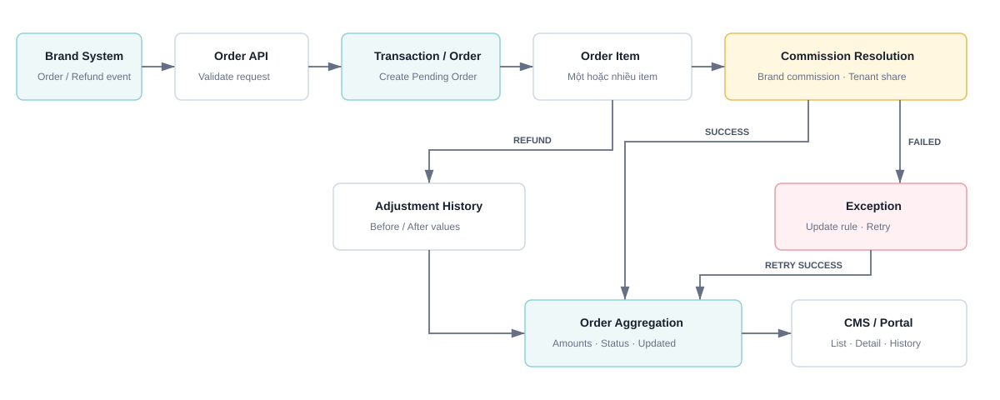

Một Transaction/Order gồm một hoặc nhiều Order Item. Mỗi item được resolve Brand commission, Tenant share độc lập; sau đó hệ thống tổng hợp số tiền và trạng thái lên cấp Order.

| Level | Main processing |
|---|---|
| Item | Trước khi tạo Transaction: resolve Brand commission/Tenant share độc lập cho từng item. Sau khi Transaction được tạo: quản lý `Pending`, `Confirmed`, `Refunded`. |
| Order | Tổng hợp Order amount, các giá trị dự tính/thực nhận và xác định `Pending`, `Confirmed`, `Cancelled`. |

## 2. End-to-end Order Flow

Diagram dưới đây mô tả luồng từ khi End User click từ landing page sang Brand, Brand ghi nhận đơn hàng thành công và gửi order success về Affiliate Platform, đến khi hệ thống ghi nhận transaction và tính phần commission chia cho Tenant.

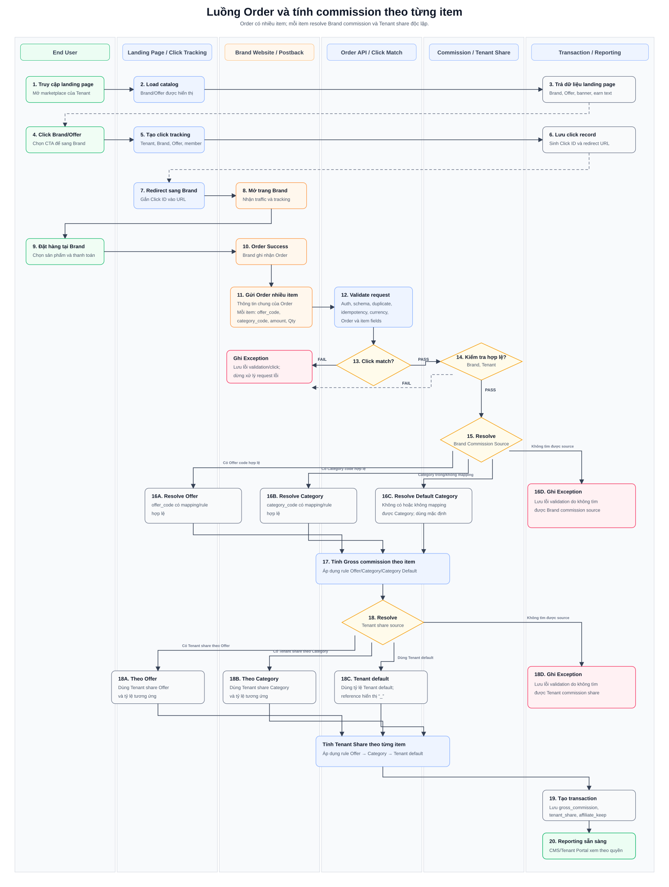

Các điểm chính trong luồng:

| Step group | Description |
|---|---|
| Steps 1–8 — Click tracking | End User mở landing page và click Brand/Offer. Platform tạo Click ID, lưu click record, gắn Click ID vào URL và redirect End User sang website Brand. |
| Steps 9–11 — Brand order success | End User hoàn tất mua hàng tại Brand. Brand gửi Order Success gồm thông tin chung của Order và danh sách một hoặc nhiều item; mỗi item gửi `offer_code`, `category_code`, `amount` và `Qty` tương ứng. |
| Step 12 — Validate request | Platform kiểm tra authentication, schema, duplicate request, idempotency, currency và các trường dữ liệu của Order/item. Request không hợp lệ được ghi nhận vào Exception và dừng xử lý. |
| Step 13 — Click match | Platform đối chiếu Click ID với click record. Nếu không match, hệ thống ghi Exception và không tạo Transaction; nếu match, hệ thống tiếp tục kiểm tra điều kiện hợp lệ. |
| Step 14 — Eligibility validation | Platform kiểm tra Brand và Tenant. Nếu không hợp lệ, hệ thống ghi Exception và không tạo Transaction. |
| Steps 15–16 — Resolve Brand commission source | Hệ thống resolve độc lập cho từng item: dùng Offer khi `offer_code` có mapping/rule hợp lệ; dùng Category khi `category_code` có mapping/rule hợp lệ; dùng Category mặc định khi item không có `category_code` hoặc Category gửi về không mapping được. |
| Step 17 — Calculate Gross commission | Với item resolve thành công, hệ thống áp dụng rule Offer, Category hoặc Category Default để tính Gross commission của chính item đó. |
| Step 18 — Resolve Tenant share source | Với từng item đã tính được Gross commission, hệ thống resolve Tenant share source theo thứ tự ưu tiên `Offer → Category → Brand Default`. Brand Default là rule mặc định của tổ hợp Tenant + Brand. Nếu có item không tìm được Tenant share source, hệ thống đánh dấu item lỗi trong một Exception cấp Order và chưa tạo Transaction. |
| Calculate Tenant Share per item | Hệ thống áp dụng rule tương ứng với Tenant share source đã resolve để tính Tenant Share độc lập cho từng item. |
| Step 19 — Create Transaction | Sau khi resolve và tính commission thành công, Platform tạo Transaction; lưu `gross_commission`, `tenant_share` và `affiliate_keep`. |
| Step 20 — Reporting ready | Transaction sẵn sàng để Admin xem trên CMS và Tenant xem trên Tenant Portal theo quyền được cấp. |

## 3. Function Diagram

| Function group | Main functions | Use cases |
|---|---|---|
| Order Success Integration | Nhận Order Success gồm thông tin chung của Order và danh sách một hoặc nhiều item; mỗi item có `offer_code`, `category_code`, `amount` và `Qty`. Validate authentication, schema, duplicate request, idempotency, currency và dữ liệu bắt buộc. | ORD-001, ORD-002 |
| Click Match & Eligibility Validation | Đối chiếu Click ID; xác định Tenant/Brand context và kiểm tra Brand, Tenant đang Active. Chỉ tiếp tục xử lý khi request hợp lệ và Click ID match. | ORD-004 |
| Brand Commission Resolution | Resolve Brand commission source độc lập cho từng item theo Offer, Category hoặc Category Default; tính Gross commission của item theo rule tìm được. | COM-001 |
| Tenant Share Resolution | Resolve Tenant share source độc lập cho từng item theo thứ tự `Offer → Category → Brand Default`; tính Tenant share của item theo tỷ lệ tương ứng. | COM-002 |
| Transaction Recording & Reporting | Sau khi các nguồn và giá trị commission được resolve thành công, tạo Transaction và lưu `gross_commission`, `tenant_share`, `affiliate_keep`; cung cấp dữ liệu cho CMS và Tenant Portal theo quyền. | ORD-004, TXN-001, TXN-002, TXN-004, TXN-005 |
| Cancel/Refund & Order Lifecycle | Nhận sự kiện hoàn/hủy theo item; cập nhật Refunded amount, Final amount, Gross commission, Tenant share và Item Status; sau đó tổng hợp lại Order Status và các giá trị cấp Order. | ORD-003, ORD-005 |
| Exception Management | Ghi nhận lỗi request, Click Match, eligibility hoặc lỗi không tìm được Brand commission source/Tenant share source. Luồng lỗi dừng trước bước tạo Transaction và hỗ trợ Admin bổ sung mapping/rule để xử lý lại. | EXC-001, EXC-002 |
| Admin Transaction Management | Xem danh sách, xem chi tiết Order và từng item, theo dõi commission resolution, trạng thái, refund/adjustment history và export dữ liệu theo quyền. | TXN-001, TXN-002, TXN-003 |
| Tenant Transaction View | Tenant xem danh sách và chi tiết các Transaction thuộc Tenant, gồm thông tin Order, item, Tenant share và trạng thái tương ứng theo quyền. | TXN-004, TXN-005 |

## 4. Use Case List

| Use case ID | Use case name | Actor | Priority |
|---|---|---|---|
| ORD-001 | Brand gửi Order Success gồm nhiều item | Brand System, Platform | Must |
| ORD-002 | Validate và deduplicate Order Success | Platform | Must |
| ORD-004 | Match Click ID và xác định Tenant/Brand | Platform | Must |
| COM-001 | Resolve Brand commission source và tính Gross commission theo từng item | Platform | Must |
| COM-002 | Resolve Tenant Share source và tính Tenant Share theo từng item | Platform | Must |
| ORD-006 | Tạo Transaction và khởi tạo trạng thái | Platform | Must |
| ORD-003 | Brand gửi cancel/refund toàn bộ theo từng Order Item | Brand System, Platform | Must |
| ORD-005 | Cập nhật Item Status và tổng hợp Order Status | Platform | Must |
| EXC-001 | Ghi nhận Exception | Platform | Must |
| EXC-002 | Admin xem và xử lý Exception | Admin/Ops | Must |
| TXN-001 | Admin xem danh sách Transaction | Admin/Ops, Finance | Must |
| TXN-002 | Admin xem chi tiết Transaction và Order Item | Admin/Ops, Finance | Must |
| TXN-003 | Admin export danh sách Transaction | Admin/Ops, Finance | Should |
| TXN-004 | Tenant xem danh sách Transaction | Tenant Admin, Tenant Finance, Tenant Viewer | Must |
| TXN-005 | Tenant xem chi tiết Transaction và Order Item | Tenant Admin, Tenant Finance | Must |

# IV. Description of Functions

## 1. ORD-001/002 - Brand gửi Order Success gồm nhiều item, validate và deduplicate

### a. Introduction

Sau khi End User mua hàng thành công, Brand gửi Order Success real-time gồm thông tin chung của Order và danh sách một hoặc nhiều item. Platform kiểm tra authentication, schema, dữ liệu bắt buộc và duplicate/idempotency.

UC này chưa Match Click ID, resolve commission hoặc tạo Transaction. Request hợp lệ được chuyển sang `ORD-004 - Match Click ID và xác định Tenant/Brand`.

### b. Actors/Objects

| Actor/Object | Role |
|---|---|
| Brand System | Gửi Order Success gồm thông tin Order và danh sách item. |
| Order API | Nhận request; kiểm tra authentication, schema và dữ liệu bắt buộc. |
| Idempotency Service | Kiểm tra `request_id` và `brand_order_id` để ngăn xử lý trùng. |
| Exception Service | Lưu lỗi authentication/schema/dữ liệu đầu vào và dừng request không hợp lệ. |

### c. Pre-conditions

- Brand đã được onboard và có integration contract active.
- Brand có credential và phương thức authentication theo integration contract.
- Payload tuân thủ API contract và chứa ít nhất một item.

### d. Expected Result

- Request hợp lệ và không trùng được chuyển sang UC `ORD-004` để Match Click ID.
- Mỗi item giữ riêng `offer_code`, `category_code`, `amount` và `Qty` làm dữ liệu đầu vào cho bước resolve commission.
- Request duplicate trả kết quả idempotent và không được xử lý lại.
- Request không hợp lệ bị reject hoặc ghi Exception theo loại lỗi và không được chuyển sang `ORD-004`.
- Không tạo cashback transaction hoặc point posting trong MVP1.

### e. Logic Diagram

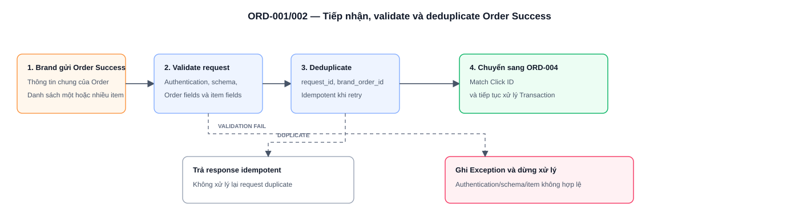

### f. API Payload Description - Order Success

**Order-level fields**

| # | Field | R/O | Data type | Description / Validation / Error handling |
|---:|---|---|---|---|
| 1 | request_id | R | String | ID duy nhất cho request từ Brand. Dùng idempotency. Nếu trùng request đã xử lý, trả response idempotent, không tạo mới transaction. |
| 2 | brand_id/code | R | String | Định danh Brand. Phải match credential đang gọi API. Nếu không match, reject auth/permission. |
| 3 | click_id | R | String | Click ID do Platform sinh. Tại UC này chỉ kiểm tra bắt buộc và định dạng; việc đối chiếu Click ID được thực hiện trong `ORD-004`. |
| 4 | brand_order_id | R | String | Mã đơn hàng phía Brand. Unique theo Brand. Nếu trùng với order đã tồn tại, xử lý duplicate/idempotent. |
| 5 | order_success_at | R | Datetime | Thời điểm Brand ghi nhận order success. Không được là ngày không hợp lệ. |
| 6 | currency | R | String | Đơn vị tiền của Order và các item. MVP1 sử dụng `VND`; currency không hỗ trợ bị reject hoặc ghi Exception. |
| 7 | items | R | Array | Danh sách item của Order. Bắt buộc có ít nhất một phần tử; mỗi phần tử tuân thủ bảng item-level fields. |
| 8 | metadata | O | JSON | Dữ liệu bổ sung phục vụ trace/đối soát; không chứa dữ liệu nhạy cảm không cần thiết. |

**Item-level fields**

| # | Field | R/O | Data type | Description / Validation / Error handling |
|---:|---|---|---|---|
| 1 | item_code | R | String | Mã sản phẩm/item phía Brand; dùng nhận diện item trong Order và các event refund/cancel sau này. |
| 2 | item_name | R | String | Tên sản phẩm/item hiển thị trong chi tiết giao dịch. |
| 3 | sku | O | String | SKU phía Brand; hiển thị dưới tên sản phẩm khi Brand có gửi. |
| 4 | Qty | R | Integer | Số lượng mua. Phải là số nguyên lớn hơn `0`. |
| 5 | amount | R | Decimal | Original amount của item trước refund/cancel. Phải lớn hơn hoặc bằng `0`; dùng làm cơ sở tính commission của item. |
| 6 | offer_code | O | String | Brand Offer ID/Code của item; được lưu làm dữ liệu đầu vào để `COM-001` resolve Brand commission source. |
| 7 | category_code | O | String | Brand Category ID/Code của item; được lưu làm dữ liệu đầu vào để `COM-001` resolve Brand commission source. |

### g. Logic Description

| # | Step | Actor/Object | Logic |
|---:|---|---|---|
| 1 | Receive Order Success | Order API | Nhận thông tin chung của Order và danh sách một hoặc nhiều item từ Brand. |
| 2 | Authentication validation | Order API | Kiểm tra credential, signature hoặc token theo integration contract. Sai authentication thì reject request. |
| 3 | Schema validation | Order API | Kiểm tra required fields, data type, datetime, currency và `items` có ít nhất một phần tử. |
| 4 | Item validation | Order API | Kiểm tra `item_code`, `item_name`, `Qty`, `amount`; tiếp nhận `offer_code` và `category_code` theo từng item. `item_code` phải duy nhất trong phạm vi `brand_order_id`. |
| 5 | Duplicate/idempotency check | Idempotency Service | Kiểm tra `request_id` và `brand_order_id` trong phạm vi Brand. Retry cùng request trả kết quả idempotent, không xử lý lại. |
| 6 | Handoff | Order API | Chuyển request hợp lệ, không trùng sang `ORD-004` để Match Click ID. |
| 7 | Exception handling | Exception Service | Lưu loại lỗi, request data và validation result đối với request không hợp lệ; không tạo Transaction trong UC này. |

### h. Business Rules

| BR ID | Rule |
|---|---|
| BR-ORD-001-01 | Brand order success API phải validate auth trước khi xử lý payload. |
| BR-ORD-001-02 | `request_id` phải idempotent; retry cùng request không tạo duplicate transaction. |
| BR-ORD-001-03 | `brand_order_id` phải duy nhất trong phạm vi Brand; cùng `brand_order_id` không được sinh nhiều Transaction. |
| BR-ORD-001-04 | Payload bắt buộc có ít nhất một item; mỗi item phải có `item_code`, `item_name`, `Qty` và `amount` hợp lệ. |
| BR-ORD-001-05 | `offer_code` và `category_code` là dữ liệu theo từng item, không phải dữ liệu chung của toàn Order. Việc resolve source/rule thuộc `COM-001`. |
| BR-ORD-001-06 | `click_id` là trường bắt buộc; UC này chỉ kiểm tra sự hiện diện và định dạng, còn việc Match Click ID thuộc `ORD-004`. |
| BR-ORD-001-07 | Request chỉ được chuyển sang `ORD-004` sau khi vượt qua authentication, schema, item validation và duplicate/idempotency check. |
| BR-ORD-001-08 | UC `ORD-001/002` không Match Click ID, không resolve commission và không tạo Transaction. |
| BR-ORD-001-09 | MVP1 không tạo cashback transaction, không tính điểm và không gọi Tenant Loyalty API. |
| BR-ORD-001-10 | `item_code` phải duy nhất trong phạm vi `brand_order_id` và phải được giữ nguyên để đối chiếu đúng item khi Brand gửi cancel/refund event. |
| BR-ORD-001-11 | `item_status` không thuộc payload Order Success; Platform là nguồn quản lý Item Status. |

### i. Acceptance Criteria

| AC ID | Criteria |
|---|---|
| AC-ORD-001-01 | Payload hợp lệ có một hoặc nhiều item được validate thành công và chuyển sang `ORD-004`; UC này chưa tạo Transaction. |
| AC-ORD-001-02 | Mỗi item giữ đúng `offer_code`, `category_code`, `amount` và `Qty` do Brand gửi để phục vụ các bước xử lý tiếp theo. |
| AC-ORD-001-03 | Retry cùng `request_id` trả kết quả idempotent và không tạo bản xử lý trùng. |
| AC-ORD-001-04 | `brand_order_id` trùng trong cùng Brand không tạo thêm Transaction. |
| AC-ORD-001-05 | Payload sai authentication/schema hoặc không có item bị reject hoặc ghi Exception đúng loại. |
| AC-ORD-001-06 | Item thiếu trường bắt buộc làm request không được chuyển sang `ORD-004`. |
| AC-ORD-001-07 | Chỉ request vượt qua authentication, schema, item validation và duplicate/idempotency check mới được chuyển sang `ORD-004`. |
| AC-ORD-001-08 | Hai item có cùng `item_code` trong một `brand_order_id` không được chấp nhận là hai item hợp lệ độc lập. |
| AC-ORD-001-09 | Payload Order Success không yêu cầu Brand gửi `item_status`; giá trị trạng thái từ Brand, nếu có, không được dùng để ghi đè trạng thái do Platform quản lý. |
| AC-ORD-001-10 | `item_code` của từng item được giữ nguyên và có thể dùng để match đúng item trong cancel/refund event của cùng `brand_order_id`. |
| AC-ORD-001-11 | UC này không thực hiện Click Match, eligibility validation, resolve commission hoặc tạo Transaction. |

## 2. ORD-004 - Match Click ID và xác định Tenant/Brand

### a. Introduction

Sau khi Order Success vượt qua `ORD-001/002`, Platform đối chiếu `click_id` với click record để xác định Tenant và kiểm tra Brand context. UC này chỉ thực hiện attribution/eligibility; chưa resolve commission và chưa tạo Transaction.

Offer được ghi nhận tại click chỉ phục vụ tracking. Commission của item phải dựa trên `offer_code`/`category_code` thực tế do Brand gửi trong Order Success.

### b. Actors/Objects

| Actor/Object | Role |
|---|---|
| Click Matching Service | Tìm click record và đối chiếu `click_id`. |
| Eligibility Service | Kiểm tra Brand/Tenant đúng context và đang Active. |
| Exception Service | Ghi lỗi Click Match hoặc eligibility. |

### c. Pre-conditions

- Request đã vượt qua `ORD-001/002`.
- `click_id` có trong payload và đúng định dạng.
- Click record đã được Platform ghi nhận.

### d. Expected Result

- Xác định được `tenant_id` và Brand context từ click record.
- Request hợp lệ được chuyển sang `COM-001`.
- Click không tồn tại/không match hoặc Brand/Tenant không Active được ghi Exception và dừng xử lý.
- Không tạo Transaction trong UC này.

### e. Logic Diagram

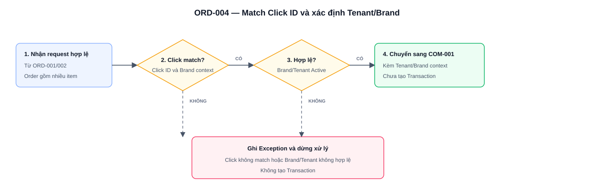

### f. Logic Description

| # | Step | Logic |
|---:|---|---|
| 1 | Nhận request | Nhận Order/items hợp lệ từ `ORD-001/002`. |
| 2 | Match Click | Tìm click record theo `click_id`; kiểm tra Brand của request khớp Brand context của click. |
| 3 | Xác định Tenant | Lấy `tenant_id` từ click record; không lấy Tenant do Brand tự truyền. |
| 4 | Eligibility | Kiểm tra Brand và Tenant tồn tại, đúng context và đang Active. |
| 5 | Chuyển xử lý | Gửi Order/items cùng Tenant/Brand context sang `COM-001`. |
| 6 | Exception | Ghi lỗi và dừng nếu Click Match/eligibility không đạt. |

### g. Business Rules

| BR ID | Rule |
|---|---|
| BR-ORD-004-01 | `tenant_id` phải lấy từ click record; Brand không được ghi đè. |
| BR-ORD-004-02 | `brand_id/code` trong Order Success phải khớp Brand context của click. |
| BR-ORD-004-03 | Brand và Tenant phải Active tại thời điểm xử lý. |
| BR-ORD-004-04 | Offer trong click record không tự động trở thành Brand commission source của item. |
| BR-ORD-004-05 | Click/eligibility fail phải ghi Exception và không chuyển sang tính commission. |
| BR-ORD-004-06 | UC này không tạo Transaction. |

### h. Acceptance Criteria

| AC ID | Criteria |
|---|---|
| AC-ORD-004-01 | Click hợp lệ xác định đúng Tenant và Brand. |
| AC-ORD-004-02 | Click không tồn tại/không match tạo Exception và dừng xử lý. |
| AC-ORD-004-03 | Brand/Tenant không Active tạo Exception và dừng xử lý. |
| AC-ORD-004-04 | Offer đã click không được dùng thay cho `offer_code/category_code` thực tế của item. |
| AC-ORD-004-05 | Không có Transaction được tạo tại UC này. |

## 3. COM-001/002 - Resolve và tính commission/Tenant Share theo từng item

### a. Introduction

Platform xử lý độc lập từng Order Item. `COM-001` resolve Brand commission source và tính Gross commission; `COM-002` resolve Tenant Share source và tính Tenant Share từ Gross commission của chính item đó.

Không sử dụng một commission rule chung cho toàn Order.

### b. Actors/Objects

| Actor/Object | Role |
|---|---|
| Commission Service | Resolve Brand commission source/value/reference và tính Gross commission. |
| Offer Mapping | Map `brand_offer_code` với Offer của Platform. |
| Category Mapping | Map `brand_category_code` với Affiliate Category. |
| Tenant Share Service | Resolve Tenant Share source/value/reference và tính Tenant Share. |
| Exception Service | Ghi một Exception cho toàn Order khi có ít nhất một item không tìm được source/rule bắt buộc; lưu danh sách item lỗi và bước lỗi. |

### c. Pre-conditions

- Order đã Match Click và xác định Tenant/Brand tại `ORD-004`.
- Mỗi item có `item_code`, Qty, Original amount và dữ liệu Offer/Category nếu Brand có gửi.
- Commission/Tenant Share configuration cần dùng đang Active và còn hiệu lực tại `order_success_at`.

### d. Expected Result

- Mỗi item có Brand commission source/value/reference và Gross commission dự kiến.
- Mỗi item có Tenant Share source/value/reference và Tenant Share dự kiến.
- Kết quả của item không phụ thuộc commission source của item khác.
- Tất cả item resolve thành công được chuyển sang `ORD-006`.
- Nếu có ít nhất một item không tìm được Category Default/rule tại bước `4B` hoặc Tenant Share source/rule tại bước `6`, hệ thống ghi một Exception cho toàn Order, lưu danh sách item lỗi và chưa tạo Transaction.

### e. Logic Diagram

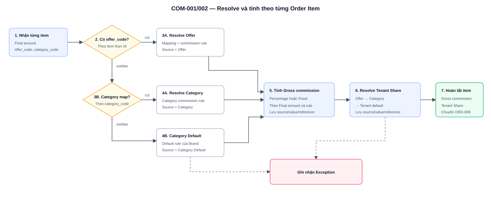

### f. Calculation Logic

**Brand commission source**

| Priority | Condition | Result |
|---:|---|---|
| 1 | Item có `offer_code` và tìm được Offer mapping/rule Active, còn hiệu lực | Source = `Offer`; áp dụng Offer commission. |
| 2 | Item không có `offer_code`/Có Offer code nhưng Offer mapping/rule không hợp lệ, có `category_code` mapping được và có Category rule hợp lệ | Source = `Category`; áp dụng Category commission. |
| 3 | Item không có `offer_code`; `category_code` trống/không mapping được | Source = `Category Default`; áp dụng Category Default rule của Brand. |
| 4 | Nhánh Category Default không tìm được rule hợp lệ | Đánh dấu item lỗi `brand_commission_source_missing` trong Exception của Order. |

**Tenant Share source**

| Priority | Condition | Result |
|---:|---|---|
| 1 | Có Tenant Share rule theo Offer của item | Source = `Offer`. |
| 2 | Không có Offer rule nhưng có Tenant Share rule theo Category đã resolve | Source = `Category`. |
| 3 | Không có Offer/Category rule nhưng có Brand Default của tổ hợp Tenant + Brand | Source = `Brand Default`; Tenant share reference hiển thị `-`. |
| 4 | Không tìm được Tenant Share source/rule bắt buộc | Đánh dấu item lỗi `tenant_share_source_missing` trong Exception của Order. |

**Công thức**

| Information | Formula |
|---|---|
| Percentage Gross commission | `Final amount × Brand Commission Value (%)`. |
| Fixed Gross commission | Brand Commission Value cố định áp dụng cho item theo rule snapshot. |
| Tenant Share | `Gross commission × Tenant Share Value (%)`. |

### g. Logic Description

| # | Step | Logic |
|---:|---|---|
| 1 | Duyệt item | Xử lý từng item độc lập. |
| 2 | Resolve Brand source | Offer → Category → Category Default theo điều kiện trên. |
| 3 | Tính Gross commission | Tính trên Final amount của item và lưu source/value/reference snapshot. |
| 4 | Resolve Tenant Share | Offer → Category → Brand Default. |
| 5 | Tính Tenant Share | Tính từ Gross commission  của item và lưu source/value/reference snapshot. |
| 6 | Hoàn tất | Chuyển toàn bộ kết quả sang `ORD-006` khi tất cả item hợp lệ. |
| 7 | Ghi nhận Exception | Sau khi duyệt toàn bộ item, nếu có ít nhất một item lỗi tại bước `4B` hoặc bước `6`, tạo một Exception cho toàn Order, lưu tất cả item lỗi và dừng trước khi tạo Transaction. |

### h. Business Rules

| BR ID | Rule |
|---|---|
| BR-COM-001-01 | Commission phải được resolve và tính độc lập theo từng item. |
| BR-COM-001-02 | Offer đã click không quyết định commission; chỉ `offer_code` thực tế của item được dùng để resolve Offer. |
| BR-COM-001-03 | Item có `offer_code` được resolve theo Offer mapping/rule đã cấu hình tại bước `3A`; bước `3A` không tạo nhánh Exception riêng trong flow này. |
| BR-COM-001-04 | Không có `offer_code`/Có Offer code nhưng Offer mapping/rule không hợp lệ mới resolve theo `category_code`; category trống/không mapping được thì dùng Category Default. |
| BR-COM-001-05 | Ở nhánh Brand commission, chỉ bước `4B` dẫn đến Exception khi không tồn tại Category Default/rule hợp lệ. |
| BR-COM-001-06 | Tenant Share resolve theo thứ tự Offer → Category → Brand Default; Brand Default là tỷ lệ mặc định theo tổ hợp Tenant + Brand. |
| BR-COM-001-06A | Bước `6` dẫn về cùng khối Exception khi không tìm được Tenant Share source/rule bắt buộc. |
| BR-COM-001-07 | Tenant Share không được vượt Gross commission; Tenant Share Value phải lớn hơn `0` và không vượt `100%`. |
| BR-COM-001-08 | Source/value/reference và version rule phải được snapshot để tính lại khi cancel/refund. |
| BR-COM-001-09 | Chỉ sử dụng configuration Active và còn hiệu lực tại `order_success_at`. |
| BR-COM-001-10 | Gross commission/Tenant Share tại Order Success là số dự kiến; số thực nhận chỉ phát sinh khi item được chốt `Confirmed`. |
| BR-COM-001-11 | Mỗi item được resolve độc lập nhưng Transaction chỉ được tạo khi toàn bộ item Pass; một hay nhiều item lỗi chỉ tạo một Exception cho toàn Order. |
| BR-COM-001-12 | Kết quả resolve tạm của item Pass có thể lưu trong Exception context để trace nhưng chưa được ghi thành Order Item của Transaction. |

### i. Acceptance Criteria

| AC ID | Criteria |
|---|---|
| AC-COM-001-01 | Hai item có Offer/Category khác nhau được resolve và tính bằng rule riêng. |
| AC-COM-001-02 | Item có Offer mapping/rule hợp lệ dùng Brand commission source `Offer`. |
| AC-COM-001-03 | Item không có Offer dùng Category mapping; category trống/không mapping dùng Category Default. |
| AC-COM-001-04 | Thiếu Category mapping không tạo Exception nếu Category Default hợp lệ. |
| AC-COM-001-05 | Tenant Share được resolve đúng thứ tự Offer → Category → Brand Default. |
| AC-COM-001-06 | Brand Default hiển thị Tenant share reference là `-` khi cấu hình mặc định không có reference riêng trên UI. |
| AC-COM-001-07 | Gross commission và Tenant Share được tính đúng theo Final amount/source của từng item. |
| AC-COM-001-08 | Có ít nhất một item không có Category Default/rule tại bước `4B` hoặc Tenant Share source/rule tại bước `6` thì ghi một Exception cho toàn Order, lưu item lỗi và không chuyển sang `ORD-006`. |
| AC-COM-001-09 | Bước `3A - Resolve Offer` không hiển thị hoặc tạo nhánh Exception riêng. |
| AC-COM-001-10 | Nhiều item lỗi trong cùng Order Success chỉ tạo một Exception cho Order và mỗi item lỗi lưu đúng exception type/bước lỗi. |
| AC-COM-001-11 | Retry chỉ chuyển sang `ORD-006` khi toàn bộ item đã resolve thành công. |

## 4. ORD-006 - Tạo Transaction và khởi tạo trạng thái

### a. Introduction

Sau khi Match Click và toàn bộ item hoàn tất `COM-001/002`, Platform tạo một Transaction cho Order với trạng thái `Pending`. Transaction gồm Order header và danh sách một hoặc nhiều Order Item; không tạo một Transaction riêng cho từng item.

### b. Actors/Objects

| Actor/Object | Role |
|---|---|
| Transaction Service | Tạo Order header và toàn bộ Order Item. |
| Database | Lưu Transaction atomically. |
| Reporting Service | Cung cấp Transaction cho CMS/Tenant Portal sau khi tạo thành công. |
| Exception Service | Ghi lỗi persistence và ngăn dữ liệu dở dang. |

### c. Pre-conditions

- `ORD-004` đã xác định Tenant/Brand.
- Tất cả item đã Pass `COM-001/002`, có đầy đủ Brand commission source/value/reference, Gross commission, Tenant Share source/value/reference và Tenant Share.
- Chưa tồn tại Transaction cho cùng `Brand + brand_order_id`.

### d. Expected Result

- Tạo duy nhất một `order_id`.
- Lưu Order header và toàn bộ Order Item trong cùng transaction database.
- Order mới có `Order Status = Pending`; tất cả item mới có `Item Status = Pending`.
- Số dự kiến được tổng hợp từ các item đã lưu.
- Dữ liệu sẵn sàng hiển thị trên CMS/Tenant Portal theo quyền.

### e. Logic Diagram

### g. Logic Description

| # | Step | Logic |
|---:|---|---|
| 1 | Validate result | Kiểm tra toàn bộ item có kết quả tính hợp lệ. |
| 2 | Generate Order ID | Sinh `order_id` duy nhất. |
| 3 | Persist | Lưu Order header, Order Item và rule snapshot atomically. |
| 4 | Initialize status | Order = `Pending`; item = `Pending`. |
| 5 | Aggregate | Tổng hợp Final amount, Gross commission dự kiến và Tenant Share dự kiến từ item. |
| 6 | Publish | Cho phép CMS/Tenant Portal truy vấn sau commit thành công. |

### h. Business Rules

| BR ID | Rule |
|---|---|
| BR-ORD-006-01 | Một `Brand + brand_order_id` chỉ có một Transaction. |
| BR-ORD-006-02 | Một Order nhiều item tạo một Transaction với nhiều Order Item. |
| BR-ORD-006-03 | Lưu Order và toàn bộ item phải atomic; lỗi một item phải rollback toàn bộ. |
| BR-ORD-006-04 | Order/Item Status do Platform khởi tạo và quản lý; Brand không được truyền trạng thái qua Order Success. |
| BR-ORD-006-05 | Số dự kiến cấp Order bằng tổng số dự kiến hiện tại của các item. |
| BR-ORD-006-06 | Transaction chỉ hiển thị sau khi commit thành công. |
| BR-ORD-006-07 | Không tạo Transaction một phần hoặc Transaction chứa item chưa resolve; nếu bất kỳ item nào chưa Pass thì lưu Order processing context trong Exception và chưa sinh `order_id`. |

### i. Acceptance Criteria

| AC ID | Criteria |
|---|---|
| AC-ORD-006-01 | Order có nhiều item chỉ tạo một Transaction và lưu đủ item. |
| AC-ORD-006-02 | Transaction mới có Order Status `Pending`; item mới có Item Status `Pending`. |
| AC-ORD-006-03 | Source/value/reference của từng item được lưu đúng kết quả `COM-001/002`. |
| AC-ORD-006-04 | Lỗi persistence rollback toàn bộ, không để Transaction dở dang. |
| AC-ORD-006-05 | Retry không tạo Transaction thứ hai cho cùng Brand Order. |
| AC-ORD-006-06 | `ORD-006` không được gọi khi còn item thiếu Brand commission hoặc Tenant Share. |

## 5. ORD-003/005 - Cancel/refund toàn bộ theo Order Item và tổng hợp trạng thái

### a. Introduction

Brand gửi cancel/refund event khi toàn bộ Order hoặc một hay nhiều item bị hoàn/hủy. Mỗi item trong event được hoàn/hủy **toàn bộ**.

“Hoàn một phần Order” nghĩa là hoàn một hoặc một số item; các item còn lại giữ nguyên.

### b. Actors/Objects

| Actor/Object | Role |
|---|---|
| Brand System | Gửi event và danh sách `item_code` bị hoàn/hủy toàn bộ. |
| Order API | Validate authentication, schema và idempotency. |
| Transaction Service | Match Order/item; cập nhật dữ liệu và tổng hợp Order Status. |
| Adjustment History Service | Lưu dữ liệu trước/sau. |
| Exception Service | Ghi event không hợp lệ hoặc không match. |

### c. Pre-conditions

- Transaction và item đã tồn tại.
- Event có `request_id`, `brand_id/code`, `brand_order_id`, `event_type`, `event_at` và ít nhất một `item_code`.
- Item thuộc đúng Order và chưa `Refunded`.

### d. Expected Result

- Item trong event: Qty = `0`, Final amount = `0`, Gross commission = `0`, Tenant Share = `0`, Item Status = `Refunded`.
- Item không nằm trong event giữ nguyên.
- Adjustment History lưu event và dữ liệu trước/sau.
- Order Status được tổng hợp:
  - Tất cả item `Refunded` → `Cancelled`.
  - Có item `Pending` → `Pending`.
  - Chỉ còn `Confirmed`/`Refunded` và có ít nhất một `Confirmed` → `Confirmed`.

### e. Logic Diagram

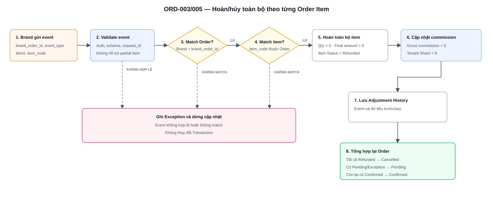

### f. API Payload Description - Cancel/Refund

**Event-level fields**

| Field | R/O | Description / Validation |
|---|---|---|
| request_id | R | Idempotency key của event. |
| brand_id/code | R | Phải match credential và Brand của Transaction. |
| brand_order_id | R | Dùng cùng Brand để match Order. |
| order_id | O | Nếu truyền phải đồng thời match Brand Order. |
| event_type | R | `ORDER_CANCELLED`, `ITEM_CANCELLED`, `ITEM_REFUNDED`. |
| event_at | R | Thời điểm hoàn/hủy. |
| items | R | Danh sách `item_code` bị hoàn/hủy toàn bộ. |
| reason | O | Lý do cấp event. |

**Item-level fields**

| Field | R/O | Description / Validation |
|---|---|---|
| item_code | R | Phải match đúng item thuộc `brand_order_id`; đại diện hoàn/hủy toàn bộ item. |
| reason | O | Lý do riêng của item. |

### g. Business Rules

| BR ID | Rule |
|---|---|
| BR-ORD-003-01 | Event phải idempotent theo `request_id`. |
| BR-ORD-003-02 | Match Order bằng `Brand + brand_order_id`; match item bằng `item_code`. |
| BR-ORD-003-03 | Không hỗ trợ hoàn một phần item. |
| BR-ORD-003-04 | Không sửa Original Qty/Original amount. |
| BR-ORD-003-05 | Item đã `Refunded` không được hoàn/hủy lại bằng request mới. |
| BR-ORD-003-06 | Cancel/Refund API chỉ xử lý Order `Pending`. Nếu Order đã `Confirmed`, hệ thống từ chối event, không thay đổi Order/Item/Commission/Tenant Share đã chốt và ghi Exception để Admin xử lý đối soát thủ công. |
| BR-ORD-003-07 | Event nhiều item được áp dụng atomically. |
| BR-ORD-003-08 | Order Status phải được tổng hợp từ toàn bộ Item Status theo rule tại Expected Result. |
| BR-ORD-003-09 | Cancel/Refund event không match Order/item chỉ được ghi vào Exception; Transaction đã tồn tại và toàn bộ Order Status, Item Status, Qty, Final amount, Gross commission, Tenant Share phải giữ nguyên cho đến khi Retry thành công. |

### h. Acceptance Criteria

| AC ID | Criteria |
|---|---|
| AC-ORD-003-01 | Event hợp lệ cập nhật toàn bộ item được liệt kê thành `Refunded`. |
| AC-ORD-003-02 | Các item không nằm trong event không thay đổi. |
| AC-ORD-003-03 | Retry cùng request không cập nhật lặp. |
| AC-ORD-003-04 | Payload yêu cầu partial item bị từ chối. |
| AC-ORD-003-05 | Không match Order/item tạo Exception cho Cancel/Refund event; Transaction vẫn hiển thị tại màn Transaction và không thay đổi Order Status, Item Status hoặc giá trị tài chính trước khi Retry thành công. |
| AC-ORD-003-06 | Order Status được tổng hợp đúng từ các Item Status sau khi xử lý event hợp lệ cho Order `Pending`. |
| AC-ORD-003-07 | Event Cancel/Refund cho Order `Confirmed` bị từ chối, dữ liệu đã chốt giữ nguyên và hệ thống ghi Exception để Admin xử lý đối soát thủ công. |

## 6. EXC-001/002 - Ghi nhận, xem và xử lý Exception

### a. Introduction

Platform ghi nhận Exception khi request hoặc event không thể tiếp tục xử lý tự động. Exception được phân loại theo nhóm để Admin/Ops xem đúng dữ liệu kiểm tra và nguyên nhân lỗi:

- `Request & Authentication`: lỗi xác thực hoặc dữ liệu Order Success không hợp lệ.
- `Click & Eligibility`: không match được Click hoặc Brand/Tenant không đủ điều kiện.
- `Brand Commission` và `Tenant Share`: một hoặc nhiều item không resolve được nguồn/rule tương ứng.
- `Transaction Persistence`: không thể lưu Transaction theo cơ chế atomic.
- `Cancel/Refund`: event không hợp lệ, không match Order/item, item không đủ điều kiện hoặc sai thứ tự thời gian.

Với Order Success, Platform chỉ tạo Transaction khi toàn bộ request và item đều Pass. Với Cancel/Refund, Transaction đã tồn tại vẫn được giữ trên màn Transaction và event lỗi được ghi riêng vào Exception. Admin/Ops có thể xem chi tiết theo từng nhóm và Retry sau khi nguyên nhân đã được xử lý.

### b. Actors/Objects

| Actor/Object | Role |
|---|---|
| Brand System | Gửi Order Success hoặc Cancel/Refund event đến Platform. |
| Order API/Platform Backend | Validate request, Click, điều kiện Brand/Tenant, commission, Tenant Share và kết quả lưu Transaction; chuyển lỗi sang Exception Service. |
| Exception Service | Tạo Exception, phân nhóm, lưu request/event context, Order/item liên quan, nguyên nhân, mức độ, trạng thái và số lần Retry. |
| Transaction Service | Tạo Transaction khi Order Success Pass; giữ và chỉ cập nhật Transaction hiện tại khi Cancel/Refund event được xử lý thành công. |
| Admin/Ops | Xem danh sách, mở màn chi tiết theo Exception Group, bổ sung mapping/rule hoặc dữ liệu cần thiết và thực hiện Retry theo quyền. |

### c. Expected Result

- Mỗi lỗi được ghi nhận với Exception ID, Exception Group, Exception Type, mức độ, trạng thái, request/event context, Order/item liên quan và số lần Retry.
- Màn View hiển thị dữ liệu và kết quả kiểm tra phù hợp với từng Exception Group; Brand Commission và Tenant Share dùng chung cấu trúc chi tiết theo item.
- Order Success có một hoặc nhiều item lỗi chỉ tạo một Exception cho toàn Order, lưu danh sách item lỗi và chưa tạo Transaction.
- Transaction persistence thất bại phải rollback toàn bộ; không để lại Order header, item hoặc commission snapshot dở dang.
- Cancel/Refund event lỗi không được áp dụng một phần; Transaction hiện tại chỉ thay đổi sau khi toàn bộ event được xử lý thành công.
- Exception có trạng thái khác `Resolved` cho phép Admin/Ops Retry. Với Order Success hoặc persistence, Retry thành công tạo Transaction; với Cancel/Refund, Retry thành công cập nhật Transaction hiện có. Chỉ sau khi Transaction được tạo/cập nhật thành công, hệ thống mới chuyển Exception sang `Resolved`.
- Admin/Ops được lọc danh sách, xem chi tiết và Retry theo đúng quyền được cấp.

### d. Exception Types

| STT | Giai đoạn | Exception type | Trường hợp phát sinh | Exception Group | Mức độ | Cách xử lý |
|---:|---|---|---|---|---|---|
| 1 | Authentication | `auth_fail` | Credential, token hoặc signature không hợp lệ/hết hạn; `brand_id/code` không khớp credential; Brand không có quyền gọi API. | Request & Authentication | High | Reject request, ghi Exception, không tạo Transaction. |
| 2 | Validate Order Success | `schema_fail` | Thiếu/sai `request_id`, `brand_id/code`, `click_id`, `brand_order_id`, `order_success_at`, `currency` hoặc `items`. | Request & Authentication | Medium | Dừng request, không Click Match, không tạo Transaction. |
| 3 | Validate currency | `schema_fail` | Currency không được hỗ trợ; MVP1 chỉ chấp nhận `VND`. | Request & Authentication | Medium | Reject hoặc ghi Exception, không tạo Transaction. |
| 4 | Validate items | `schema_fail` | `items` rỗng, không phải array hoặc không có item hợp lệ. | Request & Authentication | Medium | Dừng toàn bộ Order Success, không tạo Transaction. |
| 5 | Validate item | `schema_fail` | Item thiếu `item_code`, `item_name`, `Qty`, `amount`; Qty ≤ 0; amount < 0; sai kiểu dữ liệu. | Request & Authentication | Medium | Dừng toàn bộ Order Success và ghi item/trường bị lỗi. |
| 6 | Validate item | `schema_fail` | Nhiều item trùng `item_code` trong cùng `brand_order_id`. | Request & Authentication | Medium | Không chấp nhận các item trùng, không tạo Transaction. |
| 8 | Click Match | `click_id_invalid` | Thiếu Click ID, sai định dạng, không tồn tại hoặc không tìm thấy Click record. | Click & Eligibility | Medium | Ghi Exception, dừng trước bước resolve commission. |
| 9 | Click Match | `click_id_invalid` | Click ID tồn tại nhưng không khớp Brand hoặc không xác định đúng Tenant của Order. | Click & Eligibility | Medium | Ghi Exception, không tạo hoặc không tiếp tục xử lý Transaction. |
| 10 | Eligibility | `eligibility_fail` | Không tìm thấy Brand/Tenant; Brand hoặc Tenant `Inactive`; context Brand/Tenant không hợp lệ. | Click & Eligibility | Medium | Ghi Exception, không chuyển sang resolve commission. |
| 11 | Brand commission | `brand_commission_source_missing` | Sau khi resolve độc lập từng item, có ít nhất một item không resolve được Offer, Category và cũng không có Category Default commission hợp lệ, Active và còn hiệu lực. | Brand Commission | High | Ghi một Exception cho toàn Order, lưu danh sách item lỗi và Brand commission source/value/reference chưa xác định; chưa tạo Transaction. Admin bổ sung mapping/rule rồi Retry toàn Order. |
| 14 | Tenant Share | `tenant_share_source_missing` | Có ít nhất một item đã tính được Gross commission nhưng không tìm thấy Tenant Share rule hợp lệ theo `Offer → Category → Brand Default`. | Tenant Share | High | Ghi một Exception cho toàn Order, lưu danh sách item lỗi; không tự động coi Tenant Share bằng `0` và chưa tạo Transaction. Admin bổ sung rule rồi Retry toàn Order. |
| 17 | Transaction persistence | `persistence_fail` | Sau khi toàn bộ item Pass, hệ thống vẫn không thể lưu đầy đủ Order header, Order Item, rule snapshot, Gross commission hoặc Tenant Share. | Transaction Persistence | High | Rollback toàn bộ dữ liệu đang tạo; không để lại Transaction dở dang. Hệ thống auto-retry, nếu vẫn thất bại thì ghi Exception kỹ thuật để Admin/Ops xử lý. |
| 18 | Cancel/Refund | `cancel_refund_order_unmatched` | Khi nhận Cancel/Refund, Platform không tìm thấy Order theo tổ hợp `brand_id + brand_order_id`; hoặc Brand gửi thêm Platform `order_id` nhưng `order_id` này không thuộc cùng Order được xác định bởi `brand_id + brand_order_id`. | Cancel/Refund | Medium | Ghi một Exception cho toàn bộ event. Transaction đang tồn tại không bị xóa/chuyển sang Exception; Order Status, Item Status và các giá trị tài chính giữ nguyên. |
| 19 | Cancel/Refund | `cancel_refund_item_unmatched` | Platform đã tìm thấy Order nhưng `item_code` trong event không tồn tại hoặc thuộc Order khác. | Cancel/Refund | Medium | Ghi Exception gắn với Order và item không match; không áp dụng Cancel/Refund. Transaction, Order Status, Item Status và các giá trị tài chính giữ nguyên. |
| 20 | Cancel/Refund | `cancel_refund_item_unmatched` | Event có nhiều item nhưng ít nhất một item không thuộc Order. | Cancel/Refund | Medium | Ghi một Exception cho event, kèm danh sách item lỗi; không xử lý một phần và rollback toàn bộ event theo cơ chế atomic. Transaction hiện tại giữ nguyên. |
| 21 | Cancel/Refund validation | `cancel_refund_validation_fail` | Thiếu/sai `request_id`, `brand_id/code`, `brand_order_id`, `event_type`, `event_at`, `items` hoặc `item_code`. | Cancel/Refund | Medium | Reject event, ghi Exception, không cập nhật Transaction. |
| 23 | Cancel/Refund validation | `cancel_refund_validation_fail` | Item đã `Refunded` nhưng Brand gửi request mới để hoàn/hủy lại. | Cancel/Refund | Low | Không ghi giảm Qty, amount hoặc commission lần hai. |
| 24 | Event ordering | `event_out_of_order` | Refund đến trước Order Success; `event_at` sớm hơn Order Success; event cũ đến sau event mới. | Cancel/Refund | High | Ghi Exception. |
| 25 | Retry Exception | Giữ nguyên Exception type cũ | Admin Retry nhưng nguyên nhân chưa được xử lý, ví dụ mapping/rule vẫn thiếu. | Theo Exception Group hiện tại | Theo mức độ hiện tại | Giữ Exception hiện tại, tăng `Retry`, lưu lịch sử lần Retry. |
| 26 | Retry Exception | Exception type mới hoặc failure history | Retry vượt qua lỗi cũ nhưng phát sinh lỗi khác ở bước tiếp theo. | Theo Exception Group của lỗi mới | Theo mức độ lỗi mới | Lưu nguyên nhân mới có liên kết với Exception ban đầu, không tạo Transaction trùng. |

### e. Screen Description - Admin Exception

Mockup HTML:

- [cms-exception-list.html](../mockups/cms-exception-list.html)
- [cms-exception-view.html](../mockups/cms-exception-view.html)

#### Screen 1 — Admin Exception List

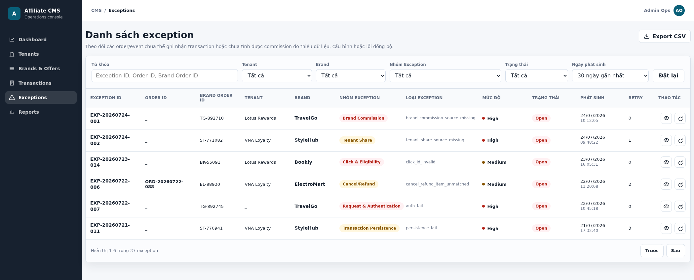

| # | Item | Control/Data type | Data source | Description / Validation / Error handling |
|---:|---|---|---|---|
| 1 | Từ khóa | Textbox/String | Giá trị Admin nhập; truy vấn Exception Service | Tìm gần đúng theo `exception_id`, Platform `order_id` hoặc `brand_order_id`. Khoảng trắng đầu/cuối được loại bỏ; để trống nghĩa là không lọc theo từ khóa. |
| 2 | Tenant | Dropdown/ID | Tenant Master Data; `tenant_id` lưu trong Exception context | Lọc theo Tenant đã xác định từ Click record hoặc Transaction. Exception phát sinh trước khi xác định Tenant hiển thị `_` và không thuộc một Tenant cụ thể. |
| 3 | Brand | Dropdown/ID | Brand Master Data; `brand_id/code` từ request/event context | Lọc Exception theo Brand gửi request/event. Tên hiển thị lấy từ Brand Master Data. |
| 4 | Nhóm Exception | Dropdown/Enum | `exception_group` do Exception Service phân loại | Gồm `Request & Authentication`, `Click & Eligibility`, `Brand Commission`, `Tenant Share`, `Cancel/Refund`, `Transaction Persistence`. |
| 5 | Trạng thái | Dropdown/Enum | `exception_status` | Lọc `Open`, `Resolved`. |
| 6 | Ngày phát sinh | Dropdown/Date range | `exception.created_at` | Lọc theo thời điểm Exception được tạo; các lựa chọn mockup gồm 7 ngày, 30 ngày hoặc tháng hiện tại. |
| 7 | Đặt lại | Button/Action | Bộ lọc hiện tại | Xóa toàn bộ điều kiện và tải lại danh sách theo giá trị mặc định. |
| 8 | Exception ID | Table column/String | `exception_id` do Exception Service sinh | Mã duy nhất dùng mở màn View và truy vết lịch sử Retry. |
| 9 | Order ID | Table column/String | `order_id` của Transaction | Có giá trị khi Transaction đã tồn tại, điển hình Cancel/Refund. Order Success/persistence chưa commit thành công hiển thị `_`. |
| 10 | Brand Order ID | Table column/String | `brand_order_id` do Brand gửi | Mã Order tại Brand, match Order và tra cứu Exception. |
| 11 | Tenant | Table column/String | Tenant từ Click record hoặc Transaction; tên từ Tenant Master Data | Hiển thị `_` nếu lỗi xảy ra trước khi Platform xác định được Tenant. |
| 12 | Brand | Table column/String | Brand request/event context; tên từ Brand Master Data | Brand phát sinh request hoặc event lỗi. |
| 13 | Nhóm Exception | Table column/Enum | `exception_group` | Nhóm nghiệp vụ quyết định layout màn View và dữ liệu kiểm tra cần hiển thị. |
| 14 | Loại Exception | Table column/String | `exception_type` | Mã lỗi kỹ thuật/nghiệp vụ như `auth_fail`, `click_id_invalid`, `brand_commission_source_missing`. tham khảo các mã lỗi đã liệt kê từ mục `d. Exception Types`|
| 15 | Mức độ | Table column/Enum | Severity mapping theo bảng Exception Types | Hiển thị `High`, `Medium`, `Low`; không cho Admin sửa trực tiếp trên danh sách. tham khảo các mức độ tương ứng cho từng mã lỗi đã liệt kê từ mục `d. Exception Types` |
| 16 | Trạng thái | Table column/Enum | `exception_status` | `Open`: Exception chưa được Retry thành công; `Resolved`: Retry đã hoàn tất và Transaction đã được tạo/cập nhật thành công. |
| 17 | Phát sinh | Table column/Datetime | `exception.created_at` | Hiển thị `dd/mm/yyyy hh:mm:ss` theo timezone hệ thống. |
| 18 | Retry | Table column/Integer | `retry_count` | Số lần Retry đã thực hiện; mỗi lần Retry thất bại tăng thêm `1`. |
| 19 | View | Icon/Action | `exception_id`, `exception_group` | Mở đúng màn chi tiết của Exception được chọn. Yêu cầu quyền `exception.view`. |
| 20 | Retry | Icon/Action | Exception Service và quyền `exception.manage` | Chỉ hiển thị/enable khi trạng thái khác `Resolved`. Retry thành công tạo/cập nhật Transaction rồi chuyển Exception sang `Resolved`; thất bại giữ trạng thái và tăng Retry count. |
| 21 | Pagination | Pagination | `page`, `page_size`, `total_records` từ Exception query | Chuyển trang nhưng giữ nguyên bộ lọc; nút không hợp lệ ở trang đầu/cuối phải disable. |
| 22 | Export CSV | Button/Action | Exception query theo bộ lọc hiện tại và quyền `exception.export` | Xuất toàn bộ bản ghi thỏa bộ lọc, không chỉ trang đang xem. File không chứa credential, secret hoặc raw payload; lỗi tạo file phải thông báo và không trả file thiếu dữ liệu. Template file sau khi export: `cms-exception-export.xlsx` |

#### Screen 2 — View với nhóm Exception = Request & Authentication

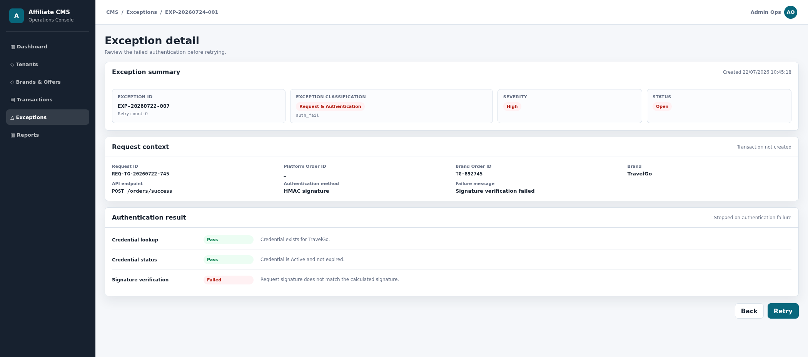

| # | Item | Data source | Description / Validation / Error handling |
|---:|---|---|---|
| 1 | Exception ID | Exception Service | Mã duy nhất của Exception được chọn. |
| 2 | Retry count | Exception Service | Số lần Retry đã thực hiện; mockup hiển thị dưới Exception ID. |
| 3 | Exception classification | Exception Service | Hiển thị Group exception `Request & Authentication` và Type exception tương ứng `auth_fail`. |
| 4 | Severity | Exception Types configuration | Mức độ tương ứng với `auth_fail`. |
| 5 | Status | Exception Service | Chỉ hiển thị `Open` hoặc `Resolved`. |
| 6 | Created | Exception Service | `created_at` của Exception, định dạng `dd/mm/yyyy hh:mm:ss`. |
| 7 | Request ID | Request context | `request_id` do Brand gửi, dùng cho idempotency và truy vết. |
| 8 | Platform Order ID | Transaction Service | Hiển thị `_` vì lỗi xảy ra trước khi tạo Transaction. |
| 9 | Brand Order ID | Payload snapshot an toàn | `brand_order_id` nếu hệ thống đọc được; không dùng để xác nhận payload hợp lệ. |
| 10 | Brand | Credential/request context | Brand liên quan đến credential gọi API; không hiển thị secret. |
| 11 | API endpoint | API Gateway log | Endpoint nhận request, ví dụ `POST /orders/success`. |
| 12 | Authentication method | Brand integration configuration | Phương thức xác thực đã cấu hình, ví dụ HMAC signature. |
| 13 | Failure message | Authentication Service | Nguyên nhân lỗi đã chuẩn hóa; không chứa token, signature hoặc secret gốc. |
| 14 | Credential lookup | Authentication Service + Brand integration credential | Platform lấy credential identifier/API key từ request header để tìm cấu hình tích hợp tương ứng. `Pass` khi credential tồn tại và xác định được đúng Brand sở hữu. `Failed` khi credential không tồn tại, không nhận diện được Brand hoặc `brand_id/code` trong request không khớp Brand của credential; hệ thống ghi `auth_fail`, dừng xử lý và không tạo Transaction. Đây là bước xác thực đầu tiên nên không sử dụng trạng thái `Not executed` trên màn này. Không hiển thị credential/secret gốc trên UI. |
| 15 | Credential status | Brand integration credential | Kiểm tra trạng thái và thời hạn sử dụng của credential sau khi lookup thành công. `Pass` khi credential đang `Active`, chưa hết hạn và Brand có quyền gọi endpoint hiện tại. `Failed` khi credential Inactive, hết hạn, bị thu hồi hoặc không có quyền gọi API; hệ thống ghi `auth_fail`, không tiếp tục kiểm tra payload và không tạo Transaction. Hiển thị `Not executed` khi `Credential lookup` Failed nên Platform chưa có credential hợp lệ để kiểm tra trạng thái/quyền. |
| 16 | Signature verification | Authentication Service + request metadata | Platform dùng authentication method đã cấu hình, request timestamp/nonce và nội dung request theo signing contract để tính lại chữ ký, sau đó so sánh với signature trong request header. `Pass` khi hai chữ ký khớp và request nằm trong thời gian cho phép. `Failed` khi chữ ký sai, thiếu, timestamp quá hạn hoặc request có dấu hiệu bị thay đổi/replay; hệ thống ghi `auth_fail`, dừng request và không tạo Transaction. Hiển thị `Not executed` khi `Credential lookup` hoặc `Credential status` không Pass, vì Platform chưa có credential hợp lệ/được phép để xác minh chữ ký. UI chỉ hiển thị kết quả/thông báo đã chuẩn hóa, không hiển thị signature hoặc secret. |
| 17 | Back | Action | Quay về Admin Exception List. |
| 18 | Retry | Action | Chỉ hiển thị khi Status = `Open`; Retry lại request theo context đã lưu, thất bại thì tăng Retry count. |

#### Screen 3 — View với nhóm Exception = Click & Eligibility

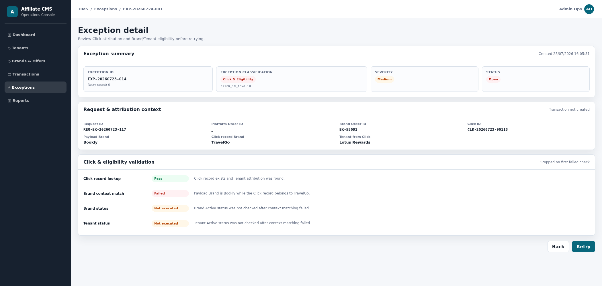

| # | Item | Data source | Description / Validation / Error handling |
|---:|---|---|---|
| 1 | Exception ID | Exception Service | Mã duy nhất của Exception được chọn. |
| 2 | Retry count | Exception Service | Số lần Retry đã thực hiện. |
| 3 | Exception classification | Exception Service | Hiển thị Group `Click & Eligibility` và Type `click_id_invalid` hoặc `eligibility_fail`. |
| 4 | Severity | Exception Types configuration | Mức độ của Exception Type; mockup là `Medium`. |
| 5 | Status | Exception Service | `Open` hoặc `Resolved`. |
| 6 | Created | Exception Service | Thời điểm Exception phát sinh. |
| 7 | Request ID | Order Success processing context | `request_id` của Order Success đã vượt qua authentication/schema validation và dẫn đến Exception. Dùng truy vết request và bảo đảm Retry idempotent. |
| 8 | Platform Order ID | Transaction Service | Luôn hiển thị `_` tại nhóm này vì Click/Eligibility chưa Pass nên Platform chưa tạo Transaction và chưa có `order_id`. |
| 9 | Brand Order ID | Order Success payload | `brand_order_id` do Brand gửi; dùng cùng Brand để deduplicate và truy vết Order, nhưng chưa phải Platform Order ID. |
| 10 | Click ID | Order Success payload | `click_id` do Brand gửi lại từ lượt click trước đó. Platform dùng giá trị này để tìm Click record và xác định Brand/Tenant attribution. |
| 11 | Payload Brand | Order Success payload + authenticated Brand context | Brand trong payload sau khi đối chiếu với credential ở bước authentication. Đây là Brand đang khai báo Order. |
| 12 | Click record Brand | Click Tracking Service | Brand được Platform lưu khi End User click ra website Brand. Giá trị này phải khớp Payload Brand; không được sửa theo request Order Success. Nếu không tìm thấy Click record thì hiển thị `_`. |
| 13 | Tenant from Click | Click Tracking Service | Tenant sở hữu landing page/lượt click và được lưu trong Click record. Đây là nguồn xác định Tenant của Order; Platform không nhận Tenant tùy ý từ payload Brand. Nếu Click không tồn tại hoặc không xác định được Tenant thì hiển thị `_`. |
| 14 | Click record lookup | Click Tracking Service | Platform kiểm tra Click ID có đúng định dạng, tồn tại và truy vấn được Click record. `Pass` khi tìm thấy đúng một Click record có dữ liệu Brand/Tenant attribution. `Failed` khi Click ID thiếu/sai định dạng, không tồn tại hoặc record thiếu Brand/Tenant cần thiết; ghi `click_id_invalid`, dừng trước commission resolution và không tạo Transaction. Đây là bước đầu tiên của Screen 3 nên không dùng `Not executed`. |
| 15 | Brand context match | Order Success payload + Click record | So sánh `Payload Brand` với `Click record Brand`. `Pass` khi cùng một `brand_id`. `Failed` khi khác Brand hoặc Brand context không xác định được; ghi `click_id_invalid`/`eligibility_fail`, không cho Order của Brand này sử dụng Click thuộc Brand khác. Hiển thị `Not executed` khi `Click record lookup` Failed nên chưa có Click record để đối chiếu. |
| 16 | Brand status | Brand Master Data | Sau khi Brand context match, Platform kiểm tra Brand tồn tại và Status = `Active`. `Pass` khi Brand Active. `Failed` khi Brand không tồn tại hoặc Inactive; ghi `eligibility_fail`, không chuyển sang resolve commission. Hiển thị `Not executed` khi Click lookup hoặc Brand context match chưa Pass. |
| 17 | Tenant status | Tenant Master Data | Platform kiểm tra Tenant lấy từ Click record tồn tại và Status = `Active`. `Pass` khi Tenant Active. `Failed` khi không tìm thấy Tenant, Tenant Inactive hoặc context Tenant không hợp lệ; ghi `eligibility_fail`, không resolve commission và không tạo Transaction. Hiển thị `Not executed` khi Click lookup, Brand context match hoặc Brand status chưa Pass. |
| 18 | Back | Action | Quay về Admin Exception List; không thay đổi trạng thái Exception và không tự động Retry. |
| 19 | Retry | Action | Chỉ hiển thị khi Status = `Open` và user có quyền `exception.manage`. Hệ thống chạy lại theo thứ tự `Click record lookup → Brand context match → Brand status → Tenant status`; bước trước Failed thì bước sau `Not executed`. Chỉ khi tất cả Pass mới chuyển sang commission resolution. Retry thất bại tăng Retry count; chưa chuyển Exception sang `Resolved`. |

#### Screen 4 — View với nhóm Exception = Brand Commission

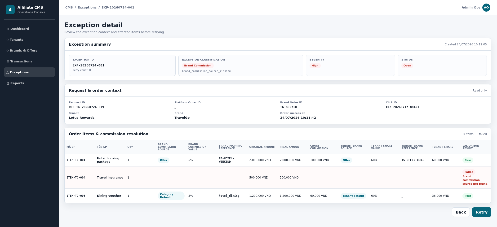

| # | Item | Data source | Description / Validation / Error handling |
|---:|---|---|---|
| 1 | Exception ID | Exception Service | Mã Exception được chọn. |
| 2 | Retry count | Exception Service | Số lần Retry đã thực hiện. |
| 3 | Exception classification | Exception Service | Group `Brand Commission`, Type `brand_commission_source_missing`. |
| 4 | Severity | Exception Types configuration | Mức độ của lỗi; mockup là `High`. |
| 5 | Status | Exception Service | `Open` hoặc `Resolved`. |
| 6 | Created | Exception Service | Thời điểm Exception được tạo. |
| 7 | Request ID | Order Success processing context | `request_id` của Order Success tạo ra Exception; dùng cho idempotency và Retry toàn Order. |
| 8 | Platform Order ID | Transaction Service | Hiển thị `_` vì ít nhất một item chưa resolve được Brand Commission nên Transaction chưa được tạo. |
| 9 | Brand Order ID | Order Success payload | `brand_order_id` do Brand gửi; dùng cùng Brand để deduplicate và truy vết, không phải Platform Order ID. |
| 10 | Click ID | Order Success payload | Click ID đã Pass Click Match và eligibility trước khi COM-001 bắt đầu. |
| 11 | Tenant | Click record/Tenant Master Data | Tenant được xác định từ Click record; tên hiển thị lấy từ Tenant Master Data. |
| 12 | Brand | Request context/Brand Master Data | Brand đã khớp authenticated Brand và Click record Brand. |
| 13 | Order success at | Order Success payload | Thời điểm Brand ghi nhận Order Success; dùng xác định rule commission Active/còn hiệu lực tại thời điểm Order. |
| 14 | Mã SP | `items[].item_code` | Mã item duy nhất trong Brand Order. |
| 15 | Tên SP | `items[].item_name` | Tên item do Brand gửi. |
| 16 | Qty | `items[].Qty` | Số lượng item do Brand gửi. |
| 17 | Brand commission source | COM-001 result | Resolve độc lập theo từng item. `Offer`: item có `offer_code` và mapping/rule Offer hợp lệ. `Category`: item không có Offer mà `category_code` map được và có commission rule hợp lệ hoặc Item có Offer code nhưng Offer mapping/rule không hợp lệ, sau đó fallback và resolve được Category mapping/rule.. `Category Default`: không có Offer và Category không map được/không được gửi, Platform dùng Category Default commission của Brand. Hiển thị `_` khi không tìm được source hợp lệ; item Failed và toàn Order vào Exception. |
| 18 | Brand Commission Value | Brand commission rule | Giá trị Percentage hoặc Fixed amount của rule được resolve tại `order_success_at`. Rule phải Active, còn hiệu lực và value hợp lệ. Hiển thị `_` khi source/rule thiếu; không tự mặc định commission bằng `0`. |
| 19 | Brand mapping reference | Offer/Category mapping | Reference dùng truy vết mapping/rule đã áp dụng, hiển thị mã của platform, ví dụ Brand Offer mapping hoặc Brand Category mapping. `Category Default` hiển thị reference mặc định theo cấu hình hiện có; `_` khi resolve Failed. |
| 20 | Original amount | `items[].amount` | Giá trị item tại Order Success. |
| 21 | Final amount | Order item processing context | Tại Order Success bằng Original amount vì chưa phát sinh Cancel/Refund; là số tiền dùng tính Gross commission. |
| 22 | Gross commission | COM-001 result | Percentage: `Final amount × Brand Commission Value`; Fixed amount: áp dụng fixed value theo rule đã cấu hình. Hiển thị `_` khi COM-001 Failed. |
| 23 | Tenant share source | COM-002 result | Chỉ chạy sau khi item tính được Gross commission. Resolve theo `Offer → Category → Brand Default`. Hiển thị `_`/Not executed trên item lỗi Brand Commission. |
| 24 | Tenant Share Value | Tenant Share rule | Tỷ lệ chia sẻ của rule COM-002; hiển thị `_` khi COM-002 chưa được thực hiện. |
| 25 | Tenant share reference | Tenant Share configuration | Reference rule Offer/Category; Brand Default hiển thị `_` nếu cấu hình mặc định không có reference riêng trên UI. |
| 26 | Tenant Share | COM-002 result | `Gross commission × Tenant Share Value`; hiển thị `_` nếu Brand Commission Failed hoặc chưa resolve Tenant Share. |
| 27 | Validation result | Item resolution result | `Pass` khi item có đầy đủ Brand source/value/reference, Gross commission và Tenant Share. `Failed` hiển thị nguyên nhân cụ thể như `Brand commission source not found`. Một item Failed giữ toàn Order trong Exception và chưa tạo Transaction. |
| 28 | Back | Action | Quay về Admin Exception List. |
| 29 | Retry | Action | Chỉ hiển thị khi Status = `Open`. Sau khi Admin bổ sung mapping/rule, hệ thống resolve lại toàn bộ item; tất cả Pass mới tạo một Transaction và chuyển Exception sang `Resolved`. Nếu vẫn còn item Failed, không tạo Transaction và tăng Retry count. |

#### Screen 5 — View với nhóm Exception = Tenant Share

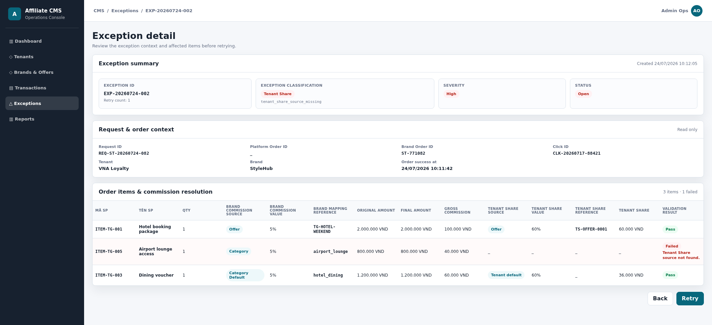

| # | Item | Data source | Description / Validation / Error handling |
|---:|---|---|---|
| 1 | Exception ID | Exception Service | Mã Exception được chọn. |
| 2 | Retry count | Exception Service | Số lần Retry đã thực hiện. |
| 3 | Exception classification | Exception Service | Group `Tenant Share`, Type `tenant_share_source_missing`. |
| 4 | Severity | Exception Types configuration | Mức độ của lỗi; `tenant_share_source_missing` là `High`. |
| 5 | Status | Exception Service | `Open` hoặc `Resolved`. |
| 6 | Created | Exception Service | Thời điểm Exception được tạo. |
| 7 | Request ID | Order Success processing context | `request_id` của Order Success; dùng Retry idempotent cho toàn Order. |
| 8 | Platform Order ID | Transaction Service | `_` vì ít nhất một item chưa resolve được Tenant Share nên chưa tạo Transaction. |
| 9 | Brand Order ID | Order Success payload | Mã Order do Brand gửi. |
| 10 | Click ID | Order Success payload | Click ID đã Pass Click Match và xác định Tenant/Brand trước COM-002. |
| 11 | Tenant | Click record/Tenant Master Data | Tenant lấy từ Click record; là đối tượng nhận Tenant Share. |
| 12 | Brand | Request context/Brand Master Data | Brand phát sinh Order và đã Pass eligibility. |
| 13 | Order success at | Order Success payload | Thời điểm dùng kiểm tra hiệu lực của Brand Commission và Tenant Share rule. |
| 14 | Mã SP | `items[].item_code` | Mã item trong Brand Order. |
| 15 | Tên SP | `items[].item_name` | Tên item do Brand gửi. |
| 16 | Qty | `items[].Qty` | Số lượng item. |
| 17 | Brand commission source | COM-001 result | Source `Offer`, `Category` hoặc `Category Default` đã resolve thành công. Nếu Failed thì item thuộc Brand Commission Exception, không phải Tenant Share Exception. |
| 18 | Brand Commission Value | Brand commission rule | Percentage/fixed value đã dùng tính Gross commission; là snapshot tại Order Success. |
| 19 | Brand mapping reference | Offer/Category mapping | Mapping/rule reference đã sử dụng để Admin truy vết nguồn Gross commission. |
| 20 | Original amount | `items[].amount` | Giá trị item ban đầu. |
| 21 | Final amount | Order item processing context | Tại Order Success bằng Original amount; là số tiền dùng tính Gross commission. |
| 22 | Gross commission | COM-001 result | Giá trị Brand dự kiến chia cho Platform đã tính thành công; là cơ sở tính Tenant Share. |
| 23 | Tenant share source | COM-002 result | Resolve độc lập từng item theo thứ tự `Offer → Category → Brand Default`. Chỉ chuyển xuống nguồn tiếp theo khi không có rule ở cấp ưu tiên trước. Hiển thị `_` khi không tìm được bất kỳ rule hợp lệ nào; item Failed. |
| 24 | Tenant Share Value | Tenant Share rule | Tỷ lệ rule được chọn tại `order_success_at`; phải > `0`, ≤ `100%` và Tenant Share không vượt Gross commission. Hiển thị `_` khi không tìm được source/rule. |
| 25 | Tenant share reference | Tenant Share configuration | ID/reference của rule Offer hoặc Category đã áp dụng, hiển thị mã của Platform; Brand Default hiển thị `_` nếu cấu hình mặc định không có mã reference trên UI. |
| 26 | Tenant Share | COM-002 result | Công thức: `Gross commission × Tenant Share Value`. Hiển thị `_` khi Tenant Share source/rule Failed; không tự gán bằng `0`. |
| 27 | Validation result | Item resolution result | `Pass` khi Tenant Share source/value/reference cần thiết và Tenant Share hợp lệ. `Failed` khi không tìm thấy rule, value không hợp lệ hoặc Tenant Share vượt Gross commission; UI hiển thị nguyên nhân, ví dụ `Tenant Share source not found`. Một item Failed giữ toàn Order trong Exception. |
| 28 | Back | Action | Quay về Admin Exception List. |
| 29 | Retry | Action | Chỉ hiển thị khi Status = `Open`. Sau khi bổ sung Tenant Share rule, hệ thống resolve lại toàn bộ item theo đúng priority. Tất cả Pass mới tạo Transaction và chuyển `Resolved`; thất bại giữ `Open` và tăng Retry count. |

#### Screen 6 — View với nhóm Exception = Cancel/Refund

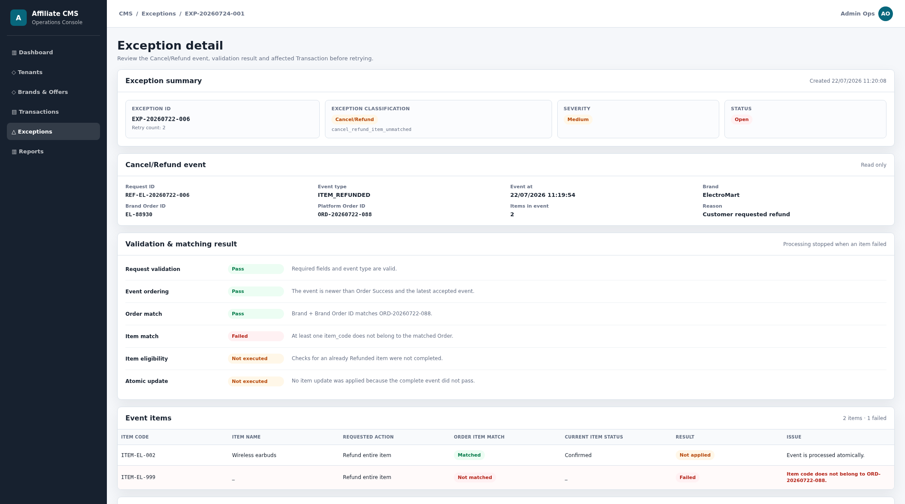

| # | Item | Data source | Description / Validation / Error handling |
|---:|---|---|---|
| 1 | Exception ID | Exception Service | Mã Exception được chọn. |
| 2 | Retry count | Exception Service | Số lần Retry event. |
| 3 | Exception classification | Exception Service | Group `Cancel/Refund` và Type cụ thể như `cancel_refund_item_unmatched`. |
| 4 | Severity | Exception Types configuration | Mức độ của Exception Type; mockup là `Medium`. |
| 5 | Status | Exception Service | `Open` hoặc `Resolved`. |
| 6 | Created | Exception Service | Thời điểm ghi nhận Exception. |
| 7 | Request ID | Cancel/Refund event | Idempotency key của event. Retry cùng `request_id` không được hoàn/hủy hoặc ghi adjustment lặp. |
| 8 | Event type | Cancel/Refund event | `ORDER_CANCELLED`, `ITEM_CANCELLED` hoặc `ITEM_REFUNDED`. |
| 9 | Event at | Cancel/Refund event | Thời điểm Brand phát sinh hoàn/hủy. |
| 10 | Brand | Event + Brand Master Data | Brand gửi event. |
| 11 | Brand Order ID | Cancel/Refund event | Dùng tổ hợp `Brand + brand_order_id` để tìm Transaction đã tồn tại. |
| 12 | Platform Order ID | Event/Transaction match | Nếu Brand gửi `order_id`, giá trị phải thuộc đúng Transaction tìm được từ Brand + Brand Order ID; không khớp thì ghi `cancel_refund_order_unmatched`. |
| 13 | Items in event | `items[]` của event | Số item được yêu cầu hoàn/hủy toàn bộ. |
| 14 | Reason | Event payload | Lý do cấp event; có thể rỗng nếu Brand không gửi. |
| 15 | Request validation | Order API | Kiểm tra `request_id`, Brand, Brand Order ID, event type, event_at, items và item_code. `Pass` khi payload đầy đủ/đúng kiểu và event type được hỗ trợ. `Failed` ghi `cancel_refund_validation_fail`, không cập nhật Transaction. Đây là bước đầu tiên nên không dùng `Not executed`. |
| 16 | Event ordering | Event/Adjustment History | `Pass` khi event xảy ra sau Order Success và không cũ hơn event đã xử lý gần nhất. `Failed` khi Refund đến trước Order Success, event_at sớm hơn Order Success hoặc event cũ đến sau event mới; ghi `event_out_of_order`. `Not executed` khi Request validation Failed. |
| 17 | Order match | Transaction Service | `Pass` khi tìm thấy đúng Transaction theo Brand + Brand Order ID và Platform Order ID (nếu gửi) cùng trỏ đến Transaction đó. `Failed` ghi `cancel_refund_order_unmatched`. `Not executed` khi Request validation hoặc Event ordering chưa Pass. |
| 18 | Item match | Transaction Service | Đối chiếu từng item_code với item thuộc Order. `Pass` khi toàn bộ item đều tồn tại trong đúng Order. `Failed` khi ít nhất một item không tồn tại/thuộc Order khác; ghi `cancel_refund_item_unmatched`. `Not executed` khi Order match chưa Pass. |
| 19 | Item eligibility | Transaction Item state | `Pass` khi mọi item chưa Refunded và event yêu cầu hoàn/hủy toàn bộ item. `Failed` khi item đã Refunded hoặc payload yêu cầu hoàn một phần item; ghi `cancel_refund_validation_fail`. `Not executed` khi Item match chưa Pass. |
| 20 | Atomic update | Transaction Service | Chỉ thực hiện khi các bước 15–19 đều Pass. Khi thực hiện thành công: item trong event có Qty/Final amount/Gross commission/Tenant Share = `0`, Status = `Refunded`; lưu Adjustment History và tổng hợp lại Order. Hiển thị `Not executed` nếu bất kỳ bước trước Failed; không áp dụng một phần event. |
| 21 | Item code | Cancel/Refund `items[].item_code` | Mã item Brand yêu cầu hoàn/hủy. |
| 22 | Item name | Transaction Item | Tên item tìm được từ Transaction; `_` nếu không match. |
| 23 | Requested action | Event type | Hành động áp dụng cho item, ví dụ Refund entire item. |
| 24 | Order item match | Transaction Service | `Matched` khi item_code thuộc đúng Order; `Not matched` khi không tìm thấy hoặc thuộc Order khác. |
| 25 | Current Item Status | Transaction Item | Trạng thái item trước event (`Pending`, `Confirmed`, `Refunded`); `_` nếu item không match. |
| 26 | Result | Event processing result | `Failed` cho item gây lỗi; item match được nhưng chưa áp dụng hiển thị `Not applied` vì toàn event xử lý atomic. |
| 27 | Issue | Exception detail | Thông báo cụ thể theo item, ví dụ item không thuộc Order hoặc item đã Refunded. Không hiển thị lỗi chung nếu item Pass. |
| 28 | Transaction | Transaction Service | Platform Order ID của Transaction hiện có. |
| 29 | Tenant | Transaction/Tenant Master Data | Tenant sở hữu Transaction. |
| 30 | Order Status | Transaction Service | Trạng thái Order trước khi Retry event; mockup là `Pending`. Event lỗi không tự chuyển Order sang Exception hoặc trạng thái khác. |
| 31 | Item Status | Transaction Item | Trạng thái item trước khi event được áp dụng; không thay đổi khi Atomic update Not executed. |
| 32 | Final amount | Transaction aggregation | Tổng Final amount hiện tại từ các item; chỉ tính lại sau khi Retry event thành công. |
| 33 | Gross commission | Transaction aggregation | Tổng Gross commission hiện tại; item chỉ được đưa về `0` sau khi event Pass. |
| 34 | Tenant Share | Transaction aggregation | Tổng Tenant Share hiện tại; chỉ tính lại sau khi item được cập nhật Refunded thành công. |
| 35 | Back | Action | Quay về Admin Exception List. |
| 36 | Retry | Action | Chỉ hiển thị khi Status = `Open`. Chạy lại toàn bộ event theo thứ tự bước 15–20. Thành công cập nhật Transaction/Adjustment History rồi chuyển Exception sang `Resolved`; thất bại không áp dụng event, giữ `Open` và tăng Retry count. |

#### Screen 7 — View với nhóm Exception = Transaction Persistence

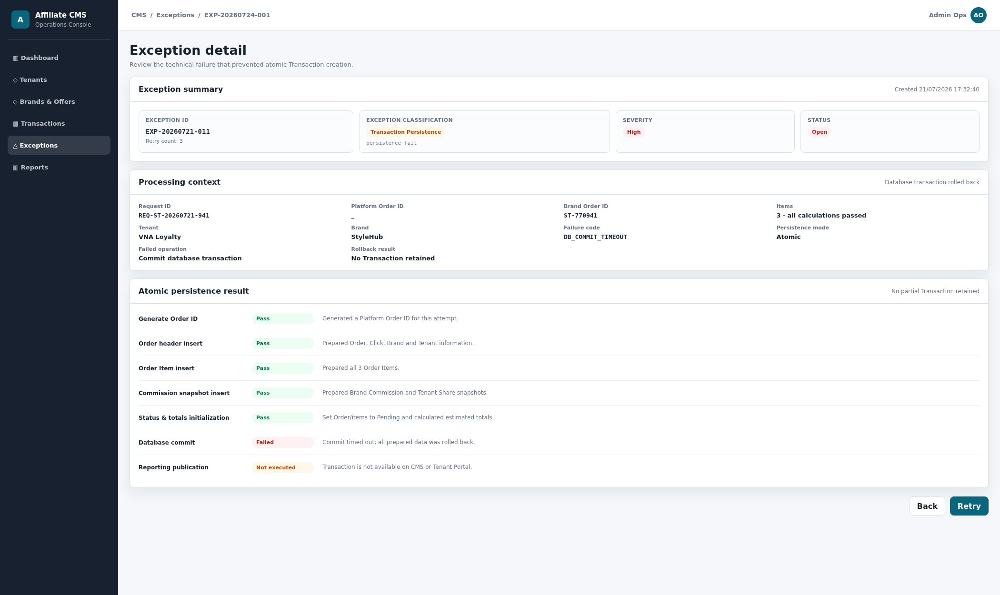

| # | Item | Data source | Description / Validation / Error handling |
|---:|---|---|---|
| 1 | Exception ID | Exception Service | Mã Exception được chọn. |
| 2 | Retry count | Exception Service | Số lần Retry persistence. |
| 3 | Exception classification | Exception Service | Group `Transaction Persistence`, Type `persistence_fail`. |
| 4 | Severity | Exception Types configuration | Mức độ lỗi; mockup là `High`. |
| 5 | Status | Exception Service | `Open` hoặc `Resolved`. |
| 6 | Created | Exception Service | Thời điểm Exception được tạo. |
| 7 | Request ID | Order processing context | `request_id` của Order Success đã Pass request, Click, Brand Commission và Tenant Share; dùng Retry persistence idempotent. |
| 8 | Platform Order ID | Transaction Service | Hiển thị `_` vì database transaction chưa commit hoặc đã rollback. ID sinh trong lần xử lý không được coi là Transaction tồn tại trước khi commit thành công. |
| 9 | Brand Order ID | Order Success payload | Mã Order phía Brand; dùng cùng Brand kiểm tra không tạo Transaction trùng khi Retry. |
| 10 | Items | Order processing context | Tổng số item đã Pass và cần được lưu atomically |
| 11 | Tenant | Click/Eligibility result | Tenant đã được xác định từ Click record và Pass eligibility trước persistence. |
| 12 | Brand | Click/Eligibility result | Brand đã match request/Click và đang Active trước persistence. |
| 13 | Failure code | Persistence/Database log | Mã lỗi đã chuẩn hóa như `DB_COMMIT_TIMEOUT`; dùng vận hành/trace. UI không hiển thị connection string, stack trace chứa secret hoặc thông tin credential. |
| 14 | Persistence mode | Transaction Service | `Atomic`: Order header, toàn bộ items, rule snapshots, commission values, statuses và totals phải cùng commit; một bước lỗi thì rollback toàn bộ. |
| 15 | Failed operation | Persistence result | Tên thao tác thực tế gây lỗi, ví dụ `Commit database transaction`; lấy từ bước persistence Failed gần nhất. |
| 16 | Rollback result | Database result | `No Transaction retained` khi rollback thành công; bảo đảm không có Order header/item/snapshot dở dang trên Transaction List hoặc Tenant Portal. |
| 17 | Generate Order ID | Transaction Service | `Pass` khi sinh được ID duy nhất cho lần xử lý. `Failed` khi không sinh/không bảo đảm uniqueness; các bước sau `Not executed`. ID chỉ có hiệu lực sau commit thành công. |
| 18 | Order header insert | Persistence result | Chuẩn bị request, Click, Brand Order, Tenant và Brand trong database transaction. `Pass` khi ghi tạm thành công; `Failed` thì rollback. `Not executed` khi Generate Order ID Failed. |
| 19 | Order Item insert | Persistence result | Chuẩn bị đầy đủ mọi item, amount và source/reference trong cùng transaction. `Pass` khi đủ số item; `Failed` khi một hay nhiều item không lưu được. `Not executed` khi bước trước Failed; không cho phép Transaction thiếu item. |
| 20 | Commission snapshot insert | Persistence result | Lưu snapshot Brand Commission source/value/reference, Gross commission, Tenant Share source/value/reference và Tenant Share của từng item. `Failed` khi thiếu/không lưu được snapshot; các bước sau `Not executed` và rollback toàn bộ. |
| 21 | Status & totals initialization | Transaction Service | Khởi tạo Order Status và toàn bộ Item Status = `Pending`; tổng hợp Final amount, Gross commission dự tính và Tenant Share dự tính. `Pass` khi giá trị tổng khớp item; `Not executed` nếu insert/snapshot trước đó Failed. |
| 22 | Database commit | Database result | `Pass` khi database xác nhận commit toàn bộ. `Failed` khi timeout/commit error; rollback Order header, items, snapshots, statuses và totals, ghi `persistence_fail`. `Not executed` nếu bước chuẩn bị trước Failed. |
| 23 | Reporting publication | Reporting Service | Chỉ thực hiện sau Database commit Pass. `Pass` khi Transaction có thể truy vấn trên CMS/Tenant Portal. `Not executed` khi commit Failed; không được công bố Transaction chưa commit. |
| 24 | Back | Action | Quay về Admin Exception List. |
| 25 | Retry | Action | Chỉ hiển thị khi Status = `Open`. Retry lại persistence theo `request_id`/Brand Order để không tạo trùng. Commit thành công tạo đúng một Transaction, publish dữ liệu rồi chuyển `Resolved`; thất bại rollback, giữ `Open` và tăng Retry count. |

### f. Business Rules

| BR ID | Rule |
|---|---|
| BR-EXC-001-01 | Exception phải lưu `request_id`, `click_id`, `brand_order_id`, `order_id` nếu đã có và `error_items[]` khi lỗi liên quan đến Order Item. |
| BR-EXC-001-02 | Không lưu credential/secret dạng plain text. |
| BR-EXC-001-03 | Chỉ quyền `exception.manage` được xử lý/retry. |
| BR-EXC-001-04 | Retry phải idempotent và không tạo duplicate Transaction. |
| BR-EXC-001-05 | Exception chỉ được chuyển sang `Resolved` sau khi Retry hoàn tất nghiệp vụ tương ứng và Transaction đã được tạo hoặc cập nhật thành công. Không được đặt `Resolved` chỉ vì nguyên nhân đã được bổ sung nhưng chưa Retry thành công. |
| BR-EXC-001-06 | Cancel/Refund event bị Exception không làm mất hoặc chuyển Transaction hiện tại sang Exception; mọi trạng thái và giá trị của Transaction được giữ nguyên cho đến khi event Retry thành công. |
| BR-EXC-001-07 | Lỗi Brand commission/Tenant Share của một hay nhiều item trong cùng Order Success chỉ tạo một Exception cấp Order; Exception lưu `error_items[]` và chưa tạo Transaction. |
| BR-EXC-001-08 | Retry Order Exception chỉ chuyển sang `ORD-006` khi toàn bộ item Pass; Retry chưa đạt giữ Exception hiện tại và tăng Retry count. |
| BR-EXC-001-09 | Retry thất bại không tạo/cập nhật Transaction, giữ trạng thái Exception hiện tại và tăng Retry count. Retry Order Success/persistence thành công tạo Transaction; Retry Cancel/Refund thành công cập nhật Transaction hiện có. |

### g. Acceptance Criteria

| AC ID | Criteria |
|---|---|
| AC-EXC-001-01 | Mỗi lỗi được ghi đúng type và reference. |
| AC-EXC-001-02 | Admin lọc/xem được Exception theo mockup. |
| AC-EXC-001-03 | User không có quyền không thể xử lý/retry. |
| AC-EXC-001-04 | Retry thành công tiếp tục đúng flow, tạo hoặc cập nhật Transaction theo loại Exception, không tạo dữ liệu trùng và chỉ sau đó chuyển Exception sang `Resolved`. |
| AC-EXC-001-05 | Cancel/Refund không match Order/item tạo Exception nhưng Transaction hiện tại vẫn hiển thị và không thay đổi Order Status, Item Status hoặc số tiền trước khi Retry thành công. |
| AC-EXC-001-06 | Order Success có một hoặc nhiều item thiếu source/rule chỉ tạo một Exception cho Order, chưa có Platform Order ID và chưa xuất hiện trên Transaction List. |
| AC-EXC-001-07 | Sau khi bổ sung đầy đủ mapping/rule, Retry thành công tạo đúng một Transaction chứa toàn bộ item và chuyển Exception sang `Resolved`. |
| AC-EXC-001-08 | Retry Cancel/Refund thành công cập nhật đúng Transaction hiện có rồi chuyển Exception sang `Resolved`; Retry thất bại không thay đổi Transaction và Exception chưa được chuyển `Resolved`. |

## 7. TXN-001/002/003 - Admin xem danh sách, chi tiết và export Transaction

### a. Introduction

Admin/Ops/Finance tra cứu Transaction trên toàn Platform. Màn danh sách hiển thị thông tin tổng hợp cấp Order; màn chi tiết hiển thị dữ liệu và kết quả resolve commission độc lập của từng Order Item.

`TXN-001` phụ trách danh sách và bộ lọc, `TXN-002` phụ trách chi tiết Order/Item, `TXN-003` phụ trách export dữ liệu theo bộ lọc và quyền hiện tại.

### b. Actors/Objects

| Actor/Object | Role |
|---|---|
| Admin/Ops | Tra cứu Transaction, item và lịch sử điều chỉnh. |
| Finance | Xem các số Commission/Tenant Share dự tính, thực nhận và ngày chốt. |
| Transaction Service | Truy vấn danh sách, chi tiết và dữ liệu export. |
| Aggregation Service | Tổng hợp số cấp Order từ dữ liệu hiện tại của từng item. |
| Permission Service | Kiểm soát quyền xem dữ liệu tài chính và export. |

### c. Pre-conditions

- User đã đăng nhập CMS và có quyền xem Transaction.
- Transaction đã được tạo thành công tại `ORD-006`.
- Dữ liệu Order Item, commission/Tenant Share snapshot và Item Status đã được lưu.
- Tenant/Brand reference của Transaction vẫn có thể truy xuất để hiển thị.

### d. Expected Result

- Danh sách hiển thị đúng các bộ lọc và toàn bộ cột theo mockup mới.
- Các số cấp Order được tổng hợp từ item, không lấy từ một commission rule chung.
- Nhấn View mở đúng `cms-transaction-detail.html`.
- Màn chi tiết hiển thị đầy đủ Order Summary, bảng Order Item và lịch sử điều chỉnh/trạng thái.
- Export CSV sử dụng đúng bộ lọc và RBAC hiện tại.

### e. Logic Diagram

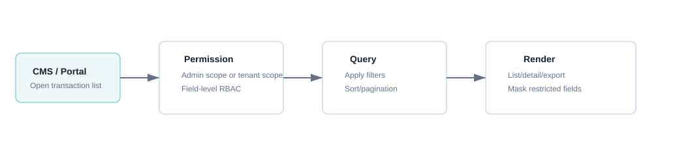

### f. Screen Flow

| # | From | Action | To/Result |
|---:|---|---|---|
| 1 | CMS menu | Nhấn `Transactions` | Mở màn danh sách Transaction. |
| 2 | Transaction List | Nhập/chọn điều kiện lọc | Danh sách tự truy vấn lại theo Keyword, Tenant, Brand, Order Status và Date range. |
| 3 | Transaction List | Nhấn `Đặt lại` | Xóa điều kiện lọc và tải lại dữ liệu mặc định. |
| 4 | Transaction List | Nhấn icon View | Mở `cms-transaction-detail.html` của Order tương ứng. |
| 5 | Transaction Detail | Nhấn `Quay lại danh sách` | Quay lại danh sách và giữ filter/paging gần nhất nếu session UI còn hiệu lực. |
| 6 | Transaction List | Nhấn `Export CSV` | Export toàn bộ dữ liệu thỏa filter hiện tại, không chỉ các dòng trên trang đang xem. |

### g. Screen Description - Admin Transaction List

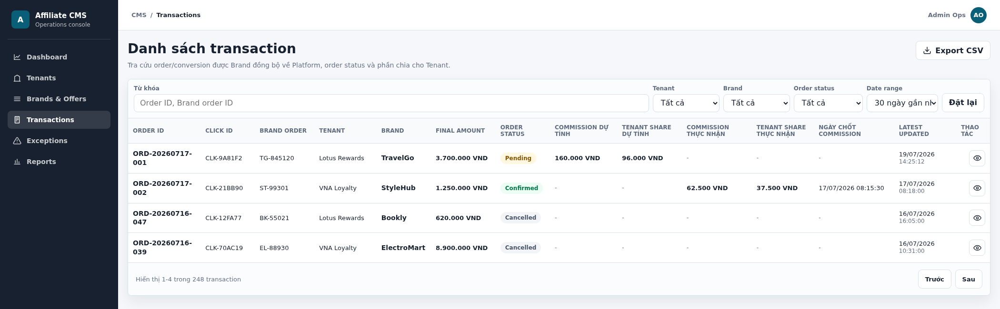

HTML mockup: [cms-transaction-list.html](../mockups/cms-transaction-list.html)

| # | Item | Control type | Data type | R/O | Data source | Description / Validation / Error handling |
|---:|---|---|---|---|---|---|
| 1 | Từ khóa | Textbox | String | O | Giá trị do Admin nhập trên UI. | Tìm theo `Order ID` do Platform sinh hoặc `Brand Order ID` do Brand gửi. Hệ thống trim khoảng trắng đầu/cuối; bỏ trống thì không áp dụng điều kiện từ khóa. Không tìm thấy dữ liệu thì hiển thị empty state, không báo lỗi. |
| 2 | Tenant | Dropdown | Tenant reference | O | Tenant Master Data của Platform | Hiển thị Tenant Display Name, giá trị truy vấn là `tenant_id`. Mặc định `Tất cả`; chọn một Tenant chỉ trả các Transaction có `tenant_id` tương ứng. Tenant đã Inactive vẫn có thể xuất hiện trong dữ liệu lịch sử theo retention policy. |
| 3 | Brand | Dropdown | Brand reference | O | Brand Master Data của Platform. | Hiển thị Brand Display Name, giá trị truy vấn là `brand_id`. Mặc định `Tất cả`; chọn Brand lọc Transaction phát sinh từ Brand đó. Brand đã Inactive không làm mất Transaction lịch sử. |
| 4 | Order Status | Dropdown | Enum | O | Enum Order Status do Platform quản lý. | Các giá trị `Pending`, `Confirmed`, `Cancelled`; mặc định `Tất cả`.<li>`Pending`: Platform đã ghi nhận đơn hàng, đơn hàng còn ít nhất một item đang chờ chốt commission.</li><li>`Confirmed`: Tất cả item đã được xác nhận và commission đã được chốt. Đơn vẫn có thể chứa item Refunded.</li><li>`Cancelled`: Tất cả item trong đơn hàng đều đã bị hủy/hoàn, không còn item hợp lệ để ghi nhận commission.</li>|
| 5 | Date range | Dropdown/Date range | Datetime | O | Giá trị do Admin chọn; truy vấn trên thời gian Transaction theo policy của màn hình. | Mặc định `30 ngày gần nhất`; hỗ trợ các khoảng cấu hình như `7 ngày gần nhất`, `Tháng này`. Mốc thời gian phải bao gồm cả đầu và cuối ngày theo timezone hệ thống; khoảng không hợp lệ không được gửi truy vấn. |
| 6 | Đặt lại | Button | Action | O | Trạng thái filter phía UI. | Xóa Keyword; đưa Tenant, Brand, Order Status về `Tất cả`, Date range về mặc định và tải lại trang đầu. Không thay đổi dữ liệu Transaction. |
| 7 | Export CSV | Button | Action | O | Transaction query theo toàn bộ filter hiện tại. | Export toàn bộ dữ liệu thỏa filter hiện tại, không chỉ các dòng trên trang đang xem. Không có quyền export thì ẩn/disable. Lỗi tạo file hiển thị thông báo; không trả file thiếu dữ liệu hoặc vượt phạm vi quyền. Template file sau khi export: `cms-transaction-export.xlsx` |
| 8 | Order ID | Table column | String | ReadOnly | `order_id` do Transaction Service sinh tại `ORD-006`. | Mã duy nhất toàn Platform, dùng làm khóa mở màn chi tiết và truy vết Transaction. Không lấy từ Brand. |
| 9 | Click ID | Table column | String | ReadOnly | `click_id` trong Order Success, đã được đối chiếu với Click record tại `ORD-004`. | Hiển thị Click ID dùng xác định Tenant/Brand attribution. Chỉ Transaction đã Match Click thành công mới có mặt trên danh sách. |
| 10 | Brand Order | Table column | String | ReadOnly | `brand_order_id` do Brand gửi trong payload Order Success. | Mã Order tại hệ thống Brand; duy nhất trong phạm vi Brand. Dùng cùng Brand để deduplicate, match cancel/refund và đối soát. |
| 11 | Tenant | Table column | String | ReadOnly | `tenant_id` lấy từ Click record; Display Name lấy từ Tenant Master Data. | Không lấy Tenant tùy ý từ payload Brand. Nếu tên Tenant thay đổi, UI hiển thị tên hiện tại hoặc snapshot theo reporting policy nhưng `tenant_id` không thay đổi. |
| 12 | Brand | Table column | String | ReadOnly | `brand_id/code` từ Order Success sau khi match Click; Display Name lấy từ Brand Master Data. | Hiển thị Brand phát sinh Order. Brand trong request phải khớp Brand context của Click trước khi Transaction được tạo. |
| 13 | Final amount | Table column | Money | ReadOnly | Tổng hợp từ `Final amount` hiện tại của toàn bộ Order Item. | Công thức: `Σ Item Final amount`. Khi tạo Transaction, Final amount item bằng Original amount; item được hoàn/hủy toàn bộ có Final amount = `0`. Hiển thị VND theo định dạng tiền của hệ thống. |
| 14 | Order Status | Table column | Enum | ReadOnly | Transaction Service tổng hợp từ Item Status theo `ORD-005`. | Tất cả item Refunded → `Cancelled`; có item Pending → `Pending`; không có Pending và có ít nhất một Confirmed → `Confirmed`. UI hiển thị badge tương ứng. |
| 15 | Commission dự tính | Table column | Money | ReadOnly | Tổng Gross commission hiện tại của Order Item, được tính tại `COM-001` và cập nhật khi refund. | Chỉ hiển thị khi Order `Pending`. Công thức: tổng Gross commission của các item chưa Refunded đã resolve, bao gồm item Pending và item Confirmed còn hợp lệ. Khi Order `Confirmed` hoặc `Cancelled`, hiển thị `-` theo mockup. |
| 16 | Tenant share dự tính | Table column | Money | ReadOnly | Tổng Tenant Share dự tính hiện tại của Order Item, được tính tại `COM-002` và cập nhật khi refund. | Chỉ hiển thị khi Order `Pending`. Công thức: tổng Tenant Share của các item chưa Refunded đã resolve. Khi Order `Confirmed` hoặc `Cancelled`, hiển thị `-`. |
| 17 | Commission thực nhận | Table column | Money | ReadOnly | Tổng Gross commission của các Order Item có Item Status `Confirmed`. | Công thức: `Σ Gross commission của item Confirmed`. Order Pending vẫn có thể có giá trị nếu một số item đã Confirmed. Nếu chưa có item Confirmed hoặc Order `Cancelled`, hiển thị `-`. |
| 18 | Tenant share thực nhận | Table column | Money | ReadOnly | Tổng Tenant Share của các Order Item có Item Status `Confirmed`. | Công thức: `Σ Tenant Share của item Confirmed`. Order Pending vẫn có thể có số thực nhận. Nếu chưa phát sinh hoặc Order `Cancelled`, hiển thị `-`. |
| 19 | Ngày chốt Commission | Table column | Datetime | ReadOnly | Thời điểm Platform hoàn tất chốt commission cấp Order khi Order chuyển `Confirmed`. | Chỉ hiển thị khi Order Status = `Confirmed`; Pending/Cancelled hiển thị `-`. Định dạng `dd/mm/yyyy hh:mm:ss` theo timezone hệ thống. |
| 20 | Latest Updated | Table column | Datetime | ReadOnly | `updated_at` của Transaction, cập nhật từ event gần nhất ảnh hưởng đến Order/Item. | Thay đổi khi tạo Transaction, cập nhật Item Status, xử lý refund/cancel, chốt commission hoặc retry thành công. Hiển thị `dd/mm/yyyy hh:mm:ss`. |
| 21 | Thao tác - View | Icon button | Action | O | `order_id` của dòng được chọn và quyền `transaction.view`. | Nhấn icon con mắt mở `cms-transaction-detail.html` của đúng Order. Không có quyền hoặc Order không tồn tại thì chặn truy cập và hiển thị thông báo phù hợp. |
| 22 | Pagination | Pagination | Integer | O | `page`, `page_size`, `total_records` từ Transaction query. | Hiển thị phạm vi bản ghi hiện tại và tổng số Transaction; nút Trước/Sau thay đổi trang nhưng giữ nguyên filter. Khi đang ở trang đầu/cuối, nút không hợp lệ phải disable. |

### h. Screen Description - Admin Transaction Detail

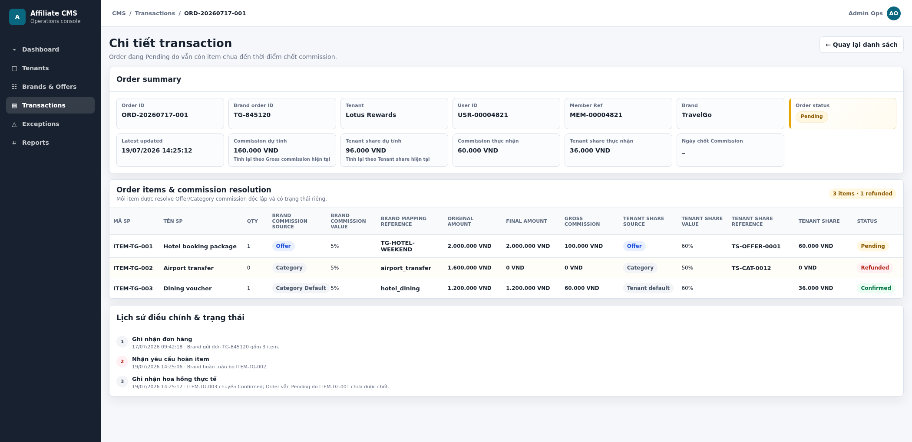

HTML mockup: [cms-transaction-detail.html](../mockups/cms-transaction-detail.html)

**Order Summary**

| # | Item | Control type | Data type | R/O | Data source | Description / Calculation / Validation / Error handling |
|---:|---|---|---|---|---|---|
| 1 | Order ID | Information card | String | ReadOnly | `order_id` do Transaction Service sinh tại `ORD-006`. | Mã duy nhất toàn Platform và là khóa truy vấn màn chi tiết. Không lấy từ Brand. Nếu `order_id` không tồn tại hoặc user không có quyền, hệ thống không hiển thị trang chi tiết. |
| 2 | Brand Order ID | Information card | String | ReadOnly | `brand_order_id` do Brand gửi trong Order Success. | Mã Order trên hệ thống Brand; duy nhất trong phạm vi Brand. Dùng cùng `brand_id` để deduplicate, match cancel/refund và đối soát. |
| 3 | Tenant | Information card | String | ReadOnly | `tenant_id` lấy từ Click record sau `ORD-004`; Display Name lấy từ Tenant Master Data. | Tenant không được lấy tùy ý từ payload Brand. Transaction luôn thuộc Tenant đã xác định từ Click ID. |
| 4 | User ID | Information card | String | ReadOnly | `user_id` của End User được liên kết với Click record/user context trên Platform. | ID nội bộ dùng để trace End User phát sinh Click và Order; không phải Username và không lấy từ Brand Order ID. Đây là trường không bắt buộc: nếu Click không xác định được End User thì hiển thị `-` |
| 5 | Member Ref | Information card | String | ReadOnly | `member_ref` của hội viên trong Tenant, lấy từ Tenant member context đã liên kết với Click và lưu snapshot vào Transaction. | Mã hội viên do Tenant quản lý, ví dụ `MEM-00004821`; dùng để Tenant đối chiếu Order với hội viên. Không dùng làm khóa Transaction và không thay thế `user_id`. Nếu không có dữ liệu thì hiển thị `-`. |
| 6 | Brand | Information card | String | ReadOnly | `brand_id/code` từ Order Success sau khi đối chiếu Click; Display Name lấy từ Brand Master Data. | Hiển thị Brand phát sinh Order. Brand trong payload phải khớp Brand context của Click trước khi Transaction được tạo. |
| 7 | Order Status | Status card | Enum | ReadOnly | Transaction Service tổng hợp từ Item Status theo `ORD-005`. | Tất cả item Refunded → `Cancelled`; có ít nhất một item Pending → `Pending`; không có Pending và có ít nhất một Confirmed → `Confirmed`. |
| 8 | Latest Updated | Information card | Datetime | ReadOnly | `updated_at` của Transaction; lấy từ event gần nhất làm thay đổi Order/Item. | Cập nhật khi tạo Transaction, refund/cancel item, thay đổi Item Status, chốt commission hoặc retry thành công. Hiển thị `dd/mm/yyyy hh:mm:ss`. |
| 9 | Commission dự tính | Information card | Money | ReadOnly | Tổng Gross commission hiện tại của các item. | Công thức: `Σ Item Gross commission`. Item Refunded đóng góp `0`. Giá trị được tính lại khi một hoặc nhiều item được hoàn/hủy toàn bộ. Mockup: `100.000 + 0 + 60.000 = 160.000 VND`. |
| 10 | Tenant share dự tính | Information card | Money | ReadOnly | Tổng Tenant Share hiện tại của các item. | Công thức: `Σ Item Tenant Share`. Item Refunded đóng góp `0`. Giá trị được tính lại khi một hoặc nhiều item được hoàn/hủy toàn bộ. Mockup: `60.000 + 0 + 36.000 = 96.000 VND`. |
| 11 | Commission thực nhận | Information card | Money | ReadOnly | Tổng Gross commission của item có Item Status `Confirmed`. | Công thức: `Σ Gross commission của item Confirmed`. Item Pending/Refunded không được cộng. Order vẫn có thể Pending dù đã có số thực nhận. |
| 12 | Tenant share thực nhận | Information card | Money | ReadOnly | Tổng Tenant Share của item có Item Status `Confirmed`. | Công thức: `Σ Tenant Share của item Confirmed`. Item Pending/Refunded không được cộng. Order vẫn có thể Pending dù đã có số thực nhận. |
| 13 | Ngày chốt Commission | Information card | Datetime | ReadOnly | Thời điểm Order được Platform tổng hợp chuyển sang `Confirmed`. | Chỉ hiển thị khi toàn Order đã Confirmed. Order Pending hoặc Cancelled hiển thị `-`; không dùng `expected_calculation_at` để thay thế. Định dạng `dd/mm/yyyy hh:mm:ss`. |
| 14 | Quay lại danh sách | Button | Action | O | Navigation state và URL màn danh sách. | Quay về Transaction List; ưu tiên giữ filter/page gần nhất trong session UI. Không cập nhật dữ liệu Transaction. |

**Order items & commission resolution**

| # | Item | Control type | Data type | R/O | Data source | Description / Calculation / Validation / Error handling |
|---:|---|---|---|---|---|---|
| 1 | Mã SP | Table column | String | ReadOnly | `item_code` do Brand gửi trong `items[]` của Order Success. | Duy nhất trong phạm vi `brand_order_id`; được lưu nguyên giá trị để match đúng item khi Brand gửi cancel/refund. |
| 2 | Tên SP | Table column | String | ReadOnly | `item_name` do Brand gửi trong Order Success. | Tên sản phẩm/dịch vụ dùng để vận hành tra cứu. Không dùng tên để match item hoặc resolve commission. |
| 3 | Qty | Table column | Integer | ReadOnly | Số lượng trên từng item, do Brand gửi từ Order Success. | Khi hoàn/hủy toàn bộ item nên item Refunded có Qty = `0`; item chưa Refunded giữ Qty ban đầu. |
| 4 | Brand commission source | Table column | Enum | ReadOnly | Kết quả resolve tại `COM-001`. |Hiển thị:<li>`Offer`: Khi brand gửi `Offer_code` về trong Order success đã được mapping với `Offer_id` trên Platform và tìm thấy được commission value tương ứng</li><li>`Category` khi brand gửi về không có `Offer_id` nhưng có `Category_code` đã được mapping với `Category_id` trên Platform và tìm thấy được commission value tương ứng</li><li> `Category Default` khi brand gửi về không có `Offer_id` nhưng có `Category_id` nhưng chưa được mapping với `Category_id` trên Platform thì sẽ lấy theo `Category Default` đã được set cho brand.</li> Mỗi item resolve độc lập. |
| 5 | Brand Commission Value | Table column | Decimal | ReadOnly | Commission value từ Brand commission rule được chọn tại `COM-001`. | <li>Hiển thị giá trị commission tương ứng với Brand Commission source </li><li>Percentage hiển thị `%`; Fixed hiển thị VND theo rule. Snapshot không bị thay đổi khi Admin sửa cấu hình sau khi Order đã được ghi nhận. </li>|
| 6 | Brand mapping reference | Table column | String | ReadOnly | Reference của Offer Mapping, Category Mapping hoặc Category Default được dùng tại `COM-001`. | Hiển thị mã Offer/mã Category của Platform, dùng để trace vì sao item nhận Brand commission source tương ứng. Không lấy Offer đã click nếu item thực tế không gửi Offer tương ứng. |
| 7 | Original amount | Table column | Money | ReadOnly | `amount` của item do Brand gửi trong Order Success. | Đây là giá trị trước khi xuất hiện hoàn/hủy item (nếu có) - Giá trị ban đầu làm cơ sở tính commission; không bị ghi đè khi item Refunded. Hiển thị VND. |
| 8 | Final amount | Table column | Money | ReadOnly | Giá trị hiện tại do Transaction Service quản lý. | <li>Nếu không xuất hiện hoàn hủy thì `Original amount` = `Final amount`</li><li>Nếu xuất hiện hoàn hủy toàn bộ/1 phần đơn hàng thì `Original amount` > `Final amount`, Item có trạng thái `Refunded` sẽ có `Final amount` = 0 và `Original amount` không thay đổi</li> |
| 9 | Gross commission | Table column | Money | ReadOnly | Kết quả tính tại `COM-001`, sau đó được cập nhật khi item Refunded. | <li>Percentage: `Final amount × Brand Commission Value (%)`.</li><li> Fixed: dùng Fixed Value theo rule snapshot.</li><li> Item Refunded có Gross commission = `0`. Ví dụ `ITEM-TG-001`: `2.000.000 × 5% = 100.000 VND`. </li>|
| 10 | Tenant share source | Table column | Enum | ReadOnly | Kết quả resolve tại `COM-002`. | <li>Được xác định độc lập cho từng item sau khi tính Gross Commission, theo thứ tự ưu tiên `Offer → Category → Brand Default`.</li><li>`Offer`: Có Tenant Share rule hợp lệ theo Offer của item.</li><li>`Category`: Không có Offer rule nhưng có Tenant Share rule theo Category của item.</li><li>`Brand Default`: Không có Offer/Category rule; sử dụng tỷ lệ mặc định được cấu hình cho tổ hợp Tenant + Brand.</li> |
| 11 | Tenant Share Value | Table column | Decimal | ReadOnly | Tỷ lệ từ Tenant Share rule được chọn tại `COM-002`, lưu snapshot trên item. | <li>Là các giá trị % commission được set tương ứng cho `Tenant share reference`</li><li>Giá trị lớn hơn `0` và không vượt `100%`. Mockup minh họa `60%`, `50%`. </li>
| 12 | Tenant share reference | Table column | String | ReadOnly | Reference của Offer Tenant Share rule hoặc Category Tenant Share rule. | Tenant share reference hiển thị reference của Offer hoặc Category Tenant Share rule. Khi Tenant share source = Brand Default, hiển thị _ vì rule mặc định Tenant + Brand không có reference Category/Offer riêng trên giao diện. |
| 13 | Tenant share | Table column | Money | ReadOnly | Kết quả tính tại `COM-002`, sau đó cập nhật khi item Refunded. | </li> <li>Công thức: `Tenant Share` = `Gross Commission` × `Tenant Share Value (%)`.</li>. Item Status = `Refunded` thi `Tenant share` = `0`.  |
| 14 | Item Status | Table column | Enum | ReadOnly | Item Status do Platform quản lý. | <li>`Pending` khi chưa chốt;</li><li> `Confirmed` khi đã ghi nhận commission thực tế;</li><li> `Refunded` khi Brand hoàn/hủy toàn bộ item. <li>Brand không truyền/ghi đè Item Status qua Order Success.</li> |
| 15 | Item summary badge | Badge | String | ReadOnly | Đếm trực tiếp từ danh sách Order Item của Transaction. | Hiển thị `tổng số item` và `số item có Status = Refunded`.|

**Lịch sử điều chỉnh & trạng thái**

| # | Item | Control type | Data type | R/O | Data source | Description / Calculation / Validation / Error handling |
|---:|---|---|---|---|---|---|
| 1 | Ghi nhận đơn hàng | Timeline event | Datetime/Text | ReadOnly | Transaction creation event được tạo khi `ORD-006` commit thành công. | <li>Hiển thị thời điểm tạo, Brand Order ID và tổng số item đã lưu. Tổng item lấy từ số Order Item trong Transaction, không lấy từ tổng Qty.</li><li>Format: [Tên Brand] gửi đơn [Mã đơn hàng brand] gồm [Tổng số sản phẩm trong đơn hàng] item.</li> |
| 2 | Nhận yêu cầu hoàn item | Timeline event | Datetime/Text | ReadOnly | Cancel/refund event Brand gửi và Adjustment History được lưu tại `ORD-003/005`. | <li>Hiển thị `event_at`, item_code bị hoàn/hủy (Nếu có). Dữ liệu trước/sau được lưu bất biến; timeline không ghi đè event tạo Order.</li><li>Nếu không có sự kiện hoàn/hủy item sẽ không hiển thị event này</li><li>Format: Đơn hàng [Mã đơn hàng Brand] hoàn [Mã item].</li> |
| 3 | Ghi nhận hoa hồng thực tế | Timeline event | Datetime/Text | ReadOnly | Item đã thỏa mãn thời gian Pending day và được ghi nhận hoa hồng thực tế. | Hiển thị item chuyển Confirmed và thời điểm chốt item. Số thực nhận cấp Order được tính lại từ các item Confirmed.|

### i. Export Description

| Information | Rule |
|---|---|
| Data scope | Toàn bộ Transaction thỏa bộ lọc hiện tại và nằm trong quyền của user. |
| Columns | Tối thiểu gồm các cột đang hiển thị trên danh sách; có thể bổ sung ID kỹ thuật theo export policy nhưng không chứa secret/raw payload. |
| Money | Xuất giá trị số và currency VND rõ ràng; không xuất ký tự định dạng gây sai kiểu số khi đối soát. |
| Datetime | `dd/mm/yyyy hh:mm:ss` hoặc định dạng máy chuẩn đã công bố trong export contract; phải thống nhất toàn file. |
| Empty value | Trường chưa phát sinh dữ liệu xuất rỗng hoặc `-` theo export contract thống nhất. |
| File name | Có timestamp và phạm vi filter đủ để truy vết lần export. |

### j. Business Rules

| BR ID | Rule |
|---|---|
| BR-TXN-001-01 | Số cấp Order phải được tổng hợp từ dữ liệu item hiện tại; không dùng một commission source/rule chung cho toàn Order. |
| BR-TXN-001-02 | `Final amount = Σ Final amount` của tất cả item. |
| BR-TXN-001-03 | Khi Order Pending, Commission Gross/Tenant Share dự tính là tổng giá trị hiện tại của các item . |
| BR-TXN-001-04 | Commission/Tenant Share thực nhận là tổng giá trị của các item Confirmed. |
| BR-TXN-001-05 | Item Refunded có Qty, Final amount, Gross commission và Tenant Share bằng `0`; Original amount không thay đổi. |
| BR-TXN-001-07 | Ngày chốt Commission chỉ hiển thị khi Order Status = Confirmed. |
| BR-TXN-001-08 | Các trường ngày giờ trên UI hiển thị `dd/mm/yyyy hh:mm:ss`. |
| BR-TXN-001-10 | Raw payload, credential và secret không hiển thị trên list/detail/export mặc định. |
| BR-TXN-001-11 | View phải mở đúng Transaction theo `order_id`; user không có quyền bị từ chối. |
| BR-TXN-001-12 | Export phải tuân theo filter và RBAC giống danh sách. |

### k. Acceptance Criteria

| AC ID | Criteria |
|---|---|
| AC-TXN-001-01 | Danh sách hiển thị đầy đủ 14 cột theo mockup, không mất cột View ở cuối. |
| AC-TXN-001-02 | Bộ lọc Keyword, Tenant, Brand, Order Status và Date range trả dữ liệu đúng. |
| AC-TXN-001-03 | Pending hiển thị số dự tính hiện tại; Confirmed hiển thị số thực nhận và ngày chốt; Cancelled không hiển thị commission phải trả. |
| AC-TXN-001-04 | View mở đúng chi tiết Transaction tương ứng. |
| AC-TXN-001-05 | Order Summary hiển thị đúng 13 information cards theo mockup, gồm User ID và Member Ref. |
| AC-TXN-001-06 | Bảng item hiển thị đủ 14 cột và đúng source/value/reference của từng item. |
| AC-TXN-001-07 | Item Refunded giữ Original amount nhưng Qty, Final amount, Gross commission và Tenant Share bằng `0`. |
| AC-TXN-001-08 | Order còn item Pending giữ Order Status Pending dù đã có item Confirmed và số thực nhận. |
| AC-TXN-001-09 | Timeline phản ánh đúng event Order/item và không mô tả Order Confirmed khi Order vẫn Pending. |
| AC-TXN-001-10 | Export chứa đúng tập dữ liệu theo filter/RBAC và không chứa secret/raw payload. |

## 8. TXN-004/005 - Tenant xem danh sách và chi tiết Transaction

### a. Introduction

Tenant user xem Transaction thuộc Tenant của mình. Dữ liệu luôn được scope theo `tenant_id` từ session/token; Tenant không được xem dữ liệu Tenant khác.

### b. Actors/Objects

| Actor/Object | Role |
|---|---|
| Tenant Admin | Xem Transaction trong Tenant. |
| Tenant Finance | Xem dữ liệu tài chính theo quyền. |
| Tenant Viewer | Xem dữ liệu giới hạn. |
| Tenant Portal | Enforce tenant isolation và RBAC. |

### c. Expected Result

- Tenant chỉ xem Transaction của chính Tenant.
- List/detail phản ánh dữ liệu item và số tổng hợp hiện tại.
- Field tài chính hiển thị theo role.

### d. Logic Diagram

### e. Screen Description - Tenant Transaction List

HTML: [tenant-portal-transaction-list.html](../mockups/tenant-portal-transaction-list.html)

| # | Item | Control | Description |
|---:|---|---|---|
| 1 | Keyword | Textbox | Tìm theo Order ID/Brand Order ID trong Tenant. |
| 2 | Brand | Dropdown | Chỉ gồm Brand có Transaction của Tenant. |
| 3 | Order Status | Dropdown | Pending, Confirmed, Cancelled. |
| 4 | Date | Date range | Lọc theo thời gian trong phạm vi Tenant. |
| 5 | Transaction table | Table | Hiển thị Order, Brand, Final amount, trạng thái và số Tenant Share theo quyền. |
| 6 | View | Action | Mở chi tiết Transaction thuộc Tenant. |

### f. Screen Description - Tenant Transaction Detail

| # | Item | Control | Description |
|---:|---|---|---|
| 1 | Order summary | Section | Thông tin Order/Brand, trạng thái và thời gian. |
| 2 | Order Item | Table | Item, Qty, Original amount, Final amount, Tenant Share và Item Status theo quyền. |
| 3 | Status history | Timeline | Lịch sử trạng thái được phép công khai cho Tenant. |

### g. Business Rules

| BR ID | Rule |
|---|---|
| BR-TXN-004-01 | Query bắt buộc scope theo `tenant_id` từ session/token. |
| BR-TXN-004-02 | Không nhận `tenant_id` tùy ý từ client để mở rộng phạm vi dữ liệu. |
| BR-TXN-004-03 | Gross commission nội bộ bị ẩn; Tenant Share hiển thị theo role. |
| BR-TXN-004-04 | Không hiển thị raw payload, secret hoặc dữ liệu Tenant khác. |
| BR-TXN-004-05 | Số dự kiến phải có label rõ, không được trình bày như số đã chốt. |

### h. Acceptance Criteria

| AC ID | Criteria |
|---|---|
| AC-TXN-004-01 | Tenant xem được danh sách/chi tiết của Tenant mình. |
| AC-TXN-004-02 | Truy cập Transaction Tenant khác bị chặn. |
| AC-TXN-004-03 | Filter hoạt động đúng trong phạm vi Tenant. |
| AC-TXN-004-04 | Field tài chính hiển thị/ẩn đúng role. |

# V. Data Requirements

## 1. Order Success Event

| Field | Type | R/O | Description |
|---|---|---|---|
| request_id | String | R | Idempotency key của request. |
| brand_id/code | String | R | Định danh Brand gửi event. |
| click_id | String | R | Tracking click ID. |
| brand_order_id | String | R | Mã đơn phía Brand. |
| order_success_at | Datetime | R | Thời điểm order success. |
| currency | String | R | Currency, mặc định VND nếu chưa hỗ trợ loại khác. |
| items | Array | R | Danh sách một hoặc nhiều Order Item; mỗi item được validate và resolve commission/Tenant Share độc lập. |
| user_id | String | O | ID người dùng nếu Platform/Tenant xác định được. |
| member_ref | String | O | Mã hội viên phía Tenant. |
| customer_ref | String | O | Tham chiếu khách hàng phía Brand, MVP1 không dùng để cộng điểm. |
| metadata | JSON | O | Thông tin bổ sung. |

**Order Success Item**

| Field | Type | R/O | Description |
|---|---|---|---|
| item_code | String | R | Mã item phía Brand; duy nhất trong phạm vi `brand_order_id`. |
| item_name | String | R | Tên sản phẩm/dịch vụ. |
| sku | String | O | SKU phía Brand nếu có. |
| Qty | Integer | R | Số lượng mua, phải lớn hơn `0`. |
| amount | Decimal | R | Original amount của item, phải lớn hơn hoặc bằng `0`. |
| offer_code | String | O | Brand Offer ID/Code thực tế của item để resolve Offer mapping/rule. |
| category_code | String | O | Brand Category ID/Code thực tế của item để resolve Category mapping/rule; nếu trống/không mapping thì dùng Category Default. |

## 2. Transaction

| Field | Type | R/O | Description |
|---|---|---|---|
| order_id | UUID/String | R | ID transaction/order Platform. |
| tenant_id | UUID/String | R | Tenant owner. |
| brand_id | UUID/String | R | Brand owner. |
| click_id | String | R | Tracking click ID. |
| brand_order_id | String | R | Mã đơn phía Brand. |
| user_id | String | O | ID người dùng nếu Platform/Tenant xác định được. |
| member_ref | String | O | Mã hội viên phía Tenant. |
| customer_ref | String | O | Tham chiếu khách hàng phía Brand nếu có. |
| order_amount | Decimal | R | Giá trị đơn hàng. |
| currency | String | R | Currency. |
| order_status | Enum | R | Pending, Confirmed, Cancelled. `Pending` dùng số tạm tính; `Confirmed` dùng số chính thức; `Cancelled` không phát sinh hoa hồng chính thức. |
| expected_calculation_at | Datetime | O | Ngày dự kiến tính/chốt doanh thu/hoa hồng chính thức, thường dựa trên pending days của Brand. |
| official_calculation_at | Datetime | O | Ngày hệ thống đã tính/chốt doanh thu/hoa hồng chính thức. Trống nếu chưa chốt. |
| provisional_revenue_amount | Decimal | O | Doanh thu tạm tính khi order đã ghi nhận nhưng chưa tới ngày chốt chính thức. |
| provisional_gross_commission_amount | Decimal | O | Hoa hồng Brand trả Affiliate tạm tính. |
| provisional_tenant_share_amount | Decimal | O | Phần Affiliate dự kiến chia Tenant trước ngày chốt chính thức. |
| provisional_affiliate_keep_amount | Decimal | O | Phần Affiliate dự kiến giữ lại trước ngày chốt chính thức. |
| gross_commission_amount | Decimal | O | Commission Brand trả Affiliate. |
| tenant_share_amount | Decimal | O | Phần Affiliate chia Tenant. |
| affiliate_keep_amount | Decimal | O | Phần Affiliate giữ lại. |
| created_at/updated_at | Datetime | R | Audit metadata. |

Transaction chỉ được tạo khi toàn bộ `items[]` đã resolve thành công. Dữ liệu Offer/Category, Brand commission source/value/reference, Gross commission, Tenant Share source/value/reference và Tenant Share được lưu ở từng Order Item, không lưu một source chung cho toàn Order.

## 3. Exception

| Field | Type | R/O | Description |
|---|---|---|---|
| exception_id | UUID/String | R | ID exception. |
| exception_type | Enum | R | Loại exception. |
| status | Enum | R | Open, Resolved. |
| request_id | String | O | Request liên quan. |
| order_id | String | O | Platform Order ID nếu Transaction đã tồn tại. Với Exception phát sinh trước khi tạo Transaction, trường này để trống/hiển thị `_`. |
| brand_order_id | String | O | Brand order liên quan. |
| click_id | String | O | Click liên quan. |
| tenant_id | String | O | Tenant nếu resolve được. |
| brand_id | String | O | Brand nếu resolve được. |
| error_items | Array | O | Danh sách item lỗi của Order Success. Mỗi phần tử lưu `item_code`, `offer_code`, `category_code`, failed step, exception type và message. |
| processing_context | JSON | O | Kết quả validation/resolve tạm của toàn Order; được mask dữ liệu nhạy cảm và chưa phải Transaction. |
| retry_count | Integer | R | Số lần Retry Exception; mặc định `0`. |
| message | Text | R | Mô tả lỗi. |
| metadata | JSON | O | Context đã mask sensitive data. |
| created_at/resolved_at | Datetime | O | Thời điểm tạo/xử lý. |

# VI. Consolidated Business Rules Summary

| BR ID | Rule |
|---|---|
| BR-OT-GEN-001 | Brand API phải validate auth trước khi xử lý payload. |
| BR-OT-GEN-002 | Order success và cancel/refund phải hỗ trợ idempotency. |
| BR-OT-GEN-003 | Transaction phải lưu correlation key: request_id, click_id, brand_order_id, order_id. |
| BR-OT-GEN-004 | Order có offer_id chỉ tính commission theo Offer rule nếu Offer có commission rule active. |
| BR-OT-GEN-005 | Order không có Offer commission active tính commission theo Brand Category Mapping; ưu tiên category Brand gửi lên và map được, nếu thiếu hoặc không map được thì dùng category mặc định của Brand. |
| BR-OT-GEN-006 | Tenant share resolve theo Tenant Revenue Share Rule: Offer -> Category -> Brand. |
| BR-OT-GEN-007 | MVP1 không tính/cộng điểm hoặc cashback cho End User. |
| BR-OT-GEN-008 | Tenant Portal chỉ xem transaction thuộc Tenant từ session/token. |
| BR-OT-GEN-009 | Raw event metadata không hiển thị trên màn Transaction Detail mặc định; nếu expose ở màn trace/kỹ thuật riêng thì không được lộ secret/plain credential. |
| BR-OT-GEN-010 | Order `Cancelled` không được đưa vào eligible commission. Cancel/Refund API cho Order `Confirmed` bị từ chối, giữ nguyên dữ liệu đã chốt và ghi Exception; Admin xử lý đối soát thủ công nếu cần. |
| BR-OT-GEN-011 | Doanh thu/hoa hồng tạm tính phải được phân biệt rõ với doanh thu/hoa hồng chính thức trên UI, export và report. |
| BR-OT-GEN-012 | Số tạm tính không được đưa vào settlement hoặc payable chính thức cho đến khi order qua ngày chốt và không bị cancel/refund theo policy. |
| BR-OT-GEN-013 | Platform resolve commission/Tenant Share độc lập cho từng item nhưng chỉ tạo Transaction khi toàn bộ item Pass. Có ít nhất một item lỗi thì ghi một Exception cho toàn Order, lưu `error_items[]` và chưa sinh `order_id`. |
| BR-OT-GEN-014 | Transaction đã tạo chỉ có Item Status `Pending`, `Confirmed`, `Refunded`; `Exception` không phải Item Status của Transaction. |
| BR-OT-GEN-015 | Cancel/Refund event bị Exception không thay đổi Transaction hiện tại; chỉ Retry thành công mới cập nhật item và tổng hợp lại Order Status. |

# VII. Non-functional Requirements

| ID | Requirement |
|---|---|
| NFR-OT-001 | API order success/cancel/refund phải có idempotency để xử lý retry an toàn. |
| NFR-OT-002 | API phải log request/response metadata đủ để trace nhưng không lưu secret plain text. |
| NFR-OT-003 | Transaction list phải hỗ trợ pagination/sort/filter. |
| NFR-OT-004 | Backend phải enforce authorization/tenant scope, không chỉ ẩn UI. |
| NFR-OT-005 | Commission calculation phải lưu rule reference/version để phục vụ đối soát. |
| NFR-OT-006 | Hệ thống phải chịu được duplicate/retry từ Brand mà không tạo double transaction. |
| NFR-OT-007 | Exception và transaction status history phải có audit trail. |

# VIII. Consolidated Acceptance Criteria Summary

| AC ID | Criteria |
|---|---|
| AC-OT-GEN-001 | Order success hợp lệ tạo transaction đúng Tenant/Brand/Offer. |
| AC-OT-GEN-002 | Duplicate request không tạo transaction trùng. |
| AC-OT-GEN-003 | Order thiếu default category hoặc thiếu commission rule hợp lệ sau fallback tạo exception đúng loại. |
| AC-OT-GEN-004 | Commission Brand -> Affiliate tính đúng theo Offer, Category hoặc DefaultCategory rule. |
| AC-OT-GEN-005 | Tenant share và affiliate keep tính đúng theo revenue share rule. |
| AC-OT-GEN-006 | Cancel/refund event trong thời gian pending cập nhật `order_status = Cancelled`, loại trừ số tạm tính và không chốt commission/revenue share chính thức. |
| AC-OT-GEN-007 | Order chưa tới ngày chốt hiển thị được doanh thu/hoa hồng tạm tính nếu có đủ rule và dữ liệu hợp lệ. |
| AC-OT-GEN-008 | Admin xem/filter/detail/export transaction theo quyền và phân biệt được số tạm tính/chính thức. |
| AC-OT-GEN-009 | Tenant chỉ xem được transaction của Tenant mình. |
| AC-OT-GEN-010 | Không có luồng nào trong module này gọi Tenant Loyalty API hoặc cộng điểm End User trong MVP1. |
| AC-OT-GEN-011 | Order Success có một hoặc nhiều item lỗi chỉ tạo một Exception cấp Order và không xuất hiện trên Transaction List. |
| AC-OT-GEN-012 | Sau khi toàn bộ item Pass, hệ thống tạo đúng một Transaction chứa đầy đủ item và chuyển Exception liên quan sang `Resolved`. |
| AC-OT-GEN-013 | Transaction không chứa item có Item Status `Exception`. |
