# SRS - Tenant Management

## Changes Record

Note: A - Add/Create new, M - Modify, D - Delete

| Date of change | Reason (A, M, D) | Updated by | Old version | Description of change | New version |
|---|---|---|---|---|---|
| 2026-07-15 | A | Product/BA | -- | Create SRS Tenant Management following module-04 template. Logic diagrams are embedded as image files, not UML text. | 1.0.0 |

## Table of Contents

- I. Introduction
- II. Overall Description
- III. Overview
- IV. Description of Functions
- V. Data Requirements
- VI. Consolidated Business Rules Summary
- VII. Non-functional Requirements
- VIII. Consolidated Acceptance Criteria Summary
- IX. Open Questions

# I. Introduction

## 1. Purpose of Document

Tài liệu này mô tả yêu cầu phần mềm cho nhóm chức năng Tenant Management thuộc White-label Affiliate Marketplace Platform. Tài liệu dùng cho Product/BA, UI/UX, Engineering, QA và vận hành để thống nhất phạm vi, luồng xử lý, màn hình, trường dữ liệu, business rule và điều kiện nghiệm thu.

Phạm vi tài liệu bao gồm:

- CMS Tenant Management.
- Tenant Brand/Offer Visibility.
- Tenant Revenue Share.

## 2. Document Conventions

| Convention | Description |
|---|---|
| Required field | Trường bắt buộc được đánh dấu `R` trong cột R/O hoặc mô tả là Required. |
| Optional field | Trường không bắt buộc được đánh dấu `O`. |
| R/O | Required/Optional, dùng trong screen description của các màn nhập liệu. |
| Status | Các trạng thái thông dụng gồm `Draft`, `Active`, `Inactive`. |
| Brand commission type | Áp dụng cho commission Brand trả Affiliate: `Percentage` hiển thị `%`, `Fixed amount` hiển thị `VND`. Không áp dụng cho Tenant revenue share. |
| Tenant revenue share | Phần Affiliate Platform chia cho Tenant, chỉ cấu hình bằng `tenant_share_rate%`, không phải cashback/earn display của End user. |
| Logic diagram | Sơ đồ logic được nhúng dưới dạng ảnh trong thư mục `assets`, không hiển thị UML/code trong tài liệu. |
| Priority | `Must` là bắt buộc trong MVP1; `Should` là nên có nếu không ảnh hưởng timeline. |

## 3. Project Scope

### 3.1 In Scope

| Module | Features |
|---|---|
| Tenant Management | Xem danh sách Tenant + lọc, thêm mới, sửa, xem chi tiết và ngưng hoạt động Tenant. Trong Tenant Detail, CMS cho xem/lọc toàn bộ tài khoản Tenant Portal; tạo Admin Tenant đầu tiên; tạo thêm tài khoản bằng một trong bốn System Role Active của MVP1; xem chi tiết read-only và chỉnh sửa tài khoản. Danh sách dùng chung nguồn Tenant User với Tenant Portal và gồm cả tài khoản được tạo từ Tenant Portal. Không sửa Username, không xóa cứng User, không quản lý Role/Permission tại tab tài khoản và không gán Role Platform/Tenant khác. Custom Role thuộc Deferred/Phase 2. |
| Tenant Brand/Offer Visibility | Xem danh sách Brand assignment, assign Brand/Offer vào pool được phép hiển thị cho Tenant, chỉnh Offer assignment riêng, unassign Brand hoặc Offer khỏi pool. |
| Tenant Revenue Share | Xem danh sách revenue share theo Brand, cập nhật Brand-level share, thêm/sửa Category override, thêm/sửa Offer override, inactive override. |

### 3.2 Out of Scope

| Item | Reason |
|---|---|
| Tenant Domain & Branding config trên CMS | Dev team/Ops xử lý ngoài CMS khi setup Tenant mới. |
| Tenant Loyalty API | MVP1 chưa call API cộng điểm/cashback cho End user. |
| Cashback/Point calculation cho End user | Pending sau MVP1. |
| Customer earn display config | Thuộc Tenant Portal. Tenant tự cấu hình text hiển thị theo Brand và override Category/Offer; Admin CMS không cấu hình nội dung này trong MVP1. |
| Tenant tự cấu hình revenue share | MVP1 chỉ Admin/Ops cấu hình. |
| Listing fee, CPC billing | Không đưa vào hệ thống MVP1. |

## 4. Expected Results After Finishing This Document

- Xác định rõ các use case Tenant trong MVP1.
- Làm rõ dữ liệu đầu vào/đầu ra, validation, exception và business rule.
- Có screen flow, screen description và ảnh mockup để UI/UX/Engineering triển khai.
- Có logic diagram dạng ảnh cho từng nhóm chức năng chính.
- Có acceptance criteria để QA xây test case.

## 5. References

| Document | Location |
|---|---|
| Function List / SOW | [affiliate-marketplace-platform-function-list.md](../function-list/affiliate-marketplace-platform-function-list.md) |
| Current Tenant SRS | [tenant-management.md](tenant-management.md) |
| Brand & Offer SRS module-04 template | [brand-offer-management-module-04-template.md](brand-offer-management-module-04-template.md) |
| Tenant list mockup | [cms-tenant-list.html](../mockups/cms-tenant-list.html) |
| Tenant create mockup | [cms-tenant-create.html](../mockups/cms-tenant-create.html) |
| Tenant Brand/Offer visibility mockup | [cms-tenant-assign-brand-offer.html](../mockups/cms-tenant-assign-brand-offer.html) |
| Tenant revenue share list mockup | [cms-tenant-revenue-share.html](../mockups/cms-tenant-revenue-share.html) |
| Tenant revenue share update mockup | [cms-tenant-revenue-share-update.html](../mockups/cms-tenant-revenue-share-update.html) |

# II. Overall Description

## 1. Definition

| Name | Description |
|---|---|
| Tenant | Đối tác sở hữu tập khách hàng/loyalty member và sử dụng marketplace dạng white-label. |
| Admin/Ops | Người dùng CMS quản lý Tenant, visibility và revenue share. |
| Admin assignment | Tầng 1 do Admin/Ops cấu hình, xác định Brand/Offer nào được phép nằm trong pool hiển thị của Tenant. |
| Tenant visibility | Tầng 2 do Tenant cấu hình trong Tenant Portal, bật/tắt Brand/Offer trong pool đã được Admin assign. |
| All active offers | Mặc định khi chọn Brand, toàn bộ Offer active của Brand được hiển thị cho Tenant. |
| Custom offers | Trạng thái khi Admin/Ops chỉnh riêng danh sách Offer được hiển thị cho một Brand. |
| Revenue share | Phần commission Affiliate chia cho Tenant. |
| Brand-level revenue share | Cấu hình mặc định theo Tenant + Brand. |
| Category override | Revenue share override theo Category của Brand. |
| Offer override | Revenue share override theo Offer của Brand. |
| Earn display | Nội dung hiển thị cho End user, không dùng chung với Tenant revenue share. |
| Audit log | Lịch sử ghi nhận thao tác tạo/sửa/inactive/cấu hình. |

## 2. Operation Environment

| Item | Description |
|---|---|
| Application type | CMS web application. |
| Primary users | Admin/Ops, Partnership/Ops, Finance, QA. |
| Supported browser | Chrome, Edge, Firefox bản hiện đại. |
| Device | Desktop/laptop là chính. |
| Runtime dependency | Landing page chỉ hiển thị Brand/Offer active thỏa `assignment_status = Active` và `tenant_visibility_status = Visible`. |
| Security | User phải đăng nhập CMS và có quyền theo action. |

# III. Overview

## 1. Model Overview

| Component | Interaction |
|---|---|
| Admin/Ops | Tạo/sửa Tenant, cấu hình Brand/Offer visibility và revenue share. |
| CMS Tenant Management | Lưu thông tin Tenant cơ bản và status. |
| Brand/Offer Visibility | Catalog hiển thị cuối cùng theo rule 2 tầng: Admin assignment active AND Tenant visibility visible. |
| Revenue Share Rule | Quyết định phần Affiliate chia cho Tenant theo Brand, Category hoặc Offer. |
| Landing Page Runtime | Render catalog theo Tenant visibility; không tính/cộng cashback End user trong MVP1. |
| Order/Commission Runtime | Dùng revenue share rule để tính tenant_share_amount sau khi có gross_commission_amount. |

## 2. Function Diagram

| Function group | Use cases |
|---|---|
| Tenant Management | CMS-TENANT-001, CMS-TENANT-002, CMS-TENANT-USER-001, CMS-TENANT-003, CMS-TENANT-004 |
| Tenant Brand/Offer Visibility | CMS-TENANT-VIS-001, CMS-TENANT-VIS-002, CMS-TENANT-VIS-003 |
| Tenant Revenue Share | CMS-TENANT-RS-001, CMS-TENANT-RS-002 |

# IV. Description of Functions

## 1. CMS-TENANT-001 - Xem danh sách Tenant + lọc

### a. Introduction

Chức năng cho phép Admin/Ops xem danh sách Tenant đã tạo trên Platform, tìm kiếm/lọc Tenant và truy cập action chi tiết/sửa/ngưng hoạt động.

### b. Actors/Objects

| Actor/Object | Role |
|---|---|
| Admin/Ops | Người thao tác trên CMS. |
| CMS Interface | Hiển thị filter, bảng dữ liệu và action. |
| Tenant Service | Truy vấn Tenant theo điều kiện lọc. |
| Permission Service | Kiểm tra quyền truy cập. |

### c. Pre-conditions

- Admin/Ops đã đăng nhập CMS.
- Admin/Ops có quyền `tenant.read`.

### d. Expected Result

- Admin/Ops xem được danh sách Tenant.
- Admin/Ops lọc được Tenant theo keyword, status, account owner hoặc updated period nếu UI hỗ trợ.
- Không thay đổi dữ liệu khi chỉ xem/lọc.

### e. Logic Diagram

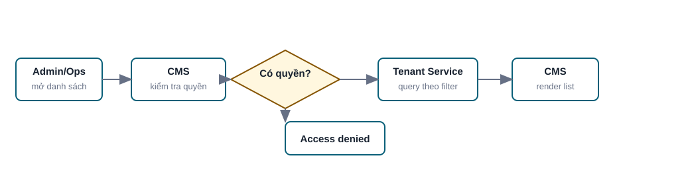

### f. Screen Flow

1. Tenant Management menu.
2. Tenant List screen.
3. Action sang Create Tenant, Tenant detail hoặc Edit Tenant nếu Admin/Ops chọn.

Mockup:

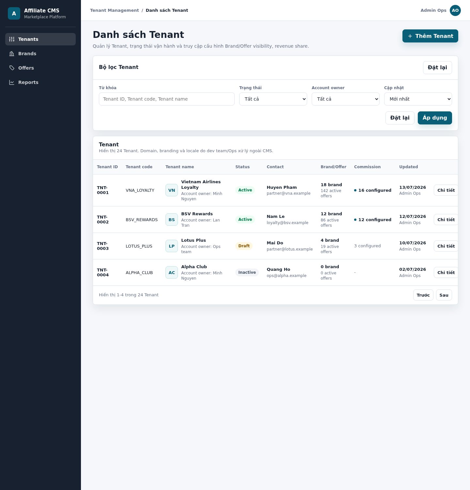

HTML mockup đầy đủ: [cms-tenant-list.html](../mockups/cms-tenant-list.html)

### g. Screen Description

Screen 1: Tenant List

| # | Items | Control type | Data type | Description / Validation / Error handling |
|---:|---|---|---|---|
| 1 | Keyword | Textbox | Text | Tìm theo Tenant ID, Tenant code, Tenant name. Tối đa 100 ký tự; nếu vượt quá giới hạn thì trim hoặc hiển thị lỗi theo policy. |
| 2 | Status | Dropdown | Enum | Tất cả, Draft, Active, Inactive. Mặc định `Tất cả`. |
| 3 | Account owner | Dropdown | User ref | Lọc theo người phụ trách nội bộ nếu hệ thống có dữ liệu owner. |
| 4 | Updated period | Dropdown | Enum/Date period | Lọc theo thời gian cập nhật, ví dụ mới nhất, 7 ngày, 30 ngày. |
| 5 | Tenant ID | Label | ReadOnly | ID Tenant do hệ thống sinh. |
| 6 | Tenant code | Label | Text | Mã Tenant unique. |
| 7 | Tenant name | Label | Text | Tên Tenant. |
| 8 | Status | Badge | Enum | Trạng thái Tenant. Tenant Inactive không hiển thị landing page public. |
| 9 | Contact | Label | Text/Email | Hiển thị contact name và contact email. |
| 10 | Brand/Offer | Label | Number | Số Brand/Offer đang assigned hoặc active. |
| 11 | Commission | Label | Number/Text | Số Brand đã cấu hình revenue share hoặc `-` nếu chưa có. |
| 12 | Updated | Label | Datetime/User | Ngày cập nhật và người cập nhật cuối. |
| 13 | Actions | Button/Menu | Click | Chi tiết, sửa. Action hiển thị theo quyền user. |

### h. Logic Description

| # | Step | Actor/Object | Logic |
|---:|---|---|---|
| 1 | Open list | Admin/Ops | Mở menu Tenant Management. |
| 2 | Permission check | CMS Interface | Kiểm tra quyền `tenant.read`. |
| 3 | Query data | Tenant Service | Query Tenant theo filter, sort mặc định theo `updated_at` giảm dần. |
| 4 | Render result | CMS Interface | Nếu có data thì render table; nếu không có thì render empty state. |
| 5 | Error handling | CMS Interface | Nếu không có quyền thì hiển thị access denied. |

### i. Business Rules

| BR ID | Rule |
|---|---|
| BR-TENANT-001-01 | Keyword áp dụng cho Tenant ID, Tenant code và Tenant name. |
| BR-TENANT-001-02 | Tenant Inactive vẫn hiển thị trong CMS nếu filter cho phép. |
| BR-TENANT-001-03 | Không hiển thị domain/branding/locale config trong danh sách Tenant. |

### j. Acceptance Criteria

| AC ID | Criteria |
|---|---|
| AC-TENANT-001-01 | Admin/Ops có quyền `tenant.read` xem được Tenant list. |
| AC-TENANT-001-02 | Filter keyword trả về kết quả theo Tenant ID, Tenant code hoặc Tenant name. |
| AC-TENANT-001-03 | Khi không có kết quả, hệ thống hiển thị empty state. |
| AC-TENANT-001-04 | User không có quyền xem Tenant nhận access denied. |

## 2. CMS-TENANT-002 - Thêm mới Tenant

### a. Introduction

Chức năng cho phép Admin/Ops tạo Tenant mới với thông tin cơ bản, contact và owner vận hành. Domain, branding và locale không cấu hình trên CMS trong MVP1.

### b. Actors/Objects

| Actor/Object | Role |
|---|---|
| Admin/Ops | Nhập thông tin Tenant. |
| CMS Interface | Hiển thị form và validate sơ bộ. |
| Tenant Service | Validate/lưu Tenant. |
| Audit Service | Ghi log tạo Tenant. |

### c. Pre-conditions

- Admin/Ops có quyền `tenant.create`.
- Tenant code chưa tồn tại.

### d. Expected Result

- Tenant mới được tạo thành công.
- Tenant chưa tự động hiển thị Brand/Offer.
- Audit log được ghi nhận.

### e. Logic Diagram

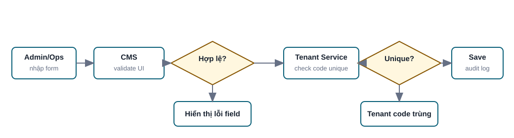

### f. Screen Flow

1. Tenant List.
2. Create Tenant.
3. Tenant Detail hoặc Tenant List sau khi tạo thành công.

Mockup:

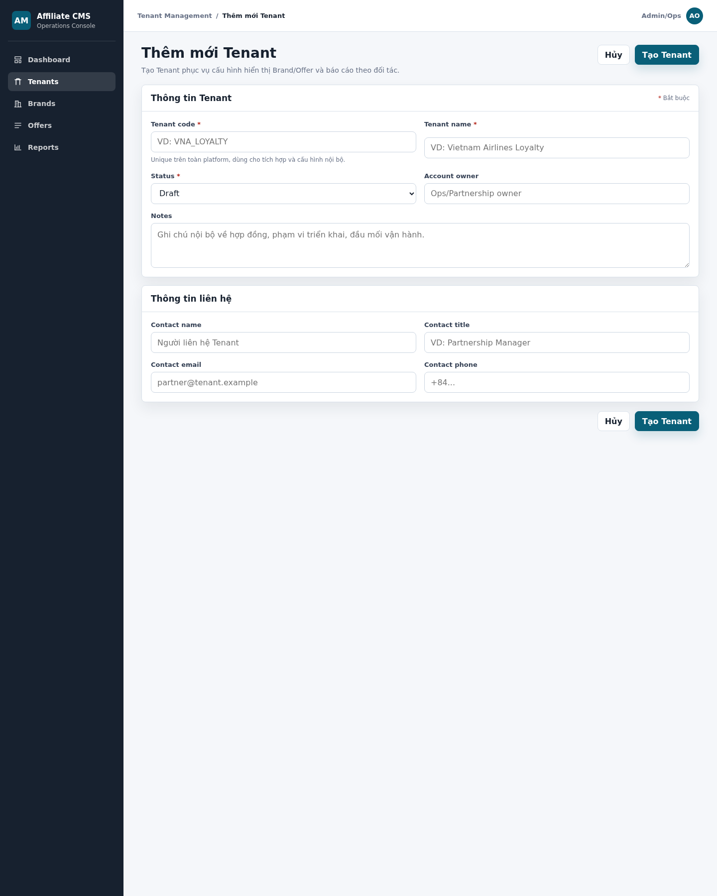

HTML mockup đầy đủ: [cms-tenant-create.html](../mockups/cms-tenant-create.html)

### g. Screen Description

Screen 1: Create Tenant

| # | Items | R/O | Control type | Data type | Description / Validation / Error handling |
|---:|---|---|---|---|---|
| 1 | Tenant code | R | Textbox | Text | Mã định danh Tenant. Chỉ cho nhập chữ không dấu, số, `_`, `-`; khuyến nghị uppercase; tối đa 50 ký tự. Unique toàn Platform. Nếu trống hiển thị `Vui lòng nhập Tenant code`; nếu trùng hiển thị `Tenant code đã tồn tại`; nếu sai định dạng hiển thị `Tenant code chỉ gồm chữ, số, "_" hoặc "-"`. |
| 2 | Tenant name | R | Textbox | Text | Tên Tenant. Tối đa 255 ký tự. Nếu trống hiển thị `Vui lòng nhập Tenant name`; nếu quá dài hiển thị lỗi giới hạn ký tự. |
| 3 | Status | R | Dropdown | Enum | Draft, Active, Inactive. Mặc định `Draft`. Chỉ role có quyền phù hợp mới được tạo trực tiếp Active. |
| 4 | Account owner | O | Textbox/Dropdown | User/Text | Người phụ trách nội bộ. Nếu là dropdown, chỉ chọn user active. |
| 5 | Notes | O | Textarea | Text | Ghi chú nội bộ về hợp đồng, phạm vi triển khai, đầu mối vận hành. Không hiển thị End user. |
| 6 | Contact name | O | Textbox | Text | Người liên hệ Tenant. Tối đa 120 ký tự. |
| 7 | Contact title | O | Textbox | Text | Chức danh người liên hệ. Tối đa 120 ký tự. |
| 8 | Contact email | O | Textbox | Email | Email liên hệ. Nếu nhập phải đúng định dạng email; nếu sai hiển thị `Contact email không hợp lệ`. |
| 9 | Contact phone | O | Textbox | Text | Số điện thoại. Cho phép số, khoảng trắng, `+`, `-`, `(`, `)`. Nếu sai định dạng hiển thị `Contact phone không hợp lệ`. |
| 10 | Cancel | O | Button | Click | Hủy thao tác. Nếu có dữ liệu chưa lưu, hiển thị confirmation. |
| 11 | Create Tenant | R | Button | Click | Submit tạo Tenant. Nếu có lỗi, focus vào field lỗi đầu tiên; nếu hợp lệ, tạo Tenant và ghi audit log. |

### h. Logic Description

| # | Step | Actor/Object | Logic |
|---:|---|---|---|
| 1 | Input data | Admin/Ops | Nhập thông tin Tenant và contact. |
| 2 | Validate UI | CMS Interface | Kiểm tra required fields, email, phone, format Tenant code. |
| 3 | Validate server | Tenant Service | Kiểm tra Tenant code unique và quyền tạo status Active. |
| 4 | Save | Tenant Service | Tạo Tenant ở status được chọn. |
| 5 | Audit | Audit Service | Ghi action `CREATE_TENANT`. |

### i. Business Rules

| BR ID | Rule |
|---|---|
| BR-TENANT-002-01 | Tenant code là bắt buộc và unique toàn Platform. |
| BR-TENANT-002-02 | Tạo Tenant không tự động assign Brand/Offer. |
| BR-TENANT-002-03 | Tạo Tenant không tự động cấu hình domain, branding, locale, revenue share hoặc earn display. |
| BR-TENANT-002-04 | Domain/branding/locale do dev team/Ops xử lý ngoài CMS khi setup Tenant mới. |

### j. Acceptance Criteria

| AC ID | Criteria |
|---|---|
| AC-TENANT-002-01 | Admin/Ops tạo được Tenant khi nhập Tenant code, Tenant name và status hợp lệ. |
| AC-TENANT-002-02 | Hệ thống không cho lưu nếu Tenant code trống, sai định dạng hoặc bị trùng. |
| AC-TENANT-002-03 | Form tạo Tenant không có field domain/branding/locale/loyalty integration. |
| AC-TENANT-002-04 | Sau khi tạo thành công, hệ thống ghi audit log. |

## 3. CMS-TENANT-USER-001 - Quản lý tài khoản Tenant Portal của Tenant

### a. Introduction

Chức năng cho phép Admin/Ops tạo tài khoản đăng nhập Portal Tenant, chọn tab `Tài khoản Tenant Portal` để xem toàn bộ tài khoản thuộc Tenant, tạo tài khoản Admin Tenant ban đầu, xem chi tiết và chỉnh sửa tài khoản.

Danh sách tại CMS dùng chung nguồn Tenant User với màn `Account settings > Accounts` trên Tenant Portal. Vì vậy, ngoài tài khoản được CMS tạo, danh sách còn hiển thị các tài khoản nhân viên được Admin Tenant tạo từ Tenant Portal. Mọi dữ liệu và thao tác phải được giới hạn theo Tenant đang xem.

### b. Actors/Objects

| Actor/Object | Role |
|---|---|
| Admin/Ops | Xem danh sách, lọc, tạo, xem chi tiết và chỉnh sửa tài khoản Tenant Portal trong Tenant Detail. |
| Admin Tenant | Tạo và quản lý thêm tài khoản nhân viên từ Tenant Portal; dữ liệu được đồng bộ về cùng danh sách trên CMS. |
| CMS Interface | Hiển thị tab tài khoản, bộ lọc, danh sách và popup Add/View/Edit. |
| Tenant User Service | Cung cấp nguồn dữ liệu dùng chung, validate và lưu tài khoản gắn với Tenant. |
| RBAC Service | Cung cấp Role hợp lệ và Permission hiệu lực của tài khoản. |
| Auth/Session Service | Xác thực trạng thái tài khoản, khóa sau số lần đăng nhập sai và vô hiệu hóa session khi cần. |
| Audit Service | Ghi log tạo và cập nhật tài khoản; không ghi mật khẩu plain text. |

### c. Pre-conditions

- Tenant tồn tại.
- Admin/Ops đã mở đúng Tenant Detail và có quyền xem/quản lý Tenant Portal account.
- Tenant User Service, RBAC Service và Auth/Session Service khả dụng.
- Khi tạo mới, Username chưa tồn tại trong Tenant hiện tại sau khi trim/normalize; kiểm tra bao gồm Account của cùng Tenant được tạo từ CMS và Tenant Portal.

### d. Expected Result

- CMS hiển thị đầy đủ tài khoản cùng `tenant_id`, bao gồm tài khoản do CMS và Tenant Portal tạo.
- Admin/Ops lọc được danh sách theo Keyword, Role và Status.
- Admin/Ops tạo được tài khoản Admin Tenant, xem chi tiết và cập nhật dữ liệu hợp lệ.
- Tài khoản luôn gắn đúng Tenant, không nhận Role/Permission nội bộ Platform.
- Password được hash và mọi thay đổi được ghi Audit Log.

### e. Logic Diagram

1. Admin/Ops mở Tenant Detail và chọn tab `Tài khoản Tenant Portal`.
2. CMS tải các Tenant User có cùng `tenant_id`.
3. Admin/Ops có thể lọc danh sách hoặc chọn Add/View/Edit.
4. Với Add/Edit, CMS validate phía client; Tenant User Service tiếp tục validate Tenant, Username, Role, Status và password.
5. Nếu hợp lệ, hệ thống lưu dữ liệu, xử lý session khi Role/Status/Password thay đổi, ghi Audit Log và tải lại danh sách.
6. Nếu không hợp lệ, popup được giữ nguyên, trường lỗi được highlight và hiển thị thông báo tương ứng.

### f. Screen Flow

1. Sau khi tạo Tenant hoặc từ Tenant List, Admin/Ops click `View` để mở Tenant Detail.
2. Admin/Ops chọn tab `Tài khoản Tenant Portal`; hệ thống tải bộ lọc và danh sách tài khoản.
3. Admin/Ops nhập Keyword/chọn Role/Status và click `Áp dụng`; click `Đặt lại` để đưa bộ lọc về mặc định.
4. Admin/Ops click `+ Thêm mới tài khoản` tại Tenant context để mở popup Add.
5. Sau khi tạo hợp lệ, hệ thống đóng popup, tải lại danh sách và hiển thị tài khoản mới.
6. Click `View` tại một dòng để mở popup read-only; click `Edit user` trong popup View hoặc `Edit` tại danh sách để mở popup Edit.
7. Khi lưu Edit hợp lệ, hệ thống cập nhật user, xử lý quyền/session nếu cần, ghi Audit Log và tải lại danh sách.

### g. Screen Description

**Screen 1 — Tenant Portal Account List**

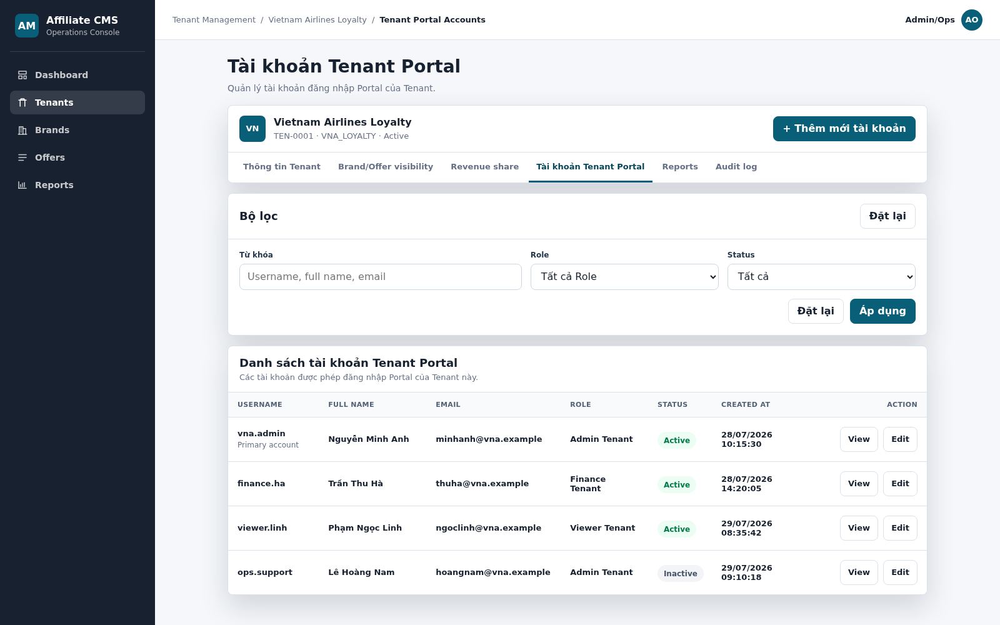

| # | Item | Control type | Data type | Source | Description / Validation / Error handling |
|---:|---|---|---|---|---|
| 1 | Tenant context | Read-only block | Tenant reference | Tenant Store | Hiển thị Tenant Name, Tenant ID, Tenant Code và Status của Tenant đang xem. Mọi truy vấn/action bên dưới tự động gắn `tenant_id`; không cho chọn Tenant khác tại tab này. |
| 2 | Tab `Tài khoản Tenant Portal` | Tab | Action | Static UI + route state | Click để tải danh sách tài khoản thuộc Tenant. Các tab còn lại giữ nguyên nghiệp vụ Tenant Detail. |
| 3 | `+ Thêm mới tài khoản` | Button | Action | Permission + UI | Nằm bên phải Tenant context. Chỉ hiển thị/enable khi Admin/Ops có quyền quản lý Tenant User; click mở Screen 2. |
| 4 | Keyword | Textbox | Text | User input | Tìm theo Username, Full Name hoặc Email. Trim khoảng trắng đầu/cuối; tìm kiếm không phân biệt chữ hoa/thường. |
| 5 | Role | Dropdown | Role reference | RBAC Service | Mặc định `Tất cả Role`; MVP1 gồm bốn System Role Portal Tenant: `Admin Tenant`, `Marketing/Ops Tenant`, `Finance Tenant`, `Viewer Tenant`. Custom Role chỉ xuất hiện từ Phase 2. |
| 6 | Status | Dropdown | Enum | Tenant User Service | Mặc định `Tất cả`; cho phép lọc `Active`, `Inactive`, `Locked`. |
| 7 | `Đặt lại` | Button | Action | UI state | Xóa Keyword, đưa Role/Status về mặc định và tải lại danh sách không filter. |
| 8 | `Áp dụng` | Button | Action | Query API | Gửi đồng thời Keyword, Role, Status cùng `tenant_id`. Nếu không có dữ liệu, hiển thị `No user accounts found.` |
| 9 | Username | Table column | Text | Tenant User Service | Username đăng nhập Tenant Portal. Dòng primary account có thể hiển thị chú thích `Primary account`. |
| 10 | Full Name | Table column | Text | Tenant User Service | Họ tên hiện tại; thay đổi từ CMS hoặc Profile/Tenant Portal phải phản ánh tại đây. |
| 11 | Email | Table column | Email | Tenant User Service | Email hiện tại của tài khoản. |
| 12 | Role | Table column | Role reference | RBAC Service | Role hiện được gán cho user; một user có đúng một Role tại một thời điểm. |
| 13 | Status | Badge | Enum | Tenant User/Auth Service | `Active`, `Inactive` hoặc `Locked`. `Locked` được đồng bộ khi Auth Service khóa tài khoản sau 5 lần đăng nhập sai liên tiếp. |
| 14 | Created At | Table column | DateTime | Tenant User Service | Thời điểm tạo tài khoản, định dạng `dd/mm/yyyy hh:mm:ss`; không hiển thị người tạo trong cột này. |
| 15 | View | Button | Action | Tenant User Detail API | Mở Screen 3 của đúng tài khoản và đúng Tenant. |
| 16 | Edit | Button | Action | Permission + Tenant User Detail API | Mở Screen 4. Nếu không có quyền cập nhật, action bị ẩn/disable và API vẫn phải từ chối truy cập. |

**Screen 2 — Add Tenant Portal Account**

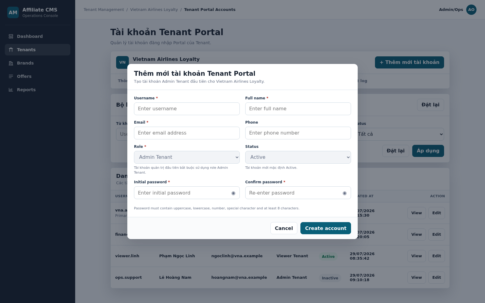

| # | Item | Control type | Data type | R/O | Description / Validation / Error handling |
|---:|---|---|---|---|---|
| 1 | Username | Textbox | Text | R | Trim đầu/cuối và normalize không phân biệt chữ hoa/chữ thường; cho chữ, số và dấu `_`, không cho khoảng trắng. Unique theo tổ hợp `tenant_id + normalized_username`: không được trùng trong cùng Tenant nhưng cùng Username có thể tồn tại ở Tenant khác. Phạm vi kiểm tra gồm Account của Tenant hiện tại được tạo từ CMS và Tenant Portal. CMS User thuộc authentication realm riêng và không tham gia kiểm tra unique. Trống: `Username is required.`; sai định dạng: `Username contains invalid characters.`; trùng trong Tenant hiện tại: `Username already exists.` |
| 2 | Full Name | Textbox | Text | R | Tối đa 150 ký tự. Trống: `Full Name is required.` |
| 3 | Email | Textbox | Email | R | Tối đa 254 ký tự và đúng định dạng. Trống: `Email is required.`; sai: `Please enter a valid email address.` |
| 4 | Phone | Textbox | Text | O | Cho chữ số và ký tự `+`, tối đa 20 ký tự. Sai: `Please enter a valid phone number.` |
| 5 | Role | Dropdown/Conditional disabled | Role reference | R | Nếu Tenant chưa có Admin Tenant Active, field bị khóa tại `Admin Tenant` để tạo tài khoản quản trị đầu tiên. Khi Tenant đã có Admin Tenant Active, MVP1 cho chọn `Admin Tenant`, `Marketing/Ops Tenant`, `Finance Tenant` hoặc `Viewer Tenant`. Custom Role thuộc Deferred/Phase 2. Không hiển thị/cho gán Role Platform Admin/Ops hoặc Role của Tenant khác. |
| 6 | Status | Disabled dropdown | Enum | R | Mặc định `Active` để tài khoản có thể đăng nhập sau khi bàn giao. |
| 7 | Initial password | Password input | Secret | R | Có icon hiện/ẩn; tối thiểu 8 ký tự gồm chữ hoa, chữ thường, số và ký tự đặc biệt. Trống: `Initial password is required.`; sai policy: `Password does not meet the requirements.` |
| 8 | Confirm password | Password input | Secret | R | Có icon hiện/ẩn. Trống: `Confirm password is required.`; không khớp: `Passwords do not match.` |
| 9 | Cancel | Button | Action | O | Đóng popup, không tạo tài khoản. Nếu có dữ liệu thay đổi, yêu cầu xác nhận trước khi đóng. |
| 10 | Create account | Button | Action | O | Validate, tạo user với `tenant_id`, hash password, ghi Audit Log và tải lại Screen 1. Lỗi server giữ nguyên popup và dữ liệu không nhạy cảm đã nhập. |

**Screen 3 — View Tenant Portal Account**

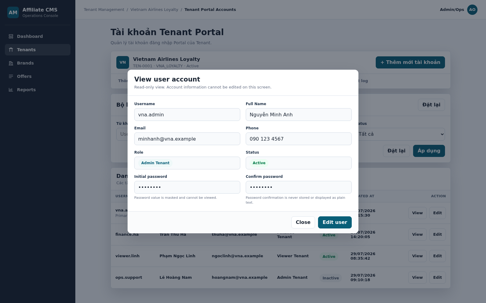

Màn hình chỉ cho phép xem thông tin. Tất cả trường dữ liệu đều read-only và không thể chỉnh sửa tại Screen 3. Muốn cập nhật, Admin/Ops phải click `Edit user` để chuyển sang Screen 4.

| # | Item | Control type | Data type | R/O | Description / Validation / Error handling |
|---:|---|---|---|---|---|
| 1 | Username | Read-only field | Text | O | Hiển thị Username; chỉ xem và không cho chỉnh sửa. |
| 2 | Full Name | Read-only field | Text | O | Hiển thị Full Name hiện tại; chỉ xem và không cho chỉnh sửa. |
| 3 | Email | Read-only field | Email | O | Hiển thị Email hiện tại; chỉ xem và không cho chỉnh sửa. |
| 4 | Phone | Read-only field | Text | O | Hiển thị Phone hiện tại; chỉ xem và không cho chỉnh sửa. |
| 5 | Role | Read-only field/Badge | Role reference | O | Hiển thị Role hiện tại và Permission hiệu lực; chỉ xem và không cho đổi Role tại màn này. |
| 6 | Status | Read-only field/Badge | Enum | O | Hiển thị `Active`, `Inactive` hoặc `Locked`; chỉ xem và không cho đổi Status tại màn này. |
| 7 | Initial/Confirm password | Masked read-only fields | Secret | O | Chỉ hiển thị ký tự che minh họa; tuyệt đối không đọc password/confirm password từ database hoặc trả plain text qua API. |
| 8 | Close | Button | Action | O | Đóng popup và quay lại danh sách với filter hiện tại. |
| 9 | Edit user | Button | Action | O | Đóng View và mở Screen 4 của cùng user nếu Admin/Ops có quyền cập nhật. |

**Screen 4 — Edit Tenant Portal Account**

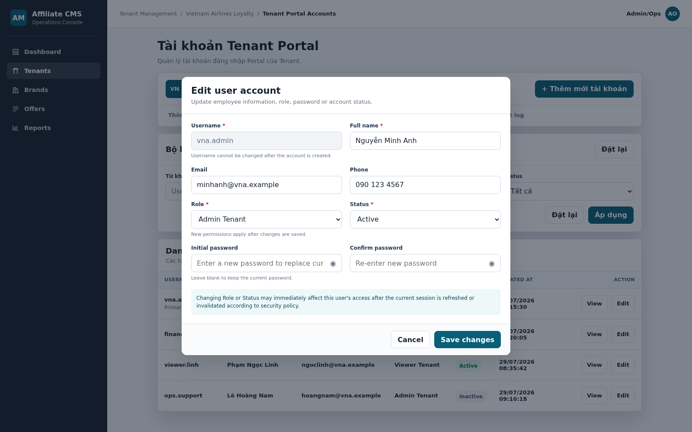

| # | Item | Control type | Data type | R/O | Description / Validation / Error handling |
|---:|---|---|---|---|---|
| 1 | Username | Disabled textbox | Text | O | Không cho sửa sau khi tạo. |
| 2 | Full Name | Textbox | Text | R | Hiển thị sẵn và cho sửa; trống: `Full Name is required.` |
| 3 | Email | Textbox | Email | O | Nếu nhập phải đúng định dạng; lỗi: `Please enter a valid email address.` |
| 4 | Phone | Textbox | Text | O | Nếu nhập phải đúng policy; lỗi: `Please enter a valid phone number.` |
| 5 | Role | Dropdown | Role reference | R | Chỉ cho chọn Role Active thuộc cùng Tenant; không cho Role Tenant khác hoặc Role Platform. Nếu Role hết Active khi lưu: `Selected role is no longer active.` |
| 6 | Status | Dropdown | Enum | R | Cho chọn `Active`, `Inactive`, `Locked`. Inactive/Locked chặn đăng nhập và làm mất hiệu lực session; chuyển Locked về Active reset failed-login counter. |
| 7 | Initial password | Password input | Secret | O | Để trống để giữ password hiện tại. Nếu nhập mới phải đạt password policy; không đọc lại password cũ. |
| 8 | Confirm password | Password input | Secret | O có điều kiện | Bắt buộc khi nhập Initial password mới; không khớp: `Passwords do not match.` |
| 9 | Cancel | Button | Action | O | Đóng popup và không lưu; nếu có dữ liệu thay đổi thì hiển thị xác nhận. |
| 10 | Save changes | Button | Action | O | Validate và cập nhật. Nếu Role/Status/Password đổi, hệ thống áp dụng quyền mới, vô hiệu hóa session theo policy, ghi Audit Log và tải lại danh sách. |

### h. Logic Description

| # | Step | Actor/Object | Logic |
|---:|---|---|---|
| 1 | Load list | CMS/Tenant User Service | Query user theo `tenant_id`, filter và pagination; không phân biệt nguồn tạo CMS hay Tenant Portal. |
| 2 | Authorize | CMS API | Kiểm tra quyền xem/tạo/sửa và Tenant context ở mỗi request. |
| 3 | Validate Add/Edit | CMS + Tenant User Service | Validate required, Username, email/phone, Role, Status và password. |
| 4 | Save | Tenant User Service | Tạo/cập nhật user và quan hệ user–Role trong cùng transaction. |
| 5 | Apply security | Auth/Session Service | Vô hiệu hóa session khi Role, Status hoặc Password thay đổi theo policy. |
| 6 | Audit | Audit Service | Ghi before/after, Tenant, user, người thao tác và thời gian; không ghi password. |
| 7 | Refresh | CMS Interface | Đóng popup khi thành công, tải lại danh sách và giữ filter hợp lệ. |

### i. Business Rules

| BR ID | Rule |
|---|---|
| BR-TENANT-USER-001-01 | CMS chỉ trả và cập nhật user có cùng `tenant_id` với Tenant Detail đang mở. |
| BR-TENANT-USER-001-02 | Danh sách hợp nhất tài khoản do CMS và Tenant Portal tạo; hai kênh dùng chung Tenant User record. |
| BR-TENANT-USER-001-03 | Username unique theo tổ hợp `tenant_id + normalized_username` sau khi trim/normalize không phân biệt chữ hoa/chữ thường. Không được trùng trong cùng Tenant; cùng Username được phép tồn tại ở Tenant khác. Phạm vi kiểm tra gồm Account của cùng Tenant được tạo từ CMS và Tenant Portal. Username không được sửa sau khi tạo; Account `Inactive/Locked` vẫn giữ Username trong Tenant đó và không cho tái sử dụng. CMS User thuộc authentication realm riêng. |
| BR-TENANT-USER-001-04 | Tài khoản đầu tiên do CMS khởi tạo cho Tenant bắt buộc là `Admin Tenant` và `Active`. Sau khi đã có ít nhất một Admin Tenant Active, MVP1 cho phép CMS tạo thêm user với `Admin Tenant`, `Marketing/Ops Tenant`, `Finance Tenant` hoặc `Viewer Tenant`; Custom Role thuộc Deferred/Phase 2. Không được gán Role/Permission Platform Admin/Ops. |
| BR-TENANT-USER-001-05 | Mỗi user có đúng một Role thuộc cùng Tenant; chỉ Role Active được gán mới. |
| BR-TENANT-USER-001-06 | Password phải hash; Confirm password không lưu; UI/API/Audit không trả hoặc ghi plain text. |
| BR-TENANT-USER-001-07 | User chỉ truy cập khi Tenant, User và Role đều Active. Inactive/Locked hoặc Role Inactive làm quyền truy cập mất hiệu lực. |
| BR-TENANT-USER-001-08 | Đổi Role, Status hoặc Password phải xử lý session/token theo security policy. |
| BR-TENANT-USER-001-09 | Không được Inactive/Locked Admin Tenant Active cuối cùng nếu thao tác làm Tenant không còn tài khoản quản trị hợp lệ. |
| BR-TENANT-USER-001-10 | Tạo/cập nhật/đổi Role/Status/mở khóa phải ghi Audit Log đầy đủ trước/sau. |
| BR-TENANT-USER-001-11 | Screen 3 là màn read-only: không trường nào được phép nhập hoặc cập nhật trực tiếp; mọi thay đổi phải thực hiện tại Screen 4 sau khi click `Edit user`. |

### j. Acceptance Criteria

| AC ID | Criteria |
|---|---|
| AC-TENANT-USER-001-01 | Tab tài khoản hiển thị đúng tất cả user cùng Tenant, bao gồm user do CMS và Tenant Portal tạo. |
| AC-TENANT-USER-001-02 | Keyword, Role và Status lọc đúng dữ liệu; Đặt lại khôi phục danh sách mặc định. |
| AC-TENANT-USER-001-03 | Admin/Ops có quyền mở được Add/View/Edit; user không có quyền bị chặn ở UI và API. |
| AC-TENANT-USER-001-04 | Add bắt buộc Username, Full Name, Email, Role, Status, Initial password và Confirm password theo mockup. |
| AC-TENANT-USER-001-05 | Username trùng/sai định dạng và password sai policy/không khớp đều bị chặn với đúng thông báo. |
| AC-TENANT-USER-001-06 | User đầu tiên gắn đúng `tenant_id`, bắt buộc Admin Tenant/Active. Trong MVP1, user tiếp theo chọn được một trong bốn System Role Active thuộc cùng Tenant; không thể chọn Custom Role, Role Platform hoặc Role Tenant khác. |
| AC-TENANT-USER-001-07 | View chỉ hiển thị read-only; password luôn masked và không được trả plain text. |
| AC-TENANT-USER-001-08 | Edit không cho sửa Username; cho cập nhật Full Name, Email, Phone, Role, Status và password mới hợp lệ. |
| AC-TENANT-USER-001-09 | Đổi Role/Status/Password áp dụng đúng quyền mới, xử lý session và ghi Audit Log. |
| AC-TENANT-USER-001-10 | Created At hiển thị `dd/mm/yyyy hh:mm:ss` và không hiển thị tên người tạo trong cột. |

## 4. CMS-TENANT-003 - Sửa Tenant / Xem chi tiết Tenant

### a. Introduction

Chức năng cho phép Admin/Ops xem chi tiết Tenant và cập nhật thông tin cơ bản, contact, owner, notes và status.

### b. Actors/Objects

| Actor/Object | Role |
|---|---|
| Admin/Ops | Xem/sửa thông tin Tenant. |
| CMS Interface | Hiển thị detail/edit form. |
| Tenant Service | Load, validate và cập nhật Tenant. |
| Audit Service | Ghi log old/new value. |

### c. Pre-conditions

- Tenant tồn tại.
- Admin/Ops có quyền `tenant.read` để xem và `tenant.update` để sửa.

### d. Expected Result

- Tenant detail hiển thị đúng dữ liệu.
- Tenant được cập nhật nếu dữ liệu hợp lệ.
- Audit log ghi nhận thay đổi.

### e. Logic Diagram

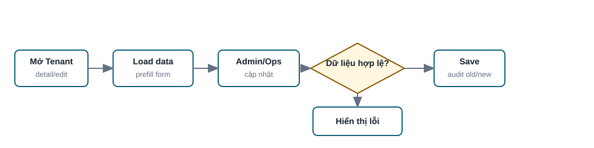

### f. Screen Flow

1. Tenant List.
2. Tenant Detail/Edit Tenant.
3. Back to Tenant Detail/List.

### g. Screen Description

Screen 1: Tenant Detail/Edit

| # | Items | Control type | Data type | Description / Validation / Error handling |
|---:|---|---|---|---|
| 1 | Tenant code | Textbox/Label | Text | Hiển thị Tenant code hiện tại. Không cho sửa nếu Tenant đã có dữ liệu liên kết, trừ khi có migration policy. Nếu cố sửa khi không được phép hiển thị `Tenant code không thể thay đổi vì đã có dữ liệu liên kết`. |
| 2 | Tenant name | Textbox | Text | Required khi edit. Tối đa 255 ký tự. |
| 3 | Status | Dropdown | Enum | Draft, Active, Inactive. Nếu chuyển Inactive, landing page của Tenant không còn public theo policy. |
| 4 | Account owner | Textbox/Dropdown | User/Text | Người phụ trách nội bộ. |
| 5 | Notes | Textarea | Text | Ghi chú nội bộ, không hiển thị End user. |
| 6 | Contact fields | Inputs | Mixed | Contact name, title, email, phone; validate giống Create Tenant. |
| 7 | Save | Button | Click | Lưu thay đổi. Nếu có conflict version/updated_at, hiển thị `Dữ liệu đã được cập nhật bởi người khác, vui lòng tải lại`. |
| 8 | Cancel | Button | Click | Hủy thay đổi và quay lại màn trước. |

### h. Logic Description

| # | Step | Actor/Object | Logic |
|---:|---|---|---|
| 1 | Load data | Tenant Service | Lấy Tenant theo `tenant_id`. |
| 2 | Edit | Admin/Ops | Cập nhật thông tin Tenant. |
| 3 | Validate | Tenant Service | Validate format, required fields, Tenant code policy. |
| 4 | Save | Tenant Service | Cập nhật Tenant nếu hợp lệ. |
| 5 | Audit | Audit Service | Ghi old/new value. |

### i. Business Rules

| BR ID | Rule |
|---|---|
| BR-TENANT-003-01 | Không cho sửa Tenant code nếu Tenant đã có dữ liệu liên kết, trừ khi có migration policy. |
| BR-TENANT-003-02 | Tenant Inactive không hiển thị landing page public. |
| BR-TENANT-003-03 | Sửa Tenant không làm mất visibility, revenue share và audit history. |

### j. Acceptance Criteria

| AC ID | Criteria |
|---|---|
| AC-TENANT-003-01 | Admin/Ops xem được chi tiết Tenant khi có quyền `tenant.read`. |
| AC-TENANT-003-02 | Admin/Ops sửa được Tenant khi có quyền `tenant.update` và dữ liệu hợp lệ. |
| AC-TENANT-003-03 | Hệ thống chặn sửa Tenant code khi đã có dữ liệu liên kết và chưa có migration policy. |
| AC-TENANT-003-04 | Sau khi sửa thành công, audit log ghi nhận old/new value theo policy. |

## 5. CMS-TENANT-004 - Ngưng hoạt động Tenant

### a. Introduction

Chức năng cho phép Admin/Ops chuyển Tenant sang Inactive/deactivate theo policy vận hành.

### b. Actors/Objects

| Actor/Object | Role |
|---|---|
| Admin/Ops | Chọn action ngưng hoạt động. |
| CMS Interface | Hiển thị confirmation. |
| Tenant Service | Kiểm tra dữ liệu liên kết và cập nhật status. |
| Audit Service | Ghi log. |

### c. Pre-conditions

- Tenant tồn tại.
- Admin/Ops có quyền `tenant.deactivate`.

### d. Expected Result

- Tenant chuyển Inactive.
- Tenant không còn public landing page.
- Không hard delete dữ liệu đã phát sinh liên kết.

### e. Logic Diagram

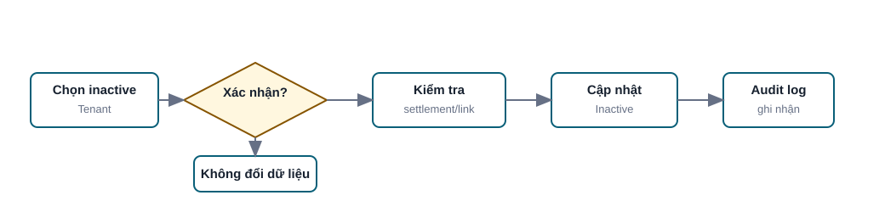

### f. Screen Flow

1. Tenant List hoặc Tenant Detail.
2. Confirmation dialog.
3. Tenant List/Detail sau khi cập nhật status.

### g. Screen Description

Screen 1: Deactivate Confirmation

| # | Items | Control type | Data type | Description / Validation / Error handling |
|---:|---|---|---|---|
| 1 | Confirmation message | Label | Text | Thông báo rõ Tenant sau khi inactive sẽ không public landing page và không hiển thị marketplace cho End user. |
| 2 | Cancel | Button | Click | Đóng popup, không thay đổi dữ liệu. |
| 3 | Confirm | Button | Click | Xác nhận deactivate. Nếu không có quyền, hiển thị `Bạn không có quyền ngưng hoạt động Tenant`. |

### h. Logic Description

| # | Step | Actor/Object | Logic |
|---:|---|---|---|
| 1 | Confirm action | Admin/Ops | Xác nhận muốn ngưng hoạt động Tenant. |
| 2 | Dependency check | Tenant Service | Kiểm tra settlement/dữ liệu liên kết theo policy. |
| 3 | Update status | Tenant Service | Chuyển Tenant sang Inactive, không hard delete dữ liệu. |
| 4 | Audit | Audit Service | Ghi action `DEACTIVATE_TENANT`. |

### i. Business Rules

| BR ID | Rule |
|---|---|
| BR-TENANT-004-01 | Không hard delete Tenant đã có dữ liệu click/order/commission/settlement. |
| BR-TENANT-004-02 | Tenant Inactive không hiển thị landing page public. |
| BR-TENANT-004-03 | Không xóa lịch sử transaction, visibility, revenue share hoặc audit log khi Tenant inactive. |

### j. Acceptance Criteria

| AC ID | Criteria |
|---|---|
| AC-TENANT-004-01 | Admin/Ops có quyền có thể deactivate Tenant sau khi xác nhận. |
| AC-TENANT-004-02 | Tenant đã có dữ liệu liên kết không bị hard delete. |
| AC-TENANT-004-03 | Sau khi Tenant inactive, landing page public bị chặn hoặc không khả dụng theo policy. |
| AC-TENANT-004-04 | Hệ thống ghi audit log cho thao tác deactivate. |

## 6. CMS-TENANT-VIS-001 - Cấu hình Brand/Offer Assignment Pool

### a. Introduction

Chức năng cho phép Admin/Ops cấu hình Brand/Offer nào được phép nằm trong pool hiển thị của Tenant. Đây là tầng 1 của visibility. Tenant Portal là tầng 2, nơi Tenant bật/tắt Brand/Offer trong pool đã được assign. Khi chọn Brand, hệ thống mặc định đưa tất cả Offer active của Brand vào pool; nếu cần, Admin/Ops mở popup để chỉnh Offer riêng.

### b. Actors/Objects

| Actor/Object | Role |
|---|---|
| Admin/Ops | Chọn Brand/Offer được phép hiển thị cho Tenant. |
| CMS Interface | Hiển thị danh sách Brand và popup Offer assignment. |
| Visibility Service | Lưu Admin assignment pool. |
| Brand/Offer Service | Cung cấp danh sách Brand/Offer active. |
| Audit Service | Ghi log. |

### c. Pre-conditions

- Tenant tồn tại.
- Admin/Ops có quyền `tenant.visibility.read` và `tenant.visibility.update`.
- Brand/Offer tồn tại trong hệ thống.

### d. Expected Result

- Brand/Offer assignment pool được lưu cho Tenant.
- Landing page chỉ hiển thị Brand/Offer active khi thỏa đồng thời `assignment_status = Active` và `tenant_visibility_status = Visible`.

### e. Logic Diagram

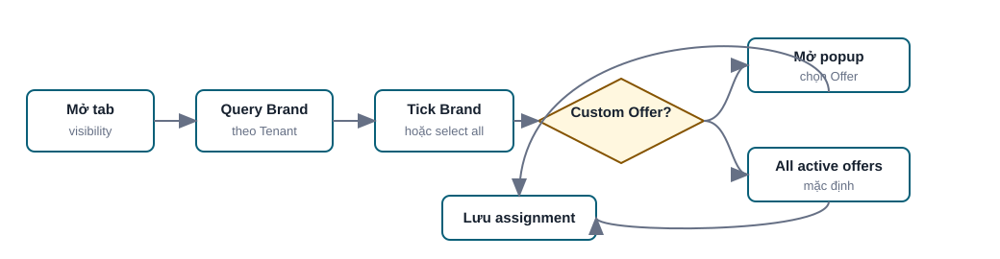

### f. Screen Flow

1. Tenant Detail.
2. Brand/Offer assignment tab.
3. Optional: Offer assignment popup.
4. Save assignment pool.

Mockup:

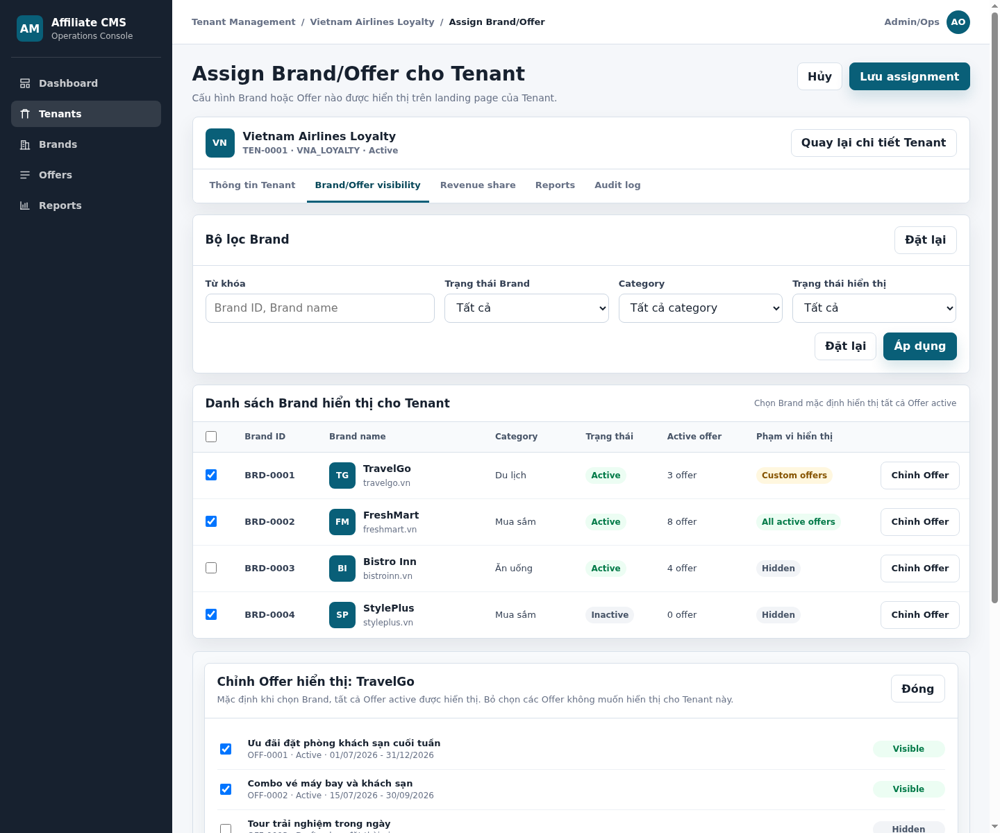

HTML mockup đầy đủ: [cms-tenant-assign-brand-offer.html](../mockups/cms-tenant-assign-brand-offer.html)

### g. Screen Description

Screen 1: Tenant Brand/Offer Assignment Pool

| # | Items | Control type | Data type | Description / Validation / Error handling |
|---:|---|---|---|---|
| 1 | Keyword | Textbox | Text | Tìm theo Brand ID hoặc Brand name. Không tìm theo URL. |
| 2 | Brand status | Dropdown | Enum | Tất cả, Active, Inactive. |
| 3 | Category | Dropdown | Ref | Lọc theo category của Brand. |
| 4 | Assignment status | Dropdown | Enum | Tất cả, Đã assign, Chưa assign, Có chỉnh Offer riêng. |
| 5 | Header checkbox | Checkbox | Boolean | Tick/bỏ tick toàn bộ Brand trong danh sách hiện tại. |
| 6 | Brand checkbox | Checkbox | Boolean | Chọn Brand vào pool được phép hiển thị cho Tenant. Khi chọn Brand, mặc định tất cả Offer active được đưa vào pool. |
| 7 | Brand ID | Label | ReadOnly | ID Brand. |
| 8 | Brand name | Label | Text | Tên Brand. |
| 9 | Category | Label | Text | Category của Brand. |
| 10 | Active offer | Label | Number | Số Offer active của Brand. |
| 11 | Assignment scope | Badge | Enum | Not assigned, All active offers, Custom offers. |
| 12 | Chỉnh Offer | Button | Click | Mở popup để chọn/bỏ chọn Offer cụ thể. |
| 13 | Save assignment | Button | Click | Lưu assignment pool. Nếu Tenant inactive hoặc Brand inactive theo policy, hiển thị lỗi và không lưu active assignment. |

Screen 2: Offer Assignment Popup

| # | Items | Control type | Data type | Description / Validation / Error handling |
|---:|---|---|---|---|
| 1 | Offer checkbox | Checkbox | Boolean | Chọn/bỏ chọn Offer cụ thể trong pool được phép hiển thị. Offer inactive hiển thị disabled hoặc không cho chọn. |
| 2 | Offer info | Label | Text | Hiển thị Offer ID/title/status. |
| 3 | Save Offer assignment | Button | Click | Lưu custom Offer assignment cho Brand trong Tenant. |
| 4 | Cancel | Button | Click | Đóng popup; nếu có thay đổi chưa lưu thì hiển thị confirmation. |

### h. Logic Description

| # | Step | Actor/Object | Logic |
|---:|---|---|---|
| 1 | Open tab | Admin/Ops | Mở tab Brand/Offer assignment trong Tenant detail. |
| 2 | Query | Visibility Service | Lấy danh sách Brand và trạng thái assignment hiện tại. |
| 3 | Select Brand | Admin/Ops | Tick Brand; mặc định all active offers vào pool. |
| 4 | Custom Offer | Admin/Ops | Mở popup nếu cần chỉnh Offer riêng. |
| 5 | Save | Visibility Service | Lưu assignment pool và ghi audit log. |

### i. Business Rules

| BR ID | Rule |
|---|---|
| BR-TENANT-VIS-001-01 | Brand/Offer mặc định không nằm trong pool nếu chưa có `assignment_status = Active` cho Tenant. |
| BR-TENANT-VIS-001-02 | Chọn Brand mặc định đưa tất cả Offer active của Brand vào pool. |
| BR-TENANT-VIS-001-03 | Nếu có custom Offer assignment, chỉ Offer được tick và active mới nằm trong pool. |
| BR-TENANT-VIS-001-04 | Brand/Offer inactive không hiển thị trên landing page public. |
| BR-TENANT-VIS-001-05 | Visibility cuối cùng theo rule AND: `Admin assignment active` AND `Tenant visibility visible`. |
| BR-TENANT-VIS-001-06 | Khi Tenant chưa thao tác trong Tenant Portal, Brand/Offer đã được Admin assign active mặc định có `tenant_visibility_status = Visible`. |
| BR-TENANT-VIS-001-07 | Direct link đến Brand/Offer không thỏa visibility cuối cùng phải bị chặn hoặc redirect theo policy. |

### j. Acceptance Criteria

| AC ID | Criteria |
|---|---|
| AC-TENANT-VIS-001-01 | Admin/Ops xem được danh sách Brand với Brand ID, Brand name, Category, status, active offer count và assignment scope. |
| AC-TENANT-VIS-001-02 | Header checkbox cho phép chọn/bỏ chọn toàn bộ Brand trong danh sách hiện tại. |
| AC-TENANT-VIS-001-03 | Khi chọn Brand và không chỉnh Offer riêng, tất cả Offer active của Brand nằm trong pool. |
| AC-TENANT-VIS-001-04 | Khi chỉnh Offer riêng, chỉ Offer được tick và active nằm trong pool. |
| AC-TENANT-VIS-001-05 | Hệ thống ghi audit log khi lưu assignment pool. |

## 7. CMS-TENANT-RS-001 - Xem danh sách Revenue Share theo Brand

### a. Introduction

Chức năng cho phép Admin/Ops xem các Brand đã được chọn ở Brand/Offer visibility và trạng thái cấu hình revenue share cho Tenant.

### b. Actors/Objects

| Actor/Object | Role |
|---|---|
| Admin/Ops | Xem danh sách revenue share. |
| CMS Interface | Hiển thị filter, bảng và action Sửa/Cấu hình. |
| Revenue Share Service | Query rule và trạng thái cấu hình. |
| Visibility Service | Cung cấp danh sách Brand đã visible cho Tenant. |

### c. Pre-conditions

- Tenant tồn tại.
- Admin/Ops có quyền `tenant.revenue_share.read`.

### d. Expected Result

- Màn danh sách chỉ hiển thị Brand đã chọn ở Brand/Offer visibility.
- Admin/Ops thấy Brand nào đã cấu hình/chưa cấu hình revenue share.

### e. Logic Diagram

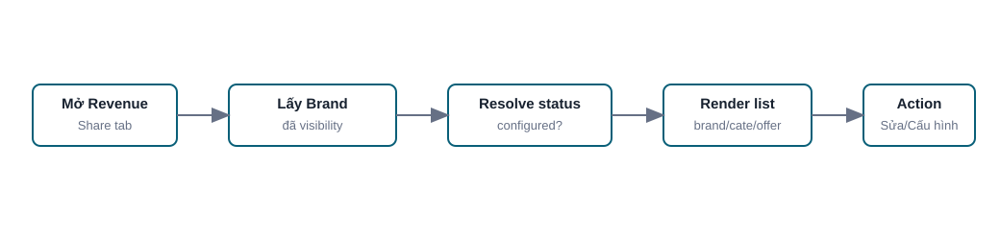

### f. Screen Flow

1. Tenant Detail.
2. Revenue share tab.
3. Action Sửa/Cấu hình cho từng Brand.

Mockup:

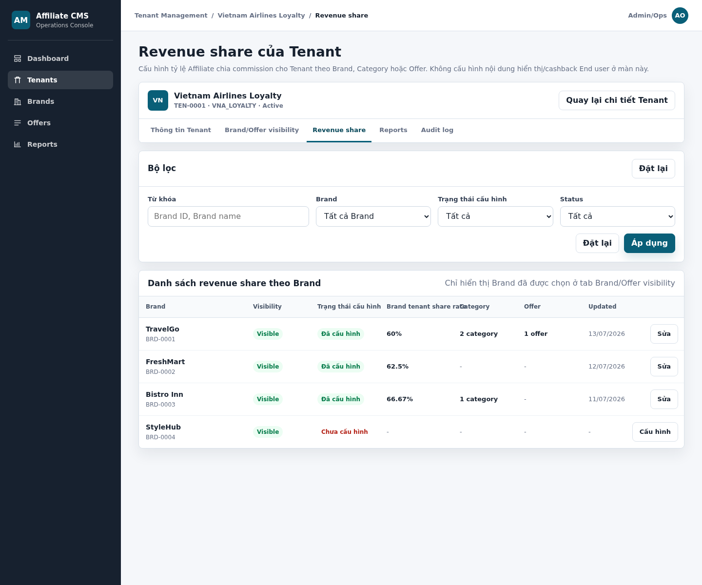

HTML mockup đầy đủ: [cms-tenant-revenue-share.html](../mockups/cms-tenant-revenue-share.html)

### g. Screen Description

Screen 1: Tenant Revenue Share List

| # | Items | Control type | Data type | Description / Validation / Error handling |
|---:|---|---|---|---|
| 1 | Keyword | Textbox | Text | Tìm theo Brand ID hoặc Brand name. |
| 2 | Brand | Dropdown | Ref | Lọc theo Brand đã visible cho Tenant. |
| 3 | Config status | Dropdown | Enum | Tất cả, Đã cấu hình, Chưa cấu hình. |
| 4 | Status | Dropdown | Enum | Tất cả, Active, Draft, Inactive. |
| 5 | Brand | Label | Ref/Text | Hiển thị Brand ID và Brand name. |
| 6 | Visibility | Badge | Enum | Visible/Hidden theo assignment hiện tại. |
| 7 | Trạng thái cấu hình | Badge | Enum | Đã cấu hình hoặc Chưa cấu hình. |
| 8 | Brand tenant share rate | Label | Decimal percent | Hiển thị tỷ lệ mặc định theo Brand, ví dụ `60%`; nếu chưa có hiển thị `-`. Không hiển thị đơn vị VND vì Tenant revenue share chỉ dùng %. |
| 9 | Category | Label | Number/Text | Số category override đã cấu hình; nếu không có hiển thị `-`. |
| 10 | Offer | Label | Number/Text | Số offer override đã cấu hình; nếu không có hiển thị `-`. |
| 11 | Updated | Label | Datetime | Ngày cập nhật cuối. |
| 12 | Action | Button | Click | `Sửa` nếu đã cấu hình, `Cấu hình` nếu chưa cấu hình. Không có button thêm rule trên màn list. |

### h. Logic Description

| # | Step | Actor/Object | Logic |
|---:|---|---|---|
| 1 | Open tab | Admin/Ops | Mở tab Revenue share. |
| 2 | Get visible Brand | Visibility Service | Lấy danh sách Brand đã chọn ở Brand/Offer visibility. |
| 3 | Resolve config | Revenue Share Service | Kiểm tra Brand-level rule và override count. |
| 4 | Render list | CMS Interface | Hiển thị list với status configured/unconfigured. |
| 5 | Navigate | Admin/Ops | Click Sửa/Cấu hình để vào màn update. |

### i. Business Rules

| BR ID | Rule |
|---|---|
| BR-TENANT-RS-001-01 | Revenue share list chỉ hiển thị Brand đã được chọn ở Brand/Offer visibility. |
| BR-TENANT-RS-001-02 | Không có button thêm rule trên màn danh sách. |
| BR-TENANT-RS-001-03 | Không hiển thị resolved commission và affiliate keep trên màn danh sách. |
| BR-TENANT-RS-001-04 | Màn này không cấu hình customer cashback/earn display. |

### j. Acceptance Criteria

| AC ID | Criteria |
|---|---|
| AC-TENANT-RS-001-01 | Màn revenue share list chỉ hiển thị Brand đã selected ở visibility. |
| AC-TENANT-RS-001-02 | Cột trạng thái hiển thị đúng Đã cấu hình/Chưa cấu hình. |
| AC-TENANT-RS-001-03 | Cột Category/Offer hiển thị số lượng override hoặc `-`. |
| AC-TENANT-RS-001-04 | Không có button thêm rule trên màn danh sách. |
| AC-TENANT-RS-001-05 | Click Sửa/Cấu hình mở màn update đúng Tenant + Brand. |

## 8. CMS-TENANT-RS-002 - Cập nhật Tenant Revenue Share

### a. Introduction

Chức năng cho phép Admin/Ops cấu hình phần Affiliate chia cho Tenant bằng `tenant_share_rate%` theo Brand mặc định, và thêm override theo Category hoặc Offer khi cần. Cấu hình này không phải customer cashback/earn display và không hỗ trợ Fixed amount/VND cho Tenant share.

### b. Actors/Objects

| Actor/Object | Role |
|---|---|
| Admin/Ops | Nhập cấu hình revenue share. |
| CMS Interface | Hiển thị form default và override rows. |
| Revenue Share Service | Validate/lưu rule. |
| Brand/Offer Service | Cung cấp category/offer để chọn override. |
| Audit Service | Ghi log. |

### c. Pre-conditions

- Tenant tồn tại.
- Brand đã visible cho Tenant.
- Admin/Ops có quyền `tenant.revenue_share.update`.

### d. Expected Result

- Brand-level revenue share được lưu.
- Category/Offer override được lưu nếu có.
- Hệ thống resolve rule theo thứ tự Offer -> Category -> Brand.

### e. Logic Diagram

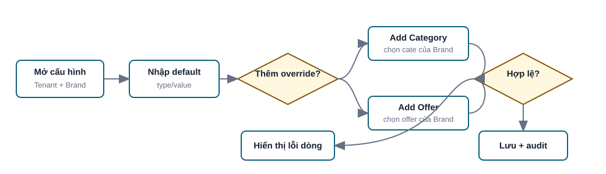

### f. Screen Flow

1. Tenant Revenue Share List.
2. Update Tenant Revenue Share.
3. Back to Revenue Share List.

Mockup:

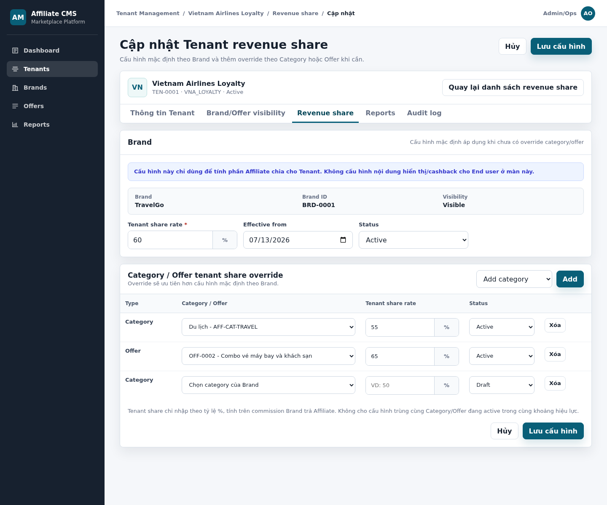

HTML mockup đầy đủ: [cms-tenant-revenue-share-update.html](../mockups/cms-tenant-revenue-share-update.html)

### g. Screen Description

Screen 1: Update Tenant Revenue Share

| # | Items | R/O | Control type | Data type | Description / Validation / Error handling |
|---:|---|---|---|---|---|
| 1 | Tenant context | R | Label | ReadOnly | Hiển thị Tenant đang cấu hình. Không cho đổi Tenant trong form. |
| 2 | Brand | R | Label | ReadOnly | Hiển thị Brand name. Brand lấy từ action trên list, không chọn trong form. |
| 3 | Brand ID | R | Label | ReadOnly | ID Brand đang cấu hình. |
| 4 | Visibility | R | Badge | Enum | Hiển thị trạng thái visibility. Nếu Brand không còn visible, không cho active rule mới hoặc hiển thị cảnh báo theo policy. |
| 5 | Brand tenant share rate | R | Number input | Decimal percent | Tỷ lệ Affiliate chia cho Tenant ở cấp Brand default. Chỉ nhập %, > 0 và <= 100. Nếu sai hiển thị `Tenant share rate không hợp lệ`. |
| 6 | Effective from | O | Date picker | Date | Ngày bắt đầu hiệu lực. Nếu trống, áp dụng ngay theo policy. |
| 7 | Status | R | Dropdown | Enum | Draft, Active, Inactive. Chỉ Active được dùng để resolve revenue share. |
| 8 | Add type | O | Dropdown | Enum | Chọn Add category hoặc Add offer. |
| 9 | Add | O | Button | Click | Thêm dòng override theo lựa chọn. |
| 10 | Override type | R if row exists | Label | Enum | Category hoặc Offer. |
| 11 | Category/Offer | R if row exists | Dropdown | Ref | Nếu Category: chỉ chọn category của Brand. Nếu Offer: chỉ chọn Offer thuộc Brand. Nếu chưa chọn hiển thị lỗi tại dòng. |
| 12 | Override tenant share rate | R if row exists | Number input | Decimal percent | Tỷ lệ Affiliate chia cho Tenant cho Category/Offer override. Chỉ nhập %, > 0 và <= 100. Không dùng để hiển thị cashback End user. |
| 13 | Override status | R if row exists | Dropdown | Enum | Draft, Active, Inactive. |
| 14 | Delete row | O | Button | Click | Xóa dòng chưa lưu hoặc inactive dòng đã lưu theo policy. |
| 15 | Save configuration | R | Button | Click | Lưu cấu hình. Nếu có dòng trùng active Category/Offer, không cho lưu và hiển thị lỗi tại dòng. |
| 16 | Cancel | O | Button | Click | Hủy thao tác. Nếu có thay đổi chưa lưu, hiển thị confirmation. |

### h. Logic Description

| # | Step | Actor/Object | Logic |
|---:|---|---|---|
| 1 | Open update | Admin/Ops | Mở form từ action Brand trên revenue share list. |
| 2 | Input default | Admin/Ops | Nhập Brand-level `tenant_share_rate%`. |
| 3 | Add override | Admin/Ops | Thêm Category hoặc Offer override nếu cần. |
| 4 | Validate | Revenue Share Service | Validate required fields, `tenant_share_rate` > 0 và <= 100, duplicate active override. |
| 5 | Save | Revenue Share Service | Lưu rule; active rule dùng để resolve tenant share. |
| 6 | Audit | Audit Service | Ghi old/new value. |

### i. Business Rules

| BR ID | Rule |
|---|---|
| BR-TENANT-RS-002-01 | Brand-level revenue share là cấu hình mặc định khi không có override theo Category hoặc Offer. |
| BR-TENANT-RS-002-02 | Tenant revenue share chỉ dùng `tenant_share_rate%`, không hỗ trợ Fixed amount/VND. |
| BR-TENANT-RS-002-03 | Công thức: `tenant_share_amount = gross_commission_amount * tenant_share_rate%`; `affiliate_keep_amount = gross_commission_amount - tenant_share_amount`. Vì `tenant_share_rate <= 100%`, `affiliate_keep_amount` không âm. |
| BR-TENANT-RS-002-04 | Thứ tự resolve revenue share là Offer -> Category -> Brand. |
| BR-TENANT-RS-002-05 | Không cho trùng active override cho cùng Tenant + Brand + Category/Offer. |
| BR-TENANT-RS-002-06 | Các field trên màn này là tỷ lệ Affiliate chia cho Tenant, không phải commission Brand trả Affiliate và không phải cashback End user. |
| BR-TENANT-RS-002-07 | Mọi thay đổi revenue share phải ghi audit log. |

### j. Acceptance Criteria

| AC ID | Criteria |
|---|---|
| AC-TENANT-RS-002-01 | Admin/Ops cấu hình được Brand-level tenant share với `tenant_share_rate%` hợp lệ. |
| AC-TENANT-RS-002-02 | Admin/Ops thêm được Category override từ danh sách category của Brand. |
| AC-TENANT-RS-002-03 | Admin/Ops thêm được Offer override từ danh sách Offer thuộc Brand. |
| AC-TENANT-RS-002-04 | Hệ thống chặn trùng active override cho cùng Category/Offer. |
| AC-TENANT-RS-002-05 | Hệ thống resolve đúng priority Offer -> Category -> Brand. |
| AC-TENANT-RS-002-06 | Màn này không có field cấu hình earn display/cashback End user. |

# V. Data Requirements

## 1. Tenant Fields

| Field | Required | Data type | Description | Validation/Rule |
|---|---:|---|---|---|
| tenant_id | System | ID | ID nội bộ của Tenant. | Generated, unique. |
| tenant_code | Yes | Text | Mã Tenant. | Unique; code format. |
| tenant_name | Yes | Text | Tên Tenant. | 1-255 ký tự. |
| status | Yes | Enum | Draft, Active, Inactive. | Tenant Inactive không public landing page. |
| account_owner | No | Text/User ref | Người phụ trách nội bộ. | Optional. |
| notes | No | Text | Ghi chú nội bộ. | Không hiển thị End user. |
| contact_name | No | Text | Người liên hệ Tenant. | Optional. |
| contact_title | No | Text | Chức danh người liên hệ. | Optional. |
| contact_email | No | Email | Email liên hệ. | Email format. |
| contact_phone | No | Text | Số điện thoại liên hệ. | Phone format if provided. |
| created_at | System | Datetime | Ngày tạo. | Generated. |
| updated_at | System | Datetime | Ngày cập nhật. | Generated. |

## 2. Tenant Portal User Fields

| Field | Required | Data type | Description | Validation/Rule |
|---|---:|---|---|---|
| tenant_user_id | System | ID | ID người dùng Tenant Portal. | Generated. |
| tenant_id | Yes | Ref | Tenant mà user thuộc về. | Must exist; user chỉ truy cập dữ liệu Tenant này. |
| username | Yes | Text | Tài khoản đăng nhập Tenant Portal. | Trim/normalize không phân biệt chữ hoa/chữ thường; unique theo `tenant_id + normalized_username`; được trùng Username ở Tenant khác nhưng không được trùng trong cùng Tenant. Phạm vi gồm Account của Tenant hiện tại do CMS và Tenant Portal tạo; chữ, số, `_`; không cho khoảng trắng; tối đa 50 ký tự; không được sửa hoặc tái sử dụng trong Tenant khi Account Inactive/Locked. CMS User không thuộc phạm vi kiểm tra. |
| full_name | Yes | Text | Họ tên người dùng. | 1-150 ký tự; trim đầu/cuối. |
| email | Conditional | Email | Email tài khoản. | Bắt buộc khi Admin/Ops tạo từ CMS; tối đa 254 ký tự; đúng email format. |
| phone | No | Text | Số điện thoại. | Cho chữ số và `+`; tối đa 20 ký tự. |
| role_id | Yes | Ref | Role hiện gán cho user. | Đúng một Role Active thuộc cùng Tenant. Tài khoản đầu tiên CMS tạo bắt buộc `Admin Tenant`; trong MVP1, tài khoản tiếp theo dùng một trong bốn System Role hợp lệ. Custom Role thuộc Deferred/Phase 2. Không cho Role Platform/Tenant khác. |
| status | Yes | Enum | Active, Inactive, Locked. | Mặc định Active khi CMS tạo; Inactive/Locked không đăng nhập được. |
| password_hash | System | Secret hash | Hash của password hiện tại. | Password tối thiểu 8 ký tự gồm chữ hoa, chữ thường, số, ký tự đặc biệt; không lưu plain text. |
| failed_login_count | System | Integer | Số lần đăng nhập thất bại liên tiếp. | Tự động chuyển Status sang Locked tại lần thứ 5; reset về 0 khi mở khóa thành công. |
| created_source | System | Enum | Nguồn tạo tài khoản: CMS hoặc Tenant Portal. | Dùng audit/truy vết; không bắt buộc hiển thị trên list. |
| created_at | System | Datetime | Thời điểm tạo. | Generated; UI hiển thị `dd/mm/yyyy hh:mm:ss`. |
| created_by | System | User ref | Người tạo tài khoản. | Ghi Audit Log; không hiển thị trong cột Created At theo mockup. |
| updated_at | System | Datetime | Thời điểm cập nhật gần nhất. | Generated. |
| updated_by | System | User ref | Người cập nhật gần nhất. | Ghi Audit Log. |

Lưu ý: `confirm_password` chỉ là dữ liệu request dùng để validate với password mới, không phải field lưu trữ.

## 3. Tenant Brand/Offer Visibility Fields

| Field | Required | Data type | Description | Validation/Rule |
|---|---:|---|---|---|
| assignment_id | System | ID | ID assignment. | Generated. |
| tenant_id | Yes | Ref | Tenant được assign. | Must exist. |
| brand_id | Yes | Ref | Brand được assign. | Must exist. |
| offer_id | No | Ref | Offer override nếu chỉnh theo Offer. | Offer phải thuộc Brand. |
| assignment_scope | Yes | Enum | Not assigned, All active offers, Custom offers. | Derived từ Brand checkbox và Offer assignment. |
| assignment_status | Yes | Enum | Active, Inactive. | Active nghĩa là Brand/Offer nằm trong pool được phép hiển thị của Tenant. |
| updated_at | System | Datetime | Ngày cập nhật. | Generated. |
| updated_by | System | User ref | Người cập nhật. | Generated. |

## 4. Tenant Revenue Share Fields

| Field | Required | Data type | Description | Validation/Rule |
|---|---:|---|---|---|
| revenue_share_rule_id | System | ID | ID rule revenue share. | Generated. |
| tenant_id | Yes | Ref | Tenant được cấu hình. | Must exist. |
| brand_id | Yes | Ref | Brand được cấu hình. | Brand visible cho Tenant. |
| rule_level | Yes | Enum | Brand, Category, Offer. | Brand là default; Category/Offer là override. |
| category_id | Conditional | Ref | Affiliate category của Brand. | Required nếu rule_level = Category. |
| offer_id | Conditional | Ref | Offer của Brand. | Required nếu rule_level = Offer. |
| tenant_share_rate | Yes | Decimal percent | Tỷ lệ Affiliate chia cho Tenant. | > 0 và <= 100; tính trên `gross_commission_amount`. |
| effective_from | No | Date | Ngày bắt đầu hiệu lực. | Nếu trống áp dụng ngay theo policy. |
| effective_to | No | Date | Ngày kết thúc hiệu lực. | >= effective_from. |
| status | Yes | Enum | Draft, Active, Inactive. | Chỉ Active được dùng để resolve. |

# VI. Consolidated Business Rules Summary

| BR ID | Rule |
|---|---|
| BR-TENANT-001 | Tenant code unique trên toàn Platform. |
| BR-TENANT-002 | Tenant tạo mới không tự động hiển thị Brand/Offer. |
| BR-TENANT-003 | Tenant Inactive không hiển thị landing page public. |
| BR-TENANT-004 | Domain/branding/locale không phải cấu hình CMS trong MVP1; dev team/Ops xử lý khi setup Tenant mới. |
| BR-TENANT-005 | Admin/Ops có thể tạo Tenant Portal user đầu tiên cho Tenant từ Admin CMS bằng account/password ban đầu. |
| BR-TENANT-006 | Tenant Portal user chỉ truy cập dữ liệu thuộc Tenant của mình và không có quyền Admin/Ops nội bộ Platform. |
| BR-TENANT-007 | Brand/Offer mặc định không nằm trong pool nếu chưa có active assignment cho Tenant. |
| BR-TENANT-008 | Chọn Brand mặc định đưa tất cả Offer active của Brand vào pool. |
| BR-TENANT-009 | Nếu có custom Offer assignment, chỉ Offer được tick và active mới nằm trong pool; visibility cuối cùng còn phụ thuộc Tenant Portal visible. |
| BR-TENANT-010 | Revenue share list chỉ hiển thị Brand đã được chọn ở Brand/Offer visibility. |
| BR-TENANT-011 | Tenant revenue share là phần Affiliate chia cho Tenant, không phải cashback End user. |
| BR-TENANT-012 | Thứ tự resolve revenue share là Offer -> Category -> Brand. |
| BR-TENANT-013 | Tenant revenue share chỉ dùng `tenant_share_rate%`; không cấu hình Fixed amount/VND cho Tenant share. |
| BR-TENANT-014 | Không hard delete Tenant, assignment hoặc revenue share rule đã phát sinh dữ liệu nghiệp vụ. |
| BR-TENANT-015 | Mọi thay đổi cấu hình Tenant, Tenant Portal user, visibility và revenue share phải ghi audit log. |
| BR-TENANT-016 | Tab `Tài khoản Tenant Portal` hiển thị chung user do CMS và Tenant Portal tạo, nhưng chỉ trong Tenant đang xem. |
| BR-TENANT-017 | Username unique theo `tenant_id + normalized_username`; cùng Username có thể tồn tại ở Tenant khác nhưng không được trùng hoặc tái sử dụng trong cùng Tenant. Username không được sửa sau khi tạo; CMS User thuộc authentication realm riêng. |
| BR-TENANT-018 | Tài khoản đầu tiên do CMS khởi tạo bắt buộc `Admin Tenant` và `Active`. Trong MVP1, tài khoản tiếp theo được chọn một trong bốn System Role Active thuộc cùng Tenant, bao gồm `Marketing/Ops Tenant`; Custom Role thuộc Deferred/Phase 2 và không được gán Role/Permission Platform Admin/Ops. |
| BR-TENANT-019 | Mỗi Tenant User chỉ có một Role Active thuộc cùng Tenant tại một thời điểm. |
| BR-TENANT-020 | User chỉ truy cập khi Tenant, User và Role đều Active; User Inactive/Locked hoặc Role Inactive làm quyền truy cập mất hiệu lực. |
| BR-TENANT-021 | Password phải hash; confirm password không lưu; View chỉ hiển thị ký tự che và không API nào được trả plain text. |
| BR-TENANT-022 | Đổi Role, Status hoặc Password phải xử lý session/token theo security policy và ghi Audit Log trước/sau. |
| BR-TENANT-023 | Không được Inactive/Locked Admin Tenant Active cuối cùng nếu thao tác làm Tenant không còn tài khoản quản trị hợp lệ. |

# VII. Non-functional Requirements

| NFR ID | Requirement |
|---|---|
| NFR-TENANT-001 | CMS phải enforce quyền theo action: read/create/update/deactivate/portal_user/visibility/revenue_share ở cả UI và API. |
| NFR-TENANT-002 | Mọi thay đổi Tenant/Tenant Portal User/visibility/revenue share phải ghi audit log. |
| NFR-TENANT-003 | Danh sách Tenant/Tenant Portal User/Brand visibility/revenue share phải hỗ trợ pagination khi dữ liệu lớn. |
| NFR-TENANT-004 | Form phải validate phía client và server. |
| NFR-TENANT-005 | UI phải hiển thị rõ lỗi tại field hoặc dòng bảng bị lỗi. |
| NFR-TENANT-006 | Password, confirm password, secret và API key không được hiển thị, trả qua API hoặc ghi log dạng plain text. |
| NFR-TENANT-007 | Truy vấn Tenant Portal User phải luôn scope theo `tenant_id`; truy cập chéo Tenant phải bị từ chối kể cả khi biết `tenant_user_id`. |
| NFR-TENANT-008 | Bộ lọc Tenant Portal User phải phản hồi trong 3 giây ở tải vận hành bình thường; trạng thái filter được giữ khi đóng popup View/Edit. |
| NFR-TENANT-009 | Thay đổi Role/Status/Password phải vô hiệu hóa session/token liên quan theo policy mà không ảnh hưởng user khác trong Tenant. |
| NFR-TENANT-010 | Audit Log Tenant User phải chứa Tenant, user bị tác động, action, before/after không nhạy cảm, người thao tác và timestamp. |

# VIII. Consolidated Acceptance Criteria Summary

| AC ID | Criteria |
|---|---|
| AC-TENANT-001 | Admin/Ops xem/lọc được Tenant list theo quyền. |
| AC-TENANT-002 | Admin/Ops tạo được Tenant khi Tenant code và Tenant name hợp lệ. |
| AC-TENANT-003 | Tenant code trùng không được lưu. |
| AC-TENANT-004 | Form Tenant không có domain/branding/locale/loyalty integration trong MVP1. |
| AC-TENANT-005 | Admin/Ops tạo được Tenant Portal user đầu tiên cho Tenant từ Admin CMS bằng account/password ban đầu. |
| AC-TENANT-006 | Tenant Portal user được tạo phải gắn đúng Tenant và không có quyền Admin/Ops nội bộ Platform. |
| AC-TENANT-007 | Admin/Ops assign được Brand cho Tenant và mặc định hiển thị all active offers. |
| AC-TENANT-008 | Admin/Ops chỉnh được Offer visibility riêng bằng popup. |
| AC-TENANT-009 | Revenue share list chỉ hiển thị Brand đã selected ở visibility. |
| AC-TENANT-010 | Admin/Ops cấu hình được Brand-level tenant share. |
| AC-TENANT-011 | Admin/Ops thêm được Category/Offer override và hệ thống chặn trùng active override. |
| AC-TENANT-012 | Hệ thống resolve revenue share đúng priority Offer -> Category -> Brand. |
| AC-TENANT-013 | Mọi thay đổi quan trọng được ghi audit log. |
| AC-TENANT-014 | Tab tài khoản hiển thị đầy đủ user cùng Tenant, bao gồm tài khoản do CMS và Tenant Portal tạo; không lộ user Tenant khác. |
| AC-TENANT-015 | Admin/Ops lọc được tài khoản theo Keyword, Role và Status; Đặt lại khôi phục danh sách mặc định. |
| AC-TENANT-016 | Admin/Ops có quyền tạo được tài khoản Admin Tenant/Active khi Username, thông tin liên hệ và password hợp lệ. |
| AC-TENANT-017 | Username trùng/sai định dạng, password sai policy hoặc confirm password không khớp đều bị chặn với lỗi tương ứng. |
| AC-TENANT-018 | Popup View chỉ cho xem; tất cả trường read-only và password luôn masked. |
| AC-TENANT-019 | Popup Edit không cho sửa Username nhưng cập nhật được Full Name, Email, Phone, Role, Status và password mới hợp lệ. |
| AC-TENANT-020 | Đổi Role/Status/Password áp dụng đúng quyền, xử lý session/token và tạo Audit Log. |
| AC-TENANT-021 | Cột Created At hiển thị `dd/mm/yyyy hh:mm:ss` và không hiển thị người tạo. |
