# SRS - Tenant Portal

## Changes Record

Note: A - Add/Create new, M - Modify, D - Delete

| Date of change | Reason (A, M, D) | Updated by | Old version | Description of change | New version |
|---|---|---|---|---|---|
| 2026-07-15 | A | Product/BA | -- | Create SRS Tenant Portal following module-04 template. Logic diagrams are embedded as image files. | 1.0.0 |

## Table of Contents

- I. Introduction
- II. Overall Description
- III. Overview
- IV. Description of Functions
- V. Data Requirements
- VI. Consolidated Business Rules Summary
- VII. Non-functional Requirements

# I. Introduction

## 1. Purpose of Document

Tài liệu này mô tả yêu cầu phần mềm cho **Tenant Portal** thuộc White-label Affiliate Marketplace Platform. Tenant Portal là cổng để Tenant tự vận hành một phần marketplace đã được Platform cấp quyền, bao gồm xem báo cáo, quản lý người dùng nội bộ, cấu hình Brand/Offer hiển thị trên landing page, cấu hình nội dung earn/cashback display và xem transaction.

Tài liệu là cơ sở để Product/BA, UI/UX, Engineering, QA và vận hành thống nhất phạm vi, luồng xử lý, màn hình, trường dữ liệu, business rule và acceptance criteria cho MVP1.

## 2. Document Conventions

| Convention | Description |
|---|---|
| Required field | Trường bắt buộc được đánh dấu `R` trong cột R/O hoặc ký hiệu `*` trên giao diện. |
| Required-field error | Tất cả màn hình nhập liệu phải dùng thống nhất thông báo tiếng Anh `[Field name] is required.` khi trường bắt buộc bị bỏ trống hoặc chỉ chứa khoảng trắng. `Field name` phải giống chính xác label tiếng Anh trên giao diện. |
| Optional field | Trường không bắt buộc được đánh dấu `O`. |
| R/O | Required/Optional, dùng trong screen description của các màn nhập liệu. |
| Tenant scope | Tenant user chỉ được xem/thao tác dữ liệu thuộc Tenant của mình. |
| Earn/cashback display text | Nội dung hiển thị cho End User trên landing page; không phải công thức tính/cộng cashback trong MVP1. |
| Override priority | Thứ tự ưu tiên nội dung hiển thị: `Offer override > Category override > Brand-level display`. |
| Status | Các trạng thái thông dụng gồm `Active`, `Inactive`. |
| Locale | Nội dung landing page hỗ trợ đa ngôn ngữ; mặc định `vi-VN`. |
| Logic diagram | Sơ đồ logic được nhúng dưới dạng ảnh trong thư mục `assets`, không hiển thị UML/code trong tài liệu. |
| Priority | `Must` là bắt buộc trong MVP1; `Should` là nên có nếu không ảnh hưởng timeline. |

## 3. Project Scope

### 3.1 In Scope

| Module | Features |
|---|---|
| Authentication & Tenant Context | Đăng nhập Tenant Portal, xác định Tenant theo user/session, enforce tenant isolation. |
| Tenant Account Management | Tenant Admin tạo/sửa/khóa tài khoản nhân viên Tenant và gán một trong bốn System Role có sẵn trong MVP1. |
| Tenant Dashboard | Xem báo cáo click, order/conversion, GMV tracked, commission/share trong phạm vi Tenant. |
| Tenant Brand/Offer Visibility | Xem Brand được Platform assign, bật/tắt Brand trên landing page, chỉnh Offer visibility nếu cần. |
| Landing Earn Display | Cấu hình earn/cashback display text theo Brand, Category hoặc Offer, hỗ trợ đa ngôn ngữ. |
| Tenant Audit Log | MVP1 vẫn ghi Audit Log cho thao tác quan trọng của Tenant User/System, gắn `tenant_id` và cho Admin CMS/Ops được phân quyền tra cứu tại CMS Audit Log. Màn danh sách/chi tiết, bộ lọc, export và permission Audit Log trên Tenant Portal thuộc Deferred/Phase 2. |

### 3.2 Out of Scope

| Item | Reason |
|---|---|
| Tenant tự thay đổi Brand/Offer chưa được Platform assign | Tenant chỉ thao tác trong tập Brand/Offer đã được Platform cấp quyền. |
| Tenant tự cấu hình revenue share Affiliate chia Tenant | MVP1 do Admin/Ops cấu hình trên Admin CMS. |
| Tính/cộng điểm loyalty cho End User | Pending sau MVP1; MVP1 chỉ cấu hình display text. |
| Tenant Domain & Branding | Dev team/Ops xử lý khi setup Tenant mới, không cấu hình trong Tenant Portal MVP1. |
| Listing fee, CPC billing | Không đưa vào hệ thống MVP1. |
| Brand integration/API credential | Thuộc nhóm tích hợp Brand/Admin CMS, Tenant Portal không quản lý. |
| Tenant Role & Permission Management | Create/Edit/Delete Custom Role và thay đổi Permission thuộc Deferred/Phase 2. MVP1 chỉ sử dụng bốn System Role do Platform tạo sẵn: `TENANT_ADMIN`, `TENANT_MARKETING_OPS`, `TENANT_VIEWER`, `TENANT_FINANCE`. Phần đặc tả TP-ROLE-001 và các mockup Role vẫn được giữ trong tài liệu làm baseline cho Phase 2. |

## 4. Expected Results After Finishing This Document

- Xác định rõ use case Tenant Portal trong MVP1.
- Làm rõ dữ liệu đầu vào/đầu ra, validation, exception và business rule.
- Có screen flow, screen description và ảnh mockup cho các màn chính đã thiết kế.
- Có logic diagram dạng ảnh cho các nhóm chức năng chính.
- Có acceptance criteria để QA xây test case.

## 5. References

Các tài liệu/mockup dưới đây là nguồn tham chiếu theo từng module. File mockup thể hiện giao diện và interaction; SRS module nguồn thể hiện master data, trạng thái, commission, transaction hoặc integration mà Tenant Portal chỉ đọc/sử dụng.

### 5.1 Platform-wide References

| Reference | Location | Usage |
|---|---|---|
| Function List / SOW | [affiliate-marketplace-platform-function-list.md](../function-list/affiliate-marketplace-platform-function-list.md) | Xác định phạm vi tổng thể, module và chức năng MVP của Affiliate Marketplace Platform. |
| Platform overview | [affiliate-marketplace-platform.md](affiliate-marketplace-platform.md) | Bối cảnh kiến trúc/nghiệp vụ tổng thể và quan hệ giữa CMS, Tenant Portal, Landing Page và service nền tảng. |
| Shared Tenant Portal stylesheet | [tenant-portal-account-settings.css](../mockups/tenant-portal-account-settings.css) | Design foundation dùng chung cho mockup Authentication, Account settings và các màn Tenant Portal. |

### 5.2 Authentication and Password Recovery

| Module/Use case | Reference | Location | Usage |
|---|---|---|---|
| Authentication — TP-AUTH-001 | Login mockup | [tenant-portal-login.html](../mockups/tenant-portal-login.html) | Màn đăng nhập, validation và trạng thái account locked. |
| Password recovery — TP-AUTH-002 | Forgot password mockup | [tenant-portal-forgot-password.html](../mockups/tenant-portal-forgot-password.html) | Luồng nhập email, OTP, mật khẩu mới, lỗi/hết hạn và success state. |
| Password recovery — TP-AUTH-002 | OTP email mockup | [tenant-portal-forgot-password-otp-email.html](../mockups/tenant-portal-forgot-password-otp-email.html) | Nội dung email OTP và thời hạn hiệu lực. |
| Authentication/Session | Admin Tenant Management SRS | [tenant-management-module-04-template.md](tenant-management-module-04-template.md) | Tenant status, Portal user context và điều kiện Tenant Active/Inactive. |

### 5.3 Roles, Permissions, Accounts and Profile

| Module/Use case | Reference | Location | Usage |
|---|---|---|---|
| Roles — TP-ROLE-001 | Role list | [tenant-portal-role-list.html](../mockups/tenant-portal-role-list.html) | Danh sách, filter và action View/Edit/Delete. |
| Roles — TP-ROLE-001 | Create Role | [tenant-portal-role-create.html](../mockups/tenant-portal-role-create.html) | Form tạo Role. |
| Roles — TP-ROLE-001 | View Role | [tenant-portal-role-view.html](../mockups/tenant-portal-role-view.html) | Chi tiết Role và điều hướng Edit/Permissions. |
| Roles — TP-ROLE-001 | Edit Role | [tenant-portal-role-edit.html](../mockups/tenant-portal-role-edit.html) | Form cập nhật Role Name, Remark và Status. |
| Roles — TP-ROLE-001 | Role permissions | [tenant-portal-role-permissions.html](../mockups/tenant-portal-role-permissions.html) | Permission matrix 7 module, action Permissions, Full và indeterminate. |
| Accounts — TP-USER-001 | Account list | [tenant-portal-user-list.html](../mockups/tenant-portal-user-list.html) | Danh sách/filter Account và trạng thái Active/Inactive/Locked. |
| Accounts — TP-USER-001 | Create Account | [tenant-portal-user-create.html](../mockups/tenant-portal-user-create.html) | Tạo Account, gán Role và Initial password. |
| Accounts — TP-USER-001 | View Account | [tenant-portal-user-view.html](../mockups/tenant-portal-user-view.html) | Thông tin Account và Role ở chế độ read-only. |
| Accounts — TP-USER-001 | Edit Account | [tenant-portal-user-edit.html](../mockups/tenant-portal-user-edit.html) | Cập nhật profile, Role, password và Status. |
| Profile — TP-PROFILE-001 | My Profile | [tenant-portal-profile.html](../mockups/tenant-portal-profile.html) | Cập nhật profile/password của user đang đăng nhập. |

### 5.4 Dashboard and Reporting

| Module/Use case | Reference | Location | Usage |
|---|---|---|---|
| Dashboard — TP-DASH-001 | Tenant Dashboard mockup | [tenant-portal-dashboard.html](../mockups/tenant-portal-dashboard.html) | Filters, metric cards, 3 line charts `Revenue`/`Actual commission`/`Orders recorded`, tooltip, Top Brands và Commission source. |
| Dashboard/Transactions | Order & Transaction SRS | [order-transaction-management-module-04-template.md](order-transaction-management-module-04-template.md) | Nguồn định nghĩa Transaction, Order Status, amount, commission và status history. |
| Dashboard/Tracked clicks | Landing Page SRS | [landing-page-module-04-template.md](landing-page-module-04-template.md) | Nguồn Click Tracking Record, outbound redirect và attribution context. |

### 5.5 Assigned Brands, Category Mapping and Offer Visibility

| Module/Use case | Reference | Location | Usage |
|---|---|---|---|
| Assigned Brands — TP-BRAND-001 | Assigned Brands mockup | [tenant-portal-assigned-brands.html](../mockups/tenant-portal-assigned-brands.html) | Assigned Brands list, Category/Commission expansion, Offer scope và landing visibility. |
| Brands/Offers | Brand & Offer SRS | [brand-offer-management-module-04-template.md](brand-offer-management-module-04-template.md) | Brand/Category/Offer master, mapping, commission, status và effective period từ CMS. |
| Tenant assignment | Admin Tenant Management SRS | [tenant-management-module-04-template.md](tenant-management-module-04-template.md) | Nguồn Brand/Offer assignment cho Tenant và phạm vi Tenant được phép xem/quản lý. |
| Landing visibility | Landing Page SRS | [landing-page-module-04-template.md](landing-page-module-04-template.md) | Điều kiện effective visibility và cách Landing Page render Brand/Offer. |

### 5.6 Earn/Cashback Display

| Module/Use case | Reference | Location | Usage |
|---|---|---|---|
| Earn display — TP-EARN-001 | Earn display mockup | [tenant-portal-earn-display.html](../mockups/tenant-portal-earn-display.html) | Earn display list và cấu hình Brand/Category/Offer trong một file tương tác. |
| Earn display master scope | Brand & Offer SRS | [brand-offer-management-module-04-template.md](brand-offer-management-module-04-template.md) | Kiểm tra Brand/Category/Offer status, ownership, mapping và effective period trước Configure. |
| Earn display runtime | Landing Page SRS | [landing-page-module-04-template.md](landing-page-module-04-template.md) | Cách Landing Page resolve nội dung theo ngữ cảnh Brand, Category hoặc Offer và locale EN/VN. |

# II. Overall Description

## 1. Definition

| Name | Description |
|---|---|
| Tenant | Đối tác sở hữu tập khách hàng/loyalty member và sử dụng marketplace dạng white-label. |
| Tenant Admin | Người quản trị phía Tenant, có quyền quản lý user Tenant và cấu hình vận hành trong phạm vi Tenant. |
| Tenant Staff | Người dùng Tenant có quyền theo role, ví dụ Marketing/Ops, Finance, Viewer. |
| Platform Admin/Ops | Người quản trị hệ thống trung gian, assign Brand/Offer và cấu hình revenue share trên Admin CMS. |
| Assigned Brand | Brand đã được Platform cấp quyền cho Tenant. |
| Brand visibility | Cấu hình Brand có hiển thị trên landing page của Tenant hay không. |
| Offer visibility | Cấu hình Offer cụ thể thuộc Brand có hiển thị trên landing page của Tenant hay không. |
| Brand-level display text | Nội dung earn/cashback hiển thị mặc định theo Tenant + Brand. |
| Category override | Nội dung earn/cashback hiển thị riêng theo Category của Brand. |
| Offer override | Nội dung earn/cashback hiển thị riêng theo Offer; ưu tiên cao nhất. |
| Transaction/order | Đơn hàng/conversion được ghi nhận từ luồng tracking của Affiliate Platform. |
| Tenant share amount | Phần commission Affiliate chia cho Tenant, do Admin CMS cấu hình; Tenant Portal chỉ xem theo quyền. |
| Audit log | Lịch sử thao tác của người dùng Tenant Portal. |

## 2. Operation Environment

| Item | Description |
|---|---|
| Application type | Tenant Portal web application. |
| Primary users | Tenant Admin, Tenant Marketing/Ops, Tenant Finance, Tenant Viewer. |
| Supported browser | Chrome, Edge, Firefox bản hiện đại. |
| Device | Desktop/laptop là chính; giao diện responsive cho tablet nếu triển khai. |
| Runtime dependency | Admin CMS phải tạo Tenant, tạo tài khoản Tenant Admin ban đầu và assign Brand/Offer trước. |
| Security | User phải đăng nhập Tenant Portal; mọi query/action phải scope theo `tenant_id`. |

## 3. Permission Matrix

Trong MVP1, hệ thống sử dụng bốn System Role mặc định dưới đây. Khi một Tenant được kích hoạt, hệ thống tự động tạo bốn Role trong phạm vi Tenant đó. Tenant chỉ gán Role cho Account; không Create/Edit/Delete Role hoặc thay đổi Permission. Chức năng quản lý Custom Role/Permission thuộc Deferred/Phase 2.

| System Role | Dashboard | Assigned Brands | Earn display | Transactions | Roles | Accounts | Profile |
|---|---|---|---|---|---|---|---|
| **Admin Tenant** | View | View, Edit | View, Create, Edit | View, Export | — | View, Create, Edit, Delete | View, Edit |
| **Marketing/Ops Tenant** | — | View, Edit | View, Create, Edit | — | — | — | View, Edit |
| **Viewer Tenant** | View | View | View | View | — | — | View, Edit |
| **Finance Tenant** | View | — | — | View, Export | — | — | View, Edit |

# III. Overview

## 1. Model Overview

| Component | Interaction |
|---|---|
| Tenant User | Đăng nhập Tenant Portal, xem báo cáo, cấu hình visibility/display theo quyền. |
| Tenant Portal | Enforce RBAC, tenant scope, hiển thị UI và gọi API backend. |
| Brand/Offer Visibility Service | Trả về danh sách Brand/Offer Platform đã assign và visibility hiện tại của Tenant. |
| Earn Display Service | Lưu Brand-level display text và override theo Category/Offer. |
| Reporting Service | Tổng hợp dữ liệu Dashboard trong phạm vi Tenant. |
| Audit Service | Ghi nhận toàn bộ thao tác ghi và sự kiện bảo mật/audit thuộc Tenant Portal. |
| Landing Page Runtime | Render Brand/Offer và display text theo cấu hình Tenant Portal. |

## 2. Site Map

Site map chỉ thể hiện cấu trúc điều hướng màn hình chính của Tenant Portal, không mô tả mã use case, thao tác chi tiết hoặc trạng thái xử lý trong từng màn hình.

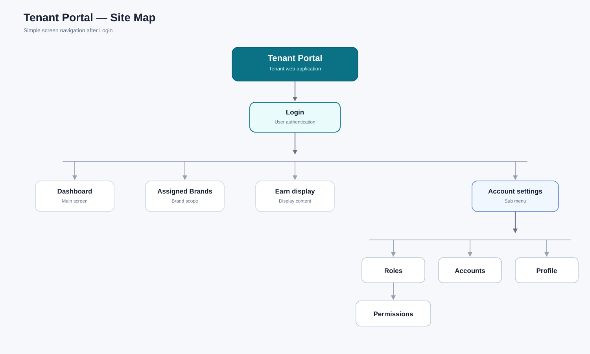

Quy tắc điều hướng:

- User phải đi qua màn hình `Login` trước khi truy cập các màn hình sau đăng nhập.
- Sau khi login thành công, hệ thống hiển thị các màn hình theo quyền của user.
- Trong MVP1, `Account settings` hiển thị `Accounts` và `Profile`. Menu `Roles` cùng màn `Permissions` thuộc Deferred/Phase 2; mockup và đặc tả vẫn được giữ làm baseline cho phase sau.

## 3. Use Case List

| # | Use case ID | Use case name | Actor | Priority |
|---:|---|---|---|---|
| 1 | TP-AUTH-001 | Đăng nhập Tenant Portal | Tenant Admin/Staff | Must |
| 2 | TP-AUTH-002 | Quên mật khẩu Tenant Portal | Tenant Admin/Staff | Must |
| 3 | TP-ROLE-001 | Quản lý quyền tài khoản Tenant — Deferred/Phase 2 | Tenant Admin | Deferred |
| 4 | TP-USER-001 | Quản lý tài khoản và phân quyền nhân viên Tenant | Tenant Admin | Must |
| 5 | TP-PROFILE-001 | Quản lý thông tin cá nhân | Tenant Admin/Staff | Must |
| 6 | TP-DASH-001 | Xem dashboard báo cáo Tenant | enant Admin/Staff | Must |
| 7 | TP-BRAND-001 | Quản lý danh sách Brand được Platform assign | Tenant Admin/Staff được phân quyền | Must |
| 8 | TP-EARN-001 | Cấu hình earn/cashback display hiển thị trên Landing page | Tenant Admin/Staff được phân quyền | Must |
| 9 | TP-TXN-001 | Quản lý Transaction theo Tenant | Tenant Admin/Staff được phân quyền | Must |

# IV. Description of Functions

## 1. TP-AUTH-001 - Đăng nhập Tenant Portal

### a. Introduction

Chức năng cho phép người dùng phía Tenant đăng nhập Tenant Portal bằng account/password do Platform tạo hoặc do Tenant Admin tạo sau đó. Trước khi tra Username, hệ thống xác định `tenant_id` từ Tenant-specific portal/domain/routing context; sau khi xác thực thành công, session chỉ cho phép truy cập dữ liệu thuộc Tenant đó.

### b. Actors/Objects

| Actor/Object | Role |
|---|---|
| Tenant Admin/Staff | Nhập account/password để đăng nhập. |
| Tenant Portal | Xác thực, tạo session và redirect sau login. |
| Auth Service | Kiểm tra credential, trạng thái user và tenant. |
| RBAC Service | Nạp role/permission của user. |
| Tenant User Service | Lưu số lần đăng nhập thất bại và tự động cập nhật trạng thái tài khoản thành `Locked`. |
| Audit Service | Ghi nhận lần đăng nhập thất bại và sự kiện khóa/mở khóa tài khoản. |

### c. Pre-conditions

- Tenant đã được Platform tạo trên Admin CMS.
- Tenant Portal login page đã được mở trong Tenant context hợp lệ, được xác định từ domain/subdomain/routing configuration.
- User Tenant Portal đã được tạo và có status `Active`.
- Tenant có status `Active`.

### d. Expected Result

- User đăng nhập thành công và vào đúng Tenant Portal của Tenant mình.
- Session chứa `user_id`, `tenant_id`, `role`, permission.
- User không thể truy cập dữ liệu Tenant khác.
- Tài khoản bị tự động chuyển sang `Locked` sau 5 lần đăng nhập thất bại liên tiếp và trạng thái này được hiển thị trên màn Accounts.
- Người dùng bị khóa nhận được thông báo rõ ràng trên màn hình Sign in.

### e. Logic Diagram

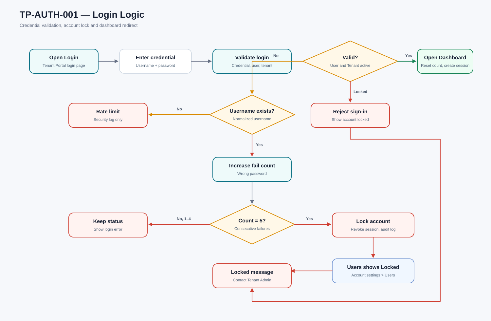

### f. Screen Flow

1. User mở Tenant Portal login page.
2. Nhập account/password.
3. Hệ thống xác định Tenant context từ portal/domain, normalize Username rồi tra tài khoản theo `tenant_id + normalized_username`; sau đó xác thực credential, user status và tenant status.
4. Nếu Username khớp một tài khoản tồn tại nhưng Password không đúng, hệ thống tăng bộ đếm đăng nhập thất bại liên tiếp của tài khoản đó.
5. Từ lần thất bại thứ 1 đến thứ 4, hệ thống giữ tài khoản ở trạng thái hiện tại và hiển thị lỗi đăng nhập tương ứng.
6. Tại lần thất bại liên tiếp thứ 5, hệ thống tự động cập nhật tài khoản sang `Locked`, vô hiệu hóa session/token hiện tại, ghi Audit Log và hiển thị thông báo khóa trên màn hình Sign in.
7. Màn `Account settings > Accounts` tự động hiển thị Status `Locked` cho tài khoản vừa bị khóa.
8. Nếu đăng nhập thành công trước khi đạt ngưỡng khóa, hệ thống reset bộ đếm thất bại về `0`, tạo session và điều hướng đến Dashboard.
9. Nếu tài khoản đã `Locked`, mọi lần đăng nhập tiếp theo đều bị từ chối và tiếp tục hiển thị thông báo khóa.
10. Username không tồn tại không thể làm khóa tài khoản khác; hệ thống áp dụng rate limit theo Username nhập vào, IP/device và ghi security log.

### g. Screen Description

Screen: Login

Mockup:

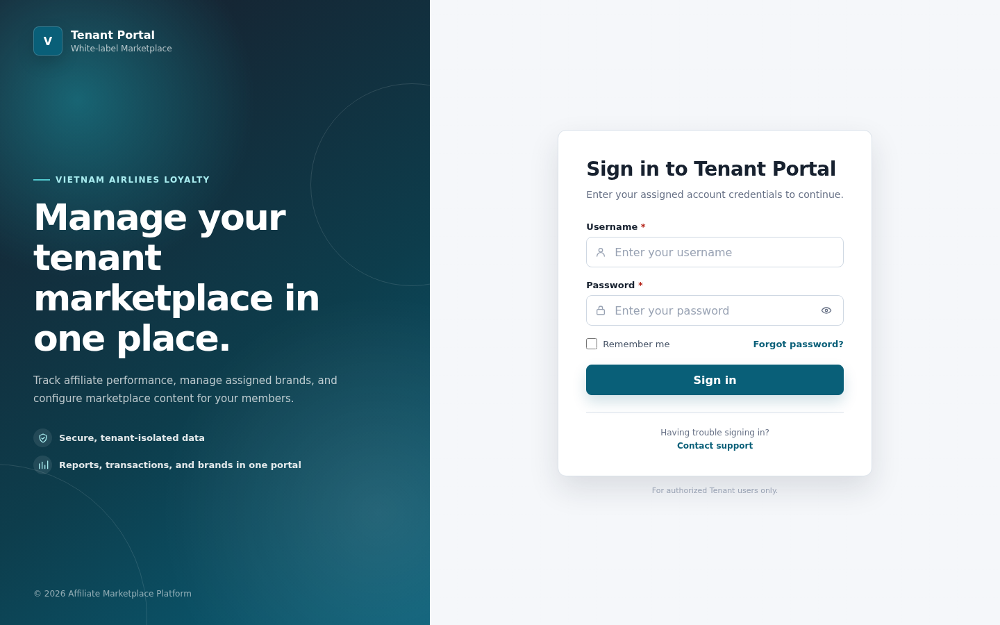

**Screen 1.1 — Account locked:** Sau lần đăng nhập thất bại liên tiếp thứ 5 hoặc khi tài khoản đã Locked, màn hình hiển thị thông báo khóa tài khoản.

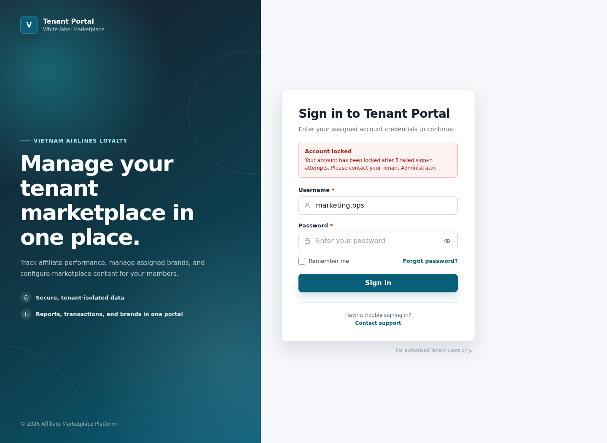

| # | Items | Control type | Data type | R/O | Description / Validation / Error handling |
|---:|---|---|---|---|---|
| 1 | Username | Textbox | Text | R | <ul><li>Tối đa 100 ký tự.</li><li>Hệ thống tự động cắt khoảng trắng ở đầu và cuối trước khi kiểm tra.</li><li>Nếu bỏ trống hoặc chỉ nhập khoảng trắng, hiển thị lỗi `Username is required.`.</li><li>Nếu Username không tồn tại, hiển thị lỗi `Username không tồn tại`.</li></ul> |
| 2 | Password | Password textbox | Text | R | <ul><li>Mặc định che mật khẩu dưới dạng ký tự `***`.</li><li>Nhấn biểu tượng con mắt để hiển thị mật khẩu; nhấn lại để chuyển về trạng thái che.</li><li>Nếu bỏ trống, hiển thị lỗi `Password is required.`.</li><li>Nếu mật khẩu không khớp với Username, hiển thị lỗi `Mật khẩu không hợp lệ`.</li></ul> |
| 3 | Remember me | Checkbox | Boolean | O | <ul><li>Mặc định không được chọn.</li><li>Khi được chọn và đăng nhập thành công, hệ thống tạo phiên đăng nhập duy trì (persistent session) theo thời hạn được cấu hình để ghi nhớ trạng thái đã xác thực trên thiết bị hiện tại.</li><li>Nếu phiên còn hiệu lực, lần truy cập tiếp theo hệ thống tự động xác thực và điều hướng User vào Tenant Portal mà không yêu cầu nhập lại Username/Password.</li><li>Nếu phiên hết hạn, bị thu hồi hoặc tài khoản/Tenant/Role không còn đủ điều kiện truy cập, hệ thống yêu cầu User đăng nhập lại.</li><li>Ứng dụng không lưu và không tự động điền Password. Việc trình duyệt hoặc Password Manager đề xuất lưu/tự điền Username/Password là cơ chế độc lập của trình duyệt.</li><li>Credential của persistent session phải được bảo vệ bằng cookie `Secure`, `HttpOnly`, `SameSite`; không lưu Password, access token hoặc refresh token trong `localStorage`, `sessionStorage` hay `IndexedDB`.</li></ul> |
| 4 | Forgot password | Link | Action | O | <ul><li>Nhấn `Forgot password?` để điều hướng sang màn hình lấy lại mật khẩu.</li><li>Người dùng thực hiện quy trình xác thực Email, OTP và tạo mật khẩu mới tại màn hình này.</li></ul> |
| 5 | Sign in | Button | Action | R | <ul><li>Nhấn `Sign in` để hệ thống validate Username và Password rồi thực hiện đăng nhập.</li><li>Nếu Username thuộc tài khoản tồn tại nhưng Password sai, tăng bộ đếm thất bại liên tiếp.</li><li>Từ lần sai thứ 1 đến thứ 4, không đăng nhập và hiển thị `Mật khẩu không hợp lệ`.</li><li>Tại lần sai thứ 5, khóa tài khoản, vô hiệu hóa session/token và hiển thị `Screen 1.1 — Account locked`.</li><li>Nếu thông tin hợp lệ, reset bộ đếm thất bại về `0`, tạo session chứa Tenant, User, Role, Permission và điều hướng đến Dashboard.</li></ul> |
| 6 | Account locked alert | Alert message | Text | O | <ul><li>Hiển thị khi tài khoản vừa đạt 5 lần đăng nhập thất bại liên tiếp hoặc đã có Status `Locked`.</li><li>Nội dung: `Your account has been locked after 5 failed sign-in attempts. Please contact your Tenant Administrator.`.</li><li>Không tiết lộ Password, số lần thử trước đó hoặc thông tin nhạy cảm khác.</li><li>Người dùng phải liên hệ Tenant Admin để được mở khóa.</li></ul> |

### h. Business Rules

| BR ID | Rule |
|---|---|
| BR-TP-AUTH-001-01 | Mỗi Tenant User record chỉ gắn với một Tenant. Cùng `normalized_username` có thể tồn tại ở Tenant khác dưới một User record khác. |
| BR-TP-AUTH-001-02 | User `Inactive/Locked` không được đăng nhập. |
| BR-TP-AUTH-001-03 | Tenant `Inactive` thì toàn bộ user thuộc Tenant không được đăng nhập. |
| BR-TP-AUTH-001-04 | Mọi API Tenant Portal phải lấy `tenant_id` từ session/token, không tin dữ liệu `tenant_id` do client gửi. |
| BR-TP-AUTH-001-05 | Hệ thống đếm số lần đăng nhập thất bại liên tiếp theo tài khoản tồn tại sau khi chuẩn hóa Username; Password sai làm tăng bộ đếm thêm `1`. |
| BR-TP-AUTH-001-06 | Tại lần đăng nhập thất bại liên tiếp thứ 5, hệ thống phải cập nhật Status tài khoản thành `Locked`, vô hiệu hóa toàn bộ session/token và ghi Audit Log. |
| BR-TP-AUTH-001-07 | Đăng nhập thành công trước khi đạt ngưỡng khóa phải reset bộ đếm thất bại về `0`. |
| BR-TP-AUTH-001-08 | Username không tồn tại không có tài khoản để chuyển sang Locked; các lần thử này phải chịu rate limit theo Username/IP/device và được ghi security log để chống brute-force. |
| BR-TP-AUTH-001-09 | Tài khoản Locked chỉ được mở khóa bởi Tenant Admin có quyền `tenant_user.manage`; thao tác Forgot password không tự động mở khóa tài khoản. |
| BR-TP-AUTH-001-10 | Khi Tenant Admin mở khóa, hệ thống chuyển Status sang `Active`, reset bộ đếm thất bại về `0` và ghi Audit Log. |
| BR-TP-AUTH-001-11 | `Remember me` chỉ duy trì phiên đã xác thực trên thiết bị hiện tại, không cho phép ứng dụng lưu hoặc tự điền Password. Persistent session phải có thời hạn cấu hình được và bị thu hồi khi User đăng xuất, đổi Password, bị chuyển sang `Inactive/Locked`, Role bị `Inactive` hoặc quyền truy cập quan trọng thay đổi theo security policy. |
| BR-TP-AUTH-001-12 | Username unique theo `tenant_id + normalized_username`. Auth Service phải xác định Tenant context trước khi tra Username; không được tìm chỉ bằng Username trên toàn Tenant Portal. Nếu thiếu hoặc không xác định được Tenant context, hệ thống từ chối đăng nhập và không tự chọn một Tenant. |

### i. Acceptance Criteria

| AC ID | Criteria |
|---|---|
| AC-TP-AUTH-001-01 | User active thuộc Tenant active đăng nhập thành công. |
| AC-TP-AUTH-001-02 | Username không tồn tại hiển thị `Username không tồn tại`; mật khẩu không đúng hiển thị `Mật khẩu không hợp lệ`. |
| AC-TP-AUTH-001-03 | User không thể truy cập URL/API dữ liệu Tenant khác. |
| AC-TP-AUTH-001-04 | Session hết hạn thì user bị yêu cầu đăng nhập lại. |
| AC-TP-AUTH-001-05 | Username được trim khoảng trắng đầu/cuối; Username hoặc Password bỏ trống hiển thị đúng thông báo bắt buộc nhập. |
| AC-TP-AUTH-001-06 | Password được che mặc định và có thể hiện/ẩn bằng biểu tượng con mắt. |
| AC-TP-AUTH-001-07 | Khi chọn Remember me và đăng nhập thành công, truy cập lại trên cùng thiết bị trong thời hạn persistent session sẽ tự động xác thực mà không yêu cầu nhập lại Username/Password; ứng dụng không lưu hoặc tự điền Password. |
| AC-TP-AUTH-001-08 | Nhấn Forgot password điều hướng sang màn hình lấy lại mật khẩu. |
| AC-TP-AUTH-001-09 | Bốn lần liên tiếp nhập sai Password cho một tài khoản tồn tại chưa làm thay đổi Status tài khoản sang Locked. |
| AC-TP-AUTH-001-10 | Lần nhập sai Password liên tiếp thứ 5 tự động chuyển Status tài khoản sang Locked và vô hiệu hóa session/token hiện tại. |
| AC-TP-AUTH-001-11 | Sau khi bị khóa, màn Accounts hiển thị badge `Locked` cho đúng tài khoản mà không cần Tenant Admin sửa thủ công. |
| AC-TP-AUTH-001-12 | Màn Sign in hiển thị `Your account has been locked after 5 failed sign-in attempts. Please contact your Tenant Administrator.` khi tài khoản vừa bị khóa hoặc đã Locked. |
| AC-TP-AUTH-001-13 | Một lần đăng nhập thành công trước ngưỡng khóa reset bộ đếm thất bại về `0`. |
| AC-TP-AUTH-001-14 | Nhập Username không tồn tại không khóa bất kỳ tài khoản nào và bị kiểm soát bằng rate limit/security log. |
| AC-TP-AUTH-001-15 | Tenant Admin mở khóa thành công chuyển tài khoản về Active, reset bộ đếm và tạo Audit Log. |
| AC-TP-AUTH-001-16 | Khi không chọn Remember me, hệ thống không tạo persistent session; User phải đăng nhập lại sau khi phiên thông thường hết hạn theo security policy. |
| AC-TP-AUTH-001-17 | Persistent session bị từ chối và User được yêu cầu đăng nhập lại khi session hết hạn/bị thu hồi hoặc User, Tenant, Role không còn đủ điều kiện truy cập. |

## 2. TP-AUTH-002 - Quên mật khẩu Tenant Portal

### a. Introduction

Chức năng cho phép người dùng Tenant Portal khôi phục quyền truy cập khi quên mật khẩu. Người dùng cung cấp email đã đăng ký, xác thực OTP được gửi qua email, sau đó tạo mật khẩu mới và quay lại màn hình đăng nhập.

### b. Actors/Objects

| Actor/Object | Role |
|---|---|
| Tenant Admin/Staff | Nhập email, OTP và mật khẩu mới để khôi phục tài khoản. |
| Tenant Portal | Hiển thị từng bước, validate dữ liệu và điều hướng giữa các bước. |
| Auth Service | Kiểm tra email, sinh/xác thực OTP và cập nhật mật khẩu mới. |
| Email Service | Gửi OTP đến email đã đăng ký của người dùng. |
| Audit Service | Ghi nhận yêu cầu gửi OTP và kết quả đổi mật khẩu theo policy bảo mật. |

### c. Pre-conditions

- Người dùng đã có tài khoản Tenant Portal.
- Tài khoản có email hợp lệ đã được đăng ký trên hệ thống.
- Email Service và Auth Service khả dụng.
- Người dùng chưa đăng nhập hoặc đang ở màn hình đăng nhập Tenant Portal.
- Người dùng click Quên mật khẩu tại màn hình Đăng nhập

### d. Expected Result

- OTP được gửi đến đúng email đăng ký của tài khoản.
- Email gửi OTP hiển thị mã xác thực, thời hạn hiệu lực và cảnh báo không chia sẻ OTP.
- Chỉ người dùng xác thực OTP hợp lệ mới được tạo mật khẩu mới.
- Mật khẩu mới được cập nhật an toàn và không được lưu/log dạng plain text.
- Sau khi đổi mật khẩu thành công, người dùng có thể quay lại Sign in và đăng nhập bằng mật khẩu mới.

### e. Logic Diagram

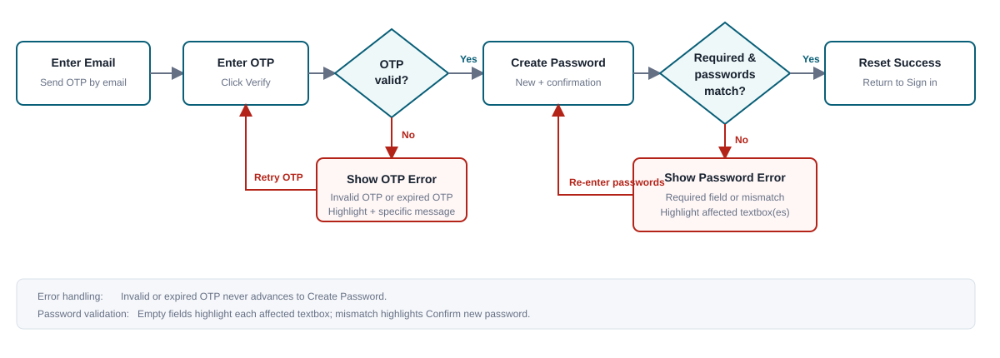

### f. Screen Flow

1. Người dùng nhấn `Forgot password?` tại màn hình Sign in.
2. Hệ thống mở màn hình Forgot Password tại bước Email verification.
3. Người dùng nhập Email và nhấn `Send Code`.
4. Hệ thống validate Email và gửi OTP qua Email Service nếu hợp lệ.
5. Hệ thống chuyển sang bước OTP verification; người dùng nhập OTP và nhấn `Verify`.
6. Nếu OTP không đúng, giữ nguyên màn hình, highlight ô OTP và hiển thị `Invalid OTP`.
7. Nếu OTP đã hết thời hạn hiệu lực, giữ nguyên màn hình, highlight ô OTP và hiển thị `OTP has expired. Please request a new code.`.
8. Nếu OTP đúng và còn hiệu lực, hệ thống chuyển sang bước Create new password.
9. Người dùng nhập New password, Confirm new password và nhấn `Confirm`.
10. Hệ thống validate dữ liệu, cập nhật mật khẩu và hiển thị trạng thái `Password reset successfully`.
11. Người dùng nhấn `Back to sign in` để quay lại màn hình đăng nhập.

### g. Screen Description

Screen: Forgot Password

Mockup:

**Screen 1 — Email verification:** Người dùng nhập email đã đăng ký.

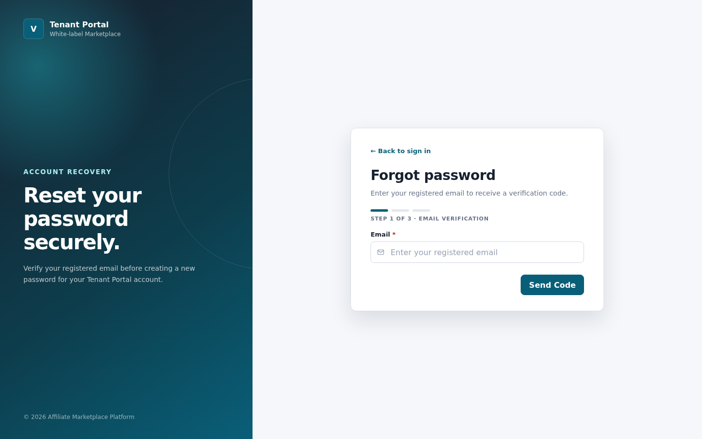

**Screen 1.1 — Email validation error:** Textbox Email được highlight viền đỏ và hiển thị dòng lỗi nhỏ bên dưới.

**Screen 2 — OTP verification:** Hệ thống thông báo đã gửi OTP đến email và hiển thị ô nhập mã xác thực.

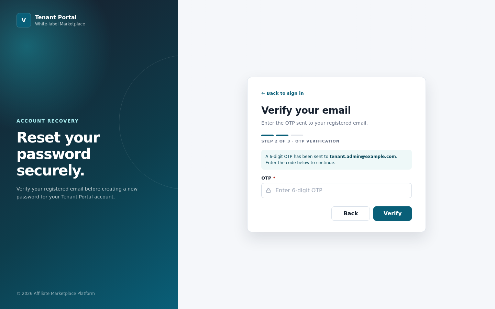

**Email template — Password reset OTP:** Email gửi đến địa chỉ đã đăng ký, gồm mã OTP 6 chữ số, thời hạn hiệu lực và cảnh báo bảo mật.

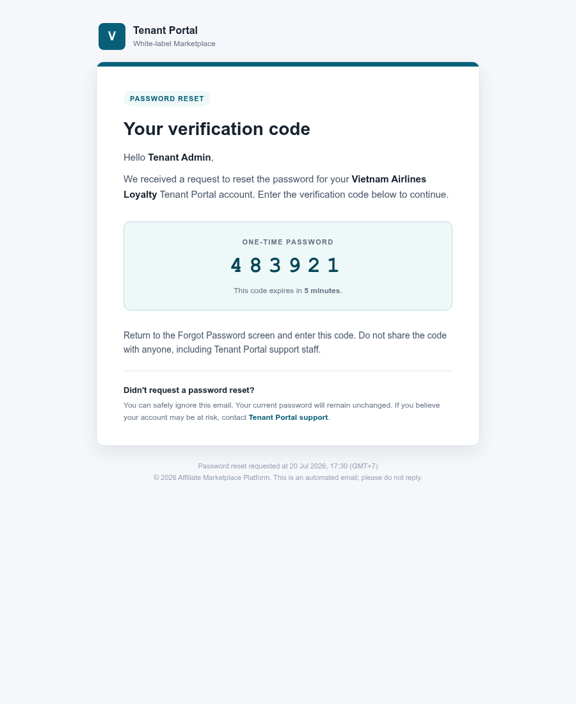

**Screen 2.1 — Invalid OTP:** Giữ nguyên ô OTP, highlight viền đỏ và hiển thị `Invalid OTP` bên dưới.

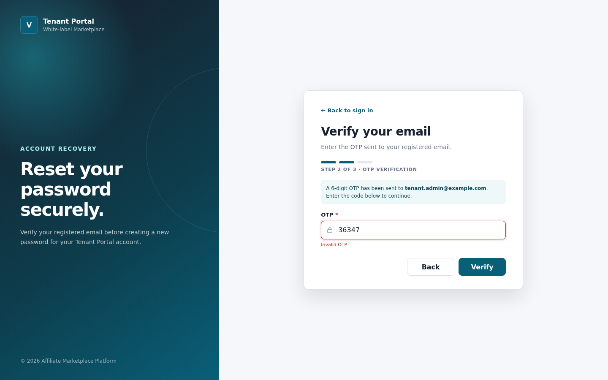

**Screen 2.2 — Expired OTP:** Giữ nguyên ô OTP, highlight viền đỏ và hiển thị `OTP has expired. Please request a new code.` bên dưới.

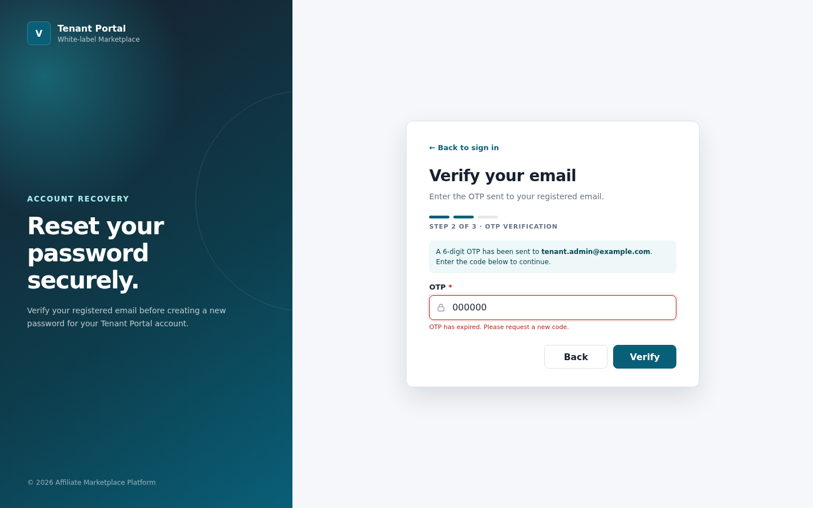

**Screen 3 — Create new password:** Hiển thị New password, Confirm new password và icon hiện/ẩn mật khẩu.

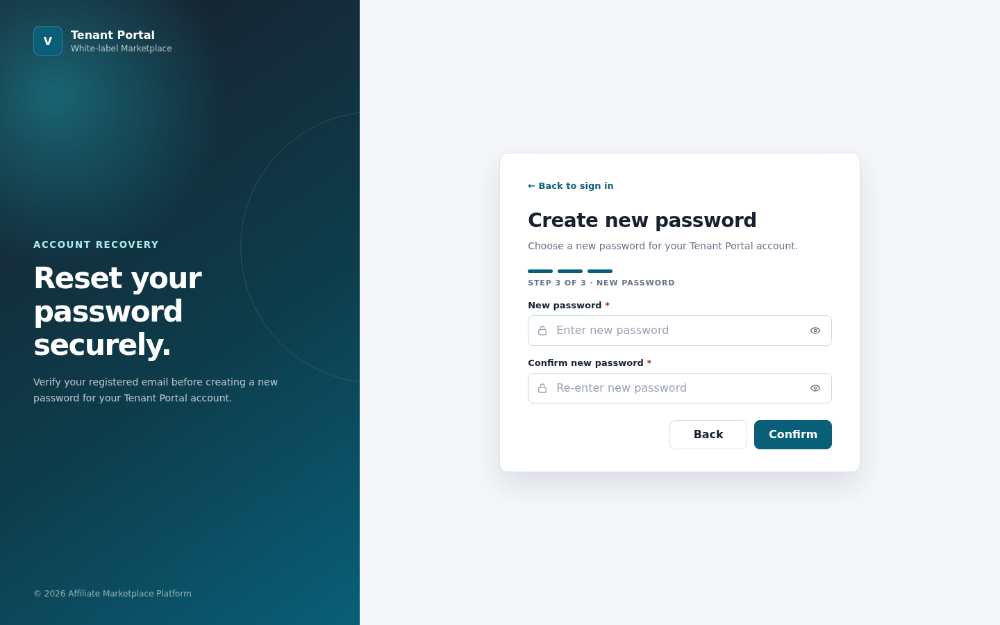

**Screen 3.1 — Required password errors:** Khi cả hai trường bỏ trống, highlight cả hai textbox và hiển thị thông báo bắt buộc nhập tương ứng.

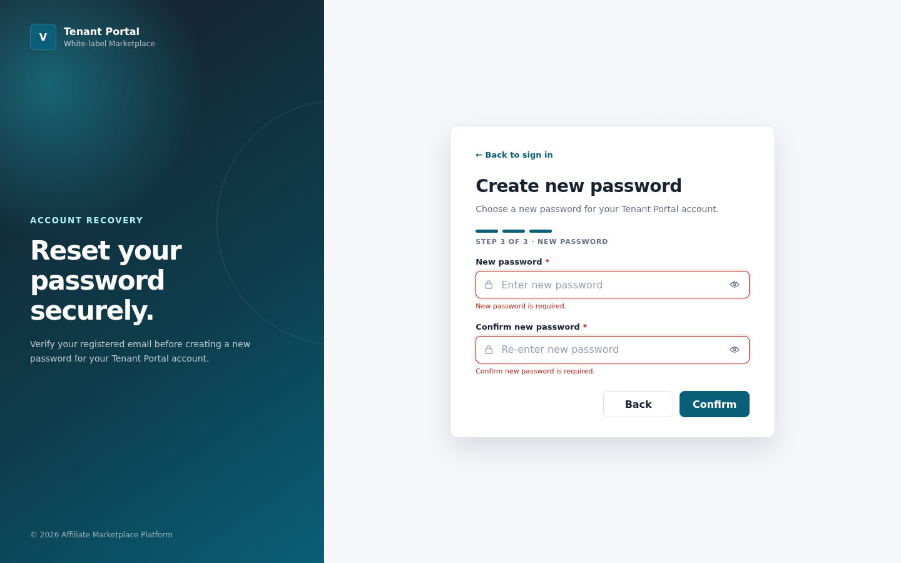

**Screen 3.2 — Password mismatch:** Highlight Confirm new password và hiển thị `Passwords do not match.`.

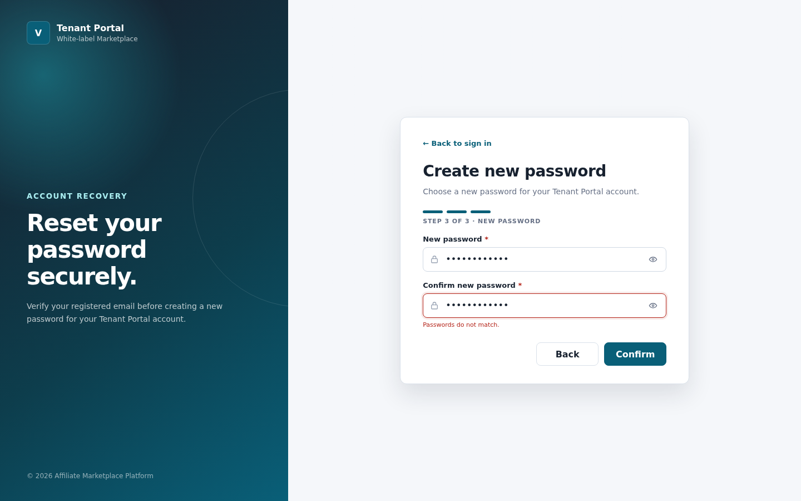

**Screen 4 — Reset success:** Xác nhận đổi mật khẩu thành công và cung cấp thao tác quay lại Sign in.

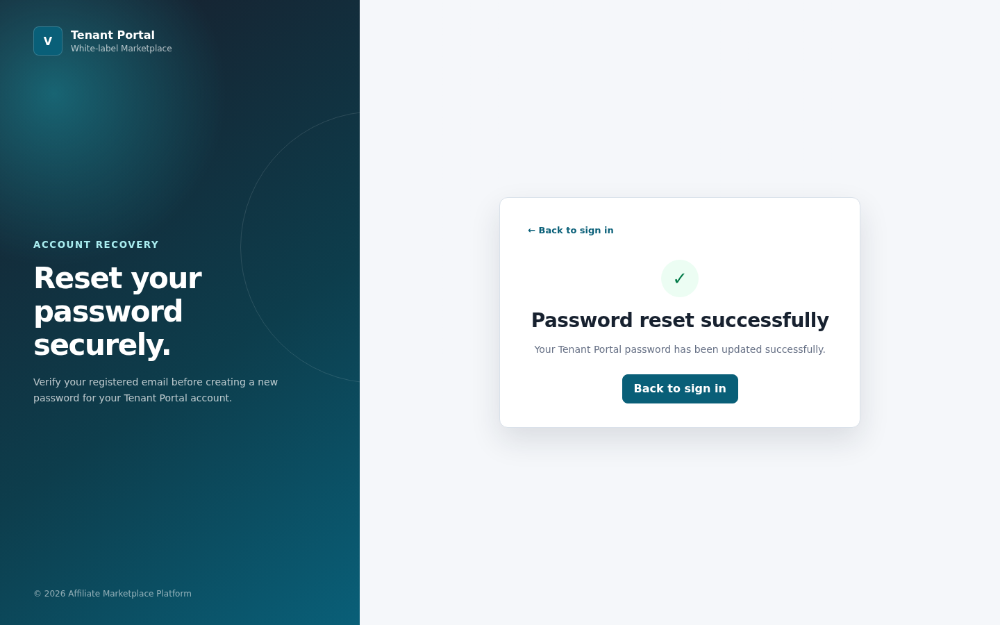

| # | Items | Control type | Data type | R/O | Description / Validation / Error handling |
|---:|---|---|---|---|---|
| 1 | Back to sign in | Link | Action | O | <ul><li>Hiển thị trên tất cả các bước của luồng quên mật khẩu.</li><li>Click `Back to sign in` để rời luồng Forgot Password và điều hướng đến màn hình `TP-AUTH-001 — Sign in Tenant Portal`.</li></ul> |
| 2 | Email | Textbox | Email | R | <ul><li>Nhập email đã đăng ký với tài khoản Tenant Portal.</li><li>Hệ thống trim khoảng trắng đầu/cuối trước khi validate.</li><li>Nếu để trống hoặc sai định dạng, giữ nguyên textbox, highlight viền đỏ và hiển thị dòng lỗi nhỏ `Please enter a valid email address.`.</li></ul> |
| 3 | Send Code | Button | Action | R | <ul><li>Click `Send Code` tại `Screen 1 — Email verification` để validate Email trước khi gửi.</li><li>Nếu Email không hợp lệ, giữ người dùng tại `Screen 1.1 — Email validation error`.</li><li>Nếu hợp lệ, yêu cầu Auth Service sinh OTP và Email Service gửi email theo mẫu `Password reset OTP` đến email đăng ký.</li><li>Email phải chứa OTP 6 chữ số, thời hạn hiệu lực và cảnh báo không chia sẻ mã.</li><li>Sau khi gửi thành công, điều hướng đến `Screen 2 — OTP verification`.</li></ul> |
| 4 | OTP | Textbox | Numeric text | R | <ul><li>Cho phép nhập tối đa 6 chữ số.</li><li>Nếu OTP không đúng, giữ nguyên textbox, highlight viền đỏ và hiển thị dòng lỗi nhỏ `Invalid OTP` tại `Screen 2.1`.</li><li>Nếu OTP đã hết hạn, giữ nguyên textbox, highlight viền đỏ và hiển thị `OTP has expired. Please request a new code.` tại `Screen 2.2`.</li><li>Nếu OTP đúng và còn hiệu lực, chuyển sang bước Create new password.</li></ul> |
| 5 | Verify | Button | Action | R | <ul><li>Click `Verify` tại `Screen 2 — OTP verification` để gửi OTP hiện tại đến Auth Service xác thực.</li><li>Nếu OTP không đúng, giữ người dùng tại bước OTP và hiển thị `Screen 2.1 — Invalid OTP`.</li><li>Nếu OTP hết hạn, giữ người dùng tại bước OTP và hiển thị `Screen 2.2 — Expired OTP`.</li><li>Nếu OTP đúng và còn hiệu lực, điều hướng đến `Screen 3 — Create new password`.</li></ul> |
| 6 | New password | Password textbox | Text | R | <ul><li>Mật khẩu được che mặc định.</li><li>Click biểu tượng con mắt để hiện/ẩn mật khẩu ngay tại `Screen 3 — Create new password`; thao tác này không chuyển màn hình.</li><li>Nếu bỏ trống, highlight viền đỏ và hiển thị dòng lỗi nhỏ `New password is required.`.</li></ul> |
| 7 | Confirm new password | Password textbox | Text | R | <ul><li>Mật khẩu xác nhận được che mặc định.</li><li>Click biểu tượng con mắt để hiện/ẩn mật khẩu ngay tại `Screen 3 — Create new password`; thao tác này không chuyển màn hình.</li><li>Nếu bỏ trống, highlight viền đỏ và hiển thị `Confirm new password is required.`.</li><li>Nếu khác Confirm New password, highlight ô xác nhận và hiển thị `Confirm New Passwords do not match.`.</li></ul> |
| 8 | Confirm | Button | Action | R | <ul><li>Click `Confirm` tại `Screen 3 — Create new password` để validate đồng thời New password và Confirm new password.</li><li>Nếu có trường bỏ trống, giữ nguyên bước và hiển thị `Screen 3.1 — Required password errors`.</li><li>Nếu hai mật khẩu không khớp, giữ nguyên bước và hiển thị `Screen 3.2 — Password mismatch`.</li><li>Nếu hợp lệ, cập nhật mật khẩu và điều hướng đến `Screen 4 — Reset success`.</li></ul> |
| 9 | Back | Button | Action | O | <ul><li>Click `Back` tại `Screen 2 — OTP verification` để quay lại `Screen 1 — Email verification`.</li><li>Click `Back` tại `Screen 3 — Create new password` để quay lại `Screen 2 — OTP verification`.</li><li>Không tự động xác nhận hoặc lưu dữ liệu khi quay lại màn hình trước.</li></ul> |

### h. Business Rules

| BR ID | Rule |
|---|---|
| BR-TP-AUTH-002-01 | Chỉ email đã liên kết với tài khoản Tenant Portal mới được dùng để khôi phục mật khẩu. |
| BR-TP-AUTH-002-02 | OTP chỉ được dùng cho đúng yêu cầu reset password và đúng tài khoản/email đã yêu cầu. |
| BR-TP-AUTH-002-03 | OTP chỉ có hiệu lực một lần; sau khi xác thực hoặc đổi mật khẩu thành công, OTP không được sử dụng lại. |
| BR-TP-AUTH-002-04 | Chỉ cho phép tạo mật khẩu mới sau khi OTP được xác thực thành công. |
| BR-TP-AUTH-002-05 | New password và Confirm new password phải trùng khớp. |
| BR-TP-AUTH-002-06 | Mật khẩu mới phải được hash trước khi lưu; không lưu hoặc log mật khẩu/OTP dạng plain text. |
| BR-TP-AUTH-002-07 | Sau khi reset thành công, reset session/token phải bị vô hiệu hóa. |
| BR-TP-AUTH-002-08 | Gửi OTP và xác thực OTP phải áp dụng rate limit/chống brute-force theo security policy. |
| BR-TP-AUTH-002-09 | OTP hết hạn sau 5 phút kể từ thời điểm phát hành; OTP hết hạn không được dùng để chuyển sang bước tạo mật khẩu mới. |
| BR-TP-AUTH-002-10 | Email OTP phải hiển thị mã OTP, thời hạn hiệu lực, Tenant context và cảnh báo người dùng không chia sẻ mã. |

### i. Acceptance Criteria

| AC ID | Criteria |
|---|---|
| AC-TP-AUTH-002-01 | Nhấn Forgot password tại màn Sign in mở đúng màn hình Forgot Password. |
| AC-TP-AUTH-002-02 | Email trống hoặc sai định dạng bị highlight và hiển thị đúng thông báo lỗi. |
| AC-TP-AUTH-002-03 | Email hợp lệ nhận được OTP và giao diện chuyển sang bước OTP verification. |
| AC-TP-AUTH-002-04 | Email OTP hiển thị đúng mã OTP, thời hạn hiệu lực, Tenant context và cảnh báo bảo mật. |
| AC-TP-AUTH-002-05 | OTP không đúng giữ nguyên bước, highlight ô OTP và hiển thị `Invalid OTP`. |
| AC-TP-AUTH-002-06 | OTP hết hạn giữ nguyên bước, highlight ô OTP và hiển thị `OTP has expired. Please request a new code.`. |
| AC-TP-AUTH-002-07 | OTP đúng và còn hiệu lực cho phép chuyển sang bước Create new password. |
| AC-TP-AUTH-002-08 | Hai trường mật khẩu bỏ trống được highlight đồng thời và hiển thị thông báo bắt buộc nhập tương ứng. |
| AC-TP-AUTH-002-09 | Hai mật khẩu không trùng nhau hiển thị `Passwords do not match.` tại Confirm new password. |
| AC-TP-AUTH-002-10 | Icon con mắt hiện/ẩn đúng giá trị New password và Confirm new password. |
| AC-TP-AUTH-002-11 | Confirm thành công cập nhật mật khẩu và hiển thị `Password reset successfully`. |
| AC-TP-AUTH-002-12 | Back to sign in từ mọi bước điều hướng về màn đăng nhập Tenant Portal. |

## 3. TP-ROLE-001 - Quản lý quyền tài khoản Tenant

> **Phạm vi triển khai:** TP-ROLE-001 thuộc Deferred/Phase 2. MVP1 chỉ tạo sẵn bốn System Role và cho phép gán Role này cho Account; không triển khai Create/Edit/Delete Custom Role hoặc thay đổi Permission. Toàn bộ mô tả và mockup bên dưới được giữ làm baseline thiết kế cho Phase 2, không phải acceptance scope của MVP1.

### a. Introduction

Chức năng này phép Tenant Admin quản lý các Role trong trên hệ thống portal tenant và cấu hình phân quyền cho từng Role. Role sau khi được gán cho tài khoản nhân viên Tenant Portal để giới hạn chức năng và thao tác được phép sử dụng.

### b. Actors/Objects

| Actor/Object | Role |
|---|---|
| Tenant Admin | Xem, tạo, chỉnh sửa và thiết lập quyền cho Role thuộc Tenant hiện tại. |
| Tenant Portal | Hiển thị danh sách/form Role, validate dữ liệu và điều hướng giữa các màn hình. |
| RBAC Service | Lưu Role, tập Permission và kiểm tra quyền truy cập theo Role. |
| Tenant Admin | Sử dụng Role đã cấu hình khi gán quyền cho tài khoản nhân viên Tenant. |
| Audit Service | Ghi nhận thao tác tạo, cập nhật Role và thay đổi Permission. |

### c. Pre-conditions

- Tenant Admin đã đăng nhập Tenant Portal thành công.
- Tenant Admin đang thao tác trong đúng Tenant context.
- Tenant Admin có quyền quản lý Role/Permission, ví dụ `tenant_role.manage`.
- Danh mục Permission của Tenant Portal đã được hệ thống cấu hình.
- RBAC Service và Audit Service khả dụng.

### d. Expected Result

- Tenant Admin chỉ xem và quản lý các Role thuộc Tenant hiện tại.
- Role mới được tạo với Role ID duy nhất và trạng thái hợp lệ.
- Thông tin Role có thể được xem và cập nhật; Role ID không thể chỉnh sửa sau khi tạo.
- Permission được lưu đúng cho Role và được áp dụng cho các tài khoản được gán Role đó.
- Không thể gán Permission nội bộ của Platform Admin/Ops cho Role Tenant.
- Mọi thay đổi Role và Permission được ghi Audit Log.

### e. Logic Diagram

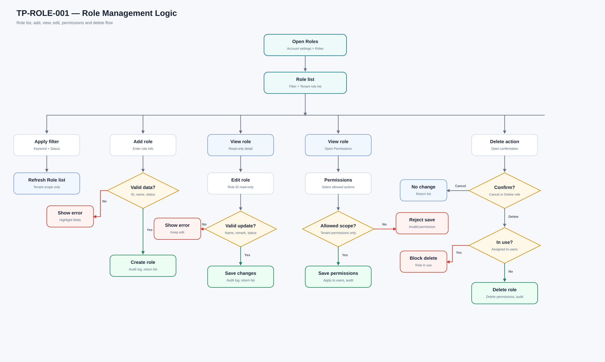

### f. Screen Flow

1. Tenant Admin mở `Account settings > Roles`.
2. Hệ thống hiển thị màn hình Role list gồm bộ lọc và danh sách Role thuộc Tenant hiện tại.
3. Người dùng có thể nhập Keyword, chọn Status và nhấn `Apply` để lọc danh sách.
4. Người dùng nhấn `Add role` để mở màn hình Add role, nhập thông tin và nhấn `Create role`.
5. Nếu dữ liệu không hợp lệ, hệ thống giữ nguyên màn hình, highlight trường lỗi và hiển thị thông báo tương ứng.
6. Nếu dữ liệu hợp lệ, hệ thống tạo Role, ghi Audit Log và quay lại Role list.
7. Tại Role list, người dùng nhấn `View` để mở màn hình View role ở chế độ read-only.
8. Tại View role, người dùng nhấn `Edit` để mở màn hình Edit role hoặc nhấn `Permissions` để mở màn hình Role permissions.
9. Tại Edit role, người dùng cập nhật Role Name, Remark, Status và nhấn `Save changes`; Role ID chỉ đọc và không thể chỉnh sửa.
10. Tại Role permissions, người dùng chọn/bỏ chọn các Permission được phép và nhấn `Save permissions`.
11. Hệ thống validate phạm vi Permission, lưu thay đổi, ghi Audit Log và áp dụng quyền mới cho các tài khoản đang được gán Role.
12. Tại Role list, người dùng nhấn `Delete` trong cột Action của Role cần xóa.
13. Hệ thống hiển thị popup `Delete role?`; người dùng nhấn `Cancel` để hủy hoặc `Delete role` để xác nhận.
14. Khi xác nhận, hệ thống kiểm tra Role có đang được gán cho bất kỳ tài khoản Tenant nào hay không.
15. Nếu Role đang được sử dụng, hệ thống không xóa và hiển thị `This role is currently in use and cannot be deleted.`.
16. Nếu Role chưa được gán cho tài khoản nào, hệ thống xóa Role và tập Permission liên quan, ghi Audit Log và hiển thị `Role deleted successfully`.

### g. Screen Description

Screen: Tenant Role Management

Mockup:

**Screen 1 — Role list:** Hiển thị bộ lọc và danh sách Role; các thao tác `View`, `Edit` và `Delete` nằm chung trong cột Action.

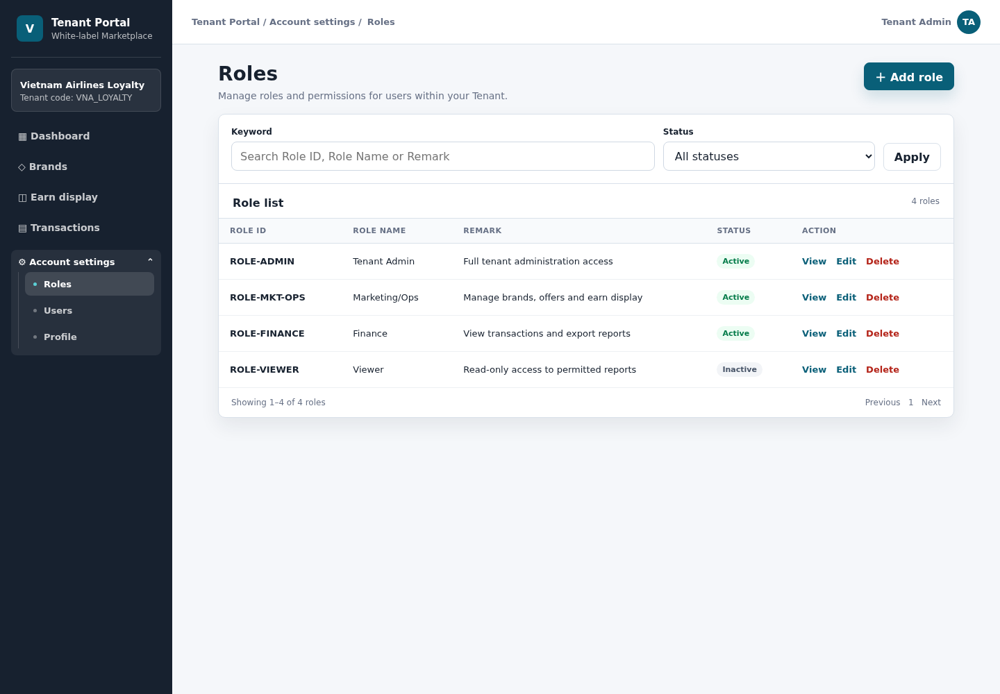

| # | Items | Control type | Data type | R/O | Description / Validation / Error handling |
|---:|---|---|---|---|---|
| 1 | Keyword | Textbox | Text | O | <ul><li>Tìm kiếm theo Role ID, Role Name hoặc Remark.</li><li>Hệ thống trim khoảng trắng đầu/cuối trước khi tìm kiếm.</li><li>Cho phép tìm kiếm không phân biệt chữ hoa/chữ thường.</li></ul> |
| 2 | Status | Dropdown | Enum | O | <ul><li>Gồm `All statuses`, `Active`, `Inactive`.</li><li>Mặc định chọn `All statuses`.</li></ul> |
| 3 | Apply | Button | Action | O | <ul><li>Click `Apply` để lọc danh sách theo Keyword và Status.</li><li>Kết quả chỉ bao gồm Role thuộc Tenant hiện tại.</li><li>Nếu không có kết quả, hiển thị `No roles found`.</li></ul> |
| 4 | Add role | Button | Action | O | <ul><li>Chỉ hiển thị/enable khi người dùng có quyền tạo Role.</li><li>Click `Add role` để điều hướng đến `Screen 2 — Add role`.</li></ul> |
| 5 | Role ID | Table column | Text | O | <ul><li>Hiển thị mã Role duy nhất trong Tenant.</li><li>Click tiêu đề cột để sắp xếp nếu hệ thống hỗ trợ sorting (Sắp xếp theo thứ tự bảng chữ cái).</li></ul> |
| 6 | Role Name | Table column | Text | O | <ul><li>Hiển thị tên Role tương ứng với Role ID.</li></ul> |
| 7 | Remark | Table column | Text | O | <ul><li>Hiển thị mô tả ngắn về mục đích của Role.</li><li>Nội dung dài được rút gọn theo UI và hiển thị đầy đủ khi xem chi tiết.</li></ul> |
| 8 | Status | Table column/Badge | Enum | O | <ul><li>Hiển thị `Active` hoặc `Inactive` bằng badge trạng thái.</li></ul> |
| 9 | View | Link | Action | O | <ul><li>Hiển thị trong cột Action.</li><li>Click `View` để điều hướng đến `Screen 3 — View role` của đúng Role được chọn.</li></ul> |
| 10 | Edit | Link | Action | O | <ul><li>Hiển thị cùng `View` trong cột Action.</li><li>Click `Edit` để điều hướng đến `Screen 4 — Edit role` của đúng Role được chọn.</li></ul> |
| 11 | Delete | Link/Button | Action | O | <ul><li>Hiển thị cùng `View` và `Edit` trong cột Action khi người dùng có quyền xóa Role.</li><li>Click `Delete` để mở `Screen 1.1 — Delete role confirmation` của đúng Role được chọn.</li><li>Không xóa dữ liệu ngay khi click lần đầu.</li></ul> |
| 12 | Pagination | Pagination | Numeric | O | <ul><li>Hiển thị tổng số Role và trang hiện tại.</li><li>Click `Previous`, số trang hoặc `Next` để tải trang tương ứng và giữ nguyên điều kiện lọc.</li></ul> |

**Screen 1.1 — Delete role confirmation:** Xác nhận trước khi thực hiện xóa Role.

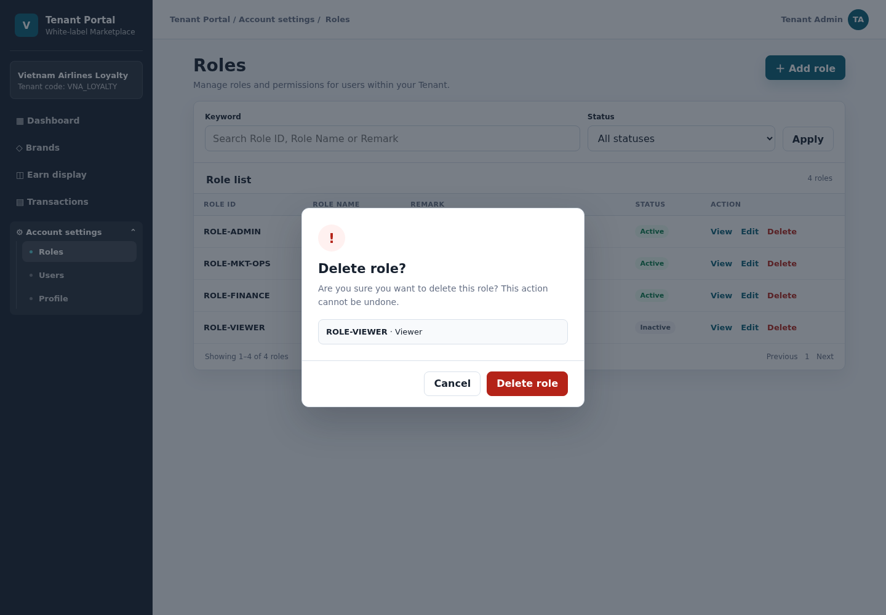

| # | Items | Control type | Data type | R/O | Description / Validation / Error handling |
|---:|---|---|---|---|---|
| 1 | Role reference | Read-only information | Text | O | <ul><li>Hiển thị Role ID và Role Name của Role được chọn để người dùng kiểm tra trước khi xóa.</li></ul> |
| 2 | Cancel | Button | Action | O | <ul><li>Click `Cancel`, click bên ngoài popup hoặc nhấn `Esc` để đóng popup.</li><li>Giữ nguyên Role list và không xóa dữ liệu.</li></ul> |
| 3 | Delete role | Button | Action | O | <ul><li>Click `Delete role` để xác nhận yêu cầu xóa.</li><li>Hệ thống kiểm tra Role có đang được gán cho tài khoản Tenant nào không.</li><li>Nếu chưa được sử dụng, xóa Role và hiển thị `Screen 1.2 — Delete role success`.</li><li>Nếu đang được sử dụng, không xóa và hiển thị `Screen 1.3 — Role in use`.</li></ul> |

**Screen 1.2 — Delete role success:** Thông báo Role chưa được gán cho User đã được xóa thành công.

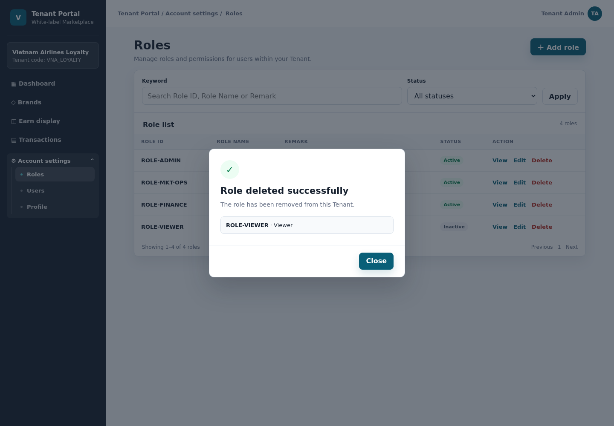

| # | Items | Control type | Data type | R/O | Description / Validation / Error handling |
|---:|---|---|---|---|---|
| 1 | Success message | Message | Text | O | <ul><li>Hiển thị `Role deleted successfully`.</li><li>Role và tập Permission liên quan đã được xóa; thao tác được ghi Audit Log.</li></ul> |
| 2 | Close | Button | Action | O | <ul><li>Click `Close` để đóng popup và quay lại `Screen 1 — Role list`.</li><li>Danh sách được refresh và không còn hiển thị Role vừa xóa.</li></ul> |

**Screen 1.3 — Role in use:** Thông báo không thể xóa vì Role đang được gán cho User.

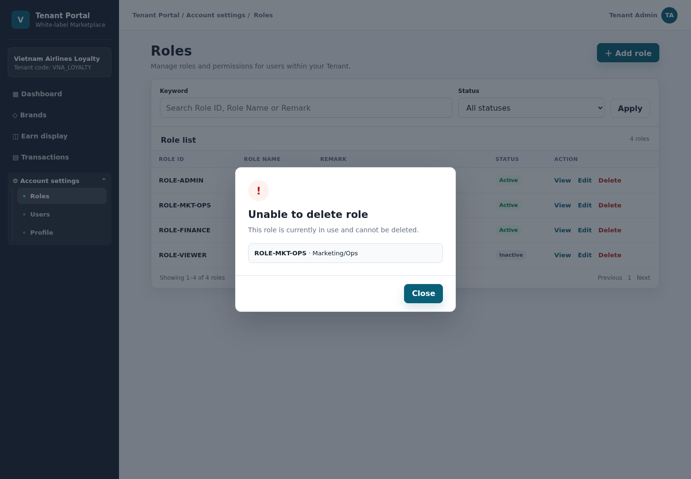

| # | Items | Control type | Data type | R/O | Description / Validation / Error handling |
|---:|---|---|---|---|---|
| 1 | Error message | Message | Text | O | <ul><li>Hiển thị `This role is currently in use and cannot be deleted.`.</li><li>Không xóa Role hoặc Permission liên quan.</li><li>Người dùng phải gỡ Role khỏi tất cả tài khoản trước khi thử xóa lại.</li></ul> |
| 2 | Close | Button | Action | O | <ul><li>Click `Close` để đóng popup và quay lại `Screen 1 — Role list`.</li><li>Role vẫn được giữ nguyên trong danh sách.</li></ul> |

**Screen 2 — Add role:** Nhập Role ID, Role Name, Remark và Status để tạo Role mới.

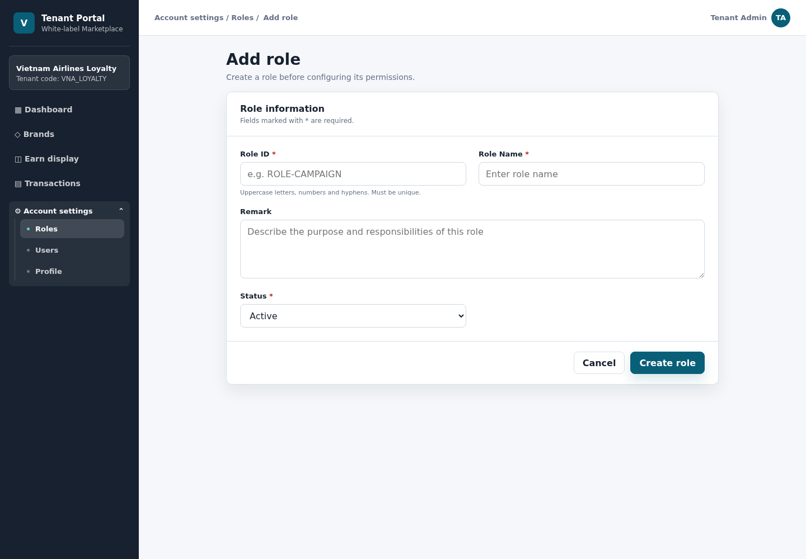

| # | Items | Control type | Data type | R/O | Description / Validation / Error handling |
|---:|---|---|---|---|---|
| 1 | Role ID | Textbox | Text | R | <ul><li>Cho phép chữ hoa, chữ số và dấu gạch ngang; không chứa khoảng trắng.</li><li>Hệ thống trim khoảng trắng đầu/cuối và chuẩn hóa thành chữ hoa trước khi lưu.</li><li>Role ID phải duy nhất trong Tenant.</li><li>Nếu bỏ trống, highlight textbox và hiển thị `Role ID is required.`.</li><li>Nếu sai định dạng, hiển thị `Role ID may contain uppercase letters, numbers and hyphens only.`.</li><li>Nếu đã tồn tại, hiển thị `Role ID already exists.`.</li></ul> |
| 2 | Role Name | Textbox | Text | R | <ul><li>Nhập tên hiển thị của Role, tối đa 100 ký tự.</li><li>Hệ thống trim khoảng trắng đầu/cuối trước khi lưu.</li><li>Nếu bỏ trống, highlight textbox và hiển thị `Role Name is required.`.</li></ul> |
| 3 | Remark | Textarea | Text | O | <ul><li>Mô tả mục đích và trách nhiệm của Role, tối đa 500 ký tự.</li><li>Nếu vượt giới hạn, highlight trường và hiển thị `Remark must not exceed 500 characters.`.</li></ul> |
| 4 | Status | Dropdown | Enum | R | <ul><li>Gồm `Active` và `Inactive`.</li><li>Mặc định chọn `Active`.</li></ul> |
| 5 | Cancel | Button | Action | O | <ul><li>Click `Cancel` để quay về `Screen 1 — Role list` và không tạo Role.</li><li>Nếu đã nhập dữ liệu, hiển thị hộp thoại xác nhận trước khi rời màn hình.</li></ul> |
| 6 | Create role | Button | Action | O | <ul><li>Click `Create role` để validate toàn bộ trường bắt buộc.</li><li>Nếu có lỗi, giữ nguyên màn hình, highlight trường lỗi và không tạo dữ liệu.</li><li>Nếu hợp lệ, tạo Role, ghi Audit Log và điều hướng về `Screen 1 — Role list`.</li></ul> |

**Screen 3 — View role:** Hiển thị thông tin Role ở chế độ read-only và cung cấp thao tác Edit, Permissions.

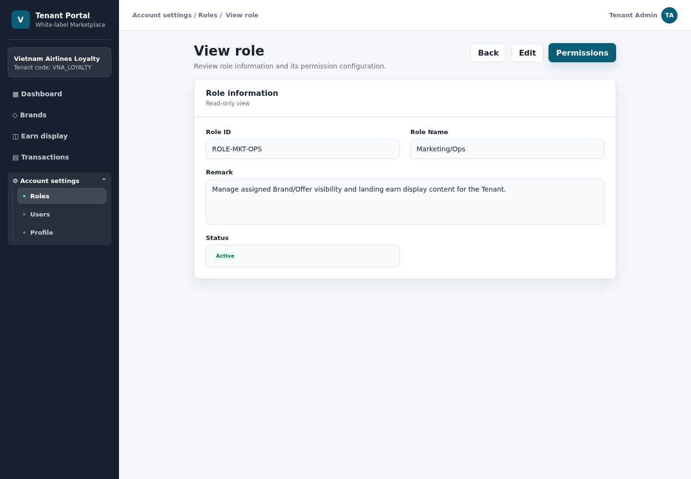

| # | Items | Control type | Data type | R/O | Description / Validation / Error handling |
|---:|---|---|---|---|---|
| 1 | Role ID | Read-only field | Text | O | <ul><li>Hiển thị Role ID của Role được chọn.</li><li>Không cho phép chỉnh sửa.</li></ul> |
| 2 | Role Name | Read-only field | Text | O | <ul><li>Hiển thị tên Role hiện tại.</li><li>Không cho phép chỉnh sửa.</li></ul> |
| 3 | Remark | Read-only field | Text | O | <ul><li>Hiển thị đầy đủ mô tả của Role.</li><li>Không cho phép chỉnh sửa.</li></ul> |
| 4 | Status | Read-only field/Badge | Enum | O | <ul><li>Hiển thị trạng thái `Active` hoặc `Inactive`.</li><li>Không cho phép chỉnh sửa.</li></ul> |
| 5 | Back | Button | Action | O | <ul><li>Click `Back` để quay về `Screen 1 — Role list`.</li></ul> |
| 6 | Edit | Button | Action | O | <ul><li>Click `Edit` để điều hướng đến `Screen 4 — Edit role` của Role hiện tại.</li><li>Chỉ hiển thị/enable khi người dùng có quyền cập nhật Role.</li></ul> |
| 7 | Permissions | Button | Action | O | <ul><li>Click `Permissions` để điều hướng đến `Screen 5 — Role permissions` của Role hiện tại.</li><li>Chỉ hiển thị/enable khi người dùng có quyền cấu hình Permission.</li></ul> |

**Screen 4 — Edit role:** Cho phép cập nhật Role Name, Remark, Status; Role ID không được chỉnh sửa.

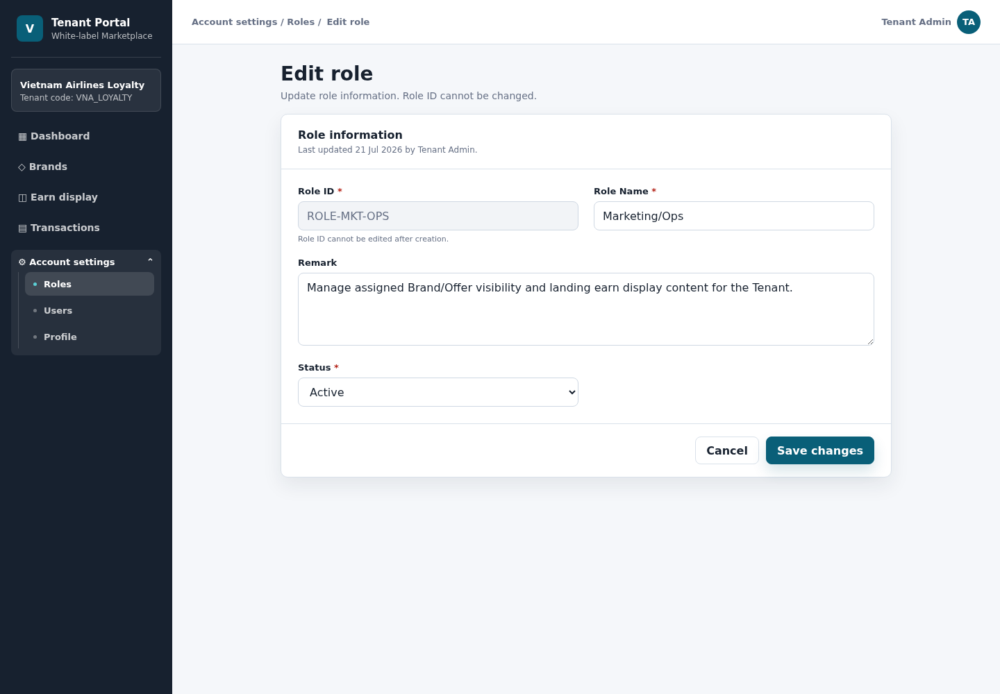

| # | Items | Control type | Data type | R/O | Description / Validation / Error handling |
|---:|---|---|---|---|---|
| 1 | Role ID | Disabled textbox | Text | O | <ul><li>Hiển thị Role ID hiện tại.</li><li>Không được chỉnh sửa sau khi Role đã được tạo.</li></ul> |
| 2 | Role Name | Textbox | Text | R | <ul><li>Hiển thị sẵn Role Name hiện tại và cho phép chỉnh sửa, tối đa 100 ký tự.</li><li>Trim khoảng trắng đầu/cuối trước khi lưu.</li><li>Nếu bỏ trống, highlight textbox và hiển thị `Role Name is required.`.</li></ul> |
| 3 | Remark | Textarea | Text | O | <ul><li>Hiển thị sẵn Remark hiện tại và cho phép chỉnh sửa, tối đa 500 ký tự.</li><li>Nếu vượt giới hạn, highlight trường và hiển thị `Remark must not exceed 500 characters.`.</li></ul> |
| 4 | Status | Dropdown | Enum | R | <ul><li>Hiển thị trạng thái hiện tại; cho phép chọn `Active` hoặc `Inactive`.</li><li>Khi chuyển sang Inactive và Role đang được gán cho người dùng, hiển thị cảnh báo ảnh hưởng trước khi lưu.</li></ul> |
| 5 | Cancel | Button | Action | O | <ul><li>Click `Cancel` để quay về `Screen 1 — Role list` và không lưu thay đổi.</li><li>Nếu dữ liệu đã thay đổi, hiển thị hộp thoại xác nhận trước khi rời màn hình.</li></ul> |
| 6 | Save changes | Button | Action | O | <ul><li>Click `Save changes` để validate và lưu thông tin Role.</li><li>Nếu dữ liệu không hợp lệ, giữ nguyên màn hình và hiển thị lỗi tại trường tương ứng.</li><li>Nếu hợp lệ, cập nhật Role, ghi Audit Log và điều hướng về `Screen 1 — Role list`.</li></ul> |

**Screen 5 — Role permissions:** Thiết lập các hành động được phép theo từng module trong phạm vi Tenant.

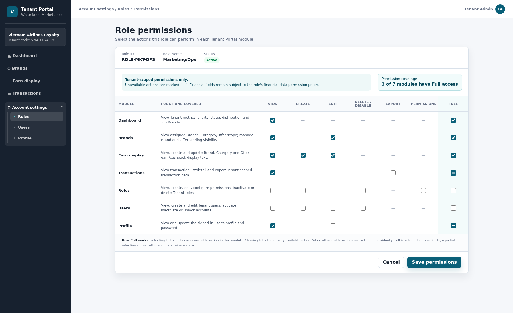

| # | Items | Control type | Data type | R/O | Description / Validation / Error handling |
|---:|---|---|---|---|---|
| 1 | Role permissions | Page title | Text | ReadOnly | Tên màn hình cấu hình quyền của Role. User chỉ mở được màn hình khi có action `Roles > Permissions`; backend phải kiểm tra lại permission, Role ID và Tenant scope trước khi trả dữ liệu. |
| 2 | Role ID | Read-only summary | Text | ReadOnly | Mã duy nhất của Role đang được cấu hình, lấy từ `Tenant Role.role_id`. Không cho chỉnh sửa và phải khớp Role được chọn từ Screen 3. Nếu Role không tồn tại hoặc thuộc Tenant khác, trả Not found/Forbidden mà không hiển thị permission matrix. |
| 3 | Role Name | Read-only summary | Text | ReadOnly | Tên Role lấy từ `Tenant Role.role_name`, giúp user xác nhận đúng Role trước khi thay đổi quyền. Không cho chỉnh sửa tại màn hình này. |
| 4 | Status | Read-only summary/Badge | Enum | ReadOnly | Trạng thái hiện tại lấy từ `Tenant Role.status`, hiển thị `Active` hoặc `Inactive`. Trạng thái không được thay đổi tại đây. Role Inactive vẫn có thể được chuẩn bị tập Permission nếu user có quyền quản trị, nhưng permission chỉ có hiệu lực với tài khoản khi Role và tài khoản đáp ứng điều kiện Active. |
| 5 | Tenant-scoped permissions note | Information message | Text | ReadOnly | Hiển thị rõ permission chỉ có hiệu lực trong Tenant hiện tại; action không áp dụng được đánh dấu `—`; việc xem field tài chính còn phụ thuộc financial-data permission policy. Không cho phép Role Tenant nhận permission Platform Admin/Ops hoặc Tenant khác. |
| 6 | Permission coverage | Derived summary | Integer/Text | ReadOnly | Hiển thị `[x] of 7 modules have Full access`.<ul><li>`7` là số module khả dụng trong matrix, đã gồm Transactions.</li><li>`x` là số module có tất cả action khả dụng được chọn.</li><li>Module đang partial/indeterminate không được tính vào `x`.</li><li>Coverage được tính lại ngay khi user thay đổi checkbox, chưa cần nhấn Save.</li></ul> |
| 7 | Module | Table column | Enum/Text | ReadOnly | Mỗi module hiển thị đúng một dòng: `Dashboard`, `Assigned Brands`, `Earn display`, `Transactions`, `Roles`, `Accounts`, `Profile`.<ul><li>`Assigned Brands` bao gồm Brand/Category/Offer scope và Brand/Offer landing visibility, không tách thành hai module visibility.</li><li>`Assigned Brands` dùng module code `BRANDS`; `Accounts` dùng module code `USERS` nếu cần tương thích kỹ thuật.</li><li>`Transactions` kiểm soát quyền xem danh sách/chi tiết và export dữ liệu Transaction thuộc Tenant.</li><li>Không hiển thị mã use case dưới tên module.</li><li>Không hiển thị module chưa có màn hình/use case, ví dụ Audit log.</li></ul> |
| 8 | Functions covered | Table column | Text | ReadOnly | Mô tả ngắn phạm vi mà action trong dòng kiểm soát:<ul><li>`Dashboard`: Tenant metrics, Orders/Revenue/Actual commission trend, Top Brands.</li><li>`Assigned Brands`: assigned Brand list, Category/Offer scope và Brand/Offer landing visibility.</li><li>`Earn display`: nội dung earn/cashback cấp Brand, Category, Offer.</li><li>`Transactions`: danh sách, chi tiết, Tenant Share theo item, History và Export.</li><li>`Roles`: Role information, lifecycle và permission assignment.</li><li>`Accounts`: Tenant account, Role assignment, trạng thái và unlock.</li><li>`Profile`: profile và password của user đang đăng nhập.</li></ul> |
| 9 | View | Checkbox | Boolean | O | Cho phép truy cập và xem màn hình/dữ liệu thuộc module. Áp dụng cho cả 7 module. Bỏ View khiến user không được mở module qua UI hoặc API, ngay cả khi gọi URL trực tiếp. |
| 10 | Create | Checkbox/Not applicable | Boolean | O | Chỉ áp dụng cho:<ul><li>`Earn display`: tạo cấu hình text mới khi Brand/Category/Offer chưa có cấu hình.</li><li>`Roles`: tạo Role mới.</li><li>`Accounts`: tạo Tenant account mới.</li></ul>Các module khác hiển thị `—`. |
| 11 | Edit | Checkbox/Not applicable | Boolean | O | Chỉ áp dụng cho:<ul><li>`Assigned Brands`: bật/tắt Brand và Offer landing visibility; không sửa Brand/Category/Offer master.</li><li>`Earn display`: cập nhật text, Display Status và Effective From/To.</li><li>`Roles`: cập nhật Role Name, Remark, Status; không bao gồm thay permission.</li><li>`Accounts`: cập nhật thông tin, Role và trạng thái account theo policy.</li><li>`Profile`: cập nhật profile và đổi mật khẩu của chính user.</li></ul>`Dashboard` hiển thị `—` vì read-only. |
| 12 | Delete / Disable | Checkbox/Not applicable | Boolean | O | Chỉ áp dụng cho:<ul><li>`Roles`: xóa Role chưa được gán cho Account hoặc inactivate Role theo rule.</li><li>`Accounts`: Xóa tài khoản theo policy; không đại diện cho xóa cứng User nếu nghiệp vụ không hỗ trợ.</li></ul>Các module khác hiển thị `—`. |
| 13 | Export | Checkbox/Not applicable | Boolean | O | Chỉ áp dụng cho `Transactions`. User phải có đồng thời `Transactions > View` và `Transactions > Export` mới được export; các module khác hiển thị `—`. |
| 14 | Permissions | Checkbox/Not applicable | Boolean | O | Chỉ áp dụng cho `Roles`. Cho phép mở Screen 5 và thay đổi tập permission của Role khác/Role được chọn trong Tenant. Action này độc lập với `Edit`: có Edit Role không đồng nghĩa được thay permission và ngược lại. Các module khác hiển thị `—`. |
| 15 | Not applicable (`—`) | Disabled table state | Symbol | ReadOnly | Cho biết module không có action tương ứng. Không render checkbox, không nhận focus, không gửi trong request và không tham gia xác định Full. Client không được biến `—` thành permission; backend phải từ chối permission code không tồn tại trong catalog. |
| 16 | Full | Checkbox | Boolean/Derived | O | Trạng thái tổng hợp theo từng module:<ul><li>`Checked`: tất cả action khả dụng trong dòng đã được chọn.</li><li>`Unchecked`: chưa action nào được chọn.</li><li>`Indeterminate` (dấu gạch trong ô): mới chọn một phần action.</li><li>Chọn Full sẽ chọn toàn bộ action khả dụng; bỏ Full sẽ bỏ toàn bộ action khả dụng.</li><li>Chọn thủ công đủ action sẽ tự checked Full; bỏ một action khỏi Full sẽ chuyển thành indeterminate.</li><li>Với module chỉ có View như Dashboard, chọn View đồng nghĩa Full.</li><li>Full chỉ là trạng thái dẫn xuất UI, backend vẫn lưu/enforce từng permission action.</li></ul> |
| 17 | How Full works | Supporting note | Text | ReadOnly | Giải thích công khai logic hai chiều giữa Full và các action, bao gồm trạng thái indeterminate. Nội dung giúp tránh hiểu Full là một permission độc lập hoặc áp dụng cho toàn bộ bảy module. |
| 18 | Cancel | Button | Action | O | Quay về `Screen 3 — View role` mà không lưu thay đổi. Nếu matrix đã thay đổi so với dữ liệu tải ban đầu, hiển thị xác nhận rời màn hình; chọn ở lại phải giữ nguyên lựa chọn chưa lưu. |
| 19 | Save permissions | Button | Action | O | Với System Role, nút bị ẩn/disable vì permission do Platform quản lý. Với Custom Role, khi click:<ol><li>Client gửi Role ID và tập permission action được checked; không dựa riêng vào Full.</li><li>Backend kiểm tra session, Tenant, quyền `Roles > Permissions`, Role tồn tại, `is_system_role = false`, permission catalog và quy tắc không làm mất admin cuối cùng.</li><li>Nếu hợp lệ, thay thế tập permission của Role trong một transaction, ghi Audit Log before/after và làm mới quyền hiệu lực theo session/token policy.</li><li>Hiển thị `Permissions saved successfully`, sau đó quay về View role theo screen flow.</li><li>Nếu permission không hợp lệ/ngoài scope, hiển thị `Invalid permission selection.` và không lưu một phần.</li><li>Nếu dữ liệu đã thay đổi bởi user khác, hiển thị conflict và yêu cầu tải lại.</li></ol> |

#### Permission Action Matrix

##### 1. Permission Action Catalog (Không triển khai trong Phase 1)

| Module | View | Create | Edit | Delete/Disable | Export | Permissions | Full covers |
|---|:---:|:---:|:---:|:---:|:---:|:---:|---|
| Dashboard | ✓ | — | — | — | — | — | View |
| Assigned Brands | ✓ | — | ✓ | — | — | — | View + Edit |
| Earn display | ✓ | ✓ | ✓ | — | — | — | View + Create + Edit |
| Transactions | ✓ | — | — | — | ✓ | — | View + Export |
| Roles | ✓ | ✓ | ✓ | ✓ | — | ✓ | View + Create + Edit + Delete/Disable + Permissions |
| Accounts | ✓ | ✓ | ✓ | ✓ | — | — | View + Create + Edit + Delete/Disable |
| Profile | ✓ | — | ✓ | — | — | — | View + Edit |

`✓` nghĩa là action tồn tại trong permission catalog; `—` nghĩa là action không áp dụng và backend phải từ chối nếu client gửi. `Full` chỉ là trạng thái dẫn xuất khi Role có toàn bộ action khả dụng của module.

##### 2. Default System Role Permission Matrix

Trong Phase 1, hệ thống sử dụng 4 Role mặc định dưới đây. Khi một Tenant được kích hoạt, hệ thống tự động tạo ba Role trong phạm vi Tenant đó:

| System Role | Dashboard | Assigned Brands | Earn display | Transactions | Roles | Accounts | Profile |
|---|---|---|---|---|---|---|---|
| **Admin Tenant** | View | View, Edit | View, Create, Edit | View, Export | View, Create, Edit, Delete, Permissions | View, Create, Edit, Delete | View, Edit |
| **Marketing/Ops Tenant** | — | View, Edit | View, Create, Edit | — | — | — | View, Edit |
| **Viewer Tenant** | View | View | View | View | — | — | View, Edit |
| **Finance Tenant** | View | — | — | View, Export | — | — | View, Edit |

### h. Business Rules

| BR ID | Rule |
|---|---|
| BR-TP-ROLE-001-01 | Tenant Admin chỉ được quản lý Role và Permission trong Tenant hiện tại. |
| BR-TP-ROLE-001-02 | Role ID là bắt buộc, duy nhất trong Tenant và không được chỉnh sửa sau khi Role được tạo. |
| BR-TP-ROLE-001-03 | Role Name là bắt buộc; Role phải có trạng thái `Active` hoặc `Inactive`. |
| BR-TP-ROLE-001-04 | Role `Inactive` không được gán mới cho tài khoản. Khi Role đang được gán bị chuyển sang Inactive, hệ thống thu hồi toàn bộ quyền hiệu lực của các tài khoản liên quan, vô hiệu hóa session/token hiện tại và chặn truy cập Tenant Portal cho đến khi Role được Active lại hoặc tài khoản được gán một Role Active khác. Trạng thái tài khoản không tự động bị thay đổi. |
| BR-TP-ROLE-001-05 | Role Tenant không được chứa Permission dành riêng cho Platform Admin/Ops hoặc Tenant khác. |
| BR-TP-ROLE-001-06 | Chỉ Permission có trong danh mục RBAC đang hiệu lực mới được lưu cho Role. |
| BR-TP-ROLE-001-07 | Thay đổi Permission phải được áp dụng nhất quán cho mọi tài khoản đang được gán Role theo cơ chế refresh token/session của hệ thống. |
| BR-TP-ROLE-001-08 | Hệ thống phải ngăn Tenant Admin tự loại bỏ quyền quản trị cuối cùng nếu thao tác làm Tenant không còn tài khoản có khả năng quản lý Role/Account. |
| BR-TP-ROLE-001-09 | Mọi thao tác tạo/sửa Role và thay đổi Permission phải ghi Audit Log gồm người thao tác, thời gian, Tenant, dữ liệu trước và sau thay đổi. |
| BR-TP-ROLE-001-10 | Người dùng không có quyền quản lý Role chỉ được xem hoặc không được truy cập chức năng theo Permission được cấp. |
| BR-TP-ROLE-001-11 | Chỉ được xóa Role khi Role chưa được gán cho bất kỳ Account nào trong Tenant. |
| BR-TP-ROLE-001-12 | Nếu Role đang được gán cho ít nhất một Account, hệ thống phải từ chối xóa và hiển thị `This role is currently in use and cannot be deleted.`. |
| BR-TP-ROLE-001-13 | Khi xóa Role thành công, hệ thống phải xóa quan hệ Permission của Role, refresh Role list và ghi Audit Log; không xóa hoặc thay đổi tài khoản Account. |
| BR-TP-ROLE-001-14 | Permission matrix gồm `Dashboard`, `Assigned Brands`, `Earn display`, `Transactions`, `Roles`, `Accounts`, `Profile`; action khả dụng phải khớp Permission Action Catalog. `Transactions` có View/Export; `Roles` có Permissions riêng, không gộp vào Edit. |
| BR-TP-ROLE-001-15 | `Full` được tính trên các action khả dụng của từng module, không tính ô `—`. Chọn/bỏ Full phải chọn/bỏ toàn bộ action; chọn đủ action phải tự chọn Full; chọn một phần phải hiển thị indeterminate. |
| BR-TP-ROLE-001-16 | Backend lưu và enforce từng permission action. Không được dựa riêng vào flag Full do client gửi; nếu client gửi Full, backend phải resolve/validate thành tập action hợp lệ theo permission catalog hiện hành. |
| BR-TP-ROLE-001-17 | Action `Roles > Permissions` là permission độc lập với `Roles > Edit`. Chỉ user có Permissions mới được tải/lưu Screen 5; có Edit nhưng không có Permissions không được thay tập quyền. |
| BR-TP-ROLE-001-18 | Permission coverage chỉ là số liệu dẫn xuất trên client/view model: số module có toàn bộ action khả dụng được chọn trên tổng 7 module. Coverage và Full không được dùng thay thế permission action khi backend authorize request. |
| BR-TP-ROLE-001-19 | Save permissions phải cập nhật toàn bộ tập permission của Role theo một transaction nguyên tử. Nếu bất kỳ action nào không hợp lệ, conflict hoặc vi phạm quy tắc admin cuối cùng, không được lưu một phần. |
| BR-TP-ROLE-001-20 | Khi Tenant được kích hoạt, hệ thống tự động tạo bốn System Role Active: `TENANT_ADMIN`, `TENANT_MARKETING_OPS`, `TENANT_VIEWER`, `TENANT_FINANCE`, với permission đúng Default System Role Permission Matrix. |
| BR-TP-ROLE-001-21 | System Role không được đổi Role ID/code, xóa, chuyển Inactive hoặc thay permission bởi Tenant user. Backend phải từ chối kể cả khi client gọi API trực tiếp. |
| BR-TP-ROLE-001-22 | `TENANT_ADMIN` có toàn bộ action hợp lệ của bảy module; `TENANT_MARKETING_OPS` xem/chỉnh visibility Brand/Offer trong Assigned Brands, xem/tạo/sửa Earn Display và quản lý Profile của chính mình nhưng không được truy cập Dashboard; `TENANT_VIEWER` chỉ có quyền xem theo matrix và không Export; `TENANT_FINANCE` chỉ xem Dashboard, xem/export Transactions và quản lý Profile của chính mình. |
| BR-TP-ROLE-001-23 | Tenant có thể tạo Custom Role. Permission của Custom Role phải là tập con Permission Action Catalog và không được chứa quyền Platform Admin/Ops. |

### i. Acceptance Criteria

| AC ID | Criteria |
|---|---|
| AC-TP-ROLE-001-01 | Mở Account settings > Roles hiển thị đúng danh sách Role thuộc Tenant hiện tại. |
| AC-TP-ROLE-001-02 | Keyword và Status lọc đúng dữ liệu; không có kết quả hiển thị `No roles found`. |
| AC-TP-ROLE-001-03 | View, Edit và Delete hiển thị chung trong cột Action và tác động đúng Role được chọn. |
| AC-TP-ROLE-001-04 | Add role hiển thị đầy đủ Role ID, Role Name, Remark, Status và mặc định Status là Active. |
| AC-TP-ROLE-001-05 | Role ID/Role Name bỏ trống, Role ID sai định dạng hoặc trùng lặp đều bị chặn và hiển thị đúng lỗi. |
| AC-TP-ROLE-001-06 | Create role với dữ liệu hợp lệ tạo Role thành công và quay lại Role list. |
| AC-TP-ROLE-001-07 | View role hiển thị toàn bộ thông tin ở chế độ read-only và có nút Permissions. |
| AC-TP-ROLE-001-08 | Edit role không cho chỉnh sửa Role ID nhưng cho cập nhật Role Name, Remark và Status. |
| AC-TP-ROLE-001-09 | Save changes hợp lệ cập nhật Role thành công và ghi Audit Log. |
| AC-TP-ROLE-001-10 | Role permissions hiển thị đúng module, hành động áp dụng và trạng thái Permission hiện tại của Role. |
| AC-TP-ROLE-001-11 | Không thể chọn hoặc lưu Permission Platform Admin/Ops hay Permission ngoài Tenant scope. |
| AC-TP-ROLE-001-12 | Save permissions hợp lệ lưu thành công, ghi Audit Log và áp dụng quyền mới cho tài khoản được gán Role. |
| AC-TP-ROLE-001-13 | Cancel/Back không lưu thay đổi và điều hướng đúng màn hình được mô tả. |
| AC-TP-ROLE-001-14 | Người dùng không có Permission quản lý Role không thể thực hiện thao tác tạo, sửa hoặc cấu hình Permission. |
| AC-TP-ROLE-001-15 | Click Delete mở popup xác nhận có đúng Role ID và Role Name; Role chưa bị xóa tại thời điểm này. |
| AC-TP-ROLE-001-16 | Click Cancel, click ngoài popup hoặc nhấn Esc đóng popup và không thay đổi dữ liệu. |
| AC-TP-ROLE-001-17 | Xác nhận xóa Role chưa được gán cho User hiển thị `Role deleted successfully` và Role biến mất khỏi danh sách sau khi refresh. |
| AC-TP-ROLE-001-18 | Xác nhận xóa Role đang được gán cho User hiển thị `This role is currently in use and cannot be deleted.` và giữ nguyên Role. |
| AC-TP-ROLE-001-19 | Xóa Role thành công xóa tập Permission liên quan và tạo Audit Log chứa Tenant, Role, người thao tác và thời gian xóa. |
| AC-TP-ROLE-001-20 | Permission matrix hiển thị đúng bảy module và không còn các dòng Brand visibility, Offer visibility hoặc Audit log riêng. |
| AC-TP-ROLE-001-21 | Mỗi module chỉ enable đúng action được định nghĩa; action không áp dụng hiển thị `—` và không thể chọn. |
| AC-TP-ROLE-001-22 | Chọn Full tại một module tự chọn toàn bộ action khả dụng; bỏ Full tự bỏ toàn bộ action của module đó. |
| AC-TP-ROLE-001-23 | Chọn thủ công đủ action tự chọn Full; bỏ một action làm Full chuyển khỏi checked; chọn một phần hiển thị indeterminate. |
| AC-TP-ROLE-001-24 | Save permissions lưu đúng tập action sau khi đồng bộ Full và backend từ chối action ngoài permission catalog/Tenant scope. |
| AC-TP-ROLE-001-25 | Cột Permissions chỉ có checkbox tại module Roles; các module khác hiển thị `—`. User có Roles Edit nhưng không có Roles Permissions không mở hoặc lưu được Screen 5. |
| AC-TP-ROLE-001-26 | Permission coverage cập nhật ngay theo lựa chọn hiện tại và chỉ đếm module có Full checked; module indeterminate không được tính Full. |
| AC-TP-ROLE-001-27 | Save permissions gửi/lưu từng action checked, không lưu Full như quyền độc lập và không gửi các ô `—`. |
| AC-TP-ROLE-001-28 | Khi save gặp invalid permission, conflict hoặc làm mất admin cuối cùng, không permission nào bị cập nhật; UI giữ lựa chọn và hiển thị lỗi phù hợp. |
| AC-TP-ROLE-001-29 | Khi kích hoạt Tenant mới, danh sách Role có đủ `Admin Tenant`, `Marketing/Ops Tenant`, `Viewer Tenant`, `Finance Tenant`, đều Active và có đúng role code/permission mặc định. |
| AC-TP-ROLE-001-30 | Mở Permissions của System Role hiển thị đúng quyền ở chế độ chỉ xem; checkbox và Save permissions không cho phép thay đổi. |
| AC-TP-ROLE-001-31 | UI và API đều từ chối đổi code, xóa, Inactive hoặc cập nhật permission của bốn System Role. |
| AC-TP-ROLE-001-32 | Viewer Tenant không thể Export Transaction hoặc thực hiện thao tác ghi; Finance Tenant xem/export Transaction nhưng không truy cập quản lý Brand, Earn display, Role hoặc Account. |
| AC-TP-ROLE-001-33 | Marketing/Ops Tenant có thể bật/tắt Brand/Offer, quản lý Hot Brand và cấu hình Earn Display; không thể truy cập Dashboard, Transaction, Role hoặc Account qua UI và API. |
| AC-TP-ROLE-001-33 | Custom Role chỉ lưu được action thuộc Permission Action Catalog và không vượt phạm vi Tenant Admin. |

## 4. TP-USER-001 - Quản lý tài khoản và phân quyền nhân viên Tenant

### a. Introduction

Chức năng cho phép Tenant Admin xem danh sách, tạo mới, xem chi tiết, chỉnh sửa và thay đổi trạng thái tài khoản nhân viên thuộc Tenant hiện tại. Trong cùng luồng tạo/chỉnh sửa, Tenant Admin gán một Role đang Active cho tài khoản; quyền thực tế của nhân viên được xác định bởi tập Permission của Role đó.

Việc quản lý tài khoản và gán Role được hợp nhất trong UC này. Hệ thống không sử dụng UC riêng cho thao tác gán Role.

### b. Actors/Objects

| Actor/Object | Role |
|---|---|
| Tenant Admin | Xem, tạo, chỉnh sửa, Active/Inactive tài khoản và gán Role cho nhân viên Tenant. |
| Tenant Staff | Sử dụng Tenant Portal theo trạng thái tài khoản và Permission của Role được gán. |
| Tenant User Service | Lưu thông tin tài khoản, trạng thái và quan hệ tài khoản–Role. |
| RBAC Service | Trả về danh sách Role Active, tính quyền hiệu lực và enforce quyền theo Role. |
| Auth/Session Service | Kiểm tra trạng thái tài khoản/Role khi đăng nhập và vô hiệu hóa session khi quyền bị thu hồi. |
| Audit Service | Ghi lại thao tác tạo, cập nhật, đổi trạng thái và đổi Role. |

### c. Pre-conditions

- Tenant Admin đã đăng nhập và đang ở đúng Tenant context.
- Tenant Admin có quyền `tenant_user.manage`.
- Role dùng để gán đã được tạo trong cùng Tenant và có trạng thái `Active`.
- Tenant User Service, RBAC Service và Auth/Session Service khả dụng.

### d. Expected Result

- Tenant Admin xem và quản lý được tài khoản nhân viên thuộc Tenant hiện tại.
- Tài khoản mới được tạo với Username duy nhất trong Tenant hiện tại, trạng thái mặc định `Active` và một Role Active hợp lệ.
- Tenant Admin có thể thay đổi thông tin, trạng thái và Role của tài khoản; quyền mới được áp dụng theo tập Permission của Role.
- Tài khoản `Inactive` hoặc tài khoản được gán Role `Inactive` không thể tiếp tục truy cập Tenant Portal.
- Không thể tạo User ngoài Tenant, gán Role của Tenant khác hoặc gán Role/Permission nội bộ Platform Admin/Ops.
- Mọi thay đổi tài khoản, trạng thái và Role được ghi Audit Log.

### e. Screen Flow

1. Tenant Admin mở `Account settings > Accounts`; hệ thống hiển thị danh sách tài khoản thuộc Tenant hiện tại.
2. Người dùng nhấn `Add user` để mở màn hình tạo tài khoản hoặc nhấn `View`/`Edit` tại cột Action của một tài khoản.
3. Khi tạo mới, Tenant Admin nhập Username, Full Name, Email, Phone, Initial password, Confirm password, chọn Role và Status.
4. Dropdown Role chỉ hiển thị Role thuộc Tenant hiện tại có trạng thái `Active`.
5. Tenant Admin nhấn `Create user`; hệ thống validate dữ liệu, tạo tài khoản và lưu quan hệ tài khoản–Role.
6. Khi chỉnh sửa, Username hiển thị read-only; Tenant Admin có thể sửa thông tin còn lại, đổi Role hoặc đổi Status rồi nhấn `Save changes`.
7. Nếu Role mới hợp lệ và Active, hệ thống cập nhật quan hệ tài khoản–Role, tính lại Permission hiệu lực và vô hiệu hóa session/token cũ để quyền mới được áp dụng ở lần xác thực tiếp theo.
8. Nếu tài khoản bị chuyển sang `Inactive`, hệ thống vô hiệu hóa toàn bộ session/token và chặn đăng nhập ngay lập tức, không phụ thuộc trạng thái Role.
9. Nếu Role đang gán cho tài khoản bị chuyển sang `Inactive`, tài khoản vẫn giữ trạng thái dữ liệu hiện tại nhưng toàn bộ quyền hiệu lực bị thu hồi; session/token bị vô hiệu hóa và người dùng bị chặn truy cập với thông báo `Assigned role is inactive. Please contact your Tenant Administrator.`.
10. Quyền truy cập được khôi phục khi Role được chuyển lại `Active` hoặc Tenant Admin gán cho tài khoản một Role Active khác, với điều kiện bản thân tài khoản đang `Active`.
11. Hệ thống ghi Audit Log cho thao tác tạo User, cập nhật thông tin, đổi Status và đổi Role.
12. Khi Auth Service báo tài khoản đạt 5 lần đăng nhập thất bại liên tiếp, Tenant User Service tự động chuyển Status sang `Locked`; danh sách User hiển thị trạng thái mới và chỉ Tenant Admin có quyền quản lý User mới được mở khóa về `Active`.

### f. Screen Description

Screen: Tenant Account Management

Mockup:

**Screen 1 — Accounts:** Hiển thị bộ lọc và danh sách tài khoản nhân viên thuộc Tenant hiện tại.

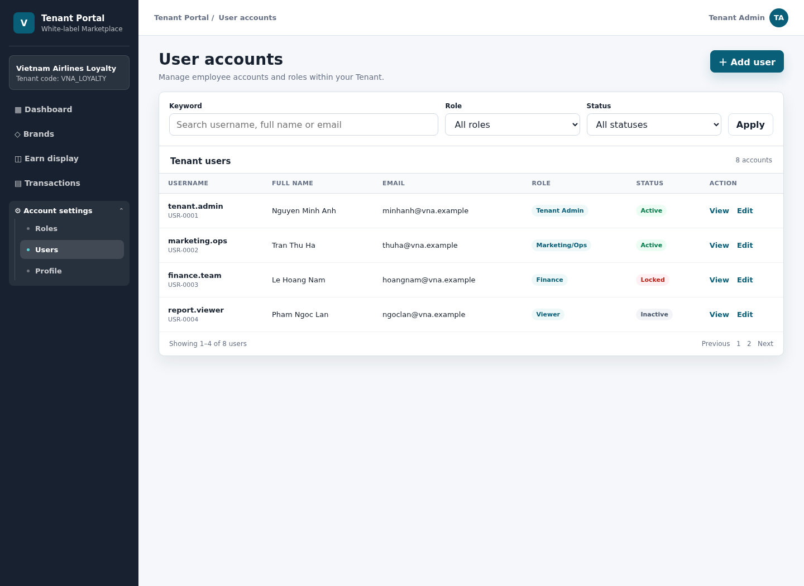

| # | Items | Control type | Data type | R/O | Description / Validation / Error handling |
|---:|---|---|---|---|---|
| 1 | Keyword | Textbox | Text | O | <ul><li>Tìm kiếm theo Username, Full Name hoặc Email.</li><li>Trim khoảng trắng đầu/cuối và tìm kiếm không phân biệt chữ hoa/chữ thường.</li></ul> |
| 2 | Role | Dropdown | Role reference | O | <ul><li>Mặc định `All roles`.</li><li>Cho phép lọc theo Role thuộc Tenant hiện tại.</li></ul> |
| 3 | Status | Dropdown | Enum | O | <ul><li>Mặc định `All statuses`.</li><li>Cho phép lọc `Active`, `Inactive` hoặc `Locked`.</li></ul> |
| 4 | Apply | Button | Action | O | <ul><li>Click `Apply` để áp dụng đồng thời Keyword, Role và Status.</li><li>Nếu không có kết quả, hiển thị `No user accounts found`.</li></ul> |
| 5 | Add user | Button | Action | O | <ul><li>Chỉ hiển thị/enable khi người dùng có quyền `tenant_user.manage`.</li><li>Click `Add user` để điều hướng đến `Screen 2 — Add user account`.</li></ul> |
| 6 | Username | Table column | Text | O | <ul><li>Hiển thị Username của tài khoản.</li></ul> |
| 7 | Full Name | Table column | Text | O | <ul><li>Hiển thị họ tên nhân viên.</li></ul> |
| 8 | Email | Table column | Email | O | <ul><li>Hiển thị email đã đăng ký của tài khoản.</li></ul> |
| 9 | Role | Table column/Badge | Role reference | O | <ul><li>Hiển thị Role hiện đang được gán cho tài khoản.</li></ul> |
| 10 | Status | Table column/Badge | Enum | O | <ul><li>Hiển thị `Active`, `Inactive` hoặc `Locked` bằng badge trạng thái.</li><li>Status tự động đổi thành `Locked` khi tài khoản đạt 5 lần đăng nhập thất bại liên tiếp.</li><li>Sau khi refresh/reload dữ liệu, danh sách phải hiển thị trạng thái mới mà không cần chỉnh sửa thủ công.</li></ul> |
| 11 | View | Link | Action | O | <ul><li>Hiển thị trong cột Action.</li><li>Click `View` để mở `Screen 3 — View user account` của đúng tài khoản được chọn.</li></ul> |
| 12 | Edit | Link | Action | O | <ul><li>Hiển thị cùng `View` trong cột Action.</li><li>Click `Edit` để mở `Screen 4 — Edit user account` của đúng tài khoản được chọn.</li></ul> |
| 13 | Pagination | Pagination | Numeric | O | <ul><li>Hiển thị số bản ghi, trang hiện tại và tổng số trang.</li><li>Click `Previous`, số trang hoặc `Next` để tải trang tương ứng và giữ nguyên điều kiện lọc.</li></ul> |

**Screen 2 — Add user account:** Tạo tài khoản nhân viên mới và gán Role trong cùng Tenant.

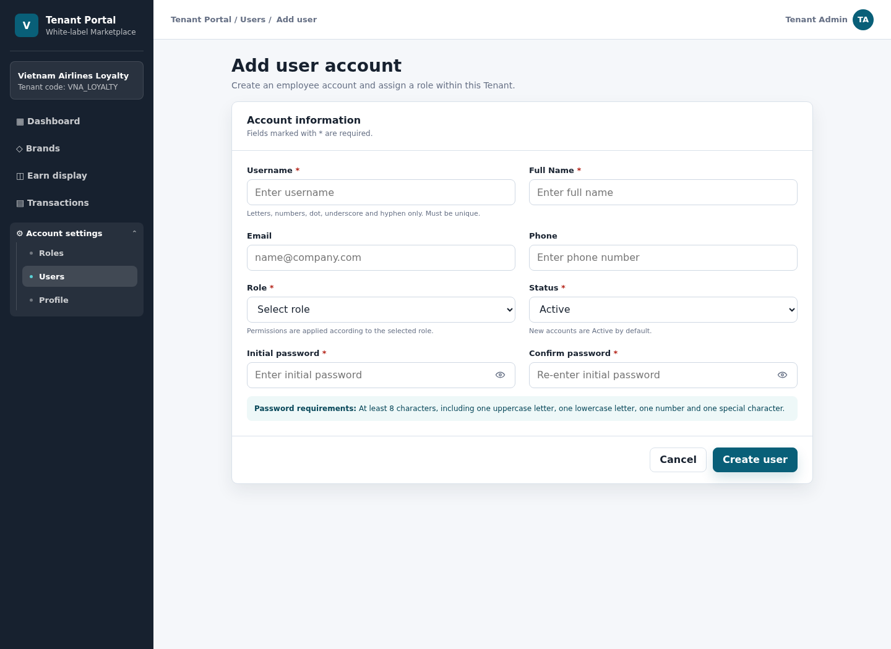

| # | Items | Control type | Data type | R/O | Description / Validation / Error handling |
|---:|---|---|---|---|---|
| 1 | Username | Textbox | Text | R | <ul><li>Cho phép chữ, số, dấu `_`; không cho khoảng trắng.</li><li>Trim/normalize không phân biệt chữ hoa/chữ thường và unique theo tổ hợp `tenant_id + normalized_username`.</li><li>Không được trùng trong Tenant hiện tại; cùng Username có thể tồn tại ở Tenant khác. Phạm vi kiểm tra gồm Account của Tenant hiện tại được tạo từ CMS và Tenant Portal.</li><li>CMS User thuộc authentication realm riêng và không tham gia kiểm tra.</li><li>Username không được sửa sau khi tạo; Account `Inactive/Locked` vẫn giữ Username trong Tenant đó và không cho tái sử dụng.</li><li>Nếu bỏ trống, hiển thị `Username is required.`.</li><li>Nếu sai định dạng, hiển thị `Username contains invalid characters.`.</li><li>Nếu đã tồn tại trong Tenant hiện tại, hiển thị `Username already exists.`.</li></ul> |
| 2 | Full Name | Textbox | Text | R | <ul><li>Tối đa 150 ký tự; trim khoảng trắng đầu/cuối.</li><li>Nếu bỏ trống, hiển thị `Full Name is required.`.</li></ul> |
| 3 | Email | Textbox | Email | O | <ul><li>Nếu nhập, phải đúng định dạng email và tối đa 254 ký tự.</li><li>Nếu sai định dạng, hiển thị `Please enter a valid email address.`.</li></ul> |
| 4 | Phone | Textbox | Text | O | <ul><li>Cho phép chữ số và ký tự `+`, tối đa 20 ký tự.</li><li>Nếu sai định dạng, hiển thị `Please enter a valid phone number.`.</li></ul> |
| 5 | Role | Dropdown | Role reference | R | <ul><li>Chỉ hiển thị Role Active thuộc Tenant hiện tại đã được khai báo tại màn hình Role. Một user chỉ được gán cho 1 role</li><li>Không hiển thị Role Inactive, Role Tenant khác hoặc Role Platform Admin/Ops.</li><li>Nếu chưa chọn, hiển thị `Role is required.`.</li><li>Permission được áp dụng theo Role đã chọn.</li></ul> |
| 6 | Status | Dropdown | Enum | R | <ul><li>Mặc định `Active`; cho phép chọn `Active`, `Inactive` hoặc `Locked` theo policy.</li><li>Tài khoản chỉ truy cập được khi Status và Role đều Active.</li></ul> |
| 7 | Initial password | Password textbox | Text | R | <ul><li>Mật khẩu được che mặc định; click icon con mắt để hiện/ẩn ngay tại màn hình.</li><li>Tối thiểu 8 ký tự, gồm chữ hoa, chữ thường, số và ký tự đặc biệt.</li><li>Nếu bỏ trống, hiển thị `Initial password is required.`.</li><li>Nếu không đạt policy, hiển thị `Password does not meet the requirements.`.</li><li>Backend phải hash mật khẩu, không lưu/log plain text.</li></ul> |
| 8 | Confirm password | Password textbox | Text | R | <ul><li>Mật khẩu được che mặc định; click icon con mắt để hiện/ẩn.</li><li>Nếu bỏ trống, hiển thị `Confirm password is required.`.</li><li>Nếu không trùng Initial password, hiển thị `Passwords do not match.`.</li></ul> |
| 9 | Cancel | Button | Action | O | <ul><li>Click `Cancel` để quay về `Screen 1 — Accounts` và không tạo tài khoản.</li><li>Nếu đã nhập dữ liệu, hiển thị xác nhận trước khi rời màn hình.</li></ul> |
| 10 | Create user | Button | Action | O | <ul><li>Click `Create user` để validate toàn bộ dữ liệu.</li><li>Nếu có lỗi, giữ nguyên màn hình và highlight trường tương ứng.</li><li>Nếu hợp lệ, tạo User, gán Role, ghi Audit Log và điều hướng về `Screen 1`.</li></ul> |

**Screen 3 — View user account:** Hiển thị toàn bộ thông tin tài khoản và Role được gán ở chế độ read-only.

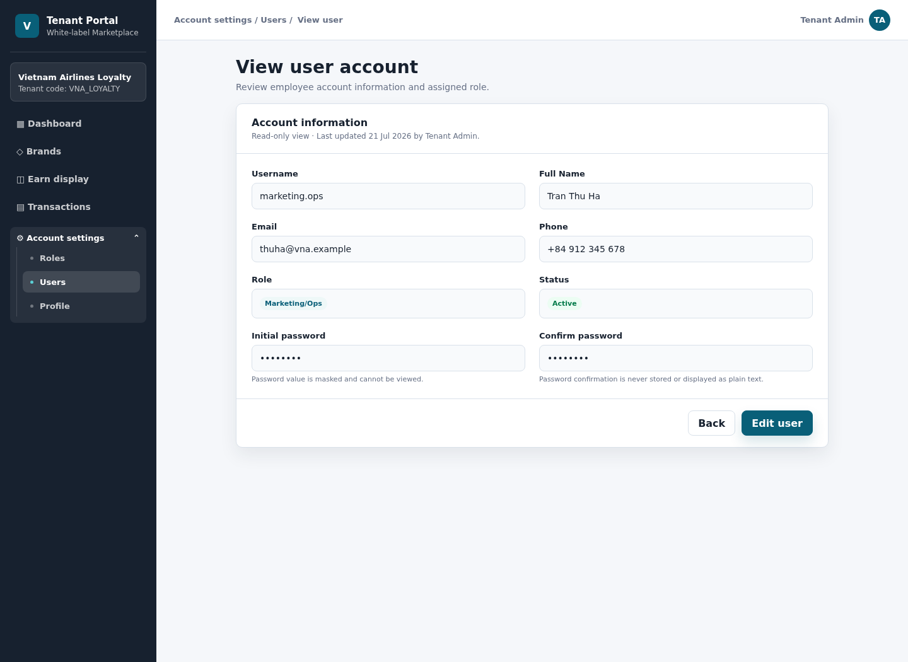

| # | Items | Control type | Data type | R/O | Description / Validation / Error handling |
|---:|---|---|---|---|---|
| 1 | Username | Read-only field | Text | O | <ul><li>Hiển thị Username của tài khoản; không cho phép chỉnh sửa.</li></ul> |
| 2 | Full Name | Read-only field | Text | O | <ul><li>Hiển thị họ tên nhân viên; không cho phép chỉnh sửa.</li></ul> |
| 3 | Email | Read-only field | Email | O | <ul><li>Hiển thị email hiện tại; không cho phép chỉnh sửa.</li></ul> |
| 4 | Phone | Read-only field | Text | O | <ul><li>Hiển thị số điện thoại hiện tại; không cho phép chỉnh sửa.</li></ul> |
| 5 | Role | Read-only field/Badge | Role reference | O | <ul><li>Hiển thị Role đang được gán cho tài khoản.</li><li>Quyền hiệu lực của User được xác định bởi Permission của Role này.</li></ul> |
| 6 | Status | Read-only field/Badge | Enum | O | <ul><li>Hiển thị trạng thái hiện tại của tài khoản.</li></ul> |
| 7 | Password information | Masked read-only field | Text | O | <ul><li>Chỉ hiển thị ký tự che mang tính minh họa, không đọc lại mật khẩu thực tế.</li><li>Confirm password không được lưu hoặc hiển thị dạng plain text.</li></ul> |
| 8 | Back | Button | Action | O | <ul><li>Click `Back` để quay về `Screen 1 — Accounts`.</li></ul> |
| 9 | Edit user | Button | Action | O | <ul><li>Click `Edit user` để điều hướng đến `Screen 4 — Edit user account` của tài khoản hiện tại.</li><li>Chỉ hiển thị/enable khi người dùng có quyền quản lý User.</li></ul> |

**Screen 4 — Edit user account:** Cập nhật thông tin, Role, mật khẩu hoặc trạng thái tài khoản.

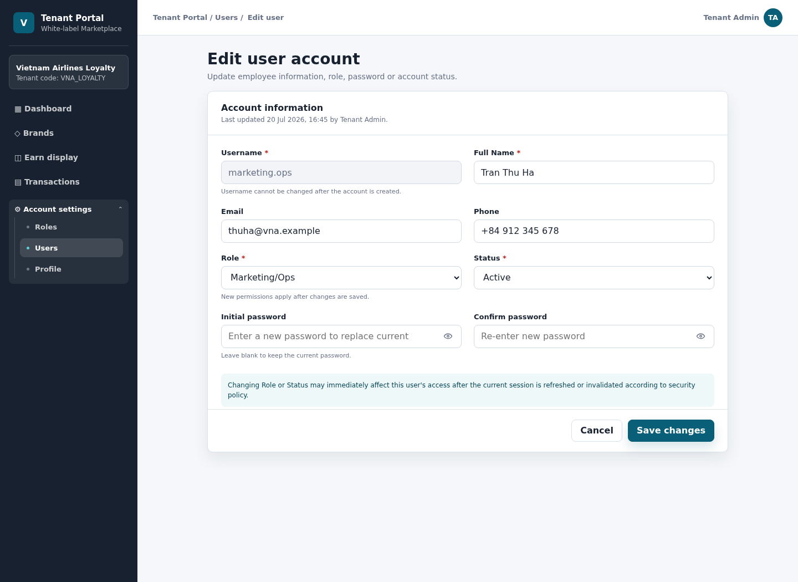

| # | Items | Control type | Data type | R/O | Description / Validation / Error handling |
|---:|---|---|---|---|---|
| 1 | Username | Disabled textbox | Text | O | <ul><li>Hiển thị Username hiện tại.</li><li>Không cho phép chỉnh sửa sau khi tài khoản được tạo.</li></ul> |
| 2 | Full Name | Textbox | Text | R | <ul><li>Hiển thị sẵn Full Name và cho phép chỉnh sửa, tối đa 150 ký tự.</li><li>Nếu bỏ trống, hiển thị `Full Name is required.`.</li></ul> |
| 3 | Email | Textbox | Email | O | <ul><li>Hiển thị sẵn Email và cho phép chỉnh sửa.</li><li>Nếu nhập sai định dạng, hiển thị `Please enter a valid email address.`.</li></ul> |
| 4 | Phone | Textbox | Text | O | <ul><li>Hiển thị sẵn Phone và cho phép chỉnh sửa.</li><li>Nếu sai định dạng, hiển thị `Please enter a valid phone number.`.</li></ul> |
| 5 | Role | Dropdown | Role reference | R | <ul><li>Hiển thị Role hiện tại và chỉ cho chọn Role Active thuộc cùng Tenant.</li><li>Chỉ hiển thị Role Active thuộc Tenant hiện tại đã được khai báo tại màn hình Role</li><li>Nếu đổi Role, sau khi lưu hệ thống thu hồi quyền cũ, áp dụng Permission mới và vô hiệu hóa session/token hiện tại.</li><li>Nếu Role được chọn không còn Active tại thời điểm lưu, từ chối cập nhật và hiển thị `Selected role is no longer active.`.</li></ul> |
| 6 | Status | Dropdown | Enum | R | <ul><li>Cho phép chọn `Active`, `Inactive` hoặc `Locked` theo policy.</li><li>Chuyển sang Inactive làm vô hiệu hóa session/token và chặn đăng nhập.</li><li>Khi mở khóa, Tenant Admin chuyển `Locked` sang `Active`; hệ thống reset bộ đếm đăng nhập thất bại về `0`.</li><li>Không cho Inactive/Locked Tenant Admin cuối cùng đang Active.</li></ul> |
| 7 | Initial password | Password textbox | Text | O | <ul><li>Để trống để giữ mật khẩu hiện tại.</li><li>Nếu nhập mật khẩu mới, phải đạt password policy; click icon con mắt để hiện/ẩn.</li><li>Không hiển thị hoặc đọc lại mật khẩu hiện tại.</li></ul> |
| 8 | Confirm password | Password textbox | Text | O có điều kiện | <ul><li>Bắt buộc khi Initial password mới được nhập; nếu bỏ trống trong trường hợp này, hiển thị `Confirm password is required.`.</li><li>Nếu không trùng, hiển thị `Passwords do not match.`.</li></ul> |
| 9 | Cancel | Button | Action | O | <ul><li>Click `Cancel` để quay về `Screen 1 — Accounts` và không lưu thay đổi.</li><li>Nếu có dữ liệu thay đổi, hiển thị xác nhận trước khi rời màn hình.</li></ul> |
| 10 | Save changes | Button | Action | O | <ul><li>Click `Save changes` để validate và cập nhật tài khoản.</li><li>Nếu dữ liệu không hợp lệ, giữ nguyên màn hình và hiển thị lỗi tương ứng.</li><li>Nếu Role/Status thay đổi, hệ thống áp dụng chính sách thu hồi quyền và session.</li><li>Nếu hợp lệ, lưu thay đổi, ghi Audit Log và điều hướng về `Screen 1`.</li></ul> |

### g. Business Rules

| BR ID | Rule |
|---|---|
| BR-TP-USER-001-01 | Tenant Admin chỉ quản lý user có cùng `tenant_id`. |
| BR-TP-USER-001-02 | Không cho Tenant Admin tự khóa chính mình nếu đó là Tenant Admin active cuối cùng. |
| BR-TP-USER-001-03 | Password phải hash ở backend, không lưu hoặc hiển thị lại plain text. |
| BR-TP-USER-001-04 | Mọi thay đổi user/role/status phải ghi audit log. |
| BR-TP-USER-001-05 | Mỗi tài khoản nhân viên phải được gán đúng một Role thuộc cùng Tenant tại một thời điểm. |
| BR-TP-USER-001-06 | Chỉ Role có trạng thái `Active` mới được hiển thị trong dropdown và được gán mới cho tài khoản. |
| BR-TP-USER-001-07 | Không được gán Role của Tenant khác hoặc Role/Permission dành riêng cho Platform Admin/Ops. |
| BR-TP-USER-001-08 | Khi đổi Role, quyền cũ phải bị thu hồi và Permission của Role mới phải được áp dụng; session/token hiện tại phải bị vô hiệu hóa để tránh tiếp tục sử dụng quyền cũ. |
| BR-TP-USER-001-09 | Tài khoản có trạng thái `Inactive` không được đăng nhập hoặc gọi API Tenant Portal, kể cả khi Role được gán đang Active. |
| BR-TP-USER-001-10 | Khi Role đang được gán bị chuyển sang `Inactive`, tài khoản không tự chuyển trạng thái sang Inactive nhưng toàn bộ quyền hiệu lực bị thu hồi, session/token bị vô hiệu hóa và truy cập bị chặn. |
| BR-TP-USER-001-11 | Tài khoản chỉ được truy cập lại khi tài khoản đang Active và Role được gán đang Active; việc Active lại Role hoặc gán Role Active khác không tự Active một tài khoản đang Inactive. |
| BR-TP-USER-001-12 | Mọi thay đổi Role phải ghi Audit Log gồm User, Role cũ, Role mới, Tenant, người thao tác và thời gian thay đổi. |
| BR-TP-USER-001-13 | Auth Service tự động chuyển tài khoản sang `Locked` tại lần đăng nhập thất bại liên tiếp thứ 5; trạng thái này phải được đồng bộ và hiển thị trên Accounts. |
| BR-TP-USER-001-14 | Chỉ Tenant Admin có quyền `tenant_user.manage` mới được chuyển tài khoản từ `Locked` sang `Active`; thao tác này reset bộ đếm thất bại và không thay đổi Role được gán. |
| BR-TP-USER-001-15 | Khóa hoặc mở khóa tài khoản phải vô hiệu hóa session/token liên quan và ghi Audit Log gồm nguyên nhân, người/hệ thống thực hiện và thời gian. |

### h. Acceptance Criteria

| AC ID | Criteria |
|---|---|
| AC-TP-USER-001-01 | Tenant Admin tạo được user hợp lệ thuộc Tenant mình. |
| AC-TP-USER-001-02 | Account trùng bị chặn và hiển thị lỗi. |
| AC-TP-USER-001-03 | User không có quyền quản lý user không thấy hoặc không gọi được action tạo/sửa/khóa. |
| AC-TP-USER-001-04 | Role được enforce đúng trên các module Tenant Portal. |
| AC-TP-USER-001-05 | Dropdown Role chỉ hiển thị Role Active thuộc Tenant hiện tại. |
| AC-TP-USER-001-06 | Tạo hoặc chỉnh sửa tài khoản không chọn Role bị chặn và hiển thị lỗi bắt buộc chọn. |
| AC-TP-USER-001-07 | Đổi sang Role Active khác thu hồi quyền cũ, áp dụng quyền mới và vô hiệu hóa session/token cũ. |
| AC-TP-USER-001-08 | Không thể gán Role Inactive, Role của Tenant khác hoặc Role Platform Admin/Ops cho tài khoản. |
| AC-TP-USER-001-09 | Chuyển tài khoản sang Inactive làm người dùng bị đăng xuất và không thể đăng nhập lại cho đến khi tài khoản Active. |
| AC-TP-USER-001-10 | Khi Role đang gán bị Inactive, tài khoản vẫn giữ nguyên Status nhưng bị đăng xuất và nhận thông báo `Assigned role is inactive. Please contact your Tenant Administrator.` khi truy cập lại. |
| AC-TP-USER-001-11 | Active lại Role chỉ khôi phục truy cập cho tài khoản đang Active; tài khoản Inactive vẫn bị chặn. |
| AC-TP-USER-001-12 | Gán Role và thay đổi Status tạo Audit Log đầy đủ dữ liệu trước/sau thay đổi. |
| AC-TP-USER-001-13 | Tài khoản đạt 5 lần đăng nhập thất bại liên tiếp tự động hiển thị `Locked` trên Accounts. |
| AC-TP-USER-001-14 | Tenant Admin mở khóa tài khoản bằng cách chuyển Status từ Locked sang Active; bộ đếm thất bại được reset về `0`. |
| AC-TP-USER-001-15 | User không có quyền `tenant_user.manage` không thể mở khóa tài khoản qua UI hoặc API. |

## 5. TP-PROFILE-001 - Quản lý thông tin cá nhân

### a. Introduction

Chức năng cho phép người dùng Tenant Portal tự xem và cập nhật thông tin cá nhân của chính mình gồm Full Name, Email, Phone và Password. 
Username, Role và Status chỉ hiển thị để tham chiếu và không được chỉnh sửa tại màn Profile.

Thông tin được lưu trực tiếp vào cùng bản ghi User đang đăng nhập. Vì vậy, mọi thay đổi Full Name, Email hoặc Phone trên Profile phải được phản ánh tại màn `Account settings > Accounts` khi Tenant Admin xem danh sách hoặc chi tiết tài khoản đó.

### b. Actors/Objects

| Actor/Object | Role |
|---|---|
| Tenant Admin/Staff | Xem và cập nhật thông tin cá nhân của chính mình. |
| Tenant Portal | Hiển thị Profile, validate dữ liệu và thông báo kết quả cập nhật. |
| Tenant User Service | Đọc/cập nhật cùng bản ghi User được sử dụng tại màn Accounts. |
| Auth/Session Service | Xác thực session hiện tại và vô hiệu hóa session/token khi Password thay đổi. |
| Audit Service | Ghi nhận thay đổi Profile và sự kiện đổi Password. |

### c. Pre-conditions

- Người dùng đã đăng nhập Tenant Portal bằng tài khoản hợp lệ.
- Tài khoản, Tenant và Role được gán đang `Active`.
- Session hiện tại còn hiệu lực.
- Tenant User Service, Auth/Session Service và Audit Service khả dụng.

### d. Expected Result

- Người dùng xem được thông tin hiện tại của chính mình.
- Người dùng chỉ chỉnh sửa được Full Name, Email, Phone, New password và Confirm password.
- Username, Role và Status không thể chỉnh sửa từ Profile.
- Dữ liệu hợp lệ được cập nhật vào cùng bản ghi User và hiển thị nhất quán trên Profile, Account list, Account view và Account edit.
- Nếu Password thay đổi, mật khẩu mới được hash an toàn và các session/token cũ bị vô hiệu hóa.
- Mọi thay đổi được ghi Audit Log và không làm thay đổi Role, Permission hoặc Status của tài khoản.

### e. Logic Diagram

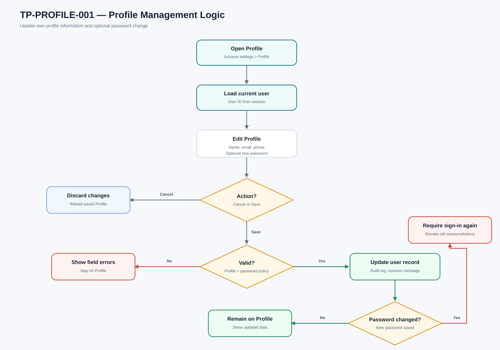

### f. Screen Flow

1. Người dùng mở `Account settings > Profile`.
2. Hệ thống lấy User ID từ session và tải thông tin của chính tài khoản đang đăng nhập.
3. Người dùng chỉnh sửa Full Name, Email, Phone; có thể nhập New password và Confirm password nếu muốn đổi mật khẩu.
4. Người dùng nhấn `Cancel` để hủy thay đổi, tải lại dữ liệu đã lưu và giữ nguyên màn Profile.
5. Người dùng nhấn `Save`; hệ thống trim dữ liệu và validate toàn bộ trường.
6. Nếu dữ liệu không hợp lệ, hệ thống giữ nguyên màn hình, highlight từng trường và hiển thị thông báo lỗi tương ứng.
7. Nếu Password để trống ở cả hai trường, hệ thống giữ nguyên mật khẩu hiện tại.
8. Nếu nhập New password, Confirm password trở thành bắt buộc và phải trùng khớp; mật khẩu mới phải đạt password policy.
9. Nếu hợp lệ, hệ thống cập nhật cùng bản ghi User, ghi Audit Log và hiển thị `Profile updated successfully`.
10. Full Name, Email và Phone mới được hiển thị tại Account list/Account detail khi dữ liệu được tải lại.
11. Nếu Password thay đổi, hệ thống vô hiệu hóa các session/token cũ và yêu cầu người dùng đăng nhập lại bằng mật khẩu mới theo security policy.

### g. Screen Description

Screen: My Profile

Mockup:

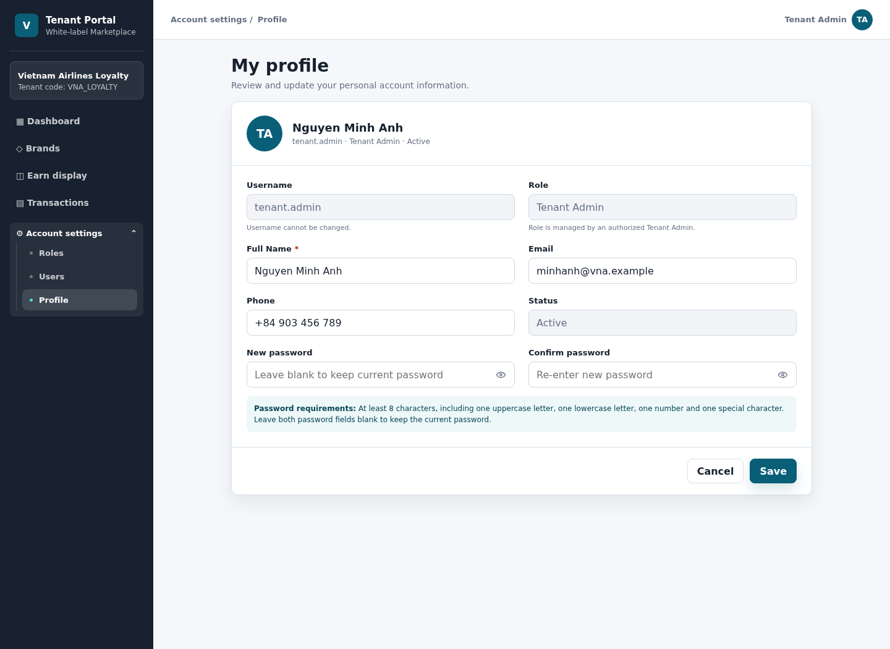

| # | Items | Control type | Data type | R/O | Description / Validation / Error handling |
|---:|---|---|---|---|---|
| 1 | Username | Disabled textbox | Text | O | <ul><li>Hiển thị Username của tài khoản đang đăng nhập.</li><li>Không được chỉnh sửa tại Profile.</li></ul> |
| 2 | Role | Disabled textbox | Role reference | O | <ul><li>Hiển thị Role hiện đang được gán.</li><li>Không được chỉnh sửa tại Profile; chỉ Tenant Admin có quyền quản lý User mới được thay đổi Role tại màn Edit user.</li></ul> |
| 3 | Full Name | Textbox | Text | R | <ul><li>Hiển thị Full Name hiện tại; cho phép chỉnh sửa và trim khoảng trắng đầu/cuối.</li><li>Tối đa 150 ký tự.</li><li>Nếu bỏ trống hoặc chỉ chứa khoảng trắng, highlight trường và hiển thị `Full Name is required.`.</li></ul> |
| 4 | Email | Textbox | Email | O | <ul><li>Hiển thị Email hiện tại; cho phép chỉnh sửa, tối đa 254 ký tự.</li><li>Nếu nhập sai định dạng, highlight trường và hiển thị `Please enter a valid email address.`.</li><li>Email mới được cập nhật vào cùng bản ghi User.</li></ul> |
| 5 | Phone | Textbox | Text | O | <ul><li>Hiển thị Phone hiện tại; cho phép chữ số, khoảng trắng, `+`, `-`, `(`, `)`, tối đa 20 ký tự.</li><li>Nếu sai định dạng, highlight trường và hiển thị `Please enter a valid phone number.`.</li><li>Phone mới được cập nhật vào cùng bản ghi User.</li></ul> |
| 6 | Status | Disabled textbox | Enum | O | <ul><li>Hiển thị Status hiện tại của tài khoản.</li><li>Không được chỉnh sửa tại Profile.</li></ul> |
| 7 | New password | Password textbox | Text | O | <ul><li>Để trống để giữ mật khẩu hiện tại.</li><li>Mặc định che giá trị; click icon con mắt để hiện/ẩn.</li><li>Nếu nhập, tối thiểu 8 ký tự và phải gồm chữ hoa, chữ thường, số, ký tự đặc biệt.</li><li>Nếu không đạt policy, hiển thị `Password does not meet the requirements.`.</li></ul> |
| 8 | Confirm password | Password textbox | Text | O có điều kiện | <ul><li>Để trống khi không đổi Password.</li><li>Khi New password có dữ liệu, trường này bắt buộc; nếu trống hiển thị `Confirm password is required.`.</li><li>Nếu không trùng New password, hiển thị `Passwords do not match.`.</li><li>Click icon con mắt để hiện/ẩn.</li></ul> |
| 9 | Cancel | Button | Action | O | <ul><li>Click `Cancel` để hủy dữ liệu chưa lưu, tải lại giá trị hiện tại từ hệ thống và giữ người dùng tại màn Profile.</li><li>Không cập nhật User record và không ghi Audit Log thay đổi.</li></ul> |
| 10 | Save | Button | Action | O | <ul><li>Click `Save` để validate và cập nhật Profile.</li><li>Nếu có lỗi, giữ nguyên màn hình và hiển thị lỗi tại trường tương ứng.</li><li>Nếu hợp lệ, cập nhật cùng bản ghi User, ghi Audit Log và hiển thị `Profile updated successfully`.</li><li>Nếu Password thay đổi, vô hiệu hóa session/token cũ và yêu cầu đăng nhập lại.</li></ul> |

### h. Business Rules

| BR ID | Rule |
|---|---|
| BR-TP-PROFILE-001-01 | Người dùng chỉ được xem và cập nhật Profile của User ID lấy từ session; không nhận User ID tùy ý từ client. |
| BR-TP-PROFILE-001-02 | Username, Role, Permission, Status và Tenant không được thay đổi qua Profile. |
| BR-TP-PROFILE-001-03 | Full Name là bắt buộc; Email và Phone là tùy chọn nhưng phải đúng định dạng nếu có dữ liệu. |
| BR-TP-PROFILE-001-04 | Profile và User Management phải sử dụng cùng một User record; thay đổi Full Name, Email, Phone phải nhất quán trên mọi màn hình. |
| BR-TP-PROFILE-001-05 | Để trống cả New password và Confirm password nghĩa là không thay đổi mật khẩu hiện tại. |
| BR-TP-PROFILE-001-06 | Khi New password có dữ liệu, Confirm password là bắt buộc, phải trùng khớp và mật khẩu mới phải đạt password policy. |
| BR-TP-PROFILE-001-07 | Password phải được hash ở backend; không lưu, hiển thị lại hoặc ghi log Password/Confirm password dạng plain text. |
| BR-TP-PROFILE-001-08 | Đổi Password thành công phải vô hiệu hóa session/token cũ và yêu cầu xác thực lại theo security policy. |
| BR-TP-PROFILE-001-09 | Việc cập nhật Profile không được tự động Active/Unlock tài khoản hoặc thay đổi Role/Permission. |
| BR-TP-PROFILE-001-10 | Audit Log phải ghi User, Tenant, trường thay đổi, giá trị trước/sau đối với dữ liệu không nhạy cảm, thời gian và nguồn thao tác; không ghi giá trị Password. |

### i. Acceptance Criteria

| AC ID | Criteria |
|---|---|
| AC-TP-PROFILE-001-01 | Người dùng mở Profile và chỉ thấy thông tin của chính tài khoản đang đăng nhập. |
| AC-TP-PROFILE-001-02 | Username, Role và Status hiển thị đúng và không thể chỉnh sửa. |
| AC-TP-PROFILE-001-03 | Full Name bỏ trống hiển thị `Full Name is required.` và không lưu dữ liệu. |
| AC-TP-PROFILE-001-04 | Email hoặc Phone sai định dạng bị highlight và hiển thị đúng thông báo lỗi. |
| AC-TP-PROFILE-001-05 | Để trống hai trường Password và nhấn Save giữ nguyên mật khẩu hiện tại. |
| AC-TP-PROFILE-001-06 | Nhập New password nhưng bỏ trống Confirm password hiển thị `Confirm password is required.`. |
| AC-TP-PROFILE-001-07 | Hai mật khẩu không trùng nhau hiển thị `Passwords do not match.`. |
| AC-TP-PROFILE-001-08 | Save dữ liệu hợp lệ hiển thị `Profile updated successfully` và cập nhật cùng User record. |
| AC-TP-PROFILE-001-09 | Full Name, Email và Phone mới hiển thị đúng trên Account list, Account view và Account edit sau khi tải lại. |
| AC-TP-PROFILE-001-10 | Đổi Password thành công hash mật khẩu, vô hiệu hóa session/token cũ và không ghi plain text vào log. |
| AC-TP-PROFILE-001-11 | Cancel hủy toàn bộ dữ liệu chưa lưu và không tạo Audit Log thay đổi. |
| AC-TP-PROFILE-001-12 | Người dùng không thể sửa Profile của User khác bằng cách thay đổi request hoặc URL. |

## 6. TP-DASH-001 - Xem dashboard báo cáo Tenant

### a. Introduction

Chức năng Dashboard cung cấp báo cáo tổng quan chỉ đọc về lưu lượng truy cập, order được attribution và kết quả commission của Tenant đang đăng nhập. Dữ liệu được tổng hợp từ Click Tracking Record và Transaction đã được Platform ghi nhận; Dashboard không tạo mới, sửa hoặc thay đổi trạng thái order/commission.

Mockup tham chiếu: [`tenant-portal-dashboard.html`](../mockups/tenant-portal-dashboard.html).

### b. Actors and Roles

| Actor/Object | Role |
|---|---|
| Tenant Admin/Tài khoản Tenant được phân quyền | Xem toàn bộ dashboard và các chỉ số tài chính khi có permission tương ứng. |
| Tenant Viewer/tài khoản Tenant được phân quyền | Xem dashboard và chỉ các trường được RBAC cho phép. |
| Reporting Service | Tổng hợp Click Tracking Record, Transaction và dữ liệu master theo cùng Tenant scope/filter/snapshot. |
| Permission Service | Kiểm tra quyền xem Dashboard và quyền xem dữ liệu tài chính. |
| Click Tracking Service | Cung cấp click outbound đã được ghi nhận cho Tenant. |
| Transaction/Commission Service | Cung cấp order, trạng thái, amount, commission source và commission amount. |

### c. Pre-conditions

- User đã đăng nhập, session/token hợp lệ và Tenant đang `Active`.
- User có permission `View Dashboard`; các chỉ số tiền tệ/commission yêu cầu permission tài chính theo RBAC.
- Click Tracking Record hoặc Transaction đã được Platform ghi nhận với `tenant_id`; Dashboard không đọc dữ liệu trực tiếp từ client/end-user.
- Brand dùng trong filter phải thuộc danh sách Brand được assign cho Tenant hiện tại.

### d. Expected Result

- Dashboard chỉ tổng hợp dữ liệu thuộc `tenant_id` lấy từ session/token.
- Combobox `Date range` gồm `Week`, `Month`, `Year` và áp dụng thống nhất cho toàn bộ Dashboard; Brand filter cũng áp dụng cho tất cả các khối.
- User xem được nguồn phát sinh commission, số lượng order được ghi nhận, Revenue và Actual commission ở mức tổng hợp.
- Order Status = `Cancelled` không được cộng vào Actual commission; dữ liệu lịch sử Estimated vẫn được thể hiện theo rule báo cáo.
- Khi không có dữ liệu, các tổng bằng `0` và từng vùng hiển thị empty state phù hợp.

### f. Main Flow

| Step | Actor | Action/System Response |
|---:|---|---|
| 1 | Tenant user | Mở menu `Dashboard`. |
| 2 | System | Kiểm tra session, Tenant status, permission Dashboard và permission tài chính. |
| 3 | System | Khởi tạo Date range = `Month`; Brand = `All Brands`. |
| 4 | System | Lấy `tenant_id` từ session/token, tạo reporting snapshot và tải filter options thuộc Tenant. |
| 5 | System | Query và tổng hợp toàn bộ metric cards, ba line chart, Top performing Brands và Actual Commission theo cùng Date range và Brand filter. |
| 6 | System | Hiển thị Dashboard và `Last refreshed` từ thời điểm tạo snapshot. |
| 7 | Tenant user | Chọn Date range `Week`, `Month` hoặc `Year`, chọn Brand nếu cần rồi nhấn `Apply`. |
| 8 | System | Tạo snapshot mới và cập nhật đồng thời tất cả các khối theo cùng bộ lọc. `Week` hiển thị theo ngày trong tuần, `Month` theo ngày trong tháng và `Year` theo tháng trong năm. |
| 11 | Tenant user | Hover một điểm dữ liệu trong line chart. |
| 12 | System | Hiển thị tooltip gồm kỳ dữ liệu, tên chỉ số và giá trị chính xác. Với money series hiển thị VND đầy đủ; với order series hiển thị số lượng orders. |
| 13 | Tenant user | Nhấn `Refresh`. |
| 14 | System | Giữ nguyên Date range và Brand filter, tạo snapshot mới và cập nhật toàn bộ số liệu cùng `Last refreshed`. |

### g. Screen Description

Screen: `Tenant Dashboard` — nguồn thiết kế [`tenant-portal-dashboard.html`](../mockups/tenant-portal-dashboard.html).

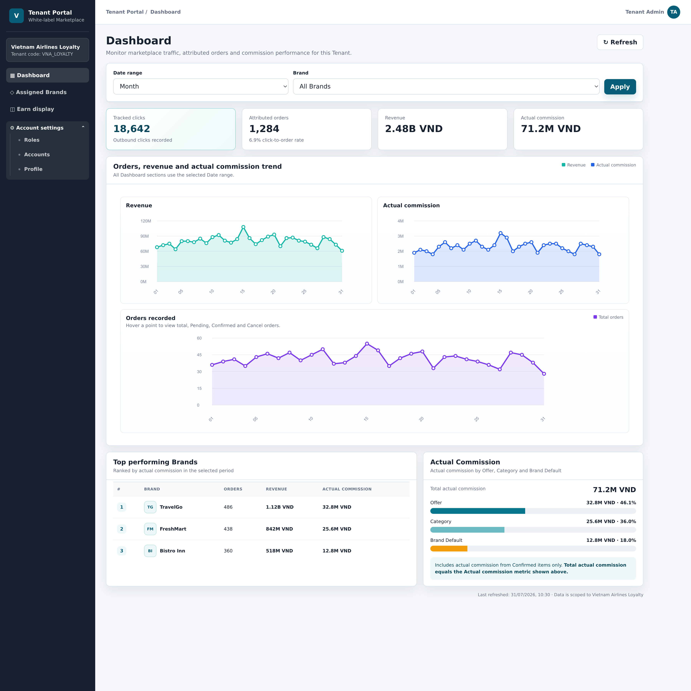

Ảnh trên minh họa Dashboard với bộ lọc mặc định `Date range = Month` và `Brand = All Brands`. Hai điều kiện được áp dụng thống nhất cho toàn bộ Dashboard, bao gồm các metric cards, ba biểu đồ xu hướng, bảng `Top performing Brands` và khối `Actual Commission`.

#### Screen state — Hover on chart

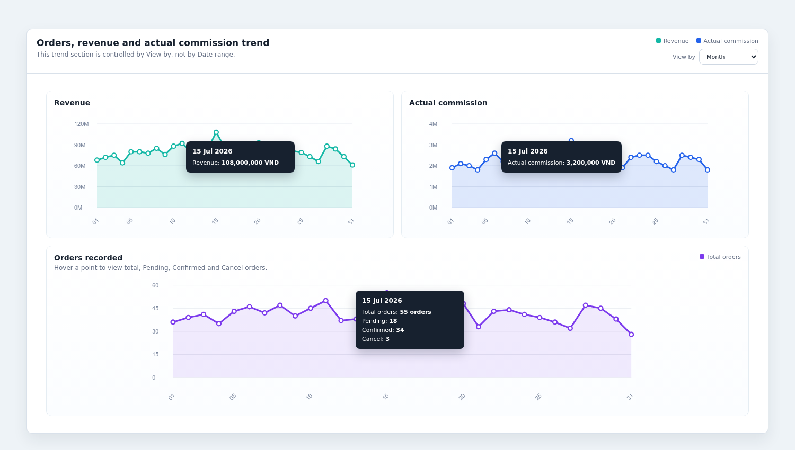

Ảnh trên minh họa trạng thái hover trong cụm `Orders, revenue and actual commission trend`. Khi đưa chuột vào một điểm dữ liệu, tooltip hiển thị kỳ dữ liệu và giá trị chính xác của từng biểu đồ:

- `Revenue`: doanh thu đơn hàng phát sinh ở tất cả các trạng thái đơn, hiển thị đầy đủ tiền tệ, ví dụ `Revenue: 108,000,000 VND`.
- `Actual commission`: Hoa hồng thực nhận tương ứng với các đơn hàng trạng thái = `Confirmed`, ví dụ `Actual commission: 3,200,000 VND`. Đơn hàng `Cancelled` không được cộng vào giá trị này.
- `Orders recorded`: Số lượng đơn hàng được ghi nhận. Khi tooltip vào từng điểm trên biểu đồ sẽ hiển thị tổng orders và breakdown `Pending`, `Confirmed`, `Cancel`.

Ba line chart dùng chung combobox `Date range` của Dashboard:
- `Month`: Theo tháng hiện tại, hiển thị theo các ngày 01, 05, 10, 15, 20, 25, 30/31. Trong mỗi khoảng ngày sẽ thì sẽ có các điểm tượng trung cho từng ngày một
- `Week`: theo tuần hiện tại, hiển thị từng ngày trong tuần (Mon, Tue, Wed,....)
- `Year`: Theo năm hiện tại, hiển thị theo từng tháng trong năm

| # | Items | Control type | Data type | R/O | Description / Validation / Error handling |
|---:|---|---|---|---|---|
| 1 | Date range | Combobox | Enum | R | Gồm `Week`, `Month`, `Year`; mặc định `Month`. Áp dụng cho tất cả metric cards, ba line chart, `Top performing Brands` và `Actual Commission`. |
| 2 | Brand | Dropdown | Brand ref | O | Mặc định `All Brands`. Danh sách chỉ gồm Brand được Platform assign cho Tenant. Chọn một Brand sẽ giới hạn toàn bộ số liệu Dashboard theo Brand đó. |
| 4 | Apply | Button | Action | O | Tạo snapshot mới và cập nhật toàn bộ Dashboard theo Date range và Brand đã chọn. Không giữ dữ liệu snapshot cũ khi filter thay đổi. |
| 5 | Refresh | Button | Action | O | Tải lại dữ liệu mới nhất theo filter mặc định.|
| 6 | Tracked clicks | Metric card | Integer | ReadOnly | Tracked clicks là tổng số lượt End-user click từ Landing Page của Tenant sang website chính thức của Brand; không yêu cầu click đã tạo order. Load dữ liệu dựa vào tất cả điều kiện lọc phía trên.|
| 7 | Attributed orders | Metric card | Integer | ReadOnly | Số lượng order được ghi nhận cho Tenant khi End-user click từ Landing Page của Tenant sang website chính thức của Brand và sau đó phát sinh order hợp lệ trên website Brand; không suy ra trực tiếp từ click count. Load dữ liệu dựa vào tất cả điều kiện lọc phía trên.|
| 8 | Click-to-order rate | Metric supporting text | Percentage | ReadOnly | `Attributed orders / Tracked clicks × 100` trong cùng filter. Hai tập dùng time field riêng tại item 1; nếu Tracked clicks = 0 thì hiển thị `0%` hoặc `—` theo UI convention, không phát sinh lỗi chia cho 0. |
| 9 | Revenue | Metric card | Money | ReadOnly | Tổng doanh thu đơn hàng phát sinh trên landing page ở tất cả các trạng thái. Load dữ liệu dựa vào tất cả điều kiện lọc phía trên. |
| 10 | Actual commission | Metric card | Money | ReadOnly | Tổng hoa hồng thực nhận của Tenant (là hoa hồng sinh ra từ các đơn hàng trạng thái`Confirmed`). Load dữ liệu dựa vào tất cả điều kiện lọc phía trên. |
| 11 | Orders, revenue and actual commission trend | Line charts | Money/Integer series | ReadOnly | <li>Gồm `Revenue`, `Actual commission` và `Orders recorded`.</li><li>Cả ba chart dùng chung Date range và Brand filter của Dashboard.</li><li>`Week`: theo từng ngày trong tuần; `Month`: theo từng ngày trong tháng; `Year`: theo từng tháng trong năm.</li><li>Tooltip của Orders recorded hiển thị total và breakdown Pending, Confirmed, Cancel của bucket.</li> |
| 14 | Trend tooltip | Tooltip | Text/Money/Integer | ReadOnly | Tooltip xuất hiện khi người dùng đưa chuột vào một điểm dữ liệu trên line chart và biến mất khi rời chuột khỏi điểm đó.<ul><li>Với `Revenue` và `Actual commission`, tooltip hiển thị kỳ dữ liệu và số tiền đầy đủ kèm `VND`, không rút gọn thành M/B.</li><li>Với `Orders recorded`, tooltip hiển thị kỳ dữ liệu và số lượng orders.</li><li>Tooltip chỉ mô tả đúng series đang hover, không đồng thời hiển thị nhiều chỉ số.</li></ul> |
| 15 | Top performing Brands | Ranking table | Brand/Number/Money | ReadOnly | <li>Hiển thị top 3 Brand đem lại hoa hồng thực nhận nhiều nhất theo Date range và Brand filter.</li><li>Xếp hạng giảm dần theo Actual commission; nếu bằng nhau lần lượt dùng Revenue, Orders và Brand name để ổn định thứ tự.</li> |
| 17 | Actual Commission distribution | Distribution bars | Money/Percentage | ReadOnly | Phân bổ Tenant Share thực nhận của các item `Confirmed` theo Tenant Share source `Offer`, `Category`, `Brand Default` trong Date range và Brand filter. Tỷ lệ từng nhóm = Actual commission của nhóm / Total actual commission × 100. |
| 18 | Commission priority note | Informational message | Text | ReadOnly | Khối `Actual Commission` chỉ tổng hợp Tenant Share thực nhận của các Order Item có `Item Status = Confirmed`. Item `Pending` hoặc `Refunded` không đóng góp vào giá trị hay tỷ lệ của bất kỳ nhóm source nào. Order tổng vẫn `Pending` nhưng có item `Confirmed` thì Tenant Share thực nhận của item Confirmed vẫn được tổng hợp. Source/rule snapshot của item Refunded vẫn được giữ tại Transaction Detail và Adjustment & Status History để audit, nhưng không được tính vào Dashboard Actual Commission. |
| 19 | Last refreshed | Supporting text | Datetime | ReadOnly | Lấy từ `Dashboard View Model.generated_at`, chuyển sang timezone Tenant và hiển thị `dd/mm/yyyy, HH:mm`. Đây là thời điểm snapshot hoàn tất, không phải thời gian của transaction mới nhất. |

### h. Business Rules

| BR ID | Rule |
|---|---|
| BR-TP-DASH-001-01 | Mọi query, filter option, summary, chart, table và Refresh bắt buộc scope theo `tenant_id` lấy từ session/token; không tin `tenant_id` do client truyền. |
| BR-TP-DASH-001-02 | User phải có permission View Dashboard. |
| BR-TP-DASH-001-03 | `Date range` chỉ gồm `Week`, `Month`, `Year`; mặc định `Month`. Kỳ hiện tại được xác định theo timezone của Tenant và áp dụng cho toàn Dashboard. |
| BR-TP-DASH-001-04 | Brand mặc định là `All Brands`. Danh sách Brand filter chỉ gồm Brand đã được Platform assign cho Tenant; không có điều kiện tìm kiếm theo Offer. |
| BR-TP-DASH-001-05 | Khi nhấn Apply hoặc Refresh, tất cả metric, chart, ranking và Actual Commission phải được cập nhật từ cùng reporting snapshot theo cùng Date range và Brand filter. |
| BR-TP-DASH-001-06 | `Attributed orders` là số lượng distinct Order đã được attribution cho Tenant trong kỳ. Khi chọn Brand, chỉ đếm Order có ít nhất một item thuộc Brand đó; một Order chỉ được đếm một lần. |
| BR-TP-DASH-001-07 | `Revenue` là tổng Final amount hiện tại của các item thuộc phạm vi lọc. Item `Refunded` có Final amount bằng `0`; khi chọn Brand, chỉ cộng item thuộc Brand đó. |
| BR-TP-DASH-001-08 | `Actual commission` là tổng Tenant Share thực nhận của các Order Item đã `Confirmed`; không cộng giá trị dự tính của item `Pending`, item `Refunded` hoặc item thuộc Order `Cancelled`. |
| BR-TP-DASH-001-09 | Metric `Actual commission`, series `Actual commission`, cột Actual commission trong `Top performing Brands` và tổng tại khối `Actual Commission` phải cùng Tenant scope, filter và reporting snapshot. |
| BR-TP-DASH-001-10 | `Orders recorded` là số lượng distinct Order theo từng bucket của Date range. Khi chọn Brand, một Order có nhiều item thuộc cùng Brand vẫn chỉ được đếm một lần trong bucket. |
| BR-TP-DASH-001-11 | Khối `Actual Commission` phân bổ giá trị Tenant Share thực nhận theo **Tenant Share source của từng Order Item**, gồm `Offer`, `Category` và `Brand Default`. Brand Default là tỷ lệ mặc định theo tổ hợp Tenant + Brand. Một Order có nhiều item có thể đóng góp vào nhiều nhóm source; không được phân loại source theo toàn Order. |
| BR-TP-DASH-001-12 | Trend gồm ba line chart `Revenue`, `Actual commission`, `Orders recorded`. Hai chart tiền tệ dùng trục Y theo VND; Orders recorded dùng số lượng Order. Tooltip phải hiển thị giá trị đầy đủ của đúng bucket đang hover. |
| BR-TP-DASH-001-13 | Date range quyết định bucket cho toàn Dashboard: `Week` = từng ngày trong tuần, `Month` = từng ngày trong tháng, `Year` = từng tháng trong năm. Với Month, chart có đủ dữ liệu từng ngày nhưng có thể rút gọn nhãn trục X để tránh rối. |
| BR-TP-DASH-001-14 | `Top performing Brands` hiển thị tối đa 3 Brand và xếp giảm dần theo Actual commission. Nếu bằng nhau, lần lượt so sánh Revenue, Orders và Brand name. Khi chọn một Brand, bảng chỉ hiển thị Brand đó nếu có dữ liệu trong kỳ. |
| BR-TP-DASH-001-15 | Giá trị của từng nhóm trong khối `Actual Commission` bằng tổng Tenant Share thực nhận của các item `Confirmed` có Tenant Share source tương ứng. `Offer + Category + Brand Default` phải bằng `Total actual commission` và bằng metric `Actual commission` khi dùng cùng filter/snapshot. |
| BR-TP-DASH-001-16 | Tỷ lệ của từng nhóm source được tính theo công thức: `Actual commission của nhóm / Total actual commission × 100`. Nếu tổng bằng `0`, tất cả nhóm hiển thị `0 VND` và `0%`; hệ thống không được chia cho 0. |
| BR-TP-DASH-001-17 | `Last refreshed` lấy từ `generated_at` của snapshot. Refresh giữ nguyên Date range và Brand filter. |
| BR-TP-DASH-001-18 | Mỗi item chỉ được cộng một lần vào đúng Tenant Share source đã được lưu trong rule snapshot của item; không resolve lại source theo cấu hình hiện tại khi chạy báo cáo. |
| BR-TP-DASH-001-20 | Giá trị phần trăm trên khối `Actual Commission` được làm tròn đến 1 chữ số thập phân; phép đối soát tổng sử dụng giá trị tiền chính xác trước khi làm tròn tỷ lệ. |

### i. Alternate/Exception Flows

| ID | Condition | Expected behavior |
|---|---|---|
| AF-TP-DASH-001-01 | Session hết hạn, Tenant Inactive hoặc user không có quyền View Dashboard | Không tải dữ liệu; trả `401/403` theo policy và không để lộ metric của Tenant. |
| AF-TP-DASH-001-02 | Date range không thuộc `Week`, `Month`, `Year` | Không Apply; từ chối giá trị không hợp lệ và giữ các filter hợp lệ khác. |
| AF-TP-DASH-001-03 | Brand không được assign cho Tenant hoặc Brand ID bị sửa trên request | Từ chối filter, không query chéo Tenant và yêu cầu chọn lại Brand hợp lệ. |
| AF-TP-DASH-001-04 | Date range/Brand không có dữ liệu | Metric hiển thị `0`; chart hiển thị đường dữ liệu 0 hoặc empty state; Top performing Brands hiển thị empty state; ba nhóm Actual Commission hiển thị `0 VND · 0%`. |
| AF-TP-DASH-001-05 | Tracked clicks = 0 | Click-to-order rate không chia cho 0; hiển thị 0% hoặc `—` theo convention. |
| AF-TP-DASH-001-07 | Dữ liệu Order/Item có trạng thái không hợp lệ | Không tự quy đổi sang trạng thái khác; loại record lỗi khỏi phép tổng hợp bị ảnh hưởng, ghi data-quality alert và không làm sai các tổng còn lại. |
| AF-TP-DASH-001-08 | Item chưa có Actual commission hoặc chưa `Confirmed` | Actual commission và Tenant Share thực nhận đóng góp `0`; không thay bằng giá trị dự tính. |
| AF-TP-DASH-001-09 | Item bị Refund/Cancel sau snapshot trước | Snapshot kế tiếp cập nhật Final amount và loại item khỏi Actual commission theo trạng thái mới. |
| AF-TP-DASH-001-11 | Dữ liệu nhiều currency nhưng chưa có exchange-rate snapshot | Không cộng chung; hiển thị lỗi/empty state cho metric tiền hoặc tách theo currency theo policy. |
| AF-TP-DASH-001-12 | Một section hoặc reporting query lỗi | Không hiển thị dữ liệu từ các snapshot khác nhau như một kết quả hoàn chỉnh; hiển thị lỗi tải Dashboard và cho phép Refresh. |

### j. Acceptance Criteria

| AC ID | Criteria |
|---|---|
| AC-TP-DASH-001-01 | User có quyền mở Dashboard và chỉ nhận dữ liệu thuộc Tenant trong session/token. |
| AC-TP-DASH-001-02 | Date range có đúng ba giá trị `Week`, `Month`, `Year` và mặc định `Month`; Brand mặc định `All Brands` và chỉ liệt kê Brand được assign cho Tenant; giao diện không có Offer filter. |
| AC-TP-DASH-001-03 | Apply cập nhật toàn bộ metric cards, ba line chart, Top performing Brands và Actual Commission từ cùng snapshot theo Date range và Brand filter. |
| AC-TP-DASH-001-04 | Tracked clicks bằng count Click Tracking Record theo clicked_at và filter; không tính impression/page view. |
| AC-TP-DASH-001-05 | Attributed orders bằng count distinct Order trong kỳ; khi chọn Brand, Order có một hoặc nhiều item thuộc Brand chỉ được đếm một lần. |
| AC-TP-DASH-001-06 | Click-to-order rate dùng đúng công thức và không lỗi khi click count bằng 0. |
| AC-TP-DASH-001-07 | Revenue bằng tổng Final amount hiện tại của các item thuộc phạm vi lọc; item Refunded đóng góp `0`. Actual commission chỉ cộng Tenant Share thực nhận của item `Confirmed`. |
| AC-TP-DASH-001-08 | Item `Pending`, `Refunded` và item thuộc Order `Cancelled` không được cộng vào Actual commission; metric card, series, Top Brands và khối `Actual Commission` trả cùng định nghĩa khi dùng cùng filter/snapshot. |
| AC-TP-DASH-001-09 | Trend hiển thị đúng ba chart `Revenue`, `Actual commission`, `Orders recorded`; đổi Date range sang Week/Month/Year và nhấn Apply cập nhật đồng thời toàn Dashboard. |
| AC-TP-DASH-001-10 | Hover từng điểm trên line chart hiển thị đúng bucket, series và giá trị chính xác; money series hiển thị VND đầy đủ, order series hiển thị số lượng orders. |
| AC-TP-DASH-001-11 | `Orders recorded` dùng Date range chung. Khi Date range = Month, chart có dữ liệu theo từng ngày trong tháng và có thể rút gọn nhãn trục X theo các mốc phù hợp. |
| AC-TP-DASH-001-12 | Top performing Brands hiển thị tối đa 3 Brand, đúng Orders, Revenue và Actual commission theo filter; khi chọn một Brand, bảng chỉ hiển thị Brand đó nếu có dữ liệu. |
| AC-TP-DASH-001-13 | Khối `Actual Commission` hiển thị đúng ba nhóm `Offer`, `Category`, `Brand Default` theo Tenant Share source của từng item; một Order có item thuộc nhiều source được phân bổ theo từng item, không bị ép vào một source chung. |
| AC-TP-DASH-001-14 | User không có financial permission không nhận metric/series/table field tài chính từ backend. |
| AC-TP-DASH-001-15 | Refresh giữ Date range và Brand filter, cập nhật snapshot và Last refreshed; không có nút Export. |
| AC-TP-DASH-001-16 | Filter không có dữ liệu hiển thị metric bằng 0, chart 0/empty, Top Brands empty và Actual Commission `0 VND · 0%` mà không phát sinh lỗi. |
| AC-TP-DASH-001-17 | Tổng tiền của `Offer + Category + Brand Default` bằng `Total actual commission` và bằng metric `Actual commission` khi áp dụng cùng Tenant, Date range, Brand filter và snapshot. |
| AC-TP-DASH-001-18 | Dashboard không tạo/sửa transaction và Earn display text không ảnh hưởng công thức báo cáo. |
| AC-TP-DASH-001-19 | Tỷ lệ từng source bằng giá trị source chia `Total actual commission`, hiển thị 1 chữ số thập phân; khi tổng bằng 0, giao diện hiển thị `0 VND` và `0%`. |
| AC-TP-DASH-001-20 | Báo cáo sử dụng Tenant Share source đã snapshot trên từng item tại thời điểm xử lý Transaction; thay đổi rule sau đó không làm đổi source của dữ liệu lịch sử. |

## 7. TP-BRAND-001 - Quản lý danh sách Brand được Platform assign

### a. Introduction

Chức năng cho phép Tenant Admin/tài khoản Tenant được phân quyền quản lý danh sách Brand đã được Platform assign cho Tenant hiện tại. 

Với mỗi Brand, Tenant có thể:

- Xem các Category đã được Platform mapping/assign cho Brand dựa trên cấu hình tại CMS. 
- Xem danh sách Offer thuộc Brand và bật/tắt hiển thị của từng Offer trên landing page. 
- Bật/tắt Brand trên landing page; khi Brand Off, toàn bộ Offer thuộc Brand đều không hiển thị.
- Chọn tối đa 3 Brand đang hiển thị trên landing page để đưa vào khu vực `Hot Brands` trên landing page.

### b. Actors/Objects

| Actor/Object | Role |
|---|---|
| Tenant Admin/Các tài khoản Tenant được phân quyền | Xem, lọc Brand; xem Category/Offer; bật/tắt hiển thị Brand trên landing page, bật/tắt Offer visibility và chọn Brand Hot theo quyền. |
| Category/Commission Service | Cung cấp mapping, commission, thời gian hiệu lực và status ở chế độ read-only. |
| Offer Service | Cung cấp Offer, Offer commission, thời gian hiệu lực và status. |
| Landing Page Runtime | Tính effective visibility và render Brand/Offer hợp lệ. |
| Audit Service | Ghi log thay đổi visibility. |

### c. Pre-conditions

- Tenant user đã đăng nhập; `tenant_id` lấy từ session.
- Tài khoản Tenant được phân quyền sử dụng chức năng này.
- Cần `brand_visibility.manage` để bật/tắt Brand, `offer_visibility.manage` để bật/tắt Offer và `brand_hot.manage` để chọn/bỏ chọn Brand Hot nếu hệ thống tách quyền riêng.
- Các dịch vụ Brand, Category/Commission, Offer và Visibility khả dụng.

### d. Expected Result

- Chỉ hiển thị Brand được assign cho Tenant hiện tại.
- Mỗi Brand chỉ hiển thị một dòng.
- Trong mỗi branch sẽ có 2 thông tin Category được mapping/assign cho Brand đó và danh sách các Offer được assign cho brand đó
- Tài khoản Tenant được phân quyền có thể on/off brand trên landing page hoặc on/off Offer đã được assign cho Brand
- Tài khoản Tenant được phân quyền có thể chọn tối đa 3 Brand đang bật `Show on landing` để hiển thị tại mục `Hot Brands` trên landing page.
- Bộ lọc, metric và phân trang không làm lộ dữ liệu Tenant khác.

### e. Logic Diagram

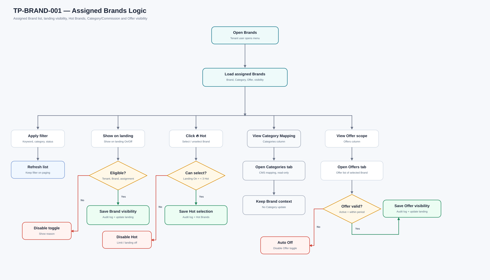

### f. Screen Flow

1. Tenant user vào menu `Assigned Brands`.
2. Hệ thống lấy `tenant_id` từ session và tải Brand có assignment hiện hành.
3. Hiển thị Assigned Brands, Visible on landing, Landing Coverage và lưới một Brand/một dòng.
4. Tenant lọc theo Keyword, Category hoặc Brand status và click `Apply`.
5. Click `Refresh` để tải dữ liệu mới nhất.
6. Bật/tắt `Show on landing` nếu có quyền và Brand đủ điều kiện. Khi bật từ Off sang On, hệ thống hiển thị popup xác nhận trước khi lưu.
7. Tại cột `Brand Hot`, Tenant click icon 🔥 để chọn/bỏ chọn Brand hiển thị tại mục `Hot Brands` trên landing page. Khi bật Brand Hot từ Off sang On, hệ thống hiển thị popup xác nhận trước khi lưu.
8. Nếu đã đủ 3 Brand Hot, hệ thống disable nút Brand Hot của các Brand chưa được chọn.
9. Nếu Brand đang Off tại `Show on landing`, hệ thống disable nút Brand Hot của Brand đó.
10. Tại cột `Categories`, Tenant click `View mappings` hoặc số lượng Category để mở rộng dòng Brand và hiển thị tab `Categories & Commission`. Đây là danh sách các Category phía Brand đã được Platform mapping với Affiliate Category cho chính Brand được chọn trên CMS
11. Tại cột `Offers`, Tenant click `View Offer scope` hoặc số lượng Offer để mở rộng dòng Brand và hiển thị tab `Offers`. Đây là danh sách các Offer thuộc chính Brand được chọn. Tenant chỉ được bật/tắt hiển thị từng Offer trên landing page
12. Khi Tenant chuyển giữa tab `Categories & Commission` và `Offers`, hệ thống giữ nguyên Brand context đang mở; không tải hoặc hiển thị Category/Offer của Brand khác.
13. Khi Offer vượt quá `Effective To`, hệ thống tạm thời ẩn Offer trên Landing Page nhưng vẫn giữ lại cấu hình Offer visibility của Tenant. Nếu Platform gia hạn để Offer hợp lệ trở lại, hệ thống giữ nguyên Offer Visibility đã được Tenant cấu hình: Nếu Offer Visibility trước đó là On và Brand đang được hiển thị, Offer tự động hiển thị lại trên Landing Page; nếu trước đó là Off, Offer tiếp tục bị ẩn.
14. Hệ thống lưu thay đổi, ghi Audit Log, tính lại effective visibility và cập nhật landing page.
15. Khi phân trang, hệ thống giữ nguyên điều kiện lọc.

### g. Screen Description

Screen: Assigned Brands

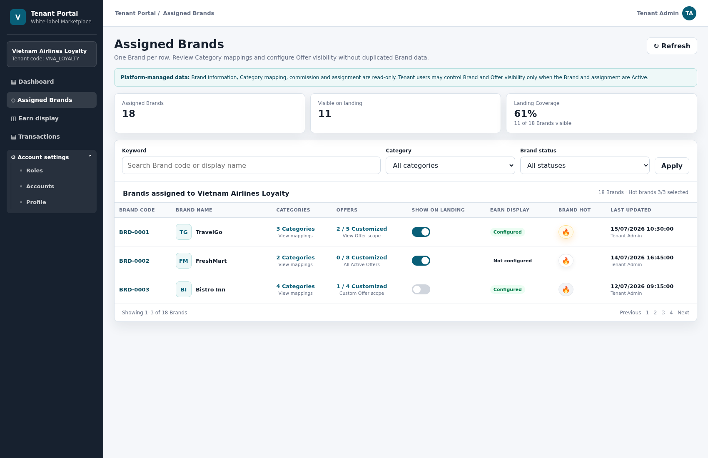

#### Screen state — Confirm Show on landing

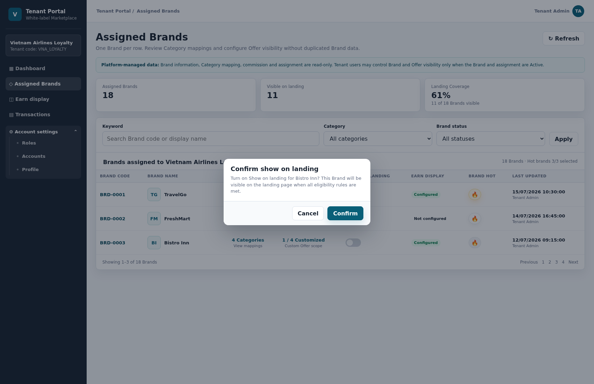

Popup xác nhận hiển thị khi Tenant bật `Show on landing` từ Off sang On. Tenant nhấn `Confirm` để lưu thay đổi hoặc `Cancel` để giữ nguyên trạng thái hiện tại. Tương tự, nếu muốn tắt hiển thị Brand này trên Landing page thì hiện popup xác nhận "`Turn off Show on landing for [Tên Brand] ? This Brand won't be visible on the landing page when all eligibility rules are meet.`" để xác nhận

#### Screen state — Confirm Brand Hot

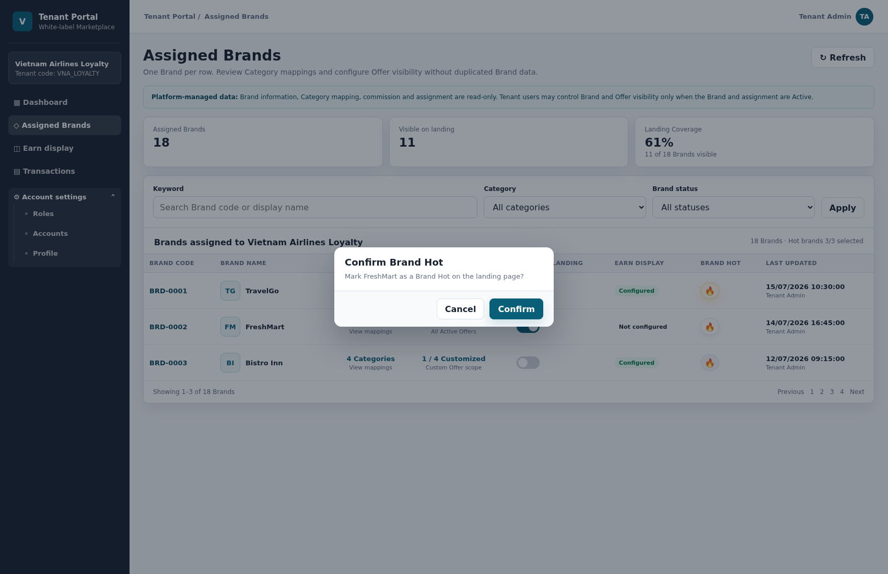

Popup xác nhận hiển thị khi Tenant bật `Brand Hot` từ Off sang On. Tenant nhấn `Confirm` để đưa Brand vào khu vực `Hot Brands` trên landing page hoặc `Cancel` để không thay đổi. Tương tự, nếu muốn tắt hiển thị Brand này ở khu vực Hot Brands trên landing page thì hiện popup xác nhận "`Unmark [Tên brand] as a Brand Hot on the ladning page?`" để xác nhận

#### Screen 1 — Assigned Brands list

| # | Items | Control type | Data type | R/O | Description / Validation / Error handling |
|---:|---|---|---|---|---|
| 1 | Assigned Brands | Metric card | Number | ReadOnly | <ul><li>Tổng Brand có assignment hiện hành của Tenant.</li><li>Mỗi Brand chỉ tính một lần; không phụ thuộc filter hoặc trang hiện tại.</li></ul> |
| 2 | Visible on landing | Metric card | Number | ReadOnly | Số lượng Brand còn hiệu lực và đang được on trên landing page tại thời điểm tải dữ liệu. |
| 3 | Landing Coverage | Metric card | Percentage | ReadOnly | <ul><li>Tính tỷ lệ phần trăm giữa số lượng brand đang on trên landing page và tổng số lượng brand được assign cho tenant</li><li>Công thức: `Visible on landing / Assigned Brands × 100`.</li><li>Làm tròn đến chữ số thập phân thứ 2. Ví dụ: 53,23%.</li><li>Tính trên toàn Tenant, không đổi theo filter/phân trang.</li></ul> |
| 4 | Refresh | Button | Action | O | <ul><li>Tải lại Brand, Category, Offer, visibility và metrics.</li><li>Lỗi hiển thị `Unable to refresh Brand data. Please try again.`.</li></ul> |
| 5 | Keyword | Textbox | Text | O | <ul><li>Tìm Brand code hoặc Brand Name.</li><li>Trim đầu/cuối, tối đa 100 ký tự.</li></ul> |
| 6 | Category | Dropdown | Category reference | O | <ul><li>Mặc định `All categories`.</li><li>Hiển thị tất cả các category được mapping với các brand tương ứng. Khi Tenant chọn 1 category nào đó hệ thống sẽ trả lại các brand có mapping với category đã chọn.</li><li>Tenant chỉ dùng để lọc, không sửa mapping.</li></ul> |
| 7 | Brand status | Dropdown | Enum | O | <ul><li>Gồm `All statuses`, `Active`, `Inactive` theo CMS.</li><li>Khi Tenant chọn 1 trạng thái nào đó hệ thống sẽ trả lại các brand có trạng thái tương ứng: Active (Hiển thị brand này trên landing page), Inactive (Không hiển thị brand này trên landing page)</li><li>Tenant chỉ lọc, không thay đổi Brand status.</li></ul> |
| 8 | Apply | Button | Action | O | <ul><li>Áp dụng Keyword, Category và Brand status; đưa về trang đầu.</li><li>Không có kết quả hiển thị `No assigned Brands found`.</li></ul> |
| 9 | Brand Code | Table column | Brand code | ReadOnly | <ul><li>Hiển thị mã Brand do Platform/CMS quản lý, ví dụ `BRD-0001`.</li><li>Dùng để đối soát dữ liệu giữa Tenant Portal, CMS, Transaction/reporting và ticket vận hành.</li><li>Brand Code là read-only; Tenant không được sửa, tạo mới, assign/unassign Brand qua màn hình này.</li><li>Keyword search có thể tìm theo Brand Code.</li></ul> |
| 10 | Brand Name | Table column | Brand reference | ReadOnly | <ul><li>Hiển thị logo/initial và tên hiển thị của Brand, ví dụ `TravelGo`.</li><li>Dữ liệu lấy từ Brand master do Platform/CMS quản lý.</li><li>Tenant không được sửa Brand Name hoặc logo trong màn hình này.</li></ul> |
| 11 | Categories | Link/Count | Number | ReadOnly/Action | <ul><li>Hiển thị tổng Category được mapping cho brand này, ví dụ `3 Categories`.</li><li>Click `View mappings` để hiển thị tab `Categories & Commission` như ảnh `Screen 2 — Categories & Commission expanded tab` - danh sách các category được mapping cho brand này bên CMS.</li><li>Muốn đóng tab này, nhấn `View mappings` lần nữa để đóng</li><li>Không có mapping hiển thị `0 Categories`, Khi nhấn `View mappings` sẽ hiển thị thông báo "No category is mapped for this brand"</li></ul> |
| 12 | Offers | Link/Count | Number/Number | ReadOnly/Action | <ul><li>Hiển thị `x / y Customized`: x là số lượng Offer của brand này mà Tenant đã cập nhật on/off thủ công so với cấu hình ban đầu bên CMS; y là tổng số lượng Offer của brand này mà Platform đã assign bên CMS. <li>Ví dụ: Platform assign cho Brand 5 Offer trạng thái hiển thị trên Landing Page, sau đó Tenant cập nhật 2 Offer không hiện trên Landing page nữa thì sẽ hiển thị 2/5.</li></li><li>Click `View Offers Scope` mở tab `Offers`  như ảnh `Screen 3 — Offers expanded tab` - Danh sách các Offer được Platform assign cho brand này.</li><li>Muốn đóng tab này, nhấn `View Offers Scope` lần nữa để đóng</li><li>Nếu Brand không có Offer, khi nhấn `View Offers Scope` sẽ hiển thị thông báo "No Offer is assigned for this Brands"</li></ul> |
| 13 | Show on landing | Toggle | Boolean | O theo quyền | <ul><li>`On`: Tenant yêu cầu hiển thị Brand này trên landing page; `Off`: ẩn Brand và toàn bộ Offer.</li><li>Tenant chỉ có thể bật Brand trên landing page khi Brand được assign cho Tenant và các điều kiện hiển thị hợp lệ.</li><li>Khi bật từ Off sang On, hệ thống hiển thị popup xác nhận. Chỉ khi Tenant nhấn `Confirm`, hệ thống mới lưu trạng thái On.</li><li>Brand chỉ hiển thị thực tế khi có ít nhất một Offer Active/còn hiệu lực hoặc tồn tại ít nhất 1 Category mapping hợp lệ.</li><li>Cập nhật thành công: `Brand visibility updated successfully`.</li><li>Conflict: `Brand visibility has changed. Please try again.`.</li></ul> |
| 14 | Earn display | Badge | Enum | ReadOnly | <ul><li>Cho biết Brand đã được cấu hình nội dung ưu đãi dạng text để hiển thị cho End User hay chưa.</li><li>`Configured`: Brand đã có cấu hình nội dung ưu đãi dạng text tại ít nhất một cấp: Brand, Category hoặc Offer (nếu có).</li><li>`Not configured`: Brand chưa có cấu hình nội dung ưu đãi dạng text tại bất kỳ cấp nào: Brand, Category hoặc Offer.</li><li>Thông tin này được lấy từ màn Earn Display.</li></ul> |
| 15 | Brand Hot | Icon toggle | Boolean | O theo quyền/điều kiện | <ul><li>Dùng icon 🔥 để chọn Brand hiển thị tại mục `Hot Brands` trên landing page.</li><li>Chỉ cho bật Brand Hot khi Brand đang `Show on landing = On`, Brand assignment Active, Brand master Active và user có quyền thao tác.</li><li>Khi bật Brand Hot từ Off sang On, hệ thống hiển thị popup xác nhận. Chỉ khi Tenant nhấn `Confirm`, hệ thống mới lưu trạng thái On. Tương tự, khi tắt Brand Hot cũng sẽ hiện popup xác nhận như mô tả phía trên</li><li>Mỗi Tenant chỉ được chọn tối đa 3 Brand Hot tại một thời điểm.</li><li>Nếu đã đủ 3 Brand Hot, hệ thống disable nút Brand Hot của các Brand chưa được chọn.</li><li>Nếu Brand đang `Show on landing = Off`, hệ thống disable nút Brand Hot.</li><li>Khi Tenant tắt `Show on landing` của một Brand đang được chọn Hot, hệ thống tự động bỏ chọn Brand Hot của Brand đó hoặc không cho lưu trạng thái Brand Hot còn hiệu lực. Landing page không được hiển thị Brand Hot đã bị ẩn.</li><li>Cập nhật thành công: `Hot Brand selection updated successfully`.</li></ul> |
| 16 | Last updated | Table column | Datetime/User | ReadOnly | <ul><li>Hiển thị thời gian cập nhật gần nhất theo format `dd/mm/yyyy hh:mm:ss`, ví dụ `15/07/2026 10:30:00`.</li><li>Hiển thị username người cập nhật ở dòng bên dưới datetime.</li><li>Thời gian lấy từ lần cập nhật Brand visibility, Offer visibility hoặc Brand Hot gần nhất trong phạm vi Brand đó.</li></ul> |
| 17 | Pagination | Pagination | Numeric | O | Phân trang theo Brand; giữ filter khi click Previous, số trang hoặc Next. |

#### Screen 2 — Categories & Commission expanded tab

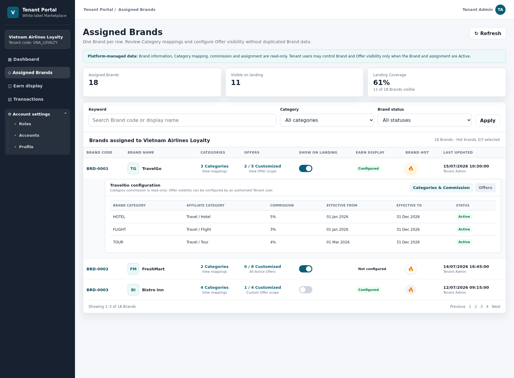

| # | Items | Control type | Data type | R/O | Description / Validation / Error handling |
|---:|---|---|---|---|---|
| 1 | Categories & Commission | Tab | Action | O | Click số Categories hoặc tab để xem mapping của Brand đang mở. |
| 2 | Brand Category | Table column | Text | ReadOnly | Tên Category phía Brand do Platform cấu hình, ; Tenant không được sửa. |
| 3 | Affiliate Category | Table column | Category reference | ReadOnly | Affiliate Category được mapping; Tenant không được sửa. |
| 4 | Commission | Table column | Percentage/Money | ReadOnly| <ul><li>Commission theo Category do Platform cấu hình chia sẻ cho Tenant</li><li>Tenant không được sửa.</li></ul> |
| 5 | Effective From | Table column | Date | ReadOnly | <ul><li>Ngày mapping/commission bắt đầu hiệu lực được cấu hình bên CMS, định dạng dd/mm/yyy</li><li>Tenant không được sửa.</li></ul>|
| 6 | Effective To | Table column | Date | ReadOnly |<ul><li> Ngày kết thúc; không giới hạn hiển thị `_` được cấu hình bên CMS, định dạng dd/mm/yyy</li> <li>Tenant không được sửa.</li></ul>|
| 7 | Status | Badge | Enum | ReadOnly | <ul><li>`Active`/`Inactive` do Platform quản lý được cấu hình bên CMS.</li> <li>Tenant không được sửa.</li></ul>|

#### Screen 3 — Offers expanded tab

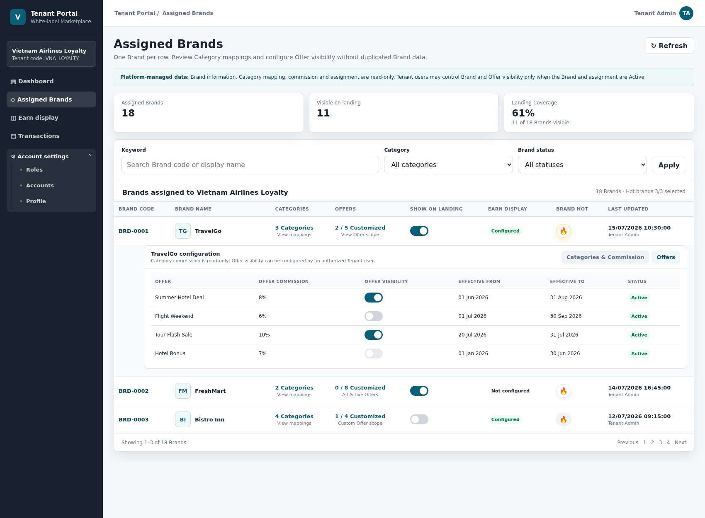

| # | Items | Control type | Data type | R/O | Description / Validation / Error handling |
|---:|---|---|---|---|---|
| 1 | Offers | Tab | Action | O | Click số Offers hoặc tab để xem Offer thuộc Brand đang mở. |
| 2 | Offer | Table column | Offer reference | ReadOnly | Offer name được Platform assign cho Brand tương ứng; không trả Offer của Brand/Tenant khác. |
| 3 | Offer commission | Table column | Percentage/Money | ReadOnly theo quyền | <ul><li>Do Platform cấu hình; Tenant không được sửa.</li><li>Hiển thị % hoa hồng được Platform cấu hình chia sẻ cho Tenant theo Offer tương ứng bên CMS</li></ul> |
| 4 | Offer visibility | Toggle | Boolean | O theo quyền | <ul><li>`On`: Tenant cho phép Offer hiển thị trên landing page; `Off`: ẩn Offer trên landing page của Tenant hiện tại.</li><li>Nếu `Show on landing` của Brand là Off thì toàn bộ Offer tạm thời không hiển thị; không làm mất lựa chọn On/Off trước đó của Tenant; cấu hình riêng của từng Offer được giữ lại để dùng khi Brand được bật lại.</li><li>Chỉ cho thao tác khi Offer Active, còn hiệu lực và user có quyền `offer_visibility.manage`.</li><li>Khi Offer hết hạn, landing page tạm thời không hiển thị Offer; không làm mất lựa chọn On/Off trước đó của Tenant, disable toggle và hiển thị thông báo nếu Tenant thao tác bật lại `This Offer has expired and is not currently visible on the landing page..`</li><li>Tenant không thể bật lại Offer đã hết hạn qua UI hoặc API.</li><li>Nếu Platform gia hạn Effective To hoặc tạo kỳ hiệu lực mới, toggle chỉ được enable sau khi Offer hợp lệ trở lại. Khi Offer hợp lệ trở lại, hệ thống giữ nguyên Offer Visibility đã được Tenant cấu hình và tính lại Effective Visibility. Nếu Offer Visibility trước đó là On và Brand đang được hiển thị, Offer tự động hiển thị lại trên Landing Page; nếu trước đó là Off, Offer tiếp tục bị ẩn.</li><li>Thành công: `Offer visibility updated successfully`.</li><li>Khi bật hiển thị Offer trên landing page sẽ hiện popup xác nhận Confirm "`Turn on this Offer Visibility on the Landing page ? This Offer will be visible on the landing page when all eligibility rules are meet.`". Tương tự, khi tắt hiển thị offer này cũng hiện confirm "`Turn off this Offer Visibility on the Landing page ? This Offer won't be visible on the landing page when all eligibility rules are meet.`"</li></ul> |
| 5 | Effective From | Table column | Date | ReadOnly | Ngày Offer bắt đầu hiệu lực do Platform cấu hình, định dạng dd/mm/yyy. Tenant không được sửa.|
| 6 | Effective To | Table column | Date | ReadOnly | <ul><li>Ngày Offer hết hiệu lực do Platform cấu hình.</li><li>Nếu không có ngày hết hiệu lực, hiển thị `_`.</li><li>Khi thời gian hiện tại vượt Effective To, hệ thống hệ thống tạm ẩn Offer trên landing page và không thay đổi Offer Visibility do Tenant cấu hình, khi nào Offer được gia hạn hợp lệ trở lại thì sẽ hiển thị Offer Visibility do Tenant cấu hình</li><li>Dịnh dạng dd/mm/yyy, Tenant không được sửa.</li></ul> |
| 7 | Status | Badge | Enum | ReadOnly | <ul><li>Hiển thị `Active`, `Inactive` theo Offer master</li><li>Tenant không được sửa Status.</li></ul> |

### h. Business Rules

| BR ID | Rule |
|---|---|
| BR-TP-BRAND-001-01 | Mọi query lấy `tenant_id` từ session và chỉ trả Brand có assignment hiện hành của Tenant. |
| BR-TP-BRAND-001-02 | Một Brand chỉ hiển thị một dòng dù có nhiều Category hoặc Offer. |
| BR-TP-BRAND-001-03 | Tenant không được assign/unassign hoặc sửa Brand, Category mapping, commission, effective dates và Category/Offer status. |
| BR-TP-BRAND-001-04 | Category & Commission chỉ đọc; Tenant không được bật/tắt Category. |
| BR-TP-BRAND-001-05 | Tenant được bật/tắt Offer theo `tenant_id + brand_id + offer_id` khi có quyền và đủ điều kiện. |
| BR-TP-BRAND-001-06 | Brand Off làm ẩn toàn bộ Offer bất kể Offer visibility đã được Tenant cấu hình cho từng Offer. |
| BR-TP-BRAND-001-07 | Brand chỉ được hiển thị trên landing page khi Tenant bật Show on landing; Brand đã được Platform assign cho Tenant; Tenant và Brand đều Active; đồng thời Brand có ít nhất một Category mapping hoặc Offer hợp lệ để xác định. |
| BR-TP-BRAND-001-08 | Offer chỉ hiển thị trên landing page khi Brand của Offer đang được hiển thị, Offer đang Active và còn hiệu lực, đồng thời Tenant đã bật Offer visibility cho Offer đó. |
| BR-TP-BRAND-001-09 | Số Customized Offer chỉ đếm khi Tenant có cấu hình visibility riêng. |
| BR-TP-BRAND-001-10 | Khi Offer hết hạn (`current_datetime > Effective To`), hệ thống hệ thống tạm ẩn Offer trên landing page và không thay đổi Offer Visibility do Tenant cấu hình, khi nào Offer được gia hạn hợp lệ trở lại thì sẽ hiển thị Offer Visibility do Tenant cấu hình. |
| BR-TP-BRAND-001-11 | Brand unassign không còn trong danh sách; direct link phải bị chặn. |
| BR-TP-BRAND-001-12 | Commission source không cộng dồn. Nếu order có `offer_id` hợp lệ và Offer có commission rule thì dùng Offer commission; nếu không có Offer commission nhưng xác định được Category commission hợp lệ thì dùng Category commission; nếu Brand được cấu hình một mức hoa hồng chung cho toàn bộ sản phẩm và không áp dụng Offer/Category riêng thì dùng Brand commission. |
| BR-TP-BRAND-001-14 | Thay đổi visibility dùng concurrency control và ghi Audit Log old/new value. |
| BR-TP-BRAND-001-15 | Landing Coverage = Visible on landing / Assigned Brands × 100; mẫu số 0 thì kết quả 0%. |
| BR-TP-BRAND-001-16 | Metrics tính trên toàn Tenant, không phụ thuộc filter hoặc trang hiện tại. |
| BR-TP-BRAND-001-17 | Khi Offer hết hạn, hệ thống không ghi Audit Log thay đổi Offer Visibility vì cấu hình của Tenant không thay đổi. Khi Offer được gia hạn, hệ thống tính lại Effective Visibility; Offer tự động hiển thị lại nếu Offer Visibility đã lưu là On và các điều kiện còn lại đều hợp lệ. |
| BR-TP-BRAND-001-18 | Mỗi Tenant được chọn tối đa 3 Brand Hot để hiển thị tại mục `Hot Brands` trên landing page. |
| BR-TP-BRAND-001-19 | Chỉ Brand đang effective visible trên landing page mới được bật Brand Hot. Nếu `Show on landing = Off`, Brand master Inactive, Tenant Inactive hoặc assignment không Active thì nút Brand Hot phải disabled. |
| BR-TP-BRAND-001-20 | Khi đã đủ 3 Brand Hot, hệ thống phải disable nút Brand Hot của các Brand chưa được chọn; Brand đã được chọn vẫn cho phép bỏ chọn để giải phóng slot. |
| BR-TP-BRAND-001-21 | Khi Brand đang Hot bị tắt `Show on landing`, hệ thống phải loại Brand đó khỏi danh sách Hot Brands effective trên landing page và ghi Audit Log cho thay đổi liên quan. |
| BR-TP-BRAND-001-22 | Thay đổi Hot Brand selection phải scope theo `tenant_id + brand_id`, dùng concurrency control và ghi Audit Log old/new value. |
| BR-TP-BRAND-001-23 | Khi Tenant bật `Show on landing` từ Off sang On hoặc bật `Brand Hot` từ Off sang On, hệ thống phải hiển thị popup xác nhận. Chỉ khi Tenant nhấn `Confirm`, hệ thống mới lưu thay đổi; nhấn `Cancel` hoặc đóng popup thì giữ nguyên trạng thái cũ. |
| BR-TP-BRAND-001-24 | `Brand Code` và `Brand Name` phải hiển thị thành 2 cột riêng. `Brand Code` dùng mã read-only từ Platform/CMS và được hỗ trợ trong Keyword search. |
| BR-TP-BRAND-001-25 | `Last updated` trên danh sách Brand hiển thị datetime theo format `dd/mm/yyyy hh:mm:ss` và username người cập nhật ở dòng bên dưới. |

### i. Acceptance Criteria

| AC ID | Criteria |
|---|---|
| AC-TP-BRAND-001-01 | Chỉ thấy Brand được assign cho Tenant mình; truy cập Tenant khác bị chặn. |
| AC-TP-BRAND-001-02 | Một Brand chỉ một dòng dù có nhiều Category/Offer. |
| AC-TP-BRAND-001-03 | Keyword, Category, Brand status lọc đúng và được giữ khi phân trang. |
| AC-TP-BRAND-001-04 | Ba metrics hiển thị đúng trên toàn Tenant. |
| AC-TP-BRAND-001-05 | Click `View mapping` tại Categories mở đúng Brand và đủ Brand Category, Affiliate Category, Commission, Effective From/To, Status. |
| AC-TP-BRAND-001-06 | Category read-only; không thể bật/tắt hoặc sửa mapping/commission qua UI/API. |
| AC-TP-BRAND-001-07 | Click `View Offer Scope` tại Offers hiển thị đủ Offer, Offer commission, Offer visibility, Effective From/To và Status. |
| AC-TP-BRAND-001-08 | User có quyền bật/tắt Brand thành công và landing page phản ánh đúng. |
| AC-TP-BRAND-001-09 | User có quyền bật/tắt từng Offer; chỉ ảnh hưởng Tenant hiện tại. |
| AC-TP-BRAND-001-10 | Brand Off ẩn toàn bộ Offer; bật lại hiển thị khôi phục trạng thái các offer trước khi Off Brand này. |
| AC-TP-BRAND-001-11 | Khi Offer hết hạn, Offer Visibility vẫn giữ nguyên giá trị Tenant đã cấu hình; Offer tạm biến mất khỏi Landing Page và toggle bị disable. |
| AC-TP-BRAND-001-12 | User read-only không thay đổi visibility qua UI/API. |
| AC-TP-BRAND-001-15 | Conflict không ghi đè dữ liệu mới hơn và hiển thị yêu cầu thử lại. |
| AC-TP-BRAND-001-16 | Mọi thay đổi Brand/Offer visibility tạo Audit Log đầy đủ. |
| AC-TP-BRAND-001-17 | Khi Platform gia hạn Offer để Offer hợp lệ trở lại, toggle được enable và hệ thống tính lại Effective Visibility. Nếu Offer Visibility trước đó là On, Offer tự động hiển thị lại; nếu trước đó là Off, Offer tiếp tục bị ẩn. |
| AC-TP-BRAND-001-18 | Màn danh sách hiển thị cột `Brand Hot` với icon 🔥 và trạng thái On/Off/disabled đúng theo dữ liệu của Tenant hiện tại; không hiển thị text phụ dưới icon. |
| AC-TP-BRAND-001-19 | User có quyền chọn được tối đa 3 Brand Hot; Brand thứ 4 chưa được chọn phải bị disabled. |
| AC-TP-BRAND-001-20 | Brand có `Show on landing = Off` không thể chọn Brand Hot. |
| AC-TP-BRAND-001-21 | Khi bỏ chọn một Brand Hot, hệ thống giải phóng slot để Tenant có thể chọn Brand khác vào Hot Brands. |
| AC-TP-BRAND-001-22 | Khi tắt `Show on landing` của Brand đang Hot, Brand đó không còn xuất hiện ở mục `Hot Brands` trên landing page. |
| AC-TP-BRAND-001-23 | Mọi thay đổi Hot Brand selection tạo Audit Log đầy đủ gồm Tenant, Brand, old value, new value, actor và timestamp. |
| AC-TP-BRAND-001-24 | Danh sách Brand hiển thị riêng `Brand Code` và `Brand Name`; Brand Code đúng mã từ Platform/CMS và có thể dùng để tìm kiếm bằng Keyword. |
| AC-TP-BRAND-001-25 | Khi bật `Show on landing` từ Off sang On hoặc bật `Brand Hot` từ Off sang On, popup xác nhận hiển thị; nhấn `Confirm` mới lưu, nhấn `Cancel` không đổi trạng thái. |
| AC-TP-BRAND-001-26 | Cột `Last updated` hiển thị datetime theo format `dd/mm/yyyy hh:mm:ss` và username người cập nhật ở dòng bên dưới. |

## 8. TP-EARN-001 - Cấu hình earn/cashback display hiển thị trên landing page

### a. Introduction

Chức năng cho phép Tenant Admin hoặc tài khoản Tenant được phân quyền cấu hình nội dung earn/cashback bằng tiếng Anh và tiếng Việt cho Brand được Platform assign. Từ một màn hình cấu hình thống nhất, user có thể cấu hình nội dung mặc định cấp Brand và cấu hình riêng cho Category/Offer nếu Brand có các dữ liệu này.

Nội dung chỉ dùng để hiển thị cho End User trên landing page; không phải commission rule, không dùng để tính cashback và không tạo giao dịch cộng điểm.

### b. Actors/Objects

| Actor/Object | Role |
|---|---|
| Tenant Admin/Tenant user được phân quyền | Xem danh sách Brand và cấu hình Brand, Category, Offer theo quyền. |
| Brand Assignment Service | Cung cấp Brand được assign cho Tenant và Brand master status. |
| Category/Offer Service | Cung cấp Category/Offer thuộc Brand để tạo tùy chọn cấu hình chi tiết. |
| Earn Display Service | Đọc/lưu text EN/VN, Display Status và Effective From/To theo từng cấp. |
| Landing Page Runtime | Resolve nội dung hợp lệ theo Brand, Category, Offer và locale. |
| Audit Service | Ghi actor, target, thời gian và giá trị trước/sau khi lưu. |

### c. Pre-conditions

- Tenant user đã đăng nhập; `tenant_id` lấy từ session/token.
- Tenant và tài khoản đang Active, tài khoản không bị khóa.
- Brand được Platform assign cho Tenant này
- Brand, Category và Offer là dữ liệu do Platform quản lý; Tenant không sửa master data tại chức năng này.

### d. Expected Result

- `Screen 1` chỉ hiển thị Brand được assign cho Tenant và mỗi Brand một dòng.
- Mỗi Brand Active chỉ có một action `Configure`; Brand Inactive không thể cấu hình.
- Action `Configure` mở đúng Brand context và hiển thị `Brand display`, `Category display`, `Offer display` trên cùng màn hình.
- Category/Offer option chỉ khả dụng khi Brand có dữ liệu tương ứng.
- User xem và cấu hình được text EN/VN, Display Status, Effective From và Effective To cho đúng target.
- Text EN/VN tối đa 160 ký tự; cấu hình hợp lệ được lưu, ghi Audit Log và phản ánh trên landing page.

### e. Logic Diagram

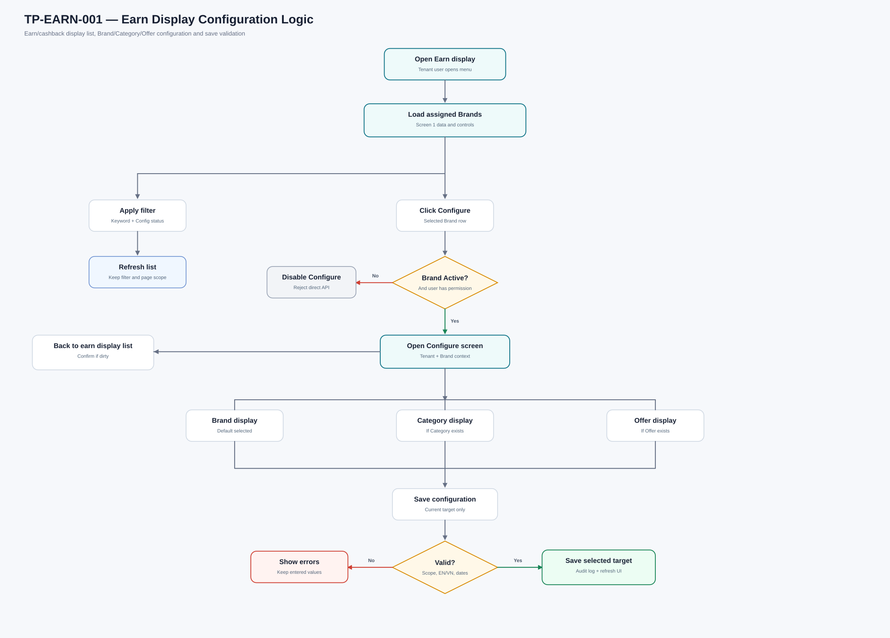

### f. Screen Flow

1. User mở menu `Earn display`.
2. Hệ thống lấy `tenant_id` từ session và tải danh sách Brand được assign.
3. Screen 1 hiển thị Keyword, Configuration status, Apply, Refresh, bảng Brand với `Brand Code` và `Brand Name` tách riêng, và Pagination.
4. User tìm theo Brand code/display name hoặc lọc `Configured`/`Not configured`, sau đó click `Apply`.
5. User click `Configure` tại Brand Active. Brand Inactive hiển thị nút disabled và backend cũng từ chối truy cập trực tiếp.
6. Hệ thống mở Screen 2, truyền đúng Tenant + Brand và mặc định chọn `Brand display`.
7. Screen 2 hiển thị ba lựa chọn ngang:
   - `Brand display`: Cấu hình để hiển thị ưu đãi End-User sẽ nhận được khi mua hàng của Brand.
   - `Category display`: khả dụng khi Brand có ít nhất một Category hợp lệ. Cấu hình để hiển thị ưu đãi End-User sẽ nhận được khi mua hàng thuộc Category cụ thể của Brand
   - `Offer display`: khả dụng khi Brand có ít nhất một Offer hợp lệ.Cấu hình để hiển thị ưu đãi End-User sẽ nhận được khi mua hàng thuộc Offer cụ thể của Brand
8. Tại `Brand display`, user nhập/cập nhật text EN, text VN, Display Status, Effective From và Effective To; sau đó click `Save configuration`.
9. Tại `Category display`, hệ thống hiển thị bảng Category gồm `Category Code`, `Category Name`, text EN, text VN, Display Status và nút `Configure`. User chọn một Category để mở form cấu hình ngay bên dưới bảng.
10. Tại `Offer display`, hệ thống hiển thị bảng Offer gồm `Offer Code`, `Offer Name`, text EN, text VN, Display Status và nút `Configure`. User chọn một Offer để mở form cấu hình ngay bên dưới bảng.
11. User click Save; hệ thống kiểm tra quyền, Tenant/Brand/target scope, EN/VN, Display Status và Effective From/To.
12. Nếu lỗi, hệ thống giữ dữ liệu đã nhập, highlight trường lỗi và không ghi dữ liệu.
13. Nếu hợp lệ, hệ thống lưu đúng target, ghi Audit Log, cập nhật bảng và hiển thị thông báo thành công.
14. `Cancel`, `Close` hoặc `Back to Earn/cashback display list` không lưu thay đổi chưa xác nhận; nếu form dirty thì yêu cầu xác nhận trước khi rời.

### g. Screen Description

#### Screen 1 — Earn/cashback display list

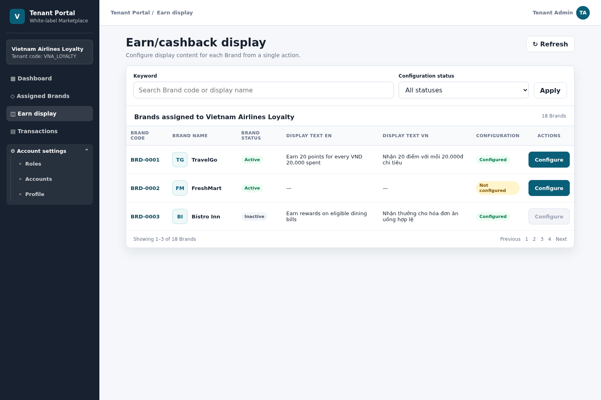

| # | Items | Control type | Data type | R/O | Description / Validation / Error handling |
|---:|---|---|---|---|---|
| 1 | Keyword | Textbox | Text | O | Tìm theo Brand code hoặc Brand name; trim đầu/cuối, tối đa 100 ký tự. |
| 2 | Configuration status | Dropdown | Enum | O | <ul><li>Gồm `All statuses`, `Configured`, `Not configured`; mặc định `All statuses`.</li><li>`Configured`: Brand đã có cấu hình nội dung ưu đãi dạng text tại ít nhất một cấp: Brand, Category hoặc Offer (nếu có).</li><li>`Not configured`: Brand chưa có cấu hình nội dung ưu đãi dạng text tại bất kỳ cấp nào: Brand, Category hoặc Offer.</li></ul> |
| 3 | Apply | Button | Action | O | Áp dụng filter và đưa danh sách về trang đầu; không có kết quả hiển thị `No assigned Brands found.`. |
| 4 | Refresh | Button | Action | O | Tải lại dữ liệu mới nhất và giữ điều kiện lọc hiện tại. |
| 5 | Brand Code | Table column | Brand code | ReadOnly | Hiển thị các brand code được Platform assign cho Tenant này bên CMS, ví dụ `BRD-0001`. Hỗ trợ tìm kiếm bằng Keyword; Tenant không được chỉnh sửa. |
| 6 | Brand Name | Table column | Brand reference | ReadOnly | Hiển thị logo/initial và tên Brand tương ứng với Brand Code do Platform/CMS quản lý, ví dụ `TravelGo`. Mỗi Brand được assign cho Tenant chỉ xuất hiện một dòng. |
| 7 | Brand status | Badge | Enum | ReadOnly | Hiển thị trạng thái `Active`/`Inactive`của Brand này bên CMS đang quản lý từ Brand master; Tenant không sửa tại màn hình này. |
| 8 | Display text EN | Table column | Text | ReadOnly | Text cấu hình cấp Brand; chưa có hiển thị `—`. Cột này không hiển thị text Category or Offer để tránh hiểu nhầm level cấu hình. |
| 9 | Display text VN | Table column | Text | ReadOnly | Text cấu hình cấp Brand; chưa có hiển thị `—`. Cột này không hiển thị text Category or Offer để tránh hiểu nhầm level cấu hình. |
| 10 | Configuration | Badge | Enum | ReadOnly | <ul><li>`Configured`: Brand đã được cấu hình nội dung ưu đãi dạng text để hiển thị cho End User tại ít nhất một cấp: Brand, Category hoặc Offer (nếu có). Dữ liệu được cấu hình sẽ hiển thị tương ứng trên Landing Page nếu Display Status của cấu hình đó là `Active` và còn trong thời gian hiệu lực.</li><li>`Not configured`: Brand chưa được cấu hình nội dung ưu đãi dạng text tại bất kỳ cấp nào: Brand, Category hoặc Offer.</li><li>Dữ liệu Configuration sau khi được cập nhật cũng sẽ tự động update tại màn Assigned Brand.</li></ul> |
| 11 | Configure | Button | Action | O theo quyền/điều kiện | Chỉ một action trên mỗi dòng. Click mở `Screen 2` của đúng Brand. Disabled nếu Brand Inactive hoặc user không có quyền; backend phải kiểm tra lại assignment, status, quyền và scope. |
| 12 | Pagination | Pagination | Numeric | O | Chuyển trang và giữ nguyên filter. |

#### Screen 2 — Configure earn/cashback display for Brand

Screen này được hiển thị trong cùng mockup `tenant-portal-earn-display.html` sau khi click `Configure`. Màn hình này thể hiện cấu hình earn display level Brand

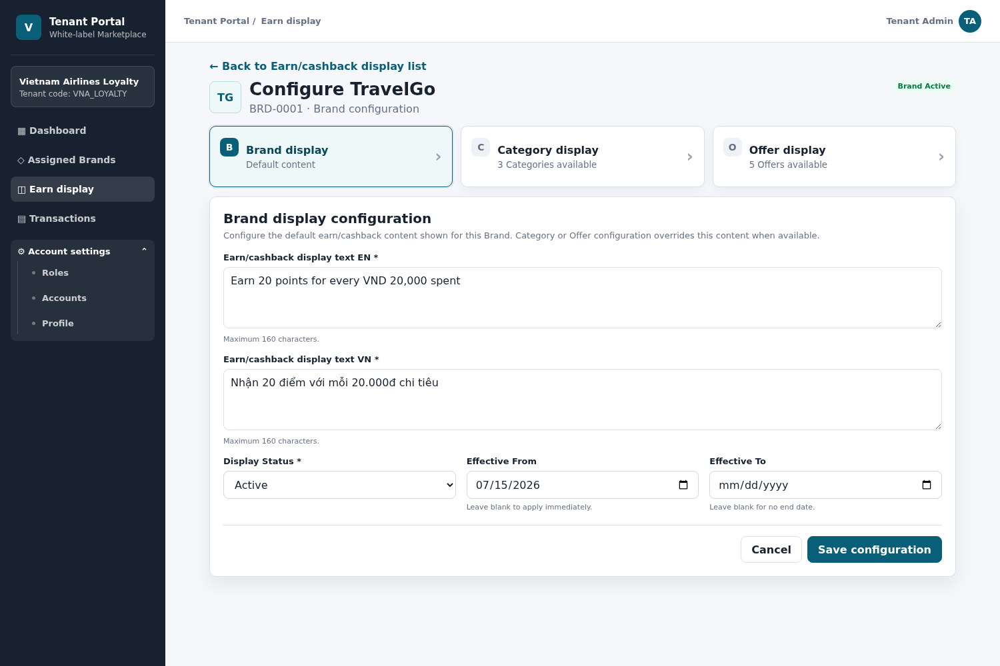

##### A. Header

| # | Items | Control type | Data type | R/O | Description / Validation / Error handling |
|---:|---|---|---|---|---|
| 1 | Back to list | Button/Link | Action | O | Quay lại `Screen 1`|
| 2 | Brand information | Header | Brand reference | ReadOnly | Hiển thị logo, Brand name, Brand code và Brand master status của Brand vừa nhấn chọn Configure. |
| 3 | Brand display | Selection card | Action | O | Luôn hiển thị; mặc định được chọn khi mở `Screen 2`. Màn hình này thể hiện cấu hình earn display level Brand|
| 4 | Category display | Selection card | Action | O theo dữ liệu | Hiện thị số lượng Category được assign cho Brand này, lấy dữ liệu từ CMS, không thể chỉnh sửa. Nếu không có Category được assign cho Brand được chọn thì tab này sẽ disable |
| 5 | Offer display | Selection card | Action | O theo dữ liệu | Hiện thị số lượng Offer được assign cho Brand này, lấy dữ liệu từ CMS, không thể chỉnh sửa. Nếu không có Offer được assign cho Brand được chọn thì tab này sẽ disable. |

##### B. Brand display configuration

| # | Items | Control type | Data type | R/O | Description / Validation / Error handling |
|---:|---|---|---|---|---|
| 1 | Earn/cashback display text EN | Textarea | Text | R | Bắt buộc, trim đầu/cuối, tối đa 160 ký tự. Rỗng: `Earn/cashback display text EN is required.`; vượt giới hạn: `Earn/cashback display text EN must not exceed 160 characters.`. |
| 2 | Earn/cashback display text VN | Textarea | Text | R | Bắt buộc, trim đầu/cuối, tối đa 160 ký tự. Rỗng: `Earn/cashback display text VN is required.`; vượt giới hạn: `Earn/cashback display text VN must not exceed 160 characters.`. |
| 3 | Display Status | Dropdown | Enum | R | Gồm `Active`, `Inactive`; cấu hình mới mặc định `Active`. `Active` mới có thể được hiển thị trên landing page khi còn hiệu lực. |
| 4 | Effective From | Date input | Date | O | <li>Để trống nghĩa là áp dụng ngay khi cấu hình Active.</li> <li> Nếu nhập Effective From thì tới hôm đó nếu trạng thái `Active` thì sẽ hiển thị trên Landing page</li><li>Sai định dạng: `Effective From is invalid.`.</li> |
| 5 | Effective To | Date input | Date | O | <li>Để trống nghĩa là không giới hạn.</li><li>Nếu nhập Effective To thì sau thời điểm này nội dung không còn được hiển thị trên landing page, nhưng hệ thống giữ nguyên Display Status do Tenant cấu hình.</li><li>Khi Effective To được gia hạn và cấu hình trở lại thời gian hiệu lực, hệ thống tự động tính lại trạng thái hiển thị thực tế; nội dung hiển thị lại nếu Display Status vẫn là `Active` và các điều kiện khác đều hợp lệ.</li><li>Nhỏ hơn Effective From: `Effective To must be greater than or equal to Effective From.`.</li>|
| 6 | Cancel | Button | Action | O | Hủy thay đổi chưa lưu và quay lại danh sách hoặc khôi phục dữ liệu hiện tại. |
| 7 | Save configuration | Button | Action | R theo quyền | <li>Validate và lưu cấp Brand; thành công hiển thị `Brand earn/cashback display configuration saved successfully.`. </li><li>Conflict: `Earn/cashback display configuration has changed. Please try again.`. </li><li>Sau khi cấu hình thông tin ở tab `Brand display configuration` phải thực hiện lưu luôn trước khi chuyển sang tab khác, nếu chưa Lưu sẽ hiện thông báo xác nhận "Bạn có muốn lưu dữ liệu trước khi rời đi ?". Nếu đồng ý có thể chuyển sang tab khác mà không lưu; nếu không đồng ý thì sẽ không lưu dữ liệu vừa cập nhật và hiển thị tab tiếp theo được chọn</li>|

##### C. Category display configuration

Màn hình này hiển thị sau khi nhấn chọn `Category display` với điều kiện tồn tại ít nhất 1 Category được assign cho Brand này

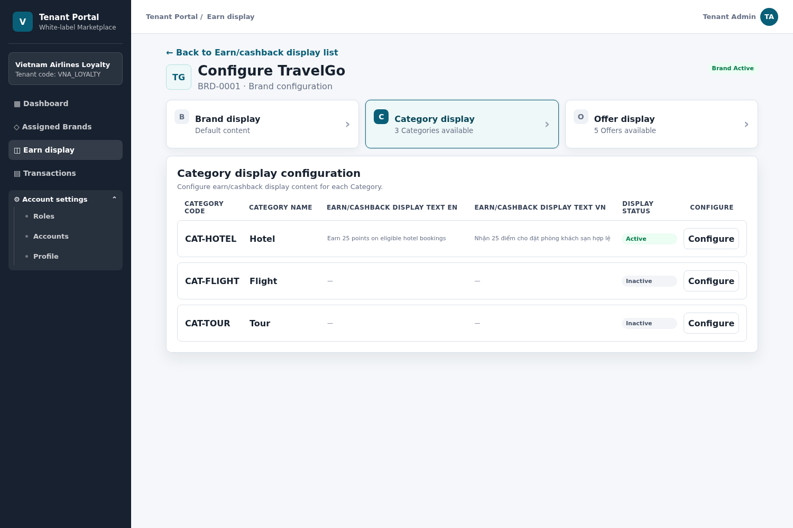

| # | Items | Control type | Data type | R/O | Description / Validation / Error handling |
|---:|---|---|---|---|---|
| 1 | Category Code | Table column | Category code | ReadOnly | Hiển thị mã Category của brand đã được mapping bên CMS, ví dụ `CAT-HOTEL`. Tenant không được chỉnh sửa. |
| 2 | Category Name | Table column | Category name | ReadOnly | Hiển thị tên Category thuộc Brand hiện tại tương ứng với Brand Code, ví dụ `Hotel`. Dữ liệu lấy từ Category mapping của Brand trong CMS/Assigned Brands. |
| 3 | Earn/cashback display text EN | Table column | Text | ReadOnly | Text EN của cấu hình Category; chưa có hiển thị `—`. |
| 4 | Earn/cashback display text VN | Table column | Text | ReadOnly | Text VN của cấu hình Category; chưa có hiển thị `—`. |
| 5 | Display Status | Badge | Enum | ReadOnly | Hiển thị trạng thái cấu hình do Tenant lựa chọn. `Active`: Tenant cho phép sử dụng nội dung khi Category, Brand, Tenant, assignment và Effective period đều hợp lệ. `Inactive`: Tenant chủ động không sử dụng nội dung. Cấu hình `Active` nằm ngoài Effective period vẫn giữ badge `Active` nhưng không được hiển thị thực tế trên Landing Page. |
| 6 | Configure | Button | Action | O theo quyền/điều kiện | <li>Mở form ngay dưới bảng và nạp đúng Category.</li><li>Disabled nếu Brand/Category Inactive hoặc ngoài scope.</li><li>Nếu Category này trạng thái đang Active bên `Assigned Brands` thì enable button Configure. Ngược lại, disable button Configure và khi hover hiển thị tooltip `This Category is inactive and cannot be configured.`.</li> |

Trạng thái sau khi user click `Configure` tại một Category:

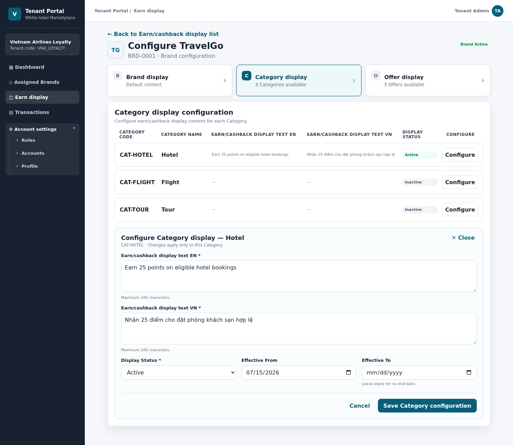

| # | Items | Control type | Data type | R/O | Description / Validation / Error handling |
|---:|---|---|---|---|---|
| 1 | Earn/cashback display text EN | Textarea | Text | R | Bắt buộc, trim đầu/cuối, tối đa 160 ký tự. Rỗng: `Earn/cashback display text EN is required.`; vượt giới hạn: `Earn/cashback display text EN must not exceed 160 characters.`. |
| 2 | Earn/cashback display text VN | Textarea | Text | R | Bắt buộc, trim đầu/cuối, tối đa 160 ký tự. Rỗng: `Earn/cashback display text VN is required.`; vượt giới hạn: `Earn/cashback display text VN must not exceed 160 characters.`. |
| 3 | Display Status | Dropdown | Enum | R | Gồm `Active`, `Inactive`; cấu hình mới mặc định `Active`. `Active` mới có thể được hiển thị trên landing page khi còn hiệu lực. |
| 4 | Effective From | Date input | Date | O | <li>Để trống nghĩa là áp dụng ngay khi cấu hình Active.</li> <li> Nếu nhập Effective From thì tới hôm đó nếu trạng thái `Active` thì sẽ hiển thị trên Landing page</li><li>Sai định dạng: `Effective From is invalid.`.</li><li>Định dạng: dd/mm/yyyy</li> |
| 5 | Effective To | Date input | Date | O | <li>Để trống nghĩa là không giới hạn.</li><li>Nếu nhập Effective To thì sau thời điểm này nội dung Category không còn được hiển thị trên landing page, nhưng hệ thống giữ nguyên Display Status do Tenant cấu hình.</li><li>Khi Effective To được gia hạn, hệ thống tự động tính lại trạng thái hiển thị thực tế; nội dung hiển thị lại nếu Display Status vẫn là `Active` và các điều kiện khác đều hợp lệ.</li><li>Nhỏ hơn Effective From: `Effective To must be greater than or equal to Effective From.`.</li><li>Định dạng: dd/mm/yyyy</li>|
| 6 | Cancel | Button | Action | O | Hủy thay đổi chưa lưu và quay lại danh sách hoặc khôi phục dữ liệu hiện tại. |
| 7 | Save configuration | Button | Action | R theo quyền | <li>Validate và lưu cấp Category; thành công hiển thị `Category earn/cashback display configuration saved successfully.`. </li><li>Conflict: `Earn/cashback display configuration has changed. Please try again.`. </li><li>Sau khi cấu hình thông tin ở tab `Category display configuration` phải thực hiện lưu luôn trước khi chuyển sang tab khác, nếu chưa Lưu sẽ hiện thông báo xác nhận "Bạn có muốn lưu dữ liệu trước khi rời đi ?". Nếu đồng ý có thể chuyển sang tab khác và hiển thị lưu thành công; nếu không đồng ý thì sẽ không lưu dữ liệu vừa cập nhật và hiển thị tab tiếp theo được chọn</li>|
| 8 | Close | Button | Action | O | Đóng cửa sổ configure và không lưu dữ liệu. |

##### D. Offer display configuration

Trạng thái sau khi user chọn `Offer display`:

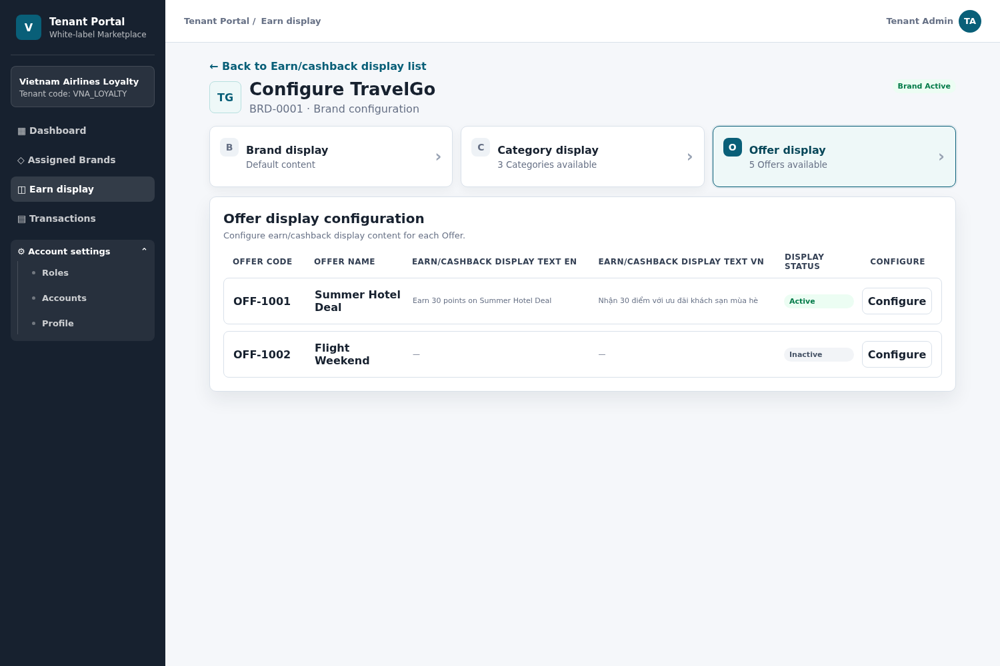

| # | Items | Control type | Data type | R/O | Description / Validation / Error handling |
|---:|---|---|---|---|---|
| 1 | Offer Code | Table column | Offer code | ReadOnly | Hiển thị mã Offer do Platform/CMS assign cho Brand này, ví dụ `OFF-1001`. Tenant không được chỉnh sửa. |
| 2 | Offer Name | Table column | Offer name | ReadOnly | Hiển thị tên Offer thuộc Brand hiện tại tương ứng với Offer Code, ví dụ `Summer Hotel Deal`. Dữ liệu lấy từ danh sách Offer của Brand trong CMS/Assigned Brands. |
| 3 | Earn/cashback display text EN | Table column | Text | ReadOnly | Text EN của cấu hình Offer; chưa có hiển thị `—`. |
| 4 | Earn/cashback display text VN | Table column | Text | ReadOnly | Text VN của cấu hình Offer; chưa có hiển thị `—`. |
| 5 | Display Status | Badge | Enum | ReadOnly | Hiển thị trạng thái cấu hình do Tenant lựa chọn. `Active`: Tenant cho phép sử dụng nội dung khi Offer, Brand, Tenant, assignment, Offer effective period và Earn Display effective period đều hợp lệ. `Inactive`: Tenant chủ động không sử dụng nội dung. Cấu hình `Active` nằm ngoài Effective period vẫn giữ badge `Active` nhưng không được hiển thị thực tế trên Landing Page. |
| 6 | Configure | Button | Action | O theo quyền/điều kiện | <li>Mở form ngay dưới bảng và nạp đúng Offer.</li><li>Disabled nếu Brand/Offer Inactive, Offer hết hiệu lực hoặc ngoài scope.</li><li>Nếu Offer này trạng thái đang Active bên `Assigned Brands` thì enable button Configure. Ngược lại, disable button Configure và khi hover hiển thị tooltip `This Offer is inactive and cannot be configured.`.</li> |

Trạng thái sau khi user click `Configure` tại một Offer:

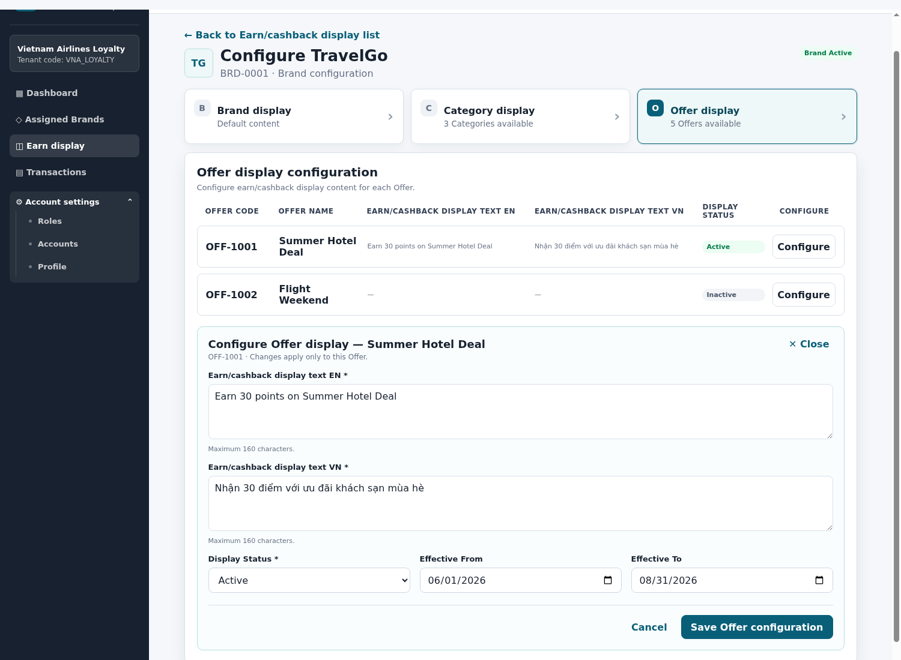

| # | Items | Control type | Data type | R/O | Description / Validation / Error handling |
|---:|---|---|---|---|---|
| 1 | Earn/cashback display text EN | Textarea | Text | R | Bắt buộc, trim đầu/cuối, tối đa 160 ký tự. Rỗng: `Earn/cashback display text EN is required.`; vượt giới hạn: `Earn/cashback display text EN must not exceed 160 characters.`. |
| 2 | Earn/cashback display text VN | Textarea | Text | R | Bắt buộc, trim đầu/cuối, tối đa 160 ký tự. Rỗng: `Earn/cashback display text VN is required.`; vượt giới hạn: `Earn/cashback display text VN must not exceed 160 characters.`. |
| 3 | Display Status | Dropdown | Enum | R | Gồm `Active`, `Inactive`; cấu hình mới mặc định `Active`. `Active` mới có thể được hiển thị trên landing page khi còn hiệu lực. |
| 4 | Effective From | Date input | Date | O | <li>Để trống nghĩa là áp dụng ngay khi cấu hình Active.</li> <li> Nếu nhập Effective From thì tới hôm đó nếu trạng thái `Active` thì sẽ hiển thị trên Landing page</li><li>Sai định dạng: `Effective From is invalid.`</li><li>Định dạng: dd/mm/yyyy</li> |
| 5 | Effective To | Date input | Date | O | <li>Để trống nghĩa là không giới hạn.</li><li>Nếu nhập Effective To thì sau thời điểm này nội dung Offer không còn được hiển thị trên landing page, nhưng hệ thống giữ nguyên Display Status do Tenant cấu hình.</li><li>Khi Effective To được gia hạn, hệ thống tự động tính lại trạng thái hiển thị thực tế; nội dung hiển thị lại nếu Display Status vẫn là `Active` và các điều kiện khác đều hợp lệ.</li><li>Nhỏ hơn Effective From: `Effective To must be greater than or equal to Effective From.`.</li><li>Định dạng: dd/mm/yyyy</li>|
| 6 | Cancel | Button | Action | O | Hủy thay đổi chưa lưu và quay lại danh sách hoặc khôi phục dữ liệu hiện tại. |
| 7 | Save configuration | Button | Action | R theo quyền | <li>Validate và lưu cấp Category; thành công hiển thị `Offer earn/cashback display configuration saved successfully.`. </li><li>Conflict: `Earn/cashback display configuration has changed. Please try again.`. </li><li>Sau khi cấu hình thông tin ở tab `Offer display configuration` phải thực hiện lưu luôn trước khi chuyển sang tab khác, nếu chưa Lưu sẽ hiện thông báo xác nhận "Bạn có muốn lưu dữ liệu trước khi rời đi ?". Nếu đồng ý có thể chuyển sang tab khác và hiển thị lưu thành công; nếu không đồng ý thì sẽ không lưu dữ liệu vừa cập nhật và hiển thị tab tiếp theo được chọn</li>|
| 8 | Close | Button | Action | O | Đóng cửa sổ configure và không lưu dữ liệu. |

### h. Business Rules

| BR ID | Rule |
|---|---|
| BR-TP-EARN-001-01 | Hệ thống luôn xác định `tenant_id` từ session/token; chỉ trả về Brand có assignment hiện hành với Tenant và không tin cậy Tenant/Brand/Category/Offer ID do client tự truyền. |
| BR-TP-EARN-001-02 | Screen 1 hiển thị mỗi Brand được assign đúng một dòng và chỉ có một action `Configure`. |
| BR-TP-EARN-001-03 | Brand master status là dữ liệu read-only từ Platform. Brand Inactive vẫn có thể xuất hiện trong danh sách nhưng nút `Configure` phải disabled và mọi API tạo/cập nhật earn display của Brand đó phải bị từ chối. |
| BR-TP-EARN-001-04 | `Brand Code` và `Brand Name` trên Screen 1 phải hiển thị thành 2 cột riêng. `Brand Code` là mã read-only từ Platform/CMS và được hỗ trợ trong Keyword search; `Brand Name` hiển thị tên/logo Brand để user nhận diện nhanh. |
| BR-TP-EARN-001-05 | <li>Tab `Brand display` luôn khả dụng khi mở từ `Screen 2` của có Brand Status = Active.</li> <li> Tab `Category display` chỉ khả dụng khi Brand có ít nhất một Category được assign;</li><li> Tab `Offer display` chỉ khả dụng khi Brand có ít nhất một Offer được assign.</li><li> Số lượng hiển thị trên selection card lấy từ CMS và Tenant không được sửa. </li>|
| BR-TP-EARN-001-06 | <li>Trong Tab `Category display `Nút `Configure` của Category chỉ enable khi Tenant, Brand và Category master status đều Active, Category thuộc đúng Brand/Tenant và user có quyền.</li> <li>Nếu Category Inactive bên `Brand Assigns`, nút `Configure` disabled và tooltip hiển thị `This Category is inactive and cannot be configured.`. </li>|
| BR-TP-EARN-001-07 | <li>Trong Tab `Offer display`, Nút `Configure` của Offer chỉ enable khi Tenant, Brand và Offer master status đều Active, Offer thuộc đúng Brand/Tenant, Offer còn hiệu lực và user có quyền;<li> Nếu Offer Inactive bên `Brand Assigns`, nút `Configure` disabled và tooltip hiển thị `This Offer is inactive and cannot be configured.`;</li><li>Nếu Offer hết hiệu lực, hiển thị `This Offer has expired and cannot be configured.`.</li> |
| BR-TP-EARN-001-09 | Tại mọi cấp Brand, Category và Offer, text EN và text VN đều bắt buộc, được trim khoảng trắng đầu/cuối và tối đa 160 ký tự cho mỗi trường. |
| BR-TP-EARN-001-10 | Display Status chỉ gồm `Active` và `Inactive`; cấu hình mới mặc định `Active`. `Active` là trạng thái cho phép hiển thị khi toàn bộ điều kiện về Tenant, Brand, Category/Offer và thời gian hiệu lực đều được đáp ứng. `Inactive` không được hiển thị trên landing page. |
| BR-TP-EARN-001-11 | Effective From là tùy chọn. Nếu để trống, cấu hình Active có hiệu lực ngay sau khi lưu; nếu có giá trị, cấu hình chỉ được hiển thị từ ngày đó. Trước Effective From, cấu hình chưa được hiển thị dù Display Status đang Active. |
| BR-TP-EARN-001-12 | Effective To là tùy chọn. Nếu để trống, cấu hình không giới hạn ngày kết thúc. Nếu có giá trị, Effective To phải lớn hơn hoặc bằng Effective From. |
| BR-TP-EARN-001-13 | Display Status là lựa chọn cấu hình của Tenant và không tự động thay đổi theo Effective From/Effective To. Khi thời điểm hiện tại vượt quá Effective To, hệ thống giữ nguyên Display Status, chuyển `is_effectively_displayed` thành `false` và ngừng hiển thị nội dung trên landing page. Khi Effective To được gia hạn và cấu hình trở lại thời gian hiệu lực, hệ thống tự động tính lại `is_effectively_displayed`; nội dung hiển thị lại nếu Display Status vẫn là `Active` và các điều kiện khác đều hợp lệ. |
| BR-TP-EARN-001-14 | Cấu hình chỉ được hiển thị khi Display Status = Active, thời điểm hiện tại thuộc Effective period, Tenant và Brand Active, Brand còn được assign; với Category/Offer, target tương ứng cũng phải Active, thuộc đúng Brand và còn hiệu lực. |
| BR-TP-EARN-001-16 | Display Status của Earn Display độc lập với Brand/Category/Offer master status và Effective period. Brand/Category/Offer Inactive, chưa tới Effective From hoặc vượt Effective To chỉ làm `is_effectively_displayed = false`; hệ thống không tự động thay đổi Display Status đã được Tenant cấu hình. |
| BR-TP-EARN-001-17 | `Configuration = Configured` khi Brand có cấu hình nội dung ưu đãi dạng text tại ít nhất một cấp Brand, Category hoặc Offer. `Not configured` chỉ khi không tồn tại cấu hình tại cả ba cấp. Configuration status không phụ thuộc Display Status hoặc Effective period. |
| BR-TP-EARN-001-18 | Cột Display text EN/VN trên Screen 1 chỉ hiển thị nội dung cấp Brand. Vì vậy Brand có thể có Configuration = `Configured` nhưng hai cột này hiển thị `—` nếu Brand chỉ được cấu hình ở cấp Category hoặc Offer. |
| BR-TP-EARN-001-19 | Khi locale landing page là EN, hệ thống dùng text EN; khi locale là VN, hệ thống dùng text VN. Không dùng fallback giữa EN và VN vì cả hai nội dung đều bắt buộc khi lưu. |
| BR-TP-EARN-001-21 | Khi user click `Configure` Category/Offer, form phải mở ngay dưới đúng bảng, hiển thị target name/code read-only và nạp cấu hình hiện tại. Nếu target chưa có cấu hình, text để trống và Display Status mặc định `Active` trong form tạo mới. |
| BR-TP-EARN-001-22 | Khi user đổi selection card, Back, Cancel hoặc Close trong lúc có thay đổi chưa lưu, hệ thống phải hiển thị xác nhận. User có thể lưu trước khi rời, bỏ thay đổi để tiếp tục hoặc ở lại màn hình; không được tự động mất dữ liệu chưa lưu. |
| BR-TP-EARN-001-23 | Save chỉ cập nhật đúng target đang cấu hình. Lưu Brand không thay đổi Category/Offer; lưu Category/Offer không thay đổi Brand hoặc target khác. |
| BR-TP-EARN-001-24 | Save phải kiểm tra lại quyền, assignment, master status, target scope, độ dài EN/VN, Display Status, Effective From/To và concurrency version tại backend. Validation lỗi không được ghi dữ liệu và phải giữ giá trị user đã nhập. |
| BR-TP-EARN-001-25 | Mọi thay đổi do user hoặc System thực hiện phải ghi Audit Log gồm Tenant, Brand, target type/id, actor, timestamp, old value và new value. |
| BR-TP-EARN-001-26 | Display text chỉ dùng để trình bày ưu đãi cho End User; không phải commission rule, không tính cashback và không tạo point posting transaction. |

### i. Acceptance Criteria

| AC ID | Criteria |
|---|---|
| AC-TP-EARN-001-01 | Screen 1 chỉ hiển thị Brand được assign cho Tenant hiện tại, mỗi Brand đúng một dòng và không trả dữ liệu Tenant khác. |
| AC-TP-EARN-001-02 | Keyword tìm đúng Brand code/display name sau khi trim; Configuration status lọc đúng `Configured`/`Not configured`; Apply đưa về trang đầu. |
| AC-TP-EARN-001-03 | Refresh tải dữ liệu mới nhất nhưng giữ filter; Pagination chuyển trang và giữ nguyên Tenant scope/filter. |
| AC-TP-EARN-001-04 | Mỗi dòng Brand chỉ có một nút `Configure`; Brand Active có nút enable khi user có quyền, Brand Inactive có nút disabled và API truy cập trực tiếp bị chặn. |
| AC-TP-EARN-001-05 | Screen 1 hiển thị riêng `Brand Code` và `Brand Name`; Brand Code đúng mã từ Platform/CMS, Brand Name/logo dùng để nhận diện Brand và mỗi Brand được assign chỉ xuất hiện một dòng. |
| AC-TP-EARN-001-06 | Click Configure mở đúng Brand context, hiển thị đúng logo/name/code/master status và mặc định chọn `Brand display`. |
| AC-TP-EARN-001-07 | Tab `Brand display` luôn khả dụng nếu Brand Status = Active; Tab `Category/Offer` selection card hiển thị đúng số lượng từ CMS và disabled khi Brand không có dữ liệu tương ứng. |
| AC-TP-EARN-001-08 | Brand có cấu hình tại ít nhất một cấp Brand/Category/Offer, tại màn Earn Display list hiển thị `Configuration = Configured`; chỉ Brand không có cấu hình ở cả ba cấp mới hiển thị `Configuration = Not configured`. |
| AC-TP-EARN-001-09 | Brand chỉ có cấu hình Category/Offer vẫn hiển thị `Configured`, trong khi Display text EN/VN cấp Brand trên Screen 1 hiển thị `—`. |
| AC-TP-EARN-001-10 | Brand form hiển thị đúng text EN, text VN, Display Status, Effective From, Effective To và helper `Maximum 160 characters.` cho cả hai textarea. |
| AC-TP-EARN-001-11 | Category table hiển thị riêng `Category Code` và `Category Name`, đúng text EN, text VN, Display Status và nút Configure của từng Category thuộc Brand. |
| AC-TP-EARN-001-12 | Offer table hiển thị riêng `Offer Code` và `Offer Name`, đúng text EN, text VN, Display Status và nút Configure của từng Offer thuộc Brand. |
| AC-TP-EARN-001-13 | Category/Offer chưa có cấu hình hiển thị text `—` và Display Status `Inactive` trên bảng. |
| AC-TP-EARN-001-14 | Category Status bên Brand Assignments = Inactive có Configure disabled; Offer Inactive/hết hiệu lực có Configure disabled; gọi API trực tiếp cũng bị chặn. |
| AC-TP-EARN-001-15 | Click Configure Category/Offer mở form ngay dưới đúng bảng, nạp đúng target và dữ liệu hiện tại; target name/code read-only. |
| AC-TP-EARN-001-16 | Form tạo mới Category/Offer có EN/VN rỗng, Display Status mặc định Active và không lấy nhầm dữ liệu của target khác. |
| AC-TP-EARN-001-17 | Bỏ trống text EN hiển thị `Earn/cashback display text EN is required.`; bỏ trống text VN hiển thị `Earn/cashback display text VN is required.` và không lưu. |
| AC-TP-EARN-001-18 | Text EN hoặc VN vượt 160 ký tự bị chặn với đúng thông báo `must not exceed 160 characters`; khoảng trắng đầu/cuối được trim trước khi lưu. |
| AC-TP-EARN-001-19 | Effective From/To sai định dạng bị chặn; Effective To nhỏ hơn Effective From hiển thị `Effective To must be greater than or equal to Effective From.`. |
| AC-TP-EARN-001-20 | Cấu hình Active có Effective From trong tương lai chưa hiển thị trước ngày bắt đầu và bắt đầu hiển thị đúng ngày khi các điều kiện khác hợp lệ. |
| AC-TP-EARN-001-21 | Cấu hình có Effective To để trống tiếp tục có hiệu lực. Khi vượt Effective To, Display Status giữ nguyên, `is_effectively_displayed` chuyển thành `false` và nội dung ngừng hiển thị trên landing page. Khi Effective To được gia hạn, hệ thống tự động tính lại `is_effectively_displayed`; nếu Display Status vẫn `Active` và các điều kiện khác hợp lệ thì nội dung tự động hiển thị lại mà Tenant không cần bật lại. |
| AC-TP-EARN-001-22 | Display Status Inactive không hiển thị trên landing page nhưng dữ liệu cấu hình vẫn được giữ và nạp lại khi Configure. |
| AC-TP-EARN-001-23 | Chỉ hiển thị trên Landing page khi Tenant, Brand và target tương ứng Active, còn assignment và nằm trong Effective period. |
| AC-TP-EARN-001-24 | Landing page hiển thị đúng text EN cho locale EN và text VN cho locale VN, không fallback chéo locale. |
| AC-TP-EARN-001-25 | Save Brand chỉ cập nhật cấu hình Brand; Save Category/Offer chỉ cập nhật đúng target được chọn và không ảnh hưởng target khác. |
| AC-TP-EARN-001-26 | Lưu hợp lệ hiển thị đúng success message, cập nhật bảng/Screen 1 và tạo Audit Log đầy đủ old/new value. |
| AC-TP-EARN-001-27 | Khi concurrency conflict, hệ thống không ghi đè dữ liệu mới hơn và hiển thị `Earn/cashback display configuration has changed. Please try again.`. |
| AC-TP-EARN-001-28 | Khi đổi tab, Back, Cancel hoặc Close với dữ liệu chưa lưu, hệ thống yêu cầu xác nhận; lựa chọn lưu/bỏ thay đổi/ở lại được xử lý đúng và không làm mất dữ liệu ngoài ý muốn. |
| AC-TP-EARN-001-29 | User chỉ có quyền xem không thể lưu qua UI hoặc API; backend vẫn từ chối nếu client tự bật nút hoặc sửa request. |
| AC-TP-EARN-001-30 | Không thao tác nào trong UC tạo hoặc thay đổi commission, cashback calculation hay point posting transaction. |

## 9. TP-TXN-001 - Quản lý Transaction theo Tenant

### a. Introduction

Chức năng cho phép Tenant Admin/Staff được phân quyền tra cứu danh sách Order đã được Platform attribution cho Tenant và xem chi tiết Tenant Share theo từng Order Item. Dữ liệu chỉ đọc, được kế thừa từ Transaction đã được Platform xử lý tại CMS; Tenant không được sửa Order, Item Status, commission rule, Tenant Share hoặc lịch sử sự kiện.

Mockup tham chiếu: [`tenant-portal-transaction-list.html`](../mockups/tenant-portal-transaction-list.html).

### b. Actors/Objects

| Actor/Object | Role |
|---|---|
| Tenant Admin/Staff được phân quyền | Lọc, xem danh sách, export và mở chi tiết Transaction thuộc Tenant hiện tại. |
| Transaction Service | Cung cấp Order header, Order Item, trạng thái và lịch sử đã được Platform ghi nhận. |
| Tenant Share Service | Cung cấp Tenant Share source/value/reference và số dự tính/thực nhận theo từng item. |
| Permission Service | Kiểm tra quyền `Transactions > View` và `Transactions > Export`. |
| Audit/Export Service | Ghi nhận thao tác export và tạo file trong đúng Tenant scope. |

### c. Pre-conditions

- User đã đăng nhập; Tenant, User và Role đang `Active`.
- User có quyền `Transactions > View`; thao tác Export yêu cầu thêm `Transactions > Export`.
- Transaction đã được Platform tạo thành công và gắn đúng `tenant_id`.
- Dữ liệu Brand commission nội bộ của Platform không được trả về Tenant Portal.

### d. Expected Result

- Tenant chỉ xem được Transaction thuộc `tenant_id` trong session/token.
- Danh sách hỗ trợ lọc theo Order Date, Keyword, Brand và Order Status.
- Nút `View` mở chi tiết trong cùng file, hiển thị Order Summary, Tenant Share theo từng item và Adjustment & Status History.
- Tổng Tenant Share dự tính/thực nhận trên Order Summary phải khớp tổng các item tương ứng.
- Tenant không thể sửa dữ liệu Transaction qua UI hoặc API.

### e. Screen Flow

1. User mở menu `Transactions`.
2. Hệ thống kiểm tra Tenant scope và quyền View, sau đó tải danh sách.
3. User nhập filter và nhấn `Apply`; hệ thống trả kết quả đúng Tenant và phân trang.
4. User nhấn `View`; hệ thống kiểm tra lại quyền/ownership và mở Transaction Detail.
5. User xem Order Summary, Order Items & Tenant Share Details, Adjustment & Status History.
6. User nhấn `Back to Transactions` để quay lại danh sách.
7. Nếu có quyền Export, user có thể export danh sách theo filter hiện tại.

### f. Screen Description

#### Screen 1 — Tenant Transaction List

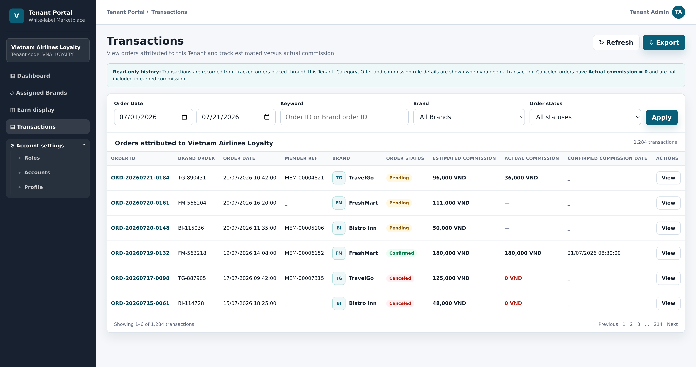

| # | Item | Control type | Data type | Data source | Description / Calculation / Validation / Error handling |
|---:|---|---|---|---|---|
| 1 | Order Date From/To | Date inputs | Date | Điều kiện do user nhập; truy vấn theo `order_date` của Transaction. | Lọc theo `order_date`, bao gồm toàn bộ thời gian từ đầu ngày From đến cuối ngày To theo timezone hệ thống. From không được lớn hơn To; sai khoảng ngày thì không gửi truy vấn và hiển thị lỗi tại bộ lọc. |
| 2 | Keyword | Textbox | String | Giá trị user nhập. | Tìm theo Platform `order_id` hoặc `brand_order_id` trong phạm vi Tenant hiện tại. Hệ thống trim khoảng trắng đầu/cuối; bỏ trống thì không áp dụng Keyword. Không tìm thấy dữ liệu hiển thị empty state, không coi là lỗi. |
| 3 | Brand | Dropdown | Brand reference | Danh sách Brand đã được Platform assign cho Tenant, kết hợp Brand Master Data. | Hiển thị Brand Display Name; giá trị truy vấn là `brand_id`. Mặc định `All Brands`. Brand Inactive vẫn có thể xuất hiện trong Transaction lịch sử nhưng không phát sinh Order mới. |
| 4 | Order Status | Dropdown | Enum | Order Status do Transaction Service tổng hợp. | Gồm `All statuses`, `Pending`, `Confirmed`, `Cancelled`; mặc định `All statuses`. `Pending`: còn item chưa chốt; `Confirmed`: không còn item Pending và có ít nhất một item Confirmed; `Cancelled`: toàn bộ item đã Refunded. |
| 5 | Apply | Button | Action | Toàn bộ giá trị filter hiện tại. | Validate và áp dụng đồng thời Order Date, Keyword, Brand và Order Status; trả danh sách đúng Tenant scope và quay về trang đầu tiên. Không thay đổi dữ liệu Transaction. |
| 6 | Refresh | Button | Action | Transaction query theo filter hiện tại. | Tải snapshot mới nhất từ Transaction Service, giữ filter và trang hiện tại nếu trang đó còn hợp lệ. Lỗi tải dữ liệu phải hiển thị thông báo và không trình bày dữ liệu cũ như dữ liệu mới. |
| 7 | Export | Button | Action | Transaction query theo filter hiện tại và quyền `Transactions > Export`. | Chỉ enable khi user có quyền Export. File chỉ chứa Transaction thuộc Tenant trong session/token và các trường Tenant được phép xem; không export Brand commission, Gross commission hoặc dữ liệu Tenant khác. Template file sau khi export: `tenant-portal-transaction-export.xlsx` |
| 8 | Order ID | Table column | String | `order_id` do Transaction Service sinh khi Transaction được tạo. | Mã duy nhất toàn Platform, dùng làm khóa mở màn chi tiết và truy vết. Không lấy từ Brand. |
| 9 | Brand Order | Table column | String | `brand_order_id` do Brand gửi trong Order Success. | Mã Order tại hệ thống Brand, duy nhất trong phạm vi Brand; dùng cùng Brand để deduplicate, match cancel/refund và đối soát. |
| 10 | Order Date | Table column | Datetime | `order_date` lưu trên Transaction từ Order Success hợp lệ. | Thời điểm Platform ghi nhận Order; hiển thị `dd/mm/yyyy hh:mm:ss` theo timezone hệ thống. |
| 11 | Member Ref | Table column | String | `member_ref` lấy từ Tenant member context liên kết với Click và lưu snapshot trên Transaction. | Mã hội viên do Tenant quản lý để đối chiếu Order với end user; không dùng làm khóa Transaction. Không có dữ liệu hiển thị `_`. |
| 12 | Brand | Table column | Brand reference | `brand_id` của Transaction; logo/Display Name lấy từ Brand Master Data. | Hiển thị Brand phát sinh Order. Brand trong Order Success đã được kiểm tra khớp với Brand context của Click trước khi tạo Transaction. |
| 13 | Order Status | Badge | Enum | Transaction Service tổng hợp từ Item Status. | Tất cả item Refunded → `Cancelled`; còn ít nhất một item Pending → `Pending`; không còn item Pending và có ít nhất một item Confirmed → `Confirmed`. Một Order Pending vẫn có thể chứa item Refunded. |
| 14 | Estimated commission | Table column | Money | Tổng Tenant Share hiện tại của các item đã resolve Tenant Share source. | Trên CMS, trường này là **Tenant Share dự tính**. Công thức: tổng Tenant Share của các item còn hợp lệ; item Refunded đóng góp `0`. Khi Order Pending, giá trị được tính lại sau mỗi refund/cancel item. |
| 15 | Actual commission | Table column | Money | Tổng Tenant Share của các item có Status `Confirmed`. | Trên CMS, trường này là **Tenant Share thực nhận**. Chưa có item Confirmed hiển thị `—`; Order Cancelled không ghi nhận thực nhận và hiển thị `0 VND` theo mockup. |
| 16 | Confirmed Commission Date | Table column | Datetime | Thời điểm Transaction Service chốt commission cấp Order. | Chỉ hiển thị khi Order Status = `Confirmed`; Pending/Cancelled hiển thị `_`. Không dùng ngày dự kiến hoặc ngày chốt của riêng một item để thay thế. Định dạng `dd/mm/yyyy hh:mm:ss`. |
| 17 | View | Button | Action | `order_id` của dòng được chọn và quyền `Transactions > View`. | Mở đúng Transaction Detail; backend kiểm tra lại quyền và `tenant_id` từ session/token. Order không tồn tại hoặc thuộc Tenant khác phải trả Not found/Forbidden mà không lộ dữ liệu. |
| 18 | Pagination | Pagination | Integer | `page`, `page_size`, `total_records` từ Transaction query. | Phân trang server-side, hiển thị phạm vi bản ghi và tổng số kết quả. Chuyển trang phải giữ nguyên filter; nút Previous/Next không hợp lệ phải disable. |

#### Screen 2 — Tenant Transaction Detail

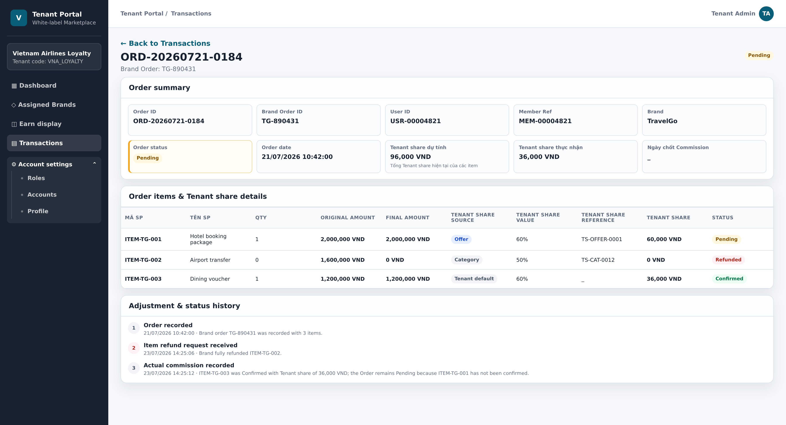

##### A. Order Summary

| # | Item | Control type | Data type | Data source | Description / Calculation / Error handling |
|---:|---|---|---|---|---|
| 1 | Order ID | Information card | String | `order_id` do Transaction Service sinh khi tạo Transaction. | Mã duy nhất toàn Platform và là khóa truy vấn màn chi tiết. Nếu Order không tồn tại hoặc không thuộc Tenant trong session/token, hệ thống không hiển thị dữ liệu chi tiết. |
| 2 | Brand Order ID | Information card | String | `brand_order_id` do Brand gửi trong Order Success. | Mã Order trên hệ thống Brand; dùng cùng `brand_id` để deduplicate, match cancel/refund và đối soát. |
| 3 | User ID | Information card | String | `user_id` của end user liên kết với Click record/user context trên Platform. | ID nội bộ dùng truy vết end user phát sinh Click và Order; không phải Username và không lấy từ Brand Order ID. Không có dữ liệu hiển thị `_`. |
| 4 | Member Ref | Information card | String | `member_ref` từ Tenant member context đã liên kết với Click và được snapshot trên Transaction. | Mã hội viên do Tenant quản lý để đối chiếu Order với hội viên. Không dùng thay thế User ID hoặc làm khóa Transaction; không có dữ liệu hiển thị `_`. |
| 5 | Brand | Information card | Brand reference | `brand_id` của Transaction; Display Name lấy từ Brand Master Data. | Brand phát sinh Order. Brand đã được kiểm tra khớp Brand context của Click trước khi Transaction được tạo. |
| 6 | Order Status | Status card | Enum | Transaction Service tổng hợp từ Item Status. | Tất cả item Refunded → `Cancelled`; còn item Pending → `Pending`; không còn item Pending và có ít nhất một item Confirmed → `Confirmed`. |
| 7 | Order Date | Information card | Datetime | `order_date` lưu trên Transaction từ Order Success hợp lệ. | Thời điểm Platform ghi nhận Order; hiển thị `dd/mm/yyyy hh:mm:ss` theo timezone hệ thống. Không thay đổi khi item được refund hoặc chốt commission. |
| 8 | Tenant share dự tính | Information card | Money | Tổng Tenant Share hiện tại của các item đã resolve Tenant Share source. | Công thức `Σ Item Tenant Share hiện tại`; item Refunded đóng góp `0`. |
| 9 | Tenant share thực nhận | Information card | Money | Tổng Tenant Share của các item có Item Status `Confirmed`. | Công thức `Σ Tenant Share của item Confirmed`; item Pending/Refunded không được cộng.|
| 10 | Ngày chốt Commission | Information card | Datetime | Thời điểm Order chuyển sang `Confirmed`. | Chỉ hiển thị khi toàn Order đủ điều kiện chốt. Order Pending hoặc Cancelled hiển thị `_`; không lấy ngày chốt của một item để thay thế. |

##### B. Order Items & Tenant Share Details

| # | Item | Control type | Data type | Data source | Description / Calculation / Error handling |
|---:|---|---|---|---|---|
| 1 | Mã SP | Table column | String | `item_code` do Brand gửi trong `items[]` của Order Success. | Mã item duy nhất trong phạm vi Brand Order, được lưu nguyên giá trị để match đúng item khi Brand gửi cancel/refund. |
| 2 | Tên SP | Table column | String | `item_name` do Brand gửi và được snapshot khi ghi nhận Order. | Tên sản phẩm/dịch vụ phục vụ user tra cứu; không dùng tên để match item hoặc resolve commission. |
| 3 | Qty | Table column | Integer | Số lượng hiện tại của item do Transaction Service quản lý. | Khi ghi nhận Order lấy từ payload Brand. Vì nghiệp vụ hiện tại chỉ hỗ trợ hoàn/hủy toàn bộ item, item Refunded có Qty = `0`; item chưa Refunded giữ Qty ban đầu. |
| 4 | Original amount | Table column | Money | `amount` ban đầu của item do Brand gửi trong Order Success. | Giá trị item trước hoàn/hủy và là dữ liệu lịch sử bất biến; không bị ghi đè khi item Refunded. Hiển thị VND. |
| 5 | Final amount | Table column | Money | Giá trị item hiện tại do Transaction Service cập nhật. | Khi chưa hoàn/hủy: bằng Original amount. Khi Brand hoàn/hủy toàn bộ item hợp lệ: bằng `0`. Đây là cơ sở hiện tại để tính lại commission và Tenant Share. |
| 6 | Tenant share source | Table column | Enum | Kết quả resolve theo từng item tại CMS, lưu trong rule snapshot. | Resolve sau khi item đã có Gross commission, theo thứ tự `Offer → Category → Brand Default`: `Offer` khi có rule chia sẻ hợp lệ theo Offer của item; `Category` khi không có Offer rule nhưng có rule theo Category; `Brand Default` khi không có hai rule trên và dùng tỷ lệ mặc định được cấu hình cho tổ hợp Tenant + Brand. |
| 7 | Tenant share value | Table column | Percentage | `tenant_share_rate%` từ Tenant Share rule được chọn và snapshot trên item. | Chỉ hiển thị tỷ lệ `%`; giá trị phải lớn hơn `0` và không vượt `100%`. Tenant Share không hỗ trợ Fixed Amount/VND. Cấu hình rule thay đổi về sau không làm thay đổi snapshot của Transaction đã ghi nhận. |
| 8 | Tenant share reference | Table column | String | Reference của Offer/Category Tenant Share rule đã resolve. | Dùng truy vết rule tạo ra Tenant Share của item. Với `Offer`/`Category`, hiển thị mã reference tương ứng; với `Brand Default`, hiển thị `_` nếu cấu hình mặc định không có reference riêng trên UI. |
| 9 | Tenant share | Table column | Money | Kết quả tính Tenant Share của item tại `COM-002`, sau đó cập nhật theo refund/status. | Công thức duy nhất: `Tenant Share = Gross commission × Tenant share value (%)`. Item Refunded có Gross commission và Tenant Share bằng `0`; item Confirmed được cộng vào Tenant share thực nhận cấp Order. |
| 10 | Status | Badge | Enum | Item Status do Platform quản lý từ luồng ghi nhận, chốt và cancel/refund. | `Pending`: đã resolve nhưng chưa chốt; `Confirmed`: đã ghi nhận commission/Tenant Share thực tế; `Refunded`: Brand đã hoàn/hủy toàn bộ item. Brand không được truyền hoặc ghi đè Status qua Order Success. |

##### C. Adjustment & Status History

| # | Item | Control type | Data type | Data source | Description / Calculation / Validation / Error handling |
|---:|---|---|---|---|---|
| 1 | Ghi nhận đơn hàng | Timeline event | Datetime/Text | Transaction creation event được tạo khi Platform ghi Order header, toàn bộ Order Item và rule snapshot thành công. | Hiển thị thời điểm tạo, Brand Order ID và tổng số item đã lưu. Tổng item lấy từ số Order Item trong Transaction, không lấy từ tổng Qty. Format nội dung: `[Tên Brand] gửi đơn [Brand Order ID] gồm [tổng số item] item.` |
| 2 | Nhận yêu cầu hoàn item | Timeline event | Datetime/Text | Cancel/refund event do Brand gửi và Adjustment History được lưu tại `ORD-003/005`. | Chỉ hiển thị khi phát sinh hoàn/hủy item. Hiển thị `event_at`, Brand Order ID và `item_code` bị hoàn/hủy. Dữ liệu trước và sau điều chỉnh được lưu bất biến; event này không ghi đè event ghi nhận Order. Format nội dung: `Đơn hàng [Brand Order ID] hoàn [Item code].` |
| 3 | Ghi nhận hoa hồng thực tế | Timeline event | Datetime/Text | Item đã thỏa mãn Pending day, được Platform chốt commission và chuyển Item Status sang `Confirmed`. | Hiển thị item được Confirmed, thời điểm chốt và Tenant Share thực nhận của item. Sau sự kiện, Tenant Share thực nhận cấp Order được tính lại bằng tổng Tenant Share của các item Confirmed. Order vẫn có thể ở trạng thái Pending nếu còn item chưa chốt. |

Quy tắc hiển thị chung:

- Các event được sắp xếp tăng dần theo `event_at`; nếu trùng timestamp thì dùng sequence kỹ thuật để giữ thứ tự ổn định.
- Thời gian hiển thị theo định dạng `dd/mm/yyyy hh:mm:ss` và timezone hệ thống.
- Chỉ hiển thị event đã thực sự phát sinh. Không có hoàn/hủy item thì không hiển thị `Nhận yêu cầu hoàn item`.
- Lịch sử là append-only: event mới được bổ sung vào cuối luồng, không sửa hoặc xóa event cũ.
- Tenant chỉ được xem lịch sử thuộc Transaction của Tenant hiện tại; không được tạo, sửa hoặc xóa event.

### g. Business Rules

| BR ID | Rule |
|---|---|
| BR-TP-TXN-001-01 | Mọi list/detail/export query phải lấy `tenant_id` từ session/token và enforce tại backend. |
| BR-TP-TXN-001-02 | Transaction là read-only trên Tenant Portal; Tenant không được Create/Edit/Delete, đổi Status, retry hoặc điều chỉnh commission. |
| BR-TP-TXN-001-03 | Một Order có nhiều item; mỗi item có Tenant Share source, value, amount và Status độc lập. |
| BR-TP-TXN-001-04 | Order Status: tất cả item Refunded/Cancelled → Cancelled; còn ít nhất một item Pending → Pending; không còn item Pending và có ít nhất một item Confirmed → Confirmed. |
| BR-TP-TXN-001-05 | Tenant Share dự tính là tổng Tenant Share hiện tại của các item hợp lệ; Tenant Share thực nhận chỉ cộng item Confirmed. |
| BR-TP-TXN-001-06 | Item Refunded toàn bộ có Qty/Final amount/Tenant Share bằng 0 nhưng dữ liệu Original amount và lịch sử vẫn được giữ. |
| BR-TP-TXN-001-07 | Summary và item grid phải được trả từ cùng snapshot; tổng Summary phải đối soát được với các dòng item. |
| BR-TP-TXN-001-08 | Tenant Portal tuyệt đối không trả Brand commission source/value/reference, Gross commission, raw payload hoặc dữ liệu Tenant khác. |
| BR-TP-TXN-001-09 | Adjustment & Status History chỉ hiển thị event đã thực sự phát sinh và thuộc Transaction hiện tại; sắp xếp tăng dần theo `event_at`, nếu trùng timestamp thì dùng sequence kỹ thuật để giữ thứ tự ổn định. |
| BR-TP-TXN-001-10 | Export phải dùng filter snapshot và field permission hiện tại; không chứa trường bị ẩn trên UI Tenant. |
| BR-TP-TXN-001-11 | Adjustment & Status History là append-only. Event mới chỉ được bổ sung, không sửa hoặc xóa event cũ; Tenant chỉ được xem, không được tạo, sửa hoặc xóa event. |
| BR-TP-TXN-001-12 | Event `Nhận yêu cầu hoàn item` chỉ hiển thị khi Brand đã gửi cancel/refund item hợp lệ; không phát sinh hoàn/hủy thì không tự tạo event này. |
| BR-TP-TXN-001-13 | Sau event `Ghi nhận hoa hồng thực tế`, Tenant Share thực nhận cấp Order phải được tính lại từ tổng Tenant Share của các item Confirmed. Order vẫn có thể Pending nếu còn item chưa chốt. |

### h. Alternate/Exception Flows

| ID | Condition | Expected behavior |
|---|---|---|
| AF-TP-TXN-001-01 | Session hết hạn/Tenant Inactive/không có quyền View | Không tải list/detail; trả `401/403` và không để lộ dữ liệu. |
| AF-TP-TXN-001-02 | From/To không hợp lệ | Không Apply; hiển thị lỗi tại Date range và giữ các filter khác. |
| AF-TP-TXN-001-03 | Brand không thuộc Tenant | Từ chối filter, không query chéo Tenant. |
| AF-TP-TXN-001-04 | Order không tồn tại hoặc thuộc Tenant khác | Trả Not found/Forbidden theo security policy, không lộ Order header/item. |
| AF-TP-TXN-001-05 | Filter không có dữ liệu | Hiển thị empty state và tổng kết quả bằng 0. |
| AF-TP-TXN-001-06 | Reporting/Transaction API lỗi | Không hiển thị dữ liệu cũ như mới; giữ filter và cho phép Refresh. |
| AF-TP-TXN-001-07 | Không có quyền Export | Ẩn/disable nút và backend từ chối request export trực tiếp. |
| AF-TP-TXN-001-08 | Không tải được Adjustment & Status History nhưng Order Summary và item tải thành công | Vẫn hiển thị Order Summary và Order Items; khối History hiển thị lỗi riêng và cho phép tải lại. Không thay dữ liệu thật bằng timeline mock hoặc che toàn bộ màn chi tiết. |
| AF-TP-TXN-001-09 | Event History thiếu trường tùy chọn | Hiển thị các trường còn hợp lệ; giá trị không có hiển thị `_`. Không tự suy đoán item, số tiền hoặc timestamp còn thiếu. |
| AF-TP-TXN-001-10 | User truy cập History của Transaction thuộc Tenant khác | Từ chối truy cập theo Tenant scope, không trả event hoặc metadata của Transaction đó. |

### i. Acceptance Criteria

| AC ID | Criteria |
|---|---|
| AC-TP-TXN-001-01 | User chỉ xem được Transaction thuộc Tenant trong session/token. |
| AC-TP-TXN-001-02 | Order Date, Keyword, Brand và Order Status lọc đồng thời, đúng dữ liệu và phân trang. |
| AC-TP-TXN-001-03 | View mở đúng Order Detail và Back quay lại màn List. |
| AC-TP-TXN-001-04 | Detail hiển thị đầy đủ Order ID, Brand Order ID, User ID, Member Ref, Brand, Status, Order Date và ngày chốt. |
| AC-TP-TXN-001-05 | Bảng item hiển thị đúng Original/Final amount, Tenant Share source/value/reference/amount và Status của từng item. |
| AC-TP-TXN-001-06 | Tenant Share dự tính/thực nhận trên Summary bằng tổng các item tương ứng. |
| AC-TP-TXN-001-07 | Item Refunded toàn bộ hiển thị Qty = 0, Final amount = 0, Tenant Share = 0 và vẫn giữ Original amount. |
| AC-TP-TXN-001-08 | Item Confirmed đóng góp Tenant Share thực nhận dù Order tổng vẫn Pending do item khác chưa chốt. |
| AC-TP-TXN-001-09 | Tenant không nhận được Brand commission source/value/reference hoặc Gross commission từ API/UI/export. |
| AC-TP-TXN-001-10 | Adjustment & Status History hiển thị đúng thứ tự tăng dần theo `event_at`, đúng thời gian và nội dung của các event đã ghi nhận. |
| AC-TP-TXN-001-11 | User không có quyền Export không thể export bằng UI hoặc gọi API trực tiếp. |
| AC-TP-TXN-001-12 | Empty/error/permission-denied state không làm lộ dữ liệu Tenant khác và không thay đổi Transaction. |
| AC-TP-TXN-001-13 | Khi tạo Transaction thành công, History hiển thị event `Ghi nhận đơn hàng` với đúng thời điểm, Brand Order ID và số dòng Order Item. |
| AC-TP-TXN-001-14 | Khi Brand hoàn/hủy item hợp lệ, History hiển thị event `Nhận yêu cầu hoàn item` với đúng Brand Order ID và Item code; nếu không có hoàn/hủy thì không hiển thị event này. |
| AC-TP-TXN-001-15 | Khi item được chốt, History hiển thị event `Ghi nhận hoa hồng thực tế` với đúng item, thời điểm và Tenant Share thực nhận; Summary được tính lại từ các item Confirmed. |
| AC-TP-TXN-001-16 | Event History đã ghi nhận không thể bị Tenant sửa/xóa qua UI hoặc API; event mới được append mà không ghi đè event cũ. |
| AC-TP-TXN-001-17 | Nếu History API lỗi riêng, Order Summary và Order Items vẫn hiển thị; khối History báo lỗi và không hiển thị dữ liệu giả hoặc dữ liệu cũ như mới. |

# V. Data Requirements

Phần này xác định dữ liệu nghiệp vụ tối thiểu cần có để triển khai các Use Case của Tenant Portal, bao gồm dữ liệu lưu trữ, dữ liệu lấy từ hệ thống nguồn và dữ liệu dẫn xuất phục vụ UI/reporting. Đây không bắt buộc là thiết kế bảng vật lý một-một; database/API có thể tổ chức khác nhưng phải đáp ứng đầy đủ trường, quan hệ và ràng buộc dưới đây.

Quy ước:

- `R` = bắt buộc; `O` = tùy chọn; `Conditional` = bắt buộc theo điều kiện; `D` = dẫn xuất/read-only, không nhất thiết persist; `Internal` = chỉ dùng nội bộ, không trả Tenant UI.
- Mọi entity/query có `tenant_id` phải scope theo Tenant context từ session/token; không tin `tenant_id` tùy ý do client gửi.
- Timestamp nguồn lưu theo UTC; UI chuyển sang timezone của Tenant. Ngày hiển thị theo `dd/mm/yyyy`, thời gian theo `HH:mm` nếu không có quy định khác.
- Money luôn đi cùng `currency`. Không cộng trực tiếp nhiều currency nếu chưa có reporting currency và exchange-rate snapshot.
- Password, OTP, credential, token, raw payload và secret không được trả về UI hoặc ghi plain text vào Audit Log.
- Dữ liệu bảng trên list và dữ liệu metric trên Dashboard/reporting phải dùng đúng filter, Tenant scope và snapshot theo Use Case tương ứng.

## Common Tenant Context

| Field | Type | R/O | Description |
|---|---|---|---|
| tenant_id | UUID/String | R | ID Tenant lấy từ session/token và dùng scope mọi query. |
| tenant_code/tenant_name | Text | R | Mã và tên hiển thị Tenant, ví dụ `VNA_LOYALTY` / `Vietnam Airlines Loyalty`. |
| status | Enum | R | `Active` hoặc `Inactive`; Tenant Inactive không được đăng nhập/thao tác nghiệp vụ. |
| timezone | IANA timezone | R | Timezone dùng validate Date range và chuyển timestamp hiển thị, ví dụ `Asia/Ho_Chi_Minh`. |
| reporting_currency | Currency code | R | Currency báo cáo mặc định, ví dụ `VND`. |
| locale | Text | O | Locale định dạng/ngôn ngữ nếu Tenant có cấu hình riêng. |

Tenant Context là nguồn chung, không nhận lại từ filter để mở rộng scope. Brand/Category/Offer master do Platform/CMS sở hữu; Tenant Portal chỉ lưu assignment, visibility hoặc configuration riêng của Tenant và lookup tên/code/status từ master source.

## 1. Tenant Portal User

| Field | Type | R/O | Description |
|---|---|---|---|
| user_id | UUID/String | R | ID duy nhất của user Tenant Portal. |
| tenant_id | UUID/String | R | Tenant owner; không nhận tùy ý từ client khi query/update. |
| account_username | Text | R | Username đăng nhập, được trim/normalize không phân biệt chữ hoa/chữ thường và unique theo `tenant_id + normalized_username`. Cùng Username có thể tồn tại ở Tenant khác nhưng không được trùng/tái sử dụng trong cùng Tenant. Phạm vi gồm Account của Tenant hiện tại do CMS và Tenant Portal tạo; CMS User thuộc authentication realm riêng. |
| full_name | Text | R | Họ tên hiển thị. |
| email | Email | O | Email liên hệ và khôi phục mật khẩu nếu được cấu hình. |
| phone | Text | O | Số điện thoại, validate format nếu có dữ liệu. |
| password_hash | Text | R | Password đã hash; không lưu, trả về hoặc log plain text. |
| role_id | UUID/String | R | Role Active thuộc cùng Tenant đang được gán cho user. |
| status | Enum | R | `Active`, `Inactive`, `Locked`. |
| failed_sign_in_count | Integer | R | Số lần đăng nhập thất bại liên tiếp của tài khoản tồn tại; reset về `0` khi đăng nhập thành công hoặc được mở khóa. |
| locked_at | Datetime | O | Thời điểm tài khoản bị khóa. |
| last_sign_in_at | Datetime | O | Thời điểm đăng nhập thành công gần nhất. |
| password_changed_at | Datetime | O | Thời điểm đổi/reset mật khẩu gần nhất; dùng vô hiệu hóa session/token cũ theo security policy. |
| session_revoked_at | Datetime | O | Mốc thu hồi toàn bộ session hiện hành khi đổi Role, đổi Password, Inactive/Locked hoặc Role bị Inactive. |
| version | Integer/String | R | Optimistic concurrency khi chỉnh sửa User/Role assignment/status. |
| created_by/created_at | User/Datetime | R | Metadata tạo. |
| updated_by/updated_at | User/Datetime | R | Metadata cập nhật. |

Ràng buộc: một User thuộc đúng một Tenant và được gán đúng một Role tại một thời điểm; Role phải thuộc cùng Tenant. Username không đổi sau khi tạo. Confirm password không được lưu.

## 2. Tenant Role

| Field | Type | R/O | Description |
|---|---|---|---|
| role_id | UUID/String | R | ID hệ thống của Role. |
| tenant_id | UUID/String | R | Tenant owner. |
| role_code | Text | R | Role ID trên UI; chữ hoa, số, dấu gạch ngang; unique trong Tenant và không sửa sau khi tạo. |
| role_name | Text | R | Tên Role. |
| remark | Text | O | Ghi chú nghiệp vụ. |
| status | Enum | R | `Active` hoặc `Inactive`. Role Inactive không được gán mới và không cấp quyền hiệu lực. |
| role_type | Enum | R | `System` hoặc `Custom`. System Role do Platform tạo; Custom Role do Tenant Admin tạo. |
| system_role_code | Enum | Conditional | Bắt buộc khi `role_type = System`: `TENANT_ADMIN`, `TENANT_MARKETING_OPS`, `TENANT_VIEWER`, `TENANT_FINANCE`; null với Custom Role. |
| is_permission_editable | Boolean | D | `false` với System Role, `true` với Custom Role khi user có quyền `Roles > Permissions`. |
| assigned_user_count | Integer | D | Số user đang được gán; dùng kiểm tra điều kiện xóa. |
| version | Integer/String | R | Concurrency version khi cập nhật Role/Permission. |
| created_by/created_at | User/Datetime | R | Metadata tạo. |
| updated_by/updated_at | User/Datetime | R | Metadata cập nhật. |

Ràng buộc System Role: mỗi Tenant có đúng một Role cho từng `system_role_code`; System Role luôn Active, không được đổi code, xóa, Inactive hoặc sửa permission bởi Tenant user. Permission được seed theo Default System Role Permission Matrix khi Tenant được kích hoạt.

## 3. Tenant Role Permission

`Tenant Role Permission` lưu từng action thực tế được cấp cho một Role. Entity không lưu `Full`, trạng thái indeterminate, dấu `—` hoặc Permission coverage vì đây là các giá trị dẫn xuất từ permission catalog và tập action đang được chọn trên UI.

| Field | Type | R/O | Description |
|---|---|---|---|
| role_permission_id | UUID/String | R | ID duy nhất của quan hệ Role–Permission nếu hệ thống lưu mỗi permission thành một record. |
| tenant_id | UUID/String | R | Tenant owner của permission assignment. Phải trùng `Tenant Role.tenant_id` và luôn được lấy/validate theo Tenant context từ session/token. |
| role_id | UUID/String | R | Role nhận permission. Role phải tồn tại trong cùng Tenant; không cho gán permission cho Role của Tenant khác. |
| module_code | Enum | R | Chỉ nhận một trong bảy module hiện hành: `DASHBOARD`, `BRANDS`, `EARN_DISPLAY`, `TRANSACTIONS`, `ROLES`, `USERS`, `PROFILE`. Không tách `BRAND_VISIBILITY`, `OFFER_VISIBILITY` hoặc `AUDIT_LOG` thành module riêng. |
| action_code | Enum | R | Action thực tế được RBAC enforce: `VIEW`, `CREATE`, `EDIT`, `DELETE_DISABLE`, `PERMISSIONS`, `EXPORT`. Chỉ được dùng action có áp dụng cho module theo Permission Action Catalog bên dưới. |
| permission_code | Text/Enum | R | Mã permission canonical được tạo từ module và action, ví dụ `dashboard.view`, `brands.edit`, `roles.permissions`. Phải unique theo cặp `module_code + action_code` trong permission catalog. |
| is_granted | Boolean | R | `true` khi Role được cấp action, `false` khi hệ thống lưu đầy đủ matrix. Nếu thiết kế chỉ lưu granted rows thì bỏ record tương ứng khi thu hồi. Dù dùng cách nào, không được lưu/grant action có ký hiệu `—`. |
| is_applicable | Boolean | D | Giá trị dẫn xuất từ Permission Action Catalog, không do client tự quyết định. `true` nếu action tồn tại cho module; `false` tương ứng ô `—` trên UI. Permission assignment chỉ được lưu khi `is_applicable = true`. |
| full_access | Boolean | D | Không lưu như permission độc lập. `true` khi tất cả action khả dụng của module đều được granted; `false` trong các trường hợp còn lại. Với Dashboard, View được granted thì Full = true. |
| selection_state | Enum | D | Trạng thái UI dẫn xuất theo module: `Unchecked` khi không action nào được chọn; `Indeterminate` khi chọn một phần; `Checked` khi chọn đủ action và Full được checked. Không persist vào bảng Role Permission. |
| role_permission_version | Integer/String | R | Version dùng optimistic concurrency khi Save permissions. Nếu version client cũ hơn dữ liệu hiện tại, từ chối cập nhật và yêu cầu reload để tránh ghi đè thay đổi của user khác. |
| created_by/created_at | User/Datetime | R | Người và thời điểm cấp permission lần đầu, phục vụ audit/trace. |
| updated_by/updated_at | User/Datetime | R | Người và thời điểm cập nhật gần nhất. Save toàn bộ tập permission phải ghi Audit Log before/after trong cùng transaction nghiệp vụ. |

### Permission Action Catalog

| Module code | UI module | Applicable actions | Example permission codes | Full condition |
|---|---|---|---|---|
| `DASHBOARD` | Dashboard | `VIEW` | `dashboard.view` | VIEW granted. |
| `BRANDS` | Assigned Brands | `VIEW`, `EDIT` | `brands.view`, `brands.edit` | VIEW và EDIT đều granted. EDIT chỉ quản lý Brand/Offer landing visibility, không sửa master data. `BRANDS` là module code kỹ thuật; UI hiển thị là Assigned Brands. |
| `EARN_DISPLAY` | Earn display | `VIEW`, `CREATE`, `EDIT` | `earn_display.view`, `earn_display.create`, `earn_display.edit` | Cả ba action đều granted. |
| `TRANSACTIONS` | Transactions | `VIEW`, `EXPORT` | `transactions.view`, `transactions.export` | Full khi VIEW và EXPORT đều granted. Mở list/detail cần VIEW; Export cần đồng thời VIEW và EXPORT. Không có Create/Edit/Delete. |
| `ROLES` | Roles | `VIEW`, `CREATE`, `EDIT`, `DELETE_DISABLE`, `PERMISSIONS` | `roles.view`, `roles.create`, `roles.edit`, `roles.delete_disable`, `roles.permissions` | Cả năm action đều granted. `roles.permissions` độc lập với `roles.edit`. |
| `USERS` | Accounts | `VIEW`, `CREATE`, `EDIT`, `DELETE_DISABLE` | `users.view`, `users.create`, `users.edit`, `users.delete_disable` | Cả bốn action đều granted. DELETE_DISABLE bao gồm activate/inactivate/unlock theo policy, không mặc định là xóa cứng. `USERS` là module code kỹ thuật; UI hiển thị là Accounts. |
| `PROFILE` | Profile | `VIEW`, `EDIT` | `profile.view`, `profile.edit` | VIEW và EDIT đều granted. EDIT chỉ tác động profile/password của user đang đăng nhập. |

Ràng buộc dữ liệu:

- Unique key đề xuất: `tenant_id + role_id + module_code + action_code`.
- `module_code + action_code` phải tồn tại và đang Active trong Permission Action Catalog.
- Backend không nhận `Full` thay cho danh sách action. Nếu API có field Full phục vụ UI, backend vẫn phải resolve thành toàn bộ applicable action và validate từng action trước khi lưu.
- Khi Save permissions, backend thay thế tập action của Role theo một transaction nguyên tử; invalid permission, conflict hoặc vi phạm quy tắc admin cuối cùng phải rollback toàn bộ.
- Permission coverage được tính bằng số module có `full_access = true` trên tổng số module khả dụng hiện tại (`7`); không persist vào Tenant Role Permission.
- Authorization tại API phải kiểm tra đồng thời session, `tenant_id`, trạng thái User/Role và `permission_code`; việc checkbox bị ẩn/disabled trên UI không thay thế kiểm tra backend.

## 4. Password Reset Request

| Field | Type | R/O | Description |
|---|---|---|---|
| reset_request_id | UUID/String | R | ID yêu cầu reset password. |
| tenant_id | UUID/String | R | Tenant của tài khoản được reset, xác định từ account context an toàn. |
| user_id | UUID/String | R | User hợp lệ được xác định sau bước tra cứu; không tiết lộ tồn tại tài khoản qua response công khai. |
| email | Email | R | Email nhận OTP; không dùng để mở khóa tài khoản Locked. |
| otp_hash | Text | R | OTP đã hash, không lưu/log plain text. |
| issued_at/expires_at | Datetime | R | OTP hết hạn sau 5 phút theo nghiệp vụ hiện tại. |
| verified_at | Datetime | O | Thời điểm OTP được xác thực. |
| used_at | Datetime | O | Thời điểm request được dùng đổi mật khẩu; OTP chỉ dùng một lần. |
| attempt_count | Integer | R | Số lần verify thất bại để áp dụng rate limit/brute-force control. |
| verified_attempt_at | Datetime | O | Thời điểm OTP được xác thực thành công gần nhất. |
| status | Enum | R | `Issued`, `Verified`, `Used`, `Expired`, `Revoked`. |

Ràng buộc: OTP hết hạn sau 5 phút, chỉ dùng một lần; tạo request mới phải revoke request cũ còn hiệu lực theo policy; reset thành công cập nhật `password_changed_at` và thu hồi session/token cũ.

## 5. Tenant Authentication Session

| Field | Type | R/O | Description |
|---|---|---|---|
| session_id | UUID/String | R | ID session; token thực tế phải được bảo vệ/hash theo kiến trúc bảo mật. |
| tenant_id/user_id/role_id | Ref | R | Tenant, User và Role tại thời điểm xác thực. Mỗi request phải kiểm tra lại trạng thái hiện hành, không chỉ tin snapshot cũ. |
| permission_snapshot_version | Integer/String | R | Version tập permission dùng phát hiện Role/Permission đã thay đổi và yêu cầu refresh/re-authentication. |
| session_type | Enum | R | `Standard` hoặc `Persistent`. Chỉ tạo `Persistent` khi User chọn Remember me và đăng nhập thành công. |
| issued_at/expires_at | Datetime | R | Thời điểm phát hành và hết hạn session/token. |
| revoked_at | Datetime | O | Thời điểm session bị thu hồi. |
| revoke_reason | Enum/Text | O | Ví dụ `PASSWORD_CHANGED`, `ROLE_CHANGED`, `ROLE_INACTIVE`, `USER_INACTIVE`, `ACCOUNT_LOCKED`, `LOGOUT`. |
| last_activity_at | Datetime | O | Hoạt động gần nhất nếu session policy sử dụng idle timeout. |
| status | Enum | D | `Active`, `Expired`, `Revoked`; tính theo expires/revoked và trạng thái User/Role hiện tại. |

## 6. Tenant Brand Assignment and Visibility

| Field | Type | R/O | Description |
|---|---|---|---|
| tenant_brand_assignment_id | UUID/String | R | ID quan hệ Platform assign Brand cho Tenant. |
| tenant_id | UUID/String | R | Tenant được assign. |
| brand_id/brand_code/brand_name | Ref/Text | R | Brand do Platform quản lý. |
| brand_logo_reference | Secure ref | O | Logo/display asset lấy từ Brand master; Tenant không tự sửa tại module Brands. |
| assignment_status | Enum | R | Trạng thái assignment theo Platform; Tenant không được tự sửa. |
| brand_master_status | Enum | R | Trạng thái Brand master; Brand inactive không được bật hiển thị. |
| visibility_status | Enum | R | `Active` = hiển thị Brand trên landing page; `Inactive` = không hiển thị. |
| effective_visibility | Boolean | D | True khi assignment, Tenant, Brand và Tenant visibility đều Active, đồng thời có ít nhất một Category mapping Active hoặc Offer Active/còn hiệu lực theo rule. |
| brand_hot_status | Boolean | R | Tenant chọn Brand này vào nhóm Brand Hot trên Landing page. Chỉ được bật khi Brand đang Show on landing/effective visibility hợp lệ. |
| brand_hot_selected_count | Integer | D | Tổng số Brand Hot đang bật của Tenant; dùng disable thao tác bật thêm khi đã đạt giới hạn. |
| category_count/offer_count | Integer | D | Số Category/Offer khả dụng từ CMS. |
| earn_configuration_status | Enum | D | `Configured` nếu có earn display ở Brand/Category/Offer; ngược lại `Not configured`. Không phụ thuộc Display Status/effective period. |
| version | Integer/String | R | Dùng concurrency control. |
| updated_by/updated_at | User/Datetime | R | Metadata thay đổi visibility/Brand Hot. UI hiển thị Last updated dạng `dd/mm/yyyy hh:mm:ss` và username bên dưới. |

Ràng buộc: unique `tenant_id + brand_id`; mỗi Brand chỉ xuất hiện một dòng. `visibility_status` và `brand_hot_status` là cấu hình của Tenant, không thay đổi Brand master status. Tối đa 3 Brand được bật `brand_hot_status = true` trên mỗi Tenant; nếu Brand bị Off trên Landing thì Brand Hot của Brand đó phải bị disable/effective false.

## 7. Tenant Brand Category Mapping and Commission

| Field | Type | R/O | Description |
|---|---|---|---|
| mapping_id | UUID/String | R | ID mapping do Platform/CMS quản lý. |
| tenant_id | UUID/String | R | Tenant được phép xem mapping qua Brand assignment; Tenant không tự sửa mapping/commission. |
| brand_id | UUID/String | R | Brand chứa Category mapping và phải có assignment hợp lệ cho Tenant. |
| brand_category_id/code/name | Ref/Text | R | Category phía Brand. |
| affiliate_category_id/code/name | Ref/Text | R | Affiliate Category được Platform mapping. |
| mapping_status | Enum | R | `Active` hoặc `Inactive`; dùng xác định khả dụng và điều kiện Configure earn display Category. |
| commission_type | Enum | R | `Percentage` hoặc `Fixed amount`. |
| commission_value | Decimal/Money | R | Giá trị commission cấp Category; percentage hoặc fixed amount kèm currency khi cần. |
| currency | String | Conditional | Bắt buộc khi commission type là Fixed amount. |
| effective_from/effective_to | Datetime | O | Kỳ hiệu lực commission/mapping; To null nghĩa là không giới hạn nếu policy cho phép. |
| version | Integer/String | R | Version cấu hình CMS dùng đối soát/snapshot. |
| updated_at | Datetime | R | Thời điểm Platform/CMS cập nhật; read-only với Tenant. |

Ràng buộc: mapping/commission chỉ đọc trên Tenant Portal. Brand commission source được resolve độc lập theo từng Order Item: Offer hợp lệ → Category mapping/commission hợp lệ → Category Default của Brand. Mỗi item chỉ dùng một Brand commission source/rule snapshot, nhưng một Order có nhiều item có thể đồng thời chứa nhiều source khác nhau.

## 8. Tenant Offer Visibility

| Field | Type | R/O | Description |
|---|---|---|---|
| tenant_id | UUID/String | R | Tenant owner. |
| brand_id | UUID/String | R | Brand đã được assign cho Tenant. |
| offer_id/offer_code/offer_name | Ref/Text | R | Offer thuộc Brand. |
| offer_assignment_status | Enum | R | Trạng thái Platform assign Offer cho Brand/Tenant scope. |
| offer_master_status | Enum | R | Trạng thái/hiệu lực Offer từ CMS. |
| visibility_status | Enum | R | `Active` hoặc `Inactive` trong Tenant. |
| effective_from/effective_to | Datetime | O | Hiệu lực master của Offer nếu có. |
| is_customized | Boolean | D | True khi Tenant visibility khác cấu hình/default ban đầu; dùng tính `x / y Customized`. |
| effective_visibility | Boolean | D | True khi Brand effective visibility On, Offer master/assignment Active, còn hiệu lực và Tenant visibility Active. |
| version | Integer/String | R | Dùng concurrency control. |
| updated_by/updated_at | User/Datetime | R | Metadata thay đổi. Aupdated_by/updated_at chỉ thay đổi khi Tenant cập nhật Offer Visibility hoặc khi có nghiệp vụ được phép thay đổi cấu hình. Offer hết hạn chỉ thay đổi Effective Visibility dẫn xuất, không cập nhật updated_by/updated_at của cấu hình Tenant. |

Ràng buộc: unique `tenant_id + brand_id + offer_id`; Offer phải thuộc Brand. Khi quá Effective To, visibility chuyển/được tính Off và Tenant không thể bật lại cho đến khi Offer hợp lệ trở lại.

## 9. Tenant Earn Display Configuration

| Field | Type | R/O | Description |
|---|---|---|---|
| earn_display_id | UUID/String | R | ID cấu hình nội dung hiển thị. |
| tenant_id | UUID/String | R | Tenant owner. |
| brand_id | UUID/String | R | Brand được cấu hình và phải thuộc assignment hợp lệ. |
| target_type | Enum | R | `Brand`, `Category` hoặc `Offer`. |
| category_id | UUID/String | Conditional | Bắt buộc khi `target_type = Category`; null với target khác. |
| offer_id | UUID/String | Conditional | Bắt buộc khi `target_type = Offer`; null với target khác. |
| display_text_en | Text | R | Earn/cashback display text EN, tối đa 160 ký tự. |
| display_text_vn | Text | R | Earn/cashback display text VN, tối đa 160 ký tự. |
| display_status | Enum | R | Chỉ `Active` hoặc `Inactive`; cấu hình mới mặc định `Active`.|
| effective_from | Date | O | Null = có thể hiệu lực ngay sau khi lưu nếu các điều kiện khác hợp lệ. |
| effective_to | Date | O | Null = không giới hạn ngày kết thúc; phải không nhỏ hơn Effective From nếu cả hai có dữ liệu. |
| is_effectively_displayed | Boolean | D | True khi Display Status Active, trong effective period, Tenant/Brand/target Active và assignment hợp lệ. |
| version | Integer/String | R | Concurrency version; chống ghi đè cấu hình mới hơn. |
| created_by/created_at | User/Datetime | R | Metadata tạo. |
| updated_by/updated_at | User/Datetime | R | Metadata chỉ thay đổi khi người dùng hoặc nghiệp vụ được phép cập nhật dữ liệu cấu hình. Việc đến Effective From hoặc vượt Effective To chỉ làm thay đổi trạng thái hiển thị dẫn xuất, không cập nhật Display Status hoặc metadata cấu hình. |

Ràng buộc target:

- `Brand`: `category_id` và `offer_id` đều null.
- `Category`: `category_id` có dữ liệu, `offer_id` null và Category thuộc Brand/Tenant scope.
- `Offer`: `offer_id` có dữ liệu, `category_id` null và Offer thuộc Brand/Tenant scope.
- Unique một cấu hình trên `tenant_id + brand_id + target_type + target_id`; Save tạo mới hoặc cập nhật đúng target, không tạo duplicate.
- `Configured` là giá trị dẫn xuất: tồn tại cấu hình ở ít nhất một cấp Brand/Category/Offer, không phụ thuộc Display Status/effective period.
- Display Status lưu lựa chọn `Active/Inactive` của Tenant và không tự thay đổi theo Effective period. `is_effectively_displayed` là giá trị dẫn xuất, được tính lại khi thời gian hoặc trạng thái Tenant/Brand/assignment/target thay đổi.
- Thứ tự nội dung hiển thị cho End User: Offer config hợp lệ → Category config hợp lệ → Brand config hợp lệ. Earn display không phải commission rule.

## 10. Click Tracking Record

| Field | Type | R/O | Description |
|---|---|---|---|
| click_tracking_id | UUID/String | R | ID nội bộ của outbound click; không hiển thị trên Tenant Dashboard. |
| tenant_id | UUID/String | R | Tenant sở hữu click context, xác định trước khi redirect. |
| member_ref | Text | O | Reference hội viên do Tenant cung cấp; có thể được truyền sang Transaction nếu attribution hợp lệ và RBAC cho phép. |
| brand_id | UUID/String | R | Brand được người dùng click. |
| offer_id | UUID/String | O | Offer được click nếu click phát sinh từ Offer; null với Brand/category navigation không gắn Offer. |
| clicked_at | Datetime | R | Thời điểm Platform ghi nhận click trước khi redirect; time field của metric Tracked clicks. |
| redirect_status | Enum | R | Kết quả tạo redirect/outbound click theo integration policy; Dashboard chỉ tính record hợp lệ. |
| attribution_expires_at | Datetime | O | Thời điểm hết attribution window nếu integration áp dụng. |
| created_at | Datetime | R | Thời điểm lưu record. |

Ràng buộc: page view/impression không phải Click Tracking Record. Click có thể không tạo Transaction; click và order có thể thuộc hai kỳ báo cáo khác nhau.

## 11. Tenant Dashboard View Model

Dashboard là dữ liệu dẫn xuất theo filter, không phải nguồn ghi nhận transaction mới.

| Field | Type | R/O | Description |
|---|---|---|---|
| tenant_id | UUID/String | R | Luôn lấy từ session/token. |
| reporting_period | Enum | R | `Week`, `Month`, `Year`; mặc định `Month`. Xác định kỳ báo cáo theo timezone Tenant và áp dụng cho toàn Dashboard. |
| brand_id | UUID/String | O | Filter Brand trong Tenant. |
| reporting_currency | String | R | Currency dùng cho metric/chart tiền; mockup hiện dùng VND. Dữ liệu khác currency phải convert theo snapshot tỷ giá đã chốt hoặc tách riêng. |
| tracked_click_count | Integer | D | `COUNT(Click Tracking Record)` hợp lệ theo tenant/filter và `clicked_at` trong Date range; không tính impression/page view. |
| attributed_order_count | Integer | D | Tổng distinct transaction/order được attribution cho Tenant, lọc theo `order_date` trong Date range. |
| click_to_order_rate | Percentage | D | `attributed_order_count / tracked_click_count × 100`; tránh chia cho 0. |
| revenue_amount | Money | D | Tổng `final_amount` hiện tại của các Order Item theo `order_date` trong Date range; item Refunded đóng góp `0`. Original amount vẫn được giữ riêng để truy vết lịch sử. |
| actual_commission_amount | Money | D | Tổng Tenant Share thực nhận của các Order Item `Confirmed` trong Date range; item `Pending`, `Refunded` và item thuộc Order `Cancelled` đóng góp 0. |
| trend_series | List | D | Mỗi item gồm `bucket_start`, `bucket_end`, `bucket_label`, `revenue_amount`, `actual_commission_amount`, `orders_recorded_count`, `currency`. Bucket theo `reporting_period`: Week theo ngày, Month theo ngày, Year theo tháng. |
| top_brand_series | List | D | Mỗi item gồm `brand_id/name/logo`, distinct order count, revenue amount, actual commission và rank trong Date range. Sort Actual giảm dần, tie-break Revenue → Orders → Brand name; mockup lấy top 3. |
| tenant_share_source_distribution | List | D | Danh sách ba nhóm `Offer`, `Category`, `Brand Default`. Mỗi nhóm gồm tổng Tenant Share thực nhận của các item `Confirmed` có Tenant Share source tương ứng và tỷ lệ trên `actual_commission_amount`. Một Order có thể đóng góp vào nhiều nhóm thông qua các item khác nhau; mỗi item chỉ được cộng một lần theo rule snapshot. |
| snapshot_id | UUID/String | D | ID snapshot/isolation context giúp cards, chart và table dùng cùng thời điểm dữ liệu. |
| generated_at | Datetime | D | Thời điểm snapshot hoàn tất, dùng hiển thị Last refreshed; không phải thời gian transaction mới nhất. |

Ràng buộc thời gian: Date range áp dụng cho toàn Dashboard. Tracked clicks dùng `clicked_at`; Attributed orders, Revenue, Actual commission, ba line chart, Top performing Brands và Actual Commission distribution dùng `order_date`. Một click và order phát sinh từ click đó có thể thuộc hai kỳ khác nhau.

## 12. Tenant Transaction Header/View Model

Đây là dữ liệu chỉ đọc được Transaction Service cung cấp cho Tenant Portal. Trường tài chính nội bộ giữa Brand và Platform không thuộc view model này.

| Field | Type | R/O | Description |
|---|---|---|---|
| order_id | UUID/String | R | Mã Order duy nhất do Platform sinh; khóa mở màn Transaction Detail. |
| brand_order_id | Text | R | Mã Order do Brand gửi; dùng cùng `brand_id` để deduplicate, match cancel/refund và đối soát. |
| tenant_id | UUID/String | R | Tenant owner được xác định từ Click/attribution context; mọi list/detail/export query phải đối chiếu với Tenant trong session/token. |
| user_id | UUID/String | O | ID end user liên kết với Click record/user context; không có hiển thị `_`. |
| member_ref | Text | O | Mã hội viên của Tenant được snapshot trên Transaction; không dùng làm khóa Order. |
| brand_id/brand_name/brand_logo | Ref/Text | R | Brand phát sinh Order; tên/logo lookup từ Brand Master Data. |
| order_date | Datetime | R | Thời điểm Platform ghi nhận Order Success hợp lệ; dùng filter Order Date và hiển thị `dd/mm/yyyy hh:mm:ss`. |
| order_status | Enum | R | `Pending`, `Confirmed`, `Cancelled`; được tổng hợp từ Item Status, không do Tenant sửa. |
| tenant_share_estimated | Money | D | Tổng Tenant Share hiện tại của các item đã resolve; item Refunded đóng góp `0`. Đây là trường `Estimated commission` trên Tenant Transaction List. |
| tenant_share_actual | Money | D | Tổng Tenant Share của các item Confirmed. Đây là trường `Actual commission` trên Tenant Transaction List. |
| commission_confirmed_at | Datetime | O | Thời điểm Order chuyển Confirmed; Pending/Cancelled hiển thị `_`. |
| currency | Currency code | R | Currency dùng cho Tenant Share; mockup hiện dùng VND. |
| updated_at | Datetime | R | Thời điểm event gần nhất làm thay đổi Transaction/Item; phục vụ refresh/cache dù không hiển thị trên list hiện tại. |
| version/snapshot_id | Integer/String | R | Version hoặc snapshot context bảo đảm Summary và item grid được trả từ cùng trạng thái dữ liệu. |

Ràng buộc:

- Tenant Transaction List không hiển thị Order amount.
- Tenant Portal không được nhận Brand commission source/value/reference, Gross commission, raw payload hoặc dữ liệu Tenant khác.
- `Pending`: còn ít nhất một item Pending; `Cancelled`: toàn bộ item đã Refunded; `Confirmed`: không còn item Pending và có ít nhất một item Confirmed.
- Item không resolve được Brand commission/Tenant Share được giữ tại Exception; toàn Order chưa tạo Transaction cho tới khi mọi item hợp lệ.

## 13. Tenant Transaction Order Item View Model

| Field | Type | R/O | Description |
|---|---|---|---|
| order_item_id | UUID/String | R | ID nội bộ của Order Item. |
| order_id | UUID/String | R | Order Header owner; phải thuộc cùng Tenant scope. |
| item_code | Text | R | Mã sản phẩm do Brand gửi; dùng match cancel/refund đúng item. |
| item_name | Text | R | Tên sản phẩm/dịch vụ được snapshot khi ghi nhận Order; không dùng để resolve rule. |
| qty | Integer | R | Số lượng hiện tại; item hoàn/hủy toàn bộ có Qty = `0`. |
| original_amount | Money | R | Giá trị item ban đầu từ Order Success; giữ bất biến sau refund. |
| final_amount | Money | R | Giá trị item hiện tại; chưa hoàn bằng Original amount, hoàn/hủy toàn bộ bằng `0`. |
| tenant_share_source | Enum | R | `Offer`, `Category` hoặc `Brand Default`; resolve độc lập từng item theo thứ tự này. Brand Default là rule mặc định theo tổ hợp Tenant + Brand. |
| tenant_share_value | Decimal Percentage | R | `tenant_share_rate%` từ Tenant Share rule snapshot đã áp dụng; phải `> 0` và `<= 100`. Không hỗ trợ Fixed Amount/VND. |
| tenant_share_reference | Text | O | Reference của Offer/Category Tenant Share rule; `Brand Default` hiển thị `_` nếu cấu hình mặc định không có reference riêng trên UI. |
| tenant_share_amount | Money | R | Tenant Share hiện tại của item. Percentage: Gross commission × Tenant Share Value; item Refunded bằng `0`. |
| item_status | Enum | R | `Pending`, `Confirmed`, `Refunded`; Brand không truyền/ghi đè trạng thái qua Order Success. |
| rule_snapshot_version | Integer/String | R | Snapshot rule dùng tính item; thay đổi cấu hình về sau không hồi tố Transaction đã ghi nhận. |
| currency | Currency code | R | Currency của amount/Tenant Share. |

Ràng buộc:

- Mỗi item resolve Tenant Share độc lập; một Order có thể có nhiều Tenant Share source.
- Item Confirmed được cộng vào Tenant Share thực nhận dù Order tổng vẫn Pending.
- Item Refunded giữ Original amount nhưng Qty, Final amount và Tenant Share bằng `0`.
- API Tenant Item tuyệt đối không trả Brand Commission source/value/reference hoặc Gross commission.

## 14. Tenant Transaction Adjustment & Status Event

| Field | Type | R/O | Description |
|---|---|---|---|
| event_id | UUID/String | R | ID duy nhất của event. |
| tenant_id/order_id | Ref | R | Tenant và Transaction owner; phải kiểm tra Tenant scope trước khi trả dữ liệu. |
| sequence | Integer | R | Thứ tự ổn định khi nhiều event có cùng `event_at`. |
| event_type | Enum | R | Tối thiểu gồm `ORDER_RECORDED`, `ITEM_REFUND_RECEIVED`, `ACTUAL_COMMISSION_RECORDED`. |
| event_at | Datetime | R | Thời điểm sự kiện phát sinh; hiển thị `dd/mm/yyyy hh:mm:ss`. |
| brand_order_id | Text | Conditional | Dùng trong event ghi nhận Order/hoàn item để đối soát. |
| item_code | Text | Conditional | Bắt buộc với event liên quan một item như refund hoặc ghi nhận commission thực tế. |
| item_count | Integer | Conditional | Tổng số dòng Order Item tại event ghi nhận Order; không phải tổng Qty. |
| tenant_share_amount | Money | Conditional | Tenant Share thực nhận của item tại event chốt commission nếu có. |
| display_message | Text | D | Nội dung được Transaction Service chuẩn hóa từ event payload; Tenant Portal không tự dựng dữ liệu nghiệp vụ thiếu. |
| created_at | Datetime | R | Thời điểm event được persist. |

Ràng buộc:

- History là append-only; không cập nhật hoặc xóa event cũ.
- Chỉ hiển thị event thực sự phát sinh; không có refund thì không có `ITEM_REFUND_RECEIVED`.
- Danh sách sắp xếp theo `event_at ASC, sequence ASC`.
- Tenant chỉ được xem; không có API tạo/sửa/xóa History trên Tenant Portal.

## 15. Tenant Audit Log

Audit Log là dữ liệu kiểm soát nội bộ được tạo bởi các thao tác trong Use Case. MVP1, dữ liệu được gắn `tenant_id`, `source_app = Tenant Portal` và được Admin CMS/Ops có quyền tra cứu tại CMS Audit Log. Tenant Portal chưa có menu, màn hình/module, bộ lọc, export hoặc permission Audit Log riêng; các chức năng này thuộc Deferred/Phase 2.

| Field | Type | R/O | Description |
|---|---|---|---|
| audit_id | UUID/String | R | ID audit. |
| tenant_id | UUID/String | R | Tenant scope. |
| actor_type | Enum | R | `Tenant User`, `System` hoặc actor hợp lệ. |
| actor_id | UUID/String | O | User ID; null khi actor System. |
| action | Text/Enum | R | Create, Update, Delete, Activate, Inactivate, Unlock, Change permission hoặc action tương ứng. |
| entity_type/entity_id | Text | R | Đối tượng bị tác động. |
| old_value/new_value | Masked JSON | O | Dữ liệu trước/sau đã loại secret/password/OTP. |
| entity_version_before/entity_version_after | Text/Integer | O | Version trước/sau để trace conflict và thay đổi nguyên tử. |
| reason | Text | O | Lý do khóa/mở khóa, auto-off hoặc thay đổi nếu có. |
| occurred_at | Datetime | R | Thời điểm thao tác. |
| request_id/correlation_id | Text | O | Phục vụ trace kỹ thuật, chỉ hiển thị theo quyền. |

# VI. Consolidated Business Rules Summary

Mục này tổng hợp các rule xuyên suốt từ toàn bộ Use Case và Data Requirements. Khi có khác biệt, rule chi tiết tại Use Case là nguồn giải thích; các định nghĩa cốt lõi tại mục VI phải được dùng thống nhất cho UI, API, database, reporting và test case.

## A. Tenant Context, Security and Data Protection

| BR ID | Rule |
|---|---|
| BR-TP-GEN-001 | Mọi API/query phải lấy `tenant_id` từ session/token và enforce Tenant isolation tại backend. `tenant_id` từ URL/body/filter không được dùng để mở rộng phạm vi. |
| BR-TP-GEN-002 | User chỉ truy cập khi Tenant, User và Role đang Active, session hợp lệ và Role có permission action tương ứng. User Inactive/Locked hoặc Role/Tenant Inactive phải bị chặn và thu hồi session theo policy. |
| BR-TP-GEN-003 | RBAC phải enforce ở cả UI và API. Không được trả field/action bị cấm rồi chỉ ẩn bằng CSS; gọi URL/API trực tiếp vẫn phải kiểm tra quyền. |
| BR-TP-GEN-005 | Password, Confirm password, OTP, access token, credential, API secret và raw payload không được lưu/log/hiển thị plain text. Old/new audit value phải mask hoặc loại bỏ secret. |
| BR-TP-GEN-006 | Timestamp nguồn lưu theo UTC và hiển thị theo timezone Tenant. Date-only dùng `dd/mm/yyyy`; datetime trên list/detail/timeline dùng `dd/mm/yyyy hh:mm:ss` khi mockup yêu cầu. Money luôn đi cùng currency và format phân cách hàng nghìn thống nhất. |
| BR-TP-GEN-007 | Không cộng trực tiếp dữ liệu nhiều currency. Phải convert theo reporting currency bằng exchange-rate snapshot đã chốt hoặc tách kết quả theo currency. Mockup hiện dùng VND. |
| BR-TP-GEN-008 | Thao tác ghi phải validate Tenant scope, permission, master/current status và concurrency version trong cùng request. Conflict không được ghi đè dữ liệu mới hơn. |
| BR-TP-GEN-009 | Các update nhiều record/permission phải nguyên tử: bất kỳ validation/conflict nào thất bại thì rollback toàn bộ, không lưu một phần. |
| BR-TP-GEN-010 | MVP1 không tạo point posting/cashback transaction cho End User; earn display text và member reference không kích hoạt cộng điểm/cashback. |

## B. Authentication, Password and Session

| BR ID | Rule |
|---|---|
| BR-TP-GEN-011 | Tenant user gắn với một Tenant trong MVP1. Username được trim/normalize theo policy trước khi xác thực và đếm thất bại. |
| BR-TP-GEN-012 | Password sai của tài khoản tồn tại tăng bộ đếm thất bại liên tiếp; tại lần thứ 5 chuyển User sang Locked, thu hồi session/token và ghi Audit/Security Log. |
| BR-TP-GEN-013 | Đăng nhập thành công trước ngưỡng khóa hoặc Tenant Admin mở khóa hợp lệ phải reset failed count về 0. Username không tồn tại chịu rate limit nhưng không tạo/khóa tài khoản giả. |
| BR-TP-GEN-014 | Forgot password không tự mở khóa User Locked. Chỉ Tenant Admin có Accounts Delete/Disable theo policy mới được unlock và thao tác không thay Role. |
| BR-TP-GEN-015 | OTP chỉ dùng cho đúng reset request/User/email, hết hạn sau 5 phút, dùng một lần và chịu rate limit/brute-force control. Response công khai không được tiết lộ email/account có tồn tại hay không. |
| BR-TP-GEN-016 | Chỉ được đặt mật khẩu mới sau khi OTP verified; New/Confirm phải trùng và đạt password policy; backend hash trước khi lưu. |
| BR-TP-GEN-017 | Đổi/reset Password, đổi Role, User Inactive/Locked hoặc Role Inactive phải thu hồi session/token liên quan. Session phải kiểm tra lại status/permission version, không chỉ tin snapshot lúc đăng nhập. |

## C. Role and Permission Management

| BR ID | Rule |
|---|---|
| BR-TP-GEN-018 | Role ID/code bắt buộc, unique trong Tenant và không sửa sau khi tạo; Role Name bắt buộc; status chỉ Active/Inactive. |
| BR-TP-GEN-019 | Role Inactive không được gán mới và không cấp quyền hiệu lực. Inactivate Role đang dùng giữ nguyên User status nhưng thu hồi quyền/session cho đến khi có Role Active hợp lệ. |
| BR-TP-GEN-020 | Chỉ xóa Role chưa được gán User. Role đang dùng phải bị từ chối; xóa thành công xóa relation permission, không xóa User và phải ghi Audit Log. |
| BR-TP-GEN-021 | Hệ thống phải ngăn thao tác làm Tenant không còn Tenant Admin Active có khả năng quản lý Roles/Accounts. |
| BR-TP-GEN-022 | Permission matrix gồm 7 module: Dashboard, Assigned Brands, Earn display, Transactions, Roles, Accounts, Profile. Không tách Brand/Offer visibility và chưa có module Audit log riêng. Module code kỹ thuật của Assigned Brands/Accounts là `BRANDS`/`USERS`. |
| BR-TP-GEN-023 | Action catalog phải đúng nghiệp vụ: Dashboard View; Assigned Brands View/Edit; Earn display View/Create/Edit; Transactions View/Export; Roles View/Create/Edit/Delete-Disable/Permissions; Accounts View/Create/Edit/Delete-Disable; Profile View/Edit. Ô không áp dụng là `—` và không được lưu/gửi. |
| BR-TP-GEN-024 | `Roles > Permissions` độc lập với `Roles > Edit`. Chỉ user có Permissions mới được mở/lưu Screen Role permissions. |
| BR-TP-GEN-025 | Full là trạng thái dẫn xuất theo từng module: đủ action = checked; không action = unchecked; một phần = indeterminate. Chọn/bỏ Full chọn/bỏ tất cả applicable actions; ô `—` không tham gia. |
| BR-TP-GEN-026 | Backend lưu/enforce từng permission action, không authorize bằng Full/Permission coverage. Save permissions phải validate catalog/Tenant/admin cuối cùng và cập nhật nguyên tử. |
| BR-TP-GEN-027 | Permission coverage = số module Full trên tổng 7 module, chỉ phục vụ UI và không persist như quyền. |
| BR-TP-GEN-027A | Mỗi Tenant được seed đúng bốn System Role Active: `TENANT_ADMIN`, `TENANT_MARKETING_OPS`, `TENANT_VIEWER`, `TENANT_FINANCE`. Permission phải khớp Default System Role Permission Matrix. |
| BR-TP-GEN-027B | Tenant user không được đổi code, xóa, Inactive hoặc sửa permission của System Role. Chỉ Custom Role mới được cấu hình permission trong phạm vi Permission Action Catalog. |

## D. User and Profile Management

| BR ID | Rule |
|---|---|
| BR-TP-GEN-028 | Mỗi User được gán đúng một Role cùng Tenant tại một thời điểm; chỉ Role Active được gán mới. Không gán Role Tenant khác hoặc Platform Admin/Ops. |
| BR-TP-GEN-029 | Username không sửa sau khi tạo. Full Name bắt buộc; Email/Phone optional nhưng phải đúng format; Initial password bắt buộc khi tạo và không được đọc lại. |
| BR-TP-GEN-030 | Đổi Role phải thu hồi quyền cũ, áp dụng quyền mới và vô hiệu hóa session/token hiện tại. |
| BR-TP-GEN-031 | User Inactive không truy cập dù Role Active. Active lại Role không tự Active User đang Inactive; cả User và Role phải Active mới truy cập. |
| BR-TP-GEN-032 | Profile chỉ đọc/cập nhật User ID từ session. Username, Tenant, Role, Permission và Status không được thay đổi qua Profile. |
| BR-TP-GEN-033 | Profile và User Management dùng cùng User record; thay đổi Full Name/Email/Phone phải nhất quán trên list/view/edit/profile. |
| BR-TP-GEN-034 | Để trống cả New/Confirm password nghĩa là không đổi mật khẩu. Nếu có New password thì Confirm bắt buộc, phải trùng và đạt policy; đổi thành công thu hồi session cũ. |

## E. Brand, Category and Offer Scope/Visibility

| BR ID | Rule |
|---|---|
| BR-TP-GEN-035 | Tenant chỉ xem/quản lý Brand, Category mapping và Offer đã được Platform assign trong cùng Tenant. Master data/mapping/commission từ CMS là read-only với Tenant. |
| BR-TP-GEN-036 | Mỗi assigned Brand hiển thị một dòng. Assigned Brands, Visible on landing và Landing Coverage tính trên toàn Tenant, không phụ thuộc pagination; coverage = Visible/Assigned × 100. |
| BR-TP-GEN-037 | Assigned Brands module bao gồm cả Brand và Offer visibility. Assigned Brands Edit cho phép bật/tắt landing visibility nhưng không sửa Brand/Category/Offer master. |
| BR-TP-GEN-038 | Brand effective visibility chỉ On khi Tenant/assignment/Brand Active, Tenant đã bật Show on landing và có ít nhất một Category mapping Active hoặc Offer Active/còn hiệu lực. |
| BR-TP-GEN-039 | Brand Off làm toàn bộ Offer effective Off nhưng giữ cấu hình Offer riêng để dùng khi Brand được bật lại. |
| BR-TP-GEN-040 | Khi quá Effective To, Effective Visibility chuyển Off nhưng Offer Visibility được giữ nguyên. Khi Offer hợp lệ trở lại, hệ thống tự động tính lại Effective Visibility. |
| BR-TP-GEN-041 | Category/Offer expansion luôn giữ đúng Brand context; không trộn mapping/Offer của Brand khác. `x/y Customized` phải tính từ visibility khác default trên tổng Offer assigned. |
| BR-TP-GEN-041A | Brand Hot là cấu hình Tenant để chọn Brand hiển thị tại nhóm Hot Brands trên Landing page; tối đa 3 Brand mỗi Tenant. Chỉ bật Brand Hot khi Brand đang Show on landing/effective visibility hợp lệ; nếu Brand Off trên Landing thì Brand Hot bị disable/effective false. |

## F. Earn/Cashback Display Configuration

| BR ID | Rule |
|---|---|
| BR-TP-GEN-042 | Mỗi Brand assigned xuất hiện một dòng trên Earn display list và chỉ có action Configure. Brand Inactive có Configure disabled và backend từ chối direct access. |
| BR-TP-GEN-043 | Configuration = Configured khi tồn tại config ở ít nhất một cấp Brand/Category/Offer; Not configured chỉ khi không có ở cả ba cấp. Không phụ thuộc Display Status/effective period. |
| BR-TP-GEN-044 | Display text EN/VN trên list là config cấp Brand; Brand chỉ có Category/Offer config vẫn Configured nhưng text Brand hiển thị `—`. |
| BR-TP-GEN-045 | Mỗi config target dùng XOR: Brand không có category/offer ID; Category chỉ có category ID; Offer chỉ có offer ID. Unique một config trên Tenant + Brand + target. |
| BR-TP-GEN-046 | Text EN và VN đều bắt buộc, tối đa 160 ký tự. Landing locale EN dùng EN, VN dùng VN; không fallback vì cả hai bắt buộc. |
| BR-TP-GEN-047 | Display Status chỉ Active/Inactive. Config mới mặc định Active nhưng chỉ hiển thị khi mọi điều kiện target/status/effective period đều hợp lệ. |
| BR-TP-GEN-048 | Effective From/To optional; From trống = có thể hiệu lực ngay, To trống = không giới hạn; nếu cùng có thì To ≥ From. Trước Effective From hoặc sau Effective To, hệ thống giữ nguyên Display Status và đặt `is_effectively_displayed = false`. Khi cấu hình trở lại Effective period, hệ thống tự động tính lại và hiển thị nội dung nếu Display Status vẫn Active và các điều kiện khác đều hợp lệ. |
| BR-TP-GEN-049 | Category Configure chỉ enable khi Category/Brand/Tenant Active và đúng scope. Offer Configure còn yêu cầu Offer Active/còn hiệu lực. API phải kiểm tra lại. |
| BR-TP-GEN-050 | Save chỉ tác động target đang cấu hình; không thay config cấp khác. Backend validate permission, assignment, status, scope, text, date và version; lỗi giữ input, không ghi dữ liệu. |
| BR-TP-GEN-051 | Khi rời selection/Back/Cancel/Close với dữ liệu chưa lưu, phải xác nhận; không tự làm mất thay đổi. |

## G. Dashboard Reporting

| BR ID | Rule |
|---|---|
| BR-TP-GEN-053 | Dashboard là view dẫn xuất/read-only, không tạo hoặc thay đổi Click/Transaction. Tất cả query/filter option phải scope Tenant và permission. |
| BR-TP-GEN-054 | Date range gồm Week, Month, Year và mặc định Month; áp dụng cho toàn Dashboard. Tracked clicks lọc `clicked_at`; dữ liệu order/commission/ranking/source lọc `order_date`. |
| BR-TP-GEN-055 | Apply/Refresh phải cập nhật toàn Dashboard từ cùng filter/snapshot. Không hiển thị card mới với chart/table cache cũ; lỗi một section không được coi là snapshot hoàn chỉnh. |
| BR-TP-GEN-056 | Tracked clicks chỉ count outbound Click Tracking Record hợp lệ, không tính impression/page view. Attributed orders = COUNT DISTINCT Order ID, không double-count do join click/history/rule. |
| BR-TP-GEN-057 | Click-to-order rate = Attributed orders / Tracked clicks × 100; click = 0 không được chia cho 0. |
| BR-TP-GEN-058 | Revenue là tổng Final amount hiện tại của các item trong phạm vi báo cáo; item Refunded đóng góp `0`. Actual commission là tổng Tenant Share thực nhận của các item Confirmed; Order tổng vẫn Pending vẫn có thể đóng góp Actual commission từ những item đã Confirmed. |
| BR-TP-GEN-059 | Tenant Share dự tính là tổng giá trị hiện tại của các item đã resolve và được tính lại sau refund/cancel; item Refunded đóng góp `0`. Giá trị dự tính không được cộng trùng vào Tenant Share thực nhận. |
| BR-TP-GEN-060 | Dashboard không hiển thị Order Status distribution. Khối Actual Commission phân bổ Tenant Share thực nhận theo Tenant Share source của từng item: Offer, Category hoặc Brand Default; không double-count cùng một item. |
| BR-TP-GEN-061 | Dashboard trend gồm Revenue, Actual commission và Orders recorded, dùng chung Date range của Dashboard. Week hiển thị theo ngày trong tuần, Month theo ngày trong tháng, Year theo tháng trong năm. Tooltip hiển thị kỳ, series và giá trị đầy đủ. |
| BR-TP-GEN-062 | Top Brands rank giảm dần Actual commission theo Date range; tie-break Revenue → Orders → Brand name. Không hiển thị Brand ngoài Tenant. |
| BR-TP-GEN-063 | Last refreshed lấy `generated_at` của snapshot. Refresh giữ filter/granularity. Dashboard không có Export. |

## H. Tenant Transaction View and History

| BR ID | Rule |
|---|---|
| BR-TP-GEN-064 | Transaction trên Tenant Portal là read-only. Tenant chỉ được List, View Detail và Export theo quyền; không được tạo, sửa, xóa, đổi Order/Item Status, retry hoặc điều chỉnh commission/Tenant Share. |
| BR-TP-GEN-065 | Mọi list/detail/item/history/export query phải lấy `tenant_id` từ session/token và enforce tại backend. Order ID hoặc Brand Order ID trong URL/filter không được mở rộng Tenant scope. |
| BR-TP-GEN-066 | Tenant Transaction List không hiển thị Order amount. List chỉ hiển thị Order/Brand/member/status, Tenant Share dự tính/thực nhận, ngày chốt và thao tác View theo mockup hiện hành. |
| BR-TP-GEN-067 | Một Order gồm nhiều item; mỗi item có Tenant Share source/value/reference/amount và Item Status độc lập. Không áp dụng một Tenant Share rule chung cho toàn Order. |
| BR-TP-GEN-068 | Tenant Share source được resolve độc lập từng item theo thứ tự `Offer → Category → Brand Default`. Brand Default là tỷ lệ mặc định theo tổ hợp Tenant + Brand và hiển thị reference `_` nếu không có mã riêng trên UI. |
| BR-TP-GEN-069 | Tenant Share dự tính cấp Order bằng tổng Tenant Share hiện tại của các item đã resolve; item Refunded đóng góp `0`. Tenant Share thực nhận chỉ cộng item Confirmed; Order Pending vẫn có thể có số thực nhận. |
| BR-TP-GEN-070 | Item hoàn/hủy toàn bộ có Qty, Final amount và Tenant Share bằng `0`; Original amount và History được giữ bất biến để đối soát. |
| BR-TP-GEN-071 | Order Status được tổng hợp từ item: còn item Pending → Pending; toàn bộ item Refunded → Cancelled; không còn Pending và có ít nhất một Confirmed → Confirmed. |
| BR-TP-GEN-072 | Confirmed Commission Date chỉ có khi Order chuyển Confirmed. Pending/Cancelled hiển thị `_`; không dùng ngày chốt của riêng một item để thay thế. |
| BR-TP-GEN-073 | Tenant Portal không được nhận Brand commission source/value/reference, Gross commission, raw payload hoặc dữ liệu Tenant khác qua UI, API, cache hay export. |
| BR-TP-GEN-074 | Order Summary và Item grid phải được trả từ cùng version/snapshot; Tenant Share dự tính/thực nhận ở Summary phải đối soát được với các item tương ứng. |
| BR-TP-GEN-075 | Adjustment & Status History là append-only, chỉ gồm event thực sự phát sinh và sắp xếp theo `event_at ASC, sequence ASC`. Tenant không được tạo, sửa hoặc xóa event. |
| BR-TP-GEN-076 | Không tải được History không được che Order Summary/Item đã tải thành công; khối History báo lỗi riêng và không thay bằng mock data hoặc dữ liệu cũ như mới. |

## I. Audit and Operational Consistency

| BR ID | Rule |
|---|---|
| BR-TP-GEN-077 | Mọi thay đổi Role/Permission/User/Profile/visibility/earn display phải ghi Audit Log với Tenant, actor, action, entity, timestamp và old/new đã mask. System automation dùng actor System. |
| BR-TP-GEN-078 | Audit Log Tenant Portal phải gắn `tenant_id` và `source_app`; Admin CMS/Ops được phân quyền có thể tra cứu tại CMS Audit Log. Tenant Portal không có module/màn hình/permission Audit Log trong MVP1; giao diện Tenant tự xem thuộc Deferred/Phase 2. |
| BR-TP-GEN-082 | Empty result trả tổng 0 và empty state phù hợp. Lỗi query/snapshot không được hiển thị dữ liệu chắp vá như một báo cáo hoàn chỉnh. |

# VII. Non-functional Requirements

Các NFR dưới đây áp dụng cho toàn bộ Tenant Portal. Các mục có ghi `Baseline đề xuất` là ngưỡng mặc định để thiết kế/test; Product, Engineering, Security và Operations phải phê duyệt hoặc thay bằng giá trị chính thức trước go-live.

## A. Security, Tenant Isolation and RBAC

| ID | Requirement |
|---|---|
| NFR-TP-001 | Mọi endpoint phải xác thực session/token, lấy Tenant context từ token và kiểm tra permission action tại backend trước khi đọc/ghi dữ liệu. Kiểm thử sửa tenant_id/role_id/user_id trong URL/body không được truy cập chéo Tenant. |
| NFR-TP-002 | Cơ chế Tenant isolation phải áp dụng ở query/repository/cache/job/audit. Automated security test phải chứng minh không có dữ liệu Tenant A xuất hiện trong response hoặc cache của Tenant B. |
| NFR-TP-003 | Cache key bắt buộc chứa `tenant_id`, permission/field scope, filter, locale/currency và version cần thiết. Cache bị vô hiệu hóa khi Role/Permission, visibility hoặc dữ liệu nguồn liên quan thay đổi. |
| NFR-TP-004 | RBAC phải theo permission catalog hiện hành. UI có thể ẩn/disable control nhưng API vẫn phải từ chối action không được cấp với 403/Not found theo security policy. |
| NFR-TP-005 | Field-level RBAC phải được áp dụng trước serialization. Financial fields và dữ liệu nhạy cảm không được gửi đến client không có quyền. |
| NFR-TP-006 | Giao tiếp client–server và service–service chứa dữ liệu nhạy cảm phải dùng TLS theo security baseline; dữ liệu nhạy cảm lưu trữ phải được mã hóa bằng cơ chế/KMS được tổ chức phê duyệt. |
| NFR-TP-007 | Password phải dùng password hashing algorithm có salt và work factor được Security phê duyệt; OTP/token/reset credential phải hash hoặc bảo vệ tương đương, không lưu plain text. |
| NFR-TP-008 | Log, trace, metric, error response và Audit Log không được chứa Password, Confirm password, OTP, access/refresh token, credential, API secret hoặc raw payload nhạy cảm. |
| NFR-TP-009 | Web application phải có biện pháp chống CSRF cho state-changing request, XSS/output encoding, injection/parameterized query, clickjacking và các rủi ro phù hợp OWASP ASVS/Top 10 baseline. |

## B. Authentication, Session and Abuse Protection

| ID | Requirement |
|---|---|
| NFR-TP-011 | Sign-in, forgot password, gửi OTP và verify OTP phải có rate limit theo tổ hợp Username/Email, IP, device/session và Tenant context; ngưỡng chính thức phải cấu hình được, không hard-code ở UI. |
| NFR-TP-012 | Response forgot password/login không được tiết lộ account/email có tồn tại ngoài thông tin nghiệp vụ được phê duyệt; timing/error message cần giảm account enumeration. |
| NFR-TP-013 | Tại lần đăng nhập sai thứ 5 của tài khoản tồn tại, cập nhật Locked, revoke session và ghi audit/security event phải nhất quán; không để race condition cho phép vượt ngưỡng. |
| NFR-TP-014 | OTP phải hết hạn sau 5 phút và dùng một lần. Verify đồng thời/replay sau Used/Expired/Revoked phải bị từ chối. |
| NFR-TP-015 | Session/token phải hỗ trợ revoke theo User và Role. Password/Role/Permission quan trọng thay đổi, User Inactive/Locked hoặc Role Inactive phải có hiệu lực thu hồi trong thời gian tối đa do Security chốt; baseline đề xuất ≤ 5 phút. |
| NFR-TP-016 | Cookie/session phía web, bao gồm credential dùng cho Remember me, phải áp dụng `Secure`, `HttpOnly`, `SameSite` và timeout phù hợp security policy; session ID phải rotate sau sign-in hoặc thay đổi privilege. Ứng dụng không được lưu Password, access token hoặc refresh token trong `localStorage`, `sessionStorage` hay `IndexedDB`. |

## C. Performance and Scalability

| ID | Requirement |
|---|---|
| NFR-TP-017 | Baseline đề xuất dưới tải bình thường: API read đơn giản/list P95 ≤ 2 giây; write P95 ≤ 3 giây; Dashboard P95 ≤ 5 giây, đo tại backend gateway. |
| NFR-TP-018 | First meaningful render của màn hình thông thường baseline đề xuất ≤ 3 giây và Dashboard ≤ 6 giây trên mạng doanh nghiệp tiêu chuẩn sau khi authentication hoàn tất. UI phải hiển thị loading nếu quá 300 ms. |
| NFR-TP-019 | List Roles, Accounts, Assigned Brands và Earn display phải pagination server-side; không tải toàn bộ dataset về client. Page size mặc định/tối đa phải cấu hình và response trả total/page metadata. |
| NFR-TP-020 | Filter, sort, keyword search và aggregation phải thực hiện server-side với index/query plan phù hợp; không full-scan không kiểm soát khi dữ liệu tăng đến quy mô dự kiến. |
| NFR-TP-021 | Dashboard phải tổng hợp theo snapshot/materialized view/cache hợp lệ khi cần, nhưng cache không được làm sai Tenant/RBAC/filter hoặc làm các section lệch Date range và snapshot. |
| NFR-TP-022 | Trend Week/Month/Year và Top Brands phải giới hạn số bucket/row trả về theo cấu hình hiệu năng trước go-live. |
| NFR-TP-023 | Hệ thống phải có load test cho sign-in, Dashboard, Save permissions và visibility/earn save theo concurrent-user/data-volume target được phê duyệt. |

## D. Availability, Reliability and Resilience

| ID | Requirement |
|---|---|
| NFR-TP-024 | Availability target theo tháng phải được Operations phê duyệt; baseline đề xuất cho Tenant Portal API/UI là ≥ 99.9%, không tính maintenance window đã thông báo. |
| NFR-TP-025 | Service dependency timeout phải hữu hạn; retry chỉ áp dụng operation idempotent với exponential backoff/jitter. Không retry mù state-changing request gây duplicate. |
| NFR-TP-026 | Lỗi một phần Dashboard không được hiển thị dữ liệu chắp vá như snapshot hoàn chỉnh. UI hiển thị lỗi/retry hoặc dữ liệu cũ kèm nhãn stale rõ ràng theo policy. |
| NFR-TP-027 | Audit write failure đối với thao tác bắt buộc audit phải làm operation fail/rollback hoặc đưa vào durable outbox bảo đảm eventual write; không được thành công âm thầm mà mất audit. |
| NFR-TP-028 | Auto-inactive Offer/Earn display và đồng bộ Order Status/transaction status event phải có retry, dead-letter/reconciliation và cảnh báo khi quá SLA. |
| NFR-TP-029 | UI phải có loading, empty, validation, permission denied, conflict, retryable error và non-retryable error state; retry không làm mất filter/input chưa lưu. |
| NFR-TP-030 | State-changing operation phải trả kết quả idempotent hoặc dùng idempotency key/version phù hợp để double-click/network retry không tạo duplicate Role/User/config/transaction event. |

## E. Data Integrity, Consistency and Financial Accuracy

| ID | Requirement |
|---|---|
| NFR-TP-031 | Transaction/order ingestion và status event ingestion phải idempotent theo Platform Order ID/Brand Order/event key; không tạo duplicate timeline hoặc double-count Dashboard. |
| NFR-TP-032 | Dashboard cards, chart, distributions và ranking trong một lần tải phải dùng cùng Date range, `snapshot_id/generated_at` hoặc isolation boundary tương đương. |
| NFR-TP-034 | Money/rate phải dùng decimal/fixed precision, không dùng binary floating point. Rounding scale/mode phải thống nhất giữa commission engine, UI và Dashboard. |
| NFR-TP-035 | Brand XOR Category XOR Offer, Order Status enum `Pending/Confirmed/Cancelled`, Estimated/Actual commission và unique key phải được validate bằng application và database constraint khi khả thi. |
| NFR-TP-036 | Role Permission save, User–Role change và các update visibility/config liên quan phải atomic. Concurrency dùng version/ETag; conflict trả 409 hoặc mã tương đương và không mất input user. |
| NFR-TP-037 | Timestamp nguồn lưu UTC với precision thống nhất; event cùng timestamp dùng sequence_no/stable ordering. UI không tự tạo timestamp thiếu. |
| NFR-TP-038 | Reporting nhiều currency phải dùng exchange-rate snapshot có source/rate/effective time hoặc tách theo currency; kết quả phải reproducible cho audit. |

## F. Auditability, Logging and Observability

| ID | Requirement |
|---|---|
| NFR-TP-039 | Audit Log phải append-only/immutable với Tenant, actor, action, entity, occurred_at, correlation ID và before/after đã mask. Chỉ role vận hành được phép mới truy cập dữ liệu audit nội bộ. |
| NFR-TP-040 | Mọi request phải có request/correlation ID truyền xuyên UI gateway và downstream services; ID xuất hiện trong error log nhưng không làm lộ metadata kỹ thuật cho end user. |
| NFR-TP-041 | Structured log phải chứa service, environment, severity, timestamp, request ID, Tenant ID đã bảo vệ, operation và outcome; không log dữ liệu vượt data-minimization policy. |
| NFR-TP-042 | Phải có metrics/alert cho authentication failure/lockout, 401/403/5xx, latency, Dashboard snapshot failure, audit failure, auto-inactive failure, status-sync lag và queue/dead-letter backlog. |
| NFR-TP-043 | Alert phải có owner, severity, escalation và runbook. Ngưỡng cảnh báo/SLA từng integration được chốt trước production. |
| NFR-TP-044 | Security events như brute-force, cross-Tenant attempt, forbidden permission escalation và token replay phải được ghi/đẩy tới monitoring/SIEM theo policy. |

## G. Privacy, Retention and Data Lifecycle

| ID | Requirement |
|---|---|
| NFR-TP-045 | Member reference và thông tin liên hệ áp dụng data minimization, purpose limitation, RBAC, masking và retention; không dùng ngoài tra cứu/đối soát khi chưa có consent/legal basis. |
| NFR-TP-046 | Retention cho User, click, dữ liệu reporting và audit phải cấu hình theo legal/business policy; purge/anonymize không được phá vỡ đối soát bắt buộc. |
| NFR-TP-048 | Non-production data phải được mask/synthesize; không sao chép production Password/OTP/token/member/contact data sang môi trường test không được phê duyệt. |
| NFR-TP-049 | Quy trình data subject/request hoặc legal hold nếu áp dụng phải được thực hiện có audit và không làm rò dữ liệu Tenant khác. |

## H. Usability, Accessibility and Responsive UI

| ID | Requirement |
|---|---|
| NFR-TP-050 | UI phải hỗ trợ desktop/laptop từ viewport 1366×768 trở lên mà không che action/status. Bảng permission/transaction rộng phải có responsive layout hoặc horizontal overflow có header/context rõ ràng. |
| NFR-TP-051 | Tất cả interactive controls hỗ trợ keyboard, tab order hợp lý, visible focus, label/accessible name và error association. Checkbox Full/indeterminate phải được screen reader thông báo đúng trạng thái. |
| NFR-TP-052 | Màu sắc/contrast và focus indicator phải đáp ứng WCAG 2.1 AA cho nội dung/chức năng chính. Status không chỉ truyền đạt bằng màu mà có text/badge label. |
| NFR-TP-053 | Form validation phải hiển thị lỗi gần field, giữ input đã nhập, không chỉ dùng toast. Message phải rõ hành động sửa và không lộ technical/security detail. |
| NFR-TP-054 | Modal/confirmation phải quản lý focus, đóng bằng Esc khi an toàn, trả focus về control kích hoạt và ngăn background interaction. Destructive action cần xác nhận rõ target. |
| NFR-TP-055 | Chart phải có title/legend/tooltip và accessible text/table summary phù hợp. Tooltip không là cách duy nhất truy cập giá trị; keyboard/touch alternative cần được hỗ trợ khi triển khai production. |
| NFR-TP-056 | UI phải format nhất quán ngày, datetime, tiền, percentage, empty value theo mockup (`_` tại các field thiếu dữ liệu như Member Ref/Confirmed Commission Date; `—` tại field không áp dụng như Category/Offer), capitalization và terminology tiếng Anh; dữ liệu tiếng Việt phải render Unicode chính xác. |

## I. Compatibility and Frontend Quality

| ID | Requirement |
|---|---|
| NFR-TP-057 | Hỗ trợ hai phiên bản stable gần nhất của Chrome, Edge và Firefox hoặc browser matrix được Product/IT phê duyệt. Không phụ thuộc extension/browser-specific API không có fallback. |
| NFR-TP-058 | Frontend phải chống double-submit, xử lý back/forward/refresh hợp lý và cảnh báo unsaved changes cho Role permission/Earn display/form edit. |
| NFR-TP-059 | Client không được dùng hidden UI state làm nguồn sự thật permission/status. Sau save/refresh phải render từ server response/version mới. |
| NFR-TP-060 | Static asset và API versioning/deployment phải tương thích ngược trong rolling deployment hoặc có migration strategy để không làm hỏng session đang mở. |

## J. Backup, Recovery and Operations

| ID | Requirement |
|---|---|
| NFR-TP-063 | Backup phải bao phủ User/Role/Permission, visibility, earn configuration, transaction/reporting metadata và Audit Log theo ownership; backup phải mã hóa và kiểm tra restore định kỳ. |
| NFR-TP-064 | RPO/RTO phải được Operations phê duyệt; baseline đề xuất RPO ≤ 15 phút và RTO ≤ 4 giờ cho cấu hình/nghiệp vụ cốt lõi, trừ khi kiến trúc nguồn quy định khác. |
| NFR-TP-065 | Disaster recovery/restore test phải thực hiện định kỳ và chứng minh Tenant isolation, referential integrity, permission và audit vẫn đúng sau phục hồi. |
| NFR-TP-066 | Configuration như rate limit, session timeout, retention và cache TTL phải quản lý theo environment, có change control và audit; không hard-code trong UI. |

## K. Verification and Release Gates

| ID | Requirement |
|---|---|
| NFR-TP-067 | CI/CD phải chạy unit, integration, authorization/Tenant isolation, migration và regression test cho các flow quan trọng trước deploy. |
| NFR-TP-068 | Security review phải bao gồm SAST/dependency scan, secret scan và DAST/penetration test theo release policy; High/Critical chưa được chấp thuận phải chặn production release. |
| NFR-TP-069 | Performance/load test phải dùng dataset gần quy mô dự kiến và xác nhận P95/error rate cho Dashboard và permission save trước go-live. |
| NFR-TP-070 | UAT/accessibility test phải xác nhận permission matrix/Full state, keyboard navigation, screen labels, Dashboard tooltip/alternative và các error/empty/conflict state. |
| NFR-TP-071 | Production release phải có migration/rollback plan, monitoring dashboard, alert/runbook, backup verification và owner trực vận hành. |
